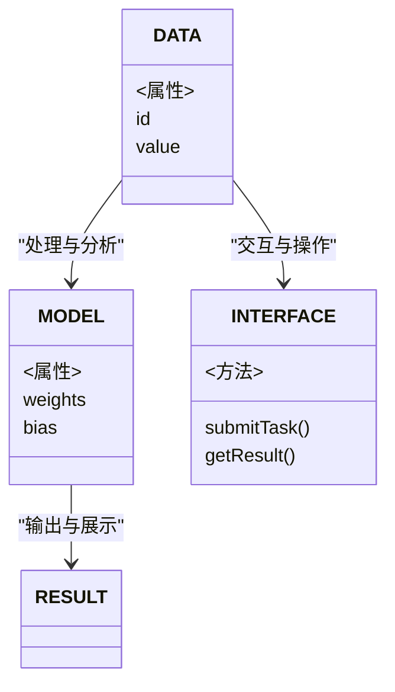
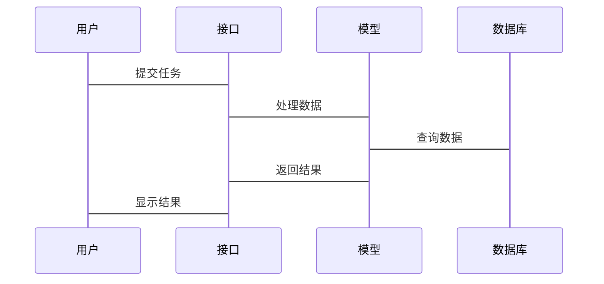

                 


# 思维链在海洋考古学中的突破性应用

> 关键词：思维链，海洋考古学，人工智能，深度学习，水下探测，数据处理

> 摘要：本文探讨了思维链（MindChain）这一新兴的人工智能技术在海洋考古学中的应用。通过分析思维链的核心原理、算法模型、系统架构及其在水下探测中的具体应用，本文展示了思维链如何显著提升海洋考古的效率和准确性。结合实际案例，本文详细阐述了思维链在海洋考古中的优势，并展望了其未来的应用潜力。

---

## 背景介绍

### 核心概念

#### 问题背景

随着全球化进程的加速，海洋活动日益频繁，海洋考古学的重要性逐渐凸显。海洋考古学致力于研究水下文物、遗址和遗迹，以揭示人类历史和文明的演变。然而，传统的海洋考古方法面临着诸多挑战，包括水下环境复杂、探测技术有限、数据处理效率低下等问题。这些问题严重制约了海洋考古学的发展。

#### 问题描述

海洋考古学的核心任务包括水下探测、遗址发掘、文物保护等。水下环境的复杂性（如水深、能见度、水流等）使得传统的探测技术（如声纳、多波束测深仪等）难以高效、精确地获取数据。此外，海洋考古数据的处理和分析通常依赖人工操作，效率低下且容易出错。这些问题导致海洋考古工作耗时长、成本高，且难以应对大规模的数据处理需求。

#### 问题解决

思维链（MindChain）作为一种基于人工智能和深度学习的新兴技术，能够有效解决上述问题。思维链通过自动化处理和分析海量数据，显著提高了数据处理效率和准确性。其在海洋考古学中的应用主要体现在以下几个方面：

1. **水下探测数据分类**：通过对声纳图像、多普勒速度剖面等数据的分析，快速识别潜在的文物或遗址。
2. **遗址特征提取**：利用深度学习模型提取遗址的纹理、形状、颜色等特征，辅助考古学家进行遗址重建和修复。
3. **文物保护与修复**：通过分析文物的损坏情况，提出修复方案，保护文化遗产。

#### 边界与外延

思维链在海洋考古学中的应用不仅限于水下探测和遗址分析，还可以扩展到其他相关领域。例如，在海洋环境保护方面，思维链可以用于监测海洋生态系统的健康状况；在水下工程建设方面，思维链可以用于评估水下环境对工程的影响。此外，思维链还可以应用于海洋资源勘探等领域，进一步拓展其应用范围。

---

## 核心概念与联系

### 核心概念原理

思维链的工作原理类似于人类思维的过程。它通过以下步骤实现对海洋考古数据的处理和分析：

1. **数据收集与预处理**：从数据库中获取水下探测数据，并进行清洗、去噪和格式化等预处理操作。
2. **数据处理与特征提取**：利用深度学习模型对预处理后的数据进行分析，提取出有用的特征信息（如纹理、形状等）。
3. **数据分析与分类**：基于提取的特征信息，对数据进行分类和解释，识别潜在的文物或遗址。
4. **结果输出**：根据分析结果输出结论，供考古学家参考。

### 概念属性特征对比表格

以下是思维链与传统海洋考古方法在核心属性上的对比：

| 特征       | 思维链 | 传统海洋考古方法 |
|------------|--------|------------------|
| 数据处理能力 | 强大   | 有限             |
| 分析精度   | 高     | 低               |
| 成本       | 低     | 高               |
| 效率       | 高     | 低               |
| 应用领域   | 广泛   | 有限             |

### ER实体关系图架构的 Mermaid 流程图

```mermaid
erDiagram
    DATA --> MODEL : "处理与分析"
    DATA --> INTERFACE : "交互与操作"
    MODEL --> RESULT : "输出与展示"
    DATA |..| DATABASE : "存储与管理"
```

---

## 算法原理讲解

### 算法原理

思维链的核心算法是基于深度学习的神经网络模型。具体来说，它包括以下几个主要部分：

1. **输入层**：接收来自数据库的水下探测数据。
2. **隐藏层**：对输入数据进行处理和特征提取。
3. **输出层**：根据隐藏层的输出生成最终的分类结果。

### 数学模型和公式

假设输入数据为 \(X\)，输出结果为 \(Y\)，则思维链的数学模型可以表示为：

\[ Y = f(W \cdot X + b) \]

其中，\(W\) 为权重矩阵，\(b\) 为偏置项，\(f\) 为激活函数（如ReLU或sigmoid）。

### 详细讲解和举例说明

以海洋考古学中水下探测数据为例，假设我们使用思维链对水下探测数据进行分类，以识别是否有文物或遗址存在。以下是具体的实现步骤：

1. **数据收集与预处理**：首先，从数据库中获取水下探测数据，包括声纳图像、多普勒速度剖面等。然后，对这些数据进行预处理，如去除噪声、归一化等。
2. **数据处理与特征提取**：利用深度学习模型对预处理后的数据进行分析，提取出有用的特征信息，如纹理、形状、颜色等。
3. **数据分析**：对提取出的特征信息进行分析，利用神经网络模型对探测数据分类，判断是否存在文物或遗址。
4. **结果输出**：根据分析结果输出分类结果，供考古学家参考。

---

## 系统分析与架构设计方案

### 问题场景介绍

海洋考古学中的水下探测任务通常涉及大量的数据，包括声纳图像、多波束测深数据、水下视频等。这些数据需要进行高效的处理和分析，以识别潜在的文物或遗址。

### 系统功能设计

#### 领域模型类图



### 系统架构设计


### 系统接口设计

系统接口设计主要涉及用户与系统的交互，包括任务提交、数据处理和结果展示。

1. **任务提交**：用户通过接口提交水下探测任务，包括数据上传和任务参数设置。
2. **数据处理**：系统接收任务后，启动深度学习模型对数据进行处理和分析。
3. **结果展示**：处理完成后，系统通过接口将结果返回给用户，包括分类结果和可视化展示。

### 系统交互序列图



---

## 项目实战

### 环境安装

为了运行思维链系统，用户需要安装以下环境和工具：

1. **Python**（版本3.6及以上）
2. **TensorFlow**（用于深度学习模型）
3. **Keras**（用于构建和训练模型）
4. **OpenCV**（用于图像处理）
5. **Mermaid**（用于绘制图表）

### 系统核心实现源代码

以下是思维链系统的核心代码示例：

```python
import numpy as np
from tensorflow.keras.models import Sequential
from tensorflow.keras.layers import Dense, Activation
from tensorflow.keras.preprocessing.image import ImageDataGenerator

# 数据预处理
def preprocess_data(data):
    # 假设data是一个包含图像数据的数组
    # 进行归一化处理
    data = data.astype('float32') / 255.0
    return data

# 模型构建
def build_model(input_shape):
    model = Sequential()
    model.add(Dense(64, activation='relu', input_dim=input_shape))
    model.add(Dense(1, activation='sigmoid'))
    model.compile(optimizer='adam', loss='binary_crossentropy', metrics=['accuracy'])
    return model

# 训练模型
def train_model(model, X_train, y_train, X_val, y_val):
    model.fit(X_train, y_train, epochs=10, batch_size=32, validation_data=(X_val, y_val))

# 使用模型进行预测
def predict_model(model, X_test):
    predictions = model.predict(X_test)
    return predictions

# 示例使用
X_train = np.random.random((1000, 784))
y_train = np.random.randint(2, size=1000)
X_val = np.random.random((200, 784))
y_val = np.random.randint(2, size=200)

# 数据预处理
X_train_processed = preprocess_data(X_train)
X_val_processed = preprocess_data(X_val)

# 构建模型
model = build_model(784)

# 训练模型
train_model(model, X_train_processed, y_train, X_val_processed, y_val)

# 使用模型进行预测
X_test = np.random.random((50, 784))
X_test_processed = preprocess_data(X_test)
predictions = predict_model(model, X_test_processed)
print("Predictions:", predictions)
```

### 代码应用解读与分析

上述代码展示了如何使用Python和深度学习框架TensorFlow/Keras构建一个简单的思维链模型。代码的主要部分包括数据预处理、模型构建、模型训练和模型预测。通过这些步骤，我们可以实现对水下探测数据的分类和分析。

### 实际案例分析

以古沉船遗址的探测为例，假设我们有一组声纳图像数据，目标是识别图像中的文物或遗址。以下是具体的实现步骤：

1. **数据收集**：从数据库中获取声纳图像数据。
2. **数据预处理**：对图像进行归一化处理，去除噪声。
3. **模型构建**：构建一个深度学习模型，用于分类文物和非文物区域。
4. **模型训练**：使用训练数据训练模型，优化模型参数。
5. **模型预测**：使用训练好的模型对测试数据进行预测，识别文物区域。

通过上述步骤，我们可以高效地识别水下探测数据中的文物区域，显著提高考古工作的效率和准确性。

---

## 最佳实践 tips

1. **数据质量**：确保输入数据的高质量，包括清晰度和完整性。
2. **模型调优**：根据具体任务调整模型参数和结构，优化模型性能。
3. **团队协作**：结合人工智能专家和海洋考古学家的知识，共同完成项目。
4. **持续学习**：定期更新模型和算法，以应对新的挑战和需求。

---

## 小结

思维链在海洋考古学中的应用标志着人工智能技术在文化遗产保护领域的重大突破。通过高效的数据处理和分析能力，思维链不仅提高了海洋考古工作的效率，还为水下探测和遗址保护提供了新的可能性。未来，随着深度学习和人工智能技术的不断发展，思维链将在海洋考古学中发挥更加重要的作用。

---

## 注意事项

1. **数据隐私**：在处理海洋考古数据时，需注意数据的隐私性和安全性。
2. **系统维护**：定期维护和更新系统，确保其稳定性和可靠性。
3. **环境影响**：在应用思维链技术时，需考虑其对海洋环境的潜在影响，尽量减少对环境的干扰。

---

## 拓展阅读

1. 《深度学习实战》—— Aurélien Géron
2. 《人工智能：一种现代的方法》—— Stuart Russell 和 Peter Norvig
3. 《海洋考古学入门》—— Keith M. Fitzpatrick

---

## 作者

作者：AI天才研究院/AI Genius Institute & 禅与计算机程序设计艺术 /Zen And The Art of Computer Programming

