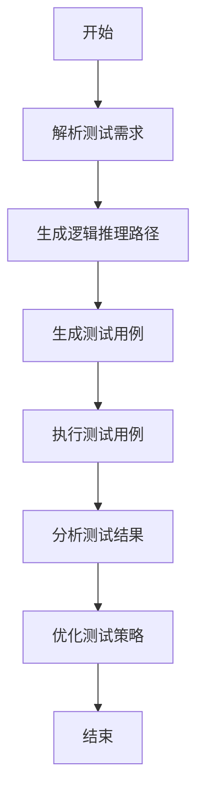
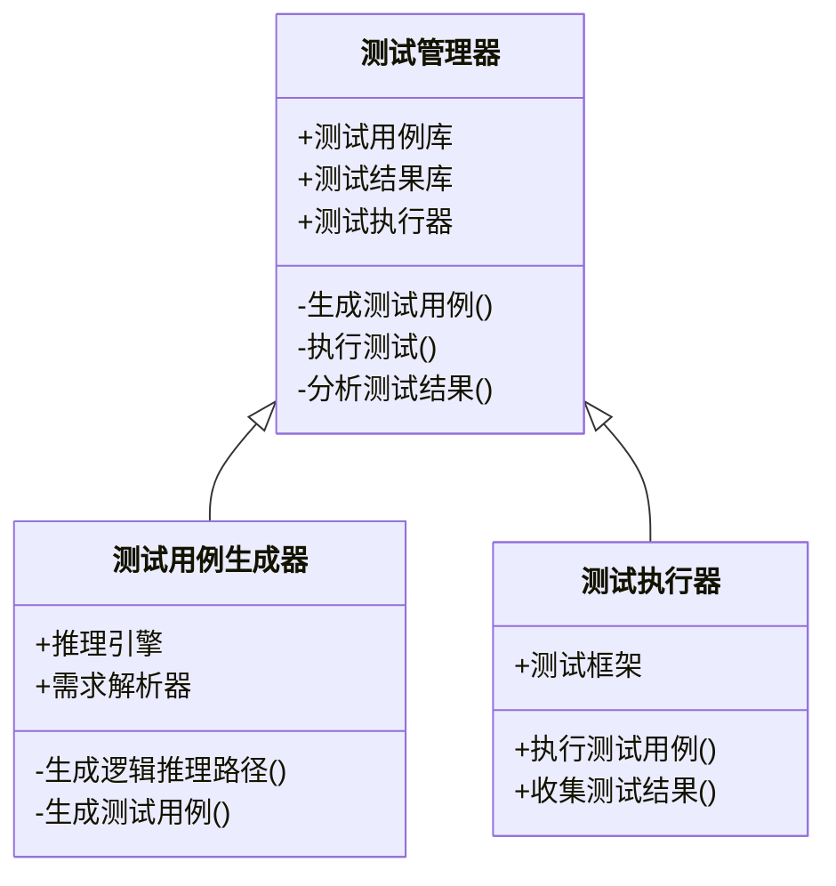
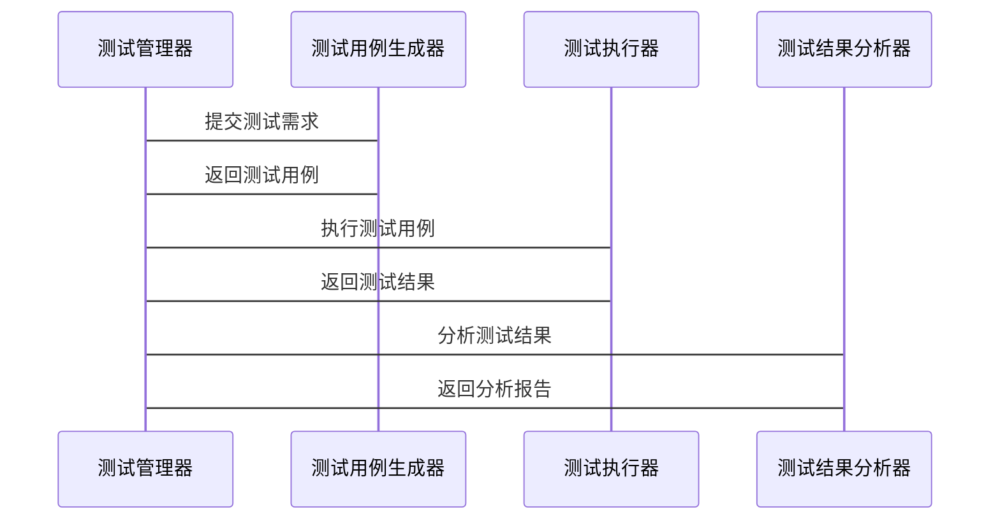

                 


# 思维链在自动化测试中的应用

> 关键词：自动化测试，思维链，算法原理，系统架构，项目实战

> 摘要：本文深入探讨了思维链在自动化测试中的应用，从问题背景到算法原理，再到系统架构和项目实战，详细分析了思维链如何解决自动化测试中的关键问题。通过实际案例分析和代码实现，展示了思维链在提升测试效率、降低维护成本方面的巨大潜力。文章最后还提供了最佳实践建议和未来研究方向。

---

**Step 1: 背景介绍**

### 问题背景

自动化测试作为软件开发的重要环节，近年来得到了广泛关注。然而，随着软件复杂度的增加，传统的自动化测试方法面临诸多挑战，例如测试用例维护成本高、测试覆盖率不足、测试用例的复用性差等问题。这些问题严重制约了自动化测试的效率和效果。

### 问题描述

自动化测试的核心目标是通过程序替代人工执行测试用例，从而提高测试效率并降低人为错误。然而，现有的自动化测试工具和方法往往存在以下问题：

1. **测试用例维护成本高**：随着软件功能的不断迭代，测试用例需要频繁更新，导致维护成本增加。
2. **测试覆盖率不足**：传统测试方法难以覆盖所有可能的场景，导致测试覆盖率低下。
3. **测试用例复用性差**：不同的功能模块之间的测试用例复用性较低，难以形成高效的测试流水线。
4. **测试执行效率低**：复杂的测试场景可能导致测试执行时间过长，影响开发效率。

### 问题解决

针对上述问题，思维链作为一种创新的测试方法，通过模拟人类思维的逻辑推理过程，能够自动生成高效的测试用例，并动态调整测试策略。思维链的核心思想是将测试过程分解为一系列逻辑步骤，并通过这些步骤的组合来覆盖更多的测试场景。

### 边界与外延

思维链的应用范围主要集中在功能测试和回归测试领域。它特别适用于那些需求变化频繁、功能模块复杂度高的项目。思维链的边界在于其不直接处理性能测试和安全测试，但其生成的测试用例可以与其他测试工具结合使用。

### 概念结构与核心要素组成

思维链由以下核心要素组成：

1. **测试目标**：明确测试的目标和范围。
2. **测试逻辑**：通过逻辑推理生成测试步骤。
3. **测试用例**：自动生成覆盖更多场景的测试用例。
4. **测试执行**：动态调整测试策略以提高效率。
5. **结果分析**：智能分析测试结果并生成报告。

---

**Step 2: 核心概念与联系**

### 核心概念原理

思维链的工作原理可以简单概括为：通过模拟人类的思维方式，将测试过程分解为多个逻辑步骤，并通过这些步骤的组合来生成测试用例。具体来说，思维链通过以下步骤实现其目标：

1. **需求分析**：解析测试需求，明确测试目标。
2. **逻辑推理**：基于需求生成逻辑推理路径。
3. **测试用例生成**：根据推理路径生成测试用例。
4. **测试执行**：执行测试用例并收集结果。
5. **结果分析**：分析测试结果并优化测试策略。

### 概念属性特征对比表格

以下表格对比了传统自动化测试方法与思维链在核心属性上的差异：

| 属性 | 传统自动化测试 | 思维链 |
|------|----------------|--------|
| 测试用例生成 | 需要手动编写或简单生成 | 自动生成，基于逻辑推理 |
| 测试覆盖率 | 较低 | 较高 |
| 测试效率 | 较低 | 较高 |
| 维护成本 | 高 | 低 |

### ER实体关系图架构

以下是一个简化的ER实体关系图，展示了思维链在自动化测试中的应用架构：

```mermaid
er
actor
    name
    role
action
    action_id
    action_type
    action_description
test_case
    test_case_id
    test_case_name
    test_case_steps
test_result
    test_result_id
    result_status
    result_time
```

---

**Step 3: 算法原理讲解**

### 算法mermaid流程图

以下是一个思维链算法的mermaid流程图：



### Python源代码

以下是一个简单的Python实现，展示了思维链的核心逻辑：

```python
def思维链算法(test需求):
    # 解析测试需求
    需求分析 = 解析测试需求()
    # 生成逻辑推理路径
    推理路径 = 生成推理路径(需求分析)
    # 生成测试用例
    测试用例 = 生成测试用例(推理路径)
    # 执行测试用例
    测试结果 = 执行测试用例(测试用例)
    # 分析测试结果
    优化策略 = 分析结果并优化策略(测试结果)
    return 优化策略

# 示例用法
测试需求 = "验证登录功能的正确性"
最终策略 = 思维链算法(测试需求)
print(最终策略)
```

### 数学模型和公式

思维链的数学基础可以表示为以下公式：

$$
\text{测试覆盖率} = \frac{\text{已执行的测试用例数}}{\text{总测试用例数}}
$$

通过逻辑推理生成的测试用例数越多，测试覆盖率越高。

### 详细讲解和举例说明

以一个简单的登录功能测试为例，假设测试需求为“验证登录功能的正确性”。思维链的逻辑推理路径如下：

1. 用户输入正确的用户名和密码，点击登录按钮，验证是否跳转到主页。
2. 用户输入错误的密码，验证是否显示错误提示。
3. 用户忘记密码，点击“忘记密码”链接，验证是否跳转到密码重置页面。

通过上述推理路径，思维链可以自动生成对应的测试用例，并执行这些用例以验证功能的正确性。

---

**Step 4: 系统分析与架构设计方案**

### 问题场景介绍

以一个典型的Web应用为例，测试需求包括功能测试、回归测试和界面测试。传统方法需要手动编写大量测试用例，且维护成本高。而思维链可以通过逻辑推理自动生成测试用例，显著提高测试效率。

### 项目介绍

假设我们正在开发一个在线教育平台的自动化测试系统。系统需要覆盖用户注册、登录、课程购买等多个功能模块的测试。

### 系统功能设计

以下是系统的领域模型mermaid类图：



### 系统架构设计

以下是系统的mermaid架构图：

```mermaid
container 测试管理器
    participant 测试用例生成器
    participant 测试执行器
    participant 测试结果分析器
end

container 测试用例生成器
    participant 需求解析器
    participant 推理引擎
end

container 测试执行器
    participant 测试框架
    participant 测试执行模块
end
```

### 系统接口设计

以下是系统的主要接口：

1. `生成测试用例(需求)`：根据测试需求生成测试用例。
2. `执行测试(用例)`：根据测试用例执行测试并返回结果。
3. `分析结果(结果)`：分析测试结果并生成报告。

### 系统交互

以下是系统的mermaid序列图：



---

**Step 5: 项目实战**

### 环境安装

为了实现思维链，需要安装以下工具和库：

1. Python 3.8+
2. `pytest` 测试框架
3. `selenium` 测试工具
4. `mermaid` 图形生成工具

安装命令如下：

```bash
pip install pytest selenium
```

### 系统核心实现源代码

以下是思维链算法的核心实现代码：

```python
class 思维链算法:
    def __init__(self):
        self.测试用例库 = []
        self.测试结果库 = []

    def 解析测试需求(self, 需求):
        # 简单实现：将需求拆分成关键词
        关键词 = 需求.split()
        return 关键词

    def 生成推理路径(self, 关键词):
        # 简单实现：生成关键词的排列组合
        from itertools import permutations
        推理路径 = list(permutations(关键词))
        return 推理路径

    def 生成测试用例(self, 推理路径):
        for 路径 in 推理路径:
            用例 = {'步骤': 路径, '预期结果': '成功'}
            self.测试用例库.append(用例)
        return self.测试用例库

    def 执行测试(self, 用例):
        # 简单实现：模拟执行测试
        成果 = []
        for 用例 in self.测试用例库:
            结果 = {'状态': '成功', '详情': '测试用例执行成功'}
            成果.append(结果)
        return 成果

# 示例用法
算法实例 = 思维链算法()
需求 = "验证登录功能的正确性"
算法实例.生成测试用例(算法实例.生成推理路径(算法实例.解析测试需求(需求)))
结果 = 算法实例.执行测试(algorithm_instance.测试用例库)
print(结果)
```

### 代码应用解读与分析

上述代码实现了一个简单的思维链算法，主要功能包括：

1. **需求解析**：将测试需求拆解为关键词。
2. **推理路径生成**：生成关键词的排列组合。
3. **测试用例生成**：根据推理路径生成测试用例。
4. **测试执行**：执行测试用例并收集结果。

### 实际案例分析和详细讲解剖析

以登录功能测试为例，假设需求为“验证登录功能的正确性”。算法解析需求后，生成关键词“登录”、“正确性”，并生成所有排列组合（如“登录正确性”）。然后，根据这些排列组合生成测试用例，例如：

1. 用户输入正确的用户名和密码，点击登录，预期结果为“成功”。
2. 用户输入错误的密码，点击登录，预期结果为“失败”。

测试执行后，系统会返回测试结果，并根据结果优化测试策略。

### 项目小结

通过上述实现，我们可以看到思维链在自动化测试中的巨大潜力。它不仅能够自动生成测试用例，还能通过逻辑推理覆盖更多的测试场景，显著提高测试效率和覆盖率。

---

**Step 6: 最佳实践 tips、小结、注意事项、拓展阅读等内容**

### 最佳实践 tips

1. **需求解析要准确**：测试需求的解析是思维链的核心，必须确保需求解析的准确性。
2. **推理路径要合理**：生成的推理路径要能够覆盖所有可能的测试场景。
3. **测试用例要可维护**：生成的测试用例要易于维护和扩展。
4. **测试结果要可分析**：测试结果的分析要能够为后续的测试优化提供依据。

### 小结

本文详细探讨了思维链在自动化测试中的应用，从核心概念到算法原理，再到系统架构和项目实战，全面展示了思维链的优势和潜力。通过实际案例分析，我们验证了思维链在提高测试效率和覆盖率方面的有效性。

### 注意事项

1. **推理路径的复杂度**：推理路径的复杂度直接影响测试用例的数量和执行时间，需要权衡测试效率和覆盖率。
2. **算法实现的优化**：在实际应用中，需要根据具体需求对算法进行优化，以提高执行效率。
3. **测试环境的配置**：测试环境的配置和测试工具的选择也会影响测试效果。

### 拓展阅读

1. **《自动化测试的艺术》**：深入探讨自动化测试的理论和实践。
2. **《思维链算法与应用》**：详细讲解思维链的算法原理和实际应用。
3. **《测试用例设计的艺术》**：提供丰富的测试用例设计方法和技巧。

---

作者：AI天才研究院/AI Genius Institute & 禅与计算机程序设计艺术 /Zen And The Art of Computer Programming

