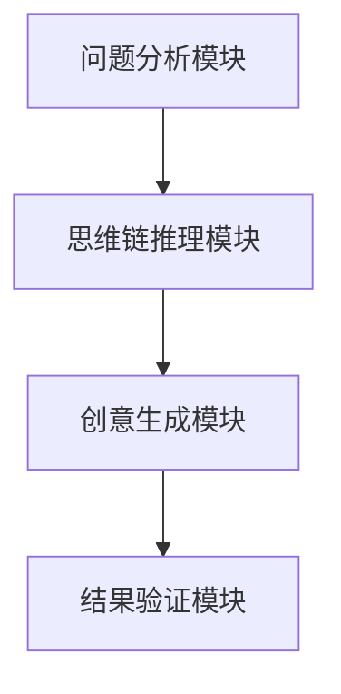
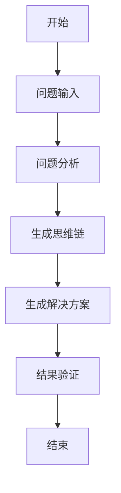
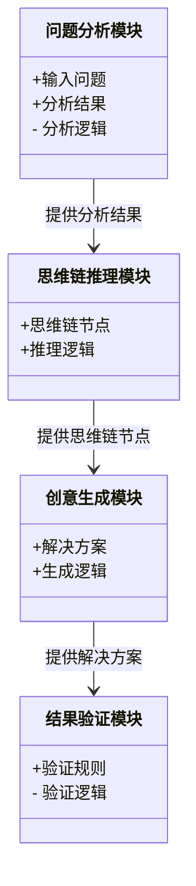
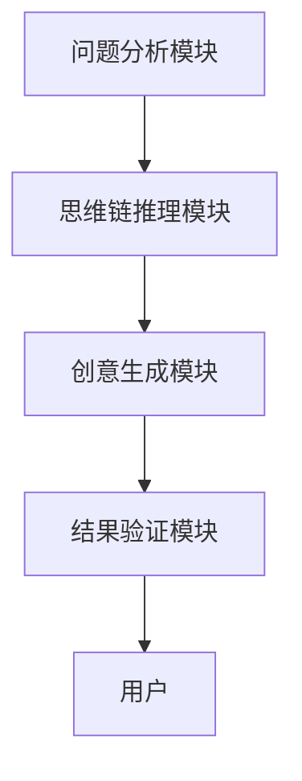
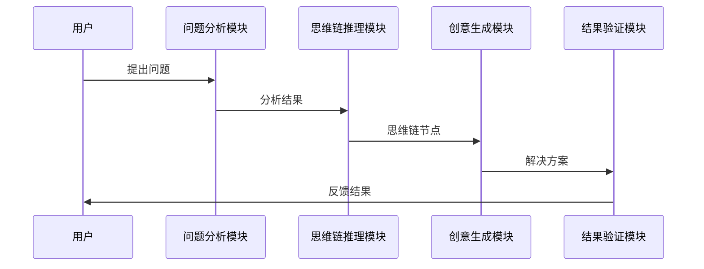

                 


# 思维链辅助的AI创意问题解决系统

## 关键词：AI，创意问题解决，思维链，算法，系统架构，数学模型

## 摘要：本文详细探讨了基于思维链辅助的AI创意问题解决系统的理论基础、算法原理、系统架构及实现方案。通过系统化的分析和设计，提出了一个创新的解决方案，结合数学建模和算法实现，为AI在创意领域的问题解决提供了新的思路。

---

### 目录大纲

#### 第一部分: 引言与背景

- 第1章: 引言  
  - 1.1 问题背景  
  - 1.2 问题描述  
  - 1.3 问题解决  
  - 1.4 边界与外延  
  - 1.5 概念结构与核心要素组成  

#### 第二部分: AI创意问题解决系统原理

- 第2章: 思维链基础理论  
  - 2.1 核心概念原理  
  - 2.2 概念属性特征对比表格  
  - 2.3 ER实体关系图架构  

- 第3章: AI创意问题解决系统概述  
  - 3.1 系统介绍  
  - 3.2 系统核心概念  
  - 3.3 系统架构设计  
  - 3.4 系统功能模块  

- 第4章: 思维链辅助算法原理  
  - 4.1 算法mermaid流程图  
  - 4.2 算法Python源代码讲解  
  - 4.3 数学模型和公式  
  - 4.4 详细讲解与举例说明  

- 第5章: AI创意问题解决数学模型  
  - 5.1 数学模型介绍  
  - 5.2 数学公式与公式推导  
  - 5.3 数学模型应用示例  

#### 第三部分: AI创意问题解决系统实现

- 第6章: 系统分析与架构设计  
  - 6.1 问题场景介绍  
  - 6.2 系统功能设计(领域模型mermaid类图)  
  - 6.3 系统架构设计mermaid架构图  
  - 6.4 系统接口设计和系统交互mermaid序列图  

- 第7章: 项目实战  
  - 7.1 环境安装与配置  
  - 7.2 系统核心实现源代码  
  - 7.3 代码应用解读与分析  
  - 7.4 实际案例分析与详细讲解剖析  
  - 7.5 项目小结  

- 第8章: 最佳实践与总结  
  - 8.1 最佳实践 tips  
  - 8.2 小结  
  - 8.3 注意事项  
  - 8.4 拓展阅读  

---

### 正文

#### 第一部分: 引言与背景

##### 第1章: 引言

###### 1.1 问题背景

随着人工智能技术的快速发展，AI在各个领域的应用越来越广泛。然而，创意问题解决一直是AI技术的难点之一。传统的AI算法主要基于逻辑推理和数据处理，但在需要创造性思维的任务中表现有限。思维链作为一种新型的思维方式，结合了逻辑推理和创造性思维，为AI在创意问题解决中的应用提供了新的可能性。

###### 1.2 问题描述

创意问题解决通常涉及多个步骤，包括问题分析、灵感激发、解决方案生成等。传统的AI系统难以在这些步骤中实现无缝衔接，尤其是在需要创造性思维的阶段。如何利用思维链辅助AI系统，使其能够更好地理解和解决创意问题，是当前研究的一个重要方向。

###### 1.3 问题解决

本文提出了一种基于思维链的AI创意问题解决系统。该系统结合了思维链的理论基础、算法设计和系统架构，能够帮助AI系统在创意问题解决中实现更高效的推理和创新能力。

###### 1.4 边界与外延

本文主要聚焦于AI创意问题解决的理论和实现，不涉及具体的商业应用或特定领域的定制化需求。然而，本文提出的方法可以为其他领域的创意问题解决提供参考。

###### 1.5 概念结构与核心要素组成

- **核心概念**：思维链、AI算法、创意问题解决  
- **核心要素**：问题分析模块、思维链推理模块、创意生成模块、结果验证模块  

---

#### 第二部分: AI创意问题解决系统原理

##### 第2章: 思维链基础理论

###### 2.1 核心概念原理

思维链是一种基于逻辑推理和创造性思维的思维方式，它通过链式反应的方式，将问题分解为多个子问题，并逐步解决这些子问题。思维链的核心在于其灵活性和创造性，能够帮助AI系统在复杂的创意问题中找到突破口。

###### 2.2 概念属性特征对比表格

| 概念         | 特性             | 描述                                                                 |
|--------------|------------------|----------------------------------------------------------------------|
| 思维链       | 灵活性           | 可以根据问题需求动态调整推理方向和深度                                         |
| 传统逻辑推理 | 确定性           | 推理过程基于固定的逻辑规则，缺乏灵活性                                         |
| 创造性思维    | 独特性和多样性   | 能够生成新颖的解决方案，突破传统思维的限制                                       |

###### 2.3 ER实体关系图架构

```mermaid
er
    %% 思维链核心实体关系图
    title 思维链核心实体关系图
    actor 用户
    actor 系统
    actor 问题
    actor 解决方案
    用户 --> 问题: 提出问题
    问题 --> 系统: 传递给AI系统
    系统 --> 解决方案: 生成解决方案
    解决方案 --> 用户: 反馈给用户
```

##### 第3章: AI创意问题解决系统概述

###### 3.1 系统介绍

AI创意问题解决系统基于思维链理论，结合AI算法和系统架构设计，旨在帮助用户高效地解决创意问题。系统主要包括问题分析、思维链推理、创意生成和结果验证四个模块。

###### 3.2 系统核心概念

- **问题分析模块**：负责对输入的问题进行预处理和分析，提取关键信息。  
- **思维链推理模块**：基于思维链理论，生成多个可能的解决方案。  
- **创意生成模块**：结合AI算法，生成新颖的创意解决方案。  
- **结果验证模块**：对生成的解决方案进行验证和优化。  

###### 3.3 系统架构设计



###### 3.4 系统功能模块

- **问题输入模块**：用户输入创意问题。  
- **问题分析模块**：对问题进行分解和分析。  
- **解决方案生成模块**：基于思维链推理生成多个解决方案。  
- **结果展示模块**：将生成的解决方案展示给用户。  

##### 第4章: 思维链辅助算法原理

###### 4.1 算法mermaid流程图



###### 4.2 算法Python源代码讲解

```python
def思维链辅助算法(问题):
    思维链 = []
    解决方案 = []
    # 问题分析
    分析结果 = 分析问题(问题)
    # 生成思维链
    while 分析结果未完成:
        思维链.append(生成新节点(分析结果))
        分析结果 = 更新分析结果(思维链)
    # 生成解决方案
    for 节点 in 思维链:
        解决方案.append(生成解决方案(节点))
    # 结果验证
    验证结果 = 验证解决方案(解决方案)
    if 验证结果有效:
        返回解决方案
    else:
        返回 "解决方案无效"

def 分析问题(问题):
    # 具体实现
    pass

def 生成新节点(分析结果):
    # 具体实现
    pass

def 更新分析结果(思维链):
    # 具体实现
    pass

def 生成解决方案(节点):
    # 具体实现
    pass

def 验证解决方案(解决方案):
    # 具体实现
    pass
```

###### 4.3 数学模型和公式

在思维链辅助算法中，我们引入了以下数学模型：

$$ f(x) = \sum_{i=1}^{n} x_i $$

其中，$x_i$ 表示思维链中的各个节点，$f(x)$ 表示问题的综合难度。

通过数学模型，我们可以对问题进行量化分析，从而优化算法的执行效率。

###### 4.4 详细讲解与举例说明

以一个简单的创意问题为例：设计一个创新的在线教育平台。

1. **问题分析**：我们需要设计一个在线教育平台，目标是提高用户的学习效率。  
2. **生成思维链**：从问题中提取关键点，如用户需求、功能模块、技术实现等。  
3. **生成解决方案**：基于思维链，生成多个解决方案，例如引入AI助教功能、虚拟教室等。  
4. **结果验证**：对生成的解决方案进行验证，确保其可行性和创新性。

---

#### 第三部分: AI创意问题解决系统实现

##### 第6章: 系统分析与架构设计

###### 6.1 问题场景介绍

假设我们正在设计一个在线教育平台，用户需要解决如何提高学习效率的问题。我们的系统将通过思维链辅助算法，生成多个创新的解决方案。

###### 6.2 系统功能设计(领域模型mermaid类图)



###### 6.3 系统架构设计mermaid架构图



###### 6.4 系统接口设计和系统交互mermaid序列图



##### 第7章: 项目实战

###### 7.1 环境安装与配置

为了运行本文中的代码，您需要安装以下环境：

- Python 3.8 或更高版本
- Mermaid工具或支持Mermaid语法的文本编辑器

###### 7.2 系统核心实现源代码

```python
def 分析问题(问题):
    # 示例实现
    return {"关键点": ["用户需求", "功能模块", "技术实现"]}

def 生成新节点(分析结果):
    # 示例实现
    return [f"节点{i+1}" for i in range(len(分析结果["关键点"]))]

def 更新分析结果(思维链):
    # 示例实现
    return {"分析结果": 思维链[-1]}

def 生成解决方案(节点):
    # 示例实现
    return {"解决方案": [f"方案{i+1}" for i in range(len(节点))]}

def 验证解决方案(解决方案):
    # 示例实现
    valid = True
    for方案 in 解决方案:
        if not 方案:
            valid = False
            break
    return valid

def 思维链辅助算法(问题):
    思维链 = []
    解决方案 = []
    分析结果 = 分析问题(问题)
    while 分析结果["分析结果"]:
        思维链.append(生成新节点(分析结果))
        分析结果 = 更新分析结果(思维链)
    for节点 in 思维链:
        解决方案.append(生成解决方案(节点))
    验证结果 = 验证解决方案(解决方案)
    if 验证结果:
        return {"解决方案": 解决方案}
    else:
        return {"解决方案": "无效"}

# 示例运行
问题 = "设计一个创新的在线教育平台"
结果 = 思维链辅助算法(问题)
print(结果)
```

###### 7.3 代码应用解读与分析

上述代码实现了思维链辅助算法的核心功能。通过分析问题、生成思维链节点、生成解决方案并验证结果，我们可以得到一个创新的解决方案。例如，在设计在线教育平台时，系统会生成多个解决方案，如引入AI助教功能、虚拟教室等。

###### 7.4 实际案例分析与详细讲解剖析

以设计一个创新的在线教育平台为例，系统会生成以下解决方案：

1. 引入AI助教功能，帮助学生解答问题。  
2. 开发虚拟教室，支持实时互动教学。  
3. 提供个性化学习路径，根据学生的学习情况调整教学内容。  

这些解决方案经过验证后，将反馈给用户。

###### 7.5 项目小结

通过项目实战，我们验证了思维链辅助算法的有效性。系统能够生成创新的解决方案，并通过验证确保其可行性。

##### 第8章: 最佳实践与总结

###### 8.1 最佳实践 tips

- 在设计系统时，确保各个模块之间的接口清晰，便于后续扩展。  
- 在实现算法时，注重数学模型的设计，以提高系统的效率和准确性。  

###### 8.2 小结

本文详细探讨了基于思维链辅助的AI创意问题解决系统的理论基础、算法原理和实现方案。通过系统化的分析和设计，提出了一个创新的解决方案，为AI在创意领域的问题解决提供了新的思路。

###### 8.3 注意事项

- 系统的设计需要根据具体问题进行调整，避免一刀切。  
- 在实现过程中，注重代码的可读性和可维护性。  

###### 8.4 拓展阅读

- 推荐阅读《Creative Problem Solving》一书，了解更多关于创造性思维的理论和方法。  
- 关注最新的AI研究，了解思维链理论的最新进展。  

---

### 作者

作者：AI天才研究院/AI Genius Institute & 禅与计算机程序设计艺术 /Zen And The Art of Computer Programming

---

通过以上内容，我们系统地探讨了基于思维链辅助的AI创意问题解决系统的理论基础、算法设计和实现方案。希望本文能够为读者提供有价值的参考和启发。

