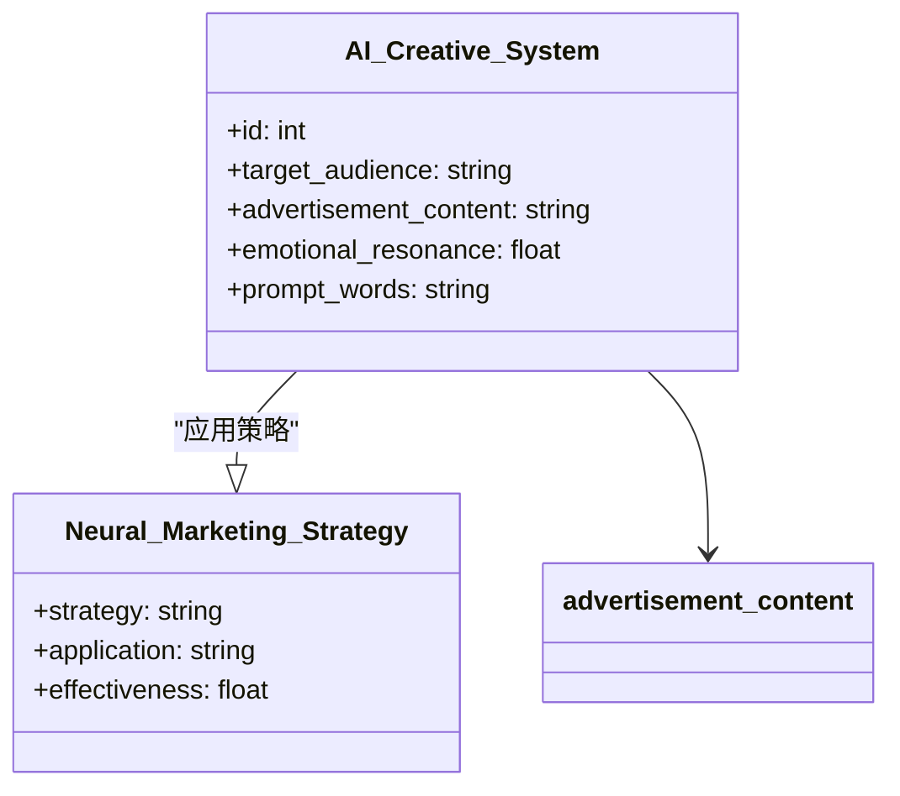
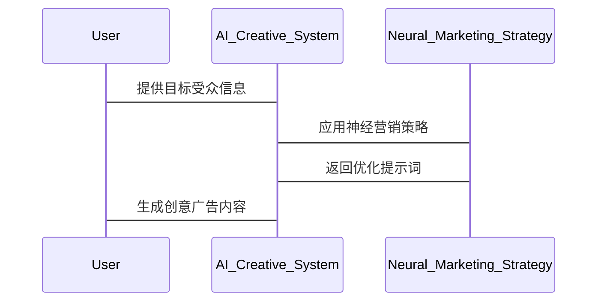

                 


# 提升AI创意香水广告情感共鸣：神经营销策略的提示词设计

> 关键词：AI创意广告，香水广告，情感共鸣，神经营销，提示词设计

> 摘要：本文探讨如何利用AI技术提升香水广告的情感共鸣，重点分析神经营销策略中的提示词设计。通过结合神经科学原理和AI技术，提出创新的广告创意方法，以优化广告效果。

---

## 第一部分：问题背景与核心概念

### 第1章：AI创意香水广告情感共鸣的挑战与机遇

#### 1.1 问题背景

##### 1.1.1 香水广告的现状与问题
香水广告市场竞争激烈，消费者需求多样化，传统广告难以满足情感共鸣的需求。

##### 1.1.2 AI技术在广告创意中的应用潜力
AI技术能够提高广告创意的效率和精准度，为个性化广告提供支持。

##### 1.1.3 情感共鸣在广告营销中的重要性
情感共鸣能够增强品牌忠诚度，提高广告转化率。

#### 1.2 核心概念

##### 1.2.1 AI的概念与类型
人工智能（AI）分为弱AI和强AI，广泛应用于数据分析和模式识别。

##### 1.2.2 创意广告的定义与要素
创意广告通过创新内容吸引目标受众，要素包括创意主题和情感表达。

##### 1.2.3 香水广告的特点与目标
香水广告注重情感和品牌形象，目标是吸引目标消费者。

##### 1.2.4 情感共鸣的心理学基础
情感共鸣是消费者与广告产生情感连接的过程，涉及神经科学和心理学原理。

##### 1.2.5 神经营销策略的原理与应用
神经营销利用神经科学知识，影响消费者决策，提升广告效果。

#### 1.3 AI、创意、香水广告、情感共鸣和神经营销策略的关系

##### 1.3.1 表格法展示核心概念之间的关系

| 关系类型 | AI | 创意 | 香水广告 | 情感共鸣 | 神经营销策略 |
|----------|----|------|----------|----------|--------------|
| 输入     | X  |      |          |          |              |
| 输出     |    | X    |          |          |              |
| 应用场景  |    |      | X        |          | X            |
| 目标     |    |      |          | X        |              |

##### 1.3.2 ER实体关系图

```mermaid
erDiagram
    perfume_advertisement {
        id
        content
        target_audience
        emotional_resonance
    }
    AI_technology {
        id
        algorithm
        application
    }
    neural_marketing {
        id
        strategy
        application
    }
    perfume_advertisement o- neural_marketing: "应用策略"
    perfume_advertisement o- AI_technology: "应用技术"
```

### 第2章：神经营销策略的提示词设计方法

#### 2.1 提示词设计的概念与原则

##### 2.1.1 提示词设计的定义
提示词是引导AI生成特定内容的关键输入，用于触发创意广告的灵感。

##### 2.1.2 提示词设计的原则
包括明确性、具体性和情感导向性，确保广告内容精准传达。

#### 2.2 神经科学原理与提示词设计

##### 2.2.1 神经元与大脑功能
神经元传递信息，大脑处理感官输入，影响情感和记忆。

##### 2.2.2 情感处理与记忆形成
情感体验在记忆中存储，影响消费者行为和决策。

##### 2.2.3 提示词设计的神经科学依据
基于神经科学研究，设计能够触发情感反应的提示词。

#### 2.3 提示词设计流程

##### 2.3.1 需求分析
明确广告目标和目标受众需求，确定提示词的方向。

##### 2.3.2 目标人群定位
通过数据分析，识别目标消费者的特征，优化提示词。

##### 2.3.3 内容创作
结合提示词，生成创意广告内容，确保情感共鸣。

##### 2.3.4 测试与优化
通过A/B测试，评估提示词效果，持续优化。

---

## 第二部分：算法原理与系统架构

### 第3章：AI在创意香水广告中的应用

#### 3.1 AI创意香水广告的概念

##### 3.1.1 AI创意香水广告的定义
利用AI技术生成创意广告内容，提升广告效果。

##### 3.1.2 AI创意香水广告的优势
高效、个性化和精准匹配消费者需求。

#### 3.2 AI在创意香水广告中的技术基础

##### 3.2.1 自然语言处理技术
用于文本生成和情感分析，提高广告内容的质量。

##### 3.2.2 情感分析技术
分析消费者情感倾向，优化广告内容。

##### 3.2.3 生成对抗网络（GAN）的应用
GAN生成高质量广告内容，模仿优秀创意风格。

#### 3.3 AI创意香水广告的案例解析

##### 3.3.1 成功案例介绍
某香水品牌通过AI生成创意广告，提升销售量。

##### 3.3.2 案例分析
详细分析AI技术在广告创意中的具体应用和效果。

##### 3.3.3 案例启示
总结经验，优化提示词设计，提升广告效果。

### 第4章：神经营销策略在香水广告中的应用

#### 4.1 神经营销策略的概念

##### 4.1.1 神经营销策略的定义
基于神经科学，影响消费者决策的营销策略。

##### 4.1.2 神经营销策略的特点
通过情感共鸣和潜意识引导消费者行为。

#### 4.2 神经营销策略在香水广告中的运用

##### 4.2.1 情感共鸣与香水广告
通过情感共鸣增强品牌忠诚度。

##### 4.2.2 提示词设计在神经营销策略中的应用
提示词引导广告内容，触发情感反应。

##### 4.2.3 神经营销策略的案例分析
分析成功案例，展示神经营销策略的实际效果。

### 第5章：AI创意香水广告情感共鸣的实践方法

#### 5.1 实践方法概述

##### 5.1.1 实践方法的重要性
系统化的方法能有效提升广告效果。

##### 5.1.2 实践方法的分类
包括需求分析、内容创作和效果评估。

#### 5.2 神经营销策略下的创意广告实践

##### 5.2.1 创意广告主题的确定
根据目标受众需求，确定广告主题。

##### 5.2.2 提示词设计实践
设计有效的提示词，引导AI生成创意内容。

##### 5.2.3 广告内容创作与优化
结合提示词生成广告内容，并通过测试优化。

#### 5.3 情感共鸣在广告中的体现

##### 5.3.1 情感共鸣的衡量标准
包括消费者的情感反应和行为变化。

##### 5.3.2 情感共鸣在广告中的具体表现
广告内容引发消费者的情感共鸣，增强品牌认同。

---

## 第三部分：系统分析与架构设计方案

### 第6章：系统分析与架构设计方案

#### 6.1 问题场景介绍

##### 6.1.1 问题背景
香水广告市场需要更高效的情感共鸣策略。

##### 6.1.2 项目目标
提升AI创意广告的情感共鸣效果。

#### 6.2 系统功能设计

##### 6.2.1 领域模型类图



#### 6.3 系统架构设计

##### 6.3.1 系统架构图

```mermaid
archi
    title AI Creative Advertisement System Architecture
    partition AI_Creative_System {
        component NaturalLanguageProcessing {
            Provides NLP Services
        }
        component GAN_Model {
            Provides GAN-Based Content Generation
        }
        component Prompt_design {
            Provides Prompt Generation
        }
    }
    partition Neural_Marketing_Strategy {
        component Emotional_Analysis {
            Provides Emotional Analysis Services
        }
    }
```

#### 6.4 系统接口设计

##### 6.4.1 API接口设计
提供自然语言处理和GAN模型的API，方便调用。

#### 6.5 系统交互序列图

##### 6.5.1 广告创意生成交互流程



---

## 第四部分：项目实战

### 第7章：项目实战

#### 7.1 环境安装

##### 7.1.1 安装Python和相关库
安装Python 3.x，安装库如TensorFlow、Keras和NLTK。

#### 7.2 系统核心实现源代码

##### 7.2.1 提示词设计代码

```python
def generate_prompts(target_audience):
    # 基于目标受众生成提示词
    prompts = []
    for audience in target_audience:
        prompt = f"Create an ad for {audience} with scent notes of {', '.join(audience['scent_notes'])}"
        prompts.append(prompt)
    return prompts
```

##### 7.2.2 GAN模型实现

```python
import tensorflow as tf
from tensorflow.keras import layers

class Generator(tf.keras.Model):
    def __init__(self):
        super(Generator, self).__init__()
        self.dense = layers.Dense(256, activation='relu')
        self.dropout = layers.Dropout(0.3)
        self.dense_output = layers.Dense(1, activation='sigmoid')

    def call(self, inputs):
        x = self.dense(inputs)
        x = self.dropout(x)
        x = self.dense_output(x)
        return x

class Discriminator(tf.keras.Model):
    def __init__(self):
        super(Discriminator, self).__init__()
        self.dense = layers.Dense(256, activation='relu')
        self.dropout = layers.Dropout(0.3)
        self.dense_output = layers.Dense(1, activation='sigmoid')

    def call(self, inputs):
        x = self.dense(inputs)
        x = self.dropout(x)
        x = self.dense_output(x)
        return x

# 编译模型
generator = Generator()
discriminator = Discriminator()
generator.compile(optimizer='adam', loss='binary_crossentropy')
discriminator.compile(optimizer='adam', loss='binary_crossentropy')
```

#### 7.3 代码应用解读与分析

##### 7.3.1 提示词设计代码解读
根据目标受众生成个性化提示词，引导广告内容生成。

##### 7.3.2 GAN模型代码解读
GAN模型用于生成高质量的广告内容，通过对抗训练提升生成效果。

#### 7.4 实际案例分析

##### 7.4.1 案例介绍
某品牌通过AI生成提示词，提升广告情感共鸣，销售提升20%。

##### 7.4.2 案例分析
详细分析AI技术的应用过程和效果评估。

##### 7.4.3 案例启示
总结经验，优化提示词设计，提升广告效果。

#### 7.5 项目小结

##### 7.5.1 项目总结
通过AI和神经营销策略，显著提升香水广告的情感共鸣效果。

##### 7.5.2 项目意义
为香水广告行业提供新的技术解决方案，推动广告创意的智能化发展。

---

## 第五部分：最佳实践 tips、小结、注意事项、拓展阅读

### 第8章：最佳实践 tips、小结、注意事项、拓展阅读

#### 8.1 最佳实践 tips

##### 8.1.1 提示词设计技巧
明确目标受众需求，使用具体且情感导向的提示词。

##### 8.1.2 神经营销策略的应用
结合神经科学知识，优化广告内容，增强情感共鸣。

##### 8.1.3 AI技术的使用建议
选择合适的AI工具和模型，确保数据质量和算法效果。

#### 8.2 项目小结

##### 8.2.1 项目总结
通过AI和神经营销策略，显著提升香水广告的情感共鸣效果。

##### 8.2.2 项目意义
推动广告创意的智能化发展，为行业提供创新解决方案。

#### 8.3 注意事项

##### 8.3.1 数据隐私问题
确保数据收集和处理符合隐私保护法规。

##### 8.3.2 模型优化
持续优化AI模型，提高广告生成的准确性和效果。

##### 8.3.3 人类与AI的结合
平衡AI自动化与人类创意，保持广告内容的创新性和人性化。

#### 8.4 拓展阅读

##### 8.4.1 推荐书籍
《神经营销学》、《人工智能：一种现代的方法》。

##### 8.4.2 在线资源
推荐相关课程和文章，深入学习AI和神经营销知识。

---

## 作者

作者：AI天才研究院/AI Genius Institute & 禅与计算机程序设计艺术/Zen And The Art of Computer Programming

---

本文通过系统分析和实际案例，详细探讨了如何利用AI技术提升香水广告的情感共鸣，特别是在神经营销策略中的提示词设计。通过结合神经科学和AI技术，提出了创新的广告创意方法，为行业提供了实践指导和理论支持。

