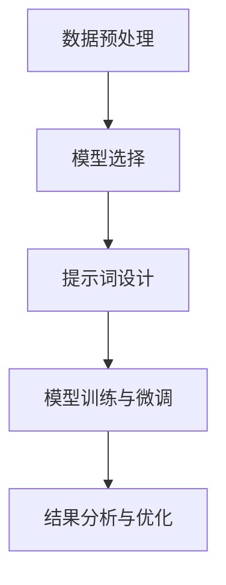
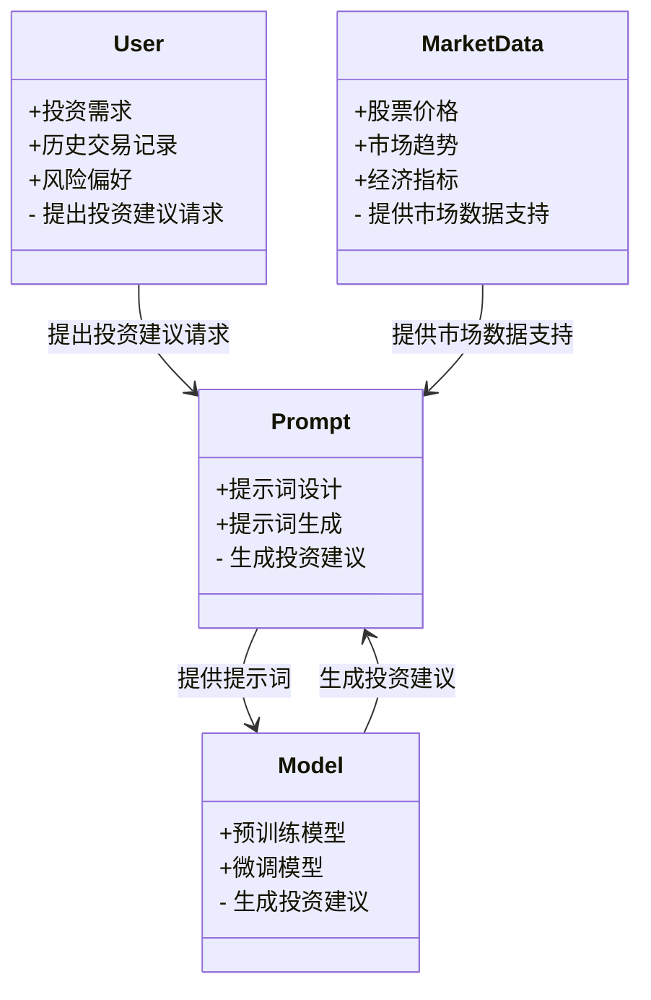
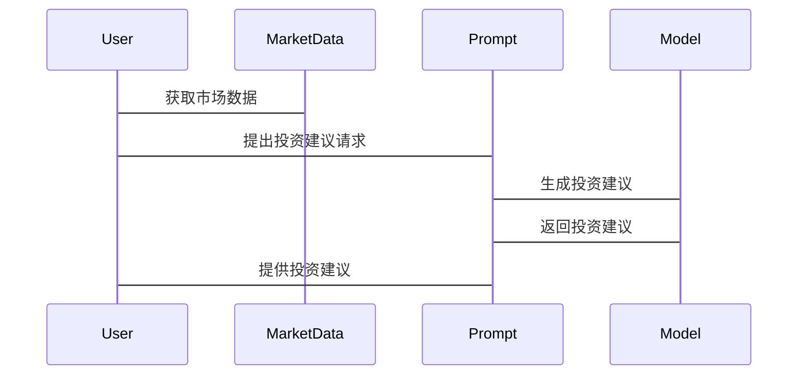

                 


# 提示词工程在智能投资顾问系统中的应用：个性化理财建议

> 关键词：提示词工程，智能投资顾问，自然语言处理，个性化理财，金融数据分析

> 摘要：本文探讨了提示词工程在智能投资顾问系统中的应用，详细分析了提示词设计、模型训练、系统架构等核心环节。通过案例分析和系统设计，展示了如何利用提示词工程提高投资建议的准确性和个性化程度，为金融领域的智能化转型提供参考。

---

## 第一部分：背景介绍

### 1. 提示词工程概述

#### 1.1 问题背景

提示词工程（Prompt Engineering）是近年来在人工智能领域兴起的一个研究方向。随着自然语言处理（NLP）技术的快速发展，特别是在预训练大模型如GPT系列的应用中，如何有效地设计和使用提示词（prompts）成为了一个关键问题。提示词工程的核心任务是优化输入提示，以提高模型生成结果的质量、效率和准确性。

在智能投资顾问系统中，提示词工程的应用尤为重要。这些系统需要处理大量的金融数据，分析市场动态，并根据用户的风险偏好和历史交易行为提供投资建议。提示词工程可以帮助系统更准确地理解用户需求，生成更具针对性的投资建议。

#### 1.2 提示词工程在智能投资顾问系统中的应用

智能投资顾问系统是一种利用人工智能技术为用户提供个性化理财建议的系统。这些系统通常需要处理大量的金融数据，分析市场动态，并根据用户的风险偏好和历史交易行为提供投资建议。提示词工程在此类系统中的应用至关重要，它可以提高系统对用户需求的响应速度，增强投资建议的相关性和实用性。

提示词工程在智能投资顾问系统中的应用主要体现在以下几个方面：
1. **用户需求分析**：通过设计有效的提示词，系统可以更准确地理解用户的投资目标、风险偏好和财务状况。
2. **市场数据处理**：提示词可以帮助模型更有效地处理复杂的金融数据，如股票价格、市场趋势等。
3. **投资建议生成**：通过优化提示词，系统可以生成更具个性化的投资建议，如资产配置、风险评估等。

#### 1.3 边界与外延

提示词工程不仅涉及自然语言处理的技术，还包括对金融知识的理解和应用。因此，它不仅需要关注技术层面的实现，还需要考虑业务逻辑的完整性。在智能投资顾问系统中，提示词工程的边界包括但不限于：如何获取和处理用户数据、如何设计有效的提示词、如何评估和优化系统性能等。外延则包括：与其他AI技术的结合、系统可扩展性、用户隐私保护等多个方面。

#### 1.4 核心概念与联系

提示词工程中的核心概念包括：
- **提示词**：引导模型进行特定任务输入的文本或代码。
- **模型**：如GPT系列等预训练大模型。
- **数据**：用于训练和测试的金融数据集。

提示词、模型和数据之间的联系在于：
- **提示词**决定了模型的输入，直接影响模型生成的输出。
- **模型**的预训练和微调决定了提示词的有效性。
- **数据**的质量和多样性影响模型的泛化能力和提示词的适应性。

#### 1.5 概念结构与核心要素组成

提示词工程的概念结构可以分解为以下几个核心要素：
- **数据采集与预处理**：收集并处理金融数据，确保数据的准确性和一致性。
- **提示词设计**：设计高效、直观、可定制的提示词，以便模型能够生成高质量的输出。
- **模型训练与微调**：基于收集的金融数据和提示词，对预训练模型进行训练和微调，以适应特定任务。
- **系统评估与优化**：通过评估系统性能，不断优化提示词设计和模型参数，提高系统的整体表现。

---

## 第二部分：核心概念与联系

### 2. 提示词设计原理

#### 2.1 提示词设计原则

提示词设计需要遵循以下原则：
- **明确性**：提示词应清晰、明确，避免歧义。
- **针对性**：提示词应针对特定任务或用户需求设计，提高准确性。
- **灵活性**：提示词应具有灵活性，以适应不同场景和用户需求。
- **简洁性**：提示词应简洁明了，避免冗余信息。

#### 2.2 提示词属性特征对比

以下是一个简单的提示词属性特征对比表格：

| 特征     | 说明                                                     | 例子                     |
| -------- | -------------------------------------------------------- | ------------------------ |
| 明确性   | 提示词应明确具体任务要求                             | “请为我分析当前市场趋势”     |
| 针对性   | 提示词应针对特定用户或任务需求                       | “根据用户A的历史交易记录”   |
| 灵活性   | 提示词应允许模型生成多样性的结果                     | “请从以下三个角度分析”     |
| 简洁性   | 提示词应避免冗余和无关信息                           | “简洁明了地给出投资建议”   |

#### 2.3 ER实体关系图架构

以下是一个简单的ER实体关系图架构，用于描述提示词工程中的关键实体及其关系：

```mermaid
erDiagram
    User ||--|{ InvestmentAdvice : 提出建议}
    MarketData ||--|{ InvestmentAdvice : 数据支持}
    Prompt ||--|{ InvestmentAdvice : 提示词}
    Model ||--|{ InvestmentAdvice : 模型依赖}
```

在上述ER图中，用户（User）、市场数据（MarketData）、提示词（Prompt）和模型（Model）之间的关系表明，用户通过提示词向模型提出投资建议请求，市场数据为投资建议提供支持，模型依赖提示词和市场数据生成投资建议。

---

## 第三部分：算法原理讲解

### 3. 提示词工程算法原理

#### 3.1 提示词工程的实现流程

提示词工程的实现流程如下：

1. **数据预处理**：收集并处理金融数据，确保数据的准确性和一致性。
2. **模型选择**：选择适合任务的预训练模型（如GPT系列）。
3. **提示词设计**：根据任务需求设计有效的提示词。
4. **模型训练与微调**：基于提示词和金融数据，对模型进行微调。
5. **结果分析与优化**：评估模型输出，优化提示词和模型参数。

以下是一个简化的提示词工程实现流程图：



#### 3.2 提示词工程的数学模型

提示词工程的数学模型可以表示为：

$$
P = f_{\text{prompt}}(x, y)
$$

其中：
- \( P \) 表示提示词。
- \( x \) 表示输入数据。
- \( y \) 表示输出目标。
- \( f_{\text{prompt}} \) 表示提示词函数。

以下是一个简单的提示词生成示例：

```python
def generate_prompt(user_query, market_data):
    prompt = f"基于用户{user_query}的投资需求和市场数据{market_data}，请提供个性化的投资建议。"
    return prompt
```

---

## 第四部分：系统分析与架构设计方案

### 4. 系统架构设计

#### 4.1 问题场景介绍

智能投资顾问系统需要处理以下问题：
- 如何高效地处理用户的投资需求和市场数据。
- 如何设计有效的提示词以提高投资建议的准确性。
- 如何优化系统架构以支持实时数据分析和个性化建议生成。

#### 4.2 系统功能设计

系统功能设计如下：



#### 4.3 系统架构设计

系统架构设计如下：


#### 4.4 系统接口设计

系统接口设计如下：



---

## 第五部分：项目实战

### 5.1 环境安装

#### 5.1.1 安装Python和相关库

```bash
pip install python
pip install numpy
pip install pandas
pip install transformers
```

### 5.2 系统核心实现源代码

#### 5.2.1 提示词设计代码

```python
def design_prompt(user_input):
    prompt = f"根据用户的投资需求{user_input}，请生成个性化的投资建议。"
    return prompt
```

#### 5.2.2 模型训练与微调代码

```python
from transformers import GPT2Tokenizer, GPT2Model

tokenizer = GPT2Tokenizer.from_pretrained('gpt2')
model = GPT2Model.from_pretrained('gpt2')
```

#### 5.2.3 系统交互代码

```python
def system_interaction(user_input):
    prompt = design_prompt(user_input)
    inputs = tokenizer(prompt, return_tensors='np')
    outputs = model.generate(**inputs)
    return outputs
```

### 5.3 实际案例分析

#### 5.3.1 案例分析

假设用户的投资需求为“希望投资股票市场，风险偏好中等”。系统会根据提示词生成相应的投资建议，如：

1. 投资比例：股票60%，债券30%，现金10%。
2. 推荐股票：科技股和消费股。
3. 风险提示：市场波动较大，需定期调整资产配置。

### 5.4 项目小结

通过以上实现，我们可以看到提示词工程在智能投资顾问系统中的应用潜力。提示词设计、模型训练和系统架构优化是实现个性化理财建议的关键步骤。

---

## 第六部分：最佳实践与小结

### 6.1 最佳实践

- **数据质量**：确保金融数据的准确性和完整性。
- **提示词优化**：定期评估和优化提示词，以提高投资建议的准确性。
- **系统维护**：及时更新市场数据和模型参数，确保系统的实时性和准确性。

### 6.2 小结

提示词工程在智能投资顾问系统中的应用为个性化理财建议的生成提供了新的思路。通过优化提示词设计、改进模型训练和优化系统架构，可以显著提高投资建议的质量和用户的满意度。

---

## 第七部分：注意事项与拓展阅读

### 7.1 注意事项

- **数据隐私**：确保用户数据的安全性和隐私性。
- **模型解释性**：提高模型的解释性，便于用户理解和信任。
- **系统稳定性**：确保系统的稳定性和可靠性，特别是在高并发场景下。

### 7.2 拓展阅读

- **《Prompt Engineering: A Comprehensive Guide》**：深入探讨提示词工程的核心概念和应用。
- **《AI in Finance: Revolutionizing Investment Advisory》**：介绍人工智能在金融领域的应用，特别是智能投资顾问系统。

---

## 结语

提示词工程作为人工智能领域的重要技术，正在逐步改变智能投资顾问系统的实现方式。通过本文的分析和实践，我们可以看到，提示词工程在提高投资建议的个性化和准确性方面具有巨大潜力。未来，随着技术的不断发展，提示词工程将在金融领域发挥更重要的作用。

---

## 作者

作者：AI天才研究院/AI Genius Institute & 禅与计算机程序设计艺术 /Zen And The Art of Computer Programming

