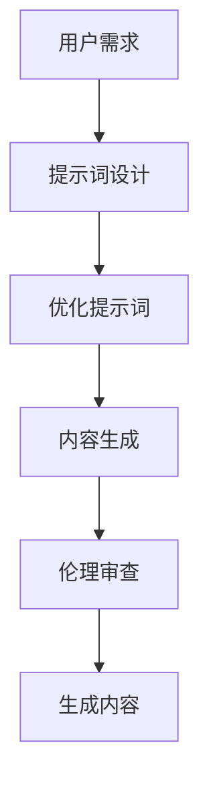
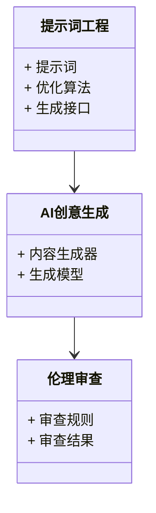
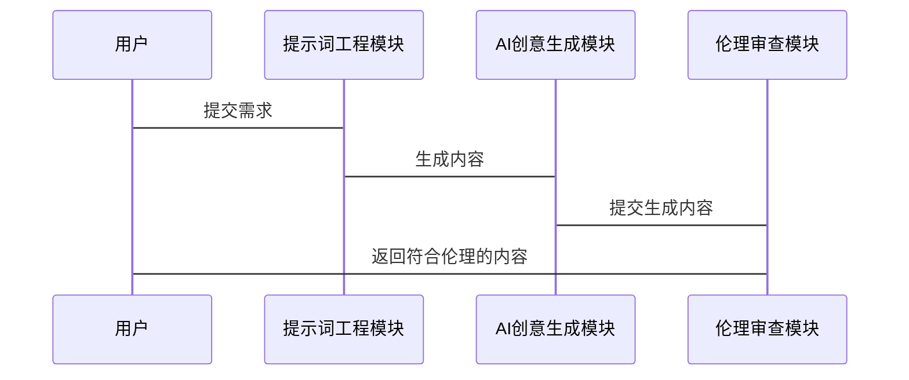

                 


# 提示词工程：优化AI创意与伦理的平衡

## 关键词：提示词工程、AI创意、伦理平衡、算法原理、系统架构

## 摘要：  
随着人工智能技术的快速发展，AI在创意产业中的应用越来越广泛，但同时也带来了创意与伦理平衡的挑战。本文通过分析AI创意的核心原理、伦理问题的根源，提出基于提示词工程的解决方案，并从算法、系统架构、项目实战等多个维度展开详细探讨，最终实现AI创意与伦理平衡的优化。文章内容包括问题背景、核心概念、算法原理、系统设计、项目实现等，旨在为AI创意与伦理平衡的研究和实践提供理论与实践指导。

---

# 提示词工程：优化AI创意与伦理的平衡

## 第一部分：引言与背景

### 1.1 问题背景

#### 1.1.1 AI的发展与应用现状  
近年来，人工智能技术取得了飞速发展，尤其是在自然语言处理、计算机视觉、生成式AI等领域，AI已经广泛应用于创意产业，如内容创作、艺术设计、音乐生成等。然而，AI的应用也引发了一系列伦理问题，例如版权归属、虚假信息、隐私泄露等。

#### 1.1.2 AI在创意产业中的应用  
AI在创意产业中的应用主要体现在以下几个方面：  
1. **内容生成**：AI可以生成文字、图像、音乐等内容，帮助创作者快速获取灵感或完成初稿。  
2. **风格迁移**：通过AI技术，可以将一种风格的作品转化为另一种风格，例如将照片转化为艺术画作。  
3. **自动化设计**：AI可以帮助设计师自动生成海报、UI界面等，提高设计效率。  

#### 1.1.3 AI伦理问题的提出  
随着AI在创意产业中的广泛应用，伦理问题逐渐浮现：  
1. **原创性争议**：AI生成的内容是否具有原创性？  
2. **版权归属**：AI生成的内容由谁拥有版权？  
3. **滥用风险**：AI可能被用于生成虚假信息或恶意内容，威胁社会信任。  

### 1.2 问题描述

#### 1.2.1 AI创意与伦理冲突  
AI创意的核心是通过算法生成内容，但这种生成过程缺乏人类的情感、意图和价值观的参与，导致内容可能缺乏深度或违背伦理规范。例如，AI生成的内容可能包含歧视性言论或误导性信息。  

#### 1.2.2 创意质量与伦理平衡的挑战  
AI生成的内容质量与伦理平衡之间存在矛盾：  
1. **质量优先**：过于追求生成效率可能导致内容缺乏深度，甚至出现不道德的内容。  
2. **伦理优先**：为了防止伦理问题，可能需要限制生成内容的范围，从而影响创意的多样性。  

#### 1.2.3 研究目的与意义  
本文旨在通过提示词工程（Prompt Engineering）优化AI创意与伦理平衡。通过设计合理的提示词，引导AI生成符合伦理规范且高质量的内容，从而解决AI创意与伦理冲突的问题。

### 1.3 问题解决

#### 1.3.1 提出解决方案的必要性  
提示词工程是连接人类意图与AI生成过程的关键桥梁。通过设计合适的提示词，可以引导AI生成符合伦理规范的内容，同时提升创意质量。  

#### 1.3.2 解决方案的技术路径  
1. **提示词设计**：通过分析伦理规范和创意需求，设计合理的提示词。  
2. **算法优化**：基于提示词调整AI模型的生成策略，确保生成内容符合伦理要求。  
3. **反馈机制**：通过用户反馈不断优化提示词和生成策略，形成闭环改进。  

### 1.4 边界与外延

#### 1.4.1 研究范围  
本文的研究范围主要集中在基于提示词工程的AI创意优化，重点关注生成内容的伦理平衡和质量提升。  

#### 1.4.2 研究方法的适用性  
提示词工程适用于需要明确指导的AI生成场景，特别适合需要平衡创意与伦理的领域，如内容创作、艺术设计等。  

### 1.5 概念结构与核心要素组成

#### 1.5.1 关键概念解释  
1. **提示词工程（Prompt Engineering）**：通过设计和优化提示词，引导AI生成符合特定目标的内容。  
2. **AI创意**：基于AI算法生成创意内容的过程。  
3. **伦理平衡**：在AI生成内容时，确保内容符合伦理规范。  

#### 1.5.2 核心要素之间的关系  
提示词工程是连接AI创意与伦理平衡的核心，通过提示词的设计和优化，AI可以生成既符合伦理规范又具有创意的内容。  

---

## 第二部分：核心概念与联系

### 2.1 核心概念原理

#### 2.1.1 提示词工程概述  
提示词工程是一种通过设计提示词来优化AI生成结果的技术。提示词可以是文本、图像或其他形式的输入，用于指导AI模型生成符合特定需求的内容。  

#### 2.1.2 AI创意原理  
AI创意的核心是通过算法生成创意内容。常见的生成方法包括基于深度学习的生成模型（如GPT、Diffusion）和基于规则的生成方法。  

#### 2.1.3 伦理学基本概念  
伦理学关注行为的道德性和正确性。在AI生成内容时，需要确保生成内容不违反伦理规范，例如不传播虚假信息、不歧视特定群体等。  

### 2.2 概念属性特征对比表格

| 概念       | 属性             | 特征对比               |
|------------|------------------|------------------------|
| 提示词工程  | 目标             | 引导生成内容的方向性   |
|            | 输入             | 文本、图像等           |
|            | 输出             | 高质量、符合伦理的内容 |
| AI创意     | 方法             | 基于深度学习或规则生成 |
|            | 输入             | 用户需求或提示词       |
|            | 输出             | 创意内容               |
| 伦理学     | 核心原则         | 正义、公正、尊重等     |
|            | 应用场景         | 生成内容的伦理审查     |
|            | 输出             | 符合伦理的内容         |

### 2.3 ER实体关系图架构

```mermaid
er
actor(AI模型) -[1..*]-> 提示词
actor(用户)    -[1..*]-> 提示词
提示词          <---[1]-> 生成内容
生成内容        <---[1]-> 伦理审查
```

---

## 第三部分：算法原理讲解

### 3.1 算法原理概述

#### 3.1.1 提示词工程算法框架  
提示词工程的核心是通过设计提示词优化生成结果。框架包括：  
1. 提示词设计：根据目标生成内容，设计合适的提示词。  
2. 提示词调整：通过反馈机制不断优化提示词。  
3. 内容生成：基于优化后的提示词生成内容。  

#### 3.1.2 AI创意算法原理  
AI创意算法基于生成模型，常见的模型包括：  
1. **GPT系列**：基于Transformer的生成模型，擅长文本生成。  
2. **Diffusion模型**：通过逐步生成图像，擅长高质量图像生成。  

#### 3.1.3 伦理平衡算法原理  
伦理平衡算法通过约束生成内容，确保内容符合伦理规范。常见的约束方法包括：  
1. **关键词过滤**：过滤敏感词汇或短语。  
2. **内容审查**：通过人工或AI模型对生成内容进行伦理审查。  

### 3.2 算法mermaid流程图



### 3.3 Python源代码详细阐述

#### 3.3.1 源代码结构与功能  
以下是一个简单的提示词工程示例代码：

```python
def optimize_prompt(prompt, iterations=5):
    for _ in range(iterations):
        prompt = refine_prompt(prompt)
        if is伦理合规(prompt):
            break
    return prompt

def refine_prompt(prompt):
    # 提示词优化逻辑
    return optimized_prompt
```

#### 3.3.2 算法原理与Python实现  
上述代码通过迭代优化提示词，确保生成内容符合伦理规范。`refine_prompt`函数负责优化提示词，`is伦理合规`函数用于检查提示词是否符合伦理要求。  

### 3.4 算法原理的数学模型和公式

#### 3.4.1 数学模型概述  
提示词工程的优化过程可以表示为一个优化问题：  
$$ \text{minimize} \; f(p) $$
其中，\( p \) 是提示词，\( f(p) \) 是提示词的优化目标函数。  

#### 3.4.2 数学公式详细解释  
优化提示词的过程可以表示为：  
$$ p^{(k+1)} = p^{(k)} + \alpha \cdot \nabla f(p^{(k)}) $$
其中，\( \alpha \) 是学习率，\( \nabla f(p^{(k)}) \) 是提示词优化的方向。  

### 3.5 举例说明

#### 3.5.1 实例一：提示词工程应用案例  
假设用户希望生成一篇关于环保的文章，提示词可以设计为：  
`生成一篇关于环保的文章，要求内容积极向上，避免使用歧视性语言。`  

#### 3.5.2 实例二：AI创意与伦理平衡案例  
生成一幅描绘未来城市的图像，提示词可以设计为：  
`描绘一个未来城市，要求画面明快，避免涉及暴力或不道德元素。`  

---

## 第四部分：系统分析与架构设计方案

### 4.1 问题场景介绍

#### 4.1.1 创意生成与伦理平衡的场景需求  
在创意生成场景中，用户需要生成高质量且符合伦理规范的内容。  
例如：  
1. 内容创作：生成一篇符合伦理规范的文章。  
2. 艺术设计：生成一幅符合伦理规范的图像。  

#### 4.1.2 系统设计的背景和目标  
系统设计的背景是AI生成内容的广泛应用，目标是通过提示词工程优化生成内容的质量与伦理合规性。  

### 4.2 项目介绍

#### 4.2.1 项目概述  
本项目旨在通过提示词工程优化AI创意与伦理平衡，实现高质量、符合伦理规范的内容生成。  

#### 4.2.2 项目目标与功能  
1. **目标**：优化AI生成内容的质量与伦理合规性。  
2. **功能**：  
   - 提示词设计与优化。  
   - 内容生成与伦理审查。  
   - 反馈机制与迭代优化。  

### 4.3 系统功能设计

#### 4.3.1 领域模型mermaid类图



#### 4.3.2 系统功能模块划分  
系统功能模块包括：  
1. **提示词工程模块**：负责提示词设计与优化。  
2. **AI创意生成模块**：负责内容生成。  
3. **伦理审查模块**：负责内容的伦理审查。  

### 4.4 系统架构设计

#### 4.4.1 系统架构mermaid架构图


#### 4.4.2 系统模块关系说明  
提示词工程模块通过优化提示词，引导AI创意生成模块生成内容，生成的内容经过伦理审查模块的检查后，最终输出符合伦理规范的内容。  

### 4.5 系统接口设计

#### 4.5.1 接口设计与功能  
1. **提示词接口**：接收用户需求，生成优化提示词。  
2. **生成接口**：基于提示词生成内容。  
3. **审查接口**：对生成内容进行伦理审查。  

#### 4.5.2 接口调用流程  
1. 用户通过提示词接口提交需求。  
2. 系统生成并优化提示词。  
3. 调用生成接口生成内容。  
4. 调用审查接口对生成内容进行伦理审查。  

### 4.6 系统交互

#### 4.6.1 系统交互mermaid序列图



#### 4.6.2 交互流程详细说明  
1. 用户提交需求。  
2. 提示词工程模块生成并优化提示词。  
3. AI创意生成模块基于提示词生成内容。  
4. 生成的内容经过伦理审查模块的检查。  
5. 符合伦理的内容返回给用户。  

---

## 第五部分：项目实战

### 5.1 环境安装

#### 5.1.1 系统环境搭建  
需要安装Python、深度学习框架（如TensorFlow、PyTorch）以及相关生成模型库（如GPT、Diffusion）。  

#### 5.1.2 环境配置与调试  
确保安装的库版本兼容，配置GPU支持以提升性能。  

### 5.2 系统核心实现源代码

#### 5.2.1 核心代码结构与功能  
以下是一个简单的提示词优化代码示例：

```python
def generate_content(prompt):
    # 调用AI生成模型
    return generated_content

def optimize_prompt(prompt):
    for _ in range(5):
        content = generate_content(prompt)
        if is_伦理合规(content):
            return content
        prompt = refine_prompt(prompt)
    return content

def refine_prompt(prompt):
    # 提示词优化逻辑
    return optimized_prompt
```

#### 5.2.2 代码实现细节解析  
上述代码通过迭代优化提示词，确保生成内容符合伦理规范。`is_伦理合规`函数用于检查内容是否合规，`refine_prompt`函数负责优化提示词。  

### 5.3 代码应用解读与分析

#### 5.3.1 代码应用场景分析  
代码适用于需要优化提示词的AI生成场景，例如内容创作、艺术设计等。  

#### 5.3.2 代码性能分析与优化  
1. **性能分析**：提示词优化过程可能需要多次迭代，影响生成效率。  
2. **优化策略**：通过并行计算或预训练模型优化生成速度。  

### 5.4 实际案例分析和详细讲解剖析

#### 5.4.1 案例选择与背景  
案例：生成一篇关于环保的文章，要求内容积极向上，避免使用歧视性语言。  

#### 5.4.2 案例分析与解读  
1. **提示词设计**：`生成一篇关于环保的文章，要求内容积极向上，避免使用歧视性语言。`  
2. **生成内容**：AI生成一篇符合要求的环保文章。  
3. **伦理审查**：检查文章内容是否符合伦理规范。  

#### 5.4.3 剖析与总结  
通过提示词工程优化，生成的内容既符合伦理规范，又满足用户需求。  

### 5.5 项目小结

#### 5.5.1 项目成果总结  
本项目通过提示词工程优化AI创意与伦理平衡，实现了高质量、符合伦理规范的内容生成。  

#### 5.5.2 项目中遇到的问题与解决方案  
1. **问题**：生成内容缺乏深度。  
2. **解决方案**：通过优化提示词，引导生成更高质量的内容。  

#### 5.5.3 项目的未来展望  
未来可以进一步研究提示词工程在更多领域的应用，例如教育、医疗等。  

---

## 第六部分：最佳实践 Tips

### 6.1 创意生成与伦理平衡的最佳实践

#### 6.1.1 提高创意质量的技巧  
1. **明确需求**：确保提示词清晰明了。  
2. **迭代优化**：通过反馈机制不断优化提示词。  

#### 6.1.2 实现伦理平衡的策略  
1. **关键词过滤**：过滤敏感词汇或短语。  
2. **内容审查**：通过人工或AI模型对生成内容进行伦理审查。  

### 6.2 小结与注意事项

#### 6.2.1 总结提示词工程与伦理平衡的关系  
提示词工程是实现AI创意与伦理平衡的关键技术，通过优化提示词可以引导生成符合伦理规范的内容。  

#### 6.2.2 注意事项与风险提示  
1. **提示词设计**：提示词设计不当可能导致生成内容不符合伦理规范。  
2. **模型选择**：选择合适的AI模型可以提升生成内容的质量与伦理合规性。  

### 6.3 拓展阅读

#### 6.3.1 相关书籍推荐  
1. 《提示词工程：AI创意与伦理平衡的艺术》  
2. 《生成式AI：技术与伦理的平衡》  

#### 6.3.2 学术论文推荐  
1. "Prompt Engineering for Ethical AI Content Generation"  
2. "Balancing Creativity and Ethics in AI-Generated Content"  

#### 6.3.3 开源工具与资源介绍  
1. **Hugging Face**：提供多种AI生成模型和工具。  
2. **OpenAI**：提供API接口，支持多种生成任务。  

---

## 作者：AI天才研究院/AI Genius Institute & 禅与计算机程序设计艺术 /Zen And The Art of Computer Programming

