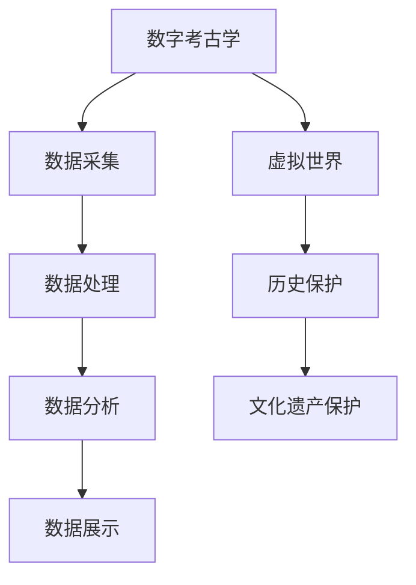
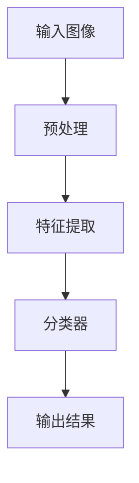
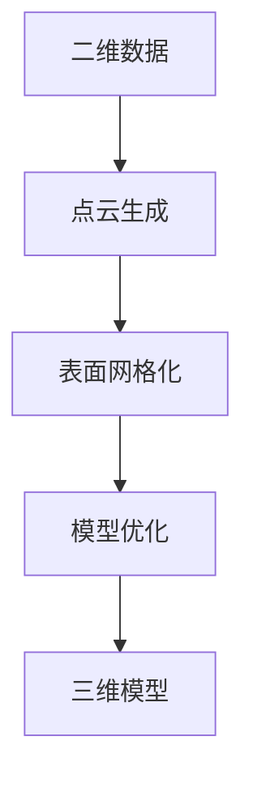
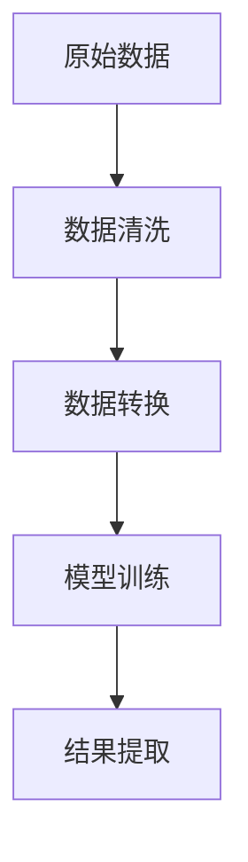
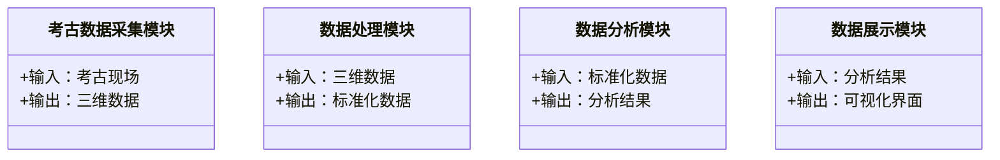
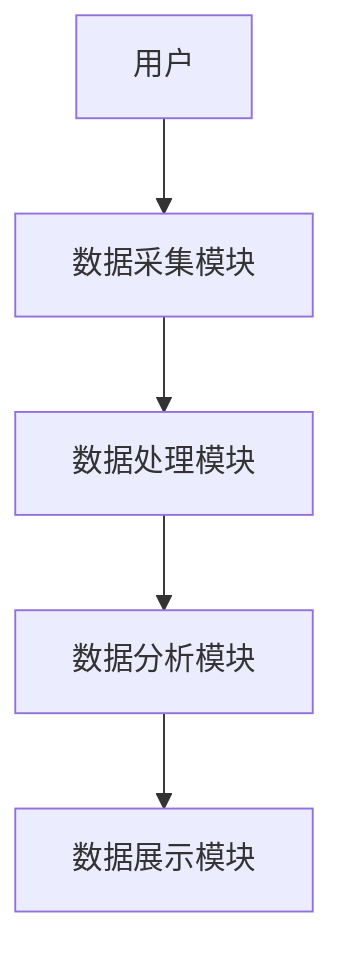
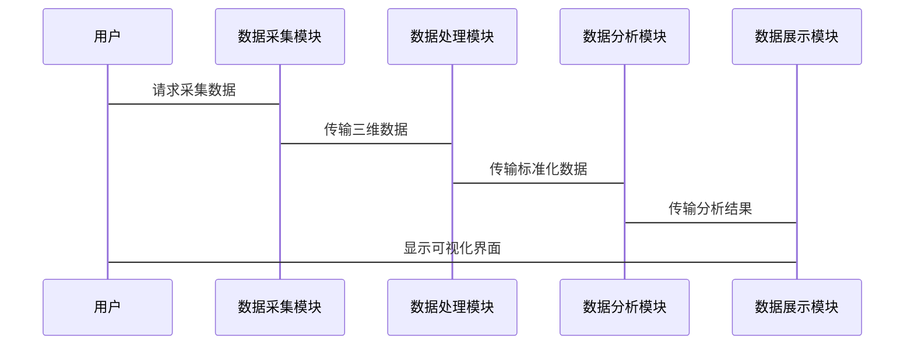

                 


# 数字考古学：虚拟世界中的历史保护

## 关键词：数字考古学、虚拟世界、历史保护、数字化技术、算法原理、数学模型、系统架构

## 摘要：  
数字考古学是将数字化技术应用于考古学研究的新兴领域，旨在通过虚拟世界技术保护和传承历史文化遗产。本文将从数字考古学的定义、虚拟世界的意义、历史保护的必要性等方面展开，结合实际案例，详细讲解数字考古学的核心算法、数学模型、系统架构以及项目实战。通过本文，读者将深入了解数字考古学的技术原理及其在虚拟世界中的应用，为历史保护提供新的思路和方法。

---

# 第一部分：背景介绍

## 第1章：数字考古学与虚拟世界

### 1.1 数字考古学的定义与起源

#### 1.1.1 数字考古学的概念

数字考古学是将数字化技术与考古学相结合的交叉学科，旨在通过数字技术采集、处理和分析考古数据，以揭示历史文化遗产的深层信息。其核心在于利用现代信息技术，将考古现场的物理环境转化为数字信息，以便进行更深入的研究和保护。

$$
\text{数字考古学} = \text{考古学} + \text{数字化技术}
$$

#### 1.1.2 数字考古学的起源与发展

- **20世纪80年代**：计算机技术在考古学中的应用开始萌芽，如使用简单的计算机辅助制图和数据分析工具。
- **21世纪初**：虚拟现实、三维建模、地理信息系统（GIS）等技术在考古学中得到广泛应用，数字考古学逐渐成为一门独立的学科。

### 1.2 虚拟世界与历史保护

#### 1.2.1 虚拟世界的定义与特征

虚拟世界是由计算机技术创造的模拟环境，用户可以在其中进行交互。虚拟世界具有高度沉浸性、实时互动性和信息丰富的特点。

$$
\text{虚拟世界} = \text{虚拟现实技术} + \text{互动体验}
$$

- **高度沉浸**：用户可以通过头显设备或其他设备“身临其境”地体验虚拟环境。
- **实时互动**：用户可以在虚拟环境中与其他用户或系统进行实时互动。
- **信息丰富**：虚拟世界可以通过三维建模、数据叠加等方式，提供丰富的历史信息。

#### 1.2.2 历史保护的必要性

- **历史遗产的重要性**：历史遗产是国家和民族的重要象征，保护它们对于传承文化至关重要。
- **数字化技术的优势**：数字化技术为历史保护提供了新的手段，可以实现历史遗产的永久保存和广泛传播。

### 1.3 本书的目标与读者

#### 1.3.1 目标

- **介绍数字考古学的核心概念和技术**。
- **探讨虚拟世界在历史保护中的应用**。
- **提供实践案例，展示数字化技术在考古学中的实际应用**。

#### 1.3.2 读者对象

- **考古学、历史学、文化遗产保护领域的研究人员和从业者**。
- **计算机科学、信息技术领域的专业人士，对数字考古学感兴趣的读者**。

---

# 第二部分：核心概念与联系

## 第2章：数字考古学的核心概念与联系

### 2.1 数字考古学的概念体系

#### 2.1.1 数字考古学的定义

数字考古学是将数字化技术应用于考古学研究的一门学科，包括数据采集、处理、分析和展示等多个环节。

#### 2.1.2 数字考古学的基本要素

- **数据采集**：利用遥感技术、地理信息系统（GIS）、3D扫描等技术获取考古现场数据。
- **数据处理**：通过数据清洗、整理和转换，将原始数据转化为可分析的形式。
- **数据分析**：运用统计学、机器学习等方法对数据进行分析，揭示考古信息。
- **数据展示**：通过虚拟现实、三维建模等技术，将分析结果以可视化的形式展示。

### 2.2 虚拟世界与历史保护的关系

#### 2.2.1 虚拟世界的定义与作用

虚拟世界是通过计算机技术创造的三维空间，用户可以在其中进行交互。虚拟世界在历史保护中的作用包括：

- **复原历史场景**：通过三维建模和虚拟现实技术，复原已被破坏的历史遗址。
- **保护文化遗产**：将文化遗产数字化，避免物理损坏。
- **传播文化知识**：通过虚拟世界，让更多人了解和接触到历史文化遗产。

#### 2.2.2 数字化技术在历史保护中的优势

- **永久保存**：数字化技术可以将文化遗产永久保存，避免因时间推移或人为破坏而消失。
- **广泛传播**：通过虚拟现实和网络技术，文化遗产可以被全球范围内的观众访问和体验。
- **便于研究**：数字化技术可以提供详细的考古数据，便于研究人员进行深入分析。

### 2.3 核心概念的关系图



---

# 第三部分：算法原理讲解

## 第3章：数字考古学中的算法原理

### 3.1 图像识别算法

#### 3.1.1 图像识别的定义

图像识别是指通过计算机视觉技术，对图像中的物体、场景或特征进行识别和分析。在数字考古学中，图像识别技术常用于识别和分类考古遗址中的文物和结构。

#### 3.1.2 图像识别的流程



#### 3.1.3 图像识别的Python实现

以下是一个简单的图像识别代码示例：

```python
import cv2

# 读取图像
image = cv2.imread('archaeological_site.jpg')

# 预处理：灰度化
gray = cv2.cvtColor(image, cv2.COLOR_BGR2GRAY)

# 使用OpenCV进行边缘检测
edges = cv2.Canny(gray, 100, 200)

# 显示结果
cv2.imshow('Original Image', image)
cv2.imshow('Edges', edges)
cv2.waitKey(0)
cv2.destroyAllWindows()
```

### 3.2 三维建模算法

#### 3.2.1 三维建模的定义

三维建模是指通过计算机技术，将二维数据转换为三维模型的过程。在数字考古学中，三维建模技术常用于复原历史遗址的结构。

#### 3.2.2 三维建模的流程



#### 3.2.3 三维建模的Python实现

以下是一个简单的三维建模代码示例：

```python
import numpy as np
import open3d as o3d

# 生成随机点云数据
points = np.random.rand(100, 3)

# 创建Open3D点云对象
point_cloud = o3d.geometry.PointCloud()
point_cloud.points = o3d.utility.Vector3dVector(points)

# 显示点云
o3d.visualization.draw_geometries([point_cloud])
```

### 3.3 数据挖掘算法

#### 3.3.1 数据挖掘的定义

数据挖掘是指从大量数据中提取有用信息的过程。在数字考古学中，数据挖掘技术常用于分析考古数据，发现隐藏的模式和关系。

#### 3.3.2 数据挖掘的流程



#### 3.3.3 数据挖掘的Python实现

以下是一个简单的数据挖掘代码示例：

```python
import pandas as pd
from sklearn.cluster import KMeans

# 读取数据
data = pd.read_csv('archaeological_data.csv')

# 数据清洗：处理缺失值
data.dropna(inplace=True)

# 数据转换：标准化
from sklearn.preprocessing import StandardScaler
scaler = StandardScaler()
scaled_data = scaler.fit_transform(data)

# 聚类分析
kmeans = KMeans(n_clusters=3)
kmeans.fit(scaled_data)

# 显示聚类结果
print(kmeans.labels_)
```

### 3.4 数学模型和公式

#### 3.4.1 图像识别中的分类模型

在图像识别中，常用的分类模型是支持向量机（SVM）。其数学公式如下：

$$
\text{SVM}：y = \text{sign}(\omega \cdot x + b)
$$

其中，$\omega$ 是权重向量，$x$ 是输入数据，$b$ 是偏置项。

#### 3.4.2 三维建模中的点云模型

点云模型可以通过三维坐标系中的点集来表示。其数学公式如下：

$$
\text{点云} = \{(x_i, y_i, z_i)\}_{i=1}^{n}
$$

其中，$x_i$、$y_i$、$z_i$ 是第 $i$ 个点的坐标。

---

# 第四部分：系统分析与架构设计方案

## 第4章：数字考古学的系统架构设计

### 4.1 问题场景介绍

在数字考古学中，常见的问题场景包括：

- **数据采集**：如何高效地采集考古现场的三维数据？
- **数据处理**：如何对采集到的三维数据进行清洗和转换？
- **数据分析**：如何利用数据挖掘技术发现考古数据中的隐藏模式？
- **数据展示**：如何将分析结果以可视化的形式展示出来？

### 4.2 项目介绍

本项目旨在开发一个数字考古学系统，用于保护和传承历史文化遗产。系统主要包括以下几个模块：

- **数据采集模块**：负责采集考古现场的三维数据。
- **数据处理模块**：对采集到的数据进行清洗和转换。
- **数据分析模块**：利用数据挖掘技术分析数据，发现隐藏的模式。
- **数据展示模块**：将分析结果以可视化的形式展示出来。

### 4.3 系统功能设计

#### 4.3.1 领域模型



#### 4.3.2 系统架构设计



#### 4.3.3 系统接口设计

系统接口设计主要包括以下几个部分：

- **数据采集接口**：用于采集考古现场的三维数据。
- **数据处理接口**：用于对采集到的数据进行清洗和转换。
- **数据分析接口**：用于对数据进行挖掘和分析。
- **数据展示接口**：用于将分析结果以可视化的形式展示出来。

#### 4.3.4 系统交互设计



---

# 第五部分：项目实战

## 第5章：数字考古学的项目实战

### 5.1 环境安装

以下是项目实战所需的环境安装步骤：

1. **安装Python**：下载并安装Python 3.8或更高版本。
2. **安装依赖库**：
   - OpenCV：用于图像处理。
   - Open3D：用于三维建模。
   - Scikit-learn：用于数据挖掘。

```bash
pip install opencv-python open3d scikit-learn
```

### 5.2 系统核心实现

以下是系统核心实现的代码示例：

#### 5.2.1 数据采集模块

```python
import cv2

# 读取图像
image = cv2.imread('archaeological_site.jpg')

# 预处理：灰度化
gray = cv2.cvtColor(image, cv2.COLOR_BGR2GRAY)

# 使用OpenCV进行边缘检测
edges = cv2.Canny(gray, 100, 200)

# 显示结果
cv2.imshow('Original Image', image)
cv2.imshow('Edges', edges)
cv2.waitKey(0)
cv2.destroyAllWindows()
```

#### 5.2.2 数据处理模块

```python
import pandas as pd
from sklearn.preprocessing import StandardScaler

# 读取数据
data = pd.read_csv('archaeological_data.csv')

# 数据清洗：处理缺失值
data.dropna(inplace=True)

# 数据转换：标准化
scaler = StandardScaler()
scaled_data = scaler.fit_transform(data)
```

#### 5.2.3 数据分析模块

```python
from sklearn.cluster import KMeans

# 聚类分析
kmeans = KMeans(n_clusters=3)
kmeans.fit(scaled_data)

# 显示聚类结果
print(kmeans.labels_)
```

#### 5.2.4 数据展示模块

```python
import numpy as np
import open3d as o3d

# 生成随机点云数据
points = np.random.rand(100, 3)

# 创建Open3D点云对象
point_cloud = o3d.geometry.PointCloud()
point_cloud.points = o3d.utility.Vector3dVector(points)

# 显示点云
o3d.visualization.draw_geometries([point_cloud])
```

### 5.3 代码应用解读与分析

- **数据采集模块**：通过OpenCV库读取图像并进行边缘检测，提取出考古遗址中的边缘信息。
- **数据处理模块**：使用Pandas和Scikit-learn库对数据进行清洗和标准化处理，为后续的数据分析做好准备。
- **数据分析模块**：利用K-means聚类算法对数据进行分类，发现考古数据中的隐藏模式。
- **数据展示模块**：通过Open3D库将聚类结果以三维点云的形式展示出来，直观地呈现考古数据的分布情况。

### 5.4 实际案例分析

以某古代遗址为例，通过上述代码实现对遗址的三维建模和数据分析，最终生成一个可视化的展示界面，帮助研究人员更好地理解遗址的结构和布局。

---

# 第六部分：最佳实践 tips、小结、注意事项、拓展阅读

## 第6章：最佳实践与拓展

### 6.1 最佳实践 tips

- **数据采集**：在采集数据时，确保数据的准确性和完整性。
- **数据处理**：在处理数据时，注意数据的标准化和归一化，确保算法的准确性。
- **数据分析**：在分析数据时，选择合适的算法和模型，避免过拟合和欠拟合。
- **数据展示**：在展示数据时，选择合适的可视化工具和方法，确保结果的直观性和易懂性。

### 6.2 小结

数字考古学是一门结合数字化技术和考古学的新兴学科，其核心在于通过虚拟现实技术保护和传承历史文化遗产。本文从数字考古学的定义、虚拟世界的意义、历史保护的必要性等方面展开，结合实际案例，详细讲解了数字考古学的核心算法、数学模型、系统架构以及项目实战。

### 6.3 注意事项

- **数据隐私**：在处理数据时，注意保护数据隐私，避免数据泄露。
- **技术选型**：在选择技术时，根据实际需求进行选型，避免盲目跟风。
- **团队协作**：在团队协作时，注意分工明确，确保项目进度和质量。

### 6.4 拓展阅读

- **书籍推荐**：
  - 《Digital Archaeology: The Transformation of Archaeology in the Digital Age》
  - 《Virtual Worlds and Heritage Preservation: Case Studies and Best Practices》
- **在线资源**：
  - [Digital Archaeology Association](https://www.digitalarchaeology.org)
  - [Virtual Heritage Network](https://www.virtual-heritage.org)

---

作者：AI天才研究院/AI Genius Institute & 禅与计算机程序设计艺术/Zen And The Art of Computer Programming

