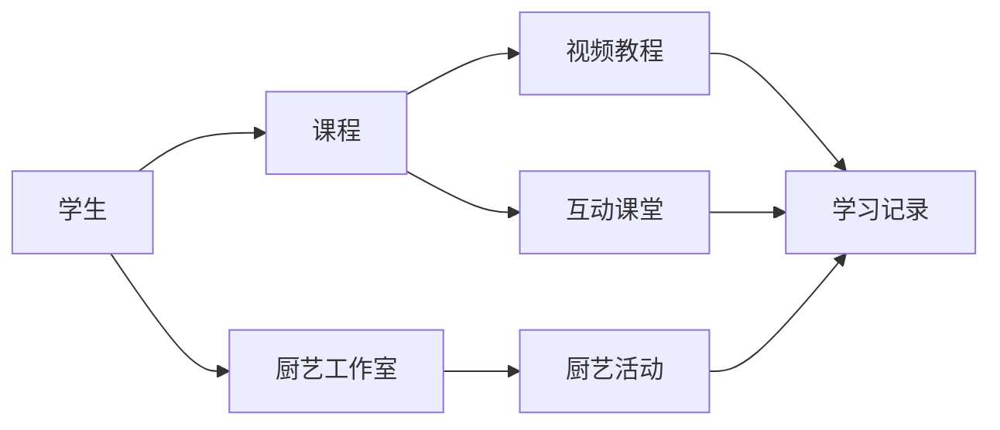
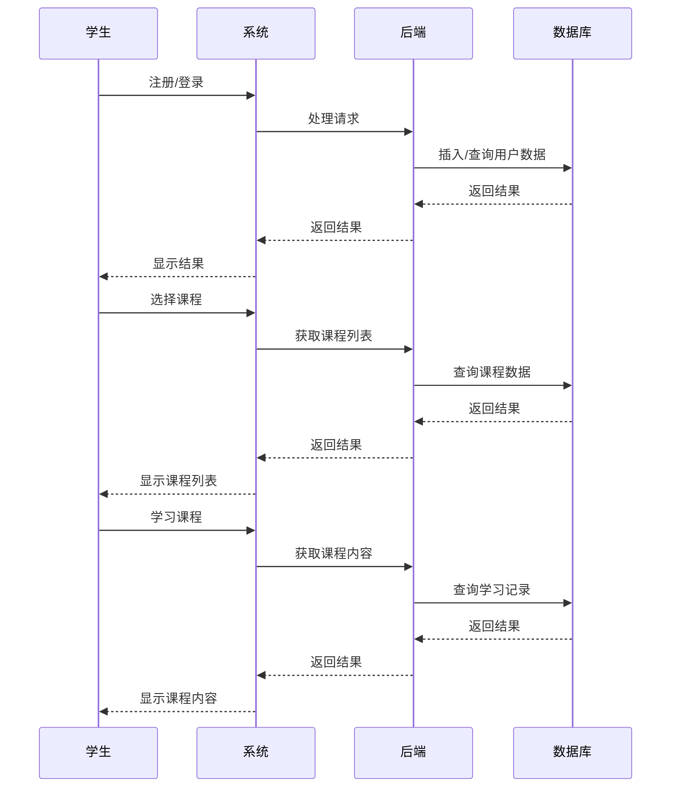

                 


# 新型城市共享厨艺课程：线上线下结合的烹饪教育模式

**关键词**：烹饪教育、共享经济、线上线下结合、教育模式创新、健康饮食、技术实现

**摘要**：本文探讨了一种新型的城市共享厨艺课程模式，通过线上线下结合的方式，提供便捷、高效、个性化的烹饪教育服务。文章从问题背景、核心概念、系统设计、项目实战等多个方面展开，详细分析了这种教育模式的技术实现和实际应用，提出了线上线下融合的创新思路，并通过具体案例展示了其在城市中的应用前景。

---

### 第2章 共享厨艺课程的核心概念与联系

#### 2.1 核心概念

共享厨艺课程的核心概念可以分解为以下几个方面：

1. **烹饪技能培训**：通过系统化的课程设计，帮助学员掌握基础烹饪技巧、食材处理方法、菜品搭配和创新技巧。
2. **健康饮食理念**：课程内容注重营养均衡、健康饮食习惯的培养，结合现代人的健康需求，提供科学的饮食指导。
3. **社交互动**：线上线下的结合不仅提供知识学习，还通过互动活动促进学员之间的交流，形成社区化学习氛围。

#### 2.2 概念属性特征对比

为了更好地理解共享厨艺课程的线上线下结合模式，我们从以下几个维度进行对比分析：

| **特征**             | **线上部分**                     | **线下部分**                     |
|----------------------|----------------------------------|----------------------------------|
| **学习形式**         | 视频教程、互动课堂               | 实体厨艺工作室、现场烹饪活动     |
| **教学资源**         | 数字化资源丰富，支持随时学习     | 实体设备齐全，提供真实烹饪体验   |
| **学习氛围**         | 线上交流灵活，互动性强           | 线下氛围浓厚，团队协作感强       |
| **学习成本**         | 较低，无场地和时间限制           | 较高，受场地和时间限制           |

#### 2.3 ER实体关系图

为了更好地理解共享厨艺课程的系统架构，我们绘制了以下ER实体关系图：



图中展示了学生、课程、厨艺工作室、视频教程、互动课堂、厨艺活动以及学习记录之间的关系。学生可以通过课程、视频教程或互动课堂参与学习，并通过厨艺活动与线下工作室结合，形成完整的线上线下学习闭环。

---

### 第3章 线上烹饪教育平台的设计与实现

#### 3.1 平台架构设计

线上烹饪教育平台的架构设计需要考虑系统的可扩展性、稳定性和用户体验。以下是平台的主要架构设计：

1. **前端设计**：
   - 使用Vue.js框架构建响应式界面，支持PC端和移动端。
   - 提供视频播放器、课程列表、用户中心等功能模块。
   - 通过WebSocket实现实时互动课堂。

2. **后端设计**：
   - 使用Spring Boot框架实现RESTful API。
   - 提供用户管理、课程管理、学习记录管理等功能。
   - 使用Redis缓存技术优化性能。

3. **数据库设计**：
   - 使用MySQL数据库存储用户信息、课程信息、学习记录等数据。
   - 数据表设计遵循规范化原则，确保数据的完整性和一致性。

#### 3.2 系统接口设计

以下是系统的主要接口设计：

1. **用户接口**：
   - `POST /api/register`：用户注册。
   - `POST /api/login`：用户登录。
   - `GET /api/courses`：获取课程列表。
   - `GET /api/course/{id}`：获取具体课程信息。
   - `POST /api/enroll`：报名课程。

2. **管理接口**：
   - `POST /api/admin/course/add`：添加课程。
   - `PUT /api/admin/course/update`：更新课程。
   - `DELETE /api/admin/course/{id}`：删除课程。
   - `GET /api/admin/users`：获取用户列表。

#### 3.3 系统交互序列图

以下是系统交互的序列图：



---

### 第4章 线下厨艺工作室的运营与管理

#### 4.1 工作室选址与规划

线下厨艺工作室的选址和规划是成功运营的关键。以下是选址和规划的建议：

1. **选址**：
   - 选择交通便利、人流量较大的区域，如市中心、居民区或商业区。
   - 考虑目标用户群体的分布，优先选择年轻人和中产阶级聚集的地方。

2. **规划**：
   - 设计合理的厨房布局，确保操作空间宽敞、设备齐全。
   - 设置学员互动区，便于学员之间的交流和协作。

#### 4.2 工作室运营模式

1. **课程设计**：
   - 提供基础烹饪课程、主题课程（如各国美食）、进阶课程等。
   - 结合线上课程内容，设计线上线下结合的混合式课程。

2. **设备配置**：
   - 配备高质量的烹饪设备，如专业级的炉具、刀具、食材加工设备等。
   - 提供学员使用的个人防护装备，如围裙、手套等。

3. **活动策划**：
   - 定期举办烹饪活动，如美食分享会、烹饪比赛等，吸引学员参与。
   - 结合节日主题，推出特色课程，提升用户参与度。

#### 4.3 工作室管理

1. **人员管理**：
   - 配备专业的厨师团队，负责课程设计和教学指导。
   - 培训工作人员，确保服务质量和用户体验。

2. **课程管理**：
   - 使用线上平台进行课程预约和学员管理。
   - 实时记录学员的学习进度，提供个性化指导。

---

### 第5章 线上线下融合的实现

#### 5.1 混合式课程设计

共享厨艺课程的核心是线上线下融合的混合式教学模式。以下是混合式课程的设计思路：

1. **课程内容**：
   - 线上部分：视频教程、互动课堂、食材清单和食谱下载。
   - 线下部分：现场烹饪实践、团队协作任务、专业指导。

2. **学习流程**：
   - 学员通过线上平台预习课程内容，熟悉食材和步骤。
   - 线下课程中，学员在指导下完成实际烹饪操作，巩固线上所学知识。

#### 5.2 数据分析与个性化推荐

通过数据分析，我们可以实现个性化推荐，提升用户体验。以下是具体的实现思路：

1. **数据采集**：
   - 记录学员的学习行为数据，如课程选择、学习时长、互动频率等。
   - 收集学员的反馈数据，了解他们的需求和偏好。

2. **推荐算法**：
   - 使用协同过滤算法推荐相似课程。
   - 基于用户行为数据，实时调整推荐策略。

3. **数学模型**：
   - 协同过滤算法的数学模型如下：
     $$ sim(i,j) = \frac{\sum_{k} (r_{ik} - \bar{r_i})(r_{jk} - \bar{r_j})}{\sqrt{\sum_{k} (r_{ik} - \bar{r_i})^2} \cdot \sqrt{\sum_{k} (r_{jk} - \bar{r_j})^2}} $$
     其中，$sim(i,j)$ 表示用户i和用户j之间的相似度，$r_{ik}$ 表示用户i对课程k的评分，$\bar{r_i}$ 表示用户i的平均评分。

---

### 第6章 项目实战

#### 6.1 环境安装与配置

要实现线上烹饪教育平台，首先需要搭建开发环境：

1. **前端开发环境**：
   - 安装Node.js和Vue.js框架。
   - 使用Vue CLI创建项目。

2. **后端开发环境**：
   - 安装Java开发环境，配置Spring Boot。
   - 使用IDEA或Eclipse进行开发。

3. **数据库配置**：
   - 安装MySQL，创建数据库和用户表。

#### 6.2 核心代码实现

以下是线上平台的核心代码示例：

1. **前端代码（Vue.js）**：
   ```javascript
   // 主组件
   <template>
     <div id="app">
       <h1>烹饪课程</h1>
       <ul>
         <li v-for="course in courses" :key="course.id">
           {{ course.title }}
         </li>
       </ul>
     </div>
   </template>

   <script>
     export default {
       data() {
         return {
           courses: []
         }
       },
       created() {
         this.fetchCourses();
       },
       methods: {
         fetchCourses() {
           // 调用后端接口获取课程数据
           axios.get('/api/courses').then(response => {
             this.courses = response.data;
           });
         }
       }
     }
   </script>
   ```

2. **后端代码（Spring Boot）**：
   ```java
   @RestController
   @RequestMapping("/api")
   public class CourseController {
       @Autowired
       private CourseService courseService;

       @GetMapping("/courses")
       public List<Course> getAllCourses() {
           return courseService.findAll();
       }
   }
   ```

3. **数据库表结构（MySQL）**：
   ```sql
   CREATE TABLE courses (
       id INT AUTO_INCREMENT PRIMARY KEY,
       title VARCHAR(100),
       description TEXT,
       duration INT,
       price DECIMAL(10,2)
   );
   ```

#### 6.3 案例分析与项目总结

通过实际案例分析，我们可以看到线上线下结合的烹饪教育模式具有显著的优势：

1. **灵活性**：线上学习不受时间和地点限制，线下实践提供真实体验。
2. **个性化**：通过数据分析和推荐算法，为学员提供个性化的学习路径。
3. **社交性**：线上线下结合的模式增强了学员之间的互动和协作。

---

### 第7章 总结与展望

#### 7.1 总结

本文详细探讨了新型城市共享厨艺课程的线上线下结合模式，从概念设计、系统实现到项目实战，全面分析了这种教育模式的技术实现和实际应用。通过线上平台和线下工作室的结合，我们可以为现代城市居民提供更加便捷、高效、个性化的烹饪教育服务。

#### 7.2 展望

未来，随着人工智能和物联网技术的发展，共享厨艺课程将更加智能化和个性化。以下是未来的发展方向：

1. **人工智能辅助教学**：
   - 利用AI技术实现智能推荐、语音识别和手势识别，提升用户体验。
   - 开发智能厨房设备，实现人机交互。

2. **物联网技术的应用**：
   - 通过物联网设备实时监控烹饪过程，提供实时指导。
   - 实现智能供应链管理，优化食材采购和库存管理。

3. **虚拟现实技术**：
   - 利用VR技术提供沉浸式烹饪体验，让用户足不出户即可感受真实厨房环境。

---

### 作者

**作者：AI天才研究院/AI Genius Institute & 禅与计算机程序设计艺术 /Zen And The Art of Computer Programming**

