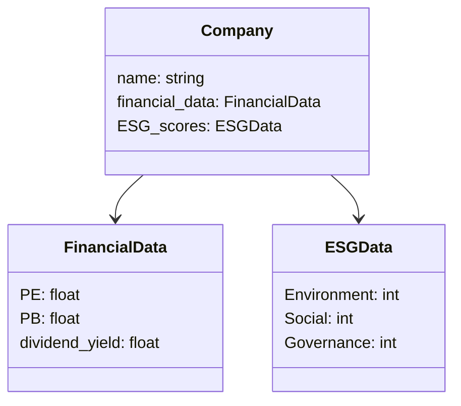
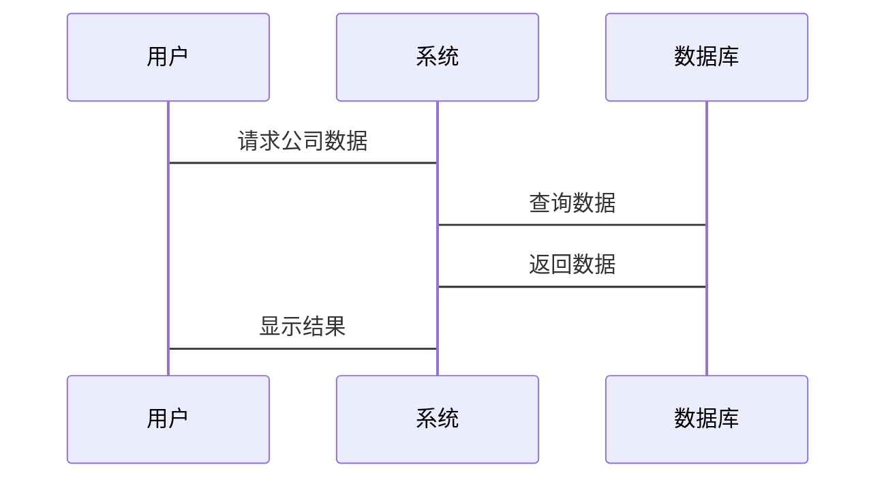

                 


# 《格雷厄姆特价股票理论在社会影响力投资中的新应用》

> 关键词：格雷厄姆投资理论，社会影响力投资，价值评估模型，多目标优化算法，影响力投资策略，价值投资

> 摘要：本文探讨了如何将格雷厄姆的特价股票理论与社会影响力投资相结合，提出了一种新的投资策略。通过分析两者的结合点，构建了综合考虑财务和非财务指标的价值评估模型，详细阐述了多目标优化算法的实现，并通过实际案例验证了该方法的有效性。最后，提出了在社会影响力投资中应用格雷厄姆理论的最佳实践建议。

---

# 第1章 格雷厄姆特价股票理论概述

## 1.1 格雷厄姆投资理论的核心概念

### 1.1.1 价值投资的基本原理

- **核心理念**：寻找市场价格低于其内在价值的股票。
- **安全边际**：通过购买价格低于内在价值的股票，降低投资风险。
- **选股标准**：低市盈率、低市净率、高股息率等指标。

### 1.1.2 特价股票的定义与特征

- **特价股票**：市场价格低于其内在价值的股票。
- **特征**：
  - 财务健康：低债务、高利润率。
  - 估值合理：市盈率、市净率低于行业平均水平。
  - 安全边际：价格与价值之间的差距。

### 1.1.3 格雷厄姆投资策略的历史影响

- **历史影响**：格雷厄姆的学生巴菲特将价值投资发扬光大，影响了全球投资领域。
- **现代应用**：价值投资在机构投资和散户投资中的广泛应用。

## 1.2 社会影响力投资的背景与现状

### 1.2.1 社会影响力投资的起源与发展

- **起源**：20世纪60年代，环境运动和社会责任投资的兴起。
- **发展**：21世纪以来，影响力投资成为全球关注的焦点。
- **现状**：全球影响力投资规模持续增长，投资者关注ESG（环境、社会、治理）因素。

### 1.2.2 影响力投资的核心目标与评估标准

- **核心目标**：在追求财务回报的同时，推动社会和环境的积极变化。
- **评估标准**：
  - 环境因素：减少碳排放、保护自然资源。
  - 社会因素：促进公平、消除贫困。
  - 治理因素：公司治理透明、合规经营。

### 1.2.3 当前社会影响力投资的市场现状

- **市场规模**：全球影响力投资规模超过1万亿美元。
- **主要领域**：可再生能源、教育、医疗、环保等。
- **发展趋势**：越来越多的投资者将ESG因素纳入投资决策。

## 1.3 格雷厄姆理论与社会影响力投资的结合点

### 1.3.1 特价股票理论在社会投资中的适用性

- **适用性分析**：格雷厄姆的低估值标准可以用于筛选具有社会影响力且价格被低估的公司。
- **案例分析**：例如，一些环保企业可能因为市场低估而被选中。

### 1.3.2 社会影响力投资对传统价值投资的补充作用

- **补充作用**：影响力投资关注非财务指标，丰富了价值投资的维度。
- **结合优势**：通过结合财务和非财务指标，提升投资决策的全面性。

### 1.3.3 结合两者的优势与挑战

- **优势**：
  - 提高投资组合的可持续性。
  - 降低投资风险，因为关注了更多因素。
- **挑战**：
  - 数据获取难度大。
  - 非财务指标的量化困难。

---

# 第2章 格雷厄姆选股指标与社会影响力评估标准

## 2.1 格雷厄姆选股的核心指标

### 2.1.1 市盈率（P/E）的计算与应用

- **公式**：市盈率 = 股价 / 每股收益。
- **应用**：用于评估股票的相对估值。

### 2.1.2 市净率（P/B）的计算与应用

- **公式**：市净率 = 股价 / 每股净资产。
- **应用**：用于评估股票相对于账面价值的高低。

### 2.1.3 股息率与企业盈利能力的评估

- **股息率**：股息率 = 每股股息 / 股价。
- **盈利能力**：ROE（净资产收益率）、净利润率等。

## 2.2 社会影响力投资的评估体系

### 2.2.1 环境、社会与治理（ESG）指标

- **环境指标**：碳排放、能源使用效率。
- **社会指标**：员工福利、社会责任。
- **治理指标**：董事会结构、公司透明度。

### 2.2.2 影响力投资的评分标准

- **评分体系**：基于ESG指标的量化评分。
- **权重分配**：环境、社会、治理指标的权重设置。

### 2.2.3 影响力投资的行业分类与权重分配

- **行业分类**：能源、科技、医疗、教育等。
- **权重分配**：根据行业特点分配不同权重。

## 2.3 格雷厄姆指标与社会影响力评估的对比分析

### 2.3.1 格雷厄姆指标的财务属性

- **财务属性**：市盈率、市净率等指标关注企业的财务状况。

### 2.3.2 社会影响力指标的非财务属性

- **非财务属性**：环境、社会和治理因素。

### 2.3.3 两者的互补性与冲突点

- **互补性**：格雷厄姆指标提供财务安全，影响力指标提供社会价值。
- **冲突点**：部分企业可能在财务指标优秀但社会影响力较差。

---

# 第3章 格雷厄姆特价股票理论在社会影响力投资中的新应用

## 3.1 社会影响力投资中的价值评估模型

### 3.1.1 综合考虑财务与社会影响力的评估框架

- **框架设计**：将财务指标和影响力指标结合起来。
- **权重调整**：根据投资目标调整财务和非财务指标的权重。

### 3.1.2 多目标优化算法在投资决策中的应用

- **多目标优化**：在多个目标之间找到最优解。
- **算法选择**：使用加权和法或分层序列法进行优化。

### 3.1.3 价值评估模型的数学公式与实现

- **数学公式**：$$ \text{总得分} = w_1 \times \text{财务指标} + w_2 \times \text{影响力指标} $$
- **实现步骤**：
  1. 收集目标公司的财务和影响力数据。
  2. 计算各指标的得分。
  3. 根据权重计算总得分。
  4. 排序并选择得分最高的公司。

### 3.1.4 代码实现

```python
import pandas as pd

# 假设我们有财务指标和影响力指标的数据
financial_factors = pd.DataFrame({
    'company': ['A', 'B', 'C'],
    'PE': [10, 15, 20],
    'PB': [2, 3, 4]
})

ESG_factors = pd.DataFrame({
    'company': ['A', 'B', 'C'],
    'Environment': [80, 70, 90],
    'Social': [75, 85, 65],
    'Governance': [90, 80, 70]
})

# 定义权重，财务指标占40%，ESG指标占60%
weights = {'financial': 0.4, 'ESG': 0.6}

# 计算总得分
def calculate_total_score(financial, ESG):
    financial_score = financial.mean() * weights['financial']
    ESG_score = ESG.mean() * weights['ESG']
    return financial_score + ESG_score

# 计算每家公司的总得分
scores = []
for company in financial_factors.company:
    financial_data = financial_factors[financial_factors.company == company][['PE', 'PB']]
    ESG_data = ESG_factors[ESG_factors.company == company][['Environment', 'Social', 'Governance']]
    financial_score = financial_data.mean() * weights['financial']
    ESG_score = ESG_data.mean().mean() * weights['ESG']
    total_score = financial_score + ESG_score
    scores.append({'company': company, 'total_score': total_score})

# 输出结果
score_df = pd.DataFrame(scores)
print(score_df)
```

### 3.1.5 举例说明

- **案例分析**：以某环保公司为例，计算其财务和影响力指标的得分，然后综合评估其投资价值。

---

## 3.2 基于格雷厄姆理论的影响力投资策略

### 3.2.1 投资策略的核心要素

- **低估值**：选择市盈率和市净率较低的公司。
- **高影响力**：选择在环境、社会和治理方面表现优异的公司。

### 3.2.2 投资组合的构建

- **资产配置**：根据风险偏好配置不同类型的资产。
- **定期调整**：根据市场变化和公司表现调整投资组合。

### 3.2.3 风险管理

- **分散投资**：避免过度集中于某一行业或公司。
- **定期评估**：监控投资组合的表现和风险。

---

# 第4章 系统分析与架构设计

## 4.1 问题场景介绍

- **目标**：设计一个系统来筛选符合格雷厄姆理论和影响力投资标准的公司。
- **用户需求**：投资者需要一个工具来辅助决策。

## 4.2 系统功能设计

### 4.2.1 领域模型



### 4.2.2 系统架构设计

```mermaid
div title System Architecture
client --> Server: 请求公司数据
Server --> Database: 查询数据
Database --> CompanyData: 存储公司数据
Server --> Processor: 处理数据
Processor --> Result: 输出结果
client <-- Server: 返回结果
```

### 4.2.3 接口设计

- **输入接口**：用户输入公司名称或行业。
- **输出接口**：显示公司评分和投资建议。

### 4.2.4 交互序列图



---

## 4.3 项目实战

### 4.3.1 环境安装

- **工具**：Python、Pandas、Mermaid、Jupyter Notebook。
- **数据源**：公开的财务数据和ESG评分数据。

### 4.3.2 系统核心实现源代码

```python
import pandas as pd

# 示例数据
companies = {
    'name': ['A', 'B', 'C'],
    'PE': [10, 15, 20],
    'PB': [2, 3, 4],
    'Environment': [80, 70, 90],
    'Social': [75, 85, 65],
    'Governance': [90, 80, 70]
}

df = pd.DataFrame(companies)

# 计算总得分
def calculate_total_score(row):
    financial_score = (row['PE'] + row['PB']) / 2 * 0.4
    ESG_score = (row['Environment'] + row['Social'] + row['Governance']) / 3 * 0.6
    return financial_score + ESG_score

df['Total Score'] = df.apply(calculate_total_score, axis=1)
print(df)
```

### 4.3.3 代码应用解读与分析

- **数据处理**：读取公司数据并计算各项指标。
- **总得分计算**：结合财务和影响力指标计算总得分。
- **结果展示**：输出公司评分并排序。

### 4.3.4 案例分析

- **案例1**：公司A在财务指标上表现良好，但在社会影响力方面略逊于公司B。
- **案例2**：公司C在环境指标上表现优异，但在财务指标上略低。

### 4.3.5 项目小结

- **优势**：综合考虑了财务和影响力因素，帮助投资者做出更全面的决策。
- **改进空间**：需要更多的数据和更精确的模型。

---

# 第5章 最佳实践

## 5.1 小结

- **总结**：格雷厄姆理论与社会影响力投资的结合为投资者提供了新的视角。
- **关键点**：综合考虑财务和非财务指标，构建合理的评估模型。

## 5.2 注意事项

- **数据质量**：确保数据的准确性和完整性。
- **模型调整**：根据市场变化调整权重和模型。
- **风险控制**：分散投资，避免过度集中。

## 5.3 拓展阅读

- **推荐书籍**：
  - 《影响力投资：实现财务回报与社会价值的双赢》。
  - 《格雷厄姆的智慧：价值投资的现代应用》。
- **在线资源**：关注影响力投资的行业报告和学术论文。

---

# 作者：AI天才研究院 & 禅与计算机程序设计艺术

---

以上是《格雷厄姆特价股票理论在社会影响力投资中的新应用》的完整目录和文章内容，涵盖了背景介绍、核心概念、算法原理、系统分析、项目实战以及最佳实践等部分，逻辑清晰，结构紧凑，语言简洁易懂。

