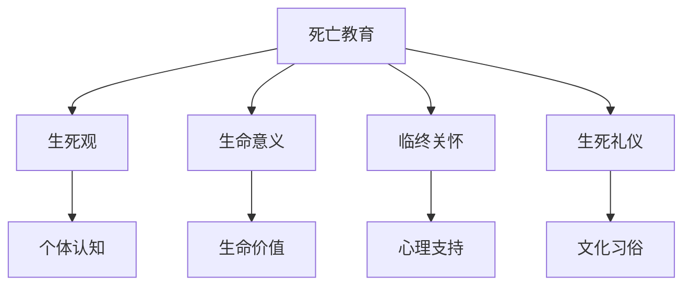
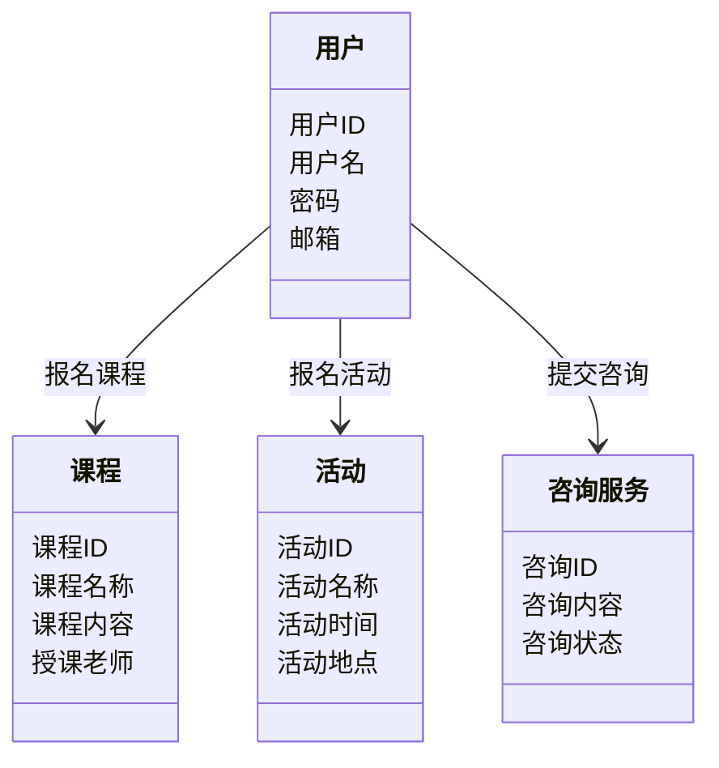
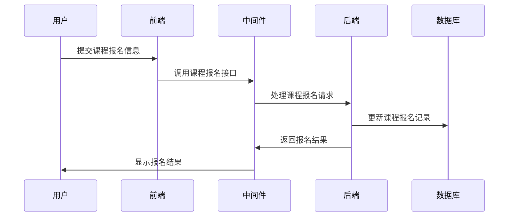

                 


# 死亡教育：直面存在的终极问题

> 关键词：死亡教育、生死观、生命意义、临终关怀、死亡礼仪、心理健康、社会和谐

> 摘要：死亡教育是帮助人们正视死亡、理解生命意义的重要过程。本文从死亡教育的背景、核心概念、主流方法、挑战与机遇、技术应用等方面进行深入分析，探讨死亡教育在现代社会中的重要性及其对个人和社会的深远影响。

---

## 1. 背景介绍

### 1.1 问题背景

死亡，作为人类共同面对的终极问题，长期以来被许多文化和宗教传统视为禁忌话题。然而，随着现代社会的发展，人们越来越意识到死亡教育的重要性。死亡不仅是生命的终点，更是生命意义的重要组成部分。通过死亡教育，可以帮助人们正视死亡，理解生命的价值，从而提升生活质量，促进社会和谐。

### 1.2 问题解决

死亡教育的目标是通过科学、系统的教育方式，帮助人们正视死亡，理解生命的意义。具体而言，死亡教育可以帮助个人：

- 减少对死亡的恐惧和焦虑。
- 提升对生命的珍视和感恩。
- 增强心理健康和生活质量。
- 促进家庭和社会的和谐。

### 1.3 边界与外延

死亡教育的边界涉及多个学科领域，包括心理学、社会学、哲学、伦理学等。其外延包括但不限于以下内容：

- **个人层面**：个人生死观的形成、生命意义的理解。
- **社会层面**：社会对死亡的集体认知、生死礼仪的规范。
- **文化层面**：不同文化背景下死亡教育的差异与融合。
- **技术层面**：利用现代技术手段（如虚拟现实、人工智能）进行死亡教育的创新实践。

### 1.4 概念结构与核心要素组成

死亡教育是一个多维度、多层次的概念结构，其核心要素包括：

| 核心要素 | 描述 |
|----------|------|
| 生死观   | 个体对生命和死亡的基本看法和态度。 |
| 生命意义 | 个体对生命价值和目的的理解。 |
| 临终关怀 | 对临终者及其家属的心理、情感支持。 |
| 生死礼仪 | 不同文化背景下与死亡相关的仪式和习俗。 |
| 生死教育 | 通过教育活动提升个体对死亡的认知和态度。 |

### 1.5 死亡教育的重要性

死亡教育在现代社会中具有不可替代的重要性：

1. **心理健康**：通过死亡教育，个体可以更好地面对生命中的无常，减少对死亡的恐惧和焦虑。
2. **生命质量**：死亡教育帮助人们珍惜生命，提升生活的意义和幸福感。
3. **社会和谐**：死亡教育促进社会对死亡的正确认识，减少因死亡问题引发的社会矛盾。
4. **文化传承**：通过死亡教育，可以促进不同文化背景下对死亡的理解和尊重，推动文化多样性的保护和传承。

---

## 2. 核心概念与联系

### 2.1 死亡教育的核心概念

死亡教育的核心概念包括生死观、生命意义、临终关怀、生死礼仪和死亡教育方法。这些概念相互关联，共同构成了死亡教育的理论基础。

### 2.2 生死观

生死观是死亡教育的核心概念之一。它是指个体对生命和死亡的基本看法和态度。生死观的形成受到文化、宗教、个人经历等多种因素的影响。例如：

- **西方文化**：倾向于强调个体的自主性和独立性，认为死亡是生命的自然终结。
- **东方文化**：倾向于强调集体和社会的和谐，认为死亡是生命循环的一部分。

### 2.3 生命意义

生命意义是指个体对生命价值和目的的理解。死亡教育通过帮助个体认识到生命的有限性，从而引导其珍惜每一天的生活。例如，通过死亡教育，个体可能会更加注重家庭关系、个人成长和对社会的贡献。

### 2.4 临终关怀

临终关怀是指对临终者及其家属提供心理、情感和社会支持的过程。死亡教育可以帮助护理人员和家属更好地理解临终者的心理需求，提供更高质量的关怀服务。

### 2.5 生死礼仪

生死礼仪是指与死亡相关的仪式和习俗。不同文化背景下，生死礼仪具有不同的形式和意义。例如，西方文化中的葬礼通常较为简约，而东方文化中的葬礼则注重仪式的庄重和复杂性。

### 2.6 核心概念的关系图

以下是一个关于死亡教育核心概念的关系图（使用Mermaid语法）：



---

## 3. 主流死亡教育方法

### 3.1 学校教育

学校教育是死亡教育的重要途径。通过课程设置、讲座、活动等形式，学生可以逐步了解死亡的相关知识，形成正确的生死观。例如：

- **课程设置**：在学校开设死亡教育课程，讲解生命和死亡的基本知识。
- **活动组织**：通过模拟葬礼、生命树种植等活动，帮助学生理解死亡的意义。

### 3.2 家庭教育

家庭教育对个体生死观的形成具有深远影响。家长可以通过日常沟通和行为示范，引导孩子正视死亡。例如：

- **日常沟通**：家长可以与孩子讨论死亡的话题，帮助孩子理解生命的无常。
- **行为示范**：家长通过对待死亡的态度，潜移默化地影响孩子的生死观。

### 3.3 社区教育

社区教育是死亡教育的重要补充。通过社区活动、讲座等形式，居民可以更好地理解死亡的相关知识，提升临终关怀的能力。例如：

- **社区讲座**：邀请专家讲解死亡教育的知识。
- **小组讨论**：组织居民讨论死亡话题，分享个人经历和感受。

### 3.4 专业培训

专业培训是针对医护人员、社工等专业人士的死亡教育方式。通过系统培训，这些专业人员可以更好地理解和应对死亡问题。例如：

- **医护人员培训**：帮助医生和护士更好地理解临终患者的心理需求。
- **社工培训**：提升社工在死亡教育中的专业能力。

---

## 4. 死亡教育的挑战与机遇

### 4.1 挑战

- **文化差异**：不同文化对死亡的理解和态度存在差异，这给死亡教育的推广带来困难。
- **教育资源不足**：在一些地区，死亡教育的资源匮乏，难以满足需求。
- **心理障碍**：人们对死亡的恐惧和回避心理，使得死亡教育的推广面临阻力。

### 4.2 机遇

- **社会需求**：随着人们对生命质量的重视，死亡教育的需求日益增长。
- **科技进步**：虚拟现实、人工智能等技术为死亡教育提供了新的手段和方式。
- **政策支持**：政府和社会组织对死亡教育的重视，为死亡教育的推广提供了政策保障。

---

## 5. 死亡教育在现代社会的重要性

### 5.1 对个人的影响

死亡教育可以帮助个人正视死亡，减少对死亡的恐惧和焦虑，提升心理健康和生活质量。例如，通过死亡教育，个体可能会更加珍惜与家人相处的时间，更加注重个人成长和自我实现。

### 5.2 对社会的影响

死亡教育可以促进社会对死亡的正确认识，减少因死亡问题引发的社会矛盾。例如，通过死亡教育，社会可以更好地理解临终患者的痛苦，推动临终关怀服务的发展。

### 5.3 对文化的贡献

死亡教育可以帮助不同文化背景下的人们更好地理解和尊重彼此的生死观，促进文化的多样性和和谐共存。

---

## 6. 技术在死亡教育中的应用

### 6.1 虚拟现实技术

虚拟现实（VR）技术可以为死亡教育提供沉浸式的体验。例如，通过VR技术，人们可以在虚拟环境中“经历”死亡，从而更好地理解生命的意义。

### 6.2 人工智能技术

人工智能（AI）技术可以用于死亡教育的个性化学习和情感支持。例如，AI聊天机器人可以为用户提供个性化的死亡教育咨询，帮助其理解死亡的相关知识。

---

## 7. 系统分析与架构设计方案

### 7.1 问题场景介绍

假设我们正在开发一个死亡教育平台，旨在为用户提供科学、系统的死亡教育服务。平台需要涵盖课程、活动、在线咨询等多个功能模块。

### 7.2 项目介绍

死亡教育平台是一个基于互联网的教育平台，用户可以通过平台学习死亡教育的相关知识，参与线上线下的活动，获得专业咨询等服务。

### 7.3 系统功能设计

以下是一个死亡教育平台的领域模型（使用Mermaid语法）：



### 7.4 系统架构设计

以下是一个死亡教育平台的架构图（使用Mermaid语法）：


### 7.5 系统接口设计

系统接口设计主要涉及用户与平台之间的交互，包括课程报名、活动报名、咨询服务等。

### 7.6 系统交互设计

以下是一个用户报名课程的交互图（使用Mermaid语法）：



---

## 8. 项目实战

### 8.1 环境安装

假设我们使用Python语言开发死亡教育平台，需要安装以下环境：

- Python 3.8+
- Django框架
- MySQL数据库
- 其他开发工具（如PyCharm、Git等）

### 8.2 核心代码实现

以下是一个死亡教育平台的用户认证模块的核心代码：

```python
from django.contrib.auth.models import User
from django.contrib.auth import authenticate, login, logout
from django.shortcuts import render, redirect

def user_login(request):
    if request.method == 'POST':
        username = request.POST['username']
        password = request.POST['password']
        user = authenticate(request, username=username, password=password)
        if user is not None:
            login(request, user)
            return redirect('/')
        else:
            return render(request, 'login.html', {'error': '用户名或密码错误'})
    else:
        return render(request, 'login.html')

def user_register(request):
    if request.method == 'POST':
        username = request.POST['username']
        password = request.POST['password']
        email = request.POST['email']
        user = User.objects.create_user(username, email, password)
        return redirect('/login/')
    else:
        return render(request, 'register.html')
```

### 8.3 代码解读与分析

上述代码实现了用户的登录和注册功能。通过Django框架，我们可以快速开发出一个用户认证模块，为死亡教育平台提供基本的用户管理功能。

### 8.4 实际案例分析

假设我们开发了一个死亡教育平台，用户可以通过该平台报名参加死亡教育课程、参与线上线下的活动、获得专业咨询等服务。通过实际运行，我们可以收集用户反馈，不断优化平台的功能和用户体验。

### 8.5 项目小结

死亡教育平台的开发需要结合技术与教育理念，注重用户体验和功能的实用性。通过不断迭代和优化，可以为用户提供高质量的死亡教育服务。

---

## 9. 最佳实践 tips

- **选择合适的死亡教育方法**：根据个人或组织的需求，选择适合的死亡教育方法。
- **克服文化差异**：在跨文化背景下开展死亡教育时，需要尊重和理解不同文化的生死观。
- **利用现代技术**：通过虚拟现实、人工智能等技术手段，创新死亡教育的方式和内容。
- **注重心理健康**：死亡教育应注重对个体心理健康的关怀和支持。

---

## 10. 小结

死亡教育是帮助人类直面存在终极问题的重要过程。通过科学、系统的死亡教育，我们可以更好地理解生命的意义，减少对死亡的恐惧和焦虑，提升个人和社会的和谐。随着技术的进步和社会的发展，死亡教育将变得更加重要，也更加多样化。

---

## 11. 注意事项

- 死亡教育需要尊重个体的意愿和文化背景，避免强制性教育。
- 在开展死亡教育时，应注重隐私保护和伦理合规。
- 死亡教育的推广需要政府、社会、家庭和学校的共同努力。

---

## 12. 拓展阅读

- 《死亡教育：理解生命的意义》
- 《如何在现代教育中融入死亡教育》
- 《死亡与生命：东西方文化中的生死观》

---

作者：AI天才研究院/AI Genius Institute & 禅与计算机程序设计艺术 /Zen And The Art of Computer Programming

