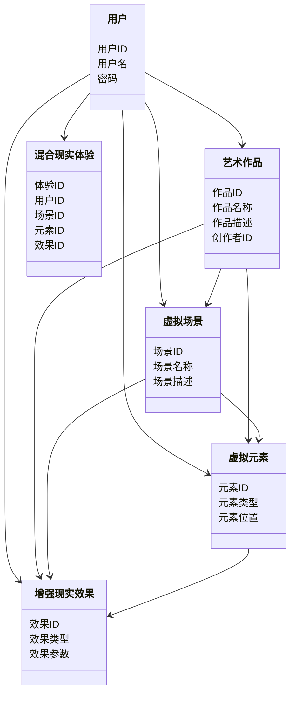
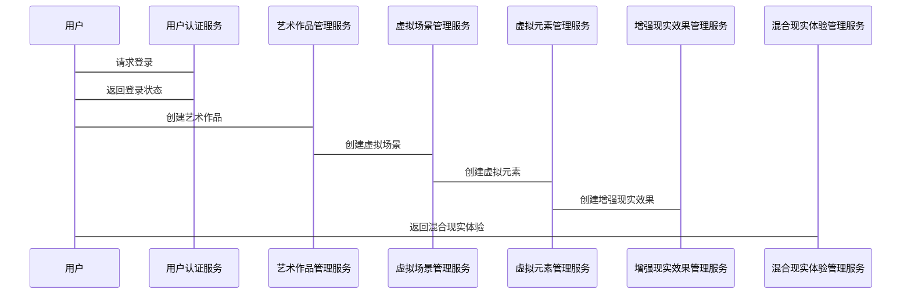

                 


# 混合现实艺术：虚拟与现实交织的创作形式

> 关键词：混合现实艺术、虚拟现实、增强现实、艺术创作、沉浸式体验、数字技术

> 摘要：混合现实艺术是一种结合虚拟现实（VR）和增强现实（AR）技术的新兴艺术形式，它通过虚拟元素与现实场景的融合，为观众提供沉浸式、多感官的交互体验。本文将从概念、技术原理、系统架构、项目实战等方面详细探讨混合现实艺术的创作形式及其未来发展趋势。

---

## **1. 背景介绍**

### **1.1 问题背景**

随着科技的飞速发展，虚拟现实（VR）和增强现实（AR）技术逐渐成熟，开始广泛应用于各个领域。尤其是在艺术创作领域，虚拟与现实相结合的新形式正逐渐成为主流。艺术家们利用这些技术，创造出前所未有的艺术体验，使观众能够以全新的方式与艺术作品互动。

然而，如何充分利用这些新技术，创造出具有深刻内涵和艺术价值的作品，仍然是艺术家和设计师们面临的一大挑战。

### **1.2 问题描述**

本书旨在探讨混合现实艺术这一新兴创作形式，分析其特点、应用领域和发展趋势，并从实践角度提供创作指导。具体来说，本书将回答以下几个问题：

- 混合现实艺术是什么，它有哪些基本形式和特点？
- 混合现实艺术在艺术创作中的应用有哪些，如何实现？
- 混合现实艺术的发展趋势是什么，未来的前景如何？
- 艺术家在设计混合现实艺术作品时，需要注意哪些方面？

### **1.3 问题解决**

本书将采用以下方法解决问题：

- 通过对虚拟现实和增强现实技术的详细介绍，帮助读者理解混合现实艺术的基础。
- 通过案例分析，展示混合现实艺术在实际艺术创作中的应用。
- 通过对混合现实艺术发展趋势的分析，为读者提供未来创作方向。
- 提供实用的创作技巧和工具，帮助艺术家和设计师更好地创作混合现实艺术作品。

### **1.4 边界与外延**

- 混合现实艺术是虚拟现实（VR）和增强现实（AR）技术在艺术领域的应用。
- 混合现实艺术不仅仅局限于视觉艺术，还可以涵盖听觉、触觉等多种感官体验。
- 混合现实艺术可以应用于多种艺术形式，如绘画、雕塑、表演、音乐等。

### **1.5 概念结构与核心要素组成**

- 混合现实（Mixed Reality）：结合了虚拟现实（VR）和增强现实（AR）的技术，提供了一种全新的交互体验。
- 虚拟现实（VR）：通过计算机生成一种模拟环境，使人们感受到完全沉浸式的体验。
- 增强现实（AR）：在现实世界的基础上，通过计算机生成的虚拟元素增强用户的感知。
- 艺术创作：包括绘画、雕塑、表演、音乐等多种形式的艺术活动。
- 创作工具：如VR头显、AR眼镜、3D建模软件、编程工具等。

---

## **2. 核心概念与联系**

### **2.1 混合现实艺术的概念**

混合现实艺术是一种将虚拟现实（VR）和增强现实（AR）技术应用于艺术创作的新形式。它结合了虚拟元素和现实场景，为观众提供了一种全新的、沉浸式的艺术体验。

### **2.2 混合现实艺术的特点**

- **沉浸式体验**：观众可以在虚拟环境中自由探索，感受到身临其境的体验。
- **视觉冲击**：通过虚拟元素与现实场景的融合，创造出独特的视觉效果。
- **多感官互动**：除了视觉，混合现实艺术还可以通过听觉、触觉等多种感官与观众互动。
- **创新性**：混合现实技术为艺术创作提供了无限的可能性，使艺术形式更加多样。

### **2.3 虚拟现实与增强现实的关系**

- **虚拟现实（VR）**：提供了完全沉浸式的虚拟环境，使观众可以完全沉浸在虚拟世界中。
- **增强现实（AR）**：在现实世界的基础上，通过虚拟元素增强观众的感知。
- **结合**：虚拟现实和增强现实技术的结合，使得混合现实艺术具有了独特的魅力。

### **2.4 混合现实艺术的核心要素**

- **艺术创作**：艺术家利用虚拟现实和增强现实技术进行艺术创作，创造出具有独特风格和内涵的作品。
- **观众体验**：观众在虚拟环境中互动，感受到艺术作品的魅力。
- **技术支持**：虚拟现实和增强现实技术为混合现实艺术提供了技术保障。

### **2.5 混合现实艺术的分类**

- **虚拟艺术**：完全在虚拟环境中创作的艺术作品，如虚拟雕塑、虚拟绘画等。
- **增强艺术**：在现实世界基础上增强虚拟元素的艺术作品，如增强现实绘画、增强现实表演等。
- **混合艺术**：虚拟元素与现实场景结合的艺术作品，如混合现实雕塑、混合现实音乐表演等。

---

## **3. 算法原理讲解**

### **3.1 虚拟现实技术**

虚拟现实技术是混合现实艺术创作的基础。它通过计算机生成一个模拟环境，使观众在视觉、听觉等方面感受到身临其境的体验。

#### **3.1.1 虚拟现实技术的原理**

虚拟现实技术基于计算机图形学、人机交互和传感器技术。通过头戴显示器（HMD）、手套、跟踪器等设备，将虚拟环境实时呈现给用户，使用户能够与虚拟环境进行互动。

#### **3.1.2 虚拟现实技术的应用**

- **游戏设计**：通过虚拟现实技术，创造出沉浸式的游戏体验。
- **虚拟旅游**：让观众在虚拟环境中体验各种名胜古迹。
- **虚拟教育**：利用虚拟现实技术，为学生提供沉浸式的学习体验。

### **3.2 增强现实技术**

增强现实技术是在现实世界的基础上，通过计算机生成的虚拟元素增强用户的感知。它为混合现实艺术创作提供了丰富可能性。

#### **3.2.1 增强现实技术的原理**

增强现实技术通过摄像头、传感器和计算机视觉算法，将虚拟元素叠加在现实场景中。用户通过AR眼镜或智能手机等设备，可以看到现实场景与虚拟元素的结合。

#### **3.2.2 增强现实技术的应用**

- **商业广告**：通过增强现实技术，展示产品的三维模型和动态效果。
- **教育**：在现实场景中叠加教学内容，帮助学生更好地理解知识。
- **艺术创作**：在现实环境中添加虚拟艺术元素，创造独特的艺术体验。

---

## **4. 系统分析与架构设计方案**

### **4.1 问题场景介绍**

在艺术创作中，混合现实技术的应用场景包括虚拟画廊、增强现实雕塑、混合现实音乐表演等。艺术家需要通过技术手段，将虚拟元素与现实场景结合，创造出独特的艺术体验。

### **4.2 项目介绍**

假设我们正在开发一个混合现实艺术创作平台，该平台将结合虚拟现实和增强现实技术，帮助艺术家创作和展示混合现实艺术作品。

### **4.3 系统功能设计**

#### **领域模型（Mermaid 类图）**



### **4.4 系统架构设计**

#### **系统架构（Mermaid 架构图）**

```mermaid
container 混合现实艺术创作平台 {
    service 用户认证服务
    service 艺术作品管理服务
    service 虚拟场景管理服务
    service 虚拟元素管理服务
    service 增强现实效果管理服务
    service 混合现实体验管理服务
    component 用户界面
    component 虚拟现实头显
    component 增强现实眼镜
}
```

### **4.5 系统接口设计**

- **用户认证接口**：用于用户登录和注册。
- **艺术作品接口**：用于艺术作品的创建、修改和查询。
- **虚拟场景接口**：用于虚拟场景的创建、修改和查询。
- **虚拟元素接口**：用于虚拟元素的创建、修改和查询。
- **增强现实效果接口**：用于增强现实效果的创建、修改和查询。
- **混合现实体验接口**：用于混合现实体验的创建、修改和查询。

### **4.6 系统交互（Mermaid 序列图）**



---

## **5. 项目实战**

### **5.1 环境安装**

要实现混合现实艺术创作，需要以下环境和工具：

- **操作系统**：Windows 10 或更高版本。
- **开发工具**：Unity 3D 或 Unreal Engine。
- **虚拟现实设备**： Oculus Rift、HTC Vive 等。
- **增强现实框架**：ARKit（iOS）或 ARCore（Android）。

### **5.2 系统核心实现源代码**

以下是一个简单的混合现实艺术创作平台的核心代码示例：

#### **Python 实现的增强现实效果**

```python
import numpy as np
import cv2

def apply_ar_effect(image, overlay_image, position):
    # 将 overlay_image 覆盖到 image 的指定位置
    x, y = position
    rows, cols = overlay_image.shape[:2]
    image[y:y+rows, x:x+cols] = overlay_image
    return image

# 示例使用
image = cv2.imread('real_scene.jpg')
overlay = cv2.imread('virtual_element.png')
position = (100, 100)
result = apply_ar_effect(image, overlay, position)
cv2.imwrite('mixed_reality_art.jpg', result)
```

#### **Unity 实现的虚拟现实场景**

```csharp
using UnityEngine;
using System.Collections;

public class VRSceneController : MonoBehaviour
{
    public Camera[] cameras;
    public GameObject[] objects;

    void Update()
    {
        foreach (Camera cam in cameras)
        {
            foreach (GameObject obj in objects)
            {
                Ray ray = cam.ScreenPointToRay(Input.mousePosition);
                RaycastHit hit = new RaycastHit();
                if (Physics.Raycast(ray, out hit))
                {
                    if (hit.collider.CompareTag("Interactive"))
                    {
                        // 处理交互逻辑
                        print("与对象交互");
                    }
                }
            }
        }
    }
}
```

### **5.3 代码应用解读与分析**

- **Python 代码**：上述代码实现了在现实场景中叠加虚拟元素的效果。通过OpenCV库，将虚拟元素放置在指定位置，生成混合现实效果的图像。
- **Unity 代码**：上述代码实现了虚拟现实场景中的交互逻辑。通过相机和碰撞检测，实现用户与虚拟对象的交互。

### **5.4 实际案例分析**

假设我们正在创作一个混合现实艺术作品，展示一幅虚拟绘画与现实场景结合的作品。艺术家首先在虚拟环境中创作一幅抽象画，然后通过增强现实技术将这幅画叠加到现实场景中。观众可以通过增强现实眼镜，看到这幅虚拟画与现实场景的结合，感受到一种全新的艺术体验。

---

## **6. 总结**

### **6.1 最佳实践 Tips**

- 在创作混合现实艺术作品时，建议艺术家先熟悉虚拟现实和增强现实技术的基本原理。
- 在选择创作工具时，可以根据具体需求选择合适的开发平台和框架。
- 在展示作品时，确保设备和环境的兼容性，以提供最佳的用户体验。

### **6.2 小结**

混合现实艺术是一种新兴的艺术形式，它结合了虚拟现实和增强现实技术，为观众提供了沉浸式、多感官的交互体验。通过本文的探讨，我们了解了混合现实艺术的核心概念、技术原理、系统架构和实际应用。

### **6.3 注意事项**

- 在创作混合现实艺术作品时，需注意技术实现的复杂性，确保作品的稳定性和流畅性。
- 在展示作品时，需确保设备的兼容性和用户界面的友好性，以提升用户体验。

### **6.4 拓展阅读**

- **推荐书籍**：《The Art of Computer Programming》、《Mixed Reality: Where Virtual and Real Worlds Collide》。
- **推荐网站**：[Google Arts & Culture](https://artsandculture.google.com/)、[VR Arts](https://www.vrarts.com/)。

---

**作者：AI天才研究院/AI Genius Institute & 禅与计算机程序设计艺术 /Zen And The Art of Computer Programming**

