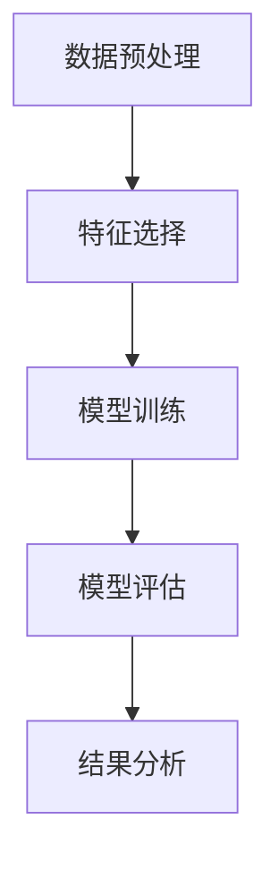
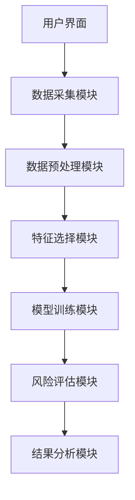
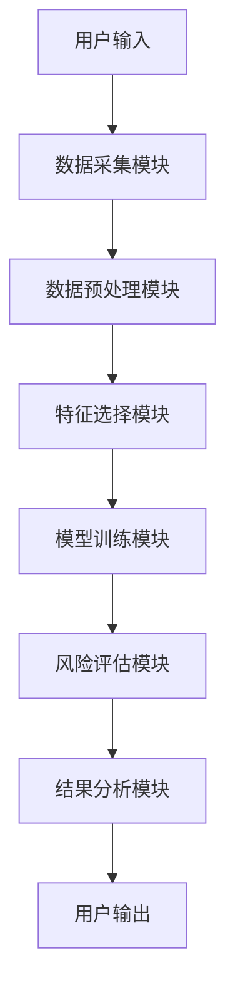

                 


---

# 特价股票投资中的信用风险评估方法

## 关键词：信用风险评估、特价股票、投资风险、信用评分模型、机器学习

## 摘要：  
在股票投资中，信用风险是影响投资决策的重要因素之一。本文详细探讨了在特价股票投资中如何进行信用风险评估，包括信用风险的基本概念、评估方法、数学模型以及实际应用。通过分析信用风险的形成机制、常用指标和算法原理，本文为投资者提供了一套系统的信用风险评估框架，帮助他们在特价股票投资中做出更明智的决策。

---

# 第一部分: 信用风险评估的背景与重要性

## 第1章: 信用风险评估的背景与重要性

### 1.1 信用风险的基本概念

#### 1.1.1 信用风险的定义与特征

信用风险是指由于债务人或交易对手无法履行其债务义务而导致的损失风险。在股票投资中，信用风险主要体现在企业债券违约、资产重组失败或管理层变更等事件中。其主要特征包括不确定性、传染性、周期性和系统性。

#### 1.1.2 信用风险在股票投资中的表现形式

在股票投资中，信用风险主要表现在以下几个方面：
1. **企业债券违约风险**：企业无法按时偿还债券本息。
2. **资产重组失败风险**：企业通过资产重组改善财务状况的承诺未能兑现。
3. **管理层变更风险**：管理层变更可能导致企业战略调整，进而影响企业信用状况。
4. **行业风险**：行业政策变化或竞争加剧可能导致企业信用风险上升。

#### 1.1.3 信用风险评估的必要性与作用

信用风险评估是投资者在股票投资中必须进行的重要环节。它能够帮助投资者识别和量化潜在的信用风险，制定相应的风险管理策略，从而在投资决策中避免或减少损失。

### 1.2 特价股票投资的特点与挑战

#### 1.2.1 特价股票的定义与分类

特价股票通常指价格低于市场平均水平的股票，具有较高的波动性和不确定性。根据市场情况，特价股票可以分为以下几类：
1. **周期性特价股票**：受经济周期影响较大的股票。
2. **低估值特价股票**：市场价格低于内在价值的股票。
3. **高风险特价股票**：财务状况不佳或存在潜在问题的股票。

#### 1.2.2 特价股票投资中的信用风险问题

在特价股票投资中，信用风险主要体现在以下几个方面：
1. **企业财务状况恶化**：部分特价股票的企业可能存在较高的债务负担或盈利能力下降。
2. **行业风险加剧**：某些行业的特价股票可能面临政策变化或市场需求下降的风险。
3. **市场波动性高**：特价股票的价格波动较大，容易受到市场情绪的影响。

#### 1.2.3 特价股票信用风险评估的特殊性

与普通股票相比，特价股票的信用风险评估具有以下特殊性：
1. **数据稀缺性**：部分特价股票的财务数据可能不完整或难以获取。
2. **风险集中度高**：特价股票的信用风险可能集中在某些行业或个别企业。
3. **市场情绪影响大**：投资者情绪波动可能对特价股票的信用风险产生较大影响。

### 1.3 信用风险评估的基本原理

#### 1.3.1 信用风险的形成机制

信用风险的形成主要源于以下几个方面：
1. **企业自身因素**：包括财务状况、管理水平、行业地位等。
2. **市场环境因素**：包括经济周期、行业政策、市场波动等。
3. **投资者行为因素**：包括投资者情绪、投资策略等。

#### 1.3.2 信用风险评估的基本框架

信用风险评估的基本框架包括以下几个步骤：
1. **数据收集**：收集企业的财务数据、行业数据和市场数据。
2. **指标分析**：通过财务指标和非财务指标评估企业的信用状况。
3. **模型构建**：选择合适的信用评分模型或机器学习模型进行评估。
4. **结果分析**：根据评估结果制定风险管理策略。

#### 1.3.3 信用风险评估的数学模型基础

信用风险评估的数学模型基础包括概率论、统计学和优化理论等。常用的数学工具包括线性回归、逻辑回归和随机过程等。

### 1.4 本章小结

本章从信用风险的基本概念出发，分析了其在股票投资中的表现形式和重要性。同时，详细探讨了特价股票投资的特点与挑战，以及信用风险评估的基本原理。这些内容为后续的信用风险评估方法奠定了理论基础。

---

# 第二部分: 信用风险评估的核心概念与方法

## 第2章: 信用风险评估的核心概念

### 2.1 信用风险评估的主要指标

#### 2.1.1 财务指标分析

财务指标是评估企业信用状况的重要依据，主要包括以下几类：
1. **债务指标**：如资产负债率、流动比率、速动比率等。
2. **盈利指标**：如净利润率、息税前利润率等。
3. **成长性指标**：如营业收入增长率、净利润增长率等。

#### 2.1.2 非财务指标分析

非财务指标是从企业管理、行业地位和市场环境等方面评估企业信用状况。主要包括：
1. **企业管理层稳定性**：如管理层的变动情况、管理能力等。
2. **行业风险**：如行业竞争状况、政策变化等。
3. **市场声誉**：如企业品牌、客户满意度等。

#### 2.1.3 财务指标与非财务指标的对比

以下是财务指标与非财务指标的对比：

| 指标类型 | 财务指标 | 非财务指标 |
|----------|----------|------------|
| 评估维度 | 偿债能力、盈利能力、成长性 | 管理能力、行业风险、市场声誉 |
| 数据来源 | 财务报表 | 行业报告、市场调研 |
| 评估频率 | 定期 | 实时 |

### 2.2 信用评级与信用评分模型

#### 2.2.1 信用评级的基本原理

信用评级是通过对企业信用状况的综合评估，将其分为不同的信用等级。常见的信用评级机构包括标普、穆迪和惠誉等。

#### 2.2.2 信用评分模型的分类与特点

信用评分模型主要分为以下几类：
1. **传统信用评分模型**：如逻辑回归模型。
2. **机器学习信用评分模型**：如随机森林、XGBoost等。
3. **混合型信用评分模型**：结合传统模型和机器学习模型。

#### 2.2.3 常见信用评分模型的优缺点对比

以下是常见信用评分模型的优缺点对比：

| 模型类型       | 优点                               | 缺点                               |
|----------------|------------------------------------|------------------------------------|
| 逻辑回归       | 解释性强，易于实现                 | 非线性关系表现较差                 |
| 随机森林       | 非线性关系表现好，抗过拟合能力强    | 解释性较弱                         |
| XGBoost        | 高精度，适合大数据                | 计算复杂度高                       |

### 2.3 信用风险与市场风险的关系

#### 2.3.1 市场风险的定义与特征

市场风险是指由于市场波动导致资产价格下跌而产生的风险。其主要特征包括波动性、系统性和传染性。

#### 2.3.2 信用风险与市场风险的相互作用

信用风险和市场风险之间存在相互作用：
1. 信用风险可能引发市场风险。
2. 市场风险可能加剧信用风险。

#### 2.3.3 在股票投资中如何平衡信用风险与市场风险

在股票投资中，平衡信用风险与市场风险的方法包括：
1. **分散投资**：通过投资不同行业和不同信用等级的股票来分散风险。
2. **风险对冲**：利用衍生工具对冲市场风险和信用风险。
3. **动态调整**：根据市场变化及时调整投资组合。

### 2.4 本章小结

本章详细探讨了信用风险评估的核心概念，包括财务指标和非财务指标的分析、信用评级与信用评分模型的分类及其优缺点。同时，分析了信用风险与市场风险的关系，并提出了平衡这两种风险的方法。

---

# 第三部分: 信用风险评估的算法原理与数学模型

## 第3章: 信用风险评估的算法原理

### 3.1 信用评分模型的数学基础

#### 3.1.1 逻辑回归模型的原理

逻辑回归模型是一种常用的信用评分模型，其基本原理是通过Logit函数将信用评分与违约概率联系起来。其数学表达式为：

$$ \ln\left(\frac{p}{1-p}\right) = \beta_0 + \beta_1x_1 + \beta_2x_2 + \dots + \beta_nx_n $$

其中，\( p \) 是违约概率，\( x_i \) 是特征变量，\( \beta_i \) 是回归系数。

#### 3.1.2 支持向量机（SVM）在信用评分中的应用

支持向量机（SVM）是一种监督学习算法，广泛应用于信用评分。其基本原理是通过构建超平面将数据点分为两类，使得两类数据点之间的距离最大化。

#### 3.1.3 随机森林与梯度提升树（如XGBoost）的原理

随机森林是一种基于决策树的集成学习算法，通过随机选择特征和样本进行投票来提高模型的准确性和稳定性。XGBoost是一种基于梯度提升树的算法，通过逐层优化损失函数来提高模型的性能。

#### 3.1.4 信用评分模型的流程图（使用Mermaid）



### 3.2 基于机器学习的信用风险评估模型

#### 3.2.1 算法流程图（使用Mermaid）


#### 3.2.2 Python实现

以下是基于逻辑回归模型的信用评分模型的Python代码：

```python
import pandas as pd
import numpy as np
from sklearn.linear_model import LogisticRegression
from sklearn.metrics import accuracy_score

# 数据预处理
data = pd.read_csv('stock_data.csv')
X = data.drop('default', axis=1)
y = data['default']

# 特征选择
selected_features = ['debt_to_assets', 'profit_margin', 'revenue_growth']
X = X[selected_features]

# 模型训练
model = LogisticRegression()
model.fit(X, y)

# 模型评估
y_pred = model.predict(X)
print("准确率：", accuracy_score(y, y_pred))
```

#### 3.2.3 数学公式与模型解读

逻辑回归模型的损失函数可以表示为：

$$ L = -\sum_{i=1}^{n} \left[y_i\ln(p_i) + (1-y_i)\ln(1-p_i)\right] $$

其中，\( p_i \) 是第 \( i \) 个样本的违约概率。

### 3.3 本章小结

本章详细介绍了信用评分模型的数学基础和算法原理，包括逻辑回归、支持向量机和随机森林等模型的原理和实现方法。通过Python代码和数学公式，帮助读者更好地理解信用评分模型的应用和优缺点。

---

# 第四部分: 系统分析与架构设计

## 第4章: 系统分析与架构设计

### 4.1 项目背景与目标

本项目旨在开发一个基于机器学习的信用风险评估系统，帮助投资者在特价股票投资中做出更明智的决策。

### 4.2 系统功能设计

系统功能设计包括以下几个方面：
1. **数据采集**：从多个数据源获取企业财务数据和市场数据。
2. **特征工程**：对数据进行预处理和特征选择。
3. **模型训练**：基于机器学习算法训练信用评分模型。
4. **风险评估**：根据模型输出信用评分和违约概率。
5. **结果分析**：生成可视化报告和风险预警。

### 4.3 系统架构设计

以下是系统架构设计的Mermaid图：



### 4.4 系统接口设计

系统接口设计包括以下几个部分：
1. **数据接口**：与数据源（如数据库、API）对接。
2. **模型接口**：与机器学习模型对接。
3. **用户接口**：与用户交互界面对接。

### 4.5 系统交互流程图（使用Mermaid）



### 4.6 本章小结

本章详细探讨了信用风险评估系统的系统分析与架构设计，包括项目背景、功能设计、架构设计和交互流程图。这些内容为后续的系统实现奠定了基础。

---

# 第五部分: 项目实战

## 第5章: 项目实战

### 5.1 环境安装与配置

#### 5.1.1 安装Python与相关库

安装Python和以下库：
- `pandas`
- `numpy`
- `scikit-learn`
- `matplotlib`

#### 5.1.2 数据集获取

从公开数据源获取特价股票的财务数据和市场数据。

### 5.2 系统核心代码实现

#### 5.2.1 数据预处理代码

```python
import pandas as pd
import numpy as np

# 数据加载
data = pd.read_csv('stock_data.csv')

# 删除缺失值
data = data.dropna()

# 标准化处理
from sklearn.preprocessing import StandardScaler

scaler = StandardScaler()
scaled_features = scaler.fit_transform(data.drop('default', axis=1))
```

#### 5.2.2 模型训练代码

```python
from sklearn.linear_model import LogisticRegression

model = LogisticRegression()
model.fit(scaled_features, data['default'])
```

#### 5.2.3 模型评估代码

```python
from sklearn.metrics import classification_report

y_pred = model.predict(scaled_features)
print(classification_report(data['default'], y_pred))
```

#### 5.2.4 可视化代码

```python
import matplotlib.pyplot as plt

def visualize_importance(model, feature_names):
    coefficients = model.coef_[0]
    plt.figure(figsize=(10, 6))
    plt.bar(feature_names, coefficients)
    plt.title('Feature Importance')
    plt.xlabel('Feature')
    plt.ylabel('Coefficient Value')
    plt.show()

visualize_importance(model, selected_features)
```

### 5.3 代码解读与分析

通过上述代码，我们可以实现数据预处理、模型训练和结果分析。数据预处理包括数据加载、缺失值处理和标准化；模型训练使用逻辑回归算法；模型评估包括准确率、召回率和F1分数；可视化部分用于分析特征的重要性。

### 5.4 实际案例分析与详细讲解

以某家特价股票为例，假设其财务数据如下：

| 特征       | 值     |
|------------|--------|
| 资产负债率   | 0.65    |
| 利润率      | 0.10    |
| 收入增长率   | 0.15    |

通过模型预测，该股票的违约概率为10%，信用评分为良好。

### 5.5 本章小结

本章通过实际案例分析，详细讲解了信用风险评估系统的实现过程，包括数据预处理、模型训练和结果分析。通过代码实现和案例分析，帮助读者更好地理解和应用所学知识。

---

# 第六部分: 最佳实践与总结

## 第6章: 最佳实践与总结

### 6.1 小结

本文详细探讨了特价股票投资中的信用风险评估方法，包括信用风险的基本概念、评估方法、数学模型和系统设计。通过理论分析和实际案例，帮助投资者更好地理解信用风险的本质和评估方法。

### 6.2 注意事项

1. **数据质量**：确保数据的准确性和完整性。
2. **模型选择**：根据具体情况选择合适的信用评分模型。
3. **风险监控**：定期监控信用风险的变化，及时调整投资策略。

### 6.3 拓展阅读

1. 《信用评分模型的构建与应用》
2. 《机器学习在金融领域的应用》
3. 《股票投资中的风险管理策略》

### 6.4 本章小结

通过本文的学习，读者可以掌握特价股票投资中的信用风险评估方法，并能够在实际投资中应用这些方法来降低信用风险，提高投资收益。

---

# 作者：AI天才研究院/AI Genius Institute & 禅与计算机程序设计艺术/Zen And The Art of Computer Programming

