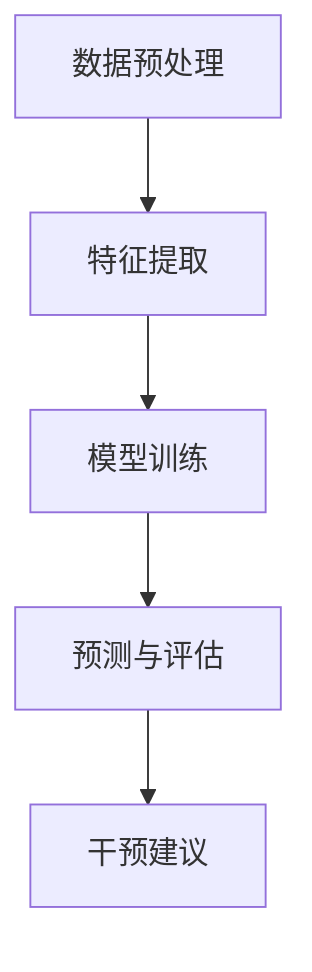
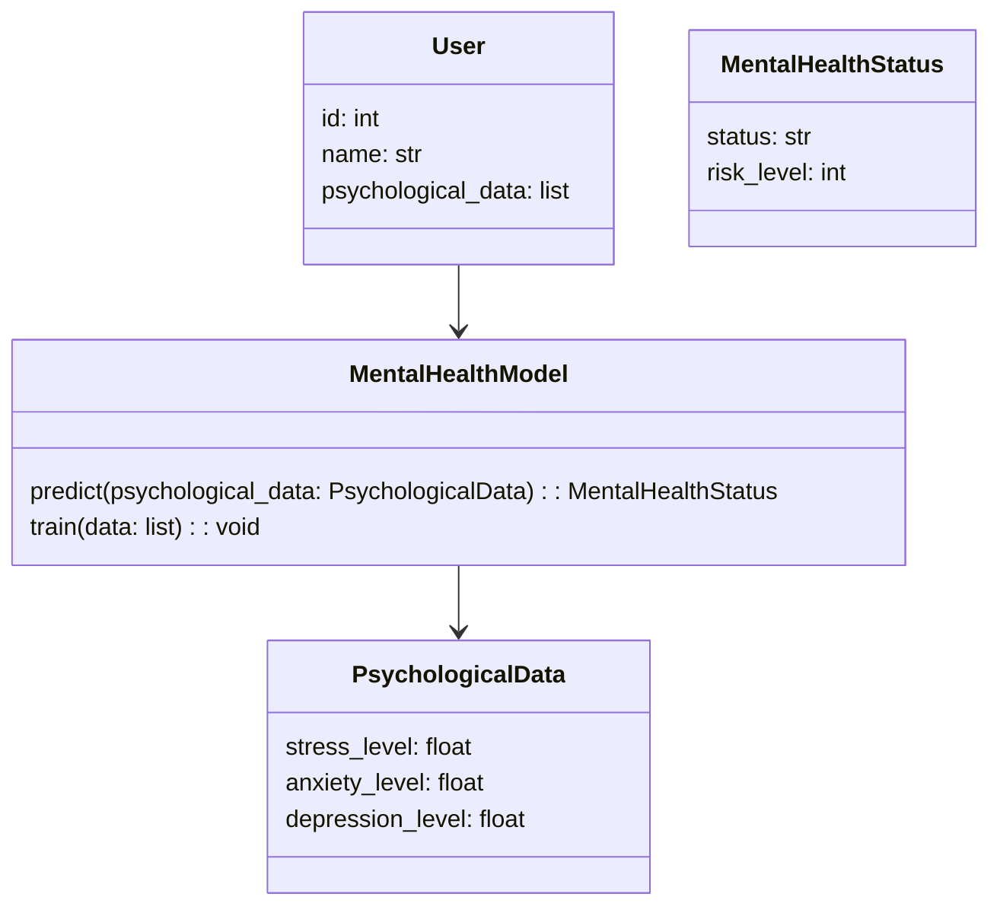

                 


# 现代社会中的精神危机与重生之路

> 关键词：现代社会，精神危机，心理健康，预防，干预，人工智能，算法，系统架构

> 摘要：现代社会中，精神危机问题日益严重，影响了个体和整个社会的健康发展。本文从技术角度出发，分析了精神危机的核心概念、预防和干预方法，提出了基于人工智能和算法的解决方案，并探讨了系统架构设计与实际应用场景。通过技术手段，我们有望为解决精神危机问题提供新的思路和方法。

---

## 第一部分：背景介绍

### 1.1 问题背景

现代社会的快速发展带来了前所未有的压力。经济压力、人际关系紧张、社会竞争激烈等因素，使人们面临着不同程度的心理健康问题。精神危机不仅影响了个人的生活质量，还对整个社会产生了负面影响。

### 1.2 问题描述

精神危机的表现形式多样，包括焦虑、抑郁、失眠、人际关系问题等。这些问题不仅困扰着成年人，儿童和青少年也深受其害。精神危机不仅影响个体的心理健康，还可能导致工作效率降低、家庭破裂、社会问题等一系列连锁反应。

### 1.3 问题解决

解决精神危机问题的关键在于找到根源，进行有效的预防和干预。这需要从个人、家庭、社会等多方面入手，采取综合性的措施。

### 1.4 边界与外延

精神危机不仅涉及心理健康问题，还与生活方式、社会文化、经济状况等因素密切相关。因此，解决精神危机需要跨学科、跨领域的合作。

### 1.5 概念结构与核心要素组成

- **精神危机**：个体在心理、情感、认知等方面出现严重问题，导致生活质量下降。
- **心理健康**：个体在心理、情感、认知等方面处于良好状态，能够有效应对生活中的挑战。
- **预防**：通过采取一系列措施，降低精神危机的发生风险。
- **干预**：在精神危机发生时，采取有效措施进行干预，帮助个体恢复正常状态。

### 1.6 本章小结

本章对现代社会中的精神危机问题进行了全面介绍，包括问题的背景、问题描述、问题解决方法、边界与外延以及核心概念的结构与组成。希望通过本章的学习，读者能够对精神危机问题有更深入的了解，为后续章节的学习打下基础。

---

## 第二部分：核心概念与联系

### 2.1 核心概念原理

#### 2.1.1 精神危机

精神危机是指个体在心理、情感、认知等方面出现严重问题，导致生活质量下降。具体表现为焦虑、抑郁、失眠、人际关系问题等。

#### 2.1.2 心理健康

心理健康是指个体在心理、情感、认知等方面处于良好状态，能够有效应对生活中的挑战。具体表现为情绪稳定、人际关系良好、能够适应社会环境等。

#### 2.1.3 预防

预防是指通过采取一系列措施，降低精神危机的发生风险。具体方法包括提高个体心理健康素养、建立良好的生活方式、加强社会支持等。

#### 2.1.4 干预

干预是指在精神危机发生时，采取有效措施进行干预，帮助个体恢复正常状态。具体方法包括心理咨询、心理治疗、药物治疗等。

### 2.2 概念属性特征对比表格

| 概念         | 定义                                                                 | 特征                                                                 |
|--------------|----------------------------------------------------------------------|----------------------------------------------------------------------|
| 精神危机     | 个体在心理、情感、认知等方面出现严重问题，导致生活质量下降。 | 表现为焦虑、抑郁、失眠、人际关系问题等。                              |
| 心理健康     | 个体在心理、情感、认知等方面处于良好状态，能够有效应对生活中的挑战。 | 表现为情绪稳定、人际关系良好、能够适应社会环境等。                  |
| 预防         | 通过采取一系列措施，降低精神危机的发生风险。                     | 包括提高个体心理健康素养、建立良好的生活方式、加强社会支持等。     |
| 干预         | 在精神危机发生时，采取有效措施进行干预，帮助个体恢复正常状态。 | 包括心理咨询、心理治疗、药物治疗等。                                 |

### 2.3 ER实体关系图架构

```mermaid
erDiagram
  Person ||--|{ PsychologicalProblem }|-- PsychologicalHealth
  Person ||--|{ PreventionMethod }|-- Prevention
  Person ||--|{ InterventionMethod }|-- Intervention
```

### 2.4 本章小结

本章详细介绍了与现代社会精神危机相关的核心概念及其属性特征，并通过对比表格和ER实体关系图进行了阐述。这些核心概念对于理解精神危机的本质、预防措施和干预方法具有重要意义。希望读者通过本章的学习，能够对精神危机的核心概念有更深入的了解。

---

## 第三部分：算法原理讲解

### 3.1 算法原理概述

精神危机的预防和干预需要借助技术手段，尤其是人工智能和机器学习。我们可以通过分析海量数据，建立心理健康评估模型，从而实现早期预警和个性化干预。

### 3.2 算法流程图



### 3.3 算法实现代码

以下是一个基于机器学习的心理健康评估模型的Python代码示例：

```python
import pandas as pd
from sklearn.model_selection import train_test_split
from sklearn.ensemble import RandomForestClassifier
from sklearn.metrics import accuracy_score

# 加载数据
data = pd.read_csv('mental_health.csv')

# 数据预处理
X = data.drop('mental_health_status', axis=1)
y = data['mental_health_status']

# 划分训练集和测试集
X_train, X_test, y_train, y_test = train_test_split(X, y, test_size=0.2, random_state=42)

# 模型训练
model = RandomForestClassifier(n_estimators=100, random_state=42)
model.fit(X_train, y_train)

# 预测与评估
y_pred = model.predict(X_test)
print("模型准确率：", accuracy_score(y_test, y_pred))
```

### 3.4 算法数学模型

心理健康评估模型可以表示为：

$$
y = f(x) + \epsilon
$$

其中，$y$ 是心理健康状态，$x$ 是输入特征，$f(x)$ 是模型的预测函数，$\epsilon$ 是误差项。

---

## 第四部分：系统分析与架构设计方案

### 4.1 问题场景介绍

精神危机的预防和干预需要构建一个综合系统，包括数据采集、分析、预警和干预功能。

### 4.2 系统功能设计

#### 领域模型类图



#### 系统架构图


---

## 第五部分：项目实战

### 5.1 环境安装

需要安装以下工具和库：

- Python 3.8+
- Pandas
- Scikit-learn
- Mermaid CLI

### 5.2 核心实现源代码

以下是一个心理健康评估系统的核心代码：

```python
import pandas as pd
from sklearn.ensemble import RandomForestClassifier
from sklearn.metrics import accuracy_score
from sklearn.preprocessing import StandardScaler
from sklearn.pipeline import Pipeline

# 数据加载与预处理
data = pd.read_csv('mental_health.csv')
X = data.drop(columns=['id', 'mental_health_status'])
y = data['mental_health_status']

# 特征工程
pipeline = Pipeline([
    ('scaler', StandardScaler()),
    ('classifier', RandomForestClassifier(n_estimators=100))
])

# 划分数据集
X_train, X_test, y_train, y_test = train_test_split(X, y, test_size=0.2, random_state=42)

# 模型训练
pipeline.fit(X_train, y_train)

# 预测与评估
y_pred = pipeline.predict(X_test)
print(f"模型准确率：{accuracy_score(y_test, y_pred):.4f}")
```

### 5.3 案例分析

以一个实际案例为例，假设某用户的心理数据如下：

```python
user_data = {
    'stress_level': 0.8,
    'anxiety_level': 0.7,
    'depression_level': 0.6
}

# 转换为DataFrame格式
user_df = pd.DataFrame([user_data])
# 预测心理健康状态
predicted_status = pipeline.predict(user_df)
print(f"预测的心理健康状态：{predicted_status[0]}")
```

---

## 第六部分：最佳实践与小结

### 6.1 小结

本文从技术角度出发，分析了精神危机的核心概念，并提出了基于人工智能的解决方案。通过算法和系统架构设计，我们有望为解决精神危机问题提供新的思路。

### 6.2 注意事项

- 数据隐私保护是心理健康系统设计中的重要问题。
- 模型的准确性和可解释性需要进一步优化。
- 系统的推广和普及需要社会和政策的支持。

### 6.3 拓展阅读

- 《人工智能在心理健康领域的应用》
- 《基于机器学习的心理健康评估模型研究》
- 《系统架构设计与心理健康解决方案》

---

## 作者

作者：AI天才研究院/AI Genius Institute & 禅与计算机程序设计艺术 /Zen And The Art of Computer Programming

---

希望这篇文章能够为解决现代社会中的精神危机问题提供新的思路和方法。

