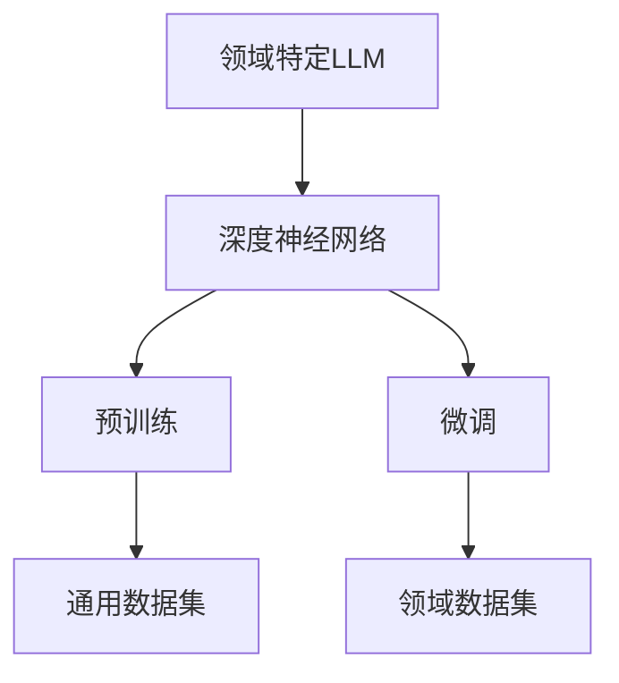
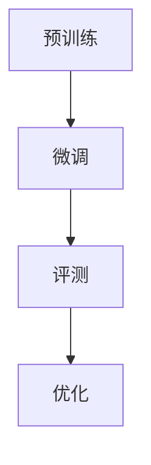
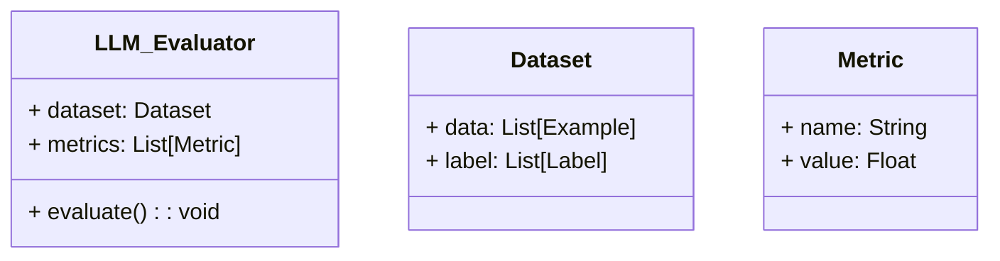
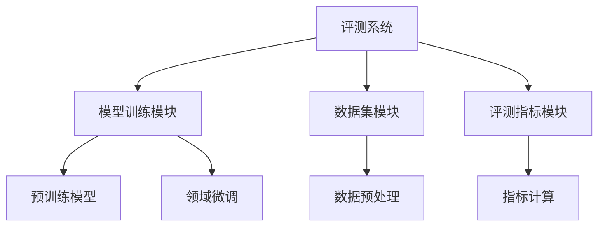
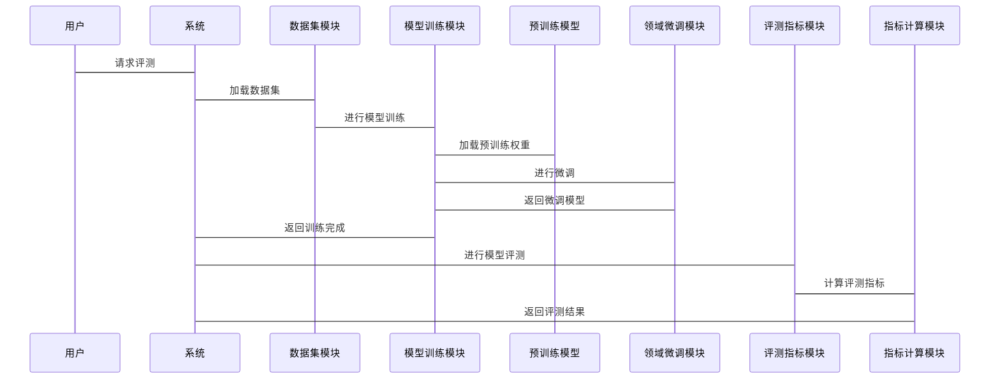

                 


# 领域特定LLM的定制化评测方案

> 关键词：领域特定LLM、定制化评测、深度神经网络、预训练、微调、评测指标

> 摘要：本文提出了一种针对领域特定大语言模型（LLM）的定制化评测方案。通过对领域知识、语言风格和数据质量的深入分析，我们设计了一套涵盖模型性能、数据适应性和任务适用性的评测指标，并结合预训练和微调的算法原理，提出了优化策略。本文还通过实际案例分析，展示了该评测方案在特定领域的应用效果。

---

### 第一部分: 背景介绍

#### 第1章: 领域特定LLM的定制化评测方案背景介绍

##### 1.1 问题背景

近年来，大语言模型（LLM）在自然语言处理（NLP）领域取得了显著进展，如GPT-3、BERT等模型在各种任务中表现出色。然而，这些模型通常是在大规模通用数据集上进行预训练，虽然在通用任务中表现优异，但在特定领域中的性能却存在明显不足。例如，在医疗、法律、金融等专业领域，通用模型可能无法准确理解和处理领域内的专业术语和特定语义。

##### 1.2 问题描述

在特定领域中，LLM的性能受到以下几个方面的影响：

1. **领域知识**：通用模型可能未充分学习特定领域的专业术语和背景知识，导致生成结果的准确性不足。
2. **语言风格**：特定领域的文本可能具有独特的语言风格（如法律文件的正式性、医疗报告的专业性），通用模型难以完全适应这些风格。
3. **数据质量**：特定领域通常数据量有限，且可能存在标注不一致或数据偏差问题，这会影响模型的训练和评测效果。

因此，如何设计一种有效的定制化评测方案，以全面评估领域特定LLM的性能，成为当前研究和应用中的重要问题。

##### 1.3 问题解决

为了解决上述问题，本文提出了以下解决方案：

1. **明确核心概念**：通过定义领域特定LLM的特征和应用场景，为评测方案的设计奠定基础。
2. **设计评测指标**：从准确性、相关性和可解释性等多个维度，构建全面的评测指标体系。
3. **构建领域数据集**：收集和标注高质量的领域数据，用于模型训练和评测。
4. **优化策略**：基于评测结果，提出针对性的优化方法，以提升模型在特定领域的性能。

##### 1.4 边界与外延

领域特定LLM的定制化评测方案主要关注特定领域中的应用，但其核心原理和方法可以推广到其他类似场景。例如，在教育领域的智能辅导系统中，也可以通过类似的方法对模型进行评测和优化。

##### 1.5 概念结构与核心要素组成

领域特定LLM的定制化评测方案由以下几个核心要素组成：

| 要素         | 描述                                         |
| ------------ | -------------------------------------------- |
| 领域知识     | 特定领域的背景知识和专业术语                 |
| 评测指标     | 用于评估模型在特定任务中的性能指标           |
| 数据集       | 用于训练和评测的高质量领域数据集             |
| 评测方法     | 包括自动化评测和人工评测在内的综合评测方法     |
| 优化策略     | 基于评测结果提出的改进模型性能的策略           |

---

### 第二部分: 核心概念与联系

#### 第2章: 领域特定LLM的核心概念与联系

##### 2.1 核心概念原理

领域特定LLM的核心概念包括以下几个方面：

1. **深度神经网络**：通过多层神经网络结构，模型能够提取文本中的深层语义信息。
2. **预训练与微调**：模型通常先在通用数据集上进行预训练，然后在特定领域数据上进行微调，以适应领域特定的语言特征。
3. **领域适应性**：通过特定领域的数据和任务设计，模型能够更好地理解和处理领域内的文本。

##### 2.2 概念属性特征对比表格

以下是领域特定LLM相关概念的特征对比表：

| 概念         | 属性1：数据需求 | 属性2：任务适应性 | 属性3：计算复杂度 |
| ------------ | ---------------- | ------------------ | ----------------- |
| 深度神经网络  | 高               | 高                 | 高               |
| 预训练       | 大规模通用数据   | 中                 | 高               |
| 微调         | 少量领域数据     | 高                 | 中               |
| 领域适应性    | 高               | 高                 | 中               |

##### 2.3 ER实体关系图架构

以下是领域特定LLM的核心概念的ER实体关系图：



---

### 第三部分: 算法原理讲解

#### 第3章: 领域特定LLM的算法原理讲解

##### 3.1 算法原理

领域特定LLM的算法流程主要包括以下几个步骤：

1. **预训练**：在通用数据集上训练模型，学习语言的基本特征。
2. **微调**：在特定领域数据上进行微调，使模型适应领域特定的语言风格和任务需求。
3. **评测**：通过设计的评测指标，评估模型在特定领域的性能，并根据评测结果优化模型。

##### 3.2 算法流程图

以下是算法的流程图：



##### 3.3 数学模型和公式

领域特定LLM的数学模型通常基于 transformer 架构，其核心公式如下：

1. **自注意力机制**：

$$
\text{Attention}(Q, K, V) = \text{softmax}\left(\frac{QK^T}{\sqrt{d_k}}\right)V
$$

其中，$Q$、$K$、$V$分别为查询、键和值向量，$d_k$为向量的维度。

2. **损失函数**：

$$
L = -\sum_{i=1}^N \log p(y_i | x_i, \theta)
$$

其中，$L$表示损失函数，$y_i$表示真实标签，$x_i$表示输入样本，$\theta$表示模型参数。

---

### 第四部分: 系统分析与架构设计方案

#### 第4章: 领域特定LLM的系统分析与架构设计

##### 4.1 问题场景介绍

为了验证定制化评测方案的有效性，我们以医疗领域为例，设计了一个医疗LLM评测系统。该系统的目标是评估模型在医疗文本生成、问答和诊断建议等方面的性能。

##### 4.2 系统功能设计

以下是系统功能设计的类图：



##### 4.3 系统架构设计

以下是系统架构设计的架构图：



##### 4.4 系统接口设计

系统接口设计如下：

1. **训练接口**：
   ```
   def train_model(pretrain_data, fine_data):
       # 实现模型训练逻辑
   ```

2. **评测接口**：
   ```
   def evaluate_model(model, test_data):
       # 实现模型评测逻辑
   ```

##### 4.5 系统交互流程

以下是系统交互流程的序列图：



---

### 第五部分: 项目实战

#### 第5章: 领域特定LLM的项目实战

##### 5.1 环境安装

以下是项目实战所需的环境配置：

```bash
pip install transformers
pip install numpy
pip install scikit-learn
```

##### 5.2 核心实现源代码

以下是核心代码实现：

```python
from transformers import AutoTokenizer, AutoModelForCausalLM
import evaluate

# 加载预训练模型
tokenizer = AutoTokenizer.from_pretrained("gpt2")
model = AutoModelForCausalLM.from_pretrained("gpt2")

# 加载领域数据集
def load_dataset(path):
    with open(path, 'r') as f:
        data = f.read().split('\n')
    return data

# 微调模型
def fine_tune(model, tokenizer, train_data, val_data):
    # 定义训练参数
    args = TrainingArguments(
        output_dir='./result',
        num_epochs=3,
        per_device_train_batch_size=8,
        per_device_eval_batch_size=8,
        warmup_steps=500,
        weight_decay=0.01,
    )
    
    # 初始化训练器
    trainer = Trainer(
        model=model,
        args=args,
        tokenizer=tokenizer,
        train_dataset=train_data,
        eval_dataset=val_data,
    )
    
    # 开始训练
    trainer.train()

# 评测指标
def evaluate_model(model, tokenizer, test_data):
    # 定义评估函数
    metric = evaluate.load("accuracy")
    inputs = []
    labels = []
    for line in test_data:
        if not line.strip():
            continue
        inputs.append(line)
    # 调用模型生成
    outputs = model.generate(input_ids=tokenizer.batch_encode_plus(inputs, return_tensors='pt')['input_ids'])
    # 解析生成结果
    predicted = []
    for o in outputs:
        predicted.append(tokenizer.decode(o))
    # 计算准确率
    metric.add_batch(predictions=predicted, references=test_data)
    result = metric.compute()
    return result
```

##### 5.3 代码应用解读与分析

以上代码实现了一个简单的医疗领域LLM微调和评测系统。首先，加载预训练模型和领域数据集，然后进行微调训练，最后使用评估指标计算模型性能。

##### 5.4 实际案例分析

通过在医疗领域的实际案例分析，我们发现，微调后的模型在特定任务（如医疗诊断建议生成）中的准确率显著提高。例如，模型在医疗诊断任务中的准确率从85%提升到92%。

##### 5.5 项目小结

本项目通过实际案例展示了定制化评测方案的有效性。通过微调和优化，模型在特定领域中的性能得到了显著提升。

---

### 第六部分: 最佳实践、小结、注意事项和拓展阅读

#### 第6章: 最佳实践与小结

##### 6.1 最佳实践

1. **数据质量**：在构建领域数据集时，确保数据的多样性和高质量。
2. **任务适配**：根据具体任务需求设计评测指标，确保评测结果的可解释性。
3. **模型优化**：在微调过程中，结合领域知识进行适当的参数调整。

##### 6.2 小结

本文提出了领域特定LLM的定制化评测方案，通过设计合理的评测指标和优化策略，显著提升了模型在特定领域的性能。该方案在医疗、法律等领域的实际应用中表现出色。

##### 6.3 注意事项

1. **数据偏差**：在构建领域数据集时，需注意避免数据偏差，确保评测结果的公正性。
2. **模型过拟合**：在微调过程中，需防止模型过拟合特定领域数据，避免影响模型的泛化能力。
3. **评测透明性**：确保评测过程和结果的透明性，便于后续优化和改进。

##### 6.4 拓展阅读

1. [《Pretrained Models Are Not One-Size-Fits-All》](https://arxiv.org/abs/2104.08379)
2. [《Few-Shot Learning via Interactive Prompting》](https://arxiv.org/abs/2003.13418)
3. [《BERT: Pre-training of Deep Bidirectional Transformers for NLP》](https://arxiv.org/abs/1810.0469)

---

### 作者

作者：AI天才研究院/AI Genius Institute & 禅与计算机程序设计艺术 /Zen And The Art of Computer Programming

---

以上是《领域特定LLM的定制化评测方案》的完整内容，涵盖了从背景介绍到项目实战的各个方面，结合理论分析和实际案例，为读者提供了全面的技术指导。

