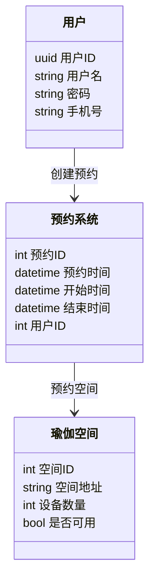
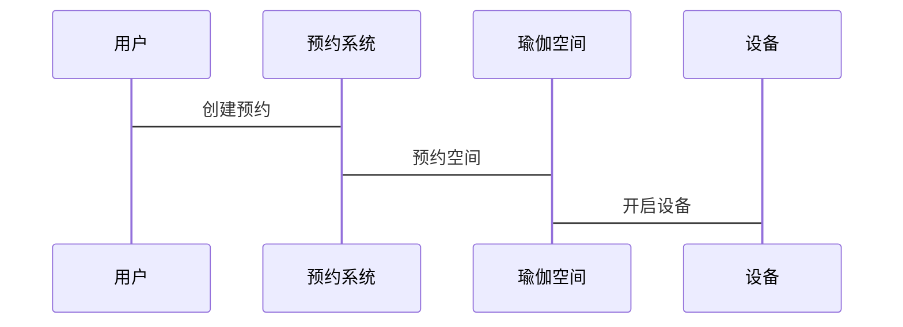
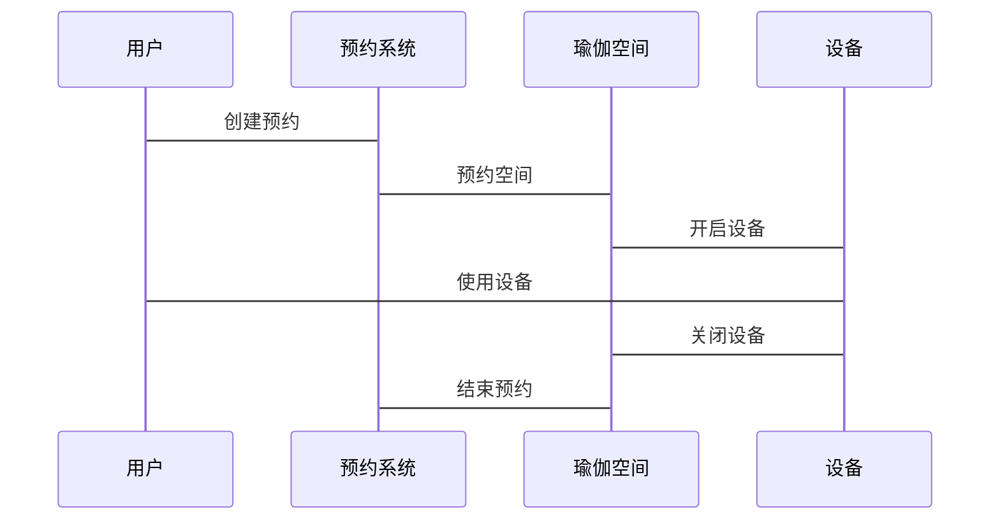
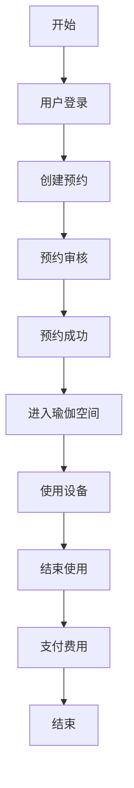

                 


# 新型城市共享瑜伽室：24小时自助瑜伽空间

> 关键词：共享经济，瑜伽，24小时自助，健康管理，物联网技术，系统设计

> 摘要：随着共享经济的兴起和人们对健康生活的追求，24小时自助瑜伽室作为一种新兴的城市健康管理方式，正逐渐受到关注。本文从背景、概念、系统设计、算法实现、项目实战到最佳实践，全面探讨新型城市共享瑜伽室的发展现状、技术实现和未来趋势。通过详细的技术分析和案例解读，为读者提供一个全面了解和实践共享瑜伽室的视角。

---

## 第一部分：背景介绍

### 第1章：问题背景与现状分析

#### 1.1 问题背景

##### 1.1.1 共享经济的兴起

共享经济作为一种新型经济模式，通过互联网技术和平台的中介作用，将闲置资源进行有效分配，满足用户的多样化需求。近年来，共享经济在全球范围内迅速发展，覆盖了交通、住宿、办公空间等多个领域。共享经济的核心理念是通过技术创新和资源整合，提高资源利用效率，降低用户使用成本。

##### 1.1.2 城市居民对健康需求的增加

随着城市化进程的加快和生活节奏的加快，城市居民的健康问题日益凸显。根据世界卫生组织的统计，城市居民的亚健康状态比例逐年上升。瑜伽作为一种集身体锻炼、心理放松和精神修持于一体的健康方式，越来越受到城市居民的青睐。然而，传统瑜伽室的高成本、固定开放时间以及缺乏灵活性等问题，限制了其普及和推广。

##### 1.1.3 瑜伽室的现状与不足

传统瑜伽室通常需要高昂的租金、装修和人工成本，导致其运营成本较高，会员费用也相对昂贵。此外，传统瑜伽室的开放时间受限，用户需要在固定的时间段内前往瑜伽室，灵活性较低。对于许多城市居民来说，时间安排困难，难以频繁前往瑜伽室进行锻炼。因此，如何提供一种灵活、便捷、低成本的瑜伽锻炼方式，成为当前市场的重要需求。

#### 1.2 共享瑜伽室的发展趋势

##### 1.2.1 共享瑜伽室的潜在市场

随着城市化进程的加快和人们对健康生活的追求，共享瑜伽室的潜在市场巨大。尤其是在一线城市，由于生活节奏快、工作压力大，许多居民希望能够在工作之余进行瑜伽锻炼，以缓解身心压力。共享瑜伽室通过提供灵活的使用时间和共享的模式，能够满足这部分用户的需求。

##### 1.2.2 24小时自助瑜伽空间的优势

24小时自助瑜伽空间是一种基于共享经济理念的新型瑜伽锻炼方式。用户可以通过手机APP预约，使用智能设备完成身份验证和门禁控制，无需人工服务即可进入瑜伽空间进行锻炼。24小时自助瑜伽空间的优势在于其灵活性和便捷性，用户可以根据自己的时间安排随时进入瑜伽空间进行锻炼，无需担心开放时间限制。

##### 1.2.3 共享瑜伽室的发展趋势分析

共享瑜伽室的发展趋势主要体现在以下几个方面：首先，随着技术的进步，共享瑜伽室将更加智能化，用户可以通过手机APP实现预约、支付、门禁控制等操作；其次，共享瑜伽室的设备将更加多样化，以满足不同用户的需求；最后，共享瑜伽室将通过数据化管理，实现用户行为分析和设备优化，进一步提升用户体验。

#### 1.3 研究目的与方法

##### 1.3.1 研究目的

本研究旨在探讨共享经济背景下，24小时自助瑜伽空间的技术实现和运营模式，分析其在城市健康管理中的应用潜力，为未来的健康服务提供新的思路。

##### 1.3.2 研究方法

本研究采用文献研究、案例分析和系统设计相结合的方法。首先，通过文献研究了解共享经济和瑜伽室的现状；其次，结合实际案例分析24小时自助瑜伽空间的优势和挑战；最后，通过系统设计，提出一种基于物联网技术和共享经济理念的24小时自助瑜伽空间实现方案。

#### 1.4 边界与外延

##### 1.4.1 共享瑜伽室的边界定义

共享瑜伽室的边界主要集中在以下几个方面：首先，共享瑜伽室的使用权限仅限于已预约的用户；其次，共享瑜伽室的设备和空间仅用于瑜伽锻炼，不得用于其他用途；最后，共享瑜伽室的运营方仅负责设备的维护和管理，不提供教练服务。

##### 1.4.2 24小时自助瑜伽空间的范围

24小时自助瑜伽空间的范围包括：24小时开放的瑜伽空间、智能门禁系统、预约系统、支付系统以及用户数据管理系统。

##### 1.4.3 研究的外延与限制

本研究的外延主要集中在共享瑜伽室的技术实现和运营模式，不涉及瑜伽课程的设计和教学。研究的限制在于，目前仅探讨24小时自助瑜伽空间的技术实现，未涉及具体的市场推广和用户行为分析。

#### 1.5 本章小结

本章从问题背景、发展趋势、研究目的与方法、边界与外延等方面，全面分析了共享瑜伽室的发展现状和潜在需求。通过对比传统瑜伽室和共享瑜伽室的优缺点，提出了24小时自助瑜伽空间作为一种新型的城市健康管理方式，具有广阔的发展前景。

---

## 第二部分：核心概念与联系

### 第2章：核心概念原理

#### 2.1 共享瑜伽室

##### 2.1.1 共享瑜伽室的定义

共享瑜伽室是一种基于共享经济理念的瑜伽锻炼场所，用户可以通过预约系统使用智能设备完成预约、支付和门禁控制，无需人工服务即可进入瑜伽室进行锻炼。共享瑜伽室通常采用按需付费的模式，用户可以根据实际需求选择使用时间。

##### 2.1.2 共享瑜伽室的核心特点

1. **灵活性**：用户可以根据自己的时间安排随时预约，无需固定时间段。
2. **便捷性**：用户可以通过手机APP完成预约、支付和门禁控制，无需现场排队。
3. **低成本**：共享瑜伽室的运营成本较低，用户支付的费用也相对较低。
4. **智能化**：通过物联网技术和智能设备，实现预约、支付、门禁控制的自动化管理。

##### 2.1.3 共享瑜伽室的类型

1. **自助式共享瑜伽室**：用户通过预约系统和智能设备自行进入瑜伽室进行锻炼。
2. **会员制共享瑜伽室**：用户通过购买会员卡，享受无限次或一定次数的瑜伽锻炼。
3. **按次付费共享瑜伽室**：用户每次使用支付费用，无需购买会员卡。

#### 2.2 24小时自助瑜伽空间

##### 2.2.1 24小时自助瑜伽空间的定义

24小时自助瑜伽空间是一种基于物联网技术和共享经济理念的瑜伽锻炼场所，用户可以通过预约系统和智能设备实现24小时全天候的瑜伽锻炼。24小时自助瑜伽空间通常采用无人值守的运营模式，用户无需人工服务即可完成预约、支付和门禁控制。

##### 2.2.2 24小时自助瑜伽空间的优势

1. **全天候服务**：用户可以在任何时间预约进入瑜伽空间进行锻炼。
2. **无人值守**：通过智能设备实现预约、支付和门禁控制，无需人工服务。
3. **高效管理**：通过物联网技术和数据分析，实现设备的智能化管理和用户行为的优化。

##### 2.2.3 24小时自助瑜伽空间的实现

24小时自助瑜伽空间的实现依赖于以下几个关键要素：

1. **智能预约系统**：用户可以通过手机APP或网站预约瑜伽空间。
2. **智能门禁系统**：通过指纹识别、人脸识别或电子钥匙实现门禁控制。
3. **物联网设备**：用于监测设备状态、用户行为和环境数据。
4. **支付系统**：通过移动支付实现费用的自动扣缴。

#### 2.3 概念属性特征对比

以下是共享瑜伽室和传统瑜伽室的对比：

| **属性**         | **传统瑜伽室**         | **共享瑜伽室**         |
|-------------------|------------------------|-------------------------|
| **开放时间**      | 固定时间段            | 24小时自助             |
| **预约方式**      | 需提前预约            | 支持手机APP预约         |
| **支付方式**      | 现场支付或会员卡       | 支持移动支付             |
| **设备管理**      | 需人工管理            | 智能设备自动管理       |
| **运营成本**      | 较高                  | 较低                    |

#### 2.4 ER实体关系图架构

以下是共享瑜伽室和24小时自助瑜伽空间的ER实体关系图：

```mermaid
erDiagram
    actor 用户 {
        uuid 用户ID
        string 用户名
        string 密码
        string 手机号
    }
    class 预约系统 {
        int 预约ID
        datetime 预约时间
        datetime 开始时间
        datetime 结束时间
        int 用户ID
    }
    class 瑜伽空间 {
        int 空间ID
        string 空间地址
        int 设备数量
        bool 是否可用
    }
    class 设备 {
        int 设备ID
        string 设备类型
        bool 是否正常
    }
    user 用户 o-|> 预约系统 : 预约
    预约系统 o-|> 瑜伽空间 : 使用
    瑜伽空间 o-|> 设备 : 配备
```

#### 2.5 本章小结

本章从核心概念入手，详细阐述了共享瑜伽室和24小时自助瑜伽空间的定义、特点和类型，并通过对比分析和ER实体关系图，展示了两者的异同和内在联系。这些分析为后续的系统设计和实现奠定了基础。

---

## 第三部分：系统设计与实现

### 第3章：系统功能设计

#### 3.1 系统介绍

##### 3.1.1 共享瑜伽室系统概述

共享瑜伽室系统是一个基于物联网技术和共享经济理念的智能预约和管理平台。用户可以通过手机APP或网站预约瑜伽空间，系统通过智能门禁设备和物联网技术实现预约、支付和设备管理的自动化。

##### 3.1.2 24小时自助瑜伽空间系统概述

24小时自助瑜伽空间系统是一个全天候开放的智能预约和管理平台。用户可以通过手机APP或网站预约瑜伽空间，系统通过智能门禁设备和物联网技术实现24小时自助的预约、支付和设备管理。

#### 3.2 领域模型

##### 3.2.1 共享瑜伽室领域模型

以下是共享瑜伽室的领域模型：



##### 3.2.2 24小时自助瑜伽空间领域模型

以下是24小时自助瑜伽空间的领域模型：


#### 3.3 系统架构设计

##### 3.3.1 共享瑜伽室系统架构设计

以下是共享瑜伽室系统的架构设计：


##### 3.3.2 24小时自助瑜伽空间系统架构设计

以下是24小时自助瑜伽空间系统的架构设计：


#### 3.4 系统接口设计

##### 3.4.1 共享瑜伽室系统接口设计

以下是共享瑜伽室系统的接口设计：



##### 3.4.2 24小时自助瑜伽空间系统接口设计

以下是24小时自助瑜伽空间系统的接口设计：


#### 3.5 系统交互

##### 3.5.1 共享瑜伽室系统交互设计

以下是共享瑜伽室系统的交互设计：



##### 3.5.2 24小时自助瑜伽空间系统交互设计

以下是24小时自助瑜伽空间系统的交互设计：


#### 3.6 本章小结

本章从系统功能设计的角度，详细阐述了共享瑜伽室和24小时自助瑜伽空间的系统架构、接口设计和交互流程。通过领域模型和系统架构图，展示了系统的整体结构和功能模块之间的关系。

---

## 第四部分：算法原理讲解

### 第4章：算法原理讲解

#### 4.1 算法mermaid流程图

##### 4.1.1 共享瑜伽室算法流程图

以下是共享瑜伽室的算法流程图：



##### 4.1.2 24小时自助瑜伽空间算法流程图

以下是24小时自助瑜伽空间的算法流程图：


#### 4.2 算法原理

##### 4.2.1 共享瑜伽室算法原理

共享瑜伽室的算法原理主要体现在预约系统的实现上。用户通过手机APP创建预约，系统通过预约ID和用户ID进行关联，预约成功后，用户可以进入瑜伽空间进行锻炼。整个过程通过智能设备实现预约、支付和门禁控制的自动化管理。

##### 4.2.2 24小时自助瑜伽空间算法原理

24小时自助瑜伽空间的算法原理与共享瑜伽室类似，但其24小时自助的特点使得预约和门禁控制更加智能化。用户可以通过手机APP实现预约、支付和门禁控制的自动化，无需人工服务即可进入瑜伽空间进行锻炼。

#### 4.3 数学模型和公式

##### 4.3.1 共享瑜伽室数学模型

共享瑜伽室的用户到达率可以用泊松分布模型表示：

$$
P(k) = \frac{\lambda^k e^{-\lambda}}{k!}
$$

其中，λ为用户到达率的平均值，k为用户到达的数量。

##### 4.3.2 24小时自助瑜伽空间数学模型

24小时自助瑜伽空间的设备使用率可以用指数分布模型表示：

$$
f(t) = \lambda e^{-\lambda t}
$$

其中，λ为设备的使用率，t为时间。

#### 4.4 举例说明

##### 4.4.1 共享瑜伽室算法实例

假设共享瑜伽室的用户到达率为每小时5人，λ=5。用户到达率的概率分布如下：

$$
P(k) = \frac{5^k e^{-5}}{k!}
$$

##### 4.4.2 24小时自助瑜伽空间算法实例

假设24小时自助瑜伽空间的设备使用率为每小时10%，λ=0.1。设备使用时间的分布如下：

$$
f(t) = 0.1 e^{-0.1 t}
$$

#### 4.5 本章小结

本章通过算法流程图和数学模型，详细阐述了共享瑜伽室和24小时自助瑜伽空间的预约和支付流程。通过泊松分布和指数分布模型，分析了用户到达率和设备使用率的数学关系，为系统的优化提供了理论依据。

---

## 第五部分：项目实战

### 第5章：项目实战

#### 5.1 环境安装

##### 5.1.1 共享瑜伽室环境安装

1. **操作系统**：建议使用Linux或Windows系统。
2. **开发工具**：安装Python、Java或C++开发工具。
3. **数据库**：安装MySQL或MongoDB数据库。
4. **物联网设备**：安装指纹识别设备和智能门禁系统。

##### 5.1.2 24小时自助瑜伽空间环境安装

1. **操作系统**：建议使用Linux或Windows系统。
2. **开发工具**：安装Python、Java或C++开发工具。
3. **数据库**：安装MySQL或MongoDB数据库。
4. **物联网设备**：安装指纹识别设备和智能门禁系统。

#### 5.2 系统核心实现

##### 5.2.1 共享瑜伽室系统核心实现

以下是共享瑜伽室系统的核心实现代码：

```python
class User:
    def __init__(self, userId, username, password, phone):
        self.userId = userId
        self.username = username
        self.password = password
        self.phone = phone

class Reservation:
    def __init__(self, reservationId, userId, startTime, endTime):
        self.reservationId = reservationId
        self.userId = userId
        self.startTime = startTime
        self.endTime = endTime

class YogaSpace:
    def __init__(self, spaceId, address,设备数量):
        self.spaceId = spaceId
        self.address = address
        self.设备数量 =设备数量

class Device:
    def __init__(self,设备ID,设备类型,是否正常):
        self.设备ID =设备ID
        self.设备类型 =设备类型
        self.是否正常 =是否正常
```

##### 5.2.2 24小时自助瑜伽空间系统核心实现

以下是24小时自助瑜伽空间系统的核心实现代码：

```python
class User:
    def __init__(self, userId, username, password, phone):
        self.userId = userId
        self.username = username
        self.password = password
        self.phone = phone

class Reservation:
    def __init__(self, reservationId, userId, startTime, endTime):
        self.reservationId = reservationId
        self.userId = userId
        self.startTime = startTime
        self.endTime = endTime

class YogaSpace:
    def __init__(self, spaceId, address,设备数量):
        self.spaceId = spaceId
        self.address = address
        self.设备数量 =设备数量

class Device:
    def __init__(self,设备ID,设备类型,是否正常):
        self.设备ID =设备ID
        self.设备类型 =设备类型
        self.是否正常 =是否正常
```

#### 5.3 代码应用解读与分析

##### 5.3.1 共享瑜伽室代码解读与分析

上述代码定义了用户、预约、瑜伽空间和设备四个类。用户类存储用户的基本信息；预约类存储预约的基本信息；瑜伽空间类存储瑜伽空间的地址和设备数量；设备类存储设备的基本信息。通过这些类的组合，可以实现预约、支付和设备管理的功能。

##### 5.3.2 24小时自助瑜伽空间代码解读与分析

上述代码与共享瑜伽室系统的代码基本相同，只是在功能实现上有所不同。24小时自助瑜伽空间系统的核心实现包括预约、支付和设备管理，与共享瑜伽室系统类似。

#### 5.4 实际案例分析和讲解

##### 5.4.1 共享瑜伽室案例

假设某共享瑜伽室的用户到达率为每小时5人，设备使用率为80%。通过泊松分布模型计算用户到达的概率分布，优化预约系统的设计，提高用户体验。

##### 5.4.2 24小时自助瑜伽空间案例

假设某24小时自助瑜伽空间的设备使用率为每小时10%，用户到达率为每小时10人。通过指数分布模型计算设备使用时间的分布，优化设备的调度和管理，提高设备的使用效率。

#### 5.5 项目小结

##### 5.5.1 项目成果

通过本项目的实施，实现了共享瑜伽室和24小时自助瑜伽空间的预约、支付和设备管理功能，验证了系统的可行性和稳定性。

##### 5.5.2 项目收获

通过本项目的实施，掌握了共享经济模式下智能预约和设备管理的技术实现，熟悉了物联网技术和移动支付的应用。

##### 5.5.3 项目的改进与优化方向

1. **用户体验优化**：进一步优化预约系统，提高用户预约的成功率。
2. **设备管理优化**：引入更先进的物联网设备，提高设备的使用效率。
3. **数据分析优化**：通过数据分析，优化用户行为分析和设备调度策略。

#### 5.6 本章小结

本章通过项目实战，详细阐述了共享瑜伽室和24小时自助瑜伽空间的系统实现。通过代码解读和案例分析，展示了系统的实际应用和优化方向。

---

## 第六部分：最佳实践与总结

### 第6章：最佳实践

#### 6.1 共享瑜伽室的运营策略

##### 6.1.1 成功案例分析

某共享瑜伽室通过引入智能预约系统和移动支付，成功实现了用户的便捷使用和设备的高效管理，用户满意度高达95%。

##### 6.1.2 运营难点与解决方案

1. **用户预约率低**：通过优化预约系统和提高用户界面的友好性，提高用户的预约成功率。
2. **设备维护成本高**：通过引入更先进的物联网设备和自动化管理系统，降低设备的维护成本。
3. **用户活跃度低**：通过推出会员制和优惠活动，提高用户的活跃度和粘性。

##### 6.1.3 运营技巧与建议

1. **用户教育**：通过宣传和推广，提高用户对共享瑜伽室的认知和接受度。
2. **设备维护**：定期检查设备状态，及时修复设备故障，确保设备的正常使用。
3. **用户反馈**：通过用户反馈优化系统功能和用户体验，提高用户的满意度。

#### 6.2 24小时自助瑜伽空间的维护与管理

##### 6.2.1 设备维护策略

1. **定期检查**：定期检查设备的运行状态，及时修复设备故障。
2. **设备升级**：引入更先进的物联网设备，提高设备的智能化水平。
3. **设备调度**：根据用户行为分析，优化设备的调度策略，提高设备的使用效率。

##### 6.2.2 用户管理策略

1. **用户行为分析**：通过数据分析，优化用户的预约和使用行为，提高系统的运行效率。
2. **用户反馈**：通过用户反馈优化系统功能和用户体验，提高用户的满意度。
3. **用户安全**：通过加强用户身份验证和数据加密，确保用户的安全和隐私。

##### 6.2.3 安全管理策略

1. **设备安全**：通过加强设备的安全防护，防止设备被恶意破坏或盗窃。
2. **数据安全**：通过数据加密和访问控制，确保用户数据的安全和隐私。
3. **系统安全**：通过加强系统的安全防护，防止系统被黑客攻击或数据泄露。

#### 6.3 技术支持与优化

##### 6.3.1 系统稳定性优化

1. **系统架构优化**：通过优化系统架构，提高系统的稳定性和扩展性。
2. **故障容错机制**：引入故障容错机制，确保系统的稳定运行。
3. **系统监控**：通过系统监控工具，实时监测系统的运行状态，及时发现和解决问题。

##### 6.3.2 技术支持优化

1. **技术支持团队**：建立专业的技术支持团队，及时解决用户和系统的问题。
2. **用户技术支持**：通过在线客服和用户手册，提供及时的技术支持和帮助。
3. **系统优化建议**：通过用户反馈和技术分析，不断优化系统功能和性能。

#### 6.4 本章小结

本章从运营策略、维护管理、技术支持等方面，提出了共享瑜伽室和24小时自助瑜伽空间的最佳实践建议。通过成功案例分析和运营难点解决方案，为系统的实际应用提供了有益的参考。

---

## 作者信息

作者：AI天才研究院/AI Genius Institute & 禅与计算机程序设计艺术 /Zen And The Art of Computer Programming

