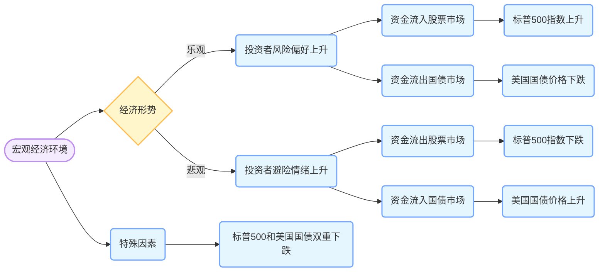

# 2023年市场回顾：标普500和美国国债的双重下跌

> 关键词：2023年市场、标普500、美国国债、双重下跌、市场分析

> 摘要：本文聚焦于2023年市场中出现的标普500和美国国债双重下跌这一重要现象。通过对相关背景的介绍，深入剖析标普500和美国国债的核心概念及两者之间的联系，阐述导致双重下跌的核心算法原理及操作步骤，运用数学模型和公式进行量化分析并举例说明。结合项目实战给出代码案例及详细解释，探讨其实际应用场景。同时推荐相关学习资源、开发工具框架以及论文著作，最后总结未来发展趋势与挑战，解答常见问题并提供扩展阅读与参考资料，旨在全面、深入地呈现2023年这一特殊市场现象及其背后的逻辑。

## 1. 背景介绍 
### 1.1 目的和范围
本文的主要目的是全面回顾2023年市场中出现的标普500和美国国债双重下跌的情况，深入分析其背后的原因、影响及相关逻辑。范围涵盖了从宏观经济环境到金融市场具体表现，从理论概念到实际案例的多个层面，旨在为读者提供一个系统、深入的市场分析视角。

### 1.2 预期读者
预期读者包括金融市场从业者，如股票交易员、债券分析师、投资顾问等，他们可以从本文中获取对2023年市场走势的深入分析，为投资决策提供参考；也包括对金融市场感兴趣的学者和研究人员，有助于他们进行学术研究和理论探讨；同时，普通投资者也可以通过本文了解市场动态，提升自身的投资知识和风险意识。

### 1.3 文档结构概述
本文首先介绍相关背景信息，包括目的、预期读者和文档结构。接着阐述标普500和美国国债的核心概念及其联系，呈现相应的原理和架构示意图。然后讲解导致双重下跌的核心算法原理及具体操作步骤，并用Python代码进行详细阐述。再运用数学模型和公式进行量化分析并举例说明。之后通过项目实战给出代码实际案例及详细解释。随后探讨这一现象的实际应用场景。接着推荐相关的学习资源、开发工具框架以及论文著作。最后总结未来发展趋势与挑战，解答常见问题并提供扩展阅读与参考资料。

### 1.4 术语表
#### 1.4.1 核心术语定义
- **标普500**：标准普尔500指数，是记录美国500家上市公司的一个股票指数。这个指数由标准普尔公司创建并维护，被广泛认为是衡量美国股票市场表现的重要指标。
- **美国国债**：是指美国财政部代表联邦政府发行的国家公债。根据发行方式不同，美国国债可分为凭证式国债、实物券式国债（又称无记名式国债或国库券）和记账式国债3种。美国国债是全球金融市场重要的投资品种和避险资产。

#### 1.4.2 相关概念解释
- **市场下跌**：指市场中资产价格普遍下降的情况。对于股票市场，表现为股票价格的整体走低；对于债券市场，表现为债券价格的下跌和收益率的上升。
- **风险资产**：指具有较高风险，其预期收益不确定的资产，如股票。投资者购买风险资产是为了获得更高的回报，但同时也面临着较大的损失风险。
- **避险资产**：指在市场动荡或经济不稳定时期，能够保值或增值的资产，如美国国债。当市场风险增加时，投资者通常会倾向于将资金转移到避险资产上。

#### 1.4.3 缩略词列表
- **SPX**：标普500指数（S&P 500 Index）的常见缩写。
- **T-bond**：美国国债（Treasury Bond）的常见缩写。

## 2. 核心概念与联系 

### 2.1 标普500指数
标普500指数是由标准普尔公司编制的，选取了在美国主要交易所上市的500家具有代表性的公司的股票作为样本。这些公司涵盖了不同的行业和领域，因此标普500指数能够较为全面地反映美国股票市场的整体表现。其计算方法通常采用加权平均法，以公司的市值作为权重。公式为：

$$\text{标普500指数值}=\frac{\sum_{i = 1}^{500}P_{i}Q_{i}}{\text{除数}}$$

其中，$P_{i}$ 是第 $i$ 家公司的股票价格，$Q_{i}$ 是第 $i$ 家公司的流通股数量，除数是一个经过调整的常数，用于保持指数的连续性和可比性。

### 2.2 美国国债
美国国债是美国政府为了筹集资金而发行的债务凭证。根据期限的不同，可分为短期国债（T-bills，期限在1年以内）、中期国债（T-notes，期限在1 - 10年）和长期国债（T-bonds，期限在10年以上）。国债的价格和收益率之间存在着反向关系，即当国债价格下跌时，收益率上升；反之亦然。其收益率的计算公式为：

$$\text{国债收益率}=\frac{\text{利息}+\text{(面值 - 购买价格)}/\text{剩余期限}}{\text{购买价格}}\times100\%$$

### 2.3 两者的联系
通常情况下，标普500指数和美国国债呈现出负相关的关系。当股票市场表现良好，投资者对经济前景乐观时，会倾向于将资金投入股票市场，导致股票价格上涨，标普500指数上升，而国债市场的资金流出，国债价格下跌，收益率上升；反之，当股票市场下跌，投资者对经济前景担忧时，会将资金转移到国债等避险资产上，导致国债价格上涨，收益率下降，标普500指数下跌。然而，在2023年出现了两者同时下跌的特殊情况，这可能与宏观经济环境、货币政策等多种因素有关。

### 2.4 文本示意图
标普500指数反映美国股票市场整体表现，其受公司业绩、经济增长预期等因素影响。美国国债作为避险资产，受宏观经济环境、货币政策、投资者避险情绪等因素影响。在正常情况下，两者走势相反，但在特殊情况下可能出现同向变动。

### 2.5 Mermaid流程图


## 3. 核心算法原理 & 具体操作步骤 

### 3.1 核心算法原理
导致标普500和美国国债双重下跌的原因较为复杂，涉及宏观经济数据、货币政策、市场情绪等多个因素。我们可以通过构建一个多因素分析模型来解释这一现象。该模型考虑了以下几个主要因素：

- **经济增长预期**：通过国内生产总值（GDP）增长率、制造业采购经理人指数（PMI）等指标来衡量。经济增长预期下降会导致投资者对股票市场的信心下降，同时也可能影响国债市场的需求。
- **通货膨胀率**：通货膨胀率上升会导致实际利率下降，使得国债的吸引力降低，同时也会增加企业的成本，影响企业的盈利能力，进而导致股票价格下跌。
- **货币政策**：中央银行的货币政策调整，如加息、缩表等，会直接影响市场的资金供求关系和利率水平，对股票市场和国债市场产生影响。

### 3.2 具体操作步骤
#### 3.2.1 数据收集
收集相关的宏观经济数据，包括GDP增长率、PMI、通货膨胀率、利率等，以及标普500指数和美国国债的历史价格数据。

#### 3.2.2 数据预处理
对收集到的数据进行清洗、缺失值处理和标准化处理，以确保数据的质量和一致性。

#### 3.2.3 模型构建
使用多元线性回归模型来分析各因素与标普500指数和美国国债价格之间的关系。模型的一般形式为：

$$Y = \beta_{0}+\beta_{1}X_{1}+\beta_{2}X_{2}+\cdots+\beta_{n}X_{n}+\epsilon$$

其中，$Y$ 是标普500指数或美国国债价格，$X_{i}$ 是第 $i$ 个影响因素，$\beta_{i}$ 是回归系数，$\epsilon$ 是误差项。

#### 3.2.4 模型训练和评估
使用历史数据对模型进行训练，估计回归系数。然后使用评估指标，如均方误差（MSE）、决定系数（$R^{2}$）等，对模型的性能进行评估。

#### 3.2.5 结果分析
根据模型的结果，分析各因素对标普500指数和美国国债价格的影响程度，找出导致双重下跌的主要原因。

### 3.3 Python源代码详细阐述
```python
import pandas as pd
import numpy as np
from sklearn.linear_model import LinearRegression
from sklearn.model_selection import train_test_split
from sklearn.metrics import mean_squared_error, r2_score

# 数据收集（假设数据已经存储在CSV文件中）
data = pd.read_csv('market_data.csv')

# 数据预处理
# 处理缺失值
data = data.dropna()

# 提取特征和目标变量
X = data[['GDP_growth', 'PMI', 'inflation_rate', 'interest_rate']]
y_spx = data['SPX_price']
y_tbond = data['Tbond_price']

# 划分训练集和测试集
X_train_spx, X_test_spx, y_train_spx, y_test_spx = train_test_split(X, y_spx, test_size=0.2, random_state=42)
X_train_tbond, X_test_tbond, y_train_tbond, y_test_tbond = train_test_split(X, y_tbond, test_size=0.2, random_state=42)

# 模型构建
model_spx = LinearRegression()
model_tbond = LinearRegression()

# 模型训练
model_spx.fit(X_train_spx, y_train_spx)
model_tbond.fit(X_train_tbond, y_train_tbond)

# 模型预测
y_pred_spx = model_spx.predict(X_test_spx)
y_pred_tbond = model_tbond.predict(X_test_tbond)

# 模型评估
mse_spx = mean_squared_error(y_test_spx, y_pred_spx)
r2_spx = r2_score(y_test_spx, y_pred_spx)
mse_tbond = mean_squared_error(y_test_tbond, y_pred_tbond)
r2_tbond = r2_score(y_test_tbond, y_pred_tbond)

print(f"标普500指数模型均方误差: {mse_spx}")
print(f"标普500指数模型决定系数: {r2_spx}")
print(f"美国国债模型均方误差: {mse_tbond}")
print(f"美国国债模型决定系数: {r2_tbond}")

# 结果分析
print("标普500指数模型回归系数:")
print(model_spx.coef_)
print("美国国债模型回归系数:")
print(model_tbond.coef_)
```

## 4. 数学模型和公式 & 详细讲解 & 举例说明 

### 4.1 多元线性回归模型
多元线性回归模型是一种用于分析多个自变量与一个因变量之间线性关系的统计模型。其一般形式为：

$$Y = \beta_{0}+\beta_{1}X_{1}+\beta_{2}X_{2}+\cdots+\beta_{n}X_{n}+\epsilon$$

其中，$Y$ 是因变量，$X_{i}$ 是第 $i$ 个自变量，$\beta_{i}$ 是回归系数，$\epsilon$ 是误差项。回归系数 $\beta_{i}$ 表示在其他自变量保持不变的情况下，$X_{i}$ 每增加一个单位，$Y$ 的平均变化量。

### 4.2 均方误差（MSE）
均方误差是衡量模型预测值与真实值之间差异的一种指标。其计算公式为：

$$MSE=\frac{1}{n}\sum_{i = 1}^{n}(y_{i}-\hat{y}_{i})^{2}$$

其中，$y_{i}$ 是真实值，$\hat{y}_{i}$ 是预测值，$n$ 是样本数量。MSE的值越小，说明模型的预测效果越好。

### 4.3 决定系数（$R^{2}$）
决定系数是衡量模型拟合优度的一种指标，它表示因变量的变异中可以由自变量解释的比例。其计算公式为：

$$R^{2}=1-\frac{\sum_{i = 1}^{n}(y_{i}-\hat{y}_{i})^{2}}{\sum_{i = 1}^{n}(y_{i}-\bar{y})^{2}}$$

其中，$y_{i}$ 是真实值，$\hat{y}_{i}$ 是预测值，$\bar{y}$ 是真实值的平均值，$n$ 是样本数量。$R^{2}$ 的取值范围是 $[0, 1]$，$R^{2}$ 越接近1，说明模型的拟合效果越好。

### 4.4 举例说明
假设我们有以下数据：

| GDP增长率（%） | PMI | 通货膨胀率（%） | 利率（%） | 标普500指数 | 美国国债价格 |
|---|---|---|---|---|---|
| 2.5 | 52 | 2 | 1.5 | 3000 | 105 |
| 2.2 | 50 | 2.2 | 1.6 | 2900 | 103 |
| 2.8 | 55 | 1.8 | 1.4 | 3100 | 107 |

使用上述数据，我们可以训练多元线性回归模型，得到回归系数。假设标普500指数模型的回归系数为 $\beta_{0}=1000$，$\beta_{1}=200$，$\beta_{2}=10$，$\beta_{3}=-50$，$\beta_{4}=-100$，则当 GDP增长率为 2.5%，PMI为 52，通货膨胀率为 2%，利率为 1.5% 时，标普500指数的预测值为：

$$\hat{y}=1000 + 200\times2.5+10\times52 - 50\times2 - 100\times1.5=3020$$

通过计算均方误差和决定系数，我们可以评估模型的性能。如果均方误差较小，决定系数接近1，说明模型的预测效果较好。

## 5. 项目实战：代码实际案例和详细解释说明 

### 5.1  开发环境搭建
#### 5.1.1 安装Python
首先，需要安装Python环境。可以从Python官方网站（https://www.python.org/downloads/） 下载适合自己操作系统的Python安装包，并按照安装向导进行安装。

#### 5.1.2 安装必要的库
使用以下命令安装所需的库：
```sh
pip install pandas numpy scikit-learn
```

### 5.2  源代码详细实现和代码解读
```python
import pandas as pd
import numpy as np
from sklearn.linear_model import LinearRegression
from sklearn.model_selection import train_test_split
from sklearn.metrics import mean_squared_error, r2_score

# 数据收集（假设数据已经存储在CSV文件中）
data = pd.read_csv('market_data.csv')

# 数据预处理
# 处理缺失值
data = data.dropna()

# 提取特征和目标变量
X = data[['GDP_growth', 'PMI', 'inflation_rate', 'interest_rate']]
y_spx = data['SPX_price']
y_tbond = data['Tbond_price']

# 划分训练集和测试集
X_train_spx, X_test_spx, y_train_spx, y_test_spx = train_test_split(X, y_spx, test_size=0.2, random_state=42)
X_train_tbond, X_test_tbond, y_train_tbond, y_test_tbond = train_test_split(X, y_tbond, test_size=0.2, random_state=42)

# 模型构建
model_spx = LinearRegression()
model_tbond = LinearRegression()

# 模型训练
model_spx.fit(X_train_spx, y_train_spx)
model_tbond.fit(X_train_tbond, y_train_tbond)

# 模型预测
y_pred_spx = model_spx.predict(X_test_spx)
y_pred_tbond = model_tbond.predict(X_test_tbond)

# 模型评估
mse_spx = mean_squared_error(y_test_spx, y_pred_spx)
r2_spx = r2_score(y_test_spx, y_pred_spx)
mse_tbond = mean_squared_error(y_test_tbond, y_pred_tbond)
r2_tbond = r2_score(y_test_tbond, y_pred_tbond)

print(f"标普500指数模型均方误差: {mse_spx}")
print(f"标普500指数模型决定系数: {r2_spx}")
print(f"美国国债模型均方误差: {mse_tbond}")
print(f"美国国债模型决定系数: {r2_tbond}")

# 结果分析
print("标普500指数模型回归系数:")
print(model_spx.coef_)
print("美国国债模型回归系数:")
print(model_tbond.coef_)
```

### 5.3  代码解读与分析
#### 5.3.1 数据收集
使用 `pd.read_csv('market_data.csv')` 从CSV文件中读取市场数据。

#### 5.3.2 数据预处理
使用 `data.dropna()` 处理数据中的缺失值，确保数据的完整性。

#### 5.3.3 特征提取
从数据中提取特征变量 `X`（包括 GDP增长率、PMI、通货膨胀率、利率）和目标变量 `y_spx`（标普500指数）、`y_tbond`（美国国债价格）。

#### 5.3.4 数据集划分
使用 `train_test_split` 函数将数据集划分为训练集和测试集，其中测试集占比为 20%。

#### 5.3.5 模型构建
使用 `LinearRegression()` 构建多元线性回归模型。

#### 5.3.6 模型训练
使用 `fit` 方法对模型进行训练，学习特征变量和目标变量之间的关系。

#### 5.3.7 模型预测
使用训练好的模型对测试集进行预测，得到预测值 `y_pred_spx` 和 `y_pred_tbond`。

#### 5.3.8 模型评估
使用 `mean_squared_error` 和 `r2_score` 函数计算均方误差和决定系数，评估模型的性能。

#### 5.3.9 结果分析
打印出回归系数，分析各因素对标普500指数和美国国债价格的影响程度。

## 6. 实际应用场景 
### 6.1 投资决策
对于投资者来说，了解标普500和美国国债双重下跌的原因和趋势，可以帮助他们做出更合理的投资决策。例如，当出现双重下跌时，投资者可以调整投资组合，减少对股票和债券的持仓，增加现金或其他避险资产的比例，以降低风险。

### 6.2 风险管理
金融机构可以通过分析这一现象，加强风险管理。例如，银行可以对贷款客户的信用风险进行重新评估，增加风险准备金；保险公司可以调整保险费率和理赔政策，以应对市场波动带来的风险。

### 6.3 宏观经济政策制定
政府和中央银行可以根据标普500和美国国债的走势，制定相应的宏观经济政策。例如，当出现双重下跌时，政府可以采取财政刺激措施，如增加政府支出、减税等，以促进经济增长；中央银行可以调整货币政策，如降低利率、增加货币供应量等，以稳定金融市场。

### 6.4 学术研究
学者和研究人员可以对这一现象进行深入研究，探讨其背后的经济理论和市场机制。这有助于丰富金融理论，为金融市场的发展提供理论支持。

## 7. 工具和资源推荐
### 7.1 学习资源推荐
#### 7.1.1 书籍推荐
- 《金融市场与金融机构基础》（The Financial System and the Economy）：这本书全面介绍了金融市场和金融机构的基本概念、原理和运作机制，对于理解标普500和美国国债等金融产品有很大帮助。
- 《投资学》（Investments）：详细讲解了投资的理论和实践，包括股票、债券等投资工具的分析和管理，是投资领域的经典教材。
- 《货币金融学》（Money, Banking, and Financial Markets）：深入探讨了货币、银行和金融市场的关系，以及货币政策对金融市场的影响，有助于理解宏观经济因素对标普500和美国国债的作用。

#### 7.1.2 在线课程
- Coursera上的“Financial Markets”课程：由耶鲁大学教授罗伯特·席勒（Robert Shiller）主讲，内容涵盖金融市场的各个方面，包括股票市场、债券市场等。
- edX上的“Introduction to Financial Markets”课程：提供了金融市场的基础知识，适合初学者学习。
- Udemy上的“Stock Market Investing for Beginners”课程：专门针对股票市场投资进行讲解，帮助学习者了解股票投资的基本原理和方法。

#### 7.1.3 技术博客和网站
- 彭博社（Bloomberg）：提供全球金融市场的实时新闻、数据和分析，是获取金融市场信息的重要来源。
- 路透社（Reuters）：提供全面的财经新闻和市场分析，对股票、债券等金融市场有深入的报道。
- Seeking Alpha：是一个金融市场的投资研究平台，提供专业的投资分析和观点，有助于投资者做出决策。

### 7.2 开发工具框架推荐
#### 7.2.1 IDE和编辑器
- PyCharm：是一款专业的Python集成开发环境，具有强大的代码编辑、调试和分析功能，适合开发金融数据分析相关的Python代码。
- Jupyter Notebook：是一个交互式的开发环境，支持Python等多种编程语言，方便进行数据探索、模型开发和可视化展示。
- Visual Studio Code：是一款轻量级的代码编辑器，具有丰富的插件生态系统，可以方便地进行Python代码开发。

#### 7.2.2 调试和性能分析工具
- PDB：是Python自带的调试工具，可以帮助开发者在代码中设置断点、查看变量值等，进行代码调试。
- cProfile：是Python的性能分析工具，可以分析代码的运行时间和函数调用情况，帮助开发者优化代码性能。
- Py-Spy：是一个跨平台的Python性能分析工具，可以实时监控Python程序的运行情况，找出性能瓶颈。

#### 7.2.3 相关框架和库
- Pandas：是一个强大的数据分析库，提供了高效的数据结构和数据处理功能，适合处理金融市场数据。
- NumPy：是Python的数值计算库，提供了高效的数组和矩阵运算功能，是进行金融数据分析的基础库。
- Scikit-learn：是一个常用的机器学习库，提供了丰富的机器学习算法和工具，适合构建金融市场预测模型。

### 7.3 相关论文著作推荐
#### 7.3.1 经典论文
- Fama, E. F., & French, K. R. (1992). The cross-section of expected stock returns. The Journal of Finance, 47(2), 427-465. 这篇论文提出了著名的Fama-French三因子模型，对股票市场的收益率进行了深入分析。
- Campbell, J. Y., & Shiller, R. J. (1988). Stock prices, earnings, and expected dividends. The Journal of Finance, 43(3), 661-676. 该论文研究了股票价格、盈利和预期股息之间的关系，对股票市场的估值有重要贡献。

#### 7.3.2 最新研究成果
可以关注《Journal of Financial Economics》、《Review of Financial Studies》等金融领域的顶级学术期刊，获取关于标普500和美国国债等金融市场的最新研究成果。

#### 7.3.3 应用案例分析
一些金融机构和研究机构会发布关于金融市场的应用案例分析报告，可以通过它们的官方网站获取相关信息。例如，国际货币基金组织（IMF）、世界银行等会发布关于全球金融市场的研究报告和案例分析。

## 8. 总结：未来发展趋势与挑战
### 8.1 未来发展趋势
- **市场波动加剧**：随着全球经济的不确定性增加，以及地缘政治风险的上升，标普500和美国国债市场可能会面临更大的波动。投资者需要更加谨慎地管理风险。
- **数字化转型加速**：金融科技的发展将推动金融市场的数字化转型，标普500和美国国债的交易和投资方式可能会发生变化。例如，区块链技术的应用可能会提高交易的效率和透明度。
- **宏观经济政策调整**：政府和中央银行可能会根据经济形势的变化，调整宏观经济政策。这将对标普500和美国国债市场产生重要影响。例如，货币政策的收紧或放松会影响市场的资金供求关系和利率水平。

### 8.2 挑战
- **预测难度增加**：由于影响标普500和美国国债市场的因素越来越复杂，准确预测市场走势变得更加困难。投资者和研究人员需要不断改进分析方法和模型，提高预测的准确性。
- **风险管理难度加大**：市场波动加剧和不确定性增加，使得风险管理的难度加大。金融机构需要加强风险管理体系建设，提高风险识别、评估和控制的能力。
- **监管压力增大**：为了维护金融市场的稳定和安全，监管机构可能会加强对金融市场的监管。这将给金融机构和投资者带来更大的合规压力。

## 9. 附录：常见问题与解答
### 9.1 为什么会出现标普500和美国国债双重下跌的情况？
这可能是由于多种因素共同作用的结果，如宏观经济数据不佳、通货膨胀率上升、货币政策调整、地缘政治风险等。这些因素可能导致投资者对股票市场和国债市场的信心同时下降，从而引发双重下跌。

### 9.2 双重下跌对投资者有什么影响？
双重下跌会导致投资者的资产价值缩水，增加投资风险。投资者可能需要调整投资组合，减少对股票和债券的持仓，以降低损失。同时，这也可能影响投资者的信心和投资决策。

### 9.3 如何应对标普500和美国国债双重下跌的情况？
投资者可以采取以下措施：一是调整投资组合，增加现金、黄金等避险资产的比例；二是密切关注宏观经济数据和政策变化，及时调整投资策略；三是加强风险管理，控制投资风险。

### 9.4 双重下跌的情况会持续多久？
双重下跌的持续时间取决于多种因素，如宏观经济形势的变化、政策调整的效果等。一般来说，如果宏观经济形势能够得到改善，政策调整能够起到稳定市场的作用，双重下跌的情况可能会得到缓解。

## 10. 扩展阅读 & 参考资料
### 10.1 扩展阅读
- 《金融炼金术》（The Alchemy of Finance）：作者乔治·索罗斯（George Soros）通过自己的投资实践，阐述了金融市场的运行机制和投资者的心理因素对市场的影响。
- 《聪明的投资者》（The Intelligent Investor）：本杰明·格雷厄姆（Benjamin Graham）的经典著作，强调了价值投资的理念和方法，对于投资者在市场波动中保持理性有很大帮助。

### 10.2 参考资料
- 标准普尔公司官方网站（https://www.spglobal.com/）：获取标普500指数的相关信息和数据。
- 美国财政部官方网站（https://www.treasury.gov/）：获取美国国债的发行、交易等相关信息。
- 国际货币基金组织（IMF）官方网站（https://www.imf.org/）：获取全球宏观经济数据和研究报告。