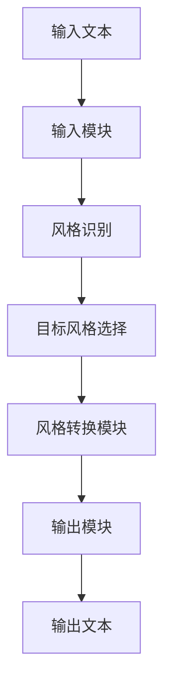

# AI Agent 的语言风格转换：调整 LLM 的表达方式

> 关键词：AI Agent、语言风格转换、大语言模型（LLM）、表达方式调整、自然语言处理

> 摘要：本文聚焦于 AI Agent 的语言风格转换，旨在深入探讨如何调整大语言模型（LLM）的表达方式。首先介绍了该研究的背景、目的、预期读者和文档结构，阐述了相关核心概念及其联系。接着详细讲解了核心算法原理和具体操作步骤，通过 Python 代码进行了说明，并给出了相应的数学模型和公式。在项目实战部分，展示了代码实际案例并进行详细解释。同时探讨了 AI Agent 语言风格转换的实际应用场景，推荐了学习资源、开发工具框架和相关论文著作。最后总结了未来发展趋势与挑战，提供了常见问题解答和扩展阅读参考资料。

## 1. 背景介绍 
### 1.1 目的和范围
在当今数字化时代，自然语言处理技术不断发展，大语言模型（LLM）如 GPT 系列、BLOOM 等取得了显著的成果。然而，这些模型生成的文本往往具有较为通用的语言风格，无法满足多样化的应用需求。AI Agent 的语言风格转换旨在根据不同的场景和用户需求，调整 LLM 的表达方式，使生成的文本更符合特定的风格要求，如正式、幽默、专业等。本研究的范围涵盖了语言风格转换的核心概念、算法原理、实际应用场景以及相关工具和资源的介绍。

### 1.2 预期读者
本文预期读者包括自然语言处理领域的研究人员、开发者、AI 爱好者以及对语言技术应用感兴趣的相关人员。对于研究人员，本文可提供新的研究思路和方法；对于开发者，有助于他们在实际项目中实现语言风格转换功能；对于 AI 爱好者和相关人员，能增进他们对 AI Agent 语言风格转换的理解。

### 1.3 文档结构概述
本文将按照以下结构进行阐述：首先介绍核心概念与联系，包括语言风格转换的原理和架构；接着讲解核心算法原理和具体操作步骤，并使用 Python 代码详细说明；然后给出数学模型和公式，并举例说明；在项目实战部分，展示代码实际案例并进行详细解释；之后探讨实际应用场景；推荐相关的工具和资源；最后总结未来发展趋势与挑战，提供常见问题解答和扩展阅读参考资料。

### 1.4 术语表
#### 1.4.1 核心术语定义
- **AI Agent**：一种能够感知环境、做出决策并采取行动的智能实体，在自然语言处理中可用于处理和生成文本。
- **语言风格转换**：将文本从一种语言风格转换为另一种语言风格的过程，如将正式风格转换为幽默风格。
- **大语言模型（LLM）**：基于大规模语料库训练的语言模型，能够生成高质量的自然语言文本。

#### 1.4.2 相关概念解释
- **风格特征**：用于描述语言风格的各种特征，如词汇选择、语法结构、语气等。
- **风格迁移**：类似于图像风格迁移，将一种文本的风格特征应用到另一种文本上。
- **微调**：在预训练的大语言模型基础上，使用特定的数据集进行进一步训练，以适应特定的任务。

#### 1.4.3 缩略词列表
- **LLM**：Large Language Model（大语言模型）
- **NLP**：Natural Language Processing（自然语言处理）

## 2. 核心概念与联系 

### 核心概念原理
语言风格转换的核心原理是识别输入文本的风格特征，并将其转换为目标风格的特征。这可以通过多种方法实现，如基于规则的方法、基于机器学习的方法和基于深度学习的方法。

基于规则的方法通过定义一系列的规则来实现风格转换，例如替换特定的词汇、改变语法结构等。这种方法简单直观，但缺乏灵活性，难以处理复杂的语言现象。

基于机器学习的方法通过训练分类器或生成器来实现风格转换。分类器用于识别输入文本的风格，生成器用于根据目标风格生成文本。这种方法可以处理复杂的语言现象，但需要大量的标注数据。

基于深度学习的方法使用神经网络模型，如循环神经网络（RNN）、长短时记忆网络（LSTM）和生成对抗网络（GAN）等，来实现风格转换。这些模型可以自动学习语言的特征和模式，具有较强的泛化能力。

### 架构的文本示意图
语言风格转换的架构可以分为三个主要部分：输入模块、风格转换模块和输出模块。

输入模块负责接收输入文本，并对其进行预处理，如分词、词性标注等。风格转换模块是核心部分，它根据输入文本的风格特征和目标风格，生成转换后的文本。输出模块负责将转换后的文本进行后处理，如去除多余的符号、调整语序等，并输出最终结果。

### Mermaid 流程图


## 3. 核心算法原理 & 具体操作步骤 

### 核心算法原理
这里我们以基于微调的方法为例，介绍语言风格转换的核心算法原理。微调是在预训练的大语言模型基础上，使用特定的数据集进行进一步训练，以适应特定的任务。

具体来说，我们首先选择一个预训练的大语言模型，如 GPT-2。然后，我们收集一个包含不同风格文本的数据集，并将其分为训练集和验证集。在训练过程中，我们将输入文本和目标风格作为输入，模型输出转换后的文本。我们使用损失函数来衡量模型输出与目标文本之间的差异，并通过反向传播算法更新模型的参数。

### 具体操作步骤
#### 步骤 1：数据准备
首先，我们需要收集一个包含不同风格文本的数据集。数据集可以从互联网上收集，也可以手动标注。将数据集分为训练集和验证集，通常训练集占 80%，验证集占 20%。

#### 步骤 2：模型选择
选择一个预训练的大语言模型，如 GPT-2。可以使用 Hugging Face 的 Transformers 库来加载预训练模型。

#### 步骤 3：模型微调
使用训练集对预训练模型进行微调。在微调过程中，我们需要定义损失函数和优化器。常用的损失函数是交叉熵损失函数，优化器可以选择 Adam 优化器。

#### 步骤 4：模型评估
使用验证集对微调后的模型进行评估。评估指标可以选择准确率、召回率、F1 值等。

#### 步骤 5：模型应用
将微调后的模型应用到实际场景中，进行语言风格转换。

### Python 源代码详细阐述
```python
import torch
from transformers import GPT2LMHeadModel, GPT2Tokenizer, AdamW
from torch.utils.data import Dataset, DataLoader

# 定义数据集类
class StyleDataset(Dataset):
    def __init__(self, texts, labels, tokenizer, max_length):
        self.texts = texts
        self.labels = labels
        self.tokenizer = tokenizer
        self.max_length = max_length

    def __len__(self):
        return len(self.texts)

    def __getitem__(self, idx):
        text = self.texts[idx]
        label = self.labels[idx]
        encoding = self.tokenizer.encode_plus(
            text,
            add_special_tokens=True,
            max_length=self.max_length,
            padding='max_length',
            truncation=True,
            return_tensors='pt'
        )
        input_ids = encoding['input_ids'].flatten()
        attention_mask = encoding['attention_mask'].flatten()
        return {
            'input_ids': input_ids,
            'attention_mask': attention_mask,
            'labels': torch.tensor(label, dtype=torch.long)
        }

# 数据准备
texts = ["这是一个正式的文本。", "这是一个幽默的文本，哈哈！"]
labels = [0, 1]  # 0 表示正式风格，1 表示幽默风格
tokenizer = GPT2Tokenizer.from_pretrained('gpt2')
max_length = 128
dataset = StyleDataset(texts, labels, tokenizer, max_length)
dataloader = DataLoader(dataset, batch_size=2, shuffle=True)

# 模型选择
model = GPT2LMHeadModel.from_pretrained('gpt2')

# 模型微调
device = torch.device('cuda' if torch.cuda.is_available() else 'cpu')
model.to(device)
optimizer = AdamW(model.parameters(), lr=1e-5)
epochs = 3

for epoch in range(epochs):
    model.train()
    total_loss = 0
    for batch in dataloader:
        input_ids = batch['input_ids'].to(device)
        attention_mask = batch['attention_mask'].to(device)
        labels = batch['labels'].to(device)

        outputs = model(input_ids, attention_mask=attention_mask, labels=input_ids)
        loss = outputs.loss
        total_loss += loss.item()

        optimizer.zero_grad()
        loss.backward()
        optimizer.step()

    print(f'Epoch {epoch + 1}/{epochs}, Loss: {total_loss / len(dataloader)}')

# 模型评估
model.eval()
with torch.no_grad():
    test_text = "这是一个测试文本。"
    encoding = tokenizer.encode_plus(
        test_text,
        add_special_tokens=True,
        max_length=max_length,
        padding='max_length',
        truncation=True,
        return_tensors='pt'
    )
    input_ids = encoding['input_ids'].to(device)
    attention_mask = encoding['attention_mask'].to(device)
    output = model.generate(input_ids, attention_mask=attention_mask, max_length=128)
    output_text = tokenizer.decode(output[0], skip_special_tokens=True)
    print(f'转换后的文本: {output_text}')
```

## 4. 数学模型和公式 & 详细讲解 & 举例说明 

### 数学模型
在基于微调的语言风格转换中，我们使用的是预训练的大语言模型。大语言模型通常基于 Transformer 架构，其核心是多头自注意力机制。

多头自注意力机制的数学公式如下：
$$
\text{Attention}(Q, K, V) = \text{softmax}(\frac{QK^T}{\sqrt{d_k}})V
$$
其中，$Q$ 是查询矩阵，$K$ 是键矩阵，$V$ 是值矩阵，$d_k$ 是键的维度。

在微调过程中，我们使用交叉熵损失函数来衡量模型输出与目标文本之间的差异。交叉熵损失函数的数学公式如下：
$$
L = -\sum_{i=1}^{N} y_i \log(p_i)
$$
其中，$N$ 是样本数量，$y_i$ 是真实标签，$p_i$ 是模型预测的概率。

### 详细讲解
多头自注意力机制允许模型在不同的表示子空间中关注输入序列的不同部分，从而捕捉输入序列中的复杂依赖关系。在语言风格转换中，多头自注意力机制可以帮助模型学习输入文本的风格特征。

交叉熵损失函数是一种常用的损失函数，它衡量了两个概率分布之间的差异。在微调过程中，我们通过最小化交叉熵损失函数来更新模型的参数，使模型的输出更接近目标文本。

### 举例说明
假设我们有一个输入文本 "这是一个正式的文本。"，目标风格是幽默风格。模型的输出可能是 "嘿，这可真是个一本正经的文本哟，哈哈！"。我们可以使用交叉熵损失函数来衡量模型输出与目标文本之间的差异，并通过反向传播算法更新模型的参数，使模型在后续的训练中能够更好地进行语言风格转换。

## 5. 项目实战：代码实际案例和详细解释说明 

### 5.1  开发环境搭建
#### 步骤 1：安装 Python
确保你已经安装了 Python 3.6 或更高版本。可以从 Python 官方网站（https://www.python.org/downloads/）下载并安装。

#### 步骤 2：创建虚拟环境
为了避免不同项目之间的依赖冲突，建议使用虚拟环境。可以使用 `venv` 或 `conda` 来创建虚拟环境。

使用 `venv` 创建虚拟环境的命令如下：
```sh
python -m venv myenv
```
激活虚拟环境：
```sh
# Windows
myenv\Scripts\activate
# Linux/Mac
source myenv/bin/activate
```

#### 步骤 3：安装依赖库
在虚拟环境中安装所需的依赖库，包括 `torch`、`transformers` 等。
```sh
pip install torch transformers
```

### 5.2  源代码详细实现和代码解读
```python
import torch
from transformers import GPT2LMHeadModel, GPT2Tokenizer, AdamW
from torch.utils.data import Dataset, DataLoader

# 定义数据集类
class StyleDataset(Dataset):
    def __init__(self, texts, labels, tokenizer, max_length):
        self.texts = texts
        self.labels = labels
        self.tokenizer = tokenizer
        self.max_length = max_length

    def __len__(self):
        return len(self.texts)

    def __getitem__(self, idx):
        text = self.texts[idx]
        label = self.labels[idx]
        encoding = self.tokenizer.encode_plus(
            text,
            add_special_tokens=True,
            max_length=self.max_length,
            padding='max_length',
            truncation=True,
            return_tensors='pt'
        )
        input_ids = encoding['input_ids'].flatten()
        attention_mask = encoding['attention_mask'].flatten()
        return {
            'input_ids': input_ids,
            'attention_mask': attention_mask,
            'labels': torch.tensor(label, dtype=torch.long)
        }

# 数据准备
texts = ["这是一个正式的文本。", "这是一个幽默的文本，哈哈！"]
labels = [0, 1]  # 0 表示正式风格，1 表示幽默风格
tokenizer = GPT2Tokenizer.from_pretrained('gpt2')
max_length = 128
dataset = StyleDataset(texts, labels, tokenizer, max_length)
dataloader = DataLoader(dataset, batch_size=2, shuffle=True)

# 模型选择
model = GPT2LMHeadModel.from_pretrained('gpt2')

# 模型微调
device = torch.device('cuda' if torch.cuda.is_available() else 'cpu')
model.to(device)
optimizer = AdamW(model.parameters(), lr=1e-5)
epochs = 3

for epoch in range(epochs):
    model.train()
    total_loss = 0
    for batch in dataloader:
        input_ids = batch['input_ids'].to(device)
        attention_mask = batch['attention_mask'].to(device)
        labels = batch['labels'].to(device)

        outputs = model(input_ids, attention_mask=attention_mask, labels=input_ids)
        loss = outputs.loss
        total_loss += loss.item()

        optimizer.zero_grad()
        loss.backward()
        optimizer.step()

    print(f'Epoch {epoch + 1}/{epochs}, Loss: {total_loss / len(dataloader)}')

# 模型评估
model.eval()
with torch.no_grad():
    test_text = "这是一个测试文本。"
    encoding = tokenizer.encode_plus(
        test_text,
        add_special_tokens=True,
        max_length=max_length,
        padding='max_length',
        truncation=True,
        return_tensors='pt'
    )
    input_ids = encoding['input_ids'].to(device)
    attention_mask = encoding['attention_mask'].to(device)
    output = model.generate(input_ids, attention_mask=attention_mask, max_length=128)
    output_text = tokenizer.decode(output[0], skip_special_tokens=True)
    print(f'转换后的文本: {output_text}')
```

### 代码解读与分析
#### 数据集类 `StyleDataset`
- `__init__` 方法：初始化数据集，接收文本列表、标签列表、分词器和最大长度作为参数。
- `__len__` 方法：返回数据集的长度。
- `__getitem__` 方法：根据索引返回一个样本，包括输入 ID、注意力掩码和标签。

#### 数据准备
- `texts` 和 `labels`：定义输入文本和对应的风格标签。
- `tokenizer`：使用 `GPT2Tokenizer` 对文本进行分词。
- `dataset` 和 `dataloader`：创建数据集和数据加载器，用于批量训练。

#### 模型选择
- `model`：使用 `GPT2LMHeadModel` 加载预训练的 GPT-2 模型。

#### 模型微调
- `device`：选择使用 GPU 或 CPU 进行训练。
- `optimizer`：使用 `AdamW` 优化器更新模型的参数。
- `epochs`：定义训练的轮数。
- 在每个 epoch 中，模型进行训练，计算损失并更新参数。

#### 模型评估
- `model.eval()`：将模型设置为评估模式。
- 使用 `generate` 方法生成转换后的文本，并使用 `decode` 方法将其解码为可读文本。

## 6. 实际应用场景 
### 内容创作
在内容创作领域，AI Agent 的语言风格转换可以帮助作者快速生成不同风格的文章。例如，作者可以先以简洁的风格撰写初稿，然后使用语言风格转换技术将其转换为正式、幽默或生动的风格，以满足不同读者的需求。

### 客服聊天
在客服聊天场景中，语言风格转换可以使客服回复更加个性化。根据客户的语气和需求，将客服回复的语言风格进行调整，如将正式的回复转换为友好、亲切的风格，提高客户满意度。

### 教育领域
在教育领域，语言风格转换可以帮助学生学习不同的写作风格。教师可以提供一些示例文本，让学生使用语言风格转换工具将其转换为其他风格，从而加深对不同风格的理解和掌握。

### 广告营销
在广告营销中，语言风格转换可以使广告文案更加吸引人。根据目标受众的特点和喜好，将广告文案的语言风格进行调整，如将普通的介绍风格转换为夸张、幽默的风格，提高广告的吸引力和传播效果。

## 7. 工具和资源推荐
### 7.1 学习资源推荐
#### 7.1.1 书籍推荐
- 《自然语言处理入门》：这本书详细介绍了自然语言处理的基本概念、算法和应用，适合初学者入门。
- 《深度学习》：深度学习是自然语言处理的重要技术，这本书对深度学习的原理和应用进行了深入讲解。
- 《Python 自然语言处理实战》：通过实际案例介绍了如何使用 Python 进行自然语言处理，包括文本分类、情感分析等。

#### 7.1.2 在线课程
- Coursera 上的《Natural Language Processing Specialization》：由顶尖大学的教授授课，涵盖了自然语言处理的各个方面。
- edX 上的《Deep Learning for Natural Language Processing》：深入介绍了深度学习在自然语言处理中的应用。
- 哔哩哔哩上的一些自然语言处理相关的视频教程，如李宏毅的机器学习课程，其中包含了自然语言处理的内容。

#### 7.1.3 技术博客和网站
- Hugging Face Blog：提供了自然语言处理领域的最新技术和研究成果，以及关于 Transformers 库的使用教程。
- Medium 上的自然语言处理相关文章，很多优秀的研究者和开发者会在上面分享自己的经验和见解。
- 机器之心、新智元等科技媒体网站，会报道自然语言处理领域的最新动态和应用案例。

### 7.2 开发工具框架推荐
#### 7.2.1 IDE和编辑器
- PyCharm：一款功能强大的 Python 集成开发环境，提供了代码编辑、调试、版本控制等功能。
- Visual Studio Code：轻量级的代码编辑器，支持多种编程语言，有丰富的插件可以扩展功能。
- Jupyter Notebook：交互式的开发环境，适合进行数据分析和模型训练，方便代码的展示和分享。

#### 7.2.2 调试和性能分析工具
- TensorBoard：用于可视化深度学习模型的训练过程，如损失曲线、准确率曲线等。
- PyTorch Profiler：可以帮助开发者分析 PyTorch 模型的性能瓶颈，优化代码。
- cProfile：Python 内置的性能分析工具，可以分析代码的运行时间和函数调用次数。

#### 7.2.3 相关框架和库
- Transformers：Hugging Face 开发的库，提供了多种预训练的大语言模型，如 GPT-2、BERT 等，方便进行自然语言处理任务。
- NLTK：自然语言工具包，提供了丰富的自然语言处理工具和数据集，如分词、词性标注、命名实体识别等。
- SpaCy：高效的自然语言处理库，支持多种语言，提供了快速的分词、词性标注、句法分析等功能。

### 7.3 相关论文著作推荐
#### 7.3.1 经典论文
- 《Attention Is All You Need》：提出了 Transformer 架构，是自然语言处理领域的重要突破。
- 《BERT: Pre-training of Deep Bidirectional Transformers for Language Understanding》：介绍了 BERT 模型，开启了预训练语言模型的新时代。
- 《Generating Text with Recurrent Neural Networks》：介绍了循环神经网络在文本生成中的应用。

#### 7.3.2 最新研究成果
- 关注 ACL（Association for Computational Linguistics）、EMNLP（Conference on Empirical Methods in Natural Language Processing）等自然语言处理领域的顶级会议，这些会议上会发表最新的研究成果。
- arXiv 上的自然语言处理相关论文，很多研究者会在上面分享自己的预印本论文。

#### 7.3.3 应用案例分析
- 《Natural Language Processing in Action》：通过实际案例介绍了自然语言处理在各个领域的应用，包括语言风格转换、文本分类等。
- 一些企业的技术博客，如 Google AI Blog、Microsoft Research Blog 等，会分享自然语言处理技术在实际业务中的应用案例。

## 8. 总结：未来发展趋势与挑战
### 未来发展趋势
- **多模态融合**：未来的语言风格转换可能会与图像、音频等多模态信息相结合，实现更加丰富和自然的交互。例如，在视频内容创作中，同时调整文本和语音的风格。
- **个性化定制**：根据用户的个人偏好和历史数据，为用户提供更加个性化的语言风格转换服务。例如，根据用户的阅读习惯和写作风格，自动调整生成文本的风格。
- **跨语言风格转换**：除了同一语言内的风格转换，未来可能会实现跨语言的风格转换，打破语言障碍，促进不同语言之间的文化交流。

### 挑战
- **风格特征的准确识别**：准确识别文本的风格特征是语言风格转换的关键，但不同风格之间的界限往往比较模糊，如何准确地提取和表示风格特征是一个挑战。
- **数据不足**：语言风格转换需要大量的标注数据，但标注数据的成本较高，如何在数据不足的情况下提高模型的性能是一个需要解决的问题。
- **语义一致性**：在进行语言风格转换时，需要保证转换后的文本在语义上与原文一致，避免出现语义错误或歧义。这需要模型具备较强的语义理解能力。

## 9. 附录：常见问题与解答
### 问题 1：语言风格转换的效果受哪些因素影响？
语言风格转换的效果受多种因素影响，包括数据集的质量和规模、模型的选择和训练方法、目标风格的明确性等。高质量、大规模的数据集可以帮助模型学习到更丰富的风格特征；合适的模型和训练方法可以提高模型的性能；明确的目标风格可以使转换后的文本更符合预期。

### 问题 2：如何评估语言风格转换的效果？
可以使用多种指标来评估语言风格转换的效果，如准确率、召回率、F1 值等。此外，还可以进行人工评估，让人类评估者对转换后的文本进行打分，评价其风格的准确性和自然度。

### 问题 3：语言风格转换可以应用于哪些类型的文本？
语言风格转换可以应用于各种类型的文本，包括新闻文章、小说、诗歌、广告文案等。不同类型的文本可能需要不同的数据集和训练方法来实现更好的转换效果。

## 10. 扩展阅读 & 参考资料
### 扩展阅读
- 《Neural Machine Translation and Sequence-to-sequence Models: A Tutorial》：深入介绍了神经机器翻译和序列到序列模型，对理解语言生成和转换有很大帮助。
- 《Advanced Natural Language Processing with Python》：介绍了自然语言处理的高级技术和应用，适合有一定基础的读者进一步学习。

### 参考资料
- Hugging Face 官方文档：https://huggingface.co/docs
- TensorFlow 官方文档：https://www.tensorflow.org/api_docs
- PyTorch 官方文档：https://pytorch.org/docs/stable/index.html