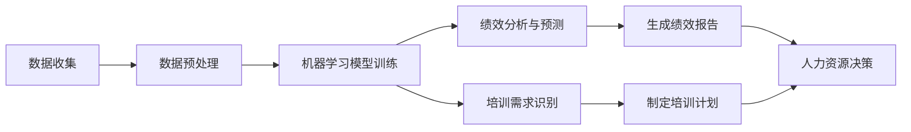

# AI Agent在人力资源管理中的应用：员工绩效分析与培训需求识别

> 关键词：AI Agent、人力资源管理、员工绩效分析、培训需求识别、机器学习

> 摘要：本文深入探讨了AI Agent在人力资源管理领域的应用，聚焦于员工绩效分析与培训需求识别。首先介绍了相关背景，包括目的、预期读者等内容。接着阐述了核心概念，通过示意图和流程图展示了AI Agent与人力资源管理各环节的联系。详细讲解了核心算法原理，并用Python代码进行说明，同时给出了数学模型和公式。通过项目实战案例，展示了如何搭建开发环境、实现代码并进行解读。分析了AI Agent在实际中的应用场景，推荐了学习资源、开发工具和相关论文。最后总结了未来发展趋势与挑战，并提供了常见问题解答和扩展阅读参考资料。

## 1. 背景介绍 
### 1.1 目的和范围
在当今数字化时代，人力资源管理面临着诸多挑战，如如何准确评估员工绩效、精准识别员工培训需求等。本文章的目的在于深入探讨AI Agent在人力资源管理中用于员工绩效分析与培训需求识别的应用。范围涵盖了从AI Agent的基本概念、相关算法原理，到实际项目中的开发实现，以及在不同场景下的应用等方面。通过全面的分析，为人力资源管理者和相关技术人员提供理论支持和实践指导。

### 1.2 预期读者
本文预期读者包括人力资源管理领域的专业人士，如人力资源经理、培训专员等，他们可以从文中了解如何借助AI Agent提升人力资源管理的效率和质量；也包括计算机科学领域的开发者和研究人员，如AI工程师、数据分析师等，他们能够获取AI Agent在人力资源管理应用方面的技术细节和实践案例；此外，对新兴技术在管理领域应用感兴趣的学者和爱好者也能从本文中获得有价值的信息。

### 1.3 文档结构概述
本文将按照以下结构进行阐述：首先介绍背景信息，包括目的、读者和文档结构概述以及相关术语；接着讲解核心概念，通过示意图和流程图展示AI Agent与人力资源管理的联系；然后详细阐述核心算法原理，用Python代码实现并进行说明，同时给出数学模型和公式；之后通过项目实战案例，从开发环境搭建到代码实现和解读进行详细介绍；分析AI Agent在实际中的应用场景；推荐学习资源、开发工具和相关论文；最后总结未来发展趋势与挑战，提供常见问题解答和扩展阅读参考资料。

### 1.4 术语表
#### 1.4.1 核心术语定义
- **AI Agent（人工智能代理）**：是一种能够感知环境、自主决策并采取行动以实现特定目标的人工智能实体。在人力资源管理中，AI Agent可以通过收集和分析数据，为人力资源决策提供支持。
- **员工绩效分析**：对员工在工作中的表现进行评估和分析，包括工作成果、工作效率、工作质量等方面，以确定员工的工作绩效水平。
- **培训需求识别**：通过对员工的技能、知识和能力进行评估，确定员工为了提高工作绩效所需的培训内容和方式。

#### 1.4.2 相关概念解释
- **机器学习**：是一门多领域交叉学科，涉及概率论、统计学、逼近论、凸分析、算法复杂度理论等多门学科。它专门研究计算机怎样模拟或实现人类的学习行为，以获取新的知识或技能，重新组织已有的知识结构使之不断改善自身的性能。在员工绩效分析和培训需求识别中，机器学习算法可以用于数据挖掘和预测。
- **自然语言处理**：是计算机科学领域与人工智能领域中的一个重要方向。它研究能实现人与计算机之间用自然语言进行有效通信的各种理论和方法。在人力资源管理中，自然语言处理可以用于分析员工的文本数据，如绩效评估报告、培训反馈等。

#### 1.4.3 缩略词列表
- **AI**：Artificial Intelligence（人工智能）
- **ML**：Machine Learning（机器学习）
- **NLP**：Natural Language Processing（自然语言处理）

## 2. 核心概念与联系 

### 核心概念原理
AI Agent在人力资源管理中的应用主要基于其能够自动收集、处理和分析大量数据的能力。在员工绩效分析方面，AI Agent可以收集员工的工作数据，如任务完成情况、工作时长、错误率等，通过机器学习算法对这些数据进行分析，评估员工的绩效水平。在培训需求识别方面，AI Agent可以根据员工的绩效数据、技能评估结果等，利用数据分析和挖掘技术，识别员工存在的技能差距，从而确定培训需求。

### 架构的文本示意图
```plaintext
人力资源管理系统
|
|-- 数据收集模块
|   |-- 员工工作数据（任务完成情况、工作时长等）
|   |-- 员工绩效评估数据
|   |-- 员工技能评估数据
|
|-- AI Agent模块
|   |-- 数据预处理
|   |-- 机器学习模型训练
|   |-- 绩效分析与预测
|   |-- 培训需求识别
|
|-- 决策支持模块
|   |-- 生成绩效报告
|   |-- 制定培训计划
```

### Mermaid 流程图


## 3. 核心算法原理 & 具体操作步骤 

### 核心算法原理
在员工绩效分析和培训需求识别中，常用的机器学习算法包括线性回归、决策树、神经网络等。下面以线性回归为例进行详细讲解。

线性回归是一种用于建立自变量和因变量之间线性关系的统计方法。在员工绩效分析中，我们可以将员工的某些特征（如工作经验、技能水平等）作为自变量，将绩效评估得分作为因变量，通过线性回归模型来预测员工的绩效。

### 具体操作步骤
1. **数据收集**：收集员工的相关数据，包括工作经验、技能水平、绩效评估得分等。
2. **数据预处理**：对收集到的数据进行清洗、归一化等处理，以提高模型的准确性。
3. **模型训练**：使用训练数据对线性回归模型进行训练，得到模型的参数。
4. **模型评估**：使用测试数据对训练好的模型进行评估，计算模型的误差。
5. **预测与应用**：使用训练好的模型对新员工的绩效进行预测，并根据预测结果进行培训需求识别。

### Python源代码实现
```python
import numpy as np
from sklearn.linear_model import LinearRegression
from sklearn.model_selection import train_test_split
from sklearn.metrics import mean_squared_error

# 模拟数据
# 假设我们有员工的工作经验（年）和绩效评估得分
X = np.array([1, 2, 3, 4, 5, 6, 7, 8, 9, 10]).reshape(-1, 1)
y = np.array([30, 35, 40, 45, 50, 55, 60, 65, 70, 75])

# 划分训练集和测试集
X_train, X_test, y_train, y_test = train_test_split(X, y, test_size=0.2, random_state=42)

# 创建线性回归模型
model = LinearRegression()

# 训练模型
model.fit(X_train, y_train)

# 预测
y_pred = model.predict(X_test)

# 评估模型
mse = mean_squared_error(y_test, y_pred)
print(f"Mean Squared Error: {mse}")

# 新员工绩效预测
new_employee_experience = np.array([11]).reshape(-1, 1)
new_employee_performance = model.predict(new_employee_experience)
print(f"New employee performance prediction: {new_employee_performance[0]}")
```

### 代码解释
1. **数据模拟**：使用`numpy`数组模拟员工的工作经验和绩效评估得分。
2. **数据划分**：使用`train_test_split`函数将数据划分为训练集和测试集。
3. **模型创建与训练**：创建`LinearRegression`模型，并使用训练集数据进行训练。
4. **模型预测与评估**：使用测试集数据进行预测，并计算均方误差（MSE）来评估模型的性能。
5. **新员工绩效预测**：使用训练好的模型对新员工的绩效进行预测。

## 4. 数学模型和公式 & 详细讲解 & 举例说明 

### 线性回归数学模型
线性回归的数学模型可以表示为：
$$y = \beta_0 + \beta_1x_1 + \beta_2x_2 + \cdots + \beta_nx_n + \epsilon$$
其中，$y$ 是因变量（绩效评估得分），$x_1, x_2, \cdots, x_n$ 是自变量（员工的特征，如工作经验、技能水平等），$\beta_0, \beta_1, \beta_2, \cdots, \beta_n$ 是模型的参数，$\epsilon$ 是误差项。

### 最小二乘法求解参数
在训练线性回归模型时，我们的目标是找到一组参数 $\beta_0, \beta_1, \beta_2, \cdots, \beta_n$，使得预测值与真实值之间的误差平方和最小。误差平方和可以表示为：
$$S(\beta) = \sum_{i=1}^{m}(y_i - \hat{y}_i)^2 = \sum_{i=1}^{m}(y_i - (\beta_0 + \beta_1x_{i1} + \beta_2x_{i2} + \cdots + \beta_nx_{in}))^2$$
其中，$m$ 是样本数量，$y_i$ 是第 $i$ 个样本的真实值，$\hat{y}_i$ 是第 $i$ 个样本的预测值。

通过最小化 $S(\beta)$，可以得到参数 $\beta$ 的最优解。对于简单线性回归（只有一个自变量），参数 $\beta_0$ 和 $\beta_1$ 的计算公式如下：
$$\beta_1 = \frac{\sum_{i=1}^{m}(x_i - \bar{x})(y_i - \bar{y})}{\sum_{i=1}^{m}(x_i - \bar{x})^2}$$
$$\beta_0 = \bar{y} - \beta_1\bar{x}$$
其中，$\bar{x}$ 和 $\bar{y}$ 分别是自变量和因变量的均值。

### 举例说明
假设我们有以下员工数据：

| 工作经验（年） | 绩效评估得分 |
| --- | --- |
| 1 | 30 |
| 2 | 35 |
| 3 | 40 |
| 4 | 45 |
| 5 | 50 |

首先，计算自变量和因变量的均值：
$$\bar{x} = \frac{1 + 2 + 3 + 4 + 5}{5} = 3$$
$$\bar{y} = \frac{30 + 35 + 40 + 45 + 50}{5} = 40$$

然后，计算 $\beta_1$：
$$\sum_{i=1}^{5}(x_i - \bar{x})(y_i - \bar{y}) = (1 - 3)(30 - 40) + (2 - 3)(35 - 40) + (3 - 3)(40 - 40) + (4 - 3)(45 - 40) + (5 - 3)(50 - 40) = 50$$
$$\sum_{i=1}^{5}(x_i - \bar{x})^2 = (1 - 3)^2 + (2 - 3)^2 + (3 - 3)^2 + (4 - 3)^2 + (5 - 3)^2 = 10$$
$$\beta_1 = \frac{50}{10} = 5$$

最后，计算 $\beta_0$：
$$\beta_0 = 40 - 5 \times 3 = 25$$

所以，线性回归模型为 $y = 25 + 5x$。如果一个新员工的工作经验为 6 年，那么他的绩效评估得分预测值为 $y = 25 + 5 \times 6 = 55$。

## 5. 项目实战：代码实际案例和详细解释说明 

### 5.1  开发环境搭建
#### 操作系统
可以选择 Windows、Linux 或 macOS 操作系统。这里以 Ubuntu 18.04 为例进行说明。

#### 安装 Python
Ubuntu 18.04 系统自带 Python 3.6，可以使用以下命令检查 Python 版本：
```bash
python3 --version
```
如果需要安装最新版本的 Python，可以使用以下命令：
```bash
sudo apt update
sudo apt install python3.8
```

#### 安装虚拟环境
为了避免不同项目之间的依赖冲突，建议使用虚拟环境。可以使用 `venv` 模块创建虚拟环境：
```bash
python3 -m venv myenv
source myenv/bin/activate
```

#### 安装必要的库
在虚拟环境中，使用 `pip` 安装必要的库，如 `numpy`、`pandas`、`scikit-learn` 等：
```bash
pip install numpy pandas scikit-learn
```

### 5.2  源代码详细实现和代码解读
```python
import pandas as pd
from sklearn.model_selection import train_test_split
from sklearn.linear_model import LinearRegression
from sklearn.metrics import mean_squared_error

# 读取数据
data = pd.read_csv('employee_data.csv')

# 划分特征和目标变量
X = data[['work_experience', 'skill_level']]
y = data['performance_score']

# 划分训练集和测试集
X_train, X_test, y_train, y_test = train_test_split(X, y, test_size=0.2, random_state=42)

# 创建线性回归模型
model = LinearRegression()

# 训练模型
model.fit(X_train, y_train)

# 预测
y_pred = model.predict(X_test)

# 评估模型
mse = mean_squared_error(y_test, y_pred)
print(f"Mean Squared Error: {mse}")

# 新员工绩效预测
new_employee = pd.DataFrame({'work_experience': [7], 'skill_level': [8]})
new_employee_performance = model.predict(new_employee)
print(f"New employee performance prediction: {new_employee_performance[0]}")
```

### 代码解读
1. **数据读取**：使用 `pandas` 库的 `read_csv` 函数读取员工数据文件 `employee_data.csv`。
2. **特征和目标变量划分**：将员工的工作经验和技能水平作为特征，绩效评估得分作为目标变量。
3. **数据划分**：使用 `train_test_split` 函数将数据划分为训练集和测试集。
4. **模型创建与训练**：创建 `LinearRegression` 模型，并使用训练集数据进行训练。
5. **模型预测与评估**：使用测试集数据进行预测，并计算均方误差（MSE）来评估模型的性能。
6. **新员工绩效预测**：创建一个新员工的特征数据，使用训练好的模型对其绩效进行预测。

### 5.3  代码解读与分析
通过上述代码，我们实现了一个简单的员工绩效分析模型。代码的核心部分是线性回归模型的训练和预测。在实际应用中，我们可以根据需要选择更复杂的模型，如决策树、神经网络等，以提高模型的准确性。同时，我们还可以对数据进行更深入的预处理，如特征工程、数据清洗等，以提高数据的质量。

## 6. 实际应用场景 
### 绩效评估与反馈
AI Agent可以实时收集员工的工作数据，如任务完成情况、工作效率等，通过机器学习算法对这些数据进行分析，自动生成员工的绩效评估报告。人力资源管理者可以根据这些报告及时给予员工反馈，激励员工提高工作绩效。

### 培训需求识别
AI Agent可以根据员工的绩效数据、技能评估结果等，分析员工存在的技能差距，从而精准识别员工的培训需求。人力资源部门可以根据这些需求制定个性化的培训计划，提高培训的针对性和有效性。

### 人才选拔与招聘
在人才选拔和招聘过程中，AI Agent可以分析候选人的简历、面试表现等数据，预测候选人的工作绩效和潜力。人力资源管理者可以根据这些预测结果筛选出最适合的候选人，提高招聘的效率和质量。

### 员工职业发展规划
AI Agent可以根据员工的绩效数据和技能水平，为员工制定个性化的职业发展规划。员工可以根据这些规划有针对性地提升自己的技能和能力，实现职业发展目标。

## 7. 工具和资源推荐
### 7.1 学习资源推荐
#### 7.1.1 书籍推荐
- 《机器学习》（周志华）：这本书是机器学习领域的经典教材，系统地介绍了机器学习的基本概念、算法和应用。
- 《Python数据分析实战》（韦斯·麦金尼）：本书详细介绍了使用Python进行数据分析的方法和技巧，适合初学者学习。
- 《深度学习》（伊恩·古德费洛等）：全面介绍了深度学习的理论和实践，是深度学习领域的权威著作。

#### 7.1.2 在线课程
- Coursera上的“机器学习”课程（Andrew Ng教授）：该课程是机器学习领域的经典课程，讲解深入浅出，适合初学者学习。
- edX上的“数据科学与机器学习微硕士学位”课程：提供了系统的数据分析和机器学习课程体系，适合有一定基础的学习者深入学习。
- 中国大学MOOC上的“人工智能基础”课程：介绍了人工智能的基本概念、算法和应用，适合对人工智能感兴趣的学习者。

#### 7.1.3 技术博客和网站
- Medium：上面有很多关于人工智能、机器学习的技术文章和案例分享。
- Kaggle：是一个数据科学竞赛平台，上面有很多优秀的数据分析和机器学习项目可供学习。
- 机器之心：专注于人工智能领域的资讯和技术分享，提供了很多有价值的信息。

### 7.2 开发工具框架推荐
#### 7.2.1 IDE和编辑器
- PyCharm：是一款专门为Python开发设计的集成开发环境，具有代码编辑、调试、版本控制等功能。
- Jupyter Notebook：是一个交互式的开发环境，适合进行数据分析和模型训练的实验。
- Visual Studio Code：是一款轻量级的代码编辑器，支持多种编程语言，具有丰富的插件生态系统。

#### 7.2.2 调试和性能分析工具
- PDB：是Python自带的调试工具，可以帮助开发者定位和解决代码中的问题。
- cProfile：是Python的性能分析工具，可以分析代码的运行时间和内存使用情况。
- TensorBoard：是TensorFlow的可视化工具，可以帮助开发者可视化模型的训练过程和性能指标。

#### 7.2.3 相关框架和库
- NumPy：是Python的数值计算库，提供了高效的数组操作和数学函数。
- Pandas：是Python的数据分析库，提供了数据结构和数据处理工具，方便进行数据清洗和分析。
- Scikit-learn：是Python的机器学习库，提供了各种机器学习算法和工具，适合进行模型训练和评估。
- TensorFlow：是Google开发的深度学习框架，提供了高效的深度学习模型训练和部署工具。

### 7.3 相关论文著作推荐
#### 7.3.1 经典论文
- 《A Logical Calculus of the Ideas Immanent in Nervous Activity》（Warren McCulloch和Walter Pitts）：这篇论文提出了人工神经网络的基本模型，是神经网络领域的经典论文。
- 《Learning Representations by Back-propagating Errors》（David Rumelhart等）：该论文提出了反向传播算法，推动了神经网络的发展。
- 《ImageNet Classification with Deep Convolutional Neural Networks》（Alex Krizhevsky等）：这篇论文介绍了AlexNet模型，开启了深度学习在计算机视觉领域的应用热潮。

#### 7.3.2 最新研究成果
- 在顶级学术会议如NeurIPS、ICML、CVPR等上发表的关于人工智能、机器学习在人力资源管理领域应用的研究论文。
- 一些知名学术期刊如《Journal of Artificial Intelligence Research》、《Artificial Intelligence》上发表的相关研究成果。

#### 7.3.3 应用案例分析
- 一些知名企业如谷歌、微软等在人力资源管理中应用AI Agent的案例分析报告。
- 相关咨询公司发布的关于AI Agent在人力资源管理领域应用的研究报告。

## 8. 总结：未来发展趋势与挑战
### 未来发展趋势
- **智能化程度不断提高**：随着人工智能技术的不断发展，AI Agent将具备更强的自主学习和决策能力，能够更加精准地进行员工绩效分析和培训需求识别。
- **与其他技术融合发展**：AI Agent将与物联网、大数据、区块链等技术深度融合，实现人力资源管理数据的实时采集、共享和安全存储，提高人力资源管理的效率和质量。
- **个性化服务增强**：AI Agent将能够根据员工的个性化需求和特点，提供更加个性化的绩效评估和培训方案，满足员工的不同发展需求。

### 挑战
- **数据隐私和安全问题**：AI Agent在收集和处理员工数据时，需要保障数据的隐私和安全，避免数据泄露和滥用。
- **算法可解释性问题**：一些复杂的机器学习算法如神经网络，其决策过程难以解释，这可能会影响人力资源管理者对模型结果的信任和应用。
- **技术人才短缺**：AI Agent在人力资源管理中的应用需要具备人工智能和人力资源管理知识的复合型人才，目前这类人才相对短缺。

## 9. 附录：常见问题与解答
### 1. AI Agent在人力资源管理中的应用是否会取代人力资源管理者？
不会。AI Agent可以为人力资源管理者提供数据支持和决策建议，但人力资源管理涉及到很多复杂的人际关系和情感因素，这些是AI Agent无法完全替代的。人力资源管理者可以利用AI Agent的优势，提高工作效率和决策的准确性。

### 2. 如何确保AI Agent分析结果的准确性？
要确保AI Agent分析结果的准确性，需要注意以下几点：
- 收集高质量的数据：数据的质量直接影响模型的准确性，因此需要确保收集到的数据准确、完整、无噪声。
- 选择合适的算法：根据具体的问题和数据特点，选择合适的机器学习算法。
- 进行模型评估和优化：使用测试数据对模型进行评估，根据评估结果对模型进行优化。

### 3. AI Agent在人力资源管理中的应用是否会增加企业的成本？
在短期内，引入AI Agent可能会增加企业的成本，包括技术研发、数据收集和处理等方面的成本。但从长期来看，AI Agent可以提高人力资源管理的效率和质量，降低企业的人力成本和管理成本，从而为企业带来更大的收益。

## 10. 扩展阅读 & 参考资料
### 扩展阅读
- 《人力资源管理概论》（董克用等）：全面介绍了人力资源管理的基本理论和方法。
- 《智能时代》（吴军）：探讨了人工智能对社会和经济的影响。
- 《未来简史：从智人到神人》（尤瓦尔·赫拉利）：对未来人类的发展进行了大胆的预测和思考。

### 参考资料
- 相关学术论文和研究报告。
- 人工智能和人力资源管理领域的专业书籍和网站。
- 实际项目中的代码和文档。