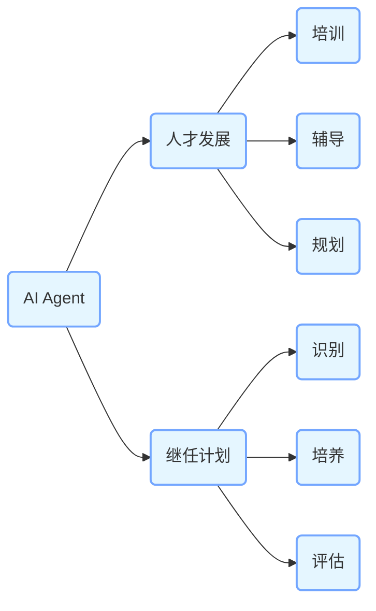

# AI Agent在企业人才发展与继任计划中的战略应用

> 关键词：AI Agent、企业人才发展、继任计划、战略应用、人工智能、人才管理、人力资源

> 摘要：本文聚焦于AI Agent在企业人才发展与继任计划中的战略应用。随着人工智能技术的快速发展，AI Agent在企业人力资源管理领域展现出巨大潜力。文章首先介绍了相关背景，包括目的范围、预期读者等。接着阐述核心概念与联系，分析AI Agent的原理和架构。详细讲解了核心算法原理与操作步骤，并结合数学模型和公式进行说明。通过项目实战案例，展示了AI Agent在企业人才发展与继任计划中的具体实现和应用。探讨了实际应用场景，推荐了相关的工具和资源。最后总结了未来发展趋势与挑战，解答常见问题并提供扩展阅读与参考资料，旨在为企业有效运用AI Agent提升人才发展与继任计划的效率和质量提供全面的指导和参考。

## 1. 背景介绍 
### 1.1 目的和范围
在当今竞争激烈的商业环境中，企业的可持续发展高度依赖于拥有高素质的人才队伍以及完善的人才发展与继任计划。AI Agent作为人工智能领域的重要成果，其在企业人才管理方面的应用具有重要意义。本文的目的在于深入探讨AI Agent在企业人才发展与继任计划中的战略应用，详细分析其原理、方法和实践案例，为企业提供全面的理论支持和实践指导。

范围涵盖了AI Agent的基本概念、核心算法、数学模型，以及在企业人才发展与继任计划各个环节的具体应用，包括人才识别、培养、评估和继任规划等方面。同时，还涉及相关工具和资源的推荐，以及对未来发展趋势和挑战的分析。

### 1.2 预期读者
本文预期读者主要包括企业人力资源管理者、企业战略规划者、人工智能领域的研究者和开发者，以及对企业人才管理和人工智能应用感兴趣的专业人士。对于人力资源管理者来说，本文提供了利用AI Agent优化人才发展与继任计划的新思路和方法；对于人工智能研究者和开发者，有助于了解AI Agent在企业管理领域的具体需求和应用场景；而对于对该领域感兴趣的专业人士，能提供一个全面了解AI Agent与企业人才管理结合的知识平台。

### 1.3 文档结构概述
本文共分为十个部分。第一部分背景介绍，阐述了文章的目的、范围、预期读者和文档结构概述，并对相关术语进行解释。第二部分核心概念与联系，详细介绍AI Agent、企业人才发展和继任计划的核心概念，以及它们之间的联系，并通过文本示意图和Mermaid流程图进行展示。第三部分核心算法原理 & 具体操作步骤，讲解AI Agent相关的核心算法原理，并使用Python源代码进行详细阐述。第四部分数学模型和公式 & 详细讲解 & 举例说明，介绍相关的数学模型和公式，并结合实例进行讲解。第五部分项目实战：代码实际案例和详细解释说明，包括开发环境搭建、源代码实现和代码解读。第六部分实际应用场景，分析AI Agent在企业人才发展与继任计划中的具体应用场景。第七部分工具和资源推荐，推荐相关的学习资源、开发工具框架和论文著作。第八部分总结：未来发展趋势与挑战，对AI Agent在企业人才发展与继任计划中的未来发展趋势和面临的挑战进行总结。第九部分附录：常见问题与解答，解答读者在阅读过程中可能遇到的常见问题。第十部分扩展阅读 & 参考资料，提供相关的扩展阅读材料和参考资料。

### 1.4 术语表
#### 1.4.1 核心术语定义
- **AI Agent（人工智能智能体）**：是一种能够感知环境、进行决策并采取行动以实现特定目标的人工智能实体。它可以通过学习和适应不断优化自身的行为。
- **企业人才发展**：指企业为了提升员工的能力和素质，促进员工的职业成长，以实现企业战略目标而采取的一系列措施和活动，包括培训、辅导、职业规划等。
- **继任计划**：是企业为了确保在关键岗位出现人员空缺时，能够有合适的人员及时填补，而提前进行的人才储备和培养计划。

#### 1.4.2 相关概念解释
- **机器学习**：是AI Agent实现智能决策的重要手段，通过对大量数据的学习和分析，让AI Agent能够自动发现数据中的规律和模式，从而进行预测和决策。
- **自然语言处理**：使AI Agent能够理解和处理人类语言，在企业人才管理中，可用于处理员工的文本信息，如简历、绩效评估报告等。
- **大数据分析**：为AI Agent提供丰富的数据支持，通过对企业内部和外部的大量数据进行分析，帮助AI Agent更好地了解人才状况和市场动态。

#### 1.4.3 缩略词列表
- **AI**：Artificial Intelligence（人工智能）
- **ML**：Machine Learning（机器学习）
- **NLP**：Natural Language Processing（自然语言处理）

## 2. 核心概念与联系 
### 2.1 AI Agent的核心概念
AI Agent是人工智能领域的一个重要概念，它具有感知、决策和行动的能力。从本质上讲，AI Agent是一个智能的软件实体，能够根据环境的变化自主地调整自己的行为，以实现特定的目标。

AI Agent的工作原理基于感知 - 决策 - 行动的循环。首先，AI Agent通过各种传感器或接口感知环境信息，这些信息可以是文本、图像、声音等多种形式。然后，AI Agent对感知到的信息进行分析和处理，运用机器学习、深度学习等算法进行决策。最后，AI Agent根据决策结果采取相应的行动，这些行动可以是与用户交互、执行任务、控制设备等。

### 2.2 企业人才发展与继任计划的核心概念
企业人才发展是企业为了提升员工的能力和素质，促进员工的职业成长，以实现企业战略目标而采取的一系列措施和活动。它包括员工培训、职业规划、绩效管理等多个方面。企业人才发展的目的是提高员工的工作绩效，增强员工的忠诚度和归属感，为企业的可持续发展提供人才支持。

继任计划是企业为了确保在关键岗位出现人员空缺时，能够有合适的人员及时填补，而提前进行的人才储备和培养计划。继任计划的关键在于识别具有潜力的人才，为他们提供针对性的培养和发展机会，以确保他们在需要时能够胜任关键岗位的工作。

### 2.3 核心概念之间的联系
AI Agent与企业人才发展和继任计划之间存在着密切的联系。AI Agent可以为企业人才发展和继任计划提供强大的技术支持。在人才识别方面，AI Agent可以通过对大量员工数据的分析，运用机器学习算法识别出具有潜力的人才，为继任计划提供人才储备。在人才培养方面，AI Agent可以根据员工的个人特点和职业发展需求，为员工提供个性化的培训方案和学习资源，促进员工的能力提升。在人才评估方面，AI Agent可以通过对员工的工作表现、绩效数据等进行实时监测和分析，为企业提供客观、准确的人才评估结果，为人才发展和继任计划提供决策依据。

### 2.4 文本示意图
```plaintext
          AI Agent
         /        \
 人才发展         继任计划
  /   |   \       /   |   \
培训  辅导  规划  识别  培养  评估
```

### 2.5 Mermaid流程图


## 3. 核心算法原理 & 具体操作步骤 
### 3.1 核心算法原理
在AI Agent应用于企业人才发展与继任计划中，常用的核心算法包括机器学习算法中的分类算法、聚类算法和回归算法等。

#### 3.1.1 分类算法
分类算法用于将员工数据分为不同的类别，例如将员工分为高潜力人才、中等潜力人才和低潜力人才。常见的分类算法有决策树、支持向量机（SVM）和逻辑回归等。

决策树算法通过构建一个树形结构来进行分类决策。每个内部节点表示一个属性上的测试，每个分支表示一个测试输出，每个叶节点表示一个类别。决策树的构建过程是一个递归的过程，通过选择最优的属性进行划分，直到满足停止条件。

支持向量机（SVM）是一种二分类模型，它的基本思想是在特征空间中找到一个最优的超平面，使得不同类别的样本能够被最大程度地分开。SVM通过求解一个凸二次规划问题来找到最优超平面。

逻辑回归是一种广义线性模型，它通过逻辑函数将线性回归的输出映射到概率值，从而进行分类。逻辑回归的目标是最大化似然函数，通过迭代优化算法求解模型参数。

#### 3.1.2 聚类算法
聚类算法用于将员工数据按照相似性进行分组，例如将员工按照技能、兴趣等进行聚类。常见的聚类算法有K - 均值聚类、层次聚类等。

K - 均值聚类算法的基本思想是将数据划分为K个簇，每个簇的中心由簇内所有数据点的均值表示。算法通过迭代的方式不断更新簇的中心，直到满足停止条件。

层次聚类算法通过不断合并或分裂簇来构建层次结构。层次聚类可以分为凝聚式层次聚类和分裂式层次聚类。凝聚式层次聚类从每个数据点作为一个单独的簇开始，不断合并相似的簇；分裂式层次聚类从所有数据点作为一个簇开始，不断分裂成更小的簇。

#### 3.1.3 回归算法
回归算法用于预测员工的绩效、潜力等连续变量。常见的回归算法有线性回归、多项式回归和岭回归等。

线性回归是一种简单的回归模型，它假设因变量和自变量之间存在线性关系。线性回归通过最小化残差平方和来求解模型参数。

多项式回归是在线性回归的基础上，引入自变量的多项式项，以拟合更复杂的函数关系。

岭回归是一种正则化的线性回归方法，它通过在损失函数中添加正则化项来防止过拟合。

### 3.2 具体操作步骤
#### 3.2.1 数据收集
首先，需要收集企业内部的员工数据，包括员工的基本信息、工作经历、绩效数据、培训记录等。同时，还可以收集外部的市场数据、行业数据等，以获取更全面的信息。

#### 3.2.2 数据预处理
对收集到的数据进行预处理，包括数据清洗、数据转换和数据归一化等操作。数据清洗用于去除数据中的噪声和缺失值；数据转换用于将非数值型数据转换为数值型数据；数据归一化用于将数据缩放到一个统一的范围，以提高算法的性能。

#### 3.2.3 模型训练
根据具体的任务需求，选择合适的算法进行模型训练。例如，如果需要进行人才分类，可以选择决策树、SVM等分类算法；如果需要进行人才聚类，可以选择K - 均值聚类、层次聚类等聚类算法；如果需要进行绩效预测，可以选择线性回归、多项式回归等回归算法。在模型训练过程中，需要将数据集分为训练集和测试集，通过训练集来训练模型，通过测试集来评估模型的性能。

#### 3.2.4 模型评估
使用评估指标来评估模型的性能。对于分类算法，常用的评估指标有准确率、召回率、F1值等；对于聚类算法，常用的评估指标有轮廓系数、Calinski - Harabasz指数等；对于回归算法，常用的评估指标有均方误差（MSE）、均方根误差（RMSE）等。

#### 3.2.5 模型部署
将训练好的模型部署到实际的应用环境中，实现AI Agent的功能。例如，可以将模型集成到企业的人才管理系统中，实现人才识别、培养和评估等功能。

### 3.3 Python源代码详细阐述
以下是一个使用Python实现的简单的人才分类示例，使用决策树算法：

```python
import pandas as pd
from sklearn.model_selection import train_test_split
from sklearn.tree import DecisionTreeClassifier
from sklearn.metrics import accuracy_score

# 数据收集与预处理
# 假设我们有一个包含员工信息的CSV文件
data = pd.read_csv('employee_data.csv')
# 分离特征和标签
X = data.drop('potential_level', axis=1)
y = data['potential_level']

# 数据划分
X_train, X_test, y_train, y_test = train_test_split(X, y, test_size=0.2, random_state=42)

# 模型训练
model = DecisionTreeClassifier()
model.fit(X_train, y_train)

# 模型预测
y_pred = model.predict(X_test)

# 模型评估
accuracy = accuracy_score(y_test, y_pred)
print(f"模型准确率: {accuracy}")
```

在上述代码中，首先使用`pandas`库读取员工数据文件。然后，将数据分为特征和标签两部分，并使用`train_test_split`函数将数据划分为训练集和测试集。接着，使用`DecisionTreeClassifier`创建决策树分类器，并使用训练集进行训练。最后，使用测试集进行预测，并计算模型的准确率。

## 4. 数学模型和公式 & 详细讲解 & 举例说明 
### 4.1 分类算法的数学模型和公式
#### 4.1.1 决策树算法
决策树的构建过程基于信息增益或基尼指数等指标。信息增益是通过计算数据集的熵和特征的条件熵来衡量特征对分类的贡献。

数据集的熵定义为：
$$H(D)=-\sum_{i = 1}^{k}p_i\log_2p_i$$
其中，$D$ 表示数据集，$k$ 表示类别数，$p_i$ 表示第 $i$ 类样本在数据集中所占的比例。

特征 $A$ 对数据集 $D$ 的条件熵定义为：
$$H(D|A)=\sum_{j = 1}^{n}\frac{|D_j|}{|D|}H(D_j)$$
其中，$n$ 表示特征 $A$ 的取值个数，$D_j$ 表示特征 $A$ 取值为第 $j$ 个值的样本子集。

信息增益定义为：
$$Gain(D,A)=H(D)-H(D|A)$$

决策树在选择划分属性时，会选择信息增益最大的属性。

#### 4.1.2 支持向量机（SVM）
SVM的目标是找到一个最优的超平面，使得不同类别的样本能够被最大程度地分开。对于二分类问题，假设训练数据集为 $\{(x_1,y_1),(x_2,y_2),\cdots,(x_n,y_n)\}$，其中 $x_i\in\mathbb{R}^d$ 表示样本特征，$y_i\in\{- 1,1\}$ 表示样本标签。

SVM的优化问题可以表示为：
$$\min_{\omega,b}\frac{1}{2}\|\omega\|^2+C\sum_{i = 1}^{n}\xi_i$$
$$s.t.\quad y_i(\omega^Tx_i + b)\geq1-\xi_i,\quad\xi_i\geq0,\quad i = 1,2,\cdots,n$$
其中，$\omega$ 是超平面的法向量，$b$ 是偏置，$\xi_i$ 是松弛变量，$C$ 是惩罚参数。

#### 4.1.3 逻辑回归
逻辑回归通过逻辑函数将线性回归的输出映射到概率值。逻辑函数定义为：
$$\sigma(z)=\frac{1}{1 + e^{-z}}$$
其中，$z=\omega^Tx + b$，$\omega$ 是模型参数，$x$ 是输入特征，$b$ 是偏置。

逻辑回归的损失函数通常使用对数损失函数：
$$L(\omega,b)=-\frac{1}{n}\sum_{i = 1}^{n}[y_i\log(\sigma(\omega^Tx_i + b))+(1 - y_i)\log(1-\sigma(\omega^Tx_i + b))]$$

### 4.2 聚类算法的数学模型和公式
#### 4.2.1 K - 均值聚类
K - 均值聚类的目标是最小化簇内误差平方和（SSE）：
$$SSE=\sum_{i = 1}^{K}\sum_{x\in C_i}\|x - \mu_i\|^2$$
其中，$K$ 表示簇的个数，$C_i$ 表示第 $i$ 个簇，$\mu_i$ 表示第 $i$ 个簇的中心，$x$ 表示簇内的样本点。

K - 均值聚类的迭代过程包括两个步骤：分配步骤和更新步骤。在分配步骤中，将每个样本点分配到距离最近的簇中心所在的簇；在更新步骤中，更新每个簇的中心为簇内所有样本点的均值。

#### 4.2.2 层次聚类
层次聚类的相似性度量通常使用距离度量，例如欧氏距离。对于两个样本点 $x=(x_1,x_2,\cdots,x_d)$ 和 $y=(y_1,y_2,\cdots,y_d)$，欧氏距离定义为：
$$d(x,y)=\sqrt{\sum_{i = 1}^{d}(x_i - y_i)^2}$$

### 4.3 回归算法的数学模型和公式
#### 4.3.1 线性回归
线性回归的模型可以表示为：
$$y=\omega^Tx + b+\epsilon$$
其中，$y$ 是因变量，$x$ 是自变量，$\omega$ 是模型参数，$b$ 是偏置，$\epsilon$ 是误差项。

线性回归的目标是最小化残差平方和：
$$RSS=\sum_{i = 1}^{n}(y_i-\omega^Tx_i - b)^2$$

#### 4.3.2 岭回归
岭回归在损失函数中添加了正则化项：
$$L(\omega,b)=\sum_{i = 1}^{n}(y_i-\omega^Tx_i - b)^2+\lambda\|\omega\|^2$$
其中，$\lambda$ 是正则化参数。

### 4.4 举例说明
#### 4.4.1 决策树算法举例
假设我们有一个简单的员工数据，包含两个特征：工作年限和绩效评分，以及一个标签：潜力等级（高、中、低）。数据集如下：

| 工作年限 | 绩效评分 | 潜力等级 |
| ---- | ---- | ---- |
| 2 | 80 | 中 |
| 3 | 85 | 高 |
| 1 | 70 | 低 |
| 4 | 90 | 高 |

首先，计算数据集的熵：
$p_{高}=\frac{2}{4}=0.5$，$p_{中}=\frac{1}{4}=0.25$，$p_{低}=\frac{1}{4}=0.25$
$$H(D)=-0.5\log_20.5 - 0.25\log_20.25 - 0.25\log_20.25=1.5$$

然后，计算工作年限特征的条件熵：
对于工作年限为 1 的样本，$p_{低}=1$，$H(D_1)=0$；对于工作年限为 2 的样本，$p_{中}=1$，$H(D_2)=0$；对于工作年限为 3 的样本，$p_{高}=1$，$H(D_3)=0$；对于工作年限为 4 的样本，$p_{高}=1$，$H(D_4)=0$。
$$H(D|工作年限)=\frac{1}{4}\times0+\frac{1}{4}\times0+\frac{1}{4}\times0+\frac{1}{4}\times0 = 0$$

信息增益：
$$Gain(D,工作年限)=1.5 - 0 = 1.5$$

同理，可以计算绩效评分特征的信息增益。比较两个特征的信息增益，选择信息增益最大的特征作为根节点进行划分。

#### 4.4.2 K - 均值聚类举例
假设我们有一组二维数据点：$\{(1,2),(2,3),(8,9),(9,10)\}$，我们要将其分为两个簇。

首先，随机选择两个初始簇中心，例如 $(1,2)$ 和 $(8,9)$。

然后，计算每个数据点到两个簇中心的距离，将数据点分配到距离最近的簇中心所在的簇。对于点 $(2,3)$，到 $(1,2)$ 的距离为 $\sqrt{(2 - 1)^2+(3 - 2)^2}=\sqrt{2}$，到 $(8,9)$ 的距离为 $\sqrt{(2 - 8)^2+(3 - 9)^2}=\sqrt{72}$，所以 $(2,3)$ 分配到以 $(1,2)$ 为中心的簇。对于点 $(9,10)$，到 $(1,2)$ 的距离为 $\sqrt{(9 - 1)^2+(10 - 2)^2}=\sqrt{128}$，到 $(8,9)$ 的距离为 $\sqrt{(9 - 8)^2+(10 - 9)^2}=\sqrt{2}$，所以 $(9,10)$ 分配到以 $(8,9)$ 为中心的簇。

接着，更新簇中心。以 $(1,2)$ 和 $(2,3)$ 为簇内点的簇中心为 $(\frac{1 + 2}{2},\frac{2 + 3}{2})=(1.5,2.5)$；以 $(8,9)$ 和 $(9,10)$ 为簇内点的簇中心为 $(\frac{8 + 9}{2},\frac{9 + 10}{2})=(8.5,9.5)$。

重复上述分配和更新步骤，直到簇中心不再变化或满足停止条件。

## 5. 项目实战：代码实际案例和详细解释说明 
### 5.1  开发环境搭建
#### 5.1.1 操作系统
可以选择Windows、Linux或macOS等主流操作系统。这里以Windows 10为例进行说明。

#### 5.1.2 编程语言和版本
选择Python作为开发语言，建议使用Python 3.7及以上版本。可以从Python官方网站（https://www.python.org/downloads/） 下载安装。

#### 5.1.3 开发工具
推荐使用PyCharm作为集成开发环境（IDE），可以从JetBrains官方网站（https://www.jetbrains.com/pycharm/download/） 下载安装。也可以使用VS Code等轻量级编辑器。

#### 5.1.4 相关库的安装
在命令行中使用`pip`命令安装所需的库，例如：
```bash
pip install pandas numpy scikit-learn matplotlib
```
其中，`pandas`用于数据处理，`numpy`用于数值计算，`scikit-learn`用于机器学习算法，`matplotlib`用于数据可视化。

### 5.2  源代码详细实现和代码解读
#### 5.2.1 数据准备
首先，我们需要准备一个包含员工信息的数据集。假设我们有一个名为`employee_data.csv`的CSV文件，包含以下列：`age`（年龄）、`work_experience`（工作经验）、`performance_score`（绩效评分）、`potential_level`（潜力等级）。

```python
import pandas as pd

# 读取数据
data = pd.read_csv('employee_data.csv')

# 查看数据基本信息
print('数据基本信息：')
data.info()

# 查看数据集行数和列数
rows, columns = data.shape

if rows < 100:
    # 小样本数据（行数少于100）查看全量数据信息
    print('数据全部内容信息：')
    print(data.to_csv(sep='\t', na_rep='nan'))
else:
    # 大样本数据查看数据前几行信息
    print('数据前几行内容信息：')
    print(data.head().to_csv(sep='\t', na_rep='nan'))
```
代码解读：
- 使用`pandas`库的`read_csv`函数读取CSV文件。
- 使用`info`方法查看数据的基本信息，包括列名、数据类型、非空值数量等。
- 根据数据集的行数，决定是查看全量数据信息还是前几行数据信息。

#### 5.2.2 数据预处理
```python
from sklearn.preprocessing import LabelEncoder

# 提取特征和标签
X = data.drop('potential_level', axis=1)
y = data['potential_level']

# 对分类特征进行编码
categorical_cols = X.select_dtypes(include=['object']).columns
for col in categorical_cols:
    le = LabelEncoder()
    X[col] = le.fit_transform(X[col])

# 划分训练集和测试集
from sklearn.model_selection import train_test_split
X_train, X_test, y_train, y_test = train_test_split(X, y, test_size=0.2, random_state=42)
```
代码解读：
- 使用`drop`方法提取特征`X`和标签`y`。
- 对于分类特征，使用`LabelEncoder`进行编码，将非数值型数据转换为数值型数据。
- 使用`train_test_split`函数将数据集划分为训练集和测试集，测试集占比为20%。

#### 5.2.3 模型训练和评估
```python
from sklearn.tree import DecisionTreeClassifier
from sklearn.metrics import accuracy_score, classification_report

# 创建决策树分类器
model = DecisionTreeClassifier()

# 训练模型
model.fit(X_train, y_train)

# 预测
y_pred = model.predict(X_test)

# 评估模型
accuracy = accuracy_score(y_test, y_pred)
print(f"模型准确率: {accuracy}")

# 打印分类报告
print("分类报告:")
print(classification_report(y_test, y_pred))
```
代码解读：
- 使用`DecisionTreeClassifier`创建决策树分类器。
- 使用`fit`方法对模型进行训练。
- 使用`predict`方法对测试集进行预测。
- 使用`accuracy_score`计算模型的准确率，使用`classification_report`打印分类报告，包括精确率、召回率、F1值等指标。

### 5.3  代码解读与分析
#### 5.3.1 数据准备阶段
数据准备是整个项目的基础，确保数据的准确性和完整性非常重要。在读取数据后，查看数据的基本信息和内容信息可以帮助我们了解数据的特征和结构，发现可能存在的问题，如缺失值、异常值等。

#### 5.3.2 数据预处理阶段
数据预处理是提高模型性能的关键步骤。对分类特征进行编码可以将非数值型数据转换为数值型数据，使得机器学习算法能够处理。划分训练集和测试集可以避免模型过拟合，提高模型的泛化能力。

#### 5.3.3 模型训练和评估阶段
选择合适的模型和算法是项目成功的关键。决策树算法是一种简单而有效的分类算法，适用于处理结构化数据。在训练模型后，使用准确率和分类报告等指标对模型进行评估，可以帮助我们了解模型的性能和效果。

## 6. 实际应用场景 
### 6.1 人才识别
AI Agent可以通过对员工的简历、工作经历、绩效数据等进行分析，运用机器学习算法识别出具有潜力的人才。例如，通过分析员工的教育背景、技能证书、项目经验等信息，预测员工在未来的工作中可能取得的成就和发展潜力。AI Agent还可以通过对员工的行为数据进行分析，如工作时间、工作效率、沟通频率等，发现员工的潜在能力和优势。

### 6.2 人才培养
在人才培养方面，AI Agent可以根据员工的个人特点和职业发展需求，为员工提供个性化的培训方案和学习资源。例如，通过分析员工的技能短板和职业目标，AI Agent可以推荐适合员工的培训课程、在线学习资源和导师辅导等。AI Agent还可以实时监测员工的学习进度和效果，根据员工的反馈调整培训方案，提高培训的针对性和有效性。

### 6.3 人才评估
AI Agent可以通过对员工的工作表现、绩效数据等进行实时监测和分析，为企业提供客观、准确的人才评估结果。例如，通过分析员工的任务完成情况、工作质量、团队协作等指标，AI Agent可以生成员工的绩效评估报告，为企业的薪酬调整、晋升决策等提供依据。AI Agent还可以通过对员工的360度评估数据进行分析，包括上级评价、同事评价和下属评价等，全面了解员工的优点和不足。

### 6.4 继任规划
在继任规划方面，AI Agent可以帮助企业识别关键岗位的潜在继任者，为继任者提供针对性的培养和发展机会。通过对员工的能力、潜力、职业目标等进行分析，AI Agent可以建立继任者人才库，并为每个继任者制定个性化的发展计划。AI Agent还可以实时监测继任者的发展情况，及时调整发展计划，确保继任者在需要时能够胜任关键岗位的工作。

## 7. 工具和资源推荐
### 7.1 学习资源推荐
#### 7.1.1 书籍推荐
- 《Python机器学习》：本书详细介绍了Python在机器学习领域的应用，包括各种机器学习算法的原理和实现，是学习机器学习的经典书籍。
- 《人工智能：一种现代的方法》：全面介绍了人工智能的各个领域，包括搜索算法、知识表示、机器学习、自然语言处理等，是人工智能领域的权威教材。
- 《人力资源管理》：系统介绍了人力资源管理的各个方面，包括人才招聘、培训、绩效管理、继任计划等，对于了解企业人才管理的理论和实践具有重要的参考价值。

#### 7.1.2 在线课程
- Coursera平台上的“机器学习”课程：由斯坦福大学教授Andrew Ng主讲，是学习机器学习的经典课程，涵盖了机器学习的基本概念、算法和应用。
- edX平台上的“人工智能基础”课程：由麻省理工学院等知名高校的教授授课，介绍了人工智能的基本原理和方法。
- 中国大学MOOC平台上的“人力资源管理概论”课程：由国内知名高校的教授授课，系统介绍了人力资源管理的理论和实践。

#### 7.1.3 技术博客和网站
- Medium：是一个技术博客平台，上面有很多关于人工智能、机器学习和人力资源管理的优质文章。
- Kaggle：是一个数据科学竞赛平台，上面有很多关于机器学习的数据集和代码示例，可以帮助我们学习和实践机器学习算法。
- 人力资源和社会保障部官方网站：提供了大量的人力资源管理政策和法规信息，对于了解企业人才管理的政策环境具有重要的参考价值。

### 7.2 开发工具框架推荐
#### 7.2.1 IDE和编辑器
- PyCharm：是一款专门为Python开发设计的集成开发环境，具有代码编辑、调试、代码分析等功能，是Python开发的首选工具。
- VS Code：是一款轻量级的代码编辑器，支持多种编程语言，具有丰富的插件扩展功能，可以满足不同的开发需求。

#### 7.2.2 调试和性能分析工具
- Py-Spy：是一个用于Python代码性能分析的工具，可以帮助我们找出代码中的性能瓶颈。
- PDB：是Python自带的调试工具，可以帮助我们调试代码，查找代码中的错误。

#### 7.2.3 相关框架和库
- Scikit-learn：是一个用于机器学习的Python库，提供了各种机器学习算法的实现，包括分类、聚类、回归等算法。
- TensorFlow：是一个开源的深度学习框架，由Google开发，广泛应用于图像识别、自然语言处理等领域。
- Pandas：是一个用于数据处理和分析的Python库，提供了高效的数据结构和数据操作方法，是数据科学领域的常用工具。

### 7.3 相关论文著作推荐
#### 7.3.1 经典论文
- “A Machine Learning Approach to Predict Employee Turnover”：该论文介绍了使用机器学习算法预测员工离职的方法，对于企业人才保留具有重要的参考价值。
- “The Use of Artificial Intelligence in Human Resource Management: A Literature Review”：对人工智能在人力资源管理领域的应用进行了综述，分析了人工智能在人才招聘、培训、绩效管理等方面的应用现状和发展趋势。

#### 7.3.2 最新研究成果
- 关注顶级学术会议如ACM SIGKDD、NeurIPS等，这些会议上发表的最新研究成果反映了人工智能和机器学习领域的前沿技术和发展趋势。
- 关注知名学术期刊如《Journal of Artificial Intelligence Research》《Human Resource Management Journal》等，这些期刊上发表的论文具有较高的学术水平和研究价值。

#### 7.3.3 应用案例分析
- 一些企业发布的关于AI Agent在人才管理方面的应用案例，如IBM、谷歌等公司的实践经验，可以帮助我们了解AI Agent在实际应用中的效果和挑战。

## 8. 总结：未来发展趋势与挑战
### 8.1 未来发展趋势
#### 8.1.1 智能化程度不断提高
随着人工智能技术的不断发展，AI Agent的智能化程度将不断提高。未来的AI Agent将能够更好地理解人类的语言和行为，更准确地预测人才的发展潜力和绩效表现，为企业提供更加个性化、精准的人才管理建议。

#### 8.1.2 与其他技术的融合
AI Agent将与其他技术如物联网、大数据、区块链等深度融合。例如，通过物联网技术收集员工的工作环境数据，结合AI Agent的分析，为员工提供更加舒适和高效的工作环境；通过区块链技术保证人才数据的安全和可信，为企业的人才管理提供更加可靠的支持。

#### 8.1.3 应用范围不断扩大
AI Agent在企业人才发展与继任计划中的应用范围将不断扩大。除了人才识别、培养、评估和继任规划等传统领域，AI Agent还将应用于企业文化建设、员工心理健康管理等领域，为企业的全面发展提供支持。

### 8.2 挑战
#### 8.2.1 数据安全和隐私问题
AI Agent的应用需要大量的员工数据，如何保证这些数据的安全和隐私是一个重要的挑战。企业需要建立完善的数据安全管理制度，采取加密、访问控制等技术手段，防止员工数据泄露和滥用。

#### 8.2.2 算法偏见问题
机器学习算法可能存在偏见，导致对某些群体的不公平评价。例如，由于数据集中存在偏差，算法可能对某些性别、种族或年龄群体的人才潜力评估不准确。企业需要采取措施消除算法偏见，确保人才评估的公平性和客观性。

#### 8.2.3 员工接受度问题
员工对AI Agent的接受度也是一个挑战。一些员工可能对AI Agent的应用存在疑虑和抵触情绪，担心自己的工作被AI Agent取代。企业需要加强对员工的培训和宣传，让员工了解AI Agent的作用和优势，提高员工的接受度和参与度。

## 9. 附录：常见问题与解答
### 9.1 问题1：AI Agent在企业人才发展与继任计划中的应用是否会导致员工失业？
解答：AI Agent的应用主要是为了提高企业人才管理的效率和质量，而不是取代员工。AI Agent可以帮助企业更好地识别和培养人才，为员工提供更多的发展机会。例如，AI Agent可以根据员工的个人特点和职业发展需求，为员工推荐适合的培训课程和职业发展路径，促进员工的职业成长。因此，AI Agent的应用不会导致员工失业，反而有助于员工的职业发展。

### 9.2 问题2：如何保证AI Agent所使用的数据的准确性和完整性？
解答：为了保证数据的准确性和完整性，企业需要建立完善的数据管理制度。首先，在数据收集阶段，要确保数据来源的可靠性，采用多种渠道收集数据，并对数据进行审核和验证。其次，在数据存储阶段，要采用安全可靠的存储设备和存储方式，防止数据丢失和损坏。最后，在数据使用阶段，要定期对数据进行更新和维护，确保数据的时效性和准确性。

### 9.3 问题3：AI Agent的应用是否会增加企业的成本？
解答：AI Agent的应用在短期内可能会增加企业的成本，例如需要购买相关的软件和硬件设备，聘请专业的技术人员进行开发和维护等。但是，从长期来看，AI Agent的应用可以提高企业人才管理的效率和质量，降低企业的人才管理成本。例如，通过AI Agent可以更准确地识别和培养人才，减少人才流失和招聘成本；通过AI Agent可以提供个性化的培训方案，提高培训的效果和效率，降低培训成本。因此，从整体上看，AI Agent的应用可以为企业带来更大的经济效益。

## 10. 扩展阅读 & 参考资料
### 10.1 扩展阅读
- 《智能时代》：作者吴军，介绍了人工智能在各个领域的应用和影响，对于了解人工智能的发展趋势和未来前景具有重要的参考价值。
- 《未来简史：从智人到神人》：作者尤瓦尔·赫拉利，探讨了人类在未来面临的挑战和机遇，包括人工智能对人类社会的影响，引发读者对未来的深入思考。

### 10.2 参考资料
- 《Python数据分析实战》
- 《机器学习实战》
- 相关学术期刊和会议论文
- 企业官方网站和行业报告