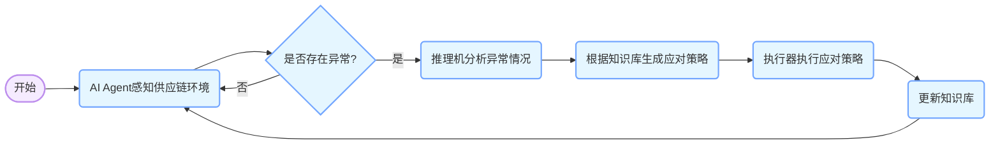

# AI Agent在企业供应链韧性提升中的角色

> 关键词：AI Agent、企业供应链、供应链韧性、智能决策、风险应对

> 摘要：本文深入探讨了AI Agent在企业供应链韧性提升中的角色。首先介绍了相关背景，包括研究目的、预期读者、文档结构和术语表。接着阐述了AI Agent和企业供应链韧性的核心概念及其联系，给出了原理和架构的示意图与流程图。详细讲解了AI Agent相关的核心算法原理和具体操作步骤，并辅以Python源代码。同时介绍了相关的数学模型和公式，通过举例说明其应用。在项目实战部分，提供了开发环境搭建、源代码实现及解读。还探讨了AI Agent在企业供应链中的实际应用场景，推荐了学习资源、开发工具框架和相关论文著作。最后总结了未来发展趋势与挑战，提供了常见问题解答和扩展阅读参考资料，旨在全面剖析AI Agent对企业供应链韧性提升的重要作用。

## 1. 背景介绍 
### 1.1 目的和范围
随着全球经济的快速发展和市场环境的日益复杂，企业供应链面临着诸多挑战，如自然灾害、政治不稳定、贸易摩擦、疫情等，这些因素都可能导致供应链中断，影响企业的正常运营和盈利能力。因此，提升企业供应链的韧性成为了企业管理者关注的焦点。

本文章的目的是探讨AI Agent在企业供应链韧性提升中的角色，分析其如何通过智能决策、实时监控、风险预测等功能，帮助企业更好地应对供应链中的不确定性和风险，提高供应链的稳定性和灵活性。文章的范围涵盖了AI Agent的基本概念、核心算法、数学模型，以及在企业供应链中的实际应用案例和开发实践。

### 1.2 预期读者
本文的预期读者包括企业供应链管理人员、物流从业者、人工智能研究人员、软件开发人员以及对供应链管理和人工智能应用感兴趣的相关人士。对于供应链管理人员和物流从业者，本文可以帮助他们了解AI Agent如何应用于供应链管理，提升供应链的韧性；对于人工智能研究人员和软件开发人员，本文提供了AI Agent在供应链领域的具体应用场景和技术实现细节，为他们的研究和开发工作提供参考。

### 1.3 文档结构概述
本文共分为十个部分。第一部分为背景介绍，阐述了文章的目的和范围、预期读者、文档结构概述和术语表；第二部分介绍了AI Agent和企业供应链韧性的核心概念及其联系，给出了原理和架构的示意图与流程图；第三部分详细讲解了AI Agent的核心算法原理和具体操作步骤，并使用Python源代码进行了说明；第四部分介绍了相关的数学模型和公式，并通过举例进行了详细讲解；第五部分为项目实战，包括开发环境搭建、源代码详细实现和代码解读；第六部分探讨了AI Agent在企业供应链中的实际应用场景；第七部分推荐了学习资源、开发工具框架和相关论文著作；第八部分总结了未来发展趋势与挑战；第九部分为附录，提供了常见问题与解答；第十部分为扩展阅读和参考资料。

### 1.4 术语表
#### 1.4.1 核心术语定义
- **AI Agent（人工智能代理）**：是一种能够感知环境、根据自身的知识库和算法进行推理和决策，并通过执行器对环境产生作用的智能实体。它可以自主地完成特定的任务，也可以与其他Agent进行协作。
- **企业供应链韧性**：指企业供应链在面临内外部干扰时，能够迅速恢复到正常状态，并在必要时进行调整和适应，以维持供应链的连续性和有效性的能力。
- **供应链中断**：指由于各种原因导致供应链中的物流、信息流或资金流出现中断，影响企业的生产和销售活动。
- **风险预测**：指通过对历史数据和实时数据的分析，预测供应链中可能出现的风险及其发生的概率和影响程度。

#### 1.4.2 相关概念解释
- **智能决策**：AI Agent通过对大量数据的分析和学习，运用算法和模型进行推理和判断，为企业提供最优的决策方案。
- **实时监控**：AI Agent实时收集和分析供应链中的各种数据，如库存水平、运输状态、供应商绩效等，及时发现异常情况并发出警报。
- **协作与协调**：AI Agent可以与供应链中的其他参与者（如供应商、制造商、物流商等）进行通信和协作，实现信息共享和资源优化配置。

#### 1.4.3 缩略词列表
- **AI**：Artificial Intelligence（人工智能）
- **ML**：Machine Learning（机器学习）
- **DL**：Deep Learning（深度学习）
- **IoT**：Internet of Things（物联网）

## 2. 核心概念与联系 

### 2.1 AI Agent的核心概念
AI Agent是人工智能领域中的一个重要概念，它可以被看作是一个具有自主性、反应性、社会性和主动性的智能实体。自主性意味着AI Agent能够独立地感知环境、进行决策和执行任务；反应性表示AI Agent能够根据环境的变化及时做出反应；社会性指AI Agent可以与其他Agent进行交互和协作；主动性则体现为AI Agent能够主动地发起行动以实现其目标。

AI Agent通常由感知器、知识库、推理机和执行器四个部分组成。感知器用于收集环境中的信息，如传感器数据、文本信息等；知识库存储了AI Agent所需的知识和规则；推理机根据感知器收集的信息和知识库中的知识进行推理和决策；执行器则根据推理机的决策结果对环境产生作用。

### 2.2 企业供应链韧性的核心概念
企业供应链韧性是企业供应链管理中的一个关键指标，它反映了企业供应链在面对各种不确定性和风险时的适应能力和恢复能力。一个具有高韧性的供应链能够在遭受干扰时迅速调整运营策略，维持供应链的连续性，减少损失，并在干扰消除后快速恢复到正常状态。

企业供应链韧性的提升需要从多个方面入手，包括优化供应链结构、建立多元化的供应商网络、加强库存管理、提高信息共享水平等。同时，还需要借助先进的技术手段，如人工智能、物联网、大数据等，实现供应链的智能化管理和决策。

### 2.3 AI Agent与企业供应链韧性的联系
AI Agent在企业供应链韧性提升中扮演着重要的角色。通过实时监控供应链中的各种数据，AI Agent可以及时发现潜在的风险和问题，并通过智能决策为企业提供应对策略。例如，当AI Agent监测到某个供应商的交货延迟时，它可以根据历史数据和当前情况预测延迟的影响程度，并建议企业采取相应的措施，如调整生产计划、寻找替代供应商等。

此外，AI Agent还可以与供应链中的其他参与者进行协作和协调，实现信息共享和资源优化配置。例如，AI Agent可以与供应商的Agent进行通信，了解供应商的生产进度和库存情况，提前做好应对准备。通过这种协作和协调，企业可以提高供应链的整体效率和韧性。

### 2.4 原理和架构的文本示意图
```plaintext
           +----------------+
           |  AI Agent      |
           | +------------+ |
           | | 感知器     | |
           | +------------+ |
           | | 知识库     | |
           | +------------+ |
           | | 推理机     | |
           | +------------+ |
           | | 执行器     | |
           | +------------+ |
           +----------------+
                  |
                  v
 +----------------------+
 | 企业供应链环境      |
 | +----------------+   |
 | | 供应商网络     |   |
 | +----------------+   |
 | | 生产环节       |   |
 | +----------------+   |
 | | 物流配送       |   |
 | +----------------+   |
 | | 销售渠道       |   |
 | +----------------+   |
 +----------------------+
```

### 2.5 Mermaid流程图


## 3. 核心算法原理 & 具体操作步骤 

### 3.1 核心算法原理
在AI Agent用于企业供应链韧性提升的过程中，常用的核心算法包括机器学习算法和优化算法。下面以机器学习中的决策树算法和优化算法中的线性规划算法为例进行介绍。

#### 3.1.1 决策树算法
决策树是一种基于树结构进行决策的机器学习算法。它通过对训练数据的学习，构建一棵决策树，每个内部节点表示一个属性上的测试，每个分支表示一个测试输出，每个叶节点表示一个类别或值。在供应链风险预测中，决策树可以根据历史数据和实时数据，对供应链中可能出现的风险进行分类和预测。

决策树的构建过程主要包括以下几个步骤：
1. **特征选择**：选择对分类结果影响最大的特征作为根节点。
2. **划分数据集**：根据选择的特征对数据集进行划分，生成子节点。
3. **递归构建子树**：对每个子节点重复步骤1和步骤2，直到满足停止条件。

#### 3.1.2 线性规划算法
线性规划是一种用于求解线性目标函数在一组线性约束条件下的最优解的优化算法。在供应链管理中，线性规划可以用于解决资源分配、生产计划、运输路线优化等问题。

线性规划问题的一般形式可以表示为：
$$
\begin{aligned}
\text{maximize/minimize} &\quad c^T x \\
\text{subject to} &\quad Ax \leq b \\
&\quad x \geq 0
\end{aligned}
$$
其中，$x$ 是决策变量向量，$c$ 是目标函数系数向量，$A$ 是约束条件系数矩阵，$b$ 是约束条件右侧常数向量。

### 3.2 具体操作步骤

#### 3.2.1 数据收集与预处理
首先，需要收集供应链中的各种数据，包括供应商信息、生产数据、物流数据、销售数据等。然后，对收集到的数据进行预处理，包括数据清洗、数据转换、数据归一化等操作，以提高数据的质量和可用性。

#### 3.2.2 模型训练
使用预处理后的数据对决策树模型和线性规划模型进行训练。对于决策树模型，可以使用Python中的`scikit-learn`库进行训练；对于线性规划模型，可以使用`pulp`库进行求解。

#### 3.2.3 风险预测与决策
使用训练好的模型对供应链中的风险进行预测，并根据预测结果生成决策方案。例如，当预测到某个供应商的交货延迟风险较高时，可以通过线性规划模型优化生产计划和库存管理，以减少损失。

#### 3.2.4 执行与反馈
将生成的决策方案执行到实际供应链中，并收集执行结果的反馈信息。根据反馈信息，对模型进行更新和优化，以提高模型的准确性和适应性。

### 3.3 Python源代码示例

#### 3.3.1 决策树算法示例
```python
import numpy as np
from sklearn.datasets import load_iris
from sklearn.model_selection import train_test_split
from sklearn.tree import DecisionTreeClassifier
from sklearn.metrics import accuracy_score

# 加载数据集
iris = load_iris()
X = iris.data
y = iris.target

# 划分训练集和测试集
X_train, X_test, y_train, y_test = train_test_split(X, y, test_size=0.3, random_state=42)

# 创建决策树分类器
clf = DecisionTreeClassifier()

# 训练模型
clf.fit(X_train, y_train)

# 预测
y_pred = clf.predict(X_test)

# 计算准确率
accuracy = accuracy_score(y_test, y_pred)
print(f"Accuracy: {accuracy}")
```

#### 3.3.2 线性规划算法示例
```python
from pulp import LpMaximize, LpProblem, LpVariable

# 创建线性规划问题
prob = LpProblem("Simple_Linear_Programming", LpMaximize)

# 定义决策变量
x = LpVariable("x", lowBound=0)
y = LpVariable("y", lowBound=0)

# 定义目标函数
prob += 3 * x + 2 * y

# 定义约束条件
prob += 2 * x + y <= 10
prob += x + 3 * y <= 12

# 求解线性规划问题
prob.solve()

# 输出结果
print(f"Status: {prob.status}")
print(f"x = {x.value()}")
print(f"y = {y.value()}")
print(f"Objective value = {prob.objective.value()}")
```

## 4. 数学模型和公式 & 详细讲解 & 举例说明 

### 4.1 决策树算法的数学模型
决策树算法的核心是信息增益和信息熵的概念。信息熵是衡量数据集中不确定性的指标，其计算公式为：
$$
H(S) = -\sum_{i=1}^{n} p_i \log_2 p_i
$$
其中，$S$ 是数据集，$p_i$ 是数据集中第 $i$ 类样本的比例，$n$ 是类别的数量。

信息增益是指在使用某个特征进行划分后，数据集的信息熵减少的程度，其计算公式为：
$$
IG(S, A) = H(S) - \sum_{v \in Values(A)} \frac{|S_v|}{|S|} H(S_v)
$$
其中，$S$ 是数据集，$A$ 是特征，$Values(A)$ 是特征 $A$ 的所有取值，$S_v$ 是根据特征 $A$ 的取值 $v$ 划分得到的子集，$|S|$ 和 $|S_v|$ 分别表示数据集 $S$ 和子集 $S_v$ 的样本数量。

在决策树的构建过程中，选择信息增益最大的特征作为划分节点，以减少数据集的不确定性。

### 4.2 线性规划算法的数学模型
线性规划问题的一般形式为：
$$
\begin{aligned}
\text{maximize/minimize} &\quad c^T x \\
\text{subject to} &\quad Ax \leq b \\
&\quad x \geq 0
\end{aligned}
$$
其中，$x$ 是决策变量向量，$c$ 是目标函数系数向量，$A$ 是约束条件系数矩阵，$b$ 是约束条件右侧常数向量。

线性规划问题的求解方法主要有单纯形法和内点法等。在Python中，可以使用`pulp`库来求解线性规划问题。

### 4.3 举例说明
#### 4.3.1 决策树算法举例
假设我们有一个供应链风险预测的数据集，包含三个特征：供应商信誉、交货时间、产品质量，以及一个类别标签：是否存在风险。数据集如下：

| 供应商信誉 | 交货时间 | 产品质量 | 是否存在风险 |
| ---- | ---- | ---- | ---- |
| 高 | 短 | 好 | 否 |
| 高 | 长 | 好 | 否 |
| 低 | 短 | 好 | 是 |
| 低 | 长 | 差 | 是 |

首先，计算数据集的信息熵：
$$
H(S) = -\frac{2}{4} \log_2 \frac{2}{4} - \frac{2}{4} \log_2 \frac{2}{4} = 1
$$

然后，分别计算使用每个特征进行划分后的信息增益：
- **使用供应商信誉划分**：
  - 供应商信誉高的子集：$S_{高} = \{(高, 短, 好, 否), (高, 长, 好, 否)\}$，$H(S_{高}) = 0$
  - 供应商信誉低的子集：$S_{低} = \{(低, 短, 好, 是), (低, 长, 差, 是)\}$，$H(S_{低}) = 0$
  - 信息增益：$IG(S, 供应商信誉) = 1 - (\frac{2}{4} \times 0 + \frac{2}{4} \times 0) = 1$

- **使用交货时间划分**：
  - 交货时间短的子集：$S_{短} = \{(高, 短, 好, 否), (低, 短, 好, 是)\}$，$H(S_{短}) = 1$
  - 交货时间长的子集：$S_{长} = \{(高, 长, 好, 否), (低, 长, 差, 是)\}$，$H(S_{长}) = 1$
  - 信息增益：$IG(S, 交货时间) = 1 - (\frac{2}{4} \times 1 + \frac{2}{4} \times 1) = 0$

- **使用产品质量划分**：
  - 产品质量好的子集：$S_{好} = \{(高, 短, 好, 否), (高, 长, 好, 否), (低, 短, 好, 是)\}$，$H(S_{好}) \approx 0.918$
  - 产品质量差的子集：$S_{差} = \{(低, 长, 差, 是)\}$，$H(S_{差}) = 0$
  - 信息增益：$IG(S, 产品质量) \approx 1 - (\frac{3}{4} \times 0.918 + \frac{1}{4} \times 0) \approx 0.313$

由于使用供应商信誉划分的信息增益最大，因此选择供应商信誉作为根节点进行划分。

#### 4.3.2 线性规划算法举例
假设一家企业生产两种产品 $A$ 和 $B$，生产产品 $A$ 需要消耗 2 单位的原材料 $X$ 和 1 单位的原材料 $Y$，生产产品 $B$ 需要消耗 1 单位的原材料 $X$ 和 3 单位的原材料 $Y$。企业拥有 10 单位的原材料 $X$ 和 12 单位的原材料 $Y$。产品 $A$ 的利润为 3 元/件，产品 $B$ 的利润为 2 元/件。企业希望在原材料有限的情况下，最大化总利润。

设生产产品 $A$ 的数量为 $x$，生产产品 $B$ 的数量为 $y$，则该问题可以表示为以下线性规划问题：
$$
\begin{aligned}
\text{maximize} &\quad 3x + 2y \\
\text{subject to} &\quad 2x + y \leq 10 \\
&\quad x + 3y \leq 12 \\
&\quad x \geq 0, y \geq 0
\end{aligned}
$$

使用Python的`pulp`库求解该问题：
```python
from pulp import LpMaximize, LpProblem, LpVariable

# 创建线性规划问题
prob = LpProblem("Product_Production_Planning", LpMaximize)

# 定义决策变量
x = LpVariable("x", lowBound=0)
y = LpVariable("y", lowBound=0)

# 定义目标函数
prob += 3 * x + 2 * y

# 定义约束条件
prob += 2 * x + y <= 10
prob += x + 3 * y <= 12

# 求解线性规划问题
prob.solve()

# 输出结果
print(f"Status: {prob.status}")
print(f"x = {x.value()}")
print(f"y = {y.value()}")
print(f"Objective value = {prob.objective.value()}")
```

运行上述代码，即可得到最优的生产计划和最大利润。

## 5. 项目实战：代码实际案例和详细解释说明 

### 5.1 开发环境搭建
#### 5.1.1 安装Python
首先，需要安装Python编程语言。可以从Python官方网站（https://www.python.org/downloads/）下载适合自己操作系统的Python安装包，并按照安装向导进行安装。

#### 5.1.2 安装必要的库
在本项目中，需要使用`scikit-learn`、`pulp`、`pandas`、`numpy`等库。可以使用`pip`命令进行安装：
```sh
pip install scikit-learn pulp pandas numpy
```

### 5.2 源代码详细实现和代码解读

#### 5.2.1 数据加载与预处理
```python
import pandas as pd
from sklearn.preprocessing import StandardScaler
from sklearn.model_selection import train_test_split

# 加载数据集
data = pd.read_csv('supply_chain_data.csv')

# 分离特征和标签
X = data.drop('risk_label', axis=1)
y = data['risk_label']

# 数据标准化
scaler = StandardScaler()
X_scaled = scaler.fit_transform(X)

# 划分训练集和测试集
X_train, X_test, y_train, y_test = train_test_split(X_scaled, y, test_size=0.2, random_state=42)
```
**代码解读**：
- 使用`pandas`库的`read_csv`函数加载供应链风险预测的数据集。
- 使用`drop`方法分离特征和标签。
- 使用`StandardScaler`对特征数据进行标准化处理，以提高模型的训练效果。
- 使用`train_test_split`函数将数据集划分为训练集和测试集。

#### 5.2.2 决策树模型训练与评估
```python
from sklearn.tree import DecisionTreeClassifier
from sklearn.metrics import accuracy_score, classification_report

# 创建决策树分类器
clf = DecisionTreeClassifier()

# 训练模型
clf.fit(X_train, y_train)

# 预测
y_pred = clf.predict(X_test)

# 计算准确率
accuracy = accuracy_score(y_test, y_pred)
print(f"Accuracy: {accuracy}")

# 打印分类报告
print(classification_report(y_test, y_pred))
```
**代码解读**：
- 使用`DecisionTreeClassifier`创建决策树分类器。
- 使用`fit`方法对模型进行训练。
- 使用`predict`方法对测试集进行预测。
- 使用`accuracy_score`计算预测的准确率。
- 使用`classification_report`打印分类报告，包括精确率、召回率、F1值等指标。

#### 5.2.3 线性规划模型求解
```python
from pulp import LpMaximize, LpProblem, LpVariable

# 创建线性规划问题
prob = LpProblem("Supply_Chain_Optimization", LpMaximize)

# 定义决策变量
x1 = LpVariable("x1", lowBound=0)  # 产品1的生产数量
x2 = LpVariable("x2", lowBound=0)  # 产品2的生产数量

# 定义目标函数
prob += 5 * x1 + 3 * x2  # 假设产品1的利润为5，产品2的利润为3

# 定义约束条件
prob += 2 * x1 + x2 <= 10  # 原材料1的约束
prob += x1 + 3 * x2 <= 12  # 原材料2的约束

# 求解线性规划问题
prob.solve()

# 输出结果
print(f"Status: {prob.status}")
print(f"x1 = {x1.value()}")
print(f"x2 = {x2.value()}")
print(f"Objective value = {prob.objective.value()}")
```
**代码解读**：
- 使用`LpProblem`创建线性规划问题。
- 使用`LpVariable`定义决策变量。
- 使用`+=`运算符定义目标函数和约束条件。
- 使用`solve`方法求解线性规划问题。
- 输出求解结果，包括问题的状态、决策变量的值和目标函数的值。

### 5.3 代码解读与分析
#### 5.3.1 数据预处理的重要性
数据预处理是机器学习项目中非常重要的一步。通过数据标准化，可以使不同特征的数据具有相同的尺度，避免某些特征对模型的影响过大。同时，划分训练集和测试集可以评估模型的泛化能力，避免过拟合。

#### 5.3.2 决策树模型的优缺点
决策树模型的优点是易于理解和解释，能够处理非线性数据，并且不需要对数据进行复杂的预处理。缺点是容易过拟合，尤其是在数据量较小或特征数量较多的情况下。可以通过剪枝等方法来避免过拟合。

#### 5.3.3 线性规划模型的应用场景
线性规划模型适用于解决资源分配、生产计划、运输路线优化等问题。在供应链管理中，可以使用线性规划模型来优化库存管理、生产调度和物流配送，以提高供应链的效率和效益。

## 6. 实际应用场景 
### 6.1 供应商选择与管理
AI Agent可以通过对供应商的历史数据、信誉评级、生产能力等信息进行分析，帮助企业选择最合适的供应商。同时，AI Agent可以实时监控供应商的绩效，如交货时间、产品质量等，及时发现潜在的问题，并采取相应的措施，如调整订单分配、寻找替代供应商等，以提高供应链的稳定性和韧性。

### 6.2 库存管理
AI Agent可以根据销售预测、生产计划和供应商交货时间等信息，优化企业的库存水平。通过实时监控库存状态，AI Agent可以及时发出补货警报，避免库存积压或缺货的情况发生。同时，AI Agent可以根据不同产品的需求特性和供应风险，制定差异化的库存策略，提高库存管理的效率和灵活性。

### 6.3 生产计划与调度
AI Agent可以根据订单需求、生产能力、原材料供应等因素，制定最优的生产计划和调度方案。通过实时监控生产进度和设备状态，AI Agent可以及时调整生产计划，应对生产过程中的突发情况，如设备故障、原材料短缺等，确保生产的连续性和稳定性。

### 6.4 物流配送优化
AI Agent可以根据货物的重量、体积、目的地、运输时间等因素，选择最优的物流配送方案。通过实时监控物流运输状态，AI Agent可以及时发现运输过程中的异常情况，如交通拥堵、车辆故障等，并调整运输路线或运输方式，确保货物按时、安全地送达目的地。

### 6.5 风险预测与应对
AI Agent可以通过对历史数据和实时数据的分析，预测供应链中可能出现的风险，如自然灾害、政治不稳定、贸易摩擦等。当预测到风险时，AI Agent可以根据风险的类型和影响程度，制定相应的应对策略，如调整采购计划、增加库存、寻找替代供应商等，以降低风险对供应链的影响。

## 7. 工具和资源推荐
### 7.1 学习资源推荐
#### 7.1.1 书籍推荐
- 《人工智能：一种现代的方法》（Artificial Intelligence: A Modern Approach）：这本书是人工智能领域的经典教材，全面介绍了人工智能的基本概念、算法和应用。
- 《机器学习》（Machine Learning）：由周志华教授编写，系统地介绍了机器学习的基本理论和方法，适合初学者和有一定基础的读者。
- 《Python机器学习实战》（Python Machine Learning）：本书通过实际案例介绍了如何使用Python进行机器学习开发，包括数据预处理、模型训练、模型评估等内容。

#### 7.1.2 在线课程
- Coursera平台上的“机器学习”课程：由斯坦福大学的Andrew Ng教授授课，是机器学习领域的经典课程，适合初学者。
- edX平台上的“人工智能基础”课程：介绍了人工智能的基本概念、算法和应用，帮助学习者建立人工智能的基础知识体系。
- 中国大学MOOC平台上的“Python数据分析与应用”课程：讲解了如何使用Python进行数据分析和挖掘，包括数据清洗、数据可视化、机器学习等内容。

#### 7.1.3 技术博客和网站
- Medium：一个技术博客平台，上面有很多关于人工智能、机器学习、供应链管理等领域的优秀文章。
- Towards Data Science：专注于数据科学和机器学习领域的技术博客，提供了很多实用的教程和案例。
- Supply Chain Dive：专门报道供应链管理领域的新闻和趋势，对于了解供应链行业的最新动态非常有帮助。

### 7.2 开发工具框架推荐
#### 7.2.1 IDE和编辑器
- PyCharm：一款专业的Python集成开发环境，提供了代码编辑、调试、版本控制等功能，适合Python开发人员。
- Jupyter Notebook：一个交互式的开发环境，支持Python、R等多种编程语言，非常适合数据科学和机器学习的开发和实验。
- Visual Studio Code：一款轻量级的代码编辑器，支持多种编程语言和插件扩展，具有丰富的功能和良好的用户体验。

#### 7.2.2 调试和性能分析工具
- pdb：Python自带的调试工具，可以帮助开发人员定位和解决代码中的问题。
- cProfile：Python的性能分析工具，可以分析代码的运行时间和内存使用情况，帮助开发人员优化代码性能。
- TensorBoard：TensorFlow的可视化工具，可以帮助开发人员可视化模型的训练过程和性能指标。

#### 7.2.3 相关框架和库
- scikit-learn：一个简单易用的机器学习库，提供了多种机器学习算法和工具，如分类、回归、聚类等。
- TensorFlow：一个开源的深度学习框架，广泛应用于图像识别、自然语言处理等领域。
- PyTorch：另一个流行的深度学习框架，具有动态图和易于使用的特点，受到了很多研究人员和开发者的喜爱。

### 7.3 相关论文著作推荐
#### 7.3.1 经典论文
- “A Mathematical Programming Approach to Scheduling and Rescheduling in Supply Chain Management”：该论文提出了一种基于数学规划的供应链调度和重调度方法，为供应链优化提供了理论基础。
- “Risk Management in Supply Chains: A Review”：对供应链风险管理的相关研究进行了综述，分析了供应链风险的类型、评估方法和应对策略。
- “Agent-Based Modeling and Simulation of Supply Chain Dynamics”：介绍了基于Agent的建模和仿真方法在供应链动态分析中的应用，为研究供应链的复杂性和不确定性提供了新的视角。

#### 7.3.2 最新研究成果
- 近年来，随着人工智能和物联网技术的发展，越来越多的研究关注于如何将这些技术应用于供应链管理中，以提高供应链的韧性和效率。例如，一些研究提出了基于深度学习的供应链风险预测模型，通过对大量的历史数据和实时数据进行分析，提高了风险预测的准确性。

#### 7.3.3 应用案例分析
- 一些知名企业已经开始应用AI Agent技术来提升供应链的韧性。例如，亚马逊通过使用AI Agent来优化库存管理和物流配送，提高了订单处理速度和客户满意度。沃尔玛则利用AI Agent来监控供应商的绩效，及时发现潜在的问题，并采取相应的措施，降低了供应链风险。

## 8. 总结：未来发展趋势与挑战
### 8.1 未来发展趋势
#### 8.1.1 智能化程度不断提高
随着人工智能技术的不断发展，AI Agent的智能化程度将不断提高。未来的AI Agent将能够更好地理解和处理复杂的供应链信息，做出更加准确和智能的决策。例如，AI Agent可以通过自然语言处理技术与供应链中的其他参与者进行交流，实现更加高效的协作和协调。

#### 8.1.2 与物联网的深度融合
物联网技术可以实现供应链中各种设备和物品的互联互通，为AI Agent提供更加丰富和实时的数据。未来，AI Agent将与物联网深度融合，实现对供应链的全面感知和实时监控。例如，通过在运输车辆和仓库中安装传感器，AI Agent可以实时了解货物的位置、状态和环境信息，及时调整物流配送方案。

#### 8.1.3 跨企业供应链协作
未来，企业之间的供应链协作将更加紧密，AI Agent将在跨企业供应链协作中发挥重要作用。不同企业的AI Agent可以通过通信和协作，实现信息共享和资源优化配置，提高整个供应链的效率和韧性。例如，供应商的AI Agent可以与制造商的AI Agent实时沟通，协调生产计划和交货时间。

### 8.2 挑战
#### 8.2.1 数据安全和隐私问题
AI Agent的运行需要大量的供应链数据，这些数据包含了企业的敏感信息，如客户信息、供应商信息、生产计划等。因此，数据安全和隐私问题是AI Agent应用面临的重要挑战。企业需要采取有效的措施来保护数据的安全和隐私，如加密技术、访问控制等。

#### 8.2.2 技术集成和兼容性问题
在实际应用中，AI Agent需要与企业现有的信息系统和技术进行集成。然而，不同的信息系统和技术之间可能存在兼容性问题，导致AI Agent无法正常运行。因此，企业需要解决技术集成和兼容性问题，确保AI Agent能够与现有系统无缝对接。

#### 8.2.3 人才短缺问题
AI Agent技术的应用需要具备人工智能、机器学习、供应链管理等多方面知识的专业人才。然而，目前市场上这类人才相对短缺，企业在招聘和培养相关人才方面面临一定的困难。因此，企业需要加强人才培养和引进，提高员工的技术水平和综合素质。

## 9. 附录：常见问题与解答
### 9.1 什么是AI Agent？
AI Agent是一种能够感知环境、根据自身的知识库和算法进行推理和决策，并通过执行器对环境产生作用的智能实体。它可以自主地完成特定的任务，也可以与其他Agent进行协作。

### 9.2 AI Agent如何提升企业供应链韧性？
AI Agent可以通过实时监控供应链中的各种数据，及时发现潜在的风险和问题，并通过智能决策为企业提供应对策略。同时，AI Agent还可以与供应链中的其他参与者进行协作和协调，实现信息共享和资源优化配置，提高供应链的整体效率和韧性。

### 9.3 AI Agent在供应链管理中应用的难点有哪些？
AI Agent在供应链管理中应用的难点主要包括数据安全和隐私问题、技术集成和兼容性问题、人才短缺问题等。企业需要采取有效的措施来解决这些问题，确保AI Agent能够在供应链管理中发挥最大的作用。

### 9.4 如何选择适合企业的AI Agent技术？
企业在选择适合自己的AI Agent技术时，需要考虑自身的业务需求、数据情况、技术实力等因素。同时，还需要对不同的AI Agent技术进行评估和比较，选择最适合自己的技术方案。

### 9.5 AI Agent与传统供应链管理方法有什么区别？
与传统供应链管理方法相比，AI Agent具有更强的智能性和自主性。传统供应链管理方法主要依赖于人工经验和规则进行决策，而AI Agent可以通过对大量数据的分析和学习，自动发现问题并提供最优的决策方案。此外，AI Agent还可以实时监控供应链的运行状态，及时做出调整，提高供应链的响应速度和灵活性。

## 10. 扩展阅读 & 参考资料
### 10.1 扩展阅读
- 《供应链管理：战略、规划与运营》（Supply Chain Management: Strategy, Planning, and Operation）：这本书深入介绍了供应链管理的各个方面，包括供应链战略、采购管理、生产计划、物流配送等，对于理解供应链管理的整体框架和流程非常有帮助。
- 《大数据时代：生活、工作与思维的大变革》（Big Data: A Revolution That Will Transform How We Live, Work, and Think）：探讨了大数据对各个领域的影响，包括供应链管理。书中介绍了如何利用大数据技术来分析和挖掘供应链数据，为企业决策提供支持。
- 《智能时代：大数据与智能革命重新定义未来》：阐述了人工智能和大数据技术的发展趋势，以及它们对社会和经济的影响。对于了解AI Agent在未来供应链管理中的应用前景具有一定的参考价值。

### 10.2 参考资料
- 相关学术期刊：《Management Science》、《Operations Research》、《Supply Chain Management: An International Journal》等，这些期刊发表了很多关于供应链管理和人工智能应用的前沿研究成果。
- 行业报告：Gartner、Forrester等咨询公司发布的关于供应链管理和人工智能的行业报告，提供了行业的最新动态和发展趋势。
- 企业官网：亚马逊、沃尔玛、阿里巴巴等企业的官网，介绍了它们在供应链管理和人工智能应用方面的实践经验和案例。