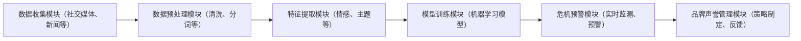

# AI Agent在企业品牌声誉管理与危机预警中的角色

> 关键词：AI Agent、企业品牌声誉管理、危机预警、自然语言处理、机器学习

> 摘要：本文深入探讨了AI Agent在企业品牌声誉管理与危机预警中的重要角色。首先介绍了相关背景，包括目的、预期读者、文档结构和术语表。接着阐述了核心概念与联系，通过示意图和流程图展示其架构。详细讲解了核心算法原理及操作步骤，并给出Python代码示例。分析了数学模型和公式，结合实际例子进行说明。通过项目实战，从开发环境搭建到代码实现与解读，展示了AI Agent的应用。探讨了实际应用场景，推荐了学习资源、开发工具和相关论文。最后总结了未来发展趋势与挑战，解答了常见问题，并提供了扩展阅读和参考资料。

## 1. 背景介绍 
### 1.1 目的和范围
在当今数字化时代，企业的品牌声誉对于其生存和发展至关重要。一个负面事件可能在瞬间通过社交媒体和网络传播，对企业品牌造成严重损害。因此，企业需要有效的品牌声誉管理和危机预警机制。本文的目的是探讨AI Agent在这一领域的应用，分析其原理、算法和实际应用，为企业提供可行的解决方案。范围涵盖了AI Agent的基本概念、核心算法、数学模型、项目实战以及实际应用场景等方面。

### 1.2 预期读者
本文的预期读者包括企业管理人员、市场营销人员、品牌管理专家、数据分析师以及对AI技术在企业管理中应用感兴趣的技术人员。这些读者可以从本文中了解到如何利用AI Agent来提升企业品牌声誉管理和危机预警的能力。

### 1.3 文档结构概述
本文将按照以下结构进行阐述：首先介绍背景信息，包括目的、读者和文档结构。接着讲解核心概念与联系，展示其架构。然后详细分析核心算法原理和操作步骤，给出Python代码。之后探讨数学模型和公式，并举例说明。通过项目实战展示AI Agent的实际应用，包括开发环境搭建、代码实现和解读。接着讨论实际应用场景，推荐相关工具和资源。最后总结未来发展趋势与挑战，解答常见问题，并提供扩展阅读和参考资料。

### 1.4 术语表
#### 1.4.1 核心术语定义
- **AI Agent**：人工智能代理，是一种能够感知环境、做出决策并采取行动的智能实体。它可以通过学习和适应不断优化自身的行为。
- **企业品牌声誉管理**：企业通过各种手段来维护和提升其品牌在公众心目中的形象和声誉的过程。
- **危机预警**：通过对各种信息的监测和分析，提前发现可能对企业造成危机的因素，并及时发出警报的机制。

#### 1.4.2 相关概念解释
- **自然语言处理（NLP）**：是AI的一个重要领域，主要研究如何让计算机理解和处理人类语言。在企业品牌声誉管理中，NLP可以用于分析社交媒体上的文本信息，了解公众对企业的评价和态度。
- **机器学习**：是AI的核心技术之一，通过让计算机从数据中学习模式和规律，从而实现预测和决策。在危机预警中，机器学习可以用于对历史数据的分析，建立预测模型。

#### 1.4.3 缩略词列表
- **NLP**：Natural Language Processing（自然语言处理）
- **ML**：Machine Learning（机器学习）

## 2. 核心概念与联系 

### 核心概念原理
AI Agent在企业品牌声誉管理与危机预警中的核心原理是通过收集、分析和处理各种数据，包括社交媒体数据、新闻报道、客户反馈等，来了解公众对企业品牌的评价和态度。它利用自然语言处理技术对文本数据进行情感分析、主题分类等操作，识别出正面和负面的评价。同时，通过机器学习算法对历史数据进行学习，建立预测模型，提前发现可能出现的危机。

### 架构的文本示意图
```plaintext
            +-----------------+
            | 数据收集模块    |
            | （社交媒体、新闻等）|
            +-----------------+
                     |
                     v
            +-----------------+
            | 数据预处理模块  |
            | （清洗、分词等）  |
            +-----------------+
                     |
                     v
            +-----------------+
            | 特征提取模块    |
            | （情感、主题等）  |
            +-----------------+
                     |
                     v
            +-----------------+
            | 模型训练模块    |
            | （机器学习模型）  |
            +-----------------+
                     |
                     v
            +-----------------+
            | 危机预警模块    |
            | （实时监测、预警）|
            +-----------------+
                     |
                     v
            +-----------------+
            | 品牌声誉管理模块|
            | （策略制定、反馈）|
            +-----------------+
```

### Mermaid流程图


## 3. 核心算法原理 & 具体操作步骤 

### 核心算法原理
#### 自然语言处理算法
在自然语言处理中，常用的算法包括词袋模型（Bag of Words）、TF-IDF（Term Frequency-Inverse Document Frequency）和深度学习模型如循环神经网络（RNN）、长短时记忆网络（LSTM）等。词袋模型将文本表示为单词的集合，不考虑单词的顺序。TF-IDF用于衡量一个单词在文档中的重要性，通过计算词频和逆文档频率来实现。深度学习模型可以自动学习文本的语义信息，在情感分析和主题分类任务中表现出色。

#### 机器学习算法
在危机预警中，常用的机器学习算法包括决策树、随机森林、支持向量机（SVM）和神经网络等。决策树通过构建树形结构来进行分类和预测，随机森林是多个决策树的集成。支持向量机通过寻找最优的超平面来进行分类，神经网络则可以处理复杂的非线性关系。

### 具体操作步骤
#### 数据收集
使用网络爬虫技术从社交媒体平台（如微博、推特）、新闻网站等收集与企业相关的文本数据。

#### 数据预处理
对收集到的数据进行清洗，去除噪声、停用词等。然后进行分词操作，将文本分割成单个的词语。

#### 特征提取
使用TF-IDF算法提取文本的特征，将文本转换为向量表示。

#### 模型训练
选择合适的机器学习算法，如随机森林，对提取的特征进行训练。

#### 危机预警
使用训练好的模型对实时数据进行预测，当预测结果超过设定的阈值时，发出危机预警。

### Python源代码
```python
import pandas as pd
from sklearn.feature_extraction.text import TfidfVectorizer
from sklearn.ensemble import RandomForestClassifier
from sklearn.model_selection import train_test_split
from sklearn.metrics import accuracy_score

# 数据收集和预处理
data = pd.read_csv('data.csv')  # 假设数据存储在data.csv文件中
X = data['text']  # 文本数据
y = data['label']  # 标签数据

# 特征提取
vectorizer = TfidfVectorizer()
X = vectorizer.fit_transform(X)

# 模型训练
X_train, X_test, y_train, y_test = train_test_split(X, y, test_size=0.2, random_state=42)
model = RandomForestClassifier()
model.fit(X_train, y_train)

# 模型评估
y_pred = model.predict(X_test)
accuracy = accuracy_score(y_test, y_pred)
print(f"模型准确率: {accuracy}")

# 危机预警
new_text = ["这家企业的产品质量太差了"]
new_text_vector = vectorizer.transform(new_text)
prediction = model.predict(new_text_vector)
if prediction[0] == 1:
    print("发出危机预警！")
else:
    print("无危机情况")
```

## 4. 数学模型和公式 & 详细讲解 & 举例说明 

### 词袋模型
词袋模型将文本表示为一个向量，向量的每个维度对应一个单词，向量的值表示该单词在文本中出现的次数。例如，对于文本“我爱人工智能”，词袋模型可以表示为一个向量：$[1, 1, 1]$，其中三个维度分别对应“我”、“爱”、“人工智能”。

### TF-IDF公式
TF-IDF用于衡量一个单词在文档中的重要性，其计算公式为：

$$TF-IDF(t, d, D) = TF(t, d) \times IDF(t, D)$$

其中，$TF(t, d)$ 表示单词 $t$ 在文档 $d$ 中出现的频率，$IDF(t, D)$ 表示单词 $t$ 在文档集合 $D$ 中的逆文档频率，计算公式为：

$$IDF(t, D) = \log\frac{N}{n_t + 1}$$

其中，$N$ 是文档集合中的文档总数，$n_t$ 是包含单词 $t$ 的文档数。

### 举例说明
假设有以下三个文档：
- 文档1：“人工智能是未来的发展方向”
- 文档2：“我爱人工智能”
- 文档3：“未来的世界属于人工智能”

对于单词“人工智能”，在文档1中出现1次，文档2中出现1次，文档3中出现1次。文档总数 $N = 3$，包含“人工智能”的文档数 $n_t = 3$。

则 $TF$ 值在每个文档中都为 $1$，$IDF$ 值为：

$$IDF = \log\frac{3}{3 + 1} \approx -0.2877$$

$TF-IDF$ 值为：

$$TF-IDF = 1 \times (-0.2877) = -0.2877$$

## 5. 项目实战：代码实际案例和详细解释说明 

### 5.1  开发环境搭建
#### 安装Python
首先需要安装Python，可以从Python官方网站（https://www.python.org/downloads/）下载适合自己操作系统的Python版本。建议安装Python 3.7及以上版本。

#### 安装必要的库
使用以下命令安装必要的库：
```bash
pip install pandas scikit-learn
```

### 5.2  源代码详细实现和代码解读
```python
import pandas as pd
from sklearn.feature_extraction.text import TfidfVectorizer
from sklearn.ensemble import RandomForestClassifier
from sklearn.model_selection import train_test_split
from sklearn.metrics import accuracy_score

# 数据收集和预处理
data = pd.read_csv('data.csv')  # 假设数据存储在data.csv文件中
X = data['text']  # 文本数据
y = data['label']  # 标签数据

# 特征提取
vectorizer = TfidfVectorizer()
X = vectorizer.fit_transform(X)

# 模型训练
X_train, X_test, y_train, y_test = train_test_split(X, y, test_size=0.2, random_state=42)
model = RandomForestClassifier()
model.fit(X_train, y_train)

# 模型评估
y_pred = model.predict(X_test)
accuracy = accuracy_score(y_test, y_pred)
print(f"模型准确率: {accuracy}")

# 危机预警
new_text = ["这家企业的产品质量太差了"]
new_text_vector = vectorizer.transform(new_text)
prediction = model.predict(new_text_vector)
if prediction[0] == 1:
    print("发出危机预警！")
else:
    print("无危机情况")
```

### 代码解读与分析
#### 数据收集和预处理
使用 `pandas` 库读取存储在 `data.csv` 文件中的数据。`X` 表示文本数据，`y` 表示标签数据。

#### 特征提取
使用 `TfidfVectorizer` 类将文本数据转换为TF-IDF向量表示。`fit_transform` 方法用于计算TF-IDF值并将文本转换为向量。

#### 模型训练
使用 `train_test_split` 函数将数据分为训练集和测试集，测试集占比为20%。使用 `RandomForestClassifier` 类创建随机森林模型，并使用训练集进行训练。

#### 模型评估
使用 `predict` 方法对测试集进行预测，并使用 `accuracy_score` 函数计算模型的准确率。

#### 危机预警
对于新的文本数据，使用 `transform` 方法将其转换为TF-IDF向量，然后使用训练好的模型进行预测。如果预测结果为1，则发出危机预警。

## 6. 实际应用场景 
### 社交媒体监测
AI Agent可以实时监测社交媒体平台上与企业相关的话题和评论，通过情感分析识别出负面评价，及时发现潜在的危机。例如，当企业推出新产品时，AI Agent可以监测用户对产品的评价，如果发现大量负面评价，及时发出预警。

### 新闻报道分析
对新闻网站上的报道进行分析，了解媒体对企业的关注和评价。如果出现负面报道，AI Agent可以迅速识别并通知企业，以便企业采取应对措施。

### 客户反馈处理
收集客户的反馈信息，包括在线评论、客服对话等，分析客户的满意度和需求。通过对客户反馈的分析，企业可以及时改进产品和服务，提升品牌声誉。

### 竞争对手分析
监测竞争对手的动态和市场评价，了解竞争对手的优势和劣势。通过与竞争对手的对比，企业可以发现自身的不足，制定相应的策略来提升品牌竞争力。

## 7. 工具和资源推荐
### 7.1 学习资源推荐
#### 7.1.1 书籍推荐
- 《Python自然语言处理实战》：详细介绍了Python在自然语言处理中的应用，包括文本处理、情感分析等内容。
- 《机器学习实战》：通过实际案例介绍了机器学习的基本算法和应用，适合初学者入门。
- 《人工智能：现代方法》：是人工智能领域的经典教材，涵盖了AI的各个方面，包括搜索算法、知识表示、机器学习等。

#### 7.1.2 在线课程
- Coursera上的“自然语言处理专项课程”：由知名教授授课，系统介绍了自然语言处理的理论和实践。
- edX上的“机器学习基础”：提供了机器学习的基础知识和算法实现。
- 网易云课堂上的“人工智能实战营”：结合实际项目，讲解人工智能的应用和开发。

#### 7.1.3 技术博客和网站
- 博客园：有很多技术博客分享人工智能和机器学习的相关知识和经验。
- 开源中国：提供了丰富的开源项目和技术文章，对学习和实践有很大帮助。
- Kaggle：是一个数据科学竞赛平台，上面有很多优秀的数据集和解决方案，可以学习到最新的技术和方法。

### 7.2 开发工具框架推荐
#### 7.2.1 IDE和编辑器
- PyCharm：是一款专业的Python集成开发环境，提供了丰富的功能和插件，方便代码的编写和调试。
- Jupyter Notebook：是一个交互式的开发环境，适合进行数据探索和模型实验。
- Visual Studio Code：是一款轻量级的代码编辑器，支持多种编程语言，有丰富的插件可以扩展功能。

#### 7.2.2 调试和性能分析工具
- PySnooper：可以自动记录函数的执行过程，方便调试代码。
- cProfile：是Python自带的性能分析工具，可以分析代码的运行时间和调用关系。
- TensorBoard：是TensorFlow的可视化工具，可以用于可视化模型的训练过程和性能指标。

#### 7.2.3 相关框架和库
- NLTK：是Python的自然语言处理库，提供了丰富的工具和数据集，方便进行文本处理和分析。
- Scikit-learn：是Python的机器学习库，包含了各种机器学习算法和工具，方便进行模型训练和评估。
- TensorFlow和PyTorch：是深度学习框架，提供了强大的计算能力和模型构建工具，适合开发复杂的深度学习模型。

### 7.3 相关论文著作推荐
#### 7.3.1 经典论文
- “A Survey on Sentiment Analysis of Text”：对文本情感分析的方法和技术进行了全面的综述。
- “Random Forests”：介绍了随机森林算法的原理和应用。
- “Long Short-Term Memory”：提出了长短时记忆网络（LSTM）的概念，解决了循环神经网络中的梯度消失问题。

#### 7.3.2 最新研究成果
可以关注顶级学术会议如ACL（Association for Computational Linguistics）、ICML（International Conference on Machine Learning）等的最新论文，了解人工智能领域的最新研究成果。

#### 7.3.3 应用案例分析
一些知名企业的案例分析报告，如谷歌、亚马逊等公司在品牌声誉管理和危机预警方面的实践经验，可以为企业提供参考。

## 8. 总结：未来发展趋势与挑战
### 未来发展趋势
#### 多模态数据融合
未来的AI Agent将不仅处理文本数据，还将融合图像、音频、视频等多模态数据，更全面地了解公众对企业的评价和态度。

#### 实时性和自动化
AI Agent将具备更高的实时性和自动化程度，能够在第一时间发现危机并自动采取应对措施，减少人工干预。

#### 个性化服务
根据企业的不同需求和特点，提供个性化的品牌声誉管理和危机预警解决方案，提高服务的针对性和有效性。

### 挑战
#### 数据质量和隐私问题
数据的质量直接影响AI Agent的性能，同时数据隐私也是一个重要的问题。企业需要确保数据的准确性和安全性，遵守相关的法律法规。

#### 模型解释性
深度学习模型往往是黑盒模型，难以解释其决策过程。在企业品牌声誉管理和危机预警中，需要提高模型的解释性，以便企业能够理解和信任模型的结果。

#### 技术更新换代快
人工智能技术发展迅速，企业需要不断学习和更新技术，以跟上时代的步伐。否则，可能会导致技术落后，影响品牌声誉管理和危机预警的效果。

## 9. 附录：常见问题与解答
### 问题1：AI Agent的准确率如何保证？
答：可以通过以下方法提高AI Agent的准确率：使用高质量的训练数据，选择合适的算法和模型，进行充分的模型训练和调优，以及进行模型评估和验证。

### 问题2：AI Agent能否完全替代人工进行品牌声誉管理和危机预警？
答：目前还不能完全替代。虽然AI Agent可以快速处理大量数据并发现潜在的危机，但在一些复杂的情况下，还需要人工进行判断和决策。例如，对于一些模糊的文本信息，人工可以更准确地理解其含义。

### 问题3：如何选择适合企业的AI Agent解决方案？
答：需要考虑企业的规模、需求、预算等因素。可以选择一些成熟的商业解决方案，也可以根据企业的实际情况进行定制开发。同时，要对供应商的技术实力和服务质量进行评估。

## 10. 扩展阅读 & 参考资料
### 扩展阅读
- 《人工智能时代的企业管理变革》
- 《品牌声誉管理的艺术与科学》

### 参考资料
- 相关学术论文和研究报告
- 行业白皮书和案例分析
- 开源项目的文档和代码

以上就是关于AI Agent在企业品牌声誉管理与危机预警中的角色的详细介绍，希望对读者有所帮助。