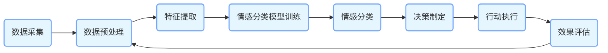

# AI Agent在企业品牌情感分析与管理中的深度应用

> 关键词：AI Agent、企业品牌、情感分析、品牌管理、自然语言处理、机器学习、数据分析

> 摘要：本文深入探讨了AI Agent在企业品牌情感分析与管理中的深度应用。随着市场竞争的加剧，企业对品牌的重视程度日益提高，了解消费者对品牌的情感态度对于企业的品牌建设和市场策略制定至关重要。AI Agent凭借其强大的自然语言处理和机器学习能力，能够高效、准确地分析消费者的情感倾向，为企业的品牌管理提供有力支持。文章详细介绍了AI Agent的核心概念、算法原理、数学模型，通过项目实战展示了其具体应用，探讨了实际应用场景，推荐了相关工具和资源，并对未来发展趋势与挑战进行了总结，旨在为企业更好地利用AI Agent进行品牌情感分析与管理提供全面的参考。

## 1. 背景介绍 
### 1.1 目的和范围
本文章的目的在于全面深入地阐述AI Agent在企业品牌情感分析与管理中的应用。通过对相关技术原理、操作步骤、实际案例等方面的详细介绍，帮助企业了解如何利用AI Agent来准确把握消费者对品牌的情感态度，从而制定更加有效的品牌管理策略。范围涵盖了AI Agent的基本概念、核心算法、数学模型，以及在不同行业的实际应用场景等，旨在为企业提供一套完整的关于AI Agent在品牌情感分析与管理中的知识体系和实践指导。

### 1.2 预期读者
本文预期读者主要包括企业的品牌管理人员、市场营销人员、数据分析师、AI技术爱好者以及相关领域的研究人员。对于品牌管理人员和市场营销人员，文章可以帮助他们了解如何利用AI Agent提升品牌管理效率和效果；数据分析师可以从技术实现的角度深入学习AI Agent的算法和模型；AI技术爱好者可以拓宽对AI应用领域的认识；研究人员则可以在已有研究的基础上进一步探索相关的理论和实践问题。

### 1.3 文档结构概述
本文首先介绍了相关的背景知识，包括目的、预期读者和文档结构概述等内容。接着阐述了AI Agent、品牌情感分析与管理的核心概念及其相互联系，并给出了相应的文本示意图和Mermaid流程图。然后详细讲解了AI Agent在品牌情感分析中的核心算法原理和具体操作步骤，包括Python源代码的实现。之后介绍了相关的数学模型和公式，并通过举例进行说明。通过项目实战展示了AI Agent在品牌情感分析与管理中的具体应用，包括开发环境搭建、源代码实现和代码解读。随后探讨了AI Agent在不同场景下的实际应用。推荐了学习资源、开发工具框架以及相关论文著作。最后总结了未来发展趋势与挑战，提供了常见问题与解答以及扩展阅读和参考资料。

### 1.4 术语表
#### 1.4.1 核心术语定义
- **AI Agent（人工智能智能体）**：是一种能够感知环境、自主决策并采取行动以实现特定目标的智能实体。在品牌情感分析与管理中，它可以自动收集、处理和分析与品牌相关的文本数据，以获取消费者的情感信息。
- **品牌情感分析**：是指通过对与品牌相关的文本数据（如社交媒体评论、客户反馈等）进行分析，识别出消费者对品牌的情感倾向，包括积极、消极和中性情感。
- **品牌管理**：是指企业通过一系列的策略和措施来塑造、维护和提升品牌形象，以实现品牌价值最大化的过程。

#### 1.4.2 相关概念解释
- **自然语言处理（NLP）**：是AI的一个重要领域，主要研究如何让计算机理解和处理人类语言。在品牌情感分析中，NLP技术用于对文本数据进行分词、词性标注、情感分类等处理。
- **机器学习（ML）**：是一门多领域交叉学科，涉及概率论、统计学、逼近论、凸分析、算法复杂度理论等多门学科。它专门研究计算机怎样模拟或实现人类的学习行为，以获取新的知识或技能，重新组织已有的知识结构使之不断改善自身的性能。在品牌情感分析中，机器学习算法用于训练情感分类模型。

#### 1.4.3 缩略词列表
- **NLP**：Natural Language Processing（自然语言处理）
- **ML**：Machine Learning（机器学习）
- **AI**：Artificial Intelligence（人工智能）

## 2. 核心概念与联系 
### 核心概念原理
#### AI Agent
AI Agent是一个具有感知、决策和行动能力的智能实体。它可以通过各种渠道收集与品牌相关的数据，如社交媒体平台、电商网站、客户反馈系统等。感知模块负责收集和预处理这些数据，将其转换为计算机可以处理的格式。决策模块利用机器学习和自然语言处理技术对数据进行分析，识别出消费者的情感倾向。行动模块则根据分析结果采取相应的措施，如向品牌管理人员发送预警信息、自动回复客户等。

#### 品牌情感分析
品牌情感分析的核心原理是通过对文本数据的语义理解和情感分类来确定消费者对品牌的情感态度。首先，需要对文本数据进行预处理，包括分词、去除停用词、词性标注等操作。然后，利用机器学习算法或深度学习模型对预处理后的数据进行训练，构建情感分类模型。最后，使用训练好的模型对新的文本数据进行情感分类，得到积极、消极或中性的情感标签。

#### 品牌管理
品牌管理的核心原理是通过制定和实施一系列的品牌策略来塑造、维护和提升品牌形象。品牌管理包括品牌定位、品牌传播、品牌维护等多个环节。在品牌情感分析的支持下，品牌管理人员可以及时了解消费者的需求和反馈，调整品牌策略，以提高品牌的市场竞争力。

### 架构的文本示意图
AI Agent在企业品牌情感分析与管理中的架构主要包括数据采集层、数据处理层、分析决策层和应用执行层。
- **数据采集层**：负责从各种渠道收集与品牌相关的数据，如社交媒体、电商平台、客户反馈系统等。
- **数据处理层**：对采集到的数据进行预处理，包括清洗、分词、去除停用词、词性标注等操作。
- **分析决策层**：利用机器学习和自然语言处理技术对预处理后的数据进行分析，识别消费者的情感倾向，并根据分析结果做出决策。
- **应用执行层**：根据决策结果采取相应的措施，如向品牌管理人员发送预警信息、自动回复客户、调整品牌策略等。

### Mermaid流程图

该流程图展示了AI Agent在品牌情感分析与管理中的工作流程。首先进行数据采集，然后对数据进行预处理和特征提取，接着训练情感分类模型并进行情感分类，根据分类结果制定决策并执行相应的行动，最后对行动效果进行评估，评估结果反馈到数据预处理环节，形成一个闭环的工作流程。

## 3. 核心算法原理 & 具体操作步骤 
### 核心算法原理
在品牌情感分析中，常用的算法包括朴素贝叶斯算法、支持向量机算法和深度学习算法等。这里以朴素贝叶斯算法为例进行详细讲解。

朴素贝叶斯算法是基于贝叶斯定理和特征条件独立假设的分类算法。贝叶斯定理的公式为：
$$P(c|x)=\frac{P(x|c)P(c)}{P(x)}$$
其中，$P(c|x)$ 表示在特征 $x$ 出现的条件下类别 $c$ 发生的概率，$P(x|c)$ 表示在类别 $c$ 发生的条件下特征 $x$ 出现的概率，$P(c)$ 表示类别 $c$ 发生的先验概率，$P(x)$ 表示特征 $x$ 出现的概率。

在朴素贝叶斯算法中，假设特征之间是相互独立的，即：
$$P(x|c)=\prod_{i=1}^{n}P(x_i|c)$$
其中，$x=(x_1,x_2,\cdots,x_n)$ 表示特征向量。

通过计算每个类别 $c$ 的后验概率 $P(c|x)$，选择后验概率最大的类别作为预测结果。

### 具体操作步骤
#### 数据准备
首先需要收集与品牌相关的文本数据，并将其分为训练集和测试集。训练集用于训练情感分类模型，测试集用于评估模型的性能。

#### 数据预处理
对文本数据进行预处理，包括以下步骤：
1. **分词**：将文本数据分割成单个的词语。
2. **去除停用词**：去除对情感分析没有帮助的常用词语，如“的”、“是”、“在”等。
3. **词性标注**：标注每个词语的词性，如名词、动词、形容词等。

#### 特征提取
从预处理后的文本数据中提取特征，常用的特征提取方法包括词袋模型和TF-IDF模型。

#### 模型训练
使用训练集数据对朴素贝叶斯分类器进行训练。

#### 模型评估
使用测试集数据对训练好的模型进行评估，常用的评估指标包括准确率、召回率、F1值等。

#### 预测
使用训练好的模型对新的文本数据进行情感分类预测。

### Python源代码实现
```python
import numpy as np
from sklearn.feature_extraction.text import CountVectorizer, TfidfTransformer
from sklearn.naive_bayes import MultinomialNB
from sklearn.model_selection import train_test_split
from sklearn.metrics import accuracy_score, recall_score, f1_score

# 示例数据
corpus = [
    "这个品牌的产品质量很好，我非常喜欢",
    "这个品牌的服务太差了，我很不满意",
    "这个品牌的设计很新颖，值得购买",
    "这个品牌的价格太高了，不划算"
]
labels = [1, 0, 1, 0]  # 1表示积极情感，0表示消极情感

# 划分训练集和测试集
X_train, X_test, y_train, y_test = train_test_split(corpus, labels, test_size=0.2, random_state=42)

# 特征提取
vectorizer = CountVectorizer()
X_train_counts = vectorizer.fit_transform(X_train)
tfidf_transformer = TfidfTransformer()
X_train_tfidf = tfidf_transformer.fit_transform(X_train_counts)

# 模型训练
clf = MultinomialNB().fit(X_train_tfidf, y_train)

# 模型评估
X_test_counts = vectorizer.transform(X_test)
X_test_tfidf = tfidf_transformer.transform(X_test_counts)
y_pred = clf.predict(X_test_tfidf)

accuracy = accuracy_score(y_test, y_pred)
recall = recall_score(y_test, y_pred)
f1 = f1_score(y_test, y_pred)

print(f"准确率: {accuracy}")
print(f"召回率: {recall}")
print(f"F1值: {f1}")

# 预测新数据
new_text = ["这个品牌的产品真的很棒"]
new_text_counts = vectorizer.transform(new_text)
new_text_tfidf = tfidf_transformer.transform(new_text_counts)
prediction = clf.predict(new_text_tfidf)
print(f"预测结果: {'积极' if prediction[0] == 1 else '消极'}")
```
### 代码解释
1. **数据准备**：定义了一个包含文本数据和对应情感标签的示例数据集，并将其划分为训练集和测试集。
2. **特征提取**：使用 `CountVectorizer` 将文本数据转换为词频矩阵，再使用 `TfidfTransformer` 将词频矩阵转换为TF-IDF矩阵。
3. **模型训练**：使用 `MultinomialNB` 训练朴素贝叶斯分类器。
4. **模型评估**：使用测试集数据对训练好的模型进行评估，计算准确率、召回率和F1值。
5. **预测**：对新的文本数据进行情感分类预测。

## 4. 数学模型和公式 & 详细讲解 & 举例说明 
### 贝叶斯定理
贝叶斯定理的公式为：
$$P(c|x)=\frac{P(x|c)P(c)}{P(x)}$$
详细讲解：
- $P(c|x)$：后验概率，表示在已知特征 $x$ 的情况下，类别 $c$ 发生的概率。
- $P(x|c)$：似然概率，表示在类别 $c$ 发生的情况下，特征 $x$ 出现的概率。
- $P(c)$：先验概率，表示类别 $c$ 发生的概率。
- $P(x)$：证据概率，表示特征 $x$ 出现的概率。

### 朴素贝叶斯算法的数学模型
在朴素贝叶斯算法中，假设特征之间是相互独立的，即：
$$P(x|c)=\prod_{i=1}^{n}P(x_i|c)$$
其中，$x=(x_1,x_2,\cdots,x_n)$ 表示特征向量。

### 举例说明
假设我们有一个品牌情感分析的数据集，包含以下文本和对应的情感标签：
| 文本 | 情感标签 |
| --- | --- |
| 这个品牌的产品质量很好 | 积极 |
| 这个品牌的服务太差了 | 消极 |
| 这个品牌的设计很新颖 | 积极 |
| 这个品牌的价格太高了 | 消极 |

我们要预测“这个品牌的产品真的很棒”的情感倾向。

#### 步骤1：计算先验概率
积极情感的先验概率 $P(积极)=\frac{2}{4}=0.5$
消极情感的先验概率 $P(消极)=\frac{2}{4}=0.5$

#### 步骤2：计算似然概率
假设我们使用词袋模型提取特征，“这个品牌的产品真的很棒” 对应的特征向量为 $x=(这个, 品牌, 产品, 真的, 很棒)$。

计算在积极情感下每个特征出现的概率：
$P(这个|积极)=\frac{2}{6}$
$P(品牌|积极)=\frac{2}{6}$
$P(产品|积极)=\frac{1}{6}$
$P(真的|积极)=\frac{0}{6}$
$P(很棒|积极)=\frac{1}{6}$

则 $P(x|积极)=P(这个|积极)P(品牌|积极)P(产品|积极)P(真的|积极)P(很棒|积极)=\frac{2}{6}\times\frac{2}{6}\times\frac{1}{6}\times0\times\frac{1}{6}=0$

计算在消极情感下每个特征出现的概率：
$P(这个|消极)=\frac{2}{6}$
$P(品牌|消极)=\frac{2}{6}$
$P(产品|消极)=\frac{0}{6}$
$P(真的|消极)=\frac{0}{6}$
$P(很棒|消极)=\frac{0}{6}$

则 $P(x|消极)=P(这个|消极)P(品牌|消极)P(产品|消极)P(真的|消极)P(很棒|消极)=\frac{2}{6}\times\frac{2}{6}\times0\times0\times0=0$

由于出现概率为0的情况，会导致整个似然概率为0，因此在实际应用中通常会使用拉普拉斯平滑来避免这种情况。

#### 步骤3：计算后验概率
使用拉普拉斯平滑后重新计算似然概率和后验概率，选择后验概率最大的类别作为预测结果。

## 5. 项目实战：代码实际案例和详细解释说明 
### 5.1  开发环境搭建
#### 安装Python
首先需要安装Python环境，建议使用Python 3.6及以上版本。可以从Python官方网站（https://www.python.org/downloads/） 下载并安装。

#### 安装必要的库
使用以下命令安装必要的Python库：
```sh
pip install numpy scikit-learn pandas matplotlib
```
- `numpy`：用于数值计算。
- `scikit-learn`：提供了机器学习算法和工具。
- `pandas`：用于数据处理和分析。
- `matplotlib`：用于数据可视化。

### 5.2  源代码详细实现和代码解读
```python
import pandas as pd
from sklearn.feature_extraction.text import TfidfVectorizer
from sklearn.model_selection import train_test_split
from sklearn.svm import SVC
from sklearn.metrics import classification_report, confusion_matrix
import matplotlib.pyplot as plt
import seaborn as sns

# 加载数据集
data = pd.read_csv('brand_sentiment_data.csv')

# 数据预处理
X = data['text']
y = data['sentiment']

# 划分训练集和测试集
X_train, X_test, y_train, y_test = train_test_split(X, y, test_size=0.2, random_state=42)

# 特征提取
vectorizer = TfidfVectorizer()
X_train_tfidf = vectorizer.fit_transform(X_train)
X_test_tfidf = vectorizer.transform(X_test)

# 模型训练
model = SVC()
model.fit(X_train_tfidf, y_train)

# 模型预测
y_pred = model.predict(X_test_tfidf)

# 模型评估
print(classification_report(y_test, y_pred))

# 绘制混淆矩阵
cm = confusion_matrix(y_test, y_pred)
sns.heatmap(cm, annot=True, fmt='d', cmap='Blues')
plt.xlabel('Predicted')
plt.ylabel('Actual')
plt.show()
```
### 代码解读与分析
1. **数据加载**：使用 `pandas` 库的 `read_csv` 函数加载包含品牌情感数据的CSV文件。
2. **数据预处理**：将文本数据和情感标签分别存储在 `X` 和 `y` 中。
3. **划分训练集和测试集**：使用 `train_test_split` 函数将数据集划分为训练集和测试集，测试集占比为20%。
4. **特征提取**：使用 `TfidfVectorizer` 将文本数据转换为TF-IDF矩阵。
5. **模型训练**：使用支持向量机（SVM）算法训练情感分类模型。
6. **模型预测**：使用训练好的模型对测试集数据进行预测。
7. **模型评估**：使用 `classification_report` 函数输出分类报告，包括准确率、召回率、F1值等评估指标。
8. **绘制混淆矩阵**：使用 `seaborn` 库的 `heatmap` 函数绘制混淆矩阵，直观地展示模型的预测结果。

## 6. 实际应用场景 
### 社交媒体监测
企业可以使用AI Agent实时监测社交媒体平台上与品牌相关的内容，分析消费者的情感倾向。例如，当发现大量负面评价时，及时采取措施进行危机公关，如回复消费者、改进产品或服务等。

### 客户反馈分析
通过对客户反馈系统中的文本数据进行分析，了解消费者对产品或服务的满意度和意见建议。企业可以根据分析结果优化产品设计、提升服务质量，以提高客户满意度和忠诚度。

### 市场调研
在市场调研中，AI Agent可以帮助企业快速收集和分析消费者对不同品牌的情感态度，了解市场需求和竞争态势。企业可以根据调研结果制定更有针对性的市场营销策略。

### 品牌形象管理
通过长期跟踪消费者对品牌的情感变化，企业可以及时调整品牌定位和传播策略，塑造和维护良好的品牌形象。例如，如果发现消费者对品牌的情感逐渐消极，企业可以通过改进产品、加强品牌宣传等方式来提升品牌形象。

## 7. 工具和资源推荐
### 7.1 学习资源推荐
#### 7.1.1 书籍推荐
- 《Python机器学习》：介绍了Python在机器学习中的应用，包括数据预处理、模型训练、评估等内容。
- 《自然语言处理入门》：系统地介绍了自然语言处理的基本概念、算法和应用。
- 《人工智能：一种现代的方法》：全面阐述了人工智能的各个领域，包括搜索、知识表示、推理、学习等。

#### 7.1.2 在线课程
- Coursera上的“机器学习”课程：由斯坦福大学教授Andrew Ng讲授，是机器学习领域的经典课程。
- edX上的“自然语言处理基础”课程：介绍了自然语言处理的基本原理和技术。
- 中国大学MOOC上的“人工智能导论”课程：对人工智能的基本概念、方法和应用进行了全面的介绍。

#### 7.1.3 技术博客和网站
- Medium：有很多关于AI、机器学习和自然语言处理的技术文章和案例分享。
- 机器之心：专注于人工智能领域的资讯和技术分享。
- 开源中国：提供了丰富的开源项目和技术文章。

### 7.2 开发工具框架推荐
#### 7.2.1 IDE和编辑器
- PyCharm：一款功能强大的Python集成开发环境，提供了代码编辑、调试、版本控制等功能。
- Jupyter Notebook：一种交互式的开发环境，适合进行数据探索和模型实验。
- Visual Studio Code：一款轻量级的代码编辑器，支持多种编程语言和插件扩展。

#### 7.2.2 调试和性能分析工具
- PySnooper：一个简单易用的Python调试工具，可以自动记录函数的执行过程和变量的值。
- cProfile：Python内置的性能分析工具，可以帮助开发者找出代码中的性能瓶颈。
- TensorBoard：用于可视化深度学习模型的训练过程和性能指标。

#### 7.2.3 相关框架和库
- Scikit-learn：提供了丰富的机器学习算法和工具，如分类、回归、聚类等。
- NLTK：自然语言处理工具包，包含了分词、词性标注、情感分析等功能。
- TensorFlow：一个开源的深度学习框架，可用于构建和训练各种深度学习模型。

### 7.3 相关论文著作推荐
#### 7.3.1 经典论文
- "A Sentimental Education: Sentiment Analysis Using Subjectivity Summarization Based on Minimum Cuts"：介绍了一种基于最小割的情感分析方法。
- "Natural Language Processing (Almost) from Scratch"：详细阐述了自然语言处理的基本原理和算法。
- "Support-Vector Networks"：提出了支持向量机算法，是机器学习领域的经典论文。

#### 7.3.2 最新研究成果
- 关注顶级学术会议如ACL（Association for Computational Linguistics）、EMNLP（Conference on Empirical Methods in Natural Language Processing）等上的最新研究成果。
- 查阅相关学术期刊如Journal of Artificial Intelligence Research、Artificial Intelligence等上的论文。

#### 7.3.3 应用案例分析
- 一些企业和研究机构会发布关于AI Agent在品牌情感分析与管理中的应用案例，可以通过相关企业官网、研究报告等渠道获取。

## 8. 总结：未来发展趋势与挑战
### 未来发展趋势
#### 多模态情感分析
未来的AI Agent将不仅仅局限于文本数据的情感分析，还将结合图像、语音等多模态数据进行综合分析，以更全面地了解消费者的情感态度。

#### 实时性和个性化
随着技术的不断发展，AI Agent将能够实现实时的情感分析和个性化的品牌管理。企业可以根据消费者的实时情感反馈及时调整品牌策略，为消费者提供个性化的服务和体验。

#### 与其他技术的融合
AI Agent将与区块链、物联网等技术进行融合，实现数据的安全共享和可信传输，进一步提升品牌情感分析与管理的效率和效果。

### 挑战
#### 数据质量和隐私问题
数据质量是影响情感分析准确性的关键因素，而数据隐私问题则是企业在收集和使用消费者数据时需要面对的重要挑战。如何在保证数据质量的同时保护消费者的隐私是未来需要解决的问题。

#### 语义理解的局限性
虽然自然语言处理技术取得了很大的进展，但在语义理解方面仍然存在一定的局限性。例如，对于一些具有歧义的文本、隐喻和讽刺等表达方式，AI Agent可能无法准确理解其情感倾向。

#### 技术的复杂性和成本
AI Agent的开发和应用需要涉及到多种技术，如机器学习、自然语言处理等，技术的复杂性较高。同时，购买计算资源、训练模型等也需要一定的成本，这对于一些中小企业来说可能是一个挑战。

## 9. 附录：常见问题与解答
### 问题1：AI Agent在品牌情感分析中的准确率有多高？
准确率受到多种因素的影响，如数据质量、算法选择、特征提取方法等。一般来说，在经过充分的数据预处理和模型调优后，准确率可以达到70% - 90%左右。

### 问题2：如何选择适合的情感分析算法？
选择适合的算法需要考虑数据特点、问题复杂度、计算资源等因素。对于小规模数据集和简单问题，可以选择朴素贝叶斯等传统算法；对于大规模数据集和复杂问题，可以考虑深度学习算法。

### 问题3：AI Agent能否处理不同语言的文本数据？
可以，只要对不同语言的数据进行相应的预处理和特征提取，选择合适的算法进行训练，AI Agent就可以处理不同语言的文本数据。

### 问题4：如何评估AI Agent在品牌情感分析中的性能？
常用的评估指标包括准确率、召回率、F1值、混淆矩阵等。可以使用这些指标来评估模型的性能，并根据评估结果进行模型调优。

## 10. 扩展阅读 & 参考资料
### 扩展阅读
- 《深度学习》：由Ian Goodfellow、Yoshua Bengio和Aaron Courville所著，深入介绍了深度学习的原理和应用。
- 《数据挖掘：概念与技术》：全面阐述了数据挖掘的基本概念、算法和应用。
- 《人工智能时代的企业变革》：探讨了人工智能对企业管理和运营的影响及应对策略。

### 参考资料
- 相关学术论文和研究报告。
- 各开源框架和库的官方文档。
- 企业发布的关于品牌情感分析与管理的案例和白皮书。