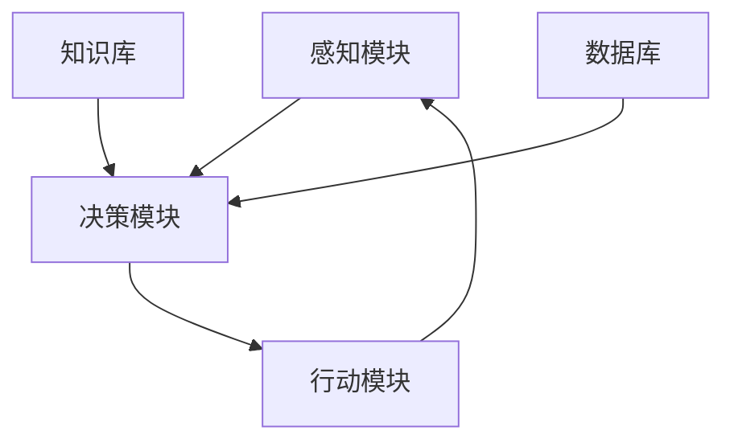

# AI Agent在企业文化建设与内部沟通中的应用

> 关键词：AI Agent、企业文化建设、内部沟通、智能助手、企业协作

> 摘要：本文深入探讨了AI Agent在企业文化建设与内部沟通中的应用。首先介绍了相关背景，包括目的、预期读者等内容。接着阐述了AI Agent的核心概念与联系，通过示意图和流程图直观展示其架构原理。详细讲解了核心算法原理及具体操作步骤，并辅以Python源代码说明。同时给出了相关数学模型和公式，并举例阐释。通过项目实战展示了代码实现及解读。分析了AI Agent在企业文化建设与内部沟通中的实际应用场景，推荐了学习、开发相关的工具和资源，最后总结了未来发展趋势与挑战，还提供了常见问题解答和扩展阅读参考资料，旨在为企业有效利用AI Agent提升文化建设和内部沟通水平提供全面而深入的指导。

## 1. 背景介绍 
### 1.1 目的和范围
随着信息技术的飞速发展，企业面临着日益激烈的市场竞争，企业文化建设和内部沟通的重要性愈发凸显。AI Agent作为一种新兴的智能技术，为企业在这两方面带来了新的机遇和解决方案。本文的目的在于深入研究AI Agent在企业文化建设与内部沟通中的应用，探讨其原理、方法和实际效果，为企业提供可操作的指导和建议。

研究范围涵盖了AI Agent的基本概念、核心算法、数学模型，以及在企业文化建设（如价值观传播、员工培训、企业形象塑造等）和内部沟通（如信息传递、协作交流、问题反馈等）各个环节的具体应用。同时，还会涉及相关的开发环境、工具资源和未来发展趋势等方面。

### 1.2 预期读者
本文预期读者主要包括企业管理者、人力资源专家、信息技术人员、企业文化工作者等。企业管理者可以从中了解如何利用AI Agent提升企业的文化软实力和内部协作效率；人力资源专家可以借鉴AI Agent在员工培训和激励方面的应用方法；信息技术人员能够深入学习AI Agent的技术原理和开发实践；企业文化工作者则可以获得更多创新的文化建设思路和工具。

### 1.3 文档结构概述
本文共分为十个部分。第一部分为背景介绍，阐述了研究的目的、预期读者和文档结构概述等内容；第二部分讲解核心概念与联系，包括AI Agent的原理和架构，通过文本示意图和Mermaid流程图进行展示；第三部分介绍核心算法原理及具体操作步骤，并使用Python源代码详细阐述；第四部分给出数学模型和公式，并详细讲解和举例说明；第五部分进行项目实战，包括开发环境搭建、源代码实现和代码解读；第六部分分析实际应用场景；第七部分推荐相关的工具和资源；第八部分总结未来发展趋势与挑战；第九部分为附录，提供常见问题与解答；第十部分给出扩展阅读和参考资料。

### 1.4 术语表
#### 1.4.1 核心术语定义
- **AI Agent（人工智能智能体）**：是一种能够感知环境、自主决策并采取行动以实现特定目标的智能实体。它可以基于人工智能技术，如机器学习、自然语言处理等，与用户进行交互，完成各种任务。
- **企业文化建设**：是指企业在一定的社会文化环境影响下，为了实现企业的战略目标，通过培养、塑造和传播企业的价值观、信念、行为规范等，形成独特的企业精神和文化氛围的过程。
- **内部沟通**：是指企业内部成员之间进行信息传递、交流和共享的过程，包括正式沟通和非正式沟通，其目的是提高工作效率、增强团队协作和凝聚力。

#### 1.4.2 相关概念解释
- **机器学习**：是一门多领域交叉学科，涉及概率论、统计学、逼近论、凸分析、算法复杂度理论等多门学科。它专门研究计算机怎样模拟或实现人类的学习行为，以获取新的知识或技能，重新组织已有的知识结构使之不断改善自身的性能。
- **自然语言处理**：是计算机科学领域与人工智能领域中的一个重要方向。它研究能实现人与计算机之间用自然语言进行有效通信的各种理论和方法，包括自然语言理解和自然语言生成等。

#### 1.4.3 缩略词列表
- **NLP**：Natural Language Processing（自然语言处理）
- **ML**：Machine Learning（机器学习）

## 2. 核心概念与联系 

### 2.1 AI Agent原理概述
AI Agent的基本原理是基于感知、决策和行动的循环过程。它通过各种传感器感知环境信息，然后根据预设的规则或通过机器学习算法进行决策，最后采取相应的行动来影响环境。例如，在企业内部沟通场景中，AI Agent可以感知员工的提问信息，通过自然语言处理技术理解问题的含义，然后根据知识库或预训练模型进行决策，生成合适的回答并反馈给员工。

### 2.2 AI Agent架构

#### 2.2.1 文本示意图
AI Agent的架构主要包括感知模块、决策模块和行动模块。感知模块负责收集环境信息，如用户的文本输入、语音信息等；决策模块对感知到的信息进行处理和分析，利用机器学习模型或规则引擎进行决策；行动模块根据决策结果采取相应的行动，如生成文本回复、执行任务等。同时，AI Agent还可以与知识库、数据库等进行交互，获取必要的信息来支持决策和行动。

#### 2.2.2 Mermaid流程图


### 2.3 AI Agent与企业文化建设和内部沟通的联系
AI Agent在企业文化建设和内部沟通中具有重要的联系。在企业文化建设方面，AI Agent可以作为企业文化的传播者，通过智能问答、培训课程推送等方式向员工传递企业的价值观、使命和愿景等文化信息。在内部沟通方面，AI Agent可以作为智能助手，帮助员工快速获取信息、解决问题，促进信息的流通和共享，提高沟通效率。

## 3. 核心算法原理 & 具体操作步骤 

### 3.1 核心算法原理
AI Agent的核心算法主要涉及自然语言处理和机器学习算法。在自然语言处理方面，常用的算法包括词法分析、句法分析、语义理解等。在机器学习方面，常用的算法包括决策树、神经网络、支持向量机等。

以自然语言理解为例，其基本原理是将用户输入的文本进行分词、词性标注、命名实体识别等处理，然后将处理后的文本表示为向量形式，再通过机器学习模型进行分类或回归分析，以理解文本的含义。

### 3.2 具体操作步骤

#### 3.2.1 数据预处理
首先，需要对训练数据进行预处理，包括数据清洗、分词、标注等操作。以下是一个使用Python的示例代码：
```python
import re
import jieba

def clean_text(text):
    # 去除特殊字符
    text = re.sub(r'[^\w\s]', '', text)
    return text

def tokenize_text(text):
    # 分词
    tokens = jieba.lcut(text)
    return tokens

# 示例文本
text = "AI Agent在企业文化建设中非常重要！"
cleaned_text = clean_text(text)
tokens = tokenize_text(cleaned_text)
print(tokens)
```
#### 3.2.2 特征提取
将预处理后的文本转换为特征向量，常用的方法包括词袋模型、TF-IDF等。以下是一个使用TF-IDF的示例代码：
```python
from sklearn.feature_extraction.text import TfidfVectorizer

corpus = ["AI Agent在企业文化建设中非常重要", "内部沟通是企业发展的关键"]
vectorizer = TfidfVectorizer()
X = vectorizer.fit_transform(corpus)
print(X.toarray())
```
#### 3.2.3 模型训练
选择合适的机器学习模型进行训练，如朴素贝叶斯分类器。以下是一个示例代码：
```python
from sklearn.naive_bayes import MultinomialNB
from sklearn.model_selection import train_test_split

# 假设已经有了特征矩阵X和对应的标签y
X_train, X_test, y_train, y_test = train_test_split(X, y, test_size=0.2, random_state=42)
clf = MultinomialNB()
clf.fit(X_train, y_train)
```
#### 3.2.4 模型评估
使用测试数据对训练好的模型进行评估，常用的评估指标包括准确率、召回率、F1值等。以下是一个示例代码：
```python
from sklearn.metrics import accuracy_score, recall_score, f1_score

y_pred = clf.predict(X_test)
accuracy = accuracy_score(y_test, y_pred)
recall = recall_score(y_test, y_pred, average='weighted')
f1 = f1_score(y_test, y_pred, average='weighted')
print(f"Accuracy: {accuracy}, Recall: {recall}, F1: {f1}")
```
#### 3.2.5 模型部署
将训练好的模型部署到实际应用中，让AI Agent可以使用该模型进行自然语言理解和决策。

## 4. 数学模型和公式 & 详细讲解 & 举例说明 

### 4.1 词袋模型
词袋模型是一种简单的文本表示方法，它将文本看作是一个无序的词集合。假设一个文本集合 $D = \{d_1, d_2, \cdots, d_n\}$，其中 $d_i$ 表示第 $i$ 个文本。词汇表 $V = \{w_1, w_2, \cdots, w_m\}$ 包含了所有文本中出现的不同词汇。对于每个文本 $d_i$，可以用一个向量 $\mathbf{x}_i = (x_{i1}, x_{i2}, \cdots, x_{im})$ 表示，其中 $x_{ij}$ 表示词汇 $w_j$ 在文本 $d_i$ 中出现的次数。

例如，有两个文本：$d_1 =$ "AI Agent在企业文化建设中非常重要"，$d_2 =$ "内部沟通是企业发展的关键"。词汇表 $V = \{"AI", "Agent", "企业文化建设", "内部沟通", "企业发展", "关键", "重要"\}$。则 $d_1$ 的词袋向量为 $\mathbf{x}_1 = (1, 1, 1, 0, 0, 0, 1)$，$d_2$ 的词袋向量为 $\mathbf{x}_2 = (0, 0, 0, 1, 1, 1, 0)$。

### 4.2 TF-IDF
TF-IDF（Term Frequency-Inverse Document Frequency）是一种常用的文本特征提取方法，它综合考虑了词频（TF）和逆文档频率（IDF）。

词频 $TF_{t,d}$ 表示词 $t$ 在文档 $d$ 中出现的频率，计算公式为：
$$TF_{t,d} = \frac{count(t, d)}{|d|}$$
其中 $count(t, d)$ 表示词 $t$ 在文档 $d$ 中出现的次数，$|d|$ 表示文档 $d$ 的总词数。

逆文档频率 $IDF_t$ 表示词 $t$ 在整个文档集合中的稀有程度，计算公式为：
$$IDF_t = \log\frac{N}{df_t}$$
其中 $N$ 表示文档集合中的文档总数，$df_t$ 表示包含词 $t$ 的文档数。

TF-IDF值 $TF - IDF_{t,d}$ 为词频和逆文档频率的乘积，计算公式为：
$$TF - IDF_{t,d} = TF_{t,d} \times IDF_t$$

例如，在一个包含100个文档的集合中，词 "AI" 在文档 $d_1$ 中出现了3次，文档 $d_1$ 总共有100个词，且有20个文档包含词 "AI"。则 $TF_{AI,d_1} = \frac{3}{100} = 0.03$，$IDF_{AI} = \log\frac{100}{20} \approx 0.693$，$TF - IDF_{AI,d_1} = 0.03 \times 0.693 \approx 0.021$。

### 4.3 朴素贝叶斯分类器
朴素贝叶斯分类器是一种基于贝叶斯定理的简单概率分类器，假设特征之间相互独立。对于一个文本分类问题，给定一个文本 $x = (x_1, x_2, \cdots, x_n)$ 和类别集合 $C = \{c_1, c_2, \cdots, c_k\}$，朴素贝叶斯分类器的目标是找到概率最大的类别 $c^*$，即：
$$c^* = \arg\max_{c \in C} P(c|x)$$
根据贝叶斯定理，$P(c|x) = \frac{P(x|c)P(c)}{P(x)}$。由于 $P(x)$ 对于所有类别都是相同的，所以可以忽略，只需要计算 $P(x|c)P(c)$。

假设特征 $x_i$ 相互独立，则 $P(x|c) = \prod_{i = 1}^{n} P(x_i|c)$。$P(c)$ 可以通过训练数据中类别 $c$ 的出现频率估计，$P(x_i|c)$ 可以通过在类别 $c$ 的训练数据中特征 $x_i$ 的出现频率估计。

例如，有一个文本分类问题，类别为 "企业文化建设" 和 "内部沟通"。对于一个新的文本 $x$，计算 $P(\text{企业文化建设}|x)$ 和 $P(\text{内部沟通}|x)$，然后选择概率较大的类别作为分类结果。

## 5. 项目实战：代码实际案例和详细解释说明 

### 5.1  开发环境搭建
#### 5.1.1 安装Python
首先，需要安装Python环境，建议使用Python 3.7及以上版本。可以从Python官方网站（https://www.python.org/downloads/）下载并安装。

#### 5.1.2 安装依赖库
使用pip安装所需的依赖库，如jieba、scikit-learn等。可以使用以下命令进行安装：
```sh
pip install jieba scikit-learn
```

### 5.2  源代码详细实现和代码解读

#### 5.2.1 数据准备
假设我们有一个包含企业文化建设和内部沟通相关文本的数据集，每个文本都有对应的标签。以下是一个简单的示例数据集：
```python
corpus = [
    ("AI Agent在企业文化建设中发挥着重要作用", "企业文化建设"),
    ("内部沟通有助于提高团队协作效率", "内部沟通"),
    ("企业价值观是企业文化的核心", "企业文化建设"),
    ("及时的信息传递是内部沟通的关键", "内部沟通")
]

X = [text for text, label in corpus]
y = [label for text, label in corpus]
```
#### 5.2.2 数据预处理
使用前面介绍的方法对数据进行预处理，包括数据清洗和分词。
```python
import re
import jieba

def clean_text(text):
    text = re.sub(r'[^\w\s]', '', text)
    return text

def tokenize_text(text):
    tokens = jieba.lcut(text)
    return tokens

X_cleaned = [clean_text(text) for text in X]
X_tokenized = [tokenize_text(text) for text in X_cleaned]
```
#### 5.2.3 特征提取
使用TF-IDF进行特征提取。
```python
from sklearn.feature_extraction.text import TfidfVectorizer

vectorizer = TfidfVectorizer(tokenizer=lambda x: x)
X_features = vectorizer.fit_transform(X_tokenized)
```
#### 5.2.4 模型训练
使用朴素贝叶斯分类器进行训练。
```python
from sklearn.naive_bayes import MultinomialNB
from sklearn.model_selection import train_test_split

X_train, X_test, y_train, y_test = train_test_split(X_features, y, test_size=0.2, random_state=42)
clf = MultinomialNB()
clf.fit(X_train, y_train)
```
#### 5.2.5 模型评估
使用测试数据对模型进行评估。
```python
from sklearn.metrics import accuracy_score

y_pred = clf.predict(X_test)
accuracy = accuracy_score(y_test, y_pred)
print(f"Accuracy: {accuracy}")
```
#### 5.2.6 模型应用
使用训练好的模型对新的文本进行分类。
```python
new_text = "AI Agent可以促进内部沟通"
new_text_cleaned = clean_text(new_text)
new_text_tokenized = tokenize_text(new_text_cleaned)
new_text_features = vectorizer.transform([new_text_tokenized])
predicted_label = clf.predict(new_text_features)
print(f"Predicted label: {predicted_label[0]}")
```

### 5.3  代码解读与分析
- **数据准备**：将数据集分为文本和标签两部分，方便后续处理。
- **数据预处理**：使用正则表达式去除特殊字符，然后使用jieba进行分词，将文本转换为适合特征提取的形式。
- **特征提取**：使用TF-IDF将文本转换为特征向量，以便机器学习模型进行处理。
- **模型训练**：使用朴素贝叶斯分类器对训练数据进行训练，学习文本特征和标签之间的关系。
- **模型评估**：使用测试数据对训练好的模型进行评估，计算准确率等指标，评估模型的性能。
- **模型应用**：使用训练好的模型对新的文本进行分类，预测其所属的类别。

## 6. 实际应用场景 
### 6.1 企业文化传播
AI Agent可以作为企业文化的传播使者，通过企业内部的聊天机器人、智能助手等渠道，向员工推送企业的价值观、使命、愿景等文化信息。例如，员工可以随时向AI Agent询问企业文化相关的问题，AI Agent会根据知识库中的内容进行准确的回答。同时，AI Agent还可以定期推送企业文化相关的文章、案例等，帮助员工深入理解和认同企业文化。

### 6.2 员工培训与学习
在员工培训方面，AI Agent可以根据员工的岗位需求和学习进度，为其推荐个性化的培训课程和学习资料。例如，新员工入职时，AI Agent可以为其提供新员工培训课程，包括企业文化、规章制度、业务流程等方面的内容。在员工日常工作中，AI Agent可以根据员工遇到的问题，提供相关的知识解答和学习建议，帮助员工不断提升自身能力。

### 6.3 内部沟通与协作
AI Agent可以在企业内部沟通中发挥重要作用。它可以作为智能助手，帮助员工快速获取信息。例如，员工可以通过AI Agent查询公司的组织结构、人员信息、会议安排等。在团队协作方面，AI Agent可以促进信息的流通和共享，提醒团队成员任务进度、截止日期等信息，提高团队协作效率。

### 6.4 员工反馈与问题解决
员工可以通过AI Agent反馈工作中遇到的问题、提出建议和意见。AI Agent可以对员工的反馈进行分类和整理，及时将问题传递给相关部门和人员，并跟踪问题的解决进度，向员工反馈处理结果。这样可以提高员工的参与感和满意度，促进企业的持续改进。

## 7. 工具和资源推荐
### 7.1 学习资源推荐
#### 7.1.1 书籍推荐
- 《人工智能：一种现代的方法》：全面介绍了人工智能的基本概念、算法和应用，是学习人工智能的经典教材。
- 《Python自然语言处理》：详细讲解了Python在自然语言处理中的应用，包括文本处理、机器学习、深度学习等方面的内容。
- 《机器学习》：由周志华教授编写，系统地介绍了机器学习的基本理论和算法，是学习机器学习的优秀书籍。

#### 7.1.2 在线课程
- Coursera上的“机器学习”课程：由Andrew Ng教授授课，是学习机器学习的经典在线课程，涵盖了机器学习的基本概念、算法和应用。
- edX上的“人工智能基础”课程：全面介绍了人工智能的基本概念、算法和应用，适合初学者学习。
- 中国大学MOOC上的“自然语言处理”课程：由国内知名高校的教授授课，详细讲解了自然语言处理的基本理论和技术。

#### 7.1.3 技术博客和网站
- Medium：是一个技术博客平台，上面有很多关于人工智能、机器学习、自然语言处理等方面的优秀文章。
- 开源中国：提供了丰富的技术文章和开源项目，是了解和学习人工智能技术的重要资源。
- 机器之心：专注于人工智能领域的资讯和技术报道，提供了很多前沿的技术信息和案例分析。

### 7.2 开发工具框架推荐
#### 7.2.1 IDE和编辑器
- PyCharm：是一款专门为Python开发设计的集成开发环境，具有强大的代码编辑、调试、自动完成等功能，适合Python开发者使用。
- Visual Studio Code：是一款轻量级的代码编辑器，支持多种编程语言，具有丰富的插件生态系统，可以方便地进行Python开发。
- Jupyter Notebook：是一个交互式的开发环境，适合进行数据探索、模型训练和可视化等工作，在人工智能和机器学习领域广泛使用。

#### 7.2.2 调试和性能分析工具
- pdb：是Python自带的调试器，可以帮助开发者在代码中设置断点、单步执行等，方便调试代码。
- cProfile：是Python的性能分析工具，可以分析代码的执行时间和函数调用关系，帮助开发者优化代码性能。
- TensorBoard：是TensorFlow的可视化工具，可以帮助开发者可视化模型训练过程、损失函数曲线等，方便进行模型调优。

#### 7.2.3 相关框架和库
- scikit-learn：是一个简单易用的机器学习库，提供了丰富的机器学习算法和工具，适合初学者和快速开发。
- TensorFlow：是一个开源的深度学习框架，由Google开发，具有强大的计算能力和分布式训练功能，广泛应用于各种深度学习任务。
- PyTorch：是另一个流行的深度学习框架，具有动态图机制，易于使用和调试，在学术界和工业界都有广泛的应用。

### 7.3 相关论文著作推荐
#### 7.3.1 经典论文
- “A Logical Calculus of the Ideas Immanent in Nervous Activity”：由Warren S. McCulloch和Walter Pitts发表，是神经网络领域的经典论文，提出了神经元模型。
- “A Mathematical Theory of Communication”：由Claude E. Shannon发表，是信息论领域的奠基性论文，为自然语言处理等领域提供了理论基础。
- “Learning Representations by Back-propagating Errors”：由David E. Rumelhart、Geoffrey E. Hinton和Ronald J. Williams发表，介绍了反向传播算法，推动了神经网络的发展。

#### 7.3.2 最新研究成果
- 在arXiv等预印本平台上可以找到很多关于AI Agent、自然语言处理、机器学习等领域的最新研究成果。关注这些研究成果可以了解到该领域的前沿技术和发展趋势。

#### 7.3.3 应用案例分析
- 一些知名企业的技术博客和研究报告中会分享AI Agent在企业文化建设和内部沟通等方面的应用案例。例如，谷歌、微软等公司的技术博客会介绍他们在智能助手、企业协作等方面的实践经验，可以从中学习到实际应用中的技巧和方法。

## 8. 总结：未来发展趋势与挑战
### 8.1 未来发展趋势
- **更加智能化**：AI Agent将不断融合更先进的人工智能技术，如深度学习、强化学习等，提高其智能水平和决策能力。例如，能够更好地理解员工的意图和情感，提供更加个性化的服务。
- **多模态交互**：除了文本交互，AI Agent将支持语音、图像、视频等多模态交互方式，为员工提供更加便捷和自然的交互体验。例如，员工可以通过语音与AI Agent进行沟通，或者上传图像让AI Agent进行分析。
- **与企业系统深度集成**：AI Agent将与企业的各种信息系统，如ERP、CRM、OA等进行深度集成，实现数据的共享和业务流程的自动化。例如，AI Agent可以直接从ERP系统中获取业务数据，为员工提供实时的业务支持。
- **跨企业协作**：未来，AI Agent可能会支持跨企业的协作和沟通，促进企业之间的合作和资源共享。例如，不同企业的员工可以通过AI Agent进行交流和协作，共同完成项目。

### 8.2 挑战
- **数据隐私和安全**：AI Agent在使用过程中会处理大量的员工信息和企业数据，数据隐私和安全是一个重要的挑战。企业需要采取有效的措施，如数据加密、访问控制等，确保数据的安全。
- **技术复杂度**：AI Agent涉及到多种人工智能技术，技术复杂度较高。企业需要具备专业的技术人才和研发能力，才能开发和维护高质量的AI Agent。
- **员工接受度**：员工对AI Agent的接受度也是一个挑战。部分员工可能对新技术存在抵触情绪，需要企业进行有效的培训和宣传，提高员工对AI Agent的认识和使用意愿。
- **伦理和法律问题**：AI Agent的决策和行为可能会涉及到伦理和法律问题，如偏见、歧视等。企业需要制定相应的伦理准则和法律规范，确保AI Agent的行为符合道德和法律要求。

## 9. 附录：常见问题与解答
### 9.1 AI Agent在企业文化建设中的效果如何评估？
可以从多个方面进行评估，如员工对企业文化的认知度、认同感、参与度等。可以通过问卷调查、员工访谈等方式收集数据，然后分析数据来评估AI Agent在企业文化建设中的效果。例如，对比使用AI Agent前后员工对企业文化相关问题的回答正确率，以及员工参与企业文化活动的积极性等。

### 9.2 AI Agent会取代人类在企业文化建设和内部沟通中的作用吗？
不会。AI Agent可以作为人类的辅助工具，提高企业文化建设和内部沟通的效率和质量。但人类在情感交流、价值观传递、团队协作等方面具有不可替代的作用。AI Agent和人类可以相互补充，共同促进企业文化建设和内部沟通的发展。

### 9.3 如何确保AI Agent的回答准确和可靠？
可以通过以下几种方式确保AI Agent的回答准确和可靠：一是建立完善的知识库，确保知识库中的信息准确、全面；二是对AI Agent进行持续的训练和优化，提高其自然语言理解和决策能力；三是设置人工审核机制，对AI Agent的回答进行审核和修正。

### 9.4 AI Agent的开发成本高吗？
AI Agent的开发成本取决于多个因素，如开发的功能复杂度、使用的技术、数据量等。对于一些简单的AI Agent，开发成本相对较低；而对于功能复杂、需要大量数据和先进技术支持的AI Agent，开发成本可能较高。企业可以根据自身需求和预算，选择合适的开发方式和技术方案。

## 10. 扩展阅读 & 参考资料
### 10.1 扩展阅读
- 《智能时代》：吴军著，探讨了人工智能对社会和经济的影响，以及未来的发展趋势。
- 《未来简史：从智人到神人》：尤瓦尔·赫拉利著，从宏观的角度探讨了人类的未来发展，其中涉及到人工智能等技术对人类社会的影响。

### 10.2 参考资料
- 相关的学术论文、研究报告、技术文档等，如ACM、IEEE等学术期刊上的论文。
- 企业的官方网站、技术博客等，如谷歌、微软、亚马逊等公司的技术文档和博客文章。