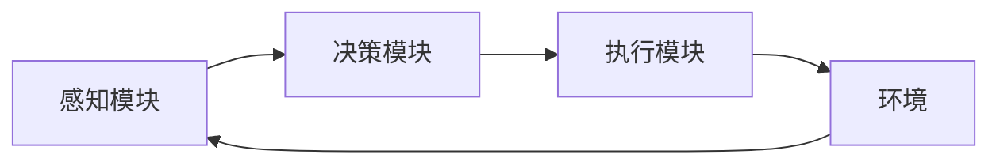
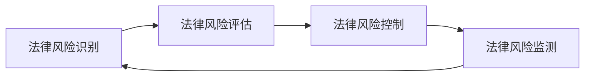

# AI Agent在企业法律风险管理中的应用

> 关键词：AI Agent、企业法律风险管理、智能合约、合规监测、法律知识图谱

> 摘要：本文深入探讨了AI Agent在企业法律风险管理中的应用。首先介绍了相关背景，包括目的范围、预期读者等。接着阐述了AI Agent和企业法律风险管理的核心概念及联系，详细讲解了核心算法原理与操作步骤，并结合数学模型和公式进行说明。通过项目实战展示了具体代码实现和解读。分析了AI Agent在企业法律风险管理中的实际应用场景，推荐了相关的工具和资源。最后总结了未来发展趋势与挑战，还提供了常见问题解答和扩展阅读参考资料，旨在为企业有效利用AI Agent进行法律风险管理提供全面的技术指导和理论支持。

## 1. 背景介绍 
### 1.1 目的和范围
随着企业经营环境的日益复杂，法律风险已成为企业面临的重要挑战之一。传统的企业法律风险管理方式往往依赖人工，效率低下且容易出现疏漏。AI Agent作为一种具有自主决策和执行能力的智能实体，为企业法律风险管理带来了新的机遇。本文的目的在于探讨AI Agent在企业法律风险管理中的具体应用，包括如何利用AI Agent进行法律合规监测、合同审查、法律知识检索等。范围涵盖了AI Agent的技术原理、应用场景、实际案例以及未来发展趋势等方面。

### 1.2 预期读者
本文预期读者主要包括企业的法律部门工作人员、风险管理专家、IT技术人员以及对AI在法律领域应用感兴趣的研究人员。企业法律部门工作人员可以通过本文了解如何借助AI Agent提升法律风险管理的效率和准确性；风险管理专家能够从中获取关于AI Agent在法律风险评估和控制方面的新思路；IT技术人员可以学习到AI Agent的相关技术实现和开发方法；研究人员则可以为进一步的学术研究提供参考。

### 1.3 文档结构概述
本文共分为十个部分。第一部分为背景介绍，阐述了文章的目的、范围、预期读者和文档结构。第二部分介绍核心概念与联系，包括AI Agent和企业法律风险管理的基本概念以及它们之间的关系。第三部分讲解核心算法原理和具体操作步骤，通过Python代码详细阐述。第四部分介绍数学模型和公式，并举例说明。第五部分进行项目实战，包括开发环境搭建、源代码实现和代码解读。第六部分分析实际应用场景。第七部分推荐相关的工具和资源，包括学习资源、开发工具框架和论文著作。第八部分总结未来发展趋势与挑战。第九部分为附录，解答常见问题。第十部分提供扩展阅读和参考资料。

### 1.4 术语表
#### 1.4.1 核心术语定义
- **AI Agent**：一种能够感知环境、自主决策并执行相应动作的智能实体，它可以根据预设的规则和目标，自动完成一系列任务。
- **企业法律风险管理**：企业通过识别、评估、控制和监测等一系列活动，对可能面临的法律风险进行有效管理，以降低法律风险对企业造成的损失。
- **法律知识图谱**：一种以图结构形式表示法律知识的语义网络，它将法律概念、条文、案例等信息进行关联和整合，便于知识的检索和推理。
- **智能合约**：一种基于区块链技术的自动化合约，它可以在满足预设条件时自动执行，具有不可篡改、透明等特点。

#### 1.4.2 相关概念解释
- **自然语言处理（NLP）**：是AI领域的一个重要分支，主要研究如何让计算机理解和处理人类语言。在企业法律风险管理中，NLP技术可以用于法律文本的分析、理解和生成。
- **机器学习（ML）**：是一种让计算机通过数据学习模式和规律的技术。在法律风险管理中，ML可以用于法律风险的预测和分类。
- **区块链技术**：是一种分布式账本技术，具有去中心化、不可篡改等特点。在智能合约中，区块链技术可以保证合约的安全性和执行的可靠性。

#### 1.4.3 缩略词列表
- **AI**：Artificial Intelligence（人工智能）
- **NLP**：Natural Language Processing（自然语言处理）
- **ML**：Machine Learning（机器学习）
- **KG**：Knowledge Graph（知识图谱）
- **SC**：Smart Contract（智能合约）

## 2. 核心概念与联系 

### 2.1 AI Agent的概念和原理
AI Agent是人工智能领域中的一个重要概念，它可以看作是一个具有自主性、反应性、社会性和能动性的智能实体。自主性是指AI Agent能够在没有人类干预的情况下自主地感知环境、做出决策并执行相应的动作；反应性表示AI Agent能够及时对环境中的变化做出反应；社会性意味着AI Agent可以与其他Agent或人类进行交互；能动性则强调AI Agent具有明确的目标，并能够为实现这些目标而采取行动。

AI Agent的基本架构通常包括感知模块、决策模块和执行模块。感知模块用于收集环境信息，决策模块根据感知到的信息和预设的规则或目标进行决策，执行模块则负责执行决策模块产生的动作。以下是一个简单的AI Agent架构示意图：



### 2.2 企业法律风险管理的概念和流程
企业法律风险管理是企业管理的重要组成部分，它的主要目标是识别、评估、控制和监测企业面临的法律风险，以保障企业的合法合规运营。企业法律风险管理的流程通常包括以下几个步骤：
1. **法律风险识别**：通过对企业的业务活动、合同、法律法规等进行全面的审查和分析，识别可能存在的法律风险。
2. **法律风险评估**：对识别出的法律风险进行评估，确定其发生的可能性和影响程度。
3. **法律风险控制**：根据风险评估的结果，采取相应的措施来控制法律风险，如制定合规制度、修改合同条款等。
4. **法律风险监测**：对企业的法律风险状况进行持续的监测，及时发现新的风险并采取相应的措施。

以下是企业法律风险管理流程的Mermaid流程图：



### 2.3 AI Agent与企业法律风险管理的联系
AI Agent在企业法律风险管理中具有重要的应用价值。它可以通过感知模块收集企业的法律信息，如合同文本、法律法规更新等；决策模块可以利用这些信息进行法律风险的分析和评估，并制定相应的应对策略；执行模块可以自动执行决策模块产生的动作，如发送合规提醒、修改合同条款等。

具体来说，AI Agent可以在以下几个方面为企业法律风险管理提供支持：
- **法律合规监测**：AI Agent可以实时监测企业的业务活动是否符合法律法规的要求，及时发现潜在的合规风险。
- **合同审查**：AI Agent可以自动审查合同文本，识别其中的法律风险条款，并提供修改建议。
- **法律知识检索**：AI Agent可以利用法律知识图谱，快速准确地检索相关的法律知识和案例，为企业的法律决策提供支持。
- **智能合约执行**：AI Agent可以参与智能合约的执行，确保合约的自动履行和合规性。

## 3. 核心算法原理 & 具体操作步骤 

### 3.1 自然语言处理算法在法律文本分析中的应用
在企业法律风险管理中，自然语言处理（NLP）算法是AI Agent处理法律文本的重要工具。以下是一些常用的NLP算法及其在法律文本分析中的应用：

#### 3.1.1 词法分析
词法分析是NLP的基础步骤，它的主要任务是将文本分割成单词或词组，并标注每个单词的词性。在法律文本分析中，词法分析可以帮助AI Agent理解法律条文和合同文本的基本语义。以下是一个使用Python的`jieba`库进行词法分析的示例代码：

```python
import jieba

text = "根据《中华人民共和国合同法》的规定，合同双方应当履行各自的义务。"
words = jieba.lcut(text)
print(words)
```

#### 3.1.2 句法分析
句法分析的目的是分析句子的语法结构，确定单词之间的关系。在法律文本分析中，句法分析可以帮助AI Agent理解法律条文的逻辑关系。以下是一个使用`stanfordcorenlp`库进行句法分析的示例代码：

```python
from stanfordcorenlp import StanfordCoreNLP

nlp = StanfordCoreNLP(r'stanford-corenlp-full-2018-10-05')
text = "根据《中华人民共和国合同法》的规定，合同双方应当履行各自的义务。"
parse_tree = nlp.parse(text)
print(parse_tree)
nlp.close()
```

#### 3.1.3 语义分析
语义分析是NLP的高级阶段，它的任务是理解文本的语义信息。在法律文本分析中，语义分析可以帮助AI Agent识别法律概念、判断法律关系等。以下是一个使用`spaCy`库进行语义分析的示例代码：

```python
import spacy

nlp = spacy.load('zh_core_web_sm')
text = "根据《中华人民共和国合同法》的规定，合同双方应当履行各自的义务。"
doc = nlp(text)
for token in doc:
    print(token.text, token.pos_, token.dep_)
```

### 3.2 机器学习算法在法律风险评估中的应用
机器学习算法可以用于企业法律风险的评估和预测。以下是一些常用的机器学习算法及其在法律风险评估中的应用：

#### 3.2.1 逻辑回归
逻辑回归是一种常用的分类算法，它可以用于判断法律风险的发生概率。以下是一个使用Python的`sklearn`库进行逻辑回归的示例代码：

```python
from sklearn.linear_model import LogisticRegression
from sklearn.datasets import make_classification
from sklearn.model_selection import train_test_split

# 生成示例数据
X, y = make_classification(n_samples=1000, n_features=10, n_informative=5, n_redundant=0, random_state=42)
X_train, X_test, y_train, y_test = train_test_split(X, y, test_size=0.2, random_state=42)

# 创建逻辑回归模型
model = LogisticRegression()
model.fit(X_train, y_train)

# 预测
y_pred = model.predict(X_test)
print(y_pred)
```

#### 3.2.2 决策树
决策树是一种基于树结构进行决策的机器学习算法，它可以用于法律风险的分类和预测。以下是一个使用Python的`sklearn`库进行决策树分类的示例代码：

```python
from sklearn.tree import DecisionTreeClassifier
from sklearn.datasets import make_classification
from sklearn.model_selection import train_test_split

# 生成示例数据
X, y = make_classification(n_samples=1000, n_features=10, n_informative=5, n_redundant=0, random_state=42)
X_train, X_test, y_train, y_test = train_test_split(X, y, test_size=0.2, random_state=42)

# 创建决策树模型
model = DecisionTreeClassifier()
model.fit(X_train, y_train)

# 预测
y_pred = model.predict(X_test)
print(y_pred)
```

### 3.3 AI Agent的具体操作步骤
#### 3.3.1 数据收集
AI Agent首先需要收集企业的法律相关数据，包括合同文本、法律法规、案例等。这些数据可以从企业内部的数据库、法律网站、新闻媒体等渠道获取。

#### 3.3.2 数据预处理
收集到的数据通常需要进行预处理，包括清洗、标注、分词等操作。预处理的目的是提高数据的质量，以便后续的分析和处理。

#### 3.3.3 模型训练
使用预处理后的数据对机器学习模型进行训练，如逻辑回归、决策树等。训练的过程是让模型学习数据中的模式和规律，以便能够对新的数据进行预测和分类。

#### 3.3.4 风险评估和决策
使用训练好的模型对企业的法律风险进行评估，根据评估结果做出相应的决策。例如，如果评估结果显示某个合同存在较高的法律风险，AI Agent可以建议企业修改合同条款或终止合作。

#### 3.3.5 执行和反馈
根据决策结果，AI Agent执行相应的动作，如发送合规提醒、修改合同条款等。同时，AI Agent还需要对执行结果进行反馈，以便不断优化模型和决策策略。

## 4. 数学模型和公式 & 详细讲解 & 举例说明 

### 4.1 逻辑回归模型
逻辑回归是一种常用的分类模型，它的基本原理是通过对输入特征进行线性组合，然后通过逻辑函数将线性组合的结果映射到[0, 1]区间，从而得到分类的概率。

逻辑回归的数学模型可以表示为：

$$P(y=1|x)=\frac{1}{1+e^{-(w_0 + w_1x_1 + w_2x_2 + \cdots + w_nx_n)}}$$

其中，$P(y=1|x)$ 表示在输入特征 $x=(x_1, x_2, \cdots, x_n)$ 的条件下，类别为1的概率；$w_0, w_1, w_2, \cdots, w_n$ 是模型的参数。

逻辑回归的目标是通过最小化损失函数来估计模型的参数。常用的损失函数是对数损失函数：

$$L(w)=-\frac{1}{m}\sum_{i=1}^{m}[y_i\log(P(y_i=1|x_i))+(1-y_i)\log(1 - P(y_i=1|x_i))]$$

其中，$m$ 是样本数量，$y_i$ 是第 $i$ 个样本的真实类别。

以下是一个使用逻辑回归模型进行法律风险分类的示例：

假设我们有一个包含100个合同样本的数据集，每个样本有5个特征（如合同金额、合同期限、合同类型等），我们的目标是预测合同是否存在法律风险（0表示无风险，1表示有风险）。

```python
import numpy as np
from sklearn.linear_model import LogisticRegression
from sklearn.datasets import make_classification
from sklearn.model_selection import train_test_split

# 生成示例数据
X, y = make_classification(n_samples=100, n_features=5, n_informative=3, n_redundant=0, random_state=42)
X_train, X_test, y_train, y_test = train_test_split(X, y, test_size=0.2, random_state=42)

# 创建逻辑回归模型
model = LogisticRegression()
model.fit(X_train, y_train)

# 预测
y_pred = model.predict(X_test)
print("预测结果:", y_pred)
```

### 4.2 决策树模型
决策树是一种基于树结构进行决策的模型，它的基本思想是通过对特征进行划分，将数据集划分为不同的子集，每个子集对应一个类别。

决策树的构建过程通常使用递归的方法，每次选择一个最优的特征进行划分，直到满足停止条件（如所有样本属于同一类别或达到最大深度）。

常用的决策树划分准则有信息增益、信息增益比、基尼指数等。以信息增益为例，信息增益的计算公式为：

$$IG(D, A)=H(D)-H(D|A)$$

其中，$IG(D, A)$ 表示在特征 $A$ 上的信息增益，$H(D)$ 表示数据集 $D$ 的熵，$H(D|A)$ 表示在特征 $A$ 条件下数据集 $D$ 的条件熵。

熵的计算公式为：

$$H(D)=-\sum_{k=1}^{K}p_k\log_2p_k$$

其中，$K$ 是类别数量，$p_k$ 是第 $k$ 个类别的概率。

条件熵的计算公式为：

$$H(D|A)=\sum_{v=1}^{V}\frac{|D^v|}{|D|}H(D^v)$$

其中，$V$ 是特征 $A$ 的取值数量，$D^v$ 是特征 $A$ 取值为 $v$ 的样本子集。

以下是一个使用决策树模型进行法律风险分类的示例：

```python
import numpy as np
from sklearn.tree import DecisionTreeClassifier
from sklearn.datasets import make_classification
from sklearn.model_selection import train_test_split

# 生成示例数据
X, y = make_classification(n_samples=100, n_features=5, n_informative=3, n_redundant=0, random_state=42)
X_train, X_test, y_train, y_test = train_test_split(X, y, test_size=0.2, random_state=42)

# 创建决策树模型
model = DecisionTreeClassifier()
model.fit(X_train, y_train)

# 预测
y_pred = model.predict(X_test)
print("预测结果:", y_pred)
```

## 5. 项目实战：代码实际案例和详细解释说明 

### 5.1  开发环境搭建
#### 5.1.1 安装Python
首先需要安装Python环境，建议使用Python 3.6及以上版本。可以从Python官方网站（https://www.python.org/downloads/）下载并安装。

#### 5.1.2 安装必要的库
在命令行中使用`pip`命令安装必要的库，如`numpy`、`pandas`、`sklearn`、`jieba`、`stanfordcorenlp`等。

```bash
pip install numpy pandas sklearn jieba stanfordcorenlp
```

#### 5.1.3 下载Stanford CoreNLP
如果需要使用句法分析功能，还需要下载Stanford CoreNLP工具包。可以从官方网站（https://stanfordnlp.github.io/CoreNLP/）下载并解压。

### 5.2  源代码详细实现和代码解读
以下是一个使用AI Agent进行合同法律风险评估的示例代码：

```python
import jieba
import numpy as np
from sklearn.linear_model import LogisticRegression
from sklearn.model_selection import train_test_split

# 示例合同数据
contracts = [
    "本合同规定，双方应在合同签订后10日内完成交付，否则违约方应承担违约责任。",
    "合同约定，甲方应在收到货物后30日内支付货款，逾期未支付的，应按每日千分之一支付违约金。",
    "此合同无明确的交付时间和违约责任条款。"
]

# 示例标签（0表示无风险，1表示有风险）
labels = [0, 0, 1]

# 分词处理
def tokenize(text):
    return jieba.lcut(text)

tokenized_contracts = [tokenize(contract) for contract in contracts]

# 构建词袋模型
vocab = set()
for tokens in tokenized_contracts:
    for token in tokens:
        vocab.add(token)
vocab = sorted(vocab)

def vectorize(tokens):
    vector = [0] * len(vocab)
    for token in tokens:
        if token in vocab:
            vector[vocab.index(token)] = 1
    return vector

X = [vectorize(tokens) for tokens in tokenized_contracts]
y = np.array(labels)

# 划分训练集和测试集
X_train, X_test, y_train, y_test = train_test_split(X, y, test_size=0.2, random_state=42)

# 创建逻辑回归模型
model = LogisticRegression()
model.fit(X_train, y_train)

# 预测新合同的风险
new_contract = "合同未明确双方的权利和义务。"
new_tokens = tokenize(new_contract)
new_vector = vectorize(new_tokens)
new_prediction = model.predict([new_vector])

print("新合同的风险预测结果:", new_prediction[0])
```

### 5.3  代码解读与分析
#### 5.3.1 数据准备
- `contracts`：存储示例合同文本。
- `labels`：存储每个合同的风险标签。
- `tokenize`函数：使用`jieba`库对合同文本进行分词处理。
- `tokenized_contracts`：存储分词后的合同文本。

#### 5.3.2 特征提取
- `vocab`：构建词袋模型的词汇表。
- `vectorize`函数：将分词后的合同文本转换为向量表示。
- `X`：存储所有合同的向量表示。
- `y`：存储所有合同的风险标签。

#### 5.3.3 模型训练
- `train_test_split`函数：将数据集划分为训练集和测试集。
- `LogisticRegression`：创建逻辑回归模型。
- `model.fit`：使用训练集数据对模型进行训练。

#### 5.3.4 预测
- 对新合同进行分词和向量表示。
- 使用训练好的模型对新合同的风险进行预测。

## 6. 实际应用场景 
### 6.1 法律合规监测
AI Agent可以实时监测企业的业务活动是否符合法律法规的要求。例如，在企业的日常运营中，AI Agent可以对企业的财务报表、交易记录、人力资源管理等进行监测，及时发现潜在的合规风险。如果发现企业的某项交易违反了反垄断法的规定，AI Agent可以立即发出警报，并提供相应的合规建议。

### 6.2 合同审查
AI Agent可以自动审查合同文本，识别其中的法律风险条款。例如，AI Agent可以对合同中的违约责任、保密条款、知识产权条款等进行审查，判断是否存在对企业不利的条款。如果发现合同中存在风险条款，AI Agent可以提供修改建议，帮助企业降低法律风险。

### 6.3 法律知识检索
AI Agent可以利用法律知识图谱，快速准确地检索相关的法律知识和案例。例如，当企业遇到法律问题时，AI Agent可以根据问题的关键词，从法律知识图谱中检索相关的法律条文、案例和解释，为企业的法律决策提供支持。

### 6.4 智能合约执行
AI Agent可以参与智能合约的执行，确保合约的自动履行和合规性。例如，在供应链金融领域，AI Agent可以监测货物的运输和交付情况，当满足智能合约中预设的条件时，自动触发支付流程，确保交易的顺利进行。

## 7. 工具和资源推荐
### 7.1 学习资源推荐
#### 7.1.1 书籍推荐
- 《人工智能：一种现代的方法》：这本书是人工智能领域的经典教材，涵盖了AI的各个方面，包括搜索算法、机器学习、自然语言处理等。
- 《Python自然语言处理》：详细介绍了Python在自然语言处理中的应用，包括词法分析、句法分析、语义分析等。
- 《机器学习》：由周志华教授编写，是机器学习领域的优秀教材，对各种机器学习算法进行了深入的讲解。

#### 7.1.2 在线课程
- Coursera上的“人工智能基础”课程：由全球知名高校的教授授课，系统地介绍了人工智能的基本概念、算法和应用。
- edX上的“自然语言处理”课程：提供了丰富的自然语言处理学习资源，包括视频讲座、编程作业等。
- 中国大学MOOC上的“机器学习”课程：由国内高校的专家授课，适合初学者学习机器学习的基础知识。

#### 7.1.3 技术博客和网站
- Medium：是一个技术博客平台，上面有很多关于AI、机器学习、自然语言处理等领域的优秀文章。
- Towards Data Science：专注于数据科学和人工智能领域的技术博客，提供了很多实用的技术教程和案例分析。
- arXiv：是一个预印本服务器，上面有很多最新的学术研究论文，涵盖了AI的各个领域。

### 7.2 开发工具框架推荐
#### 7.2.1 IDE和编辑器
- PyCharm：是一款专门为Python开发设计的集成开发环境，具有代码编辑、调试、版本控制等功能。
- Jupyter Notebook：是一个交互式的开发环境，适合进行数据探索和模型实验。
- Visual Studio Code：是一款轻量级的代码编辑器，支持多种编程语言，并且有丰富的插件扩展。

#### 7.2.2 调试和性能分析工具
- PDB：是Python自带的调试工具，可以帮助开发者调试代码。
- cProfile：是Python的性能分析工具，可以分析代码的运行时间和函数调用次数。
- TensorBoard：是TensorFlow的可视化工具，可以帮助开发者可视化模型的训练过程和性能指标。

#### 7.2.3 相关框架和库
- TensorFlow：是一个开源的机器学习框架，提供了丰富的机器学习算法和工具，支持分布式训练。
- PyTorch：是另一个流行的深度学习框架，具有动态图的特点，易于使用和调试。
- NLTK：是Python的自然语言处理工具包，提供了各种自然语言处理的功能，如分词、词性标注、句法分析等。

### 7.3 相关论文著作推荐
#### 7.3.1 经典论文
- "A Logical Calculus of the Ideas Immanent in Nervous Activity"：由Warren McCulloch和Walter Pitts发表，是神经网络领域的经典论文，提出了神经元模型。
- "Learning Representations by Back-propagating Errors"：由David Rumelhart、Geoffrey Hinton和Ronald Williams发表，介绍了反向传播算法，是深度学习的重要基础。
- "Attention Is All You Need"：由Vaswani等人发表，提出了Transformer模型，在自然语言处理领域取得了巨大的成功。

#### 7.3.2 最新研究成果
- 关注顶级学术会议，如NeurIPS（神经信息处理系统大会）、ICML（国际机器学习会议）、ACL（计算语言学协会年会）等，这些会议上会发表很多AI领域的最新研究成果。
- 关注知名学术期刊，如Journal of Artificial Intelligence Research（JAIR）、Artificial Intelligence等，这些期刊上也会刊登很多高质量的研究论文。

#### 7.3.3 应用案例分析
- 可以关注一些企业的技术博客和案例分享，如谷歌、微软、百度等公司的技术博客，上面会有很多AI在实际应用中的案例分析。
- 阅读一些行业报告和研究机构的分析报告，了解AI在不同行业的应用现状和发展趋势。

## 8. 总结：未来发展趋势与挑战
### 8.1 未来发展趋势
#### 8.1.1 更强大的自然语言处理能力
未来，AI Agent的自然语言处理能力将不断提升，能够更好地理解和处理复杂的法律文本。例如，能够准确理解法律条文的语义和逻辑关系，进行更深入的法律推理和分析。

#### 8.1.2 与区块链技术的深度融合
随着区块链技术的发展，AI Agent将与区块链技术深度融合，实现更安全、可信的智能合约执行。例如，利用区块链的不可篡改和去中心化特点，确保智能合约的执行结果不可抵赖。

#### 8.1.3 个性化的法律风险管理方案
AI Agent将能够根据企业的不同特点和需求，提供个性化的法律风险管理方案。例如，针对不同行业、不同规模的企业，制定不同的法律风险评估模型和应对策略。

#### 8.1.4 多模态信息处理能力
未来的AI Agent将具备多模态信息处理能力，不仅能够处理文本信息，还能够处理图像、音频、视频等多种形式的信息。例如，通过分析合同的签字图像、语音通话记录等，进行更全面的法律风险评估。

### 8.2 挑战
#### 8.2.1 数据质量和隐私问题
AI Agent的性能很大程度上依赖于数据的质量和数量。在企业法律风险管理中，数据的质量和隐私问题尤为重要。如何获取高质量的法律数据，同时保护企业的隐私和商业机密，是一个亟待解决的问题。

#### 8.2.2 法律解释和推理的复杂性
法律条文和案例往往具有复杂性和模糊性，AI Agent在进行法律解释和推理时面临很大的挑战。如何让AI Agent准确理解法律条文的含义，进行合理的法律推理，是需要进一步研究的问题。

#### 8.2.3 法律和伦理问题
AI Agent在企业法律风险管理中的应用可能会带来一些法律和伦理问题。例如，AI Agent的决策结果是否具有法律效力，如何确保AI Agent的决策符合伦理道德标准等。

#### 8.2.4 技术人才短缺
AI Agent的开发和应用需要具备人工智能、法律等多方面知识的复合型人才。目前，这类人才相对短缺，限制了AI Agent在企业法律风险管理中的推广和应用。

## 9. 附录：常见问题与解答
### 9.1 AI Agent在企业法律风险管理中的准确性如何保证？
AI Agent的准确性主要通过以下几个方面来保证：
- **高质量的数据**：使用准确、全面的法律数据进行模型训练，提高模型的学习能力。
- **合理的算法选择**：根据具体的任务和数据特点，选择合适的机器学习算法和自然语言处理算法。
- **模型评估和优化**：使用评估指标对模型进行评估，不断优化模型的参数和结构。
- **人工审核和验证**：在关键决策环节，引入人工审核和验证，确保AI Agent的决策结果准确可靠。

### 9.2 AI Agent能否完全替代企业的法律部门？
目前，AI Agent还不能完全替代企业的法律部门。虽然AI Agent可以在法律合规监测、合同审查等方面提供高效的支持，但法律问题往往具有复杂性和不确定性，需要人类的专业知识和经验进行判断和决策。企业的法律部门可以与AI Agent相结合，充分发挥各自的优势，提高企业法律风险管理的效率和质量。

### 9.3 AI Agent在处理法律纠纷时的作用是什么？
AI Agent在处理法律纠纷时可以发挥以下作用：
- **证据收集和分析**：帮助收集和分析与法律纠纷相关的证据，如合同文本、交易记录、通信记录等。
- **法律条文检索**：快速准确地检索相关的法律条文和案例，为纠纷的处理提供法律依据。
- **风险评估和预测**：对法律纠纷的结果进行风险评估和预测，帮助企业制定合理的应对策略。
- **辅助谈判和调解**：在谈判和调解过程中，提供法律建议和支持，协助企业达成有利的解决方案。

### 9.4 如何确保AI Agent的决策符合法律和伦理标准？
为了确保AI Agent的决策符合法律和伦理标准，可以采取以下措施：
- **法律和伦理培训**：对AI Agent的开发人员进行法律和伦理培训，使其在开发过程中充分考虑法律和伦理因素。
- **规则和约束机制**：在AI Agent的设计中引入规则和约束机制，确保其决策结果符合法律和伦理要求。
- **人工监督和干预**：在AI Agent的运行过程中，引入人工监督和干预机制，及时纠正不符合法律和伦理标准的决策。
- **定期审查和评估**：定期对AI Agent的决策结果进行审查和评估，不断优化其决策过程和算法。

## 10. 扩展阅读 & 参考资料
### 10.1 扩展阅读
- 《法律与人工智能：文本、图像与视听数据的解析》：深入探讨了人工智能在法律领域的应用，包括文本分析、图像识别、视听数据处理等方面。
- 《智能合约：从区块链到法律应用》：介绍了智能合约的基本原理和技术实现，以及在法律领域的应用前景和挑战。
- 《法律大数据：理论、方法与应用》：阐述了法律大数据的概念、采集、分析和应用，为企业法律风险管理提供了新的思路和方法。

### 10.2 参考资料
- 法律法规数据库：如北大法宝、威科先行等，提供了丰富的法律法规和案例资源。
- 学术数据库：如中国知网、万方数据、Web of Science等，可用于查找相关的学术研究论文。
- 行业报告和研究机构：如艾瑞咨询、Gartner等，发布了很多关于AI和法律领域的行业报告和研究成果。