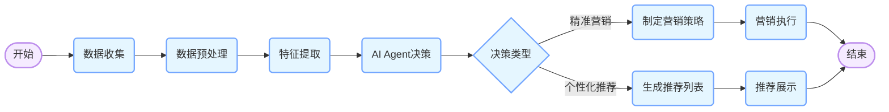

# AI Agent在企业精准营销与个性化推荐中的深度应用

> 关键词：AI Agent、企业精准营销、个性化推荐、智能决策、客户画像

> 摘要：本文深入探讨了AI Agent在企业精准营销与个性化推荐中的深度应用。首先介绍了相关背景，包括目的范围、预期读者等内容。接着阐述了核心概念与联系，详细解释了AI Agent的原理及与精准营销、个性化推荐的关系，并给出相应的示意图和流程图。然后对核心算法原理进行讲解，通过Python代码展示具体操作步骤。同时介绍了相关的数学模型和公式，并举例说明。在项目实战部分，给出了开发环境搭建、源代码实现与解读。还分析了实际应用场景，推荐了学习、开发相关的工具和资源。最后总结了未来发展趋势与挑战，提供了常见问题解答和扩展阅读参考资料，旨在为企业利用AI Agent提升精准营销和个性化推荐水平提供全面的技术指导。

## 1. 背景介绍 
### 1.1 目的和范围
在当今竞争激烈的市场环境下，企业需要更高效、精准的营销手段来吸引和留住客户。AI Agent作为一种智能的软件实体，具有自主决策和执行任务的能力，能够为企业的精准营销和个性化推荐提供强大的支持。本文的目的在于深入探讨AI Agent在企业精准营销与个性化推荐中的具体应用方式、技术原理和实际效果，范围涵盖了从AI Agent的基本概念到具体的算法实现，以及在不同行业的应用案例分析。

### 1.2 预期读者
本文的预期读者主要包括企业营销人员、技术研发人员、数据分析人员以及对AI技术在营销领域应用感兴趣的研究者。营销人员可以从中了解如何利用AI Agent提升营销效果和客户满意度；技术研发人员可以获取AI Agent的技术实现细节和开发思路；数据分析人员可以学习如何运用AI Agent进行数据挖掘和分析；研究者可以得到相关领域的研究方向和案例参考。

### 1.3 文档结构概述
本文共分为十个部分。第一部分为背景介绍，阐述了文章的目的、范围、预期读者和文档结构。第二部分介绍核心概念与联系，解释AI Agent、精准营销和个性化推荐的概念，并展示它们之间的关系。第三部分讲解核心算法原理和具体操作步骤，通过Python代码进行详细说明。第四部分介绍数学模型和公式，并举例说明其应用。第五部分是项目实战，包括开发环境搭建、源代码实现和代码解读。第六部分分析实际应用场景。第七部分推荐学习、开发相关的工具和资源。第八部分总结未来发展趋势与挑战。第九部分为附录，提供常见问题解答。第十部分给出扩展阅读和参考资料。

### 1.4 术语表
#### 1.4.1 核心术语定义
- **AI Agent**：人工智能代理，是一种能够感知环境、自主决策并采取行动以实现特定目标的智能软件实体。
- **企业精准营销**：企业通过精准定位目标客户群体，制定个性化的营销策略，以提高营销效果和投资回报率的营销方式。
- **个性化推荐**：根据用户的历史行为、偏好、特征等信息，为用户提供个性化的产品或服务推荐。

#### 1.4.2 相关概念解释
- **客户画像**：通过收集和分析客户的各种数据，构建出的关于客户特征、行为和偏好的综合描述。
- **智能决策**：AI Agent根据感知到的信息和预设的目标，运用算法和模型进行决策的过程。

#### 1.4.3 缩略词列表
- **AI**：Artificial Intelligence，人工智能
- **ML**：Machine Learning，机器学习
- **DL**：Deep Learning，深度学习

## 2. 核心概念与联系 
### 核心概念原理
#### AI Agent
AI Agent是一种具有自主性、反应性、社会性和主动性的智能实体。它能够感知周围环境的信息，根据预设的目标和规则，运用机器学习、深度学习等算法进行决策，并采取相应的行动。例如，在企业营销中，AI Agent可以通过分析客户的浏览记录、购买行为等数据，感知客户的需求和偏好，然后自主决定向客户推荐哪些产品或服务。

#### 企业精准营销
企业精准营销的核心在于精准定位目标客户群体。通过收集和分析客户的各种数据，如年龄、性别、地理位置、消费习惯等，企业可以将客户进行细分，针对不同的客户群体制定个性化的营销策略。例如，对于年轻时尚的客户群体，企业可以推出时尚潮流的产品和促销活动；对于注重品质和服务的客户群体，企业可以提供高端的产品和优质的售后服务。

#### 个性化推荐
个性化推荐是根据用户的历史行为和偏好，为用户提供个性化的产品或服务推荐。它可以提高用户的满意度和购买转化率。例如，电商平台根据用户的购买历史和浏览记录，为用户推荐相关的商品；音乐平台根据用户的听歌历史，为用户推荐相似风格的歌曲。

### 架构的文本示意图
```plaintext
              +------------------+
              |   AI Agent       |
              +------------------+
             /                   \
            /                     \
+----------------+           +----------------+
| 企业精准营销  |           | 个性化推荐     |
+----------------+           +----------------+
```
这个示意图展示了AI Agent处于核心位置，它为企业精准营销和个性化推荐提供支持。AI Agent通过收集和分析数据，为精准营销提供目标客户群体的信息，为个性化推荐提供用户的偏好信息。

### Mermaid流程图

这个流程图展示了从数据收集到最终营销执行或推荐展示的整个过程。首先进行数据收集和预处理，然后提取特征，AI Agent根据这些特征进行决策，决策分为精准营销和个性化推荐两种类型，最后分别执行相应的操作。

## 3. 核心算法原理 & 具体操作步骤 
### 核心算法原理
在AI Agent应用于企业精准营销与个性化推荐中，常用的算法包括协同过滤算法、深度学习算法等。这里以协同过滤算法为例进行讲解。

协同过滤算法基于用户的行为数据，通过计算用户之间或物品之间的相似度，来为用户推荐可能感兴趣的物品。它分为基于用户的协同过滤和基于物品的协同过滤两种类型。

#### 基于用户的协同过滤
基于用户的协同过滤算法首先计算用户之间的相似度，然后找到与目标用户最相似的K个用户，根据这K个用户的喜好来为目标用户推荐物品。

#### 基于物品的协同过滤
基于物品的协同过滤算法首先计算物品之间的相似度，然后根据目标用户过去喜欢的物品，找到与之相似的物品进行推荐。

### 具体操作步骤及Python代码实现
以下是一个基于物品的协同过滤算法的Python代码示例：

```python
import numpy as np

# 定义用户-物品评分矩阵
ratings = np.array([
    [5, 3, 0, 1],
    [4, 0, 0, 1],
    [1, 1, 0, 5],
    [1, 0, 0, 4],
    [0, 1, 5, 4]
])

# 计算物品之间的相似度（使用余弦相似度）
def cosine_similarity(item1, item2):
    dot_product = np.dot(item1, item2)
    norm_item1 = np.linalg.norm(item1)
    norm_item2 = np.linalg.norm(item2)
    if norm_item1 == 0 or norm_item2 == 0:
        return 0
    return dot_product / (norm_item1 * norm_item2)

# 构建物品相似度矩阵
num_items = ratings.shape[1]
similarity_matrix = np.zeros((num_items, num_items))
for i in range(num_items):
    for j in range(num_items):
        similarity_matrix[i][j] = cosine_similarity(ratings[:, i], ratings[:, j])

# 为用户推荐物品
def recommend_items(user_ratings, similarity_matrix, top_n=2):
    user_ratings = np.array(user_ratings)
    item_scores = []
    for item in range(similarity_matrix.shape[0]):
        if user_ratings[item] == 0:
            score = 0
            for rated_item in np.nonzero(user_ratings)[0]:
                score += similarity_matrix[item][rated_item] * user_ratings[rated_item]
            item_scores.append((item, score))
    item_scores.sort(key=lambda x: x[1], reverse=True)
    return [item[0] for item in item_scores[:top_n]]

# 示例：为第一个用户推荐物品
user_ratings = ratings[0]
recommended_items = recommend_items(user_ratings, similarity_matrix)
print("为用户推荐的物品索引：", recommended_items)
```

### 代码解释
1. **用户-物品评分矩阵**：`ratings` 矩阵表示了用户对物品的评分情况，其中0表示用户未对该物品进行评分。
2. **余弦相似度计算**：`cosine_similarity` 函数用于计算两个物品之间的余弦相似度。
3. **物品相似度矩阵构建**：通过双重循环遍历所有物品对，计算它们之间的相似度，并存储在 `similarity_matrix` 中。
4. **物品推荐**：`recommend_items` 函数根据用户的评分和物品相似度矩阵，为用户推荐未评分的物品。

## 4. 数学模型和公式 & 详细讲解 & 举例说明 
### 余弦相似度公式
在协同过滤算法中，常用余弦相似度来计算物品或用户之间的相似度。余弦相似度的计算公式如下：

$$
\cos(\theta) = \frac{\mathbf{A} \cdot \mathbf{B}}{\|\mathbf{A}\| \|\mathbf{B}\|}
$$

其中，$\mathbf{A}$ 和 $\mathbf{B}$ 是两个向量，$\mathbf{A} \cdot \mathbf{B}$ 是它们的点积，$\|\mathbf{A}\|$ 和 $\|\mathbf{B}\|$ 分别是它们的模。

### 详细讲解
余弦相似度衡量的是两个向量之间的夹角余弦值。当两个向量的方向完全相同时，余弦相似度为1；当两个向量的方向完全相反时，余弦相似度为 -1；当两个向量相互垂直时，余弦相似度为0。在协同过滤算法中，我们可以将用户对物品的评分看作向量，通过计算向量之间的余弦相似度来衡量用户或物品之间的相似程度。

### 举例说明
假设有两个物品的评分向量分别为 $\mathbf{A} = [5, 3, 0, 1]$ 和 $\mathbf{B} = [4, 0, 0, 1]$。

首先计算点积：

$$
\mathbf{A} \cdot \mathbf{B} = 5 \times 4 + 3 \times 0 + 0 \times 0 + 1 \times 1 = 21
$$

然后计算向量的模：

$$
\|\mathbf{A}\| = \sqrt{5^2 + 3^2 + 0^2 + 1^2} = \sqrt{35}
$$

$$
\|\mathbf{B}\| = \sqrt{4^2 + 0^2 + 0^2 + 1^2} = \sqrt{17}
$$

最后计算余弦相似度：

$$
\cos(\theta) = \frac{21}{\sqrt{35} \times \sqrt{17}} \approx 0.85
$$

这表明这两个物品之间具有较高的相似度。

## 5. 项目实战：代码实际案例和详细解释说明 
### 5.1  开发环境搭建
#### 操作系统
可以选择Windows、Linux或macOS操作系统，这里以Ubuntu 20.04为例进行说明。

#### Python环境
安装Python 3.8及以上版本，可以使用以下命令进行安装：

```bash
sudo apt update
sudo apt install python3.8
```

#### 虚拟环境创建
为了避免不同项目之间的依赖冲突，建议使用虚拟环境。可以使用 `venv` 模块创建虚拟环境：

```bash
python3.8 -m venv myenv
source myenv/bin/activate
```

#### 安装依赖库
安装项目所需的依赖库，如 `numpy`、`pandas` 等：

```bash
pip install numpy pandas
```

### 5.2  源代码详细实现和代码解读
以下是一个更完整的基于协同过滤算法的个性化推荐系统的Python代码示例：

```python
import numpy as np
import pandas as pd

# 加载数据
def load_data(file_path):
    data = pd.read_csv(file_path)
    return data

# 构建用户-物品评分矩阵
def build_rating_matrix(data):
    users = data['user_id'].unique()
    items = data['item_id'].unique()
    user_index = {user: i for i, user in enumerate(users)}
    item_index = {item: i for i, item in enumerate(items)}
    rating_matrix = np.zeros((len(users), len(items)))
    for row in data.itertuples():
        user_id = row.user_id
        item_id = row.item_id
        rating = row.rating
        user_idx = user_index[user_id]
        item_idx = item_index[item_id]
        rating_matrix[user_idx][item_idx] = rating
    return rating_matrix, user_index, item_index

# 计算物品之间的相似度（使用余弦相似度）
def cosine_similarity(item1, item2):
    dot_product = np.dot(item1, item2)
    norm_item1 = np.linalg.norm(item1)
    norm_item2 = np.linalg.norm(item2)
    if norm_item1 == 0 or norm_item2 == 0:
        return 0
    return dot_product / (norm_item1 * norm_item2)

# 构建物品相似度矩阵
def build_similarity_matrix(rating_matrix):
    num_items = rating_matrix.shape[1]
    similarity_matrix = np.zeros((num_items, num_items))
    for i in range(num_items):
        for j in range(num_items):
            similarity_matrix[i][j] = cosine_similarity(rating_matrix[:, i], rating_matrix[:, j])
    return similarity_matrix

# 为用户推荐物品
def recommend_items(user_ratings, similarity_matrix, top_n=2):
    user_ratings = np.array(user_ratings)
    item_scores = []
    for item in range(similarity_matrix.shape[0]):
        if user_ratings[item] == 0:
            score = 0
            for rated_item in np.nonzero(user_ratings)[0]:
                score += similarity_matrix[item][rated_item] * user_ratings[rated_item]
            item_scores.append((item, score))
    item_scores.sort(key=lambda x: x[1], reverse=True)
    return [item[0] for item in item_scores[:top_n]]

# 主函数
def main():
    file_path = 'ratings.csv'
    data = load_data(file_path)
    rating_matrix, user_index, item_index = build_rating_matrix(data)
    similarity_matrix = build_similarity_matrix(rating_matrix)
    target_user_id = 1
    target_user_idx = user_index[target_user_id]
    target_user_ratings = rating_matrix[target_user_idx]
    recommended_items = recommend_items(target_user_ratings, similarity_matrix)
    print("为用户推荐的物品索引：", recommended_items)

if __name__ == "__main__":
    main()
```

### 5.3  代码解读与分析
1. **数据加载**：`load_data` 函数使用 `pandas` 库加载CSV格式的数据文件。
2. **用户-物品评分矩阵构建**：`build_rating_matrix` 函数根据数据构建用户-物品评分矩阵，并记录用户和物品的索引信息。
3. **物品相似度矩阵构建**：`build_similarity_matrix` 函数计算物品之间的余弦相似度，并构建物品相似度矩阵。
4. **物品推荐**：`recommend_items` 函数根据用户的评分和物品相似度矩阵，为用户推荐未评分的物品。
5. **主函数**：`main` 函数调用上述函数，完成数据加载、矩阵构建和物品推荐的整个流程。

## 6. 实际应用场景 
### 电商平台
在电商平台中，AI Agent可以根据用户的浏览历史、购买记录、搜索关键词等信息，为用户提供个性化的商品推荐。例如，当用户浏览了一款手机后，AI Agent可以推荐相关的手机配件、手机壳等商品。同时，AI Agent还可以帮助电商平台进行精准营销，如根据用户的地理位置、消费习惯等信息，向不同的用户群体推送不同的促销活动。

### 金融行业
在金融行业，AI Agent可以为客户提供个性化的金融产品推荐。例如，根据客户的资产状况、风险偏好、投资目标等信息，为客户推荐适合的理财产品、保险产品等。此外，AI Agent还可以帮助金融机构进行精准营销，如通过分析客户的信用记录、消费行为等信息，向潜在客户推送信用卡、贷款等产品的营销信息。

### 媒体娱乐行业
在媒体娱乐行业，AI Agent可以根据用户的观看历史、收藏记录、评论信息等，为用户推荐个性化的电影、电视剧、音乐等内容。例如，视频平台可以根据用户的观看偏好，为用户推荐相似类型的视频；音乐平台可以根据用户的听歌历史，为用户推荐相似风格的歌曲。同时，AI Agent还可以帮助媒体娱乐企业进行精准营销，如根据用户的年龄、性别、兴趣爱好等信息，向不同的用户群体推送不同的广告和推广活动。

## 7. 工具和资源推荐
### 7.1 学习资源推荐
#### 7.1.1 书籍推荐
- 《人工智能：一种现代的方法》：这本书是人工智能领域的经典教材，全面介绍了人工智能的各个方面，包括搜索算法、机器学习、自然语言处理等。
- 《Python机器学习》：本书详细介绍了使用Python进行机器学习的方法和技巧，适合初学者学习。
- 《深度学习》：由深度学习领域的三位顶尖专家编写，系统地介绍了深度学习的理论和实践。

#### 7.1.2 在线课程
- Coursera上的“机器学习”课程：由Andrew Ng教授主讲，是机器学习领域的经典课程，涵盖了机器学习的基本概念、算法和应用。
- edX上的“人工智能导论”课程：由麻省理工学院的教授授课，介绍了人工智能的基本原理和方法。
- 中国大学MOOC上的“Python数据分析与挖掘实战”课程：该课程结合实际案例，介绍了使用Python进行数据分析和挖掘的方法和技巧。

#### 7.1.3 技术博客和网站
- 博客园：国内知名的技术博客平台，有很多关于人工智能、机器学习的技术文章。
- 掘金：专注于技术分享和交流的社区，有大量的AI技术文章和案例。
- Medium：国外的技术博客平台，有很多国际知名的AI专家和研究者分享他们的研究成果和经验。

### 7.2 开发工具框架推荐
#### 7.2.1 IDE和编辑器
- PyCharm：一款专门为Python开发设计的集成开发环境，具有强大的代码编辑、调试和分析功能。
- Jupyter Notebook：一种交互式的开发环境，适合进行数据分析和机器学习实验。
- Visual Studio Code：一款轻量级的代码编辑器，支持多种编程语言，有丰富的插件可以扩展功能。

#### 7.2.2 调试和性能分析工具
- PDB：Python自带的调试工具，可以帮助开发者定位和解决代码中的问题。
- cProfile：Python的性能分析工具，可以分析代码的运行时间和内存使用情况。
- TensorBoard：TensorFlow的可视化工具，可以帮助开发者可视化模型的训练过程和性能指标。

#### 7.2.3 相关框架和库
- TensorFlow：Google开发的深度学习框架，具有强大的计算能力和丰富的工具库。
- PyTorch：Facebook开发的深度学习框架，简单易用，适合快速原型开发。
- Scikit-learn：Python的机器学习库，提供了丰富的机器学习算法和工具。

### 7.3 相关论文著作推荐
#### 7.3.1 经典论文
- “A Unified Approach to Interpreting Model Predictions”：介绍了一种统一的方法来解释模型的预测结果。
- “Attention Is All You Need”：提出了Transformer模型，是自然语言处理领域的重要突破。
- “ImageNet Classification with Deep Convolutional Neural Networks”：介绍了AlexNet模型，开启了深度学习在计算机视觉领域的广泛应用。

#### 7.3.2 最新研究成果
- 在arXiv上可以找到很多关于AI Agent、精准营销和个性化推荐的最新研究论文。例如，一些研究探索了如何使用强化学习来优化AI Agent的决策过程，提高精准营销和个性化推荐的效果。
- 顶级学术会议如NeurIPS、ICML、KDD等的论文集中也包含了很多相关领域的最新研究成果。

#### 7.3.3 应用案例分析
- 一些商业杂志和行业报告中会有关于企业使用AI Agent进行精准营销和个性化推荐的应用案例分析。例如，《哈佛商业评论》会发布一些企业在营销领域的创新实践案例。
- 企业自身的技术博客和白皮书也会分享他们在这方面的应用经验和成果。例如，亚马逊、阿里巴巴等电商巨头会分享他们在个性化推荐系统方面的技术和实践。

## 8. 总结：未来发展趋势与挑战
### 未来发展趋势
#### 多模态数据融合
未来，AI Agent将不仅仅依赖于文本、数值等单一类型的数据，而是会融合图像、音频、视频等多模态数据，以更全面地了解用户的需求和偏好，提供更精准的个性化推荐和营销服务。例如，在电商平台中，结合用户的浏览图片、观看视频等行为数据，为用户推荐更符合其审美和需求的商品。

#### 强化学习的广泛应用
强化学习可以让AI Agent在与环境的交互中不断学习和优化决策，未来将在企业精准营销和个性化推荐中得到更广泛的应用。例如，AI Agent可以通过强化学习动态调整营销策略，根据用户的实时反馈和市场变化，优化推荐内容和营销方式，提高营销效果和用户满意度。

#### 与物联网的结合
随着物联网技术的发展，AI Agent可以与各种智能设备进行交互，获取更多的用户数据。例如，通过智能手表、智能家居设备等收集用户的健康数据、生活习惯数据等，为用户提供更加个性化的产品和服务推荐。同时，也可以通过物联网设备实现精准营销，如向用户的智能设备推送个性化的广告和促销信息。

### 挑战
#### 数据隐私和安全问题
在收集和使用用户数据的过程中，数据隐私和安全是一个重要的挑战。企业需要确保用户数据的安全性，防止数据泄露和滥用。同时，还需要遵守相关的法律法规，如欧盟的《通用数据保护条例》（GDPR）等，保护用户的隐私权益。

#### 算法可解释性
随着深度学习等复杂算法在AI Agent中的应用，算法的可解释性成为一个难题。企业需要能够解释AI Agent的决策过程和推荐结果，以便让用户理解和信任系统。例如，在金融领域，当AI Agent为客户推荐理财产品时，需要能够解释为什么推荐这款产品，其风险和收益情况如何。

#### 技术人才短缺
AI Agent的开发和应用需要具备人工智能、机器学习、数据分析等多方面知识的技术人才。目前，这类人才相对短缺，企业需要加大对技术人才的培养和引进力度，以满足业务发展的需求。

## 9. 附录：常见问题与解答
### 问题1：AI Agent在精准营销和个性化推荐中需要多少数据？
答：AI Agent在精准营销和个性化推荐中需要的数据量取决于多个因素，如业务类型、算法复杂度等。一般来说，数据量越大，AI Agent能够学习到的用户特征和模式就越丰富，推荐和营销的效果也就越好。但同时，也需要注意数据的质量和多样性，确保数据能够真实反映用户的需求和行为。

### 问题2：如何评估AI Agent在精准营销和个性化推荐中的效果？
答：可以从多个方面评估AI Agent的效果，如推荐准确率、点击率、转化率、用户满意度等。推荐准确率可以通过计算推荐的物品与用户实际喜欢的物品之间的匹配程度来评估；点击率和转化率可以反映用户对推荐内容的兴趣和购买意愿；用户满意度可以通过问卷调查等方式收集用户的反馈来评估。

### 问题3：AI Agent的开发难度大吗？
答：AI Agent的开发难度取决于其功能和复杂度。对于简单的AI Agent，如基于规则的推荐系统，开发难度相对较低；而对于复杂的AI Agent，如基于深度学习的智能决策系统，开发难度相对较高，需要具备一定的人工智能和机器学习知识。同时，还需要考虑数据的获取和处理、算法的选择和优化等问题。

## 10. 扩展阅读 & 参考资料
### 扩展阅读
- 《大数据时代：生活、工作与思维的大变革》：本书介绍了大数据的概念、应用和影响，有助于深入理解数据在企业精准营销和个性化推荐中的重要性。
- 《智能商业》：探讨了人工智能在商业领域的应用和发展趋势，为企业利用AI Agent提升竞争力提供了思路。

### 参考资料
- 《Python数据分析实战》：提供了使用Python进行数据分析的具体方法和案例，对AI Agent的数据处理和分析有一定的参考价值。
- 相关学术期刊如《Journal of Artificial Intelligence Research》《ACM Transactions on Intelligent Systems and Technology》等，发表了很多关于人工智能和机器学习的研究论文。
- 企业官方文档和技术博客，如Google TensorFlow官方文档、Facebook PyTorch官方文档等，是学习和使用相关框架的重要参考资料。