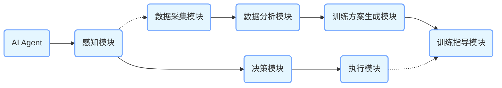

# AI Agent在智能体育训练系统中的应用

> 关键词：AI Agent、智能体育训练系统、强化学习、动作识别、个性化训练

> 摘要：本文深入探讨了AI Agent在智能体育训练系统中的应用。首先介绍了相关背景，包括目的范围、预期读者等内容。接着阐述了AI Agent和智能体育训练系统的核心概念及其联系，通过文本示意图和Mermaid流程图进行清晰展示。详细讲解了核心算法原理，用Python代码进行具体操作步骤的说明，并给出数学模型和公式。在项目实战部分，从开发环境搭建到源代码实现与解读进行了全面分析。同时探讨了实际应用场景，推荐了相关的工具和资源，最后总结了未来发展趋势与挑战，并对常见问题进行解答，还提供了扩展阅读和参考资料，旨在为该领域的研究和应用提供全面且深入的指导。

## 1. 背景介绍 
### 1.1 目的和范围
随着科技的飞速发展，体育训练领域也在不断寻求创新和突破。传统的体育训练方式往往依赖于教练的经验和主观判断，缺乏个性化和精准化。而AI Agent的出现为智能体育训练系统带来了新的机遇。本文的目的在于深入研究AI Agent在智能体育训练系统中的应用，探索如何利用AI Agent的智能决策和学习能力，提高体育训练的效果和质量。

文章的范围涵盖了AI Agent的基本概念、核心算法原理、在智能体育训练系统中的具体应用场景，以及相关的开发实践和未来发展趋势等方面。通过对这些内容的研究和分析，为智能体育训练系统的设计和开发提供理论支持和实践指导。

### 1.2 预期读者
本文的预期读者包括体育科学研究人员、体育教练、人工智能领域的研究人员和开发者、体育训练设备制造商等。对于体育科学研究人员和教练来说，本文可以帮助他们了解AI Agent在体育训练中的应用潜力，为改进训练方法和提高训练效果提供新思路；对于人工智能领域的研究人员和开发者来说，本文可以为他们在智能体育训练系统的开发中提供技术参考和应用案例；对于体育训练设备制造商来说，本文可以为他们的产品升级和创新提供方向。

### 1.3 文档结构概述
本文将按照以下结构进行组织：
- 核心概念与联系：介绍AI Agent和智能体育训练系统的核心概念，并阐述它们之间的联系。
- 核心算法原理 & 具体操作步骤：详细讲解AI Agent在智能体育训练系统中应用的核心算法原理，并给出具体的操作步骤和Python代码示例。
- 数学模型和公式 & 详细讲解 & 举例说明：给出相关的数学模型和公式，并进行详细讲解和举例说明。
- 项目实战：代码实际案例和详细解释说明：通过一个具体的项目实战，展示AI Agent在智能体育训练系统中的应用，包括开发环境搭建、源代码实现和代码解读。
- 实际应用场景：探讨AI Agent在智能体育训练系统中的实际应用场景。
- 工具和资源推荐：推荐相关的学习资源、开发工具框架和论文著作。
- 总结：未来发展趋势与挑战：总结AI Agent在智能体育训练系统中的应用现状，分析未来发展趋势和面临的挑战。
- 附录：常见问题与解答：对常见问题进行解答。
- 扩展阅读 & 参考资料：提供相关的扩展阅读和参考资料。

### 1.4 术语表
#### 1.4.1 核心术语定义
- **AI Agent**：即人工智能代理，是一种能够感知环境、做出决策并采取行动的智能实体。它可以根据环境的变化自主调整自己的行为，以实现特定的目标。
- **智能体育训练系统**：是一种利用先进的信息技术和人工智能技术，为运动员提供个性化、精准化训练方案的系统。它可以通过对运动员的身体数据、运动数据等进行分析和处理，为运动员制定科学合理的训练计划。
- **强化学习**：是一种机器学习方法，通过智能体与环境进行交互，根据环境反馈的奖励信号来学习最优的行为策略。
- **动作识别**：是指通过对人体动作的图像或视频进行分析和处理，识别出人体的具体动作类型。

#### 1.4.2 相关概念解释
- **环境**：在强化学习中，环境是指智能体所处的外部世界，智能体通过感知环境的状态来做出决策。
- **状态**：是指环境在某一时刻的具体情况，智能体根据当前状态选择合适的动作。
- **动作**：是指智能体在某一状态下采取的具体行为。
- **奖励**：是指环境对智能体采取的动作的反馈，用于指导智能体学习最优的行为策略。

#### 1.4.3 缩略词列表
- **RL**：Reinforcement Learning，强化学习
- **CNN**：Convolutional Neural Network，卷积神经网络
- **RNN**：Recurrent Neural Network，循环神经网络

## 2. 核心概念与联系 
### 核心概念原理
#### AI Agent
AI Agent是一种能够感知环境、做出决策并采取行动的智能实体。它通常由感知模块、决策模块和执行模块组成。感知模块负责收集环境信息，决策模块根据感知到的信息进行分析和推理，做出最优的决策，执行模块则根据决策结果采取相应的行动。

AI Agent可以通过机器学习算法进行训练，不断提高自己的决策能力和行为表现。其中，强化学习是一种常用的训练方法，它通过智能体与环境进行交互，根据环境反馈的奖励信号来学习最优的行为策略。

#### 智能体育训练系统
智能体育训练系统是一种利用先进的信息技术和人工智能技术，为运动员提供个性化、精准化训练方案的系统。它通常由数据采集模块、数据分析模块、训练方案生成模块和训练指导模块组成。

数据采集模块负责收集运动员的身体数据、运动数据等信息，数据分析模块对采集到的数据进行分析和处理，挖掘数据背后的规律和特征，训练方案生成模块根据数据分析结果为运动员制定个性化的训练方案，训练指导模块则根据训练方案为运动员提供实时的训练指导。

### 架构的文本示意图
```plaintext
智能体育训练系统
|-- 数据采集模块
|   |-- 身体数据采集（如心率、血压等）
|   |-- 运动数据采集（如动作轨迹、速度等）
|-- 数据分析模块
|   |-- 数据预处理
|   |-- 特征提取
|   |-- 模型训练
|-- 训练方案生成模块
|   |-- 个性化训练方案制定
|-- 训练指导模块
|   |-- 实时训练指导
|
|-- AI Agent
    |-- 感知模块
    |   |-- 环境信息感知
    |-- 决策模块
    |   |-- 基于强化学习的决策
    |-- 执行模块
    |   |-- 动作执行
```

### Mermaid流程图


这个流程图展示了智能体育训练系统和AI Agent之间的关系。数据采集模块负责收集运动员的相关数据，数据分析模块对数据进行处理和分析，训练方案生成模块根据分析结果生成训练方案，训练指导模块为运动员提供训练指导。AI Agent通过感知模块获取环境信息，决策模块根据信息做出决策，执行模块执行决策结果，并将结果反馈给训练指导模块。

## 3. 核心算法原理 & 具体操作步骤 
### 核心算法原理
在智能体育训练系统中，AI Agent主要使用强化学习算法进行决策。强化学习是一种通过智能体与环境进行交互，根据环境反馈的奖励信号来学习最优行为策略的机器学习方法。

#### 马尔可夫决策过程（MDP）
强化学习通常基于马尔可夫决策过程（MDP）进行建模。MDP可以用一个五元组 $(S, A, P, R, \gamma)$ 来表示，其中：
- $S$ 是状态空间，表示环境的所有可能状态。
- $A$ 是动作空间，表示智能体可以采取的所有可能动作。
- $P$ 是状态转移概率函数，表示在状态 $s$ 下采取动作 $a$ 后转移到状态 $s'$ 的概率，即 $P(s'|s, a)$。
- $R$ 是奖励函数，表示在状态 $s$ 下采取动作 $a$ 后转移到状态 $s'$ 所获得的奖励，即 $R(s, a, s')$。
- $\gamma$ 是折扣因子，取值范围为 $[0, 1]$，用于权衡当前奖励和未来奖励的重要性。

#### Q - 学习算法
Q - 学习是一种无模型的强化学习算法，它通过学习一个动作价值函数 $Q(s, a)$ 来找到最优的行为策略。动作价值函数 $Q(s, a)$ 表示在状态 $s$ 下采取动作 $a$ 后所能获得的累积折扣奖励的期望值。

Q - 学习的更新公式如下：
$$Q(s_t, a_t) \leftarrow Q(s_t, a_t) + \alpha [R(s_t, a_t, s_{t+1}) + \gamma \max_{a} Q(s_{t+1}, a) - Q(s_t, a_t)]$$
其中：
- $s_t$ 是当前状态。
- $a_t$ 是当前动作。
- $R(s_t, a_t, s_{t+1})$ 是在状态 $s_t$ 下采取动作 $a_t$ 后转移到状态 $s_{t+1}$ 所获得的奖励。
- $\alpha$ 是学习率，控制每次更新的步长。
- $\gamma$ 是折扣因子。

### 具体操作步骤
#### 步骤1：初始化
- 初始化状态空间 $S$、动作空间 $A$、Q - 表 $Q(s, a)$、学习率 $\alpha$ 和折扣因子 $\gamma$。
- 随机选择一个初始状态 $s_0$。

#### 步骤2：选择动作
- 根据当前状态 $s_t$ 和 Q - 表 $Q(s, a)$，使用某种策略（如 $\epsilon$ - 贪心策略）选择一个动作 $a_t$。

#### 步骤3：执行动作并获取奖励
- 在环境中执行动作 $a_t$，观察下一个状态 $s_{t+1}$ 和获得的奖励 $R(s_t, a_t, s_{t+1})$。

#### 步骤4：更新Q - 表
- 根据 Q - 学习的更新公式更新 Q - 表 $Q(s_t, a_t)$。

#### 步骤5：判断是否结束
- 如果达到终止条件（如达到最大步数或达到目标状态），则结束训练；否则，将 $s_{t+1}$ 作为新的当前状态，返回步骤2。

### Python源代码实现
```python
import numpy as np

# 初始化参数
num_states = 10  # 状态数量
num_actions = 2  # 动作数量
alpha = 0.1  # 学习率
gamma = 0.9  # 折扣因子
epsilon = 0.1  # epsilon - 贪心策略的参数
max_steps = 100  # 最大步数

# 初始化Q - 表
Q = np.zeros((num_states, num_actions))

# 定义环境的状态转移和奖励函数
def environment_step(state, action):
    # 简单示例：随机转移到下一个状态并返回奖励
    next_state = np.random.randint(num_states)
    reward = np.random.randint(-1, 2)
    return next_state, reward

# 训练过程
for episode in range(100):
    state = np.random.randint(num_states)  # 随机选择初始状态
    for step in range(max_steps):
        # 选择动作（epsilon - 贪心策略）
        if np.random.uniform(0, 1) < epsilon:
            action = np.random.randint(num_actions)  # 随机选择动作
        else:
            action = np.argmax(Q[state, :])  # 选择Q值最大的动作
        
        # 执行动作并获取奖励
        next_state, reward = environment_step(state, action)
        
        # 更新Q - 表
        Q[state, action] = Q[state, action] + alpha * (reward + gamma * np.max(Q[next_state, :]) - Q[state, action])
        
        # 更新状态
        state = next_state
        
        # 判断是否结束
        if step == max_steps - 1:
            break

# 输出最终的Q - 表
print("Final Q - table:")
print(Q)
```

在这个代码示例中，我们实现了一个简单的Q - 学习算法。首先初始化了状态空间、动作空间、Q - 表、学习率、折扣因子等参数。然后定义了环境的状态转移和奖励函数。在训练过程中，使用 $\epsilon$ - 贪心策略选择动作，执行动作并获取奖励，更新Q - 表，直到达到最大步数。最后输出最终的Q - 表。

## 4. 数学模型和公式 & 详细讲解 & 举例说明 
### 马尔可夫决策过程（MDP）详细讲解
#### 状态空间 $S$
状态空间 $S$ 是环境所有可能状态的集合。在智能体育训练系统中，状态可以包括运动员的身体状态（如心率、血压、疲劳程度等）、运动状态（如动作类型、速度、加速度等）。例如，在一个篮球训练系统中，状态可以表示为 $s = (心率, 投篮命中率, 当前得分)$。

#### 动作空间 $A$
动作空间 $A$ 是智能体可以采取的所有可能动作的集合。在智能体育训练系统中，动作可以包括训练计划的调整（如增加训练强度、改变训练内容等）、动作指导（如纠正运动员的动作姿势等）。例如，在一个健身训练系统中，动作可以表示为 $a = (增加重量, 减少休息时间, 更换训练器械)$。

#### 状态转移概率函数 $P$
状态转移概率函数 $P(s'|s, a)$ 表示在状态 $s$ 下采取动作 $a$ 后转移到状态 $s'$ 的概率。在实际应用中，状态转移概率可能是已知的，也可能需要通过数据进行估计。例如，在一个足球训练系统中，如果当前状态 $s$ 表示球员的位置和球的位置，动作 $a$ 表示球员的传球动作，那么状态转移概率 $P(s'|s, a)$ 表示传球后球员和球到达新位置 $s'$ 的概率。

#### 奖励函数 $R$
奖励函数 $R(s, a, s')$ 表示在状态 $s$ 下采取动作 $a$ 后转移到状态 $s'$ 所获得的奖励。奖励函数的设计非常重要，它直接影响智能体的学习目标和行为策略。在智能体育训练系统中，奖励可以根据运动员的训练效果、动作质量等因素来设计。例如，在一个游泳训练系统中，如果运动员的游泳速度提高了，那么可以给予正奖励；如果运动员的动作姿势不正确，那么可以给予负奖励。

#### 折扣因子 $\gamma$
折扣因子 $\gamma$ 取值范围为 $[0, 1]$，用于权衡当前奖励和未来奖励的重要性。当 $\gamma$ 接近 1 时，智能体更注重未来的长期奖励；当 $\gamma$ 接近 0 时，智能体更注重当前的短期奖励。例如，在一个长跑训练系统中，如果 $\gamma$ 较大，智能体可能会选择一种更稳健的训练策略，以提高长期的训练效果；如果 $\gamma$ 较小，智能体可能会选择一种更激进的训练策略，以获得即时的奖励。

### Q - 学习算法公式详细讲解
#### 动作价值函数 $Q(s, a)$
动作价值函数 $Q(s, a)$ 表示在状态 $s$ 下采取动作 $a$ 后所能获得的累积折扣奖励的期望值。它是 Q - 学习算法的核心，智能体通过学习 $Q(s, a)$ 来找到最优的行为策略。

#### Q - 学习更新公式
$$Q(s_t, a_t) \leftarrow Q(s_t, a_t) + \alpha [R(s_t, a_t, s_{t+1}) + \gamma \max_{a} Q(s_{t+1}, a) - Q(s_t, a_t)]$$
- $Q(s_t, a_t)$ 是当前状态 $s_t$ 下采取动作 $a_t$ 的 Q 值。
- $\alpha$ 是学习率，控制每次更新的步长。学习率越大，更新速度越快，但可能会导致学习不稳定；学习率越小，更新速度越慢，但学习更稳定。
- $R(s_t, a_t, s_{t+1})$ 是在状态 $s_t$ 下采取动作 $a_t$ 后转移到状态 $s_{t+1}$ 所获得的奖励。
- $\gamma$ 是折扣因子，用于权衡当前奖励和未来奖励的重要性。
- $\max_{a} Q(s_{t+1}, a)$ 是下一个状态 $s_{t+1}$ 下所有可能动作的最大 Q 值。

### 举例说明
假设我们有一个简单的智能体育训练系统，状态空间 $S = \{s_1, s_2\}$，动作空间 $A = \{a_1, a_2\}$，初始 Q - 表如下：
| 状态 | $a_1$ | $a_2$ |
| ---- | ---- | ---- |
| $s_1$ | 0 | 0 |
| $s_2$ | 0 | 0 |

学习率 $\alpha = 0.1$，折扣因子 $\gamma = 0.9$。

在某一时刻，当前状态 $s_t = s_1$，智能体选择动作 $a_t = a_1$，执行动作后转移到状态 $s_{t+1} = s_2$，获得奖励 $R(s_t, a_t, s_{t+1}) = 1$。

下一个状态 $s_{t+1} = s_2$ 下所有可能动作的最大 Q 值为 $\max_{a} Q(s_{t+1}, a) = \max\{Q(s_2, a_1), Q(s_2, a_2)\} = 0$。

根据 Q - 学习的更新公式，更新 $Q(s_t, a_t)$：
$$Q(s_1, a_1) \leftarrow Q(s_1, a_1) + 0.1 [1 + 0.9 \times 0 - Q(s_1, a_1)] = 0 + 0.1 \times (1 - 0) = 0.1$$

更新后的 Q - 表如下：
| 状态 | $a_1$ | $a_2$ |
| ---- | ---- | ---- |
| $s_1$ | 0.1 | 0 |
| $s_2$ | 0 | 0 |

通过不断地与环境进行交互和更新 Q - 表，智能体可以逐渐学习到最优的行为策略。

## 5. 项目实战：代码实际案例和详细解释说明 
### 5.1  开发环境搭建
#### 硬件环境
- **计算机**：建议使用配置较高的计算机，如 CPU 为 Intel Core i7 及以上，内存为 16GB 及以上，以保证训练过程的高效运行。
- **传感器**：根据具体的体育训练项目，选择合适的传感器来采集运动员的身体数据和运动数据。例如，心率传感器、加速度传感器、陀螺仪传感器等。

#### 软件环境
- **操作系统**：推荐使用 Linux 或 Windows 操作系统。
- **编程语言**：使用 Python 作为主要的编程语言，因为 Python 具有丰富的机器学习和深度学习库，方便进行算法实现和模型训练。
- **开发框架**：使用 PyTorch 或 TensorFlow 作为深度学习框架，用于构建和训练神经网络模型。同时，使用 OpenAI Gym 作为强化学习环境的开发框架，方便进行强化学习算法的实现和测试。

#### 安装步骤
1. 安装 Python：可以从 Python 官方网站（https://www.python.org/downloads/）下载并安装 Python 3.7 及以上版本。
2. 安装 PyTorch：根据自己的操作系统和 CUDA 版本，从 PyTorch 官方网站（https://pytorch.org/get-started/locally/）选择合适的安装命令进行安装。
3. 安装 OpenAI Gym：使用以下命令进行安装：
```bash
pip install gym
```

### 5.2  源代码详细实现和代码解读
#### 项目需求分析
假设我们要开发一个智能篮球训练系统，通过 AI Agent 为运动员提供个性化的训练方案。系统需要实现以下功能：
- 采集运动员的投篮数据，包括投篮位置、投篮力度、投篮角度等。
- 根据采集到的数据，使用强化学习算法为运动员制定最优的训练方案。
- 实时反馈训练效果，指导运动员进行训练。

#### 代码实现
```python
import gym
import numpy as np
import torch
import torch.nn as nn
import torch.optim as optim

# 定义神经网络模型
class QNetwork(nn.Module):
    def __init__(self, state_size, action_size):
        super(QNetwork, self).__init__()
        self.fc1 = nn.Linear(state_size, 64)
        self.fc2 = nn.Linear(64, 64)
        self.fc3 = nn.Linear(64, action_size)

    def forward(self, x):
        x = torch.relu(self.fc1(x))
        x = torch.relu(self.fc2(x))
        x = self.fc3(x)
        return x

# 定义强化学习智能体
class DQNAgent:
    def __init__(self, state_size, action_size):
        self.state_size = state_size
        self.action_size = action_size
        self.memory = []
        self.gamma = 0.95  # 折扣因子
        self.epsilon = 1.0  # 初始探索率
        self.epsilon_min = 0.01  # 最小探索率
        self.epsilon_decay = 0.995  # 探索率衰减率
        self.learning_rate = 0.001  # 学习率
        self.model = QNetwork(state_size, action_size)
        self.optimizer = optim.Adam(self.model.parameters(), lr=self.learning_rate)
        self.criterion = nn.MSELoss()

    def remember(self, state, action, reward, next_state, done):
        self.memory.append((state, action, reward, next_state, done))

    def act(self, state):
        if np.random.rand() <= self.epsilon:
            return np.random.choice(self.action_size)
        state = torch.FloatTensor(state).unsqueeze(0)
        act_values = self.model(state)
        action = np.argmax(act_values.detach().numpy())
        return action

    def replay(self, batch_size):
        if len(self.memory) < batch_size:
            return
        minibatch = np.random.choice(self.memory, batch_size)
        states, actions, rewards, next_states, dones = zip(*minibatch)

        states = torch.FloatTensor(states)
        actions = torch.LongTensor(actions)
        rewards = torch.FloatTensor(rewards)
        next_states = torch.FloatTensor(next_states)
        dones = torch.FloatTensor(dones)

        targets = self.model(states).gather(1, actions.unsqueeze(1)).squeeze(1)
        next_q_values = self.model(next_states).detach().max(1)[0]
        targets = (rewards + (1 - dones) * self.gamma * next_q_values)

        self.optimizer.zero_grad()
        loss = self.criterion(targets, self.model(states).gather(1, actions.unsqueeze(1)).squeeze(1))
        loss.backward()
        self.optimizer.step()

        if self.epsilon > self.epsilon_min:
            self.epsilon *= self.epsilon_decay

# 主训练函数
def train():
    env = gym.make('BasketballTraining-v0')  # 自定义的篮球训练环境
    state_size = env.observation_space.shape[0]
    action_size = env.action_space.n
    agent = DQNAgent(state_size, action_size)

    batch_size = 32
    episodes = 1000

    for episode in range(episodes):
        state = env.reset()
        total_reward = 0
        done = False
        while not done:
            action = agent.act(state)
            next_state, reward, done, _ = env.step(action)
            agent.remember(state, action, reward, next_state, done)
            agent.replay(batch_size)
            state = next_state
            total_reward += reward

        print(f"Episode: {episode + 1}, Total Reward: {total_reward}")

if __name__ == "__main__":
    train()
```

#### 代码解读
1. **QNetwork 类**：定义了一个简单的三层全连接神经网络，用于近似动作价值函数 $Q(s, a)$。
2. **DQNAgent 类**：实现了一个深度 Q - 网络（DQN）智能体，包括记忆、动作选择、经验回放等功能。
    - `remember` 方法：将智能体的经验（状态、动作、奖励、下一个状态、是否结束）存储到经验池中。
    - `act` 方法：使用 $\epsilon$ - 贪心策略选择动作。
    - `replay` 方法：从经验池中随机采样一批经验，进行 Q - 网络的更新。
3. **train 函数**：主训练函数，创建环境和智能体，进行训练循环。在每个训练周期中，智能体与环境进行交互，存储经验并进行经验回放，不断更新 Q - 网络。

### 5.3  代码解读与分析
#### 优点
- **使用深度神经网络**：通过使用深度神经网络来近似动作价值函数，能够处理高维的状态空间和复杂的环境。
- **经验回放**：经验回放机制可以打破数据之间的相关性，提高训练的稳定性和效率。
- **$\epsilon$ - 贪心策略**：$\epsilon$ - 贪心策略可以在探索和利用之间进行平衡，使智能体能够在训练初期进行更多的探索，后期进行更多的利用。

#### 缺点
- **训练时间长**：由于使用了深度神经网络和经验回放机制，训练时间可能会比较长。
- **超参数调优困难**：DQN 算法有多个超参数（如学习率、折扣因子、探索率等），需要进行精细的调优才能获得较好的性能。

#### 改进方向
- **使用双深度 Q - 网络（Double DQN）**：Double DQN 可以缓解 Q - 值的高估问题，提高训练的稳定性。
- **使用优先经验回放（Prioritized Experience Replay）**：优先经验回放可以根据经验的重要性进行采样，提高训练的效率。

## 6. 实际应用场景 
### 个性化训练方案制定
AI Agent 可以根据运动员的身体数据、运动数据和训练目标，为运动员制定个性化的训练方案。例如，对于一个篮球运动员，AI Agent 可以根据他的身高、体重、速度、耐力等身体数据，以及投篮命中率、传球成功率等运动数据，为他制定适合他的训练计划，包括训练内容、训练强度、训练频率等。

### 实时动作指导
在运动员进行训练时，AI Agent 可以实时监测运动员的动作，识别动作的正确性，并提供实时的指导和反馈。例如，在一个健身训练系统中，AI Agent 可以通过摄像头捕捉运动员的动作，分析动作的姿势、角度、力度等参数，判断动作是否正确。如果动作不正确，AI Agent 可以及时发出提示，指导运动员纠正动作。

### 比赛策略制定
在体育比赛中，AI Agent 可以根据对手的特点和比赛的实时情况，为教练和运动员制定比赛策略。例如，在一个足球比赛中，AI Agent 可以分析对手的进攻和防守特点，预测对手的战术安排，为教练提供针对性的比赛策略，如如何布置防线、如何组织进攻等。

### 运动员健康管理
AI Agent 可以通过监测运动员的身体数据，如心率、血压、睡眠质量等，对运动员的健康状况进行评估和管理。例如，当运动员的心率过高或血压异常时，AI Agent 可以及时发出警报，提醒运动员注意休息和调整训练计划。同时，AI Agent 还可以根据运动员的身体状况，为运动员提供个性化的营养建议和康复方案。

## 7. 工具和资源推荐
### 7.1 学习资源推荐
#### 7.1.1 书籍推荐
- 《强化学习：原理与Python实现》：本书系统地介绍了强化学习的基本原理和算法，并通过Python代码进行了详细的实现和讲解，适合初学者入门。
- 《深度学习》：由深度学习领域的三位顶尖专家 Ian Goodfellow、Yoshua Bengio 和 Aaron Courville 合著，是深度学习领域的经典教材，涵盖了深度学习的各个方面。
- 《人工智能：一种现代的方法》：本书全面介绍了人工智能的基本概念、算法和应用，是人工智能领域的权威教材。

#### 7.1.2 在线课程
- Coursera 上的《Reinforcement Learning Specialization》：由美国大学教授 Richard S. Sutton 等人授课，系统地介绍了强化学习的理论和实践。
- edX 上的《Deep Learning Specialization》：由深度学习领域的知名学者 Andrew Ng 授课，涵盖了深度学习的各个方面，包括卷积神经网络、循环神经网络等。
- 中国大学MOOC上的《人工智能基础》：由国内知名高校的教授授课，介绍了人工智能的基本概念、算法和应用，适合初学者入门。

#### 7.1.3 技术博客和网站
- Medium：是一个技术博客平台，上面有很多关于人工智能、强化学习等领域的优秀文章。
- Towards Data Science：是一个专注于数据科学和人工智能的博客网站，上面有很多高质量的技术文章和案例分析。
- OpenAI Blog：OpenAI 官方博客，会发布关于人工智能研究和应用的最新成果。

### 7.2 开发工具框架推荐
#### 7.2.1 IDE和编辑器
- PyCharm：是一款专门为Python开发设计的集成开发环境（IDE），具有强大的代码编辑、调试和项目管理功能。
- Visual Studio Code：是一款轻量级的代码编辑器，支持多种编程语言，具有丰富的插件生态系统，可以方便地进行Python开发。
- Jupyter Notebook：是一个交互式的笔记本环境，适合进行数据分析、模型训练和实验验证等工作。

#### 7.2.2 调试和性能分析工具
- TensorBoard：是 TensorFlow 提供的一个可视化工具，可以用于可视化训练过程中的损失函数、准确率等指标，帮助开发者进行模型调试和性能分析。
- PyTorch Profiler：是 PyTorch 提供的一个性能分析工具，可以用于分析模型的运行时间、内存使用等情况，帮助开发者优化模型性能。
- cProfile：是 Python 内置的一个性能分析工具，可以用于分析 Python 代码的运行时间和函数调用情况。

#### 7.2.3 相关框架和库
- PyTorch：是一个开源的深度学习框架，具有动态图机制、易于使用和高效等特点，广泛应用于深度学习的各个领域。
- TensorFlow：是另一个开源的深度学习框架，具有强大的分布式训练和部署能力，被许多大型科技公司广泛使用。
- OpenAI Gym：是一个用于开发和比较强化学习算法的工具包，提供了丰富的环境和接口，方便开发者进行强化学习算法的实现和测试。

### 7.3 相关论文著作推荐
#### 7.3.1 经典论文
- “Reinforcement Learning: An Introduction” by Richard S. Sutton and Andrew G. Barto：是强化学习领域的经典著作，系统地介绍了强化学习的基本原理和算法。
- “Playing Atari with Deep Reinforcement Learning” by Volodymyr Mnih et al.：首次提出了深度 Q - 网络（DQN）算法，将深度学习和强化学习相结合，在 Atari 游戏上取得了很好的效果。
- “Human-level control through deep reinforcement learning” by Volodymyr Mnih et al.：进一步改进了 DQN 算法，使智能体能够在多个 Atari 游戏上达到人类水平的表现。

#### 7.3.2 最新研究成果
- 关注 arXiv 预印本平台，上面会及时发布关于人工智能、强化学习等领域的最新研究成果。
- 参加相关的学术会议，如 NeurIPS、ICML、AAAI 等，了解最新的研究动态和趋势。

#### 7.3.3 应用案例分析
- 关注各大科技公司的技术博客，如 Google AI Blog、Facebook AI Research Blog 等，上面会发布一些关于人工智能在各个领域的应用案例和实践经验。
- 阅读相关的行业报告和研究论文，了解 AI Agent 在智能体育训练系统中的实际应用情况和效果。

## 8. 总结：未来发展趋势与挑战
### 未来发展趋势
#### 多模态数据融合
未来的智能体育训练系统将融合更多类型的数据，如视频数据、音频数据、生物电信号数据等。通过多模态数据融合，可以更全面地了解运动员的身体状态和运动情况，为运动员提供更精准的训练方案和指导。

#### 与物联网技术的结合
随着物联网技术的发展，智能体育训练系统将与更多的智能设备进行连接，如智能手环、智能跑鞋、智能篮球等。通过物联网技术，可以实时采集运动员的各种数据，并将数据传输到智能体育训练系统中进行分析和处理。

#### 强化学习算法的改进
未来的强化学习算法将不断改进和优化，以提高智能体的学习效率和性能。例如，使用更复杂的神经网络结构、引入更多的先验知识、采用多智能体强化学习等方法。

#### 云服务和边缘计算
云服务和边缘计算技术将在智能体育训练系统中得到更广泛的应用。通过云服务，可以实现数据的存储和管理、模型的训练和部署等功能；通过边缘计算，可以在本地设备上进行数据处理和分析，减少数据传输延迟，提高系统的实时性。

### 挑战
#### 数据隐私和安全
智能体育训练系统需要采集和处理大量的运动员个人数据，如身体数据、运动数据等。这些数据涉及到运动员的隐私和安全问题，如何保护这些数据的隐私和安全是一个亟待解决的问题。

#### 算法可解释性
目前的强化学习算法大多是基于深度学习的黑盒模型，算法的决策过程难以解释。在智能体育训练系统中，教练和运动员需要了解算法的决策依据，以便更好地接受和应用训练方案。因此，如何提高算法的可解释性是一个重要的挑战。

#### 环境适应性
体育训练环境是复杂多变的，不同的运动项目、不同的场地条件、不同的运动员状态等都会对训练效果产生影响。如何使 AI Agent 能够适应不同的环境，提高训练方案的通用性和适应性是一个挑战。

#### 伦理和法律问题
随着 AI Agent 在智能体育训练系统中的应用越来越广泛，也会带来一些伦理和法律问题。例如，AI Agent 的决策是否会对运动员的身体造成伤害，AI Agent 的训练方案是否符合体育道德和法律法规等。

## 9. 附录：常见问题与解答
### 问题1：AI Agent 在智能体育训练系统中主要使用哪些算法？
答：AI Agent 在智能体育训练系统中主要使用强化学习算法，如 Q - 学习、深度 Q - 网络（DQN）、策略梯度算法等。这些算法可以帮助 AI Agent 学习最优的行为策略，为运动员提供个性化的训练方案。

### 问题2：如何收集运动员的身体数据和运动数据？
答：可以使用各种传感器来收集运动员的身体数据和运动数据，如心率传感器、加速度传感器、陀螺仪传感器、摄像头等。这些传感器可以安装在运动员的身体上或训练设备上，实时采集运动员的相关数据。

### 问题3：AI Agent 制定的训练方案是否适用于所有运动员？
答：AI Agent 制定的训练方案是根据运动员的个人数据和训练目标进行个性化定制的，因此不同的运动员会有不同的训练方案。但是，在实际应用中，还需要考虑运动员的个体差异和特殊情况，对训练方案进行适当的调整和优化。

### 问题4：如何评估 AI Agent 在智能体育训练系统中的性能？
答：可以使用多种指标来评估 AI Agent 在智能体育训练系统中的性能，如训练效果提升程度、动作识别准确率、训练方案的合理性等。同时，还可以通过与人类教练的训练效果进行对比，来评估 AI Agent 的性能。

### 问题5：AI Agent 在智能体育训练系统中的应用是否会取代人类教练？
答：AI Agent 在智能体育训练系统中的应用可以为运动员提供个性化的训练方案和实时的指导，但它并不能完全取代人类教练。人类教练具有丰富的经验和专业知识，能够根据运动员的情绪、心理状态等因素进行综合判断和指导。因此，AI Agent 和人类教练可以相互补充，共同提高体育训练的效果。

## 10. 扩展阅读 & 参考资料
### 扩展阅读
- 《体育人工智能：技术、应用与未来》：本书介绍了人工智能在体育领域的应用现状和未来发展趋势，包括智能训练、比赛分析、运动员健康管理等方面。
- 《智能体育：科技重塑运动未来》：探讨了智能体育的概念、技术和应用，以及智能体育对体育产业的影响。

### 参考资料
- Sutton, R. S., & Barto, A. G. (2018). Reinforcement learning: An introduction. MIT press.
- Mnih, V., Kavukcuoglu, K., Silver, D., Rusu, A. A., Veness, J., Bellemare, M. G., ... & Petersen, S. (2015). Human-level control through deep reinforcement learning. Nature, 518(7540), 529-533.
- OpenAI Gym Documentation: https://gym.openai.com/docs/
- PyTorch Documentation: https://pytorch.org/docs/stable/index.html
- TensorFlow Documentation: https://www.tensorflow.org/api_docs