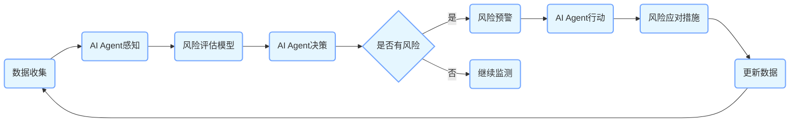

# AI Agent在智能供应链风险管理中的应用

> 关键词：AI Agent、智能供应链、风险管理、人工智能、供应链优化

> 摘要：本文聚焦于AI Agent在智能供应链风险管理中的应用。首先介绍了相关背景，包括目的、预期读者等内容。接着阐述了AI Agent和智能供应链风险管理的核心概念及联系，通过文本示意图和Mermaid流程图进行清晰展示。详细讲解了核心算法原理，并用Python代码进行说明，同时给出数学模型和公式。在项目实战部分，从开发环境搭建到源代码实现与解读进行了全面分析。还探讨了AI Agent在智能供应链风险管理中的实际应用场景，推荐了相关的学习资源、开发工具框架以及论文著作。最后总结了未来发展趋势与挑战，并提供了常见问题解答和扩展阅读参考资料，旨在为读者全面深入地呈现AI Agent在智能供应链风险管理领域的应用情况。

## 1. 背景介绍 
### 1.1 目的和范围
本文章旨在深入探讨AI Agent在智能供应链风险管理中的应用。随着全球经济的发展和市场竞争的加剧，供应链变得越来越复杂，面临着诸如自然灾害、政治不稳定、供应商破产等各种风险。传统的供应链风险管理方法往往难以应对这些复杂多变的情况。AI Agent作为一种智能化的技术手段，具有自主决策、实时响应等特点，能够为供应链风险管理提供新的解决方案。本文将详细介绍AI Agent的原理、算法，以及如何将其应用于智能供应链风险管理的各个环节，包括风险识别、评估、预警和应对等。

### 1.2 预期读者
本文预期读者包括供应链管理领域的从业者，如供应链经理、物流专员等，他们可以从中了解如何利用AI Agent提升供应链风险管理的效率和效果；人工智能领域的研究者和开发者，能够从供应链风险管理的实际需求出发，探索AI Agent的应用场景和优化方向；高校相关专业的学生，有助于他们拓宽知识面，了解跨学科领域的前沿技术。

### 1.3 文档结构概述
本文将按照以下结构进行阐述：首先介绍AI Agent和智能供应链风险管理的核心概念及它们之间的联系，通过示意图和流程图直观展示；接着详细讲解核心算法原理，并使用Python代码进行具体说明；给出相关的数学模型和公式，并举例说明其应用；在项目实战部分，从开发环境搭建开始，逐步展示源代码的实现和解读；探讨AI Agent在智能供应链风险管理中的实际应用场景；推荐学习资源、开发工具框架和相关论文著作；最后总结未来发展趋势与挑战，提供常见问题解答和扩展阅读参考资料。

### 1.4 术语表
#### 1.4.1 核心术语定义
- **AI Agent**：人工智能代理，是一种能够感知环境、自主决策并采取行动以实现特定目标的智能实体。它可以根据预设的规则或通过学习来适应不同的环境和任务。
- **智能供应链**：利用先进的信息技术，如物联网、大数据、人工智能等，实现供应链各环节的智能化管理和协同运作，提高供应链的效率、灵活性和透明度。
- **供应链风险管理**：识别、评估和应对供应链中可能出现的各种风险，以减少风险对供应链运营和绩效的影响。

#### 1.4.2 相关概念解释
- **风险识别**：通过各种方法和技术，发现供应链中可能存在的风险因素，如供应商的信誉问题、运输过程中的延误等。
- **风险评估**：对识别出的风险进行量化分析，评估其发生的可能性和影响程度，以便确定风险的优先级。
- **风险预警**：在风险发生之前，通过监测和分析相关数据，及时发出警报，提醒管理者采取措施应对风险。
- **风险应对**：根据风险评估的结果，采取相应的措施来降低风险的影响，如调整供应商、增加库存等。

#### 1.4.3 缩略词列表
- **AI**：Artificial Intelligence（人工智能）
- **IoT**：Internet of Things（物联网）
- **ML**：Machine Learning（机器学习）
- **DL**：Deep Learning（深度学习）

## 2. 核心概念与联系 
### 核心概念原理
#### AI Agent原理
AI Agent的核心原理基于感知、决策和行动三个主要步骤。它通过传感器或数据接口感知周围环境的信息，例如在供应链风险管理中，可能感知到供应商的交货时间、库存水平等数据。然后，AI Agent根据预设的规则或通过学习算法对感知到的信息进行分析和处理，做出决策。最后，根据决策结果采取相应的行动，如向供应商发出催促交货的通知或调整库存策略。

#### 智能供应链风险管理原理
智能供应链风险管理的原理是利用先进的信息技术对供应链中的各种数据进行收集、分析和挖掘，以识别潜在的风险因素。通过建立风险评估模型，对风险进行量化评估，并根据评估结果制定相应的风险应对策略。同时，利用实时监测和预警系统，及时发现风险的变化并采取措施。

### 架构的文本示意图
```plaintext
智能供应链风险管理系统
|-- 数据层
|   |-- 供应商数据
|   |-- 运输数据
|   |-- 库存数据
|   |-- 市场数据
|-- 处理层
|   |-- AI Agent
|       |-- 感知模块
|       |-- 决策模块
|       |-- 行动模块
|   |-- 风险评估模型
|   |-- 预警系统
|-- 应用层
|   |-- 风险识别
|   |-- 风险评估
|   |-- 风险预警
|   |-- 风险应对
```

### Mermaid流程图


这个流程图展示了AI Agent在智能供应链风险管理中的工作流程。首先，系统收集各种数据，AI Agent对这些数据进行感知。然后，将数据输入到风险评估模型中进行评估。AI Agent根据评估结果做出决策，如果判断有风险，则发出预警并采取相应的行动，实施风险应对措施。最后，更新数据，继续进行监测和管理。

## 3. 核心算法原理 & 具体操作步骤 
### 核心算法原理
#### 机器学习算法
在AI Agent应用于智能供应链风险管理中，机器学习算法起着关键作用。以决策树算法为例，它是一种基于树结构进行决策的算法。决策树通过对训练数据的学习，构建出一个树形结构，每个内部节点表示一个属性上的测试，每个分支是一个测试输出，每个叶节点是一个类别或值。在供应链风险管理中，可以根据历史的供应链数据，如供应商的交货时间、产品质量等属性，构建决策树模型。当有新的数据输入时，决策树可以根据节点的测试条件进行判断，预测是否存在风险。

#### 强化学习算法
强化学习是一种通过智能体与环境进行交互，以最大化累积奖励的学习方法。在供应链风险管理中，AI Agent可以作为智能体，环境就是供应链系统。AI Agent通过不断地尝试不同的行动，根据环境反馈的奖励信号来调整自己的策略。例如，当AI Agent采取某种库存调整策略后，如果供应链的运营成本降低，就会得到一个正的奖励；反之，如果成本增加，则得到一个负的奖励。通过不断地学习和优化，AI Agent可以找到最优的风险管理策略。

### 具体操作步骤
#### 数据准备
首先，需要收集供应链相关的数据，包括供应商信息、运输记录、库存数据等。对收集到的数据进行清洗和预处理，去除噪声数据和缺失值，将数据转换为适合算法处理的格式。

#### 模型训练
使用准备好的数据对机器学习或强化学习模型进行训练。对于决策树算法，可以使用Python的`scikit-learn`库进行训练。以下是一个简单的决策树训练代码示例：
```python
from sklearn.tree import DecisionTreeClassifier
from sklearn.model_selection import train_test_split
import pandas as pd

# 读取数据
data = pd.read_csv('supply_chain_data.csv')
X = data.drop('risk_label', axis=1)  # 特征数据
y = data['risk_label']  # 标签数据

# 划分训练集和测试集
X_train, X_test, y_train, y_test = train_test_split(X, y, test_size=0.2, random_state=42)

# 创建决策树分类器
clf = DecisionTreeClassifier()

# 训练模型
clf.fit(X_train, y_train)
```

#### 模型评估
使用测试集对训练好的模型进行评估，计算模型的准确率、召回率、F1值等指标，评估模型的性能。
```python
from sklearn.metrics import accuracy_score

# 预测测试集
y_pred = clf.predict(X_test)

# 计算准确率
accuracy = accuracy_score(y_test, y_pred)
print(f"模型准确率: {accuracy}")
```

#### 部署和应用
将训练好的模型部署到实际的供应链风险管理系统中，AI Agent可以使用该模型进行实时的风险评估和决策。当有新的数据输入时，模型可以快速预测是否存在风险，并根据预设的规则采取相应的行动。

## 4. 数学模型和公式 & 详细讲解 & 举例说明 
### 风险评估模型
#### 层次分析法（AHP）
层次分析法是一种将定性和定量分析相结合的多准则决策方法。在供应链风险管理中，可以使用AHP来确定各个风险因素的权重。

设供应链风险因素集合为 $C = \{c_1, c_2, \cdots, c_n\}$，决策者需要比较这些因素的相对重要性。通过构建判断矩阵 $A = (a_{ij})_{n\times n}$，其中 $a_{ij}$ 表示因素 $c_i$ 相对于因素 $c_j$ 的重要性程度。通常，$a_{ij}$ 的取值范围为 $1, 3, 5, 7, 9$ 及其倒数，分别表示同等重要、稍微重要、明显重要、强烈重要和极端重要。

判断矩阵需要满足一致性检验，一致性指标 $CI$ 的计算公式为：
$$CI = \frac{\lambda_{max} - n}{n - 1}$$
其中，$\lambda_{max}$ 是判断矩阵 $A$ 的最大特征值，$n$ 是判断矩阵的阶数。

随机一致性指标 $RI$ 是一个与矩阵阶数有关的常数，可以通过查表得到。一致性比率 $CR$ 的计算公式为：
$$CR = \frac{CI}{RI}$$
当 $CR < 0.1$ 时，认为判断矩阵具有满意的一致性。

最后，通过求解判断矩阵的特征向量，得到各个风险因素的权重 $w = (w_1, w_2, \cdots, w_n)^T$。

**举例说明**：假设有三个供应链风险因素：供应商信誉 $c_1$、运输延误 $c_2$ 和库存短缺 $c_3$。决策者构建的判断矩阵如下：
$$A = \begin{bmatrix}
1 & 3 & 5 \\
\frac{1}{3} & 1 & 3 \\
\frac{1}{5} & \frac{1}{3} & 1
\end{bmatrix}$$
首先，计算判断矩阵的最大特征值 $\lambda_{max}$ 和特征向量。使用Python的`numpy`库可以实现：
```python
import numpy as np

A = np.array([[1, 3, 5], [1/3, 1, 3], [1/5, 1/3, 1]])
eigenvalues, eigenvectors = np.linalg.eig(A)
lambda_max = np.max(eigenvalues).real
n = A.shape[0]
CI = (lambda_max - n) / (n - 1)

# 查RI表，n=3时，RI=0.58
RI = 0.58
CR = CI / RI

print(f"CI: {CI}, CR: {CR}")

# 计算特征向量对应的权重
weights = eigenvectors[:, np.argmax(eigenvalues)].real
weights = weights / np.sum(weights)
print(f"风险因素权重: {weights}")
```
通过计算得到 $CR < 0.1$，说明判断矩阵具有满意的一致性。最终得到各个风险因素的权重，为后续的风险评估提供了依据。

### 风险预警模型
#### 阈值法
阈值法是一种简单有效的风险预警方法。对于某个风险指标 $x$，设定一个阈值 $\theta$。当 $x > \theta$ 时，发出风险预警。

设风险指标 $x$ 表示供应商的交货延迟天数，阈值 $\theta = 5$ 天。如果供应商的某次交货延迟天数超过 5 天，则系统发出预警。

### 风险应对模型
#### 成本效益模型
在选择风险应对措施时，可以使用成本效益模型。设采取某种风险应对措施 $i$ 的成本为 $C_i$，预期收益为 $R_i$，则该措施的效益成本比为：
$$BCR_i = \frac{R_i}{C_i}$$
选择效益成本比最大的措施作为最优的风险应对措施。

**举例说明**：假设有两种风险应对措施：措施 1 是增加备用供应商，成本 $C_1 = 10000$ 元，预期收益 $R_1 = 20000$ 元；措施 2 是增加库存，成本 $C_2 = 8000$ 元，预期收益 $R_2 = 15000$ 元。

计算两种措施的效益成本比：
$$BCR_1 = \frac{R_1}{C_1} = \frac{20000}{10000} = 2$$
$$BCR_2 = \frac{R_2}{C_2} = \frac{15000}{8000} = 1.875$$
由于 $BCR_1 > BCR_2$，所以选择增加备用供应商作为最优的风险应对措施。

## 5. 项目实战：代码实际案例和详细解释说明 
### 5.1  开发环境搭建
#### 操作系统
可以选择Windows、Linux或macOS等主流操作系统。这里以Ubuntu 20.04为例进行说明。

#### 编程语言和库
- **Python**：作为主要的编程语言，选择Python 3.8及以上版本。
- **相关库**：
    - `pandas`：用于数据处理和分析。
    - `numpy`：用于数值计算。
    - `scikit-learn`：用于机器学习算法的实现。
    - `matplotlib`：用于数据可视化。

可以使用以下命令安装这些库：
```bash
pip install pandas numpy scikit-learn matplotlib
```

#### 开发工具
推荐使用PyCharm作为开发工具，它提供了强大的代码编辑、调试和项目管理功能。

### 5.2  源代码详细实现和代码解读
#### 数据加载和预处理
```python
import pandas as pd
from sklearn.preprocessing import StandardScaler

# 加载数据
data = pd.read_csv('supply_chain_data.csv')

# 分离特征和标签
X = data.drop('risk_label', axis=1)
y = data['risk_label']

# 数据标准化
scaler = StandardScaler()
X_scaled = scaler.fit_transform(X)
```
代码解读：首先使用`pandas`库的`read_csv`函数加载供应链数据。然后将特征数据和标签数据分离，其中`risk_label`是表示是否存在风险的标签。最后使用`StandardScaler`对特征数据进行标准化处理，使数据具有零均值和单位方差，有助于提高机器学习模型的性能。

#### 模型训练和评估
```python
from sklearn.model_selection import train_test_split
from sklearn.tree import DecisionTreeClassifier
from sklearn.metrics import accuracy_score

# 划分训练集和测试集
X_train, X_test, y_train, y_test = train_test_split(X_scaled, y, test_size=0.2, random_state=42)

# 创建决策树分类器
clf = DecisionTreeClassifier()

# 训练模型
clf.fit(X_train, y_train)

# 预测测试集
y_pred = clf.predict(X_test)

# 计算准确率
accuracy = accuracy_score(y_test, y_pred)
print(f"模型准确率: {accuracy}")
```
代码解读：使用`train_test_split`函数将标准化后的特征数据和标签数据划分为训练集和测试集，其中测试集占比为20%。创建一个决策树分类器`DecisionTreeClassifier`，并使用训练集数据对其进行训练。然后使用训练好的模型对测试集进行预测，最后使用`accuracy_score`函数计算模型的准确率。

#### 风险预警和应对模拟
```python
# 模拟新的供应链数据
new_data = pd.DataFrame({
    'supplier_score': [70],
    'delivery_delay': [3],
    'inventory_level': [100]
})

# 数据标准化
new_data_scaled = scaler.transform(new_data)

# 预测风险
risk_prediction = clf.predict(new_data_scaled)

if risk_prediction[0] == 1:
    print("检测到风险，建议增加备用供应商！")
else:
    print("未检测到风险，继续监测。")
```
代码解读：模拟了一组新的供应链数据，包括供应商评分、交货延迟天数和库存水平。对新数据进行标准化处理后，使用训练好的决策树模型进行风险预测。如果预测结果为存在风险（标签为1），则输出建议增加备用供应商的信息；否则，输出继续监测的信息。

### 5.3  代码解读与分析
#### 数据预处理的重要性
数据预处理是机器学习项目中非常重要的一步。通过数据标准化，可以消除不同特征之间的量纲差异，使模型能够更好地学习数据的特征。同时，去除噪声数据和缺失值可以提高数据的质量，减少模型的误差。

#### 模型选择和评估
在本项目中，选择了决策树分类器作为风险预测模型。决策树模型具有易于理解和解释的优点，能够直观地展示决策过程。通过使用准确率作为评估指标，可以衡量模型的性能。但在实际应用中，还可以考虑其他评估指标，如召回率、F1值等，以更全面地评估模型。

#### 风险预警和应对的合理性
根据模型的预测结果给出相应的风险预警和应对建议，是智能供应链风险管理的关键环节。在本案例中，当检测到风险时，建议增加备用供应商，这是一种常见的风险应对策略，可以降低供应链因单一供应商问题而受到的影响。

## 6. 实际应用场景 
### 供应商风险管理
AI Agent可以实时监测供应商的各项指标，如交货时间、产品质量、信誉评级等。通过对历史数据的学习和分析，预测供应商可能出现的风险。例如，如果某个供应商的交货延迟次数逐渐增加，AI Agent可以提前发出预警，并建议企业寻找备用供应商或与该供应商进行沟通协商，以降低供应中断的风险。

### 运输风险管理
在运输过程中，AI Agent可以跟踪货物的位置、运输状态和预计到达时间。结合天气、交通等实时信息，预测运输过程中可能出现的延误或其他风险。如果预测到运输路线上可能出现恶劣天气，AI Agent可以建议企业调整运输路线或选择其他运输方式，以确保货物按时到达。

### 库存风险管理
AI Agent可以根据销售数据、市场需求预测和供应商交货时间等信息，优化库存管理策略。通过实时监测库存水平，预测库存短缺或积压的风险。当库存水平接近安全库存下限，AI Agent可以自动触发补货流程；当库存积压时，AI Agent可以建议企业采取促销活动或调整采购计划，以降低库存成本。

### 需求风险管理
通过分析历史销售数据、市场趋势和客户反馈等信息，AI Agent可以预测市场需求的变化。如果预测到需求将大幅下降，AI Agent可以建议企业减少生产计划，避免库存积压；如果预测到需求将大幅增加，AI Agent可以提醒企业提前与供应商沟通，确保原材料的供应，以满足市场需求。

## 7. 工具和资源推荐
### 7.1 学习资源推荐
#### 7.1.1 书籍推荐
- 《人工智能：一种现代的方法》：全面介绍了人工智能的基本概念、算法和应用，是人工智能领域的经典教材。
- 《机器学习》：由周志华教授编写，系统地介绍了机器学习的基本理论和常用算法，适合初学者和进阶学习者。
- 《供应链风险管理：原理与应用》：详细阐述了供应链风险管理的理论和实践方法，对于理解供应链风险管理的核心概念和方法有很大帮助。

#### 7.1.2 在线课程
- Coursera上的“Machine Learning”课程：由Andrew Ng教授讲授，是机器学习领域最受欢迎的在线课程之一，课程内容丰富，讲解清晰。
- edX上的“Artificial Intelligence”课程：由麻省理工学院（MIT）提供，涵盖了人工智能的各个方面，包括搜索算法、机器学习、自然语言处理等。
- Udemy上的“Supply Chain Management: A Comprehensive Guide”课程：全面介绍了供应链管理的各个环节，包括采购、生产、物流等，以及如何进行风险管理。

#### 7.1.3 技术博客和网站
- Medium：上面有很多关于人工智能和供应链管理的技术博客文章，涵盖了最新的研究成果和实践经验。
- Towards Data Science：专注于数据科学和机器学习领域的技术博客，提供了很多实用的代码示例和案例分析。
- Supply Chain Dive：是一个专门的供应链管理资讯网站，提供了供应链行业的最新动态、趋势和案例分析。

### 7.2 开发工具框架推荐
#### 7.2.1 IDE和编辑器
- PyCharm：是一款专门为Python开发设计的集成开发环境（IDE），具有强大的代码编辑、调试和项目管理功能。
- Jupyter Notebook：是一个交互式的开发环境，适合进行数据探索、模型训练和可视化。
- Visual Studio Code：是一款轻量级的代码编辑器，支持多种编程语言和插件扩展，具有丰富的开发工具和社区资源。

#### 7.2.2 调试和性能分析工具
- PDB：是Python自带的调试工具，可以帮助开发者定位代码中的错误和问题。
- TensorBoard：是TensorFlow提供的可视化工具，可以用于监控模型的训练过程、分析模型的性能和可视化数据。
- cProfile：是Python的性能分析工具，可以分析代码的运行时间和资源消耗情况，帮助开发者优化代码性能。

#### 7.2.3 相关框架和库
- TensorFlow：是一个开源的机器学习框架，提供了丰富的工具和库，支持深度学习模型的开发和训练。
- PyTorch：是另一个流行的深度学习框架，具有动态图的特点，适合快速开发和实验。
- NetworkX：是一个用于复杂网络分析的Python库，可以用于构建和分析供应链网络模型。

### 7.3 相关论文著作推荐
#### 7.3.1 经典论文
- “Artificial Intelligence and Supply Chain Management: A Literature Review”：对人工智能在供应链管理中的应用进行了全面的文献综述，分析了人工智能技术在供应链各个环节的应用现状和发展趋势。
- “Risk Management in Supply Chains: A Review”：系统地回顾了供应链风险管理的理论和方法，为供应链风险管理的研究和实践提供了重要的参考。
- “Multi-Agent Systems for Supply Chain Management: A Review”：介绍了多智能体系统在供应链管理中的应用，探讨了智能体之间的协作和决策机制。

#### 7.3.2 最新研究成果
- 关注顶级学术会议如ACM SIGKDD、IEEE ICDM等上关于人工智能和供应链管理的研究论文，了解最新的研究成果和技术趋势。
- 查阅相关学术期刊如《Management Science》、《Operations Research》等上的论文，获取高质量的研究成果。

#### 7.3.3 应用案例分析
- 一些知名企业如亚马逊、沃尔玛等的供应链管理案例分析，可以了解他们如何应用人工智能技术进行供应链风险管理和优化。
- 行业报告和咨询公司的研究报告，如Gartner、麦肯锡等发布的关于供应链管理和人工智能应用的报告，提供了丰富的实际应用案例和行业洞察。

## 8. 总结：未来发展趋势与挑战
### 未来发展趋势
#### 智能化程度不断提高
随着人工智能技术的不断发展，AI Agent在智能供应链风险管理中的智能化程度将不断提高。未来的AI Agent将能够更加准确地感知环境、自主决策和采取行动，实现供应链风险管理的自动化和智能化。

#### 与其他技术的融合
AI Agent将与物联网、区块链、大数据等技术深度融合。物联网可以提供更丰富的供应链数据，区块链可以保证数据的安全性和不可篡改，大数据可以为AI Agent提供更强大的数据分析和挖掘能力。通过这些技术的融合，将进一步提升供应链风险管理的效率和效果。

#### 多智能体协同
在复杂的供应链环境中，多个AI Agent之间的协同将变得越来越重要。不同的AI Agent可以负责不同的供应链环节，通过协同合作，实现供应链的整体优化和风险管理。例如，供应商管理智能体、运输管理智能体和库存管理智能体之间可以相互协作，共同应对供应链中的各种风险。

### 挑战
#### 数据质量和安全问题
AI Agent的决策和行动依赖于大量的供应链数据。然而，数据质量和安全问题是当前面临的主要挑战之一。数据的不准确、不完整或被篡改可能会导致AI Agent做出错误的决策。同时，供应链数据涉及企业的核心机密，如何保证数据的安全性和隐私性也是一个重要的问题。

#### 算法可解释性
虽然机器学习和深度学习算法在供应链风险管理中取得了很好的效果，但这些算法往往是黑盒模型，难以解释其决策过程。在实际应用中，企业需要了解AI Agent的决策依据，以便做出合理的决策。因此，如何提高算法的可解释性是一个亟待解决的问题。

#### 人才短缺
AI Agent在智能供应链风险管理中的应用需要既懂人工智能技术又懂供应链管理的复合型人才。然而，目前这类人才非常短缺，这限制了AI Agent技术在供应链领域的推广和应用。企业和高校需要加强人才培养，提高相关专业人才的数量和质量。

## 9. 附录：常见问题与解答
### 问题1：AI Agent在智能供应链风险管理中的应用是否需要大量的计算资源？
解答：AI Agent的应用需要一定的计算资源，尤其是在使用深度学习等复杂算法时。但随着云计算和边缘计算技术的发展，可以将计算任务分配到云端或边缘设备上，减少本地设备的计算压力。同时，也可以通过优化算法和模型结构，降低计算资源的需求。

### 问题2：如何确保AI Agent的决策是准确可靠的？
解答：为了确保AI Agent的决策准确可靠，需要从多个方面入手。首先，要保证数据的质量，对数据进行清洗和预处理，去除噪声数据和缺失值。其次，选择合适的算法和模型，并进行充分的训练和评估。可以使用交叉验证等方法来评估模型的性能，选择性能最优的模型。此外，还可以对AI Agent的决策进行人工审核和验证，结合人类的经验和知识，提高决策的准确性。

### 问题3：AI Agent在智能供应链风险管理中的应用是否会取代人类的工作？
解答：AI Agent在智能供应链风险管理中的应用不会完全取代人类的工作。虽然AI Agent可以自动完成一些重复性、规律性的任务，如数据监测、风险预警等，但在一些复杂的决策和沟通协调方面，人类的经验和判断力仍然是不可或缺的。AI Agent更像是人类的助手，可以帮助人类提高工作效率和决策的准确性，实现人机协同合作。

### 问题4：如何将现有的供应链管理系统与AI Agent集成？
解答：将现有的供应链管理系统与AI Agent集成可以采用以下步骤。首先，对现有的系统进行评估，确定需要集成的功能和数据接口。然后，开发AI Agent模块，并通过API等方式与现有的系统进行对接。在集成过程中，需要确保数据的兼容性和安全性。最后，进行测试和验证，确保集成后的系统能够正常运行。

## 10. 扩展阅读 & 参考资料
### 扩展阅读
- 《人工智能时代的供应链创新与变革》：深入探讨了人工智能技术对供应链管理的影响和变革，提供了很多实际案例和应用经验。
- 《智能供应链：数字化转型的关键路径》：介绍了智能供应链的概念、架构和实现方法，对于理解智能供应链的发展趋势和应用有很大帮助。

### 参考资料
- 相关学术期刊和会议论文，如《Journal of Supply Chain Management》、ACM SIGKDD会议论文等。
- 行业报告和咨询公司的研究报告，如Gartner的《Supply Chain Technology Trends》、麦肯锡的《Digitizing the Supply Chain》等。
- 开源代码库和技术文档，如GitHub上的相关项目和官方文档。