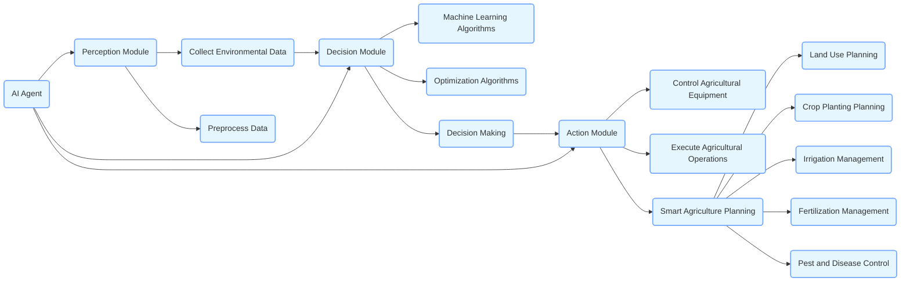

# AI Agent在智能农业规划中的实践

> 关键词：AI Agent、智能农业规划、农业决策、农业自动化、机器学习、传感器技术、农业大数据

> 摘要：本文聚焦于AI Agent在智能农业规划中的实践应用。首先介绍了智能农业规划的背景和重要性，阐述了AI Agent的核心概念及其与智能农业规划的联系。详细讲解了相关核心算法原理，并给出Python源代码示例。通过数学模型和公式深入剖析了AI Agent在农业规划中的作用机制。接着通过实际项目案例展示了AI Agent在智能农业规划中的具体实现过程和代码解读。分析了AI Agent在智能农业规划中的实际应用场景，推荐了相关的学习资源、开发工具框架和论文著作。最后总结了AI Agent在智能农业规划中的未来发展趋势与挑战，并提供常见问题解答和扩展阅读参考资料。

## 1. 背景介绍 
### 1.1 目的和范围
随着全球人口的不断增长，对粮食的需求也日益增加。传统农业面临着劳动力短缺、资源利用效率低下、环境压力增大等诸多挑战。智能农业作为一种新兴的农业发展模式，借助先进的信息技术和人工智能技术，能够实现农业生产的精准化、自动化和智能化，提高农业生产效率和质量，保障粮食安全。

本文的目的是探讨AI Agent在智能农业规划中的应用实践。范围涵盖了AI Agent的基本概念、相关算法原理、数学模型、实际项目案例以及在不同农业场景中的应用，旨在为智能农业规划领域的研究人员、开发者和农业从业者提供全面的技术参考和实践指导。

### 1.2 预期读者
本文的预期读者包括但不限于以下几类人群：
- **农业从业者**：希望了解和应用先进的人工智能技术来提升农业生产效率和管理水平的农民、农场主、农业企业管理人员等。
- **科研人员**：从事智能农业、人工智能、计算机科学等相关领域研究的学者和科研人员，对AI Agent在农业领域的应用感兴趣。
- **开发者**：具有一定编程基础，想要开发智能农业相关软件或系统的程序员和软件工程师。
- **学生**：学习农业工程、计算机科学、人工智能等专业的学生，希望通过本文了解跨学科的知识和应用。

### 1.3 文档结构概述
本文将按照以下结构进行组织：
- 核心概念与联系：介绍AI Agent和智能农业规划的核心概念，以及它们之间的联系，并通过文本示意图和Mermaid流程图进行可视化展示。
- 核心算法原理 & 具体操作步骤：详细讲解AI Agent在智能农业规划中常用的算法原理，并给出Python源代码示例。
- 数学模型和公式 & 详细讲解 & 举例说明：运用数学模型和公式深入分析AI Agent在农业规划中的决策过程，并通过具体例子进行说明。
- 项目实战：代码实际案例和详细解释说明：通过实际项目案例，展示AI Agent在智能农业规划中的具体实现过程，包括开发环境搭建、源代码实现和代码解读。
- 实际应用场景：分析AI Agent在智能农业规划中的不同应用场景，如作物种植规划、灌溉管理、病虫害防治等。
- 工具和资源推荐：推荐相关的学习资源、开发工具框架和论文著作，帮助读者进一步深入学习和研究。
- 总结：未来发展趋势与挑战：总结AI Agent在智能农业规划中的发展趋势和面临的挑战。
- 附录：常见问题与解答：解答读者在学习和实践过程中可能遇到的常见问题。
- 扩展阅读 & 参考资料：提供相关的扩展阅读资料和参考文献，方便读者进一步查阅。

### 1.4 术语表
#### 1.4.1 核心术语定义
- **AI Agent（人工智能智能体）**：是一个能够感知环境、做出决策并采取行动的实体，它可以根据预设的目标和规则，自主地与环境进行交互。
- **智能农业规划**：利用先进的信息技术和人工智能技术，对农业生产过程进行全面、系统的规划和管理，包括土地利用规划、作物种植规划、灌溉管理、施肥管理、病虫害防治等。
- **传感器技术**：通过各种传感器设备，实时采集农业生产环境中的各种数据，如土壤湿度、温度、光照强度、气象数据等。
- **农业大数据**：指在农业生产、经营、管理等过程中产生的大量数据，包括传感器数据、气象数据、市场数据、农事记录等。
- **机器学习**：是一门多领域交叉学科，涉及概率论、统计学、逼近论、凸分析、算法复杂度理论等多门学科。它专门研究计算机怎样模拟或实现人类的学习行为，以获取新的知识或技能，重新组织已有的知识结构使之不断改善自身的性能。

#### 1.4.2 相关概念解释
- **环境感知**：AI Agent通过传感器等设备获取环境信息的过程，如土壤湿度、温度、光照强度等。
- **决策制定**：AI Agent根据感知到的环境信息和预设的目标，运用一定的算法和规则，做出最优决策的过程。
- **行动执行**：AI Agent根据决策结果，采取相应的行动，如控制灌溉设备、施肥设备等。

#### 1.4.3 缩略词列表
- **AI**：Artificial Intelligence，人工智能
- **IoT**：Internet of Things，物联网
- **ML**：Machine Learning，机器学习
- **RL**：Reinforcement Learning，强化学习

## 2. 核心概念与联系 

### 2.1 AI Agent核心概念
AI Agent是人工智能领域中的一个重要概念，它是一个能够自主感知环境、做出决策并采取行动的实体。一个典型的AI Agent由感知模块、决策模块和行动模块组成。

感知模块负责收集环境中的各种信息，例如在智能农业规划中，感知模块可以通过传感器收集土壤湿度、温度、光照强度、气象数据等信息。决策模块根据感知模块收集到的信息，结合预设的目标和规则，运用一定的算法进行决策。行动模块则根据决策模块的结果，采取相应的行动，例如控制灌溉设备、施肥设备、通风设备等。

### 2.2 智能农业规划核心概念
智能农业规划是利用先进的信息技术和人工智能技术，对农业生产过程进行全面、系统的规划和管理。它包括土地利用规划、作物种植规划、灌溉管理、施肥管理、病虫害防治等多个方面。智能农业规划的目标是提高农业生产效率、降低生产成本、减少资源浪费、保护环境，实现农业的可持续发展。

### 2.3 AI Agent与智能农业规划的联系
AI Agent在智能农业规划中具有重要的应用价值。通过AI Agent的感知模块，可以实时收集农业生产环境中的各种数据，为智能农业规划提供准确的信息支持。决策模块可以根据这些数据，运用机器学习、优化算法等技术，制定出最优的农业生产方案。行动模块则可以根据决策结果，自动控制农业生产设备，实现农业生产的自动化和智能化。

### 2.4 文本示意图
```plaintext
AI Agent in Smart Agriculture Planning
|
|-- Perception Module
|   |-- Sensors (Soil Moisture, Temperature, Light, etc.)
|   |-- Data Collection and Preprocessing
|
|-- Decision Module
|   |-- Machine Learning Algorithms (Regression, Classification, RL)
|   |-- Optimization Algorithms (Genetic Algorithm, Simulated Annealing)
|   |-- Decision Making based on Goals and Rules
|
|-- Action Module
|   |-- Control of Agricultural Equipment (Irrigation, Fertilization, Ventilation)
|   |-- Execution of Agricultural Operations
|
|-- Smart Agriculture Planning
|   |-- Land Use Planning
|   |-- Crop Planting Planning
|   |-- Irrigation Management
|   |-- Fertilization Management
|   |-- Pest and Disease Control
```

### 2.5 Mermaid流程图


## 3. 核心算法原理 & 具体操作步骤 

### 3.1 机器学习算法在AI Agent中的应用
#### 3.1.1 线性回归算法
线性回归是一种简单而常用的机器学习算法，用于建立自变量和因变量之间的线性关系。在智能农业规划中，线性回归可以用于预测作物产量与土壤肥力、灌溉量等因素之间的关系。

**算法原理**：
给定一组训练数据 $(x_1, y_1), (x_2, y_2), \cdots, (x_n, y_n)$，其中 $x_i$ 是自变量，$y_i$ 是因变量。线性回归的目标是找到一条直线 $y = \theta_0 + \theta_1x_1 + \theta_2x_2 + \cdots + \theta_mx_m$，使得预测值 $\hat{y}_i$ 与真实值 $y_i$ 之间的误差最小。通常使用均方误差（Mean Squared Error，MSE）作为损失函数：
$$MSE = \frac{1}{n}\sum_{i = 1}^{n}(y_i - \hat{y}_i)^2$$
通过最小化MSE，可以得到最优的参数 $\theta$。

**Python代码实现**：
```python
import numpy as np
from sklearn.linear_model import LinearRegression

# 生成示例数据
X = np.array([[1], [2], [3], [4], [5]])
y = np.array([2, 4, 6, 8, 10])

# 创建线性回归模型
model = LinearRegression()

# 训练模型
model.fit(X, y)

# 预测新数据
new_X = np.array([[6]])
prediction = model.predict(new_X)
print("Prediction:", prediction)
```

#### 3.1.2 决策树算法
决策树是一种基于树结构进行决策的机器学习算法。在智能农业规划中，决策树可以用于根据土壤条件、气象数据等因素，选择合适的作物品种。

**算法原理**：
决策树通过对训练数据进行递归划分，构建一棵决策树。每个内部节点是一个属性上的测试，每个分支是一个测试输出，每个叶节点是一个类别或值。决策树的构建过程通常使用信息增益、基尼不纯度等指标来选择最优的划分属性。

**Python代码实现**：
```python
from sklearn.datasets import load_iris
from sklearn.tree import DecisionTreeClassifier
from sklearn.model_selection import train_test_split
from sklearn.metrics import accuracy_score

# 加载数据集
iris = load_iris()
X = iris.data
y = iris.target

# 划分训练集和测试集
X_train, X_test, y_train, y_test = train_test_split(X, y, test_size=0.2, random_state=42)

# 创建决策树模型
model = DecisionTreeClassifier()

# 训练模型
model.fit(X_train, y_train)

# 预测
y_pred = model.predict(X_test)

# 计算准确率
accuracy = accuracy_score(y_test, y_pred)
print("Accuracy:", accuracy)
```

### 3.2 优化算法在AI Agent中的应用
#### 3.2.1 遗传算法
遗传算法是一种模拟自然选择和遗传机制的优化算法。在智能农业规划中，遗传算法可以用于优化农业生产方案，如土地利用规划、灌溉计划等。

**算法原理**：
遗传算法通过模拟生物进化过程，使用选择、交叉和变异等操作，不断迭代优化种群中的个体，直到找到最优解。具体步骤如下：
1. **初始化种群**：随机生成一组初始解作为种群。
2. **适应度评估**：计算每个个体的适应度值，适应度值越高表示该个体越优秀。
3. **选择操作**：根据适应度值选择一部分个体作为父代。
4. **交叉操作**：对父代个体进行交叉操作，生成子代个体。
5. **变异操作**：对子代个体进行变异操作，引入新的基因。
6. **更新种群**：用子代个体替换部分父代个体，形成新的种群。
7. **重复步骤2-6**，直到满足终止条件。

**Python代码实现**：
```python
import numpy as np

# 定义目标函数
def objective_function(x):
    return -np.sum(x**2)

# 遗传算法参数
population_size = 50
chromosome_length = 10
generations = 100
mutation_rate = 0.01

# 初始化种群
population = np.random.randint(0, 2, (population_size, chromosome_length))

# 遗传算法主循环
for generation in range(generations):
    # 计算适应度值
    fitness_values = np.array([objective_function(ind) for ind in population])
    
    # 选择操作
    selection_probabilities = fitness_values / np.sum(fitness_values)
    selected_indices = np.random.choice(population_size, size=population_size, p=selection_probabilities)
    selected_population = population[selected_indices]
    
    # 交叉操作
    new_population = []
    for i in range(0, population_size, 2):
        parent1 = selected_population[i]
        parent2 = selected_population[i + 1]
        crossover_point = np.random.randint(1, chromosome_length)
        child1 = np.concatenate((parent1[:crossover_point], parent2[crossover_point:]))
        child2 = np.concatenate((parent2[:crossover_point], parent1[crossover_point:]))
        new_population.extend([child1, child2])
    
    new_population = np.array(new_population)
    
    # 变异操作
    for i in range(population_size):
        for j in range(chromosome_length):
            if np.random.rand() < mutation_rate:
                new_population[i][j] = 1 - new_population[i][j]
    
    population = new_population

# 找到最优解
best_individual = population[np.argmax([objective_function(ind) for ind in population])]
print("Best individual:", best_individual)
print("Best fitness:", objective_function(best_individual))
```

### 3.3 具体操作步骤
#### 3.3.1 数据收集与预处理
- **数据收集**：通过传感器、气象站、卫星遥感等设备收集农业生产环境中的各种数据，如土壤湿度、温度、光照强度、气象数据、作物生长数据等。
- **数据预处理**：对收集到的数据进行清洗、缺失值处理、异常值处理、归一化等操作，以提高数据质量。

#### 3.3.2 模型训练
- **选择合适的算法**：根据具体的农业规划问题，选择合适的机器学习算法或优化算法，如线性回归、决策树、遗传算法等。
- **划分训练集和测试集**：将预处理后的数据划分为训练集和测试集，通常按照70% - 30%或80% - 20%的比例进行划分。
- **训练模型**：使用训练集数据对模型进行训练，调整模型参数，使模型达到最优性能。

#### 3.3.3 决策制定与行动执行
- **决策制定**：使用训练好的模型对新的数据进行预测和决策，如选择合适的作物品种、制定灌溉计划、施肥方案等。
- **行动执行**：根据决策结果，控制农业生产设备，如灌溉设备、施肥设备、通风设备等，实现农业生产的自动化和智能化。

## 4. 数学模型和公式 & 详细讲解 & 举例说明 

### 4.1 线性回归模型
#### 4.1.1 数学公式
线性回归模型的一般形式为：
$$y = \theta_0 + \theta_1x_1 + \theta_2x_2 + \cdots + \theta_mx_m + \epsilon$$
其中，$y$ 是因变量，$x_1, x_2, \cdots, x_m$ 是自变量，$\theta_0, \theta_1, \cdots, \theta_m$ 是模型参数，$\epsilon$ 是误差项。

在矩阵形式下，线性回归模型可以表示为：
$$\mathbf{y} = \mathbf{X}\boldsymbol{\theta} + \boldsymbol{\epsilon}$$
其中，$\mathbf{y}$ 是 $n$ 维因变量向量，$\mathbf{X}$ 是 $n \times (m + 1)$ 维自变量矩阵，$\boldsymbol{\theta}$ 是 $(m + 1)$ 维参数向量，$\boldsymbol{\epsilon}$ 是 $n$ 维误差向量。

#### 4.1.2 详细讲解
线性回归的目标是找到最优的参数 $\boldsymbol{\theta}$，使得预测值 $\hat{\mathbf{y}} = \mathbf{X}\boldsymbol{\theta}$ 与真实值 $\mathbf{y}$ 之间的误差最小。通常使用最小二乘法来求解最优参数，即最小化均方误差（MSE）：
$$MSE = \frac{1}{n}\sum_{i = 1}^{n}(y_i - \hat{y}_i)^2 = \frac{1}{n}(\mathbf{y} - \mathbf{X}\boldsymbol{\theta})^T(\mathbf{y} - \mathbf{X}\boldsymbol{\theta})$$
对 $MSE$ 关于 $\boldsymbol{\theta}$ 求偏导数，并令其等于零，可以得到最优参数的解：
$$\boldsymbol{\theta} = (\mathbf{X}^T\mathbf{X})^{-1}\mathbf{X}^T\mathbf{y}$$

#### 4.1.3 举例说明
假设我们要预测作物产量 $y$ 与土壤肥力 $x_1$ 和灌溉量 $x_2$ 之间的关系。我们收集了以下数据：
| 土壤肥力 $x_1$ | 灌溉量 $x_2$ | 作物产量 $y$ |
| --- | --- | --- |
| 1 | 2 | 3 |
| 2 | 4 | 6 |
| 3 | 6 | 9 |

我们可以使用线性回归模型来拟合这些数据。首先，将数据表示为矩阵形式：
$$\mathbf{X} = \begin{bmatrix} 1 & 1 & 2 \\ 1 & 2 & 4 \\ 1 & 3 & 6 \end{bmatrix}, \quad \mathbf{y} = \begin{bmatrix} 3 \\ 6 \\ 9 \end{bmatrix}$$
然后，计算 $\mathbf{X}^T\mathbf{X}$ 和 $\mathbf{X}^T\mathbf{y}$：
$$\mathbf{X}^T\mathbf{X} = \begin{bmatrix} 3 & 6 & 12 \\ 6 & 14 & 28 \\ 12 & 28 & 56 \end{bmatrix}, \quad \mathbf{X}^T\mathbf{y} = \begin{bmatrix} 18 \\ 42 \\ 84 \end{bmatrix}$$
接着，计算 $(\mathbf{X}^T\mathbf{X})^{-1}$：
$$(\mathbf{X}^T\mathbf{X})^{-1} = \begin{bmatrix} 2 & -1 & 0 \\ -1 & 0.5 & 0 \\ 0 & 0 & 0 \end{bmatrix}$$
最后，计算最优参数 $\boldsymbol{\theta}$：
$$\boldsymbol{\theta} = (\mathbf{X}^T\mathbf{X})^{-1}\mathbf{X}^T\mathbf{y} = \begin{bmatrix} 0 \\ 3 \\ 0 \end{bmatrix}$$
因此，线性回归模型为 $y = 0 + 3x_1 + 0x_2$，即作物产量与土壤肥力成正比，与灌溉量无关。

### 4.2 决策树模型
#### 4.2.1 信息增益公式
决策树的构建过程通常使用信息增益来选择最优的划分属性。信息增益是指在划分数据集前后信息熵的变化量。信息熵是衡量数据集不确定性的指标，其计算公式为：
$$H(D) = -\sum_{i = 1}^{k}p_i\log_2p_i$$
其中，$D$ 是数据集，$k$ 是数据集的类别数，$p_i$ 是第 $i$ 类样本在数据集中所占的比例。

信息增益的计算公式为：
$$Gain(D, A) = H(D) - \sum_{v = 1}^{V}\frac{|D^v|}{|D|}H(D^v)$$
其中，$A$ 是划分属性，$V$ 是属性 $A$ 的取值个数，$D^v$ 是属性 $A$ 取值为 $v$ 的样本子集。

#### 4.2.2 详细讲解
在决策树的构建过程中，每次选择信息增益最大的属性作为划分属性，将数据集划分为多个子集。然后，对每个子集递归地进行划分，直到满足终止条件，如子集的样本数小于某个阈值、所有样本属于同一类别等。

#### 4.2.3 举例说明
假设我们有一个数据集，包含以下属性：天气（晴天、阴天、雨天）、温度（高、中、低）、湿度（高、低）和是否适合外出（是、否）。我们要构建一个决策树来预测是否适合外出。

首先，计算数据集的信息熵：
| 天气 | 温度 | 湿度 | 是否适合外出 |
| --- | --- | --- | --- |
| 晴天 | 高 | 高 | 否 |
| 晴天 | 中 | 低 | 是 |
| 阴天 | 中 | 低 | 是 |
| 雨天 | 低 | 高 | 否 |

数据集共有4个样本，其中2个适合外出，2个不适合外出。因此，信息熵为：
$$H(D) = -\frac{2}{4}\log_2\frac{2}{4} - \frac{2}{4}\log_2\frac{2}{4} = 1$$

接下来，分别计算每个属性的信息增益：
- **天气属性**：
    - 晴天：有2个样本，其中1个适合外出，1个不适合外出。信息熵为 $H(D_{晴天}) = -\frac{1}{2}\log_2\frac{1}{2} - \frac{1}{2}\log_2\frac{1}{2} = 1$。
    - 阴天：有1个样本，适合外出。信息熵为 $H(D_{阴天}) = 0$。
    - 雨天：有1个样本，不适合外出。信息熵为 $H(D_{雨天}) = 0$。
    - 信息增益为 $Gain(D, 天气) = 1 - (\frac{2}{4} \times 1 + \frac{1}{4} \times 0 + \frac{1}{4} \times 0) = 0.5$。
- **温度属性**：
    - 高：有1个样本，不适合外出。信息熵为 $H(D_{高}) = 0$。
    - 中：有2个样本，都适合外出。信息熵为 $H(D_{中}) = 0$。
    - 低：有1个样本，不适合外出。信息熵为 $H(D_{低}) = 0$。
    - 信息增益为 $Gain(D, 温度) = 1 - (\frac{1}{4} \times 0 + \frac{2}{4} \times 0 + \frac{1}{4} \times 0) = 1$。
- **湿度属性**：
    - 高：有2个样本，都不适合外出。信息熵为 $H(D_{高}) = 0$。
    - 低：有2个样本，都适合外出。信息熵为 $H(D_{低}) = 0$。
    - 信息增益为 $Gain(D, 湿度) = 1 - (\frac{2}{4} \times 0 + \frac{2}{4} \times 0) = 1$。

由于温度和湿度的信息增益最大，我们可以选择其中一个作为根节点进行划分。假设我们选择温度作为根节点，将数据集划分为三个子集：高温度子集、中温度子集和低温度子集。然后，对每个子集递归地进行划分，直到满足终止条件。

### 4.3 遗传算法模型
#### 4.3.1 适应度函数
遗传算法的适应度函数用于评估每个个体的优劣程度。适应度值越高，表示该个体越优秀。在智能农业规划中，适应度函数可以根据具体的目标来定义，如最大化作物产量、最小化生产成本等。

假设我们要优化土地利用规划，目标是最大化作物总产量。我们可以定义适应度函数为：
$$f(x) = \sum_{i = 1}^{n}p_ix_i$$
其中，$x_i$ 是第 $i$ 种作物的种植面积，$p_i$ 是第 $i$ 种作物的单位面积产量，$n$ 是作物的种类数。

#### 4.3.2 详细讲解
遗传算法通过模拟生物进化过程，不断迭代优化种群中的个体，直到找到最优解。具体步骤如下：
1. **初始化种群**：随机生成一组初始解作为种群。
2. **适应度评估**：计算每个个体的适应度值。
3. **选择操作**：根据适应度值选择一部分个体作为父代。常用的选择方法有轮盘赌选择、锦标赛选择等。
4. **交叉操作**：对父代个体进行交叉操作，生成子代个体。常用的交叉方法有单点交叉、多点交叉等。
5. **变异操作**：对子代个体进行变异操作，引入新的基因。变异操作可以增加种群的多样性，避免算法陷入局部最优解。
6. **更新种群**：用子代个体替换部分父代个体，形成新的种群。
7. **重复步骤2-6**，直到满足终止条件，如达到最大迭代次数、适应度值不再提高等。

#### 4.3.3 举例说明
假设我们要在一块面积为100亩的土地上种植两种作物：小麦和玉米。小麦的单位面积产量为500公斤/亩，玉米的单位面积产量为600公斤/亩。我们要使用遗传算法来确定小麦和玉米的种植面积，以最大化作物总产量。

**步骤1：初始化种群**
假设种群大小为50，染色体长度为2（分别表示小麦和玉米的种植面积）。我们随机生成50个初始解作为种群：
```python
import numpy as np

population_size = 50
chromosome_length = 2
population = np.random.randint(0, 101, (population_size, chromosome_length))
```

**步骤2：适应度评估**
计算每个个体的适应度值，即作物总产量：
```python
def fitness_function(individual):
    wheat_yield = 500 * individual[0]
    corn_yield = 600 * individual[1]
    return wheat_yield + corn_yield

fitness_values = np.array([fitness_function(ind) for ind in population])
```

**步骤3：选择操作**
使用轮盘赌选择方法选择一部分个体作为父代：
```python
selection_probabilities = fitness_values / np.sum(fitness_values)
selected_indices = np.random.choice(population_size, size=population_size, p=selection_probabilities)
selected_population = population[selected_indices]
```

**步骤4：交叉操作**
使用单点交叉方法对父代个体进行交叉操作，生成子代个体：
```python
new_population = []
for i in range(0, population_size, 2):
    parent1 = selected_population[i]
    parent2 = selected_population[i + 1]
    crossover_point = np.random.randint(1, chromosome_length)
    child1 = np.concatenate((parent1[:crossover_point], parent2[crossover_point:]))
    child2 = np.concatenate((parent2[:crossover_point], parent1[crossover_point:]))
    new_population.extend([child1, child2])

new_population = np.array(new_population)
```

**步骤5：变异操作**
对子代个体进行变异操作，引入新的基因：
```python
mutation_rate = 0.01
for i in range(population_size):
    for j in range(chromosome_length):
        if np.random.rand() < mutation_rate:
            new_population[i][j] = np.random.randint(0, 101)
```

**步骤6：更新种群**
用子代个体替换部分父代个体，形成新的种群：
```python
population = new_population
```

**步骤7：重复步骤2-6**
重复上述步骤，直到满足终止条件，如达到最大迭代次数：
```python
generations = 100
for generation in range(generations):
    fitness_values = np.array([fitness_function(ind) for ind in population])
    selection_probabilities = fitness_values / np.sum(fitness_values)
    selected_indices = np.random.choice(population_size, size=population_size, p=selection_probabilities)
    selected_population = population[selected_indices]
    
    new_population = []
    for i in range(0, population_size, 2):
        parent1 = selected_population[i]
        parent2 = selected_population[i + 1]
        crossover_point = np.random.randint(1, chromosome_length)
        child1 = np.concatenate((parent1[:crossover_point], parent2[crossover_point:]))
        child2 = np.concatenate((parent2[:crossover_point], parent1[crossover_point:]))
        new_population.extend([child1, child2])
    
    new_population = np.array(new_population)
    
    for i in range(population_size):
        for j in range(chromosome_length):
            if np.random.rand() < mutation_rate:
                new_population[i][j] = np.random.randint(0, 101)
    
    population = new_population

# 找到最优解
best_individual = population[np.argmax([fitness_function(ind) for ind in population])]
print("Best individual:", best_individual)
print("Best fitness:", fitness_function(best_individual))
```

通过上述步骤，我们可以使用遗传算法找到小麦和玉米的最优种植面积，以最大化作物总产量。

## 5. 项目实战：代码实际案例和详细解释说明 

### 5.1  开发环境搭建
#### 5.1.1 硬件环境
- **传感器设备**：包括土壤湿度传感器、温度传感器、光照强度传感器、气象站等，用于实时采集农业生产环境中的各种数据。
- **控制器**：如Arduino、Raspberry Pi等，用于接收传感器数据，并根据AI Agent的决策结果控制农业生产设备。
- **服务器**：用于运行AI Agent的决策算法和存储农业大数据。可以选择云服务器，如阿里云、腾讯云等，也可以使用本地服务器。

#### 5.1.2 软件环境
- **操作系统**：推荐使用Linux系统，如Ubuntu、CentOS等。
- **编程语言**：Python是智能农业规划中最常用的编程语言，因为它具有丰富的机器学习和数据分析库。
- **开发工具**：推荐使用Anaconda作为Python的开发环境，它集成了许多常用的科学计算库和工具。
- **数据库**：可以使用MySQL、MongoDB等数据库来存储农业大数据。

#### 5.1.3 安装必要的库
在Anaconda环境中，使用以下命令安装必要的库：
```bash
conda install numpy pandas scikit-learn matplotlib
```

### 5.2  源代码详细实现和代码解读
#### 5.2.1 数据收集与预处理
```python
import pandas as pd
import numpy as np

# 读取传感器数据
data = pd.read_csv('sensor_data.csv')

# 数据清洗
data = data.dropna()  # 删除缺失值

# 数据归一化
from sklearn.preprocessing import MinMaxScaler
scaler = MinMaxScaler()
data[['soil_moisture', 'temperature', 'light_intensity']] = scaler.fit_transform(data[['soil_moisture', 'temperature', 'light_intensity']])

# 划分特征和标签
X = data[['soil_moisture', 'temperature', 'light_intensity']]
y = data['crop_yield']
```
**代码解读**：
- 首先，使用`pandas`库读取传感器数据文件`'sensor_data.csv'`。
- 然后，使用`dropna()`方法删除数据中的缺失值。
- 接着，使用`MinMaxScaler`对特征数据进行归一化处理，将特征值缩放到0到1之间。
- 最后，将特征数据和标签数据分别存储在`X`和`y`中。

#### 5.2.2 模型训练
```python
from sklearn.model_selection import train_test_split
from sklearn.linear_model import LinearRegression
from sklearn.metrics import mean_squared_error

# 划分训练集和测试集
X_train, X_test, y_train, y_test = train_test_split(X, y, test_size=0.2, random_state=42)

# 创建线性回归模型
model = LinearRegression()

# 训练模型
model.fit(X_train, y_train)

# 预测
y_pred = model.predict(X_test)

# 计算均方误差
mse = mean_squared_error(y_test, y_pred)
print("Mean Squared Error:", mse)
```
**代码解读**：
- 使用`train_test_split`函数将数据集划分为训练集和测试集，其中测试集占比为20%。
- 创建一个线性回归模型`LinearRegression`。
- 使用训练集数据对模型进行训练，调用`fit()`方法。
- 使用训练好的模型对测试集数据进行预测，调用`predict()`方法。
- 计算预测结果与真实值之间的均方误差，使用`mean_squared_error`函数。

#### 5.2.3 决策制定与行动执行
```python
# 实时收集传感器数据
new_data = np.array([[0.5, 0.6, 0.7]])  # 示例数据

# 预测作物产量
predicted_yield = model.predict(new_data)
print("Predicted Crop Yield:", predicted_yield)

# 根据预测结果制定决策
if predicted_yield < 500:
    print("Need to increase irrigation and fertilization.")
else:
    print("Normal growth, maintain current management.")
```
**代码解读**：
- 模拟实时收集的传感器数据`new_data`。
- 使用训练好的模型对新数据进行预测，得到预测的作物产量。
- 根据预测结果制定决策，如果预测产量低于500，则需要增加灌溉和施肥；否则，维持当前的管理措施。

### 5.3  代码解读与分析
#### 5.3.1 数据预处理的重要性
数据预处理是机器学习中的重要步骤，它可以提高数据质量，减少噪声和异常值的影响，从而提高模型的性能。在本项目中，我们对传感器数据进行了清洗和归一化处理，使得特征数据具有相同的尺度，有利于模型的训练和收敛。

#### 5.3.2 模型选择与评估
在本项目中，我们选择了线性回归模型来预测作物产量。线性回归是一种简单而有效的模型，适用于处理线性关系的问题。我们使用均方误差（MSE）来评估模型的性能，MSE越小表示模型的预测结果越接近真实值。

#### 5.3.3 决策制定的依据
决策制定是AI Agent在智能农业规划中的核心任务之一。在本项目中，我们根据预测的作物产量制定决策，如果产量低于某个阈值，则需要采取相应的措施来提高产量。决策制定的依据可以根据具体的农业生产目标和实际情况进行调整。

## 6. 实际应用场景 
### 6.1 作物种植规划
AI Agent可以根据土壤条件、气象数据、市场需求等因素，为农民提供最优的作物种植方案。例如，通过分析土壤肥力、酸碱度、含水量等数据，AI Agent可以推荐适合种植的作物品种；根据气象数据预测未来的天气变化，AI Agent可以确定最佳的种植时间；结合市场需求和价格趋势，AI Agent可以调整作物的种植面积和品种结构，以提高经济效益。

### 6.2 灌溉管理
AI Agent可以实时监测土壤湿度、气象数据等信息，自动控制灌溉设备，实现精准灌溉。例如，当土壤湿度低于设定的阈值时，AI Agent可以自动开启灌溉设备；根据气象数据预测未来的降雨情况，AI Agent可以调整灌溉量和灌溉时间，避免过度灌溉和水资源浪费。

### 6.3 施肥管理
AI Agent可以根据土壤肥力、作物生长阶段等因素，制定合理的施肥方案。例如，通过分析土壤养分含量，AI Agent可以确定需要补充的肥料种类和数量；根据作物生长阶段的需求，AI Agent可以调整施肥时间和施肥量，提高肥料利用率，减少环境污染。

### 6.4 病虫害防治
AI Agent可以通过图像识别、传感器监测等技术，实时监测作物的病虫害情况，并及时采取防治措施。例如，利用无人机拍摄作物图像，AI Agent可以识别病虫害的种类和分布情况；通过传感器监测作物的生理指标，AI Agent可以预测病虫害的发生趋势。一旦发现病虫害，AI Agent可以自动控制喷雾设备，进行精准施药，减少农药使用量。

### 6.5 农产品质量检测
AI Agent可以利用计算机视觉、传感器技术等手段，对农产品的质量进行检测和分级。例如，通过图像识别技术，AI Agent可以检测农产品的外观、大小、色泽等指标；利用传感器检测农产品的内部品质，如糖度、酸度、营养成分等。根据检测结果，AI Agent可以对农产品进行分级，提高农产品的市场竞争力。

## 7. 工具和资源推荐
### 7.1 学习资源推荐
#### 7.1.1 书籍推荐
- 《人工智能：一种现代的方法》（Artificial Intelligence: A Modern Approach）：这是一本经典的人工智能教材，涵盖了AI的各个领域，包括搜索算法、知识表示、机器学习、自然语言处理等。
- 《机器学习》（Machine Learning）：由周志华教授编写，是国内机器学习领域的权威教材，内容丰富，讲解详细。
- 《Python数据分析实战》（Python for Data Analysis）：介绍了使用Python进行数据分析的方法和技巧，包括数据清洗、数据可视化、机器学习等。
- 《智能农业：原理、技术与应用》：全面介绍了智能农业的基本原理、关键技术和实际应用案例，是学习智能农业的重要参考书籍。

#### 7.1.2 在线课程
- Coursera平台上的“机器学习”课程：由斯坦福大学教授Andrew Ng讲授，是机器学习领域最受欢迎的在线课程之一。
- edX平台上的“人工智能基础”课程：介绍了人工智能的基本概念、算法和应用，适合初学者学习。
- 中国大学MOOC平台上的“智能农业概论”课程：系统介绍了智能农业的发展现状、关键技术和应用前景。

#### 7.1.3 技术博客和网站
- Medium：一个技术博客平台，有很多关于人工智能、机器学习、智能农业等领域的优秀文章。
- Towards Data Science：专注于数据科学和机器学习领域的博客，提供了大量的技术文章和案例分析。
- 农业农村部官网：可以获取最新的农业政策、技术和市场信息。

### 7.2 开发工具框架推荐
#### 7.2.1 IDE和编辑器
- PyCharm：是一款专门为Python开发设计的集成开发环境（IDE），具有强大的代码编辑、调试和自动补全功能。
- Jupyter Notebook：是一个交互式的开发环境，适合进行数据分析和模型训练。它可以将代码、文本、图像等内容整合在一起，方便展示和分享。
- Visual Studio Code：是一款轻量级的代码编辑器，支持多种编程语言，具有丰富的插件生态系统。

#### 7.2.2 调试和性能分析工具
- TensorBoard：是TensorFlow提供的可视化工具，可以用于监控模型训练过程中的各种指标，如损失函数、准确率等。
- Py-Spy：是一个用于分析Python代码性能的工具，可以找出代码中的瓶颈和热点。
- Memory Profiler：可以用于分析Python代码的内存使用情况，帮助优化内存性能。

#### 7.2.3 相关框架和库
- TensorFlow：是一个开源的机器学习框架，由Google开发，广泛应用于深度学习领域。
- PyTorch：是另一个流行的深度学习框架，由Facebook开发，具有动态图的优势，易于使用和调试。
- Scikit-learn：是一个简单而有效的机器学习库，提供了丰富的算法和工具，适用于各种机器学习任务。
- Pandas：是一个用于数据处理和分析的Python库，提供了高效的数据结构和数据操作方法。
- NumPy：是Python科学计算的基础库，提供了高效的多维数组对象和各种数学函数。

### 7.3 相关论文著作推荐
#### 7.3.1 经典论文
- “A Machine Learning Approach to Crop Yield Prediction”：该论文介绍了使用机器学习算法进行作物产量预测的方法和实验结果。
- “Intelligent Irrigation Management Using Wireless Sensor Networks and Machine Learning”：探讨了利用无线传感器网络和机器学习技术实现智能灌溉管理的方案。
- “Deep Learning for Plant Disease Detection and Diagnosis”：研究了使用深度学习技术进行植物病害检测和诊断的方法。

#### 7.3.2 最新研究成果
- 可以通过IEEE Xplore、ACM Digital Library、ScienceDirect等学术数据库搜索智能农业领域的最新研究成果。
- 关注相关的学术会议，如ACM SIGKDD、IEEE ICML、AAAI等，了解智能农业领域的前沿研究动态。

#### 7.3.3 应用案例分析
- 可以参考一些农业企业和科研机构的官方网站，了解他们在智能农业规划方面的应用案例和实践经验。
- 阅读一些行业报告和案例分析书籍，如《智能农业应用案例集》等，学习他人的成功经验。

## 8. 总结：未来发展趋势与挑战
### 8.1 未来发展趋势
#### 8.1.1 多技术融合
未来，AI Agent在智能农业规划中将与物联网、大数据、区块链、无人机等技术深度融合。物联网技术可以实现农业生产设备的互联互通，实时采集和传输数据；大数据技术可以对海量的农业数据进行存储、分析和挖掘，为AI Agent提供更准确的决策依据；区块链技术可以保障农业数据的安全性和可信度；无人机技术可以实现农田的快速监测和精准作业。

#### 8.1.2 智能化和自动化程度不断提高
随着人工智能技术的不断发展，AI Agent在智能农业规划中的智能化和自动化程度将不断提高。例如，AI Agent可以自动识别作物的生长状态和病虫害情况，自动调整农业生产设备的运行参数，实现农业生产的全程自动化和智能化。

#### 8.1.3 个性化定制服务
未来，AI Agent可以根据不同农民的需求和实际情况，提供个性化的农业规划方案和服务。例如，根据农民的土地条件、种植经验、市场需求等因素，为农民量身定制作物种植方案、灌溉计划、施肥方案等。

#### 8.1.4 云平台和移动应用的普及
云平台和移动应用将成为智能农业规划的重要载体。农民可以通过云平台实时获取农业生产信息和决策建议，通过移动应用随时随地控制农业生产设备。同时，云平台还可以实现农业数据的共享和交流，促进农业产业的协同发展。

### 8.2 挑战
#### 8.2.1 数据质量和安全问题
智能农业规划依赖于大量的农业数据，数据的质量和安全直接影响AI Agent的决策效果。目前，农业数据存在数据缺失、数据错误、数据不一致等问题，需要加强数据采集、存储和管理的规范化和标准化。同时，农业数据涉及农民的隐私和商业机密，需要采取有效的安全措施，保障数据