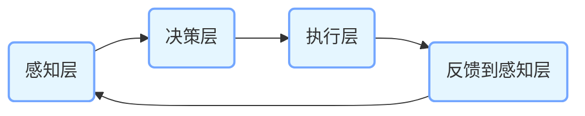

# AI Agent在智能制造中的应用

> 关键词：AI Agent、智能制造、智能决策、自主协作、生产优化

> 摘要：本文深入探讨了AI Agent在智能制造中的应用。首先介绍了相关背景，包括目的范围、预期读者等内容。接着阐述了AI Agent和智能制造的核心概念及联系，详细讲解了其核心算法原理和具体操作步骤，并给出了数学模型和公式。通过项目实战案例展示了AI Agent在实际中的应用，分析了其在不同场景下的应用情况。同时推荐了学习AI Agent和智能制造相关的工具和资源，最后总结了未来发展趋势与挑战，解答了常见问题并提供了扩展阅读和参考资料，旨在为读者全面呈现AI Agent在智能制造领域的应用全貌。

## 1. 背景介绍 
### 1.1 目的和范围
随着制造业向智能化转型的趋势日益明显，AI Agent作为一种具有自主决策和交互能力的智能实体，为智能制造带来了新的发展机遇。本文的目的在于全面介绍AI Agent在智能制造中的应用，涵盖从理论基础到实际应用的各个方面。具体范围包括AI Agent的核心概念、算法原理、在智能制造中的数学模型、实际项目案例以及未来发展趋势等内容。通过本文的阐述，读者能够深入了解AI Agent如何在智能制造中发挥作用，以及如何将其应用到实际生产中。

### 1.2 预期读者
本文预期读者包括智能制造领域的从业者，如工程师、技术人员、管理人员等，他们可以从本文中获取AI Agent应用的技术细节和实践经验，为实际工作提供参考。同时，也适合对人工智能和智能制造感兴趣的科研人员、学生，帮助他们了解该领域的前沿知识和研究方向。此外，企业决策者可以通过本文了解AI Agent在智能制造中的潜在价值，为企业的战略规划提供依据。

### 1.3 文档结构概述
本文将按照以下结构进行阐述：首先介绍AI Agent和智能制造的背景知识，包括目的范围、预期读者、文档结构概述和术语表。接着详细讲解核心概念与联系，通过文本示意图和Mermaid流程图展示其原理和架构。然后阐述核心算法原理和具体操作步骤，使用Python源代码进行详细说明。之后介绍数学模型和公式，并通过举例进行详细讲解。再通过项目实战案例展示AI Agent在智能制造中的具体应用，包括开发环境搭建、源代码实现和代码解读。随后分析AI Agent在智能制造中的实际应用场景。接着推荐相关的学习资源、开发工具框架和论文著作。最后总结未来发展趋势与挑战，解答常见问题并提供扩展阅读和参考资料。

### 1.4 术语表
#### 1.4.1 核心术语定义
- **AI Agent（人工智能代理）**：是一种能够感知环境、根据感知信息进行决策并采取行动的智能实体。它可以自主地与环境进行交互，以实现特定的目标。
- **智能制造**：是一种基于新一代信息技术，贯穿于设计、生产、管理、服务等制造活动各个环节，具有信息深度自感知、智慧优化自决策、精准控制自执行等功能的先进制造过程、系统与模式的总称。
- **多Agent系统（Multi - Agent System，MAS）**：由多个AI Agent组成的系统，这些Agent之间可以进行通信、协作和竞争，以实现共同的或各自的目标。

#### 1.4.2 相关概念解释
- **自主决策**：AI Agent能够根据自身的感知信息和内置的决策机制，独立地做出决策，而不需要人工干预。
- **智能协作**：多个AI Agent之间通过通信和协调，共同完成复杂的任务，提高生产效率和质量。
- **生产优化**：通过AI Agent的应用，对生产过程中的各种参数和资源进行优化配置，以提高生产效率、降低成本、提高产品质量。

#### 1.4.3 缩略词列表
- **MAS**：Multi - Agent System（多Agent系统）
- **PLC**：Programmable Logic Controller（可编程逻辑控制器）
- **SCADA**：Supervisory Control and Data Acquisition（监控与数据采集系统）

## 2. 核心概念与联系 

### 核心概念原理
AI Agent是一种具有自主性、反应性、社会性和主动性的智能实体。自主性意味着它能够独立地感知环境并做出决策；反应性表示它能够对环境的变化做出及时的响应；社会性体现为它可以与其他Agent进行通信和协作；主动性则是指它能够主动地采取行动以实现自身的目标。

在智能制造中，AI Agent可以应用于多个层面。例如，在生产设备层面，AI Agent可以作为设备的智能控制器，实时监测设备的运行状态，根据生产需求自主调整设备的参数。在生产计划层面，AI Agent可以根据订单信息、库存情况和设备状态，制定最优的生产计划。在供应链层面，AI Agent可以与供应商和客户的Agent进行交互，实现供应链的协同管理。

### 架构的文本示意图
AI Agent在智能制造中的架构可以分为三层：感知层、决策层和执行层。

感知层负责收集生产过程中的各种数据，包括设备状态、原材料库存、生产进度等。这些数据可以通过传感器、PLC、SCADA等设备获取。感知层将收集到的数据传输给决策层。

决策层是AI Agent的核心部分，它根据感知层提供的数据，运用各种算法和模型进行分析和决策。决策层可以采用机器学习、深度学习、规则推理等方法，以实现智能决策。决策层将决策结果发送给执行层。

执行层负责根据决策层的指令，控制生产设备的运行，调整生产参数，实现生产过程的自动化和智能化。执行层可以通过工业机器人、自动化生产线等设备实现。

### Mermaid流程图


该流程图展示了AI Agent在智能制造中的工作流程。感知层收集数据并将其传输给决策层，决策层进行分析和决策后将指令发送给执行层，执行层执行指令并将执行结果反馈到感知层，形成一个闭环的反馈系统。

## 3. 核心算法原理 & 具体操作步骤 

### 核心算法原理
在AI Agent的决策过程中，常用的算法包括强化学习算法。强化学习是一种通过智能体与环境进行交互，不断尝试不同的行动，并根据环境反馈的奖励信号来学习最优策略的方法。

以Q - learning算法为例，Q - learning是一种无模型的强化学习算法，它通过学习一个动作价值函数$Q(s,a)$来确定在状态$s$下采取动作$a$的价值。Q - learning的更新公式为：

$$Q(s_t,a_t) \leftarrow Q(s_t,a_t) + \alpha [r_{t+1} + \gamma \max_{a} Q(s_{t+1},a) - Q(s_t,a_t)]$$

其中，$s_t$是当前状态，$a_t$是当前动作，$r_{t+1}$是执行动作$a_t$后获得的奖励，$\alpha$是学习率，$\gamma$是折扣因子。

### 具体操作步骤
以下是使用Python实现Q - learning算法的具体操作步骤：

```python
import numpy as np

# 定义环境
class Environment:
    def __init__(self):
        # 状态空间
        self.states = np.arange(0, 10)
        # 动作空间
        self.actions = [-1, 1]
        # 初始状态
        self.current_state = np.random.choice(self.states)
        # 目标状态
        self.goal_state = 9

    def step(self, action):
        # 根据动作更新状态
        next_state = self.current_state + action
        # 确保状态在状态空间内
        next_state = np.clip(next_state, 0, len(self.states) - 1)
        # 计算奖励
        if next_state == self.goal_state:
            reward = 10
        else:
            reward = -1
        # 更新当前状态
        self.current_state = next_state
        # 判断是否到达目标状态
        done = (next_state == self.goal_state)
        return next_state, reward, done

# 定义Q - learning智能体
class QLearningAgent:
    def __init__(self, env, learning_rate=0.1, discount_factor=0.9):
        self.env = env
        self.learning_rate = learning_rate
        self.discount_factor = discount_factor
        # 初始化Q表
        self.q_table = np.zeros((len(env.states), len(env.actions)))

    def choose_action(self, state):
        # 探索与利用平衡
        if np.random.uniform(0, 1) < 0.1:
            # 随机选择动作
            action = np.random.choice(self.env.actions)
        else:
            # 选择Q值最大的动作
            action_index = np.argmax(self.q_table[state])
            action = self.env.actions[action_index]
        return action

    def learn(self, state, action, reward, next_state):
        # 获取动作索引
        action_index = self.env.actions.index(action)
        # 根据Q - learning更新公式更新Q表
        max_q_next = np.max(self.q_table[next_state])
        self.q_table[state, action_index] += self.learning_rate * (
            reward + self.discount_factor * max_q_next - self.q_table[state, action_index]
        )

# 训练智能体
def train_agent():
    env = Environment()
    agent = QLearningAgent(env)
    num_episodes = 1000
    for episode in range(num_episodes):
        state = env.current_state
        done = False
        while not done:
            action = agent.choose_action(state)
            next_state, reward, done = env.step(action)
            agent.learn(state, action, reward, next_state)
            state = next_state
    return agent

# 测试智能体
def test_agent(agent):
    env = Environment()
    state = env.current_state
    done = False
    steps = 0
    while not done:
        action = agent.choose_action(state)
        next_state, _, done = env.step(action)
        state = next_state
        steps += 1
    print(f"到达目标状态所需步数: {steps}")

# 训练并测试智能体
agent = train_agent()
test_agent(agent)
```

### 代码解释
1. **环境类（Environment）**：定义了状态空间、动作空间、初始状态和目标状态。`step`方法根据当前动作更新状态，计算奖励，并判断是否到达目标状态。
2. **Q - learning智能体类（QLearningAgent）**：初始化Q表，实现了选择动作和学习的方法。`choose_action`方法根据探索与利用平衡策略选择动作，`learn`方法根据Q - learning更新公式更新Q表。
3. **训练函数（train_agent）**：创建环境和智能体，进行多轮训练，每一轮训练中智能体与环境进行交互，不断更新Q表。
4. **测试函数（test_agent）**：使用训练好的智能体进行测试，记录到达目标状态所需的步数。

## 4. 数学模型和公式 & 详细讲解 & 举例说明 

### 数学模型和公式
在智能制造中，AI Agent的决策过程可以用马尔可夫决策过程（Markov Decision Process，MDP）来建模。MDP是一个五元组$(S,A,P,R,\gamma)$，其中：
- $S$是有限的状态集合，表示生产过程中的各种状态，如设备状态、库存状态等。
- $A$是有限的动作集合，表示AI Agent可以采取的动作，如调整设备参数、安排生产任务等。
- $P(s'|s,a)$是状态转移概率，表示在状态$s$下采取动作$a$后转移到状态$s'$的概率。
- $R(s,a,s')$是奖励函数，表示在状态$s$下采取动作$a$转移到状态$s'$时获得的奖励。
- $\gamma \in [0,1]$是折扣因子，用于权衡当前奖励和未来奖励的重要性。

智能体的目标是找到一个最优策略$\pi^*: S \to A$，使得长期累积奖励最大化，即：

$$V^{\pi^*}(s) = \max_{\pi} \mathbb{E} \left[ \sum_{t=0}^{\infty} \gamma^t R(s_t,a_t,s_{t+1}) | s_0 = s, \pi \right]$$

其中，$V^{\pi^*}(s)$是状态$s$的最优价值函数。

### 详细讲解
马尔可夫决策过程的核心思想是智能体在每个状态下根据策略选择动作，环境根据状态转移概率转移到下一个状态，并给予相应的奖励。智能体的目标是通过不断地与环境交互，学习到最优策略，使得长期累积奖励最大。

折扣因子$\gamma$的作用是权衡当前奖励和未来奖励的重要性。当$\gamma$接近1时，智能体更注重未来的奖励；当$\gamma$接近0时，智能体更注重当前的奖励。

### 举例说明
假设一个智能制造场景中，有一台设备的状态可以分为正常和故障两种状态，即$S = \{正常, 故障\}$。智能体可以采取的动作有继续运行和维修两种，即$A = \{继续运行, 维修\}$。

状态转移概率和奖励函数如下：
- 如果设备正常且继续运行，有90%的概率保持正常，获得奖励10；有10%的概率发生故障，获得奖励 - 50。
- 如果设备正常且维修，有100%的概率保持正常，获得奖励 - 10。
- 如果设备故障且继续运行，有100%的概率保持故障，获得奖励 - 100。
- 如果设备故障且维修，有80%的概率恢复正常，获得奖励 - 20；有20%的概率仍然故障，获得奖励 - 50。

折扣因子$\gamma = 0.9$。

智能体的目标是找到一个最优策略，使得长期累积奖励最大。通过求解马尔可夫决策过程，可以得到在不同状态下的最优动作。例如，在设备正常状态下，继续运行可能是最优动作；在设备故障状态下，维修可能是最优动作。

## 5. 项目实战：代码实际案例和详细解释说明 

### 5.1  开发环境搭建
在进行AI Agent在智能制造中的项目实战时，需要搭建相应的开发环境。以下是具体的步骤：

#### 硬件环境
- **服务器**：选择一台性能较好的服务器，如配备多核CPU、大容量内存和高速硬盘的服务器，以满足模型训练和数据处理的需求。
- **传感器**：根据实际生产需求，安装各种传感器，如温度传感器、压力传感器、振动传感器等，用于收集生产设备的运行数据。
- **工业机器人**：如果项目涉及到自动化生产，需要安装工业机器人，并进行相应的编程和调试。

#### 软件环境
- **操作系统**：选择适合的操作系统，如Linux（如Ubuntu）或Windows Server。
- **编程语言**：使用Python作为主要的编程语言，因为Python具有丰富的机器学习和人工智能库。
- **开发框架**：安装TensorFlow、PyTorch等深度学习框架，以及OpenAI Gym等强化学习环境库。
- **数据库**：使用MySQL、MongoDB等数据库来存储生产数据和模型参数。

### 5.2  源代码详细实现和代码解读
以下是一个简单的AI Agent在智能制造中的项目实战案例，用于设备故障预测。

```python
import numpy as np
import pandas as pd
from sklearn.model_selection import train_test_split
from sklearn.ensemble import RandomForestClassifier
from sklearn.metrics import accuracy_score

# 加载数据
def load_data(file_path):
    data = pd.read_csv(file_path)
    X = data.drop('fault', axis=1)
    y = data['fault']
    return X, y

# 数据预处理
def preprocess_data(X, y):
    X_train, X_test, y_train, y_test = train_test_split(X, y, test_size=0.2, random_state=42)
    return X_train, X_test, y_train, y_test

# 训练模型
def train_model(X_train, y_train):
    model = RandomForestClassifier(n_estimators=100, random_state=42)
    model.fit(X_train, y_train)
    return model

# 测试模型
def test_model(model, X_test, y_test):
    y_pred = model.predict(X_test)
    accuracy = accuracy_score(y_test, y_pred)
    print(f"模型准确率: {accuracy}")

# 主函数
def main():
    file_path = 'device_data.csv'
    X, y = load_data(file_path)
    X_train, X_test, y_train, y_test = preprocess_data(X, y)
    model = train_model(X_train, y_train)
    test_model(model, X_test, y_test)

if __name__ == "__main__":
    main()
```

### 代码解读与分析
1. **加载数据（load_data）**：使用`pandas`库读取CSV文件，将特征数据和标签数据分离。
2. **数据预处理（preprocess_data）**：使用`sklearn`库的`train_test_split`函数将数据集划分为训练集和测试集，测试集占比为20%。
3. **训练模型（train_model）**：使用随机森林分类器作为模型，设置树的数量为100，训练模型。
4. **测试模型（test_model）**：使用训练好的模型对测试集进行预测，计算预测准确率。
5. **主函数（main）**：调用上述函数，完成数据加载、预处理、模型训练和测试的整个流程。

通过这个项目实战案例，可以实现设备故障的预测，为智能制造中的设备维护提供决策支持。

## 6. 实际应用场景 
### 生产过程优化
AI Agent可以实时监测生产过程中的各种参数，如温度、压力、速度等，并根据预设的规则和模型进行分析和决策。例如，在化工生产中，AI Agent可以根据反应釜内的温度和压力变化，自动调整进料速度和加热功率，以保证反应的稳定性和产品质量。

### 设备故障预测与维护
通过对设备的运行数据进行实时监测和分析，AI Agent可以预测设备的故障发生概率，并提前安排维护计划。例如，在工业机器人的运行过程中，AI Agent可以根据机器人的振动、电流等参数，预测机器人的零部件是否需要更换，从而减少设备的停机时间和维修成本。

### 供应链协同管理
AI Agent可以与供应商和客户的Agent进行通信和协作，实现供应链的协同管理。例如，在原材料采购方面，AI Agent可以根据生产计划和库存情况，自动向供应商发送采购订单，并跟踪订单的执行情况。在产品配送方面，AI Agent可以根据客户的需求和物流信息，优化配送路线和配送时间，提高客户满意度。

### 质量控制
AI Agent可以在生产过程中实时检测产品的质量，及时发现次品和不合格品，并采取相应的措施。例如，在电子产品的生产线上，AI Agent可以通过图像识别技术检测产品的外观缺陷，通过传感器检测产品的性能参数，确保产品质量符合标准。

## 7. 工具和资源推荐
### 7.1 学习资源推荐
#### 7.1.1 书籍推荐
- 《人工智能：一种现代的方法》（Artificial Intelligence: A Modern Approach）：这本书是人工智能领域的经典教材，全面介绍了人工智能的基本概念、算法和应用。
- 《强化学习：原理与Python实现》：详细介绍了强化学习的基本原理和算法，并通过Python代码实现了多个强化学习案例。
- 《智能制造：原理、技术与应用》：系统阐述了智能制造的基本概念、技术体系和应用案例，为读者了解智能制造提供了全面的参考。

#### 7.1.2 在线课程
- Coursera上的“人工智能基础”课程：由知名高校的教授授课，内容涵盖人工智能的基本概念、机器学习、深度学习等方面。
- edX上的“强化学习”课程：深入讲解了强化学习的理论和算法，并通过实际案例进行演示。
- 中国大学MOOC上的“智能制造技术”课程：介绍了智能制造的关键技术和应用实践，适合初学者学习。

#### 7.1.3 技术博客和网站
- Medium：上面有很多关于人工智能和智能制造的技术文章和案例分享。
- Towards Data Science：专注于数据科学和人工智能领域的技术博客，提供了很多有价值的技术文章和教程。
- 智能制造网：专门提供智能制造领域的最新资讯、技术动态和应用案例。

### 7.2 开发工具框架推荐
#### 7.2.1 IDE和编辑器
- PyCharm：是一款专业的Python集成开发环境，具有代码编辑、调试、版本控制等功能，适合Python开发。
- Visual Studio Code：是一款轻量级的代码编辑器，支持多种编程语言，具有丰富的插件扩展功能。

#### 7.2.2 调试和性能分析工具
- TensorBoard：是TensorFlow提供的可视化工具，可以用于调试和分析深度学习模型的训练过程和性能。
- Py-Spy：是一个用于分析Python程序性能的工具，可以帮助开发者找出程序中的性能瓶颈。

#### 7.2.3 相关框架和库
- TensorFlow：是一个开源的深度学习框架，提供了丰富的工具和接口，用于构建和训练深度学习模型。
- PyTorch：是另一个流行的深度学习框架，具有动态图和易于使用的特点，适合研究和开发。
- OpenAI Gym：是一个用于开发和比较强化学习算法的工具包，提供了多种模拟环境。

### 7.3 相关论文著作推荐
#### 7.3.1 经典论文
- “Reinforcement Learning: A Survey”：这篇论文是强化学习领域的经典综述，全面介绍了强化学习的基本概念、算法和应用。
- “Mastering the Game of Go with Deep Neural Networks and Tree Search”：介绍了AlphaGo的实现原理，展示了深度学习和强化学习在复杂游戏中的应用。

#### 7.3.2 最新研究成果
- 在IEEE Transactions on Industrial Informatics、Journal of Manufacturing Systems等期刊上可以找到关于AI Agent在智能制造中的最新研究成果。
- 在国际人工智能会议（如AAAI、IJCAI）和智能制造会议（如IEEE International Conference on Automation Science and Engineering）上也有很多相关的研究论文。

#### 7.3.3 应用案例分析
- 一些企业和研究机构会发布关于AI Agent在智能制造中的应用案例分析报告，这些报告可以帮助读者了解实际应用中的经验和挑战。例如，西门子、博世等公司的官方网站上会有相关的应用案例分享。

## 8. 总结：未来发展趋势与挑战
### 未来发展趋势
- **深度融合**：AI Agent将与物联网、大数据、云计算等技术深度融合，实现更加智能化的生产和管理。例如，通过物联网技术收集更多的生产数据，利用大数据分析和云计算的强大计算能力，为AI Agent提供更准确的决策依据。
- **多Agent协作**：多Agent系统将得到更广泛的应用，多个AI Agent之间可以进行更加高效的协作和通信，共同完成复杂的生产任务。例如，在智能制造车间中，多个机器人Agent可以协同工作，实现自动化生产线的高效运行。
- **自主学习和进化**：AI Agent将具备更强的自主学习和进化能力，能够根据环境的变化和新的数据不断调整自己的决策策略。例如，在面对新的生产工艺和产品需求时，AI Agent可以快速学习并适应，提高生产的灵活性和适应性。

### 挑战
- **数据安全和隐私**：在智能制造中，大量的生产数据和敏感信息需要传输和存储，数据安全和隐私保护面临着巨大的挑战。例如，黑客可能会攻击生产系统，窃取企业的核心数据和商业机密。
- **算法可解释性**：一些复杂的AI算法，如深度学习算法，具有较高的黑盒性，难以解释其决策过程和结果。在智能制造中，需要对AI Agent的决策进行解释，以确保决策的可靠性和可信任性。
- **标准和规范**：目前，AI Agent在智能制造中的应用还缺乏统一的标准和规范，不同企业和系统之间的兼容性和互操作性较差。需要制定相关的标准和规范，促进AI Agent在智能制造中的推广和应用。

## 9. 附录：常见问题与解答
### 问题1：AI Agent与传统的自动化系统有什么区别？
解答：传统的自动化系统通常是基于预设的规则和程序进行运行，缺乏自主决策和学习能力。而AI Agent具有自主性、反应性、社会性和主动性，能够根据环境的变化和自身的经验进行决策和学习，具有更强的适应性和灵活性。

### 问题2：如何评估AI Agent在智能制造中的性能？
解答：可以从多个方面评估AI Agent在智能制造中的性能，如生产效率、产品质量、设备利用率、成本降低等。可以通过对比引入AI Agent前后的生产数据，计算相应的指标变化来评估性能。同时，还可以考虑AI Agent的决策准确性、响应速度等指标。

### 问题3：AI Agent在智能制造中的应用需要哪些技术基础？
解答：需要掌握人工智能、机器学习、深度学习、强化学习等相关技术，同时还需要了解物联网、大数据、云计算等技术。此外，还需要具备一定的数学基础，如概率论、线性代数等。

### 问题4：如何确保AI Agent在智能制造中的安全性？
解答：可以从多个方面确保AI Agent在智能制造中的安全性。首先，要加强数据安全和隐私保护，采用加密技术对数据进行加密传输和存储。其次，要对AI Agent的算法和模型进行安全评估和验证，防止出现漏洞和恶意攻击。此外，还可以建立安全监控和预警机制，及时发现和处理安全问题。

## 10. 扩展阅读 & 参考资料
### 扩展阅读
- 《工业4.0：即将来袭的第四次工业革命》：深入介绍了工业4.0的概念、技术和应用，为理解AI Agent在智能制造中的应用背景提供了帮助。
- 《智能工厂：从数字化车间走向智能制造》：详细阐述了智能工厂的建设和发展，包括智能生产系统、智能物流系统等方面的内容。

### 参考资料
- IEEE Transactions on Industrial Informatics、Journal of Manufacturing Systems等学术期刊上的相关论文。
- 国际人工智能会议（如AAAI、IJCAI）和智能制造会议（如IEEE International Conference on Automation Science and Engineering）的会议论文集。
- 西门子、博世等企业的官方网站上的技术文档和应用案例。