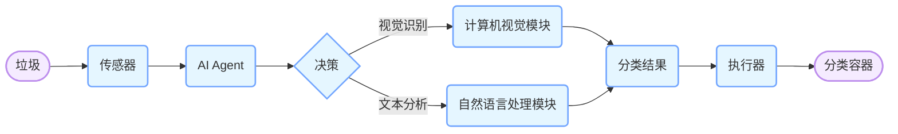

# AI Agent在智能垃圾分类系统中的实践

> 关键词：AI Agent、智能垃圾分类系统、计算机视觉、自然语言处理、机器学习

> 摘要：本文深入探讨了AI Agent在智能垃圾分类系统中的实践应用。首先介绍了研究的背景、目的、预期读者等信息，接着阐述了AI Agent和智能垃圾分类系统的核心概念及它们之间的联系，详细讲解了核心算法原理、数学模型和公式。通过实际的项目实战案例，展示了如何搭建开发环境、实现源代码并进行解读分析。同时，列举了AI Agent在智能垃圾分类系统中的实际应用场景，推荐了相关的学习资源、开发工具框架和论文著作。最后对未来的发展趋势与挑战进行了总结，并给出了常见问题的解答和扩展阅读参考资料，旨在为相关领域的研究者和开发者提供全面而深入的技术指导。

## 1. 背景介绍 
### 1.1 目的和范围
随着全球城市化进程的加速和人们生活水平的提高，垃圾产量日益增加，垃圾分类处理成为了环保领域的重要课题。传统的垃圾分类方式主要依赖人工，效率低下且容易出错。智能垃圾分类系统的出现为解决这一问题提供了新的途径。本文章的目的在于探讨AI Agent在智能垃圾分类系统中的具体实践，涵盖了从核心概念的阐述、算法原理的分析、数学模型的建立到实际项目的开发和应用场景的讨论等多个方面。通过对这些内容的研究，旨在为开发者提供一个全面的技术指南，促进智能垃圾分类系统的发展和应用。

### 1.2 预期读者
本文预期读者包括计算机科学、人工智能、环境科学等相关领域的研究者、开发者和学生。对于希望了解智能垃圾分类技术的环保工作者和对新兴技术应用感兴趣的普通读者也具有一定的参考价值。

### 1.3 文档结构概述
本文将按照以下结构进行阐述：首先介绍核心概念，包括AI Agent和智能垃圾分类系统的定义、原理和架构，并通过示意图和流程图进行直观展示；接着详细讲解核心算法原理和具体操作步骤，使用Python源代码进行说明；然后建立数学模型和公式，并通过具体例子进行讲解；随后进行项目实战，包括开发环境的搭建、源代码的实现和解读分析；之后列举实际应用场景；再推荐相关的工具和资源；最后对未来发展趋势与挑战进行总结，解答常见问题并提供扩展阅读参考资料。

### 1.4 术语表
#### 1.4.1 核心术语定义
- **AI Agent**：人工智能代理，是一种能够感知环境、进行决策并采取行动以实现特定目标的软件实体。它可以接收外部信息，通过内部的算法和模型进行推理和判断，然后输出相应的行动指令。
- **智能垃圾分类系统**：利用先进的技术手段，如计算机视觉、自然语言处理等，对垃圾进行自动识别和分类的系统。该系统可以提高垃圾分类的效率和准确性，减少人工干预。
- **计算机视觉**：是一门研究如何使机器“看”的科学，通过图像和视频处理技术，让计算机能够理解和分析视觉信息，例如识别物体、检测场景等。
- **自然语言处理**：研究人与计算机之间用自然语言进行有效通信的各种理论和方法，包括文本分类、语义理解、问答系统等。

#### 1.4.2 相关概念解释
- **机器学习**：是一门多领域交叉学科，涉及概率论、统计学、逼近论、凸分析、算法复杂度理论等多门学科。它专门研究计算机怎样模拟或实现人类的学习行为，以获取新的知识或技能，重新组织已有的知识结构使之不断改善自身的性能。在智能垃圾分类系统中，机器学习算法可以用于训练模型，实现对垃圾的分类识别。
- **深度学习**：是机器学习的一个分支领域，它基于人工神经网络，通过构建具有多个层次的神经网络模型，自动从大量数据中学习特征和模式。深度学习在图像识别、语音识别等领域取得了显著的成果，在智能垃圾分类系统中也有广泛的应用。

#### 1.4.3 缩略词列表
- **CNN**：Convolutional Neural Network，卷积神经网络，是一种专门为处理具有网格结构数据（如图像）而设计的深度学习模型。
- **NLP**：Natural Language Processing，自然语言处理。
- **API**：Application Programming Interface，应用程序编程接口，是一组定义、程序及协议的集合，通过 API 可以实现不同软件系统之间的交互和通信。

## 2. 核心概念与联系 

### 核心概念原理
#### AI Agent原理
AI Agent的基本原理是基于感知 - 决策 - 行动的循环。它通过传感器感知环境中的信息，例如在智能垃圾分类系统中，传感器可以是摄像头、激光雷达等，用于获取垃圾的图像、形状等信息。然后，AI Agent将感知到的信息输入到内部的决策模块，决策模块根据预设的规则、模型或算法进行推理和判断，确定应该采取的行动。最后，AI Agent通过执行器执行相应的行动，如控制机械臂将垃圾放入相应的分类容器中。

#### 智能垃圾分类系统原理
智能垃圾分类系统主要基于计算机视觉和自然语言处理技术。在计算机视觉方面，系统通过摄像头采集垃圾的图像，然后使用图像处理和深度学习算法对图像进行分析和识别，确定垃圾的类别。在自然语言处理方面，系统可以接收用户输入的文字描述，通过语义理解和文本分类算法判断垃圾的类别。同时，系统还可以结合传感器数据和历史分类记录，提高分类的准确性和效率。

### 架构示意图


### 联系说明
AI Agent是智能垃圾分类系统的核心组成部分，它负责协调和控制整个系统的运行。通过感知垃圾的信息，AI Agent利用计算机视觉和自然语言处理模块进行决策，确定垃圾的分类结果，然后控制执行器将垃圾放入相应的容器中。同时，智能垃圾分类系统为AI Agent提供了具体的应用场景和任务目标，促使AI Agent不断学习和优化，提高分类的准确性和效率。

## 3. 核心算法原理 & 具体操作步骤 

### 计算机视觉核心算法 - 卷积神经网络（CNN）原理
卷积神经网络是一种专门用于处理图像数据的深度学习模型，它通过卷积层、池化层和全连接层等组件，自动提取图像的特征并进行分类。

#### 卷积层
卷积层是CNN的核心组件，它通过卷积核（也称为滤波器）在输入图像上滑动，进行卷积操作，提取图像的局部特征。卷积操作可以表示为：

```python
import numpy as np

def convolution(image, kernel):
    image_height, image_width = image.shape
    kernel_height, kernel_width = kernel.shape
    output_height = image_height - kernel_height + 1
    output_width = image_width - kernel_width + 1
    output = np.zeros((output_height, output_width))
    for i in range(output_height):
        for j in range(output_width):
            output[i, j] = np.sum(image[i:i+kernel_height, j:j+kernel_width] * kernel)
    return output
```

#### 池化层
池化层用于降低特征图的维度，减少计算量，同时增强模型的鲁棒性。常见的池化操作有最大池化和平均池化。以下是最大池化的Python实现：

```python
def max_pooling(feature_map, pool_size):
    map_height, map_width = feature_map.shape
    output_height = map_height // pool_size
    output_width = map_width // pool_size
    output = np.zeros((output_height, output_width))
    for i in range(output_height):
        for j in range(output_width):
            output[i, j] = np.max(feature_map[i*pool_size:(i+1)*pool_size, j*pool_size:(j+1)*pool_size])
    return output
```

#### 全连接层
全连接层将卷积层和池化层提取的特征进行整合，然后通过激活函数进行非线性变换，最后输出分类结果。以下是一个简单的全连接层的Python实现：

```python
def fully_connected(inputs, weights, biases):
    return np.dot(inputs.flatten(), weights) + biases
```

### 自然语言处理核心算法 - 文本分类算法原理
文本分类算法用于将输入的文本划分为不同的类别。常见的文本分类算法有朴素贝叶斯、支持向量机和深度学习模型等。这里以朴素贝叶斯算法为例进行说明。

朴素贝叶斯算法基于贝叶斯定理和特征条件独立假设，通过计算文本属于各个类别的概率，选择概率最大的类别作为分类结果。以下是朴素贝叶斯算法的Python实现：

```python
import numpy as np
from collections import defaultdict

class NaiveBayes:
    def __init__(self):
        self.classes = None
        self.prior_prob = None
        self.cond_prob = None

    def fit(self, X, y):
        self.classes = np.unique(y)
        num_classes = len(self.classes)
        num_features = X.shape[1]
        self.prior_prob = np.zeros(num_classes)
        self.cond_prob = defaultdict(lambda: np.zeros(num_features))
        for i, c in enumerate(self.classes):
            X_c = X[y == c]
            self.prior_prob[i] = len(X_c) / len(X)
            for feature in range(num_features):
                self.cond_prob[c][feature] = (np.sum(X_c[:, feature]) + 1) / (len(X_c) + num_features)
        return self

    def predict(self, X):
        predictions = []
        for x in X:
            posteriors = []
            for i, c in enumerate(self.classes):
                prior = np.log(self.prior_prob[i])
                conditional = np.sum(np.log(self.cond_prob[c]) * x)
                posterior = prior + conditional
                posteriors.append(posterior)
            pred_class = self.classes[np.argmax(posteriors)]
            predictions.append(pred_class)
        return np.array(predictions)
```

### 具体操作步骤
1. **数据收集**：收集垃圾的图像数据和文本描述数据，用于训练模型。
2. **数据预处理**：对图像数据进行归一化、裁剪、缩放等操作，对文本数据进行分词、去除停用词等处理。
3. **模型训练**：使用预处理后的数据训练CNN模型和文本分类模型。
4. **模型评估**：使用测试数据评估模型的性能，如准确率、召回率、F1值等。
5. **部署和应用**：将训练好的模型部署到智能垃圾分类系统中，实现垃圾的自动分类。

## 4. 数学模型和公式 & 详细讲解 & 举例说明 

### 卷积神经网络数学模型
#### 卷积操作公式
卷积操作可以表示为：
$$
y_{i,j} = \sum_{m=0}^{M-1} \sum_{n=0}^{N-1} x_{i+m,j+n} \cdot k_{m,n}
$$
其中，$x$ 是输入图像，$k$ 是卷积核，$y$ 是卷积结果，$M$ 和 $N$ 分别是卷积核的高度和宽度。

#### 池化操作公式
最大池化操作可以表示为：
$$
y_{i,j} = \max_{m=0}^{P-1} \max_{n=0}^{P-1} x_{iP+m,jP+n}
$$
其中，$x$ 是输入特征图，$P$ 是池化窗口的大小，$y$ 是池化结果。

#### 全连接层公式
全连接层的输出可以表示为：
$$
y = \sigma(Wx + b)
$$
其中，$x$ 是输入向量，$W$ 是权重矩阵，$b$ 是偏置向量，$\sigma$ 是激活函数，如ReLU函数：
$$
\sigma(x) = \max(0, x)
$$

### 朴素贝叶斯数学模型
#### 贝叶斯定理
贝叶斯定理可以表示为：
$$
P(C|X) = \frac{P(X|C)P(C)}{P(X)}
$$
其中，$P(C|X)$ 是在给定特征 $X$ 的条件下，类别 $C$ 的后验概率；$P(X|C)$ 是在类别 $C$ 的条件下，特征 $X$ 的条件概率；$P(C)$ 是类别 $C$ 的先验概率；$P(X)$ 是特征 $X$ 的先验概率。

#### 朴素贝叶斯分类公式
在朴素贝叶斯算法中，假设特征之间相互独立，则：
$$
P(C_k|X) = \frac{P(X|C_k)P(C_k)}{P(X)} \approx P(C_k) \prod_{i=1}^{n} P(x_i|C_k)
$$
其中，$C_k$ 是第 $k$ 个类别，$X = (x_1, x_2, \cdots, x_n)$ 是特征向量。分类结果为：
$$
\hat{C} = \arg \max_{C_k} P(C_k) \prod_{i=1}^{n} P(x_i|C_k)
$$

### 举例说明
#### 卷积操作举例
假设输入图像 $x$ 是一个 $3 \times 3$ 的矩阵：
$$
x = \begin{bmatrix}
1 & 2 & 3 \\
4 & 5 & 6 \\
7 & 8 & 9
\end{bmatrix}
$$
卷积核 $k$ 是一个 $2 \times 2$ 的矩阵：
$$
k = \begin{bmatrix}
1 & 0 \\
0 & 1
\end{bmatrix}
$$
则卷积结果 $y$ 为：
$$
y = \begin{bmatrix}
1\times1 + 2\times0 + 4\times0 + 5\times1 & 2\times1 + 3\times0 + 5\times0 + 6\times1 \\
4\times1 + 5\times0 + 7\times0 + 8\times1 & 5\times1 + 6\times0 + 8\times0 + 9\times1
\end{bmatrix} = \begin{bmatrix}
6 & 8 \\
12 & 14
\end{bmatrix}
$$

#### 朴素贝叶斯分类举例
假设有一个文本分类任务，有两个类别 $C_1$ 和 $C_2$，特征向量 $X = (x_1, x_2)$。已知：
- $P(C_1) = 0.6$，$P(C_2) = 0.4$
- $P(x_1|C_1) = 0.3$，$P(x_2|C_1) = 0.7$
- $P(x_1|C_2) = 0.8$，$P(x_2|C_2) = 0.2$

则：
$$
P(C_1|X) \approx P(C_1)P(x_1|C_1)P(x_2|C_1) = 0.6\times0.3\times0.7 = 0.126
$$
$$
P(C_2|X) \approx P(C_2)P(x_1|C_2)P(x_2|C_2) = 0.4\times0.8\times0.2 = 0.064
$$
因为 $P(C_1|X) > P(C_2|X)$，所以分类结果为 $C_1$。

## 5. 项目实战：代码实际案例和详细解释说明 

### 5.1  开发环境搭建
#### 硬件环境
- 服务器：可以选择云服务器或本地服务器，建议配置至少 8GB 内存和 1TB 硬盘空间。
- 摄像头：用于采集垃圾的图像，建议选择高清摄像头。
- 机械臂：用于将垃圾放入相应的分类容器中，可根据实际需求选择合适的机械臂。

#### 软件环境
- 操作系统：可以选择 Linux 系统，如 Ubuntu 18.04 或更高版本。
- 编程语言：Python 3.6 或更高版本。
- 深度学习框架：TensorFlow 或 PyTorch。
- 开发工具：Jupyter Notebook 或 PyCharm。

### 5.2  源代码详细实现和代码解读
#### 图像分类代码实现
```python
import tensorflow as tf
from tensorflow.keras import layers, models

# 构建CNN模型
def build_cnn_model():
    model = models.Sequential([
        layers.Conv2D(32, (3, 3), activation='relu', input_shape=(150, 150, 3)),
        layers.MaxPooling2D((2, 2)),
        layers.Conv2D(64, (3, 3), activation='relu'),
        layers.MaxPooling2D((2, 2)),
        layers.Conv2D(128, (3, 3), activation='relu'),
        layers.MaxPooling2D((2, 2)),
        layers.Flatten(),
        layers.Dense(128, activation='relu'),
        layers.Dense(4, activation='softmax')  # 假设分为4类垃圾
    ])
    model.compile(optimizer='adam',
                  loss='categorical_crossentropy',
                  metrics=['accuracy'])
    return model

# 数据加载和预处理
train_datagen = tf.keras.preprocessing.image.ImageDataGenerator(
    rescale=1./255,
    shear_range=0.2,
    zoom_range=0.2,
    horizontal_flip=True
)

test_datagen = tf.keras.preprocessing.image.ImageDataGenerator(rescale=1./255)

train_generator = train_datagen.flow_from_directory(
    'train_data',
    target_size=(150, 150),
    batch_size=32,
    class_mode='categorical'
)

test_generator = test_datagen.flow_from_directory(
    'test_data',
    target_size=(150, 150),
    batch_size=32,
    class_mode='categorical'
)

# 训练模型
model = build_cnn_model()
model.fit(
    train_generator,
    steps_per_epoch=train_generator.samples // train_generator.batch_size,
    epochs=10,
    validation_data=test_generator,
    validation_steps=test_generator.samples // test_generator.batch_size
)
```

#### 代码解读
- `build_cnn_model` 函数：构建了一个简单的CNN模型，包含三个卷积层、三个池化层、一个全连接层和一个输出层。使用 `categorical_crossentropy` 作为损失函数，`adam` 作为优化器。
- 数据加载和预处理：使用 `ImageDataGenerator` 对图像数据进行预处理，包括归一化、剪切、缩放和水平翻转等操作。通过 `flow_from_directory` 函数从指定目录加载训练数据和测试数据。
- 模型训练：使用 `fit` 函数对模型进行训练，指定训练数据、训练步数、训练轮数和验证数据等参数。

#### 文本分类代码实现
```python
import numpy as np
from sklearn.feature_extraction.text import TfidfVectorizer
from sklearn.naive_bayes import MultinomialNB
from sklearn.model_selection import train_test_split

# 示例数据
texts = ["这是一个塑料瓶", "这是一个香蕉皮", "这是一个旧报纸", "这是一个电池"]
labels = ["可回收物", "厨余垃圾", "可回收物", "有害垃圾"]

# 数据预处理
vectorizer = TfidfVectorizer()
X = vectorizer.fit_transform(texts)
y = np.array(labels)

# 划分训练集和测试集
X_train, X_test, y_train, y_test = train_test_split(X, y, test_size=0.2, random_state=42)

# 训练模型
model = MultinomialNB()
model.fit(X_train, y_train)

# 模型评估
accuracy = model.score(X_test, y_test)
print(f"模型准确率: {accuracy}")
```

#### 代码解读
- 数据预处理：使用 `TfidfVectorizer` 将文本数据转换为 TF-IDF 特征向量。
- 划分训练集和测试集：使用 `train_test_split` 函数将数据划分为训练集和测试集，测试集占比为 20%。
- 模型训练：使用 `MultinomialNB` 训练朴素贝叶斯分类模型。
- 模型评估：使用 `score` 函数计算模型在测试集上的准确率。

### 5.3  代码解读与分析
#### 图像分类代码分析
- **优点**：CNN 模型能够自动提取图像的特征，具有较高的分类准确率。使用数据增强技术可以增加训练数据的多样性，提高模型的泛化能力。
- **缺点**：训练时间较长，需要大量的计算资源。模型的可解释性较差，难以理解模型是如何进行分类决策的。

#### 文本分类代码分析
- **优点**：朴素贝叶斯算法简单易懂，训练速度快，对小规模数据有较好的效果。
- **缺点**：假设特征之间相互独立，在实际应用中可能不成立，导致分类准确率下降。对文本数据的特征提取比较简单，不能充分利用文本的语义信息。

## 6. 实际应用场景 
### 家庭智能垃圾分类
在家庭中安装智能垃圾分类设备，通过摄像头和传感器识别垃圾的种类，然后通过语音提示或手机应用告知用户如何进行分类。同时，设备可以连接到互联网，将分类数据上传到云端，方便用户查看分类记录和环保数据。

### 公共场所智能垃圾分类
在商场、学校、公园等公共场所设置智能垃圾分类垃圾桶，通过AI Agent实时监测垃圾桶的状态，当垃圾桶快满时自动通知清洁人员进行清理。同时，对投放的垃圾进行实时分类识别，对不正确的分类行为进行提醒和纠正。

### 垃圾处理厂智能垃圾分类
在垃圾处理厂，使用AI Agent和机器人技术对垃圾进行自动化分类和处理。通过计算机视觉和机器学习算法，快速准确地识别垃圾的种类，然后控制机器人将垃圾分拣到不同的处理线上，提高垃圾处理的效率和质量。

## 7. 工具和资源推荐
### 7.1 学习资源推荐
#### 7.1.1 书籍推荐
- 《深度学习》（Deep Learning）：由 Ian Goodfellow、Yoshua Bengio 和 Aaron Courville 所著，是深度学习领域的经典教材，涵盖了深度学习的基本概念、算法和应用。
- 《Python 机器学习》（Python Machine Learning）：由 Sebastian Raschka 和 Vahid Mirjalili 所著，介绍了使用 Python 进行机器学习的方法和技巧，包括数据预处理、模型选择、评估和优化等内容。
- 《计算机视觉：算法与应用》（Computer Vision: Algorithms and Applications）：由 Richard Szeliski 所著，详细介绍了计算机视觉的基本算法和应用，包括图像滤波、特征提取、目标检测和识别等内容。

#### 7.1.2 在线课程
- Coursera 上的“深度学习专项课程”（Deep Learning Specialization）：由 Andrew Ng 教授授课，包括神经网络和深度学习、改善深层神经网络、结构化机器学习项目、卷积神经网络和序列模型等五门课程，是学习深度学习的优质资源。
- edX 上的“计算机视觉基础”（Foundations of Computer Vision）：由 University of Washington 提供，介绍了计算机视觉的基本概念、算法和应用，包括图像表示、特征提取、目标检测和识别等内容。
- 网易云课堂上的“自然语言处理实战”：介绍了自然语言处理的基本概念、算法和应用，包括文本分类、情感分析、机器翻译等内容，通过实际项目案例进行讲解，具有较强的实践性。

#### 7.1.3 技术博客和网站
- Medium：是一个技术博客平台，上面有很多关于人工智能、机器学习和计算机视觉的优质文章。
- Towards Data Science：是一个专注于数据科学和机器学习的技术博客，提供了很多实用的教程和案例。
- arXiv：是一个预印本数据库，上面有很多最新的学术论文，包括人工智能、机器学习和计算机视觉等领域的研究成果。

### 7.2 开发工具框架推荐
#### 7.2.1 IDE和编辑器
- PyCharm：是一款专门为 Python 开发设计的集成开发环境，具有代码编辑、调试、版本控制等功能，支持多种 Python 框架和库。
- Jupyter Notebook：是一个交互式的开发环境，支持多种编程语言，包括 Python、R 和 Julia 等。可以在浏览器中编写代码、运行代码和展示结果，非常适合数据分析和机器学习的开发。
- Visual Studio Code：是一款轻量级的代码编辑器，支持多种编程语言和插件扩展。具有代码高亮、智能提示、调试等功能，适合快速开发和调试代码。

#### 7.2.2 调试和性能分析工具
- TensorBoard：是 TensorFlow 提供的一个可视化工具，可以用于可视化模型的训练过程、损失函数和准确率等指标，帮助开发者调试和优化模型。
- PyTorch Profiler：是 PyTorch 提供的一个性能分析工具，可以用于分析模型的计算时间、内存使用情况等，帮助开发者优化模型的性能。
- cProfile：是 Python 标准库中的一个性能分析工具，可以用于分析 Python 代码的执行时间和函数调用次数，帮助开发者找出代码中的性能瓶颈。

#### 7.2.3 相关框架和库
- TensorFlow：是一个开源的深度学习框架，由 Google 开发和维护。提供了丰富的深度学习模型和工具，支持多种硬件平台，包括 CPU、GPU 和 TPU。
- PyTorch：是一个开源的深度学习框架，由 Facebook 开发和维护。具有动态图机制，易于使用和调试，广泛应用于学术界和工业界。
- Scikit-learn：是一个开源的机器学习库，提供了丰富的机器学习算法和工具，包括分类、回归、聚类、降维等。具有简单易用的 API，适合初学者和快速开发。

### 7.3 相关论文著作推荐
#### 7.3.1 经典论文
- LeCun, Y., Bottou, L., Bengio, Y., & Haffner, P. (1998). Gradient-based learning applied to document recognition. Proceedings of the IEEE, 86(11), 2278-2324. 介绍了卷积神经网络在文档识别中的应用，是 CNN 领域的经典论文。
- Krizhevsky, A., Sutskever, I., & Hinton, G. E. (2012). ImageNet classification with deep convolutional neural networks. Advances in neural information processing systems, 25. 介绍了 AlexNet 模型在 ImageNet 图像分类竞赛中的应用，开启了深度学习在计算机视觉领域的热潮。
- McCallum, A., & Nigam, K. (1998, July). A comparison of event models for naive bayes text classification. In AAAI-98 workshop on learning for text categorization (Vol. 752, pp. 41-48). 比较了不同的事件模型在朴素贝叶斯文本分类中的应用，是文本分类领域的经典论文。

#### 7.3.2 最新研究成果
- He, K., Zhang, X., Ren, S., & Sun, J. (2016). Deep residual learning for image recognition. In Proceedings of the IEEE conference on computer vision and pattern recognition (pp. 770-778). 介绍了残差网络（ResNet）的原理和应用，是计算机视觉领域的重要研究成果。
- Vaswani, A., Shazeer, N., Parmar, N., Uszkoreit, J., Jones, L., Gomez, A. N.,... & Polosukhin, I. (2017). Attention is all you need. Advances in neural information processing systems, 30. 介绍了 Transformer 模型的原理和应用，是自然语言处理领域的重要研究成果。
- Redmon, J., & Farhadi, A. (2018). YOLOv3: An incremental improvement. arXiv preprint arXiv:1804.02767. 介绍了 YOLOv3 目标检测模型的原理和应用，是计算机视觉领域的最新研究成果。

#### 7.3.3 应用案例分析
- Chen, Y., Zhang, J., & Yang, Q. (2019). Intelligent waste classification system based on deep learning. In 2019 IEEE International Conference on Mechatronics and Automation (ICMA) (pp. 1665-1670). 介绍了基于深度学习的智能垃圾分类系统的设计和实现，包括数据采集、模型训练和系统部署等方面。
- Li, X., Wang, Y., & Zhang, Y. (2020). A survey of intelligent waste sorting technologies. Journal of Cleaner Production, 259, 120872. 对智能垃圾分类技术进行了综述，包括传感器技术、计算机视觉技术、机器学习技术等方面，并分析了不同技术的优缺点和应用场景。

## 8. 总结：未来发展趋势与挑战
### 未来发展趋势
#### 多模态融合
未来的智能垃圾分类系统将不仅仅依赖于图像识别和文本分析，还将融合声音、气味等多种模态的信息，提高分类的准确性和可靠性。例如，通过声音传感器可以识别垃圾的材质，通过气味传感器可以检测垃圾是否含有有害物质。

#### 智能化升级
随着人工智能技术的不断发展，AI Agent将变得更加智能和自主。它可以通过自我学习和优化，不断提高分类的效率和准确性。同时，智能垃圾分类系统可以与其他智能设备和系统进行集成，实现更加智能化的管理和控制。

#### 大数据应用
利用大数据技术，可以对垃圾分类数据进行分析和挖掘，了解用户的分类行为和习惯，为环保政策的制定和推广提供数据支持。同时，大数据还可以用于预测垃圾的产生量和分类情况，提前做好垃圾处理的准备工作。

### 挑战
#### 数据质量和多样性
智能垃圾分类系统的性能很大程度上依赖于训练数据的质量和多样性。目前，垃圾分类数据的收集和标注工作还面临着一些困难，数据的质量和多样性有待提高。例如，不同地区的垃圾分类标准可能不同，导致数据的标注存在差异。

#### 模型可解释性
深度学习模型在智能垃圾分类系统中取得了很好的效果，但这些模型的可解释性较差，难以理解模型是如何进行分类决策的。在一些对安全性和可靠性要求较高的应用场景中，模型的可解释性是一个重要的问题。

#### 成本和维护
智能垃圾分类系统的建设和维护成本较高，包括硬件设备的采购、软件系统的开发和维护等方面。同时，系统的稳定性和可靠性也需要得到保障，需要投入大量的人力和物力进行维护和管理。

## 9. 附录：常见问题与解答
### 问题1：如何提高智能垃圾分类系统的分类准确率？
解答：可以从以下几个方面提高分类准确率：
- 增加训练数据的数量和多样性，包括不同角度、不同光照条件下的垃圾图像和各种类型的文本描述。
- 使用更先进的深度学习模型和算法，如 ResNet、EfficientNet 等。
- 采用多模态融合的方法，结合图像、文本、声音等多种信息进行分类。
- 对模型进行持续的训练和优化，根据实际应用中的反馈不断调整模型参数。

### 问题2：智能垃圾分类系统在实际应用中可能会遇到哪些问题？
解答：可能会遇到以下问题：
- 光照条件变化、垃圾遮挡等因素会影响图像识别的准确率。
- 不同地区的垃圾分类标准不同，需要对系统进行定制化开发。
- 系统的稳定性和可靠性需要得到保障，避免出现故障和错误分类。
- 用户对系统的操作不熟悉，可能会导致分类不准确。

### 问题3：如何选择适合的深度学习框架？
解答：选择适合的深度学习框架需要考虑以下因素：
- 学习成本：不同的框架有不同的学习曲线，初学者可以选择简单易用的框架，如 TensorFlow 和 PyTorch。
- 功能和性能：不同的框架在功能和性能上有所差异，需要根据具体的应用场景选择合适的框架。例如，TensorFlow 适合大规模的工业应用，PyTorch 适合学术研究和快速开发。
- 社区支持：选择有活跃社区支持的框架，可以方便地获取相关的文档、教程和代码示例，遇到问题也可以及时得到帮助。

## 10. 扩展阅读 & 参考资料
### 扩展阅读
- 《人工智能：现代方法》（Artificial Intelligence: A Modern Approach）：由 Stuart Russell 和 Peter Norvig 所著，是人工智能领域的经典教材，涵盖了人工智能的基本概念、算法和应用。
- 《机器人学导论》（Introduction to Robotics: Mechanics and Control）：由 John J. Craig 所著，介绍了机器人学的基本概念、运动学、动力学和控制等内容，对于理解智能垃圾分类系统中的机械臂控制有很大帮助。
- 《数据挖掘：概念与技术》（Data Mining: Concepts and Techniques）：由 Jiawei Han、Jian Pei 和 Jinyan Wang 所著，介绍了数据挖掘的基本概念、算法和应用，对于分析垃圾分类数据有很大帮助。

### 参考资料
- TensorFlow 官方文档：https://www.tensorflow.org/
- PyTorch 官方文档：https://pytorch.org/
- Scikit-learn 官方文档：https://scikit-learn.org/
- 中国垃圾分类标准：https://www.mee.gov.cn/
- 相关学术论文和研究报告，可以通过学术数据库如 IEEE Xplore、ACM Digital Library、ScienceDirect 等进行查找。