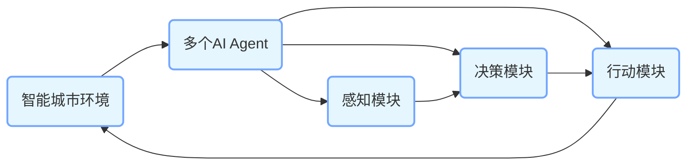

# AI Agent在智能城市规划模拟中的角色

> 关键词：AI Agent、智能城市规划模拟、多智能体系统、城市模型、决策支持

> 摘要：本文深入探讨了AI Agent在智能城市规划模拟中的角色。首先介绍了研究的背景、目的、预期读者、文档结构和相关术语。接着阐述了AI Agent的核心概念及其与智能城市规划模拟的联系，包括原理和架构。详细讲解了核心算法原理，并用Python代码进行示例。给出了相关的数学模型和公式，并举例说明。通过项目实战，展示了代码的实际案例和详细解释。分析了AI Agent在智能城市规划模拟中的实际应用场景。推荐了学习资源、开发工具框架和相关论文著作。最后总结了未来发展趋势与挑战，提供了常见问题与解答以及扩展阅读和参考资料，旨在全面剖析AI Agent在智能城市规划模拟中的重要作用和价值。

## 1. 背景介绍 
### 1.1 目的和范围
随着城市化进程的加速，城市面临着人口增长、资源短缺、环境恶化等诸多挑战。智能城市规划模拟作为一种有效的手段，能够帮助城市规划者预测和评估不同规划方案的效果，从而做出更科学、合理的决策。AI Agent作为一种具有自主决策和行为能力的智能实体，在智能城市规划模拟中发挥着越来越重要的作用。本文的目的是深入探讨AI Agent在智能城市规划模拟中的角色，包括其原理、算法、应用场景等方面，为相关领域的研究和实践提供参考。

本文的范围主要涵盖了AI Agent的基本概念、核心算法原理、数学模型、项目实战以及实际应用场景等方面。同时，还推荐了相关的学习资源、开发工具框架和论文著作，以帮助读者进一步深入学习和研究。

### 1.2 预期读者
本文的预期读者包括城市规划专业人员、计算机科学研究人员、人工智能爱好者以及对智能城市规划模拟感兴趣的相关人士。城市规划专业人员可以通过本文了解AI Agent在城市规划模拟中的应用，为实际规划工作提供新的思路和方法；计算机科学研究人员可以深入研究AI Agent的算法和模型，推动相关技术的发展；人工智能爱好者可以通过本文了解AI Agent在实际领域的应用，拓宽知识面；对智能城市规划模拟感兴趣的相关人士可以通过本文了解该领域的最新动态和发展趋势。

### 1.3 文档结构概述
本文共分为10个部分，具体结构如下：
1. **背景介绍**：介绍研究的目的、范围、预期读者、文档结构和相关术语。
2. **核心概念与联系**：阐述AI Agent的核心概念及其与智能城市规划模拟的联系，包括原理和架构。
3. **核心算法原理 & 具体操作步骤**：详细讲解核心算法原理，并用Python代码进行示例。
4. **数学模型和公式 & 详细讲解 & 举例说明**：给出相关的数学模型和公式，并举例说明。
5. **项目实战：代码实际案例和详细解释说明**：通过项目实战，展示代码的实际案例和详细解释。
6. **实际应用场景**：分析AI Agent在智能城市规划模拟中的实际应用场景。
7. **工具和资源推荐**：推荐相关的学习资源、开发工具框架和论文著作。
8. **总结：未来发展趋势与挑战**：总结AI Agent在智能城市规划模拟中的未来发展趋势与挑战。
9. **附录：常见问题与解答**：提供常见问题的解答。
10. **扩展阅读 & 参考资料**：提供扩展阅读和参考资料。

### 1.4 术语表
#### 1.4.1 核心术语定义
- **AI Agent**：即人工智能智能体，是一种能够感知环境、自主决策并采取行动的智能实体。
- **智能城市规划模拟**：利用计算机技术和模型对城市的发展和规划进行模拟和预测的过程。
- **多智能体系统（MAS）**：由多个AI Agent组成的系统，这些Agent之间可以进行交互和协作。
- **城市模型**：对城市的物理、社会、经济等方面进行抽象和建模的数学模型。
- **决策支持**：为决策者提供信息和分析，帮助其做出更科学、合理的决策的过程。

#### 1.4.2 相关概念解释
- **感知**：AI Agent通过传感器等设备获取环境信息的过程。
- **决策**：AI Agent根据感知到的信息和自身的目标，选择合适的行动方案的过程。
- **行动**：AI Agent根据决策结果，对环境进行改变的过程。
- **交互**：多个AI Agent之间进行信息交换和协作的过程。
- **协作**：多个AI Agent为了实现共同的目标而进行合作的过程。

#### 1.4.3 缩略词列表
- **AI**：Artificial Intelligence，人工智能
- **MAS**：Multi-Agent System，多智能体系统
- **GIS**：Geographic Information System，地理信息系统
- **ML**：Machine Learning，机器学习
- **RL**：Reinforcement Learning，强化学习

## 2. 核心概念与联系 
### 2.1 AI Agent的基本概念
AI Agent是一种具有自主决策和行为能力的智能实体，它可以感知环境中的信息，并根据这些信息做出决策，采取相应的行动。AI Agent通常由三个部分组成：感知模块、决策模块和行动模块。感知模块负责获取环境信息，决策模块根据感知到的信息和自身的目标，选择合适的行动方案，行动模块根据决策结果，对环境进行改变。

AI Agent具有以下特点：
- **自主性**：AI Agent可以在没有外界干预的情况下，自主地感知环境、决策和行动。
- **反应性**：AI Agent能够对环境的变化做出及时的反应。
- **社会性**：AI Agent可以与其他Agent进行交互和协作，共同完成任务。
- **目标导向性**：AI Agent有自己的目标，并会采取行动来实现这些目标。

### 2.2 AI Agent与智能城市规划模拟的联系
在智能城市规划模拟中，城市可以被看作是一个复杂的系统，由多个不同的组成部分（如居民、企业、交通系统等）组成。每个组成部分都可以被抽象为一个AI Agent，这些Agent之间相互作用，共同影响城市的发展和变化。通过模拟这些Agent的行为和交互，可以预测城市的未来发展趋势，评估不同规划方案的效果。

例如，在交通规划模拟中，可以将每一辆汽车看作一个AI Agent，这些Agent根据交通规则和自身的目的地，自主地选择行驶路线。通过模拟这些汽车的行驶行为，可以预测交通流量的变化，评估不同交通规划方案的效果。

### 2.3 核心概念原理和架构的文本示意图
下面是AI Agent在智能城市规划模拟中的核心概念原理和架构的文本示意图：

```plaintext
智能城市环境
|
|-- 多个AI Agent（居民、企业、交通系统等）
|   |-- 感知模块（获取环境信息）
|   |-- 决策模块（根据信息和目标做出决策）
|   |-- 行动模块（采取行动改变环境）
|
|-- 环境反馈（Agent行动对环境的影响）
```

### 2.4 Mermaid流程图


这个流程图展示了AI Agent在智能城市规划模拟中的基本工作流程。智能城市环境为AI Agent提供了运行的背景，AI Agent通过感知模块获取环境信息，决策模块根据这些信息做出决策，行动模块根据决策结果采取行动，行动的结果又会反馈到智能城市环境中，从而影响环境的变化。

## 3. 核心算法原理 & 具体操作步骤 
### 3.1 核心算法原理
在智能城市规划模拟中，常用的AI Agent算法包括机器学习算法和强化学习算法。下面分别介绍这两种算法的原理。

#### 3.1.1 机器学习算法
机器学习算法是一种让计算机通过数据学习模式和规律的算法。在智能城市规划模拟中，可以使用机器学习算法来预测城市的发展趋势和评估规划方案的效果。例如，可以使用决策树算法来对城市居民的行为进行分类和预测，使用神经网络算法来对城市的交通流量进行预测。

决策树算法的基本原理是根据数据的特征，将数据划分为不同的类别。决策树由节点和边组成，节点表示特征或类别，边表示特征的取值。决策树的构建过程是一个递归的过程，通过不断地选择最优的特征和特征取值，将数据划分为不同的子集，直到每个子集只包含一个类别。

神经网络算法是一种模仿人类神经系统的算法，由多个神经元组成。神经网络可以通过训练来学习数据的模式和规律，从而实现对数据的预测和分类。神经网络的训练过程是一个迭代的过程，通过不断地调整神经元之间的连接权重，使得神经网络的输出结果与实际结果之间的误差最小。

#### 3.1.2 强化学习算法
强化学习算法是一种让智能体通过与环境进行交互，不断地尝试和学习，以获得最大奖励的算法。在智能城市规划模拟中，可以使用强化学习算法来优化城市的规划方案。例如，可以使用Q学习算法来优化城市的交通信号控制策略，使用策略梯度算法来优化城市的土地利用规划。

Q学习算法的基本原理是通过不断地尝试不同的行动，更新Q值（即行动价值），从而找到最优的行动策略。Q值表示在某个状态下采取某个行动所获得的期望奖励。Q学习算法的更新公式为：

$$Q(s,a) = Q(s,a) + \alpha [r + \gamma \max_{a'} Q(s',a') - Q(s,a)]$$

其中，$Q(s,a)$ 表示在状态 $s$ 下采取行动 $a$ 的Q值，$\alpha$ 是学习率，$r$ 是即时奖励，$\gamma$ 是折扣因子，$s'$ 是下一个状态，$\max_{a'} Q(s',a')$ 表示在下一个状态下采取最优行动的Q值。

策略梯度算法的基本原理是通过直接优化策略函数，使得智能体在环境中获得最大的累积奖励。策略函数表示在某个状态下采取某个行动的概率。策略梯度算法的更新公式为：

$$\theta = \theta + \alpha \nabla_{\theta} J(\theta)$$

其中，$\theta$ 是策略函数的参数，$\alpha$ 是学习率，$\nabla_{\theta} J(\theta)$ 是策略函数的梯度，$J(\theta)$ 是策略函数的目标函数，表示智能体在环境中获得的累积奖励。

### 3.2 具体操作步骤
下面以Q学习算法为例，介绍AI Agent在智能城市规划模拟中的具体操作步骤。

#### 3.2.1 定义状态和行动
首先，需要定义智能体所处的状态和可以采取的行动。在智能城市规划模拟中，状态可以包括城市的人口密度、交通流量、环境质量等，行动可以包括建设新的基础设施、调整交通信号控制策略等。

#### 3.2.2 初始化Q值表
初始化一个Q值表，用于存储在每个状态下采取每个行动的Q值。Q值表的初始值可以设为0。

#### 3.2.3 智能体与环境交互
智能体在环境中不断地尝试不同的行动，并根据环境的反馈获得即时奖励。根据Q学习算法的更新公式，更新Q值表。

#### 3.2.4 选择最优行动
根据更新后的Q值表，选择在当前状态下Q值最大的行动作为最优行动。

#### 3.2.5 重复步骤3和4
不断地重复步骤3和4，直到智能体找到最优的行动策略。

### 3.3 Python源代码示例
```python
import numpy as np

# 定义状态和行动的数量
num_states = 5
num_actions = 3

# 初始化Q值表
Q = np.zeros((num_states, num_actions))

# 定义学习率和折扣因子
alpha = 0.1
gamma = 0.9

# 定义奖励函数
rewards = np.array([
    [1, 0, 0],
    [0, 1, 0],
    [0, 0, 1],
    [1, 0, 0],
    [0, 1, 0]
])

# 定义智能体与环境交互的次数
num_episodes = 100

# 开始训练
for episode in range(num_episodes):
    # 随机选择一个初始状态
    state = np.random.randint(0, num_states)
    
    # 智能体与环境交互
    for step in range(10):
        # 选择行动
        action = np.argmax(Q[state, :])
        
        # 获取即时奖励
        reward = rewards[state, action]
        
        # 获取下一个状态
        next_state = np.random.randint(0, num_states)
        
        # 更新Q值表
        Q[state, action] = Q[state, action] + alpha * (reward + gamma * np.max(Q[next_state, :]) - Q[state, action])
        
        # 更新当前状态
        state = next_state

# 输出最终的Q值表
print("Final Q-table:")
print(Q)
```

### 3.4 代码解释
1. **定义状态和行动的数量**：`num_states` 和 `num_actions` 分别表示状态和行动的数量。
2. **初始化Q值表**：`Q` 是一个二维数组，用于存储在每个状态下采取每个行动的Q值。
3. **定义学习率和折扣因子**：`alpha` 是学习率，`gamma` 是折扣因子。
4. **定义奖励函数**：`rewards` 是一个二维数组，用于存储在每个状态下采取每个行动所获得的即时奖励。
5. **定义智能体与环境交互的次数**：`num_episodes` 表示智能体与环境交互的次数。
6. **开始训练**：在每个训练周期中，智能体随机选择一个初始状态，然后不断地选择行动、获取即时奖励、更新Q值表，直到达到最大步数。
7. **输出最终的Q值表**：训练结束后，输出最终的Q值表。

## 4. 数学模型和公式 & 详细讲解 & 举例说明 
### 4.1 机器学习算法的数学模型和公式
#### 4.1.1 决策树算法
决策树算法的核心是选择最优的特征和特征取值，将数据划分为不同的子集。常用的特征选择方法有信息增益、信息增益率和基尼指数等。

##### 信息增益
信息增益是衡量特征对数据分类能力的指标，定义为数据集的熵减去在该特征下各子集的加权熵。数据集的熵定义为：

$$H(D) = -\sum_{i=1}^{k} p_i \log_2 p_i$$

其中，$D$ 是数据集，$k$ 是数据集的类别数，$p_i$ 是第 $i$ 类样本在数据集中所占的比例。

在特征 $A$ 下，数据集 $D$ 的信息增益定义为：

$$IG(D,A) = H(D) - \sum_{v=1}^{V} \frac{|D^v|}{|D|} H(D^v)$$

其中，$V$ 是特征 $A$ 的取值数，$D^v$ 是特征 $A$ 取值为 $v$ 的子集，$|D^v|$ 是子集 $D^v$ 的样本数，$|D|$ 是数据集 $D$ 的样本数。

##### 举例说明
假设有一个数据集 $D$，包含10个样本，分为2类，其中第1类有6个样本，第2类有4个样本。则数据集 $D$ 的熵为：

$$H(D) = -\frac{6}{10} \log_2 \frac{6}{10} - \frac{4}{10} \log_2 \frac{4}{10} \approx 0.971$$

假设有一个特征 $A$，有2个取值，取值为 $v_1$ 的子集 $D^{v_1}$ 包含4个样本，其中第1类有3个样本，第2类有1个样本；取值为 $v_2$ 的子集 $D^{v_2}$ 包含6个样本，其中第1类有3个样本，第2类有3个样本。则子集 $D^{v_1}$ 的熵为：

$$H(D^{v_1}) = -\frac{3}{4} \log_2 \frac{3}{4} - \frac{1}{4} \log_2 \frac{1}{4} \approx 0.811$$

子集 $D^{v_2}$ 的熵为：

$$H(D^{v_2}) = -\frac{3}{6} \log_2 \frac{3}{6} - \frac{3}{6} \log_2 \frac{3}{6} = 1$$

则在特征 $A$ 下，数据集 $D$ 的信息增益为：

$$IG(D,A) = 0.971 - \frac{4}{10} \times 0.811 - \frac{6}{10} \times 1 \approx 0.127$$

#### 4.1.2 神经网络算法
神经网络算法的核心是通过训练来调整神经元之间的连接权重，使得神经网络的输出结果与实际结果之间的误差最小。常用的训练算法有梯度下降算法和反向传播算法。

##### 梯度下降算法
梯度下降算法是一种迭代的优化算法，通过不断地沿着目标函数的负梯度方向更新参数，使得目标函数的值逐渐减小。假设目标函数为 $J(\theta)$，参数为 $\theta$，则梯度下降算法的更新公式为：

$$\theta = \theta - \alpha \nabla_{\theta} J(\theta)$$

其中，$\alpha$ 是学习率，$\nabla_{\theta} J(\theta)$ 是目标函数 $J(\theta)$ 关于参数 $\theta$ 的梯度。

##### 反向传播算法
反向传播算法是一种用于计算神经网络中参数梯度的算法。它通过前向传播计算神经网络的输出结果，然后通过反向传播计算输出结果与实际结果之间的误差，并根据误差更新神经元之间的连接权重。

### 4.2 强化学习算法的数学模型和公式
#### 4.2.1 Q学习算法
Q学习算法的核心是通过不断地尝试不同的行动，更新Q值（即行动价值），从而找到最优的行动策略。Q学习算法的更新公式为：

$$Q(s,a) = Q(s,a) + \alpha [r + \gamma \max_{a'} Q(s',a') - Q(s,a)]$$

其中，$Q(s,a)$ 表示在状态 $s$ 下采取行动 $a$ 的Q值，$\alpha$ 是学习率，$r$ 是即时奖励，$\gamma$ 是折扣因子，$s'$ 是下一个状态，$\max_{a'} Q(s',a')$ 表示在下一个状态下采取最优行动的Q值。

##### 举例说明
假设智能体处于状态 $s_1$，采取行动 $a_1$ 后获得即时奖励 $r = 1$，下一个状态为 $s_2$。在状态 $s_2$ 下，采取行动 $a_2$ 的Q值为 $Q(s_2,a_2) = 0.5$，采取行动 $a_3$ 的Q值为 $Q(s_2,a_3) = 0.3$。则在下一个状态下采取最优行动的Q值为 $\max_{a'} Q(s_2,a') = 0.5$。假设学习率 $\alpha = 0.1$，折扣因子 $\gamma = 0.9$，在状态 $s_1$ 下采取行动 $a_1$ 的Q值为 $Q(s_1,a_1) = 0.2$。则更新后的Q值为：

$$Q(s_1,a_1) = 0.2 + 0.1 \times [1 + 0.9 \times 0.5 - 0.2] = 0.2 + 0.1 \times [1 + 0.45 - 0.2] = 0.2 + 0.1 \times 1.25 = 0.325$$

#### 4.2.2 策略梯度算法
策略梯度算法的核心是通过直接优化策略函数，使得智能体在环境中获得最大的累积奖励。策略梯度算法的更新公式为：

$$\theta = \theta + \alpha \nabla_{\theta} J(\theta)$$

其中，$\theta$ 是策略函数的参数，$\alpha$ 是学习率，$\nabla_{\theta} J(\theta)$ 是策略函数的梯度，$J(\theta)$ 是策略函数的目标函数，表示智能体在环境中获得的累积奖励。

## 5. 项目实战：代码实际案例和详细解释说明 
### 5.1 开发环境搭建
#### 5.1.1 安装Python
首先，需要安装Python。可以从Python官方网站（https://www.python.org/downloads/）下载适合自己操作系统的Python安装包，并按照安装向导进行安装。

#### 5.1.2 安装必要的库
在智能城市规划模拟中，常用的库有NumPy、Pandas、Matplotlib等。可以使用以下命令安装这些库：

```sh
pip install numpy pandas matplotlib
```

### 5.2 源代码详细实现和代码解读
下面是一个简单的智能城市规划模拟的项目实战案例，使用Q学习算法来优化城市的交通信号控制策略。

```python
import numpy as np
import matplotlib.pyplot as plt

# 定义状态和行动的数量
num_states = 4  # 假设城市有4个路口
num_actions = 2  # 假设每个路口有2种信号控制策略

# 初始化Q值表
Q = np.zeros((num_states, num_actions))

# 定义学习率和折扣因子
alpha = 0.1
gamma = 0.9

# 定义奖励函数
rewards = np.array([
    [1, 0],
    [0, 1],
    [1, 0],
    [0, 1]
])

# 定义智能体与环境交互的次数
num_episodes = 100

# 记录每个训练周期的总奖励
total_rewards = []

# 开始训练
for episode in range(num_episodes):
    # 随机选择一个初始状态
    state = np.random.randint(0, num_states)
    
    # 初始化当前训练周期的总奖励
    episode_reward = 0
    
    # 智能体与环境交互
    for step in range(10):
        # 选择行动
        action = np.argmax(Q[state, :])
        
        # 获取即时奖励
        reward = rewards[state, action]
        
        # 获取下一个状态
        next_state = np.random.randint(0, num_states)
        
        # 更新Q值表
        Q[state, action] = Q[state, action] + alpha * (reward + gamma * np.max(Q[next_state, :]) - Q[state, action])
        
        # 更新当前状态
        state = next_state
        
        # 累加当前训练周期的总奖励
        episode_reward += reward
    
    # 记录当前训练周期的总奖励
    total_rewards.append(episode_reward)

# 输出最终的Q值表
print("Final Q-table:")
print(Q)

# 绘制每个训练周期的总奖励曲线
plt.plot(total_rewards)
plt.xlabel('Episode')
plt.ylabel('Total Reward')
plt.title('Total Reward per Episode')
plt.show()
```

### 5.3 代码解读与分析
#### 5.3.1 定义状态和行动的数量
`num_states` 表示城市的路口数量，`num_actions` 表示每个路口的信号控制策略数量。

#### 5.3.2 初始化Q值表
`Q` 是一个二维数组，用于存储在每个状态下采取每个行动的Q值。

#### 5.3.3 定义学习率和折扣因子
`alpha` 是学习率，`gamma` 是折扣因子。

#### 5.3.4 定义奖励函数
`rewards` 是一个二维数组，用于存储在每个状态下采取每个行动所获得的即时奖励。

#### 5.3.5 定义智能体与环境交互的次数
`num_episodes` 表示智能体与环境交互的次数。

#### 5.3.6 记录每个训练周期的总奖励
`total_rewards` 是一个列表，用于记录每个训练周期的总奖励。

#### 5.3.7 开始训练
在每个训练周期中，智能体随机选择一个初始状态，然后不断地选择行动、获取即时奖励、更新Q值表，直到达到最大步数。同时，累加当前训练周期的总奖励，并记录下来。

#### 5.3.8 输出最终的Q值表
训练结束后，输出最终的Q值表。

#### 5.3.9 绘制每个训练周期的总奖励曲线
使用Matplotlib库绘制每个训练周期的总奖励曲线，以便观察智能体的学习过程。

通过分析总奖励曲线，可以判断智能体是否在不断地学习和优化。如果总奖励曲线呈现上升趋势，说明智能体在不断地学习和优化；如果总奖励曲线趋于平稳，说明智能体已经找到了最优的行动策略。

## 6. 实际应用场景 
### 6.1 交通规划模拟
在交通规划模拟中，AI Agent可以模拟车辆、行人等交通参与者的行为，预测交通流量的变化，评估不同交通规划方案的效果。例如，可以将每一辆汽车看作一个AI Agent，这些Agent根据交通规则和自身的目的地，自主地选择行驶路线。通过模拟这些汽车的行驶行为，可以预测交通流量的变化，评估不同交通规划方案的效果。同时，AI Agent还可以用于优化交通信号控制策略，提高交通效率。

### 6.2 土地利用规划模拟
在土地利用规划模拟中，AI Agent可以模拟居民、企业等土地使用者的行为，预测土地利用的变化，评估不同土地利用规划方案的效果。例如，可以将每个居民看作一个AI Agent，这些Agent根据自身的需求和偏好，选择合适的居住地点。通过模拟这些居民的居住行为，可以预测土地利用的变化，评估不同土地利用规划方案的效果。同时，AI Agent还可以用于优化土地资源的配置，提高土地利用效率。

### 6.3 环境规划模拟
在环境规划模拟中，AI Agent可以模拟污染源、生态系统等环境要素的行为，预测环境质量的变化，评估不同环境规划方案的效果。例如，可以将每个污染源看作一个AI Agent，这些Agent根据自身的生产活动和环保要求，排放污染物。通过模拟这些污染源的排放行为，可以预测环境质量的变化，评估不同环境规划方案的效果。同时，AI Agent还可以用于优化环境治理策略，提高环境质量。

### 6.4 公共服务设施规划模拟
在公共服务设施规划模拟中，AI Agent可以模拟居民对公共服务设施的需求和使用行为，预测公共服务设施的使用情况，评估不同公共服务设施规划方案的效果。例如，可以将每个居民看作一个AI Agent，这些Agent根据自身的需求和偏好，选择合适的公共服务设施。通过模拟这些居民的使用行为，可以预测公共服务设施的使用情况，评估不同公共服务设施规划方案的效果。同时，AI Agent还可以用于优化公共服务设施的布局，提高公共服务设施的利用率。

## 7. 工具和资源推荐
### 7.1 学习资源推荐
#### 7.1.1 书籍推荐
- 《人工智能：一种现代的方法》（Artificial Intelligence: A Modern Approach）：这本书是人工智能领域的经典教材，全面介绍了人工智能的基本概念、算法和应用。
- 《机器学习》（Machine Learning）：这本书是机器学习领域的经典教材，详细介绍了机器学习的基本算法和模型。
- 《强化学习：原理与Python实现》（Reinforcement Learning: An Introduction）：这本书是强化学习领域的经典教材，详细介绍了强化学习的基本原理和算法。

#### 7.1.2 在线课程
- Coursera上的“人工智能基础”（Foundations of Artificial Intelligence）课程：该课程由哥伦比亚大学的教授授课，全面介绍了人工智能的基本概念、算法和应用。
- edX上的“机器学习”（Machine Learning）课程：该课程由斯坦福大学的教授授课，详细介绍了机器学习的基本算法和模型。
- Udemy上的“强化学习实战”（Reinforcement Learning in Action）课程：该课程由实战经验丰富的讲师授课，通过实际案例介绍了强化学习的应用。

#### 7.1.3 技术博客和网站
- Medium上的人工智能相关博客：Medium上有很多人工智能领域的优秀博客，涵盖了人工智能的各个方面。
- Towards Data Science：这是一个专注于数据科学和人工智能的网站，提供了很多优质的技术文章和教程。
- AI Stack Exchange：这是一个人工智能领域的问答社区，用户可以在这里提出问题、分享经验和学习知识。

### 7.2 开发工具框架推荐
#### 7.2.1 IDE和编辑器
- PyCharm：这是一款专业的Python集成开发环境，提供了丰富的功能和插件，适合开发Python项目。
- Jupyter Notebook：这是一个交互式的开发环境，适合进行数据探索和模型训练。
- Visual Studio Code：这是一款轻量级的代码编辑器，支持多种编程语言，提供了丰富的插件和扩展。

#### 7.2.2 调试和性能分析工具
- PDB：这是Python自带的调试工具，可以帮助开发者调试Python代码。
- cProfile：这是Python自带的性能分析工具，可以帮助开发者分析Python代码的性能瓶颈。
- TensorBoard：这是TensorFlow提供的可视化工具，可以帮助开发者可视化模型的训练过程和性能指标。

#### 7.2.3 相关框架和库
- NumPy：这是Python中用于科学计算的基础库，提供了高效的多维数组对象和数学函数。
- Pandas：这是Python中用于数据处理和分析的库，提供了高效的数据结构和数据操作方法。
- Scikit-learn：这是Python中用于机器学习的库，提供了丰富的机器学习算法和工具。
- TensorFlow：这是Google开发的深度学习框架，提供了高效的深度学习模型训练和部署工具。
- PyTorch：这是Facebook开发的深度学习框架，提供了灵活的深度学习模型构建和训练工具。

### 7.3 相关论文著作推荐
#### 7.3.1 经典论文
- “A Logical Calculus of the Ideas Immanent in Nervous Activity”（神经活动内在思想的逻辑演算）：这篇论文由Warren McCulloch和Walter Pitts于1943年发表，提出了人工神经网络的基本模型。
- “Learning Representations by Back-propagating Errors”（通过误差反向传播学习表示）：这篇论文由David Rumelhart、Geoffrey Hinton和Ronald Williams于1986年发表，提出了反向传播算法，推动了神经网络的发展。
- “Reinforcement Learning: A Survey”（强化学习综述）：这篇论文由Leslie Kaelbling、Michael Littman和Andrew Moore于1996年发表，对强化学习的基本概念、算法和应用进行了全面的综述。

#### 7.3.2 最新研究成果
- 关注顶级学术会议（如NeurIPS、ICML、CVPR等）上的最新研究成果，了解AI Agent在智能城市规划模拟领域的最新发展动态。
- 关注知名学术期刊（如Journal of Artificial Intelligence Research、Artificial Intelligence等）上的最新研究论文，深入学习相关的理论和方法。

#### 7.3.3 应用案例分析
- 参考相关的研究报告和案例分析，了解AI Agent在实际智能城市规划模拟项目中的应用情况和效果。
- 关注行业内的成功案例，学习他们的经验和做法，为自己的项目提供参考。

## 8. 总结：未来发展趋势与挑战
### 8.1 未来发展趋势
#### 8.1.1 多智能体系统的发展
随着智能城市的发展，城市中的各种实体（如居民、企业、交通系统等）将越来越多地被抽象为AI Agent，形成多智能体系统。多智能体系统可以实现各个Agent之间的交互和协作，共同完成城市规划和管理的任务。未来，多智能体系统将在智能城市规划模拟中发挥越来越重要的作用。

#### 8.1.2 与大数据和物联网的融合
大数据和物联网技术的发展为智能城市规划模拟提供了丰富的数据来源。通过将AI Agent与大数据和物联网技术相结合，可以实时获取城市的各种数据，如交通流量、环境质量、能源消耗等，从而更加准确地模拟城市的发展和变化。同时，AI Agent还可以根据实时数据进行实时决策和调整，提高城市规划和管理的效率和准确性。

#### 8.1.3 强化学习和深度学习的应用
强化学习和深度学习是人工智能领域的热门技术，它们在智能城市规划模拟中具有很大的应用潜力。强化学习可以帮助AI Agent在复杂的环境中学习最优的行动策略，深度学习可以帮助AI Agent处理和分析大量的复杂数据。未来，强化学习和深度学习将在智能城市规划模拟中得到更广泛的应用。

### 8.2 挑战
#### 8.2.1 数据质量和隐私问题
在智能城市规划模拟中，需要大量的城市数据来支持模型的训练和模拟。然而，这些数据的质量和隐私问题是一个挑战。数据质量不高可能会导致模型的准确性下降，数据隐私问题可能会引起居民的担忧和不满。因此，需要采取有效的措施来保证数据的质量和隐私。

#### 8.2.2 模型的可解释性和可靠性
AI Agent在智能城市规划模拟中通常使用复杂的模型，如神经网络和强化学习模型。这些模型的可解释性和可靠性是一个挑战。模型的可解释性差可能会导致决策者难以理解模型的决策过程和结果，模型的可靠性低可能会导致决策失误。因此，需要研究和开发可解释性和可靠性高的模型。

#### 8.2.3 多智能体系统的协调和管理
在多智能体系统中，各个Agent之间的协调和管理是一个挑战。不同的Agent可能有不同的目标和利益，如何协调各个Agent之间的行为，实现共同的目标，是一个需要解决的问题。同时，如何对多智能体系统进行有效的管理和监控，也是一个挑战。

## 9. 附录：常见问题与解答
### 9.1 AI Agent在智能城市规划模拟中的优势是什么？
AI Agent在智能城市规划模拟中的优势主要包括以下几点：
- **自主性**：AI Agent可以在没有外界干预的情况下，自主地感知环境、决策和行动，能够更好地模拟城市中各种实体的行为。
- **适应性**：AI Agent可以根据环境的变化实时调整自己的行为，能够更好地适应城市的动态变化。
- **交互性**：AI Agent可以与其他Agent进行交互和协作，能够更好地模拟城市中各种实体之间的相互作用。
- **预测性**：通过模拟AI Agent的行为和交互，可以预测城市的未来发展趋势，为城市规划和管理提供决策支持。

### 9.2 如何选择合适的AI Agent算法？
选择合适的AI Agent算法需要考虑以下几个因素：
- **问题的性质**：不同的问题需要不同的算法。例如，如果问题是分类问题，可以选择决策树算法、神经网络算法等；如果问题是优化问题，可以选择强化学习算法等。
- **数据的特点**：数据的特点也会影响算法的选择。例如，如果数据量较小，可以选择简单的算法；如果数据量较大，可以选择复杂的算法。
- **计算资源**：不同的算法需要不同的计算资源。例如，神经网络算法需要大量的计算资源，而决策树算法需要的计算资源相对较少。

### 9.3 如何评估AI Agent在智能城市规划模拟中的效果？
评估AI Agent在智能城市规划模拟中的效果可以从以下几个方面入手：
- **准确性**：评估AI Agent的预测结果与实际情况的符合程度。可以使用准确率、召回率、F1值等指标来评估。
- **稳定性**：评估AI Agent在不同环境下的性能稳定性。可以使用方差、标准差等指标来评估。
- **效率**：评估AI Agent的计算效率和时间复杂度。可以使用运行时间、内存占用等指标来评估。
- **可解释性**：评估AI Agent的决策过程和结果是否易于理解和解释。可以使用可视化等方法来评估。

### 9.4 如何解决AI Agent在智能城市规划模拟中的数据质量和隐私问题？
解决AI Agent在智能城市规划模拟中的数据质量和隐私问题可以采取以下措施：
- **数据清洗**：对采集到的数据进行清洗，去除噪声和错误数据，提高数据的质量。
- **数据加密**：对敏感数据进行加密处理，保证数据的隐私安全。
- **数据匿名化**：对数据进行匿名化处理，去除数据中的个人身份信息，保护居民的隐私。
- **数据共享和交换机制**：建立数据共享和交换机制，规范数据的使用和管理，保证数据的合法合规使用。

## 10. 扩展阅读 & 参考资料
### 10.1 扩展阅读
- 《智能城市：技术、应用与实践》（Smart Cities: Technology, Applications, and Practices）：这本书介绍了智能城市的基本概念、技术和应用，对智能城市规划模拟有一定的参考价值。
- 《城市模拟：方法与应用》（Urban Simulation: Methods and Applications）：这本书介绍了城市模拟的基本方法和应用，对AI Agent在智能城市规划模拟中的应用有一定的启发。
- 《多智能体系统：原理与应用》（Multi-Agent Systems: Principles and Applications）：这本书介绍了多智能体系统的基本原理和应用，对理解AI Agent在智能城市规划模拟中的角色有帮助。

### 10.2 参考资料
- McCarthy, J. (2007). What Is Artificial Intelligence? Stanford Artificial Intelligence Laboratory.
- Mitchell, T. M. (1997). Machine Learning. McGraw-Hill.
- Sutton, R. S., & Barto, A. G. (2018). Reinforcement Learning: An Introduction. MIT Press.
- Russell, S. J., & Norvig, P. (2020). Artificial Intelligence: A Modern Approach. Pearson. 