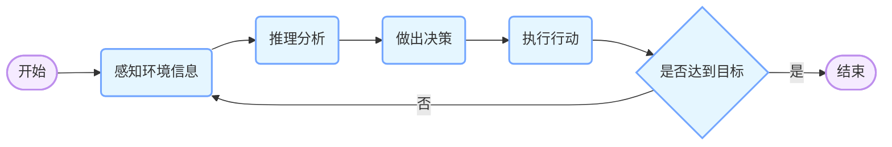

# AI Agent在智能工厂管理中的角色

> 关键词：AI Agent、智能工厂管理、自动化决策、任务调度、实时监控

> 摘要：本文深入探讨了AI Agent在智能工厂管理中的角色。从背景介绍出发，阐述了研究的目的、范围、预期读者等内容。接着详细解析了AI Agent的核心概念及其与智能工厂管理的联系，包括原理和架构，并给出相应的示意图和流程图。在算法原理部分，使用Python代码进行了详细阐述。同时介绍了相关的数学模型和公式，并通过举例说明。通过项目实战，展示了AI Agent在智能工厂管理中的具体应用，包括开发环境搭建、源代码实现和解读。还探讨了其实际应用场景，推荐了相关的学习资源、开发工具框架以及论文著作。最后总结了未来发展趋势与挑战，并给出常见问题解答和扩展阅读参考资料，旨在全面揭示AI Agent在智能工厂管理中的重要作用和应用前景。

## 1. 背景介绍 
### 1.1 目的和范围
随着制造业的快速发展，智能工厂逐渐成为未来工厂的发展方向。智能工厂管理涉及到生产计划、设备调度、质量控制等多个复杂环节，需要高效、智能的决策和管理手段。本文的目的是深入研究AI Agent在智能工厂管理中的角色和作用，探讨其如何提高智能工厂的生产效率、降低成本、提升产品质量。研究范围涵盖了AI Agent的基本概念、核心算法、数学模型，以及在智能工厂管理各个环节的实际应用。

### 1.2 预期读者
本文的预期读者包括智能工厂的管理人员、技术研发人员、相关领域的研究人员以及对智能工厂和AI Agent感兴趣的技术爱好者。对于智能工厂管理人员，本文可以帮助他们了解如何利用AI Agent提升工厂的管理水平；对于技术研发人员，本文提供了AI Agent在智能工厂应用的技术细节和实现思路；对于研究人员，本文可以为他们的研究提供参考和启示；对于技术爱好者，本文可以让他们了解智能工厂管理的前沿技术。

### 1.3 文档结构概述
本文将按照以下结构进行组织：首先介绍AI Agent和智能工厂管理的相关背景知识；接着详细阐述AI Agent的核心概念和与智能工厂管理的联系，包括原理和架构；然后讲解AI Agent的核心算法原理和具体操作步骤，并给出Python代码示例；之后介绍相关的数学模型和公式，并通过举例说明；通过项目实战展示AI Agent在智能工厂管理中的具体应用；探讨AI Agent在智能工厂管理中的实际应用场景；推荐相关的学习资源、开发工具框架和论文著作；最后总结AI Agent在智能工厂管理中的未来发展趋势与挑战，并给出常见问题解答和扩展阅读参考资料。

### 1.4 术语表
#### 1.4.1 核心术语定义
- **AI Agent（人工智能代理）**：是一种能够感知环境、进行推理和决策，并采取行动以实现特定目标的软件实体。在智能工厂管理中，AI Agent可以根据工厂的生产数据、设备状态等信息，自动做出决策，优化生产流程。
- **智能工厂管理**：是指利用先进的信息技术和管理方法，对工厂的生产过程、设备、人员等进行全面、高效的管理，以实现生产的自动化、智能化和优化。
- **自动化决策**：是指系统根据预设的规则和算法，自动对各种情况进行分析和判断，并做出相应的决策，无需人工干预。
- **任务调度**：是指根据生产任务的优先级、设备的可用性等因素，合理安排生产任务的执行顺序和时间，以提高生产效率。
- **实时监控**：是指对工厂的生产过程、设备状态等进行实时监测和数据采集，以便及时发现问题并采取相应的措施。

#### 1.4.2 相关概念解释
- **多智能体系统（Multi-Agent System）**：由多个AI Agent组成的系统，这些Agent之间可以进行通信和协作，共同完成复杂的任务。在智能工厂管理中，不同的AI Agent可以负责不同的管理任务，如生产计划制定、设备调度、质量控制等，通过协作实现整个工厂的高效管理。
- **强化学习（Reinforcement Learning）**：是一种机器学习方法，Agent通过与环境进行交互，根据环境反馈的奖励信号来学习最优的行为策略。在智能工厂管理中，AI Agent可以利用强化学习算法来优化生产调度和决策。

#### 1.4.3 缩略词列表
- **AI（Artificial Intelligence）**：人工智能
- **IoT（Internet of Things）**：物联网
- **PLC（Programmable Logic Controller）**：可编程逻辑控制器

## 2. 核心概念与联系 

### 2.1 AI Agent的核心概念原理
AI Agent的核心原理基于感知、推理、决策和行动的循环过程。首先，AI Agent通过传感器等设备感知环境信息，如工厂的生产数据、设备状态等。然后，它对感知到的信息进行推理，利用预设的规则、模型或算法进行分析和判断。接着，根据推理结果做出决策，确定要采取的行动。最后，执行决策，通过执行器等设备对环境进行干预，实现特定的目标。

### 2.2 AI Agent与智能工厂管理的联系
在智能工厂管理中，AI Agent可以扮演多种角色，如生产计划制定者、设备调度员、质量监控员等。不同的AI Agent可以根据其功能和任务，相互协作，共同完成智能工厂的管理任务。例如，生产计划制定Agent可以根据市场需求、库存情况等信息，制定合理的生产计划；设备调度Agent可以根据生产计划和设备状态，合理安排设备的使用；质量监控Agent可以实时监测产品质量，及时发现质量问题并采取相应的措施。

### 2.3 架构的文本示意图
智能工厂管理中的AI Agent架构可以分为三层：感知层、决策层和执行层。感知层负责收集工厂的各种数据，如生产数据、设备状态数据、环境数据等。决策层由多个AI Agent组成，根据感知层收集的数据进行推理和决策。执行层负责将决策层的决策转化为实际的行动，如控制设备的运行、调整生产参数等。

```plaintext
+-------------------+
|    感知层         |
|  数据收集设备     |
|  (传感器、PLC等)  |
+-------------------+
|                   |
|  数据传输         |
|                   |
+-------------------+
|    决策层         |
|  AI Agent集群     |
|  (生产计划、调度  |
|   质量监控等Agent)|
+-------------------+
|                   |
|  控制指令传输     |
|                   |
+-------------------+
|    执行层         |
|  执行设备         |
|  (机器人、阀门等) |
+-------------------+
```

### 2.4 Mermaid流程图


## 3. 核心算法原理 & 具体操作步骤 

### 3.1 强化学习算法原理
在智能工厂管理中，强化学习是一种常用的算法，用于优化AI Agent的决策和行为。强化学习的基本思想是Agent通过与环境进行交互，根据环境反馈的奖励信号来学习最优的行为策略。具体来说，Agent在每个时间步选择一个动作，环境根据这个动作返回一个奖励和下一个状态。Agent的目标是最大化长期累积奖励。

### 3.2 Python代码示例
以下是一个简单的强化学习示例，使用Q学习算法来解决一个简单的智能工厂调度问题。假设工厂有两台设备，需要调度生产任务，每个任务有不同的优先级和处理时间。

```python
import numpy as np

# 定义环境参数
num_devices = 2
num_tasks = 5
state_space = num_devices * num_tasks
action_space = num_devices

# 初始化Q表
Q = np.zeros((state_space, action_space))

# 定义超参数
alpha = 0.1  # 学习率
gamma = 0.9  # 折扣因子
epsilon = 0.1  # 探索率

# 定义奖励函数
def get_reward(state, action):
    # 这里简单假设奖励与任务优先级和设备负载有关
    task_id = state % num_tasks
    device_id = action
    priority = task_id + 1  # 简单假设任务优先级与任务ID有关
    load = np.sum(Q[state, :])  # 设备负载
    reward = priority - load
    return reward

# 定义Q学习算法
def q_learning(num_episodes):
    for episode in range(num_episodes):
        state = np.random.randint(0, state_space)  # 随机初始化状态
        done = False
        while not done:
            if np.random.uniform(0, 1) < epsilon:
                action = np.random.randint(0, action_space)  # 探索
            else:
                action = np.argmax(Q[state, :])  # 利用

            reward = get_reward(state, action)
            next_state = np.random.randint(0, state_space)  # 简单假设下一个状态随机

            # 更新Q表
            Q[state, action] = (1 - alpha) * Q[state, action] + alpha * (reward + gamma * np.max(Q[next_state, :]))

            state = next_state

            # 判断是否结束
            if episode % 100 == 0:
                done = True

    return Q

# 训练Q表
Q = q_learning(1000)

# 输出最优策略
optimal_policy = np.argmax(Q, axis=1)
print("最优策略:", optimal_policy)
```

### 3.3 具体操作步骤
1. **初始化环境和Q表**：定义环境的状态空间、动作空间，初始化Q表为全零。
2. **选择动作**：根据探索率和Q表，选择当前状态下的动作。如果探索率大于随机数，则随机选择动作；否则，选择Q值最大的动作。
3. **执行动作并获取奖励**：执行选择的动作，获取环境反馈的奖励和下一个状态。
4. **更新Q表**：根据Q学习算法的更新公式，更新当前状态和动作的Q值。
5. **判断是否结束**：如果达到最大步数或满足结束条件，则结束当前回合；否则，继续下一个时间步。
6. **重复训练**：重复以上步骤，进行多个回合的训练，直到Q表收敛。

## 4. 数学模型和公式 & 详细讲解 & 举例说明 

### 4.1 Q学习算法的数学模型
Q学习算法的核心是Q值的更新公式，如下所示：

$$Q(s, a) \leftarrow (1 - \alpha)Q(s, a) + \alpha\left[r + \gamma\max_{a'}Q(s', a')\right]$$

其中：
- $Q(s, a)$ 表示在状态 $s$ 下选择动作 $a$ 的Q值。
- $\alpha$ 是学习率，控制新信息对旧Q值的更新程度。
- $r$ 是执行动作 $a$ 后从环境获得的即时奖励。
- $\gamma$ 是折扣因子，取值范围在 $[0, 1]$ 之间，用于平衡即时奖励和未来奖励的重要性。
- $s'$ 是执行动作 $a$ 后转移到的下一个状态。
- $\max_{a'}Q(s', a')$ 表示在下一个状态 $s'$ 下选择最优动作的Q值。

### 4.2 详细讲解
Q学习算法的目标是通过不断更新Q表，使得Agent能够学习到最优的行为策略。在每个时间步，Agent根据当前状态 $s$ 选择一个动作 $a$，执行该动作后获得即时奖励 $r$ 并转移到下一个状态 $s'$。然后，根据Q值更新公式，更新当前状态和动作的Q值。学习率 $\alpha$ 控制了新信息对旧Q值的更新程度，如果 $\alpha$ 较大，则新信息的影响较大；如果 $\alpha$ 较小，则旧Q值的影响较大。折扣因子 $\gamma$ 用于平衡即时奖励和未来奖励的重要性，如果 $\gamma$ 接近1，则Agent更注重未来奖励；如果 $\gamma$ 接近0，则Agent更注重即时奖励。

### 4.3 举例说明
假设在智能工厂调度问题中，当前状态 $s$ 表示任务和设备的某种组合，动作 $a$ 表示选择某台设备来处理任务。执行动作 $a$ 后，获得即时奖励 $r = 5$，转移到下一个状态 $s'$。当前状态和动作的Q值 $Q(s, a) = 10$，下一个状态下最优动作的Q值 $\max_{a'}Q(s', a') = 12$，学习率 $\alpha = 0.1$，折扣因子 $\gamma = 0.9$。根据Q值更新公式，更新后的Q值为：

$$Q(s, a) = (1 - 0.1) \times 10 + 0.1 \times (5 + 0.9 \times 12) = 9 + 0.1 \times (5 + 10.8) = 9 + 1.58 = 10.58$$

通过不断更新Q表，Agent可以学习到在不同状态下选择最优动作的策略。

## 5. 项目实战：代码实际案例和详细解释说明 

### 5.1 开发环境搭建
- **操作系统**：建议使用Linux或Windows操作系统。
- **Python版本**：Python 3.7及以上版本。
- **依赖库**：安装NumPy、Pandas等常用科学计算库，可使用以下命令进行安装：
```sh
pip install numpy pandas
```

### 5.2 源代码详细实现和代码解读
以下是一个更完整的智能工厂调度项目实战代码，包含了环境定义、Agent类的实现和训练过程。

```python
import numpy as np

# 定义智能工厂环境类
class SmartFactoryEnv:
    def __init__(self, num_devices, num_tasks):
        self.num_devices = num_devices
        self.num_tasks = num_tasks
        self.state_space = num_devices * num_tasks
        self.action_space = num_devices
        self.reset()

    def reset(self):
        self.current_task = np.random.randint(0, self.num_tasks)
        self.device_load = np.zeros(self.num_devices)
        state = self.current_task * self.num_devices + np.argmin(self.device_load)
        return state

    def step(self, action):
        # 执行动作，更新设备负载
        self.device_load[action] += 1
        # 随机选择下一个任务
        next_task = np.random.randint(0, self.num_tasks)
        next_state = next_task * self.num_devices + np.argmin(self.device_load)
        # 计算奖励
        priority = next_task + 1
        load = self.device_load[action]
        reward = priority - load
        done = False
        return next_state, reward, done

# 定义AI Agent类
class AIAgent:
    def __init__(self, state_space, action_space, alpha=0.1, gamma=0.9, epsilon=0.1):
        self.state_space = state_space
        self.action_space = action_space
        self.alpha = alpha
        self.gamma = gamma
        self.epsilon = epsilon
        self.Q = np.zeros((state_space, action_space))

    def choose_action(self, state):
        if np.random.uniform(0, 1) < self.epsilon:
            action = np.random.randint(0, self.action_space)  # 探索
        else:
            action = np.argmax(self.Q[state, :])  # 利用
        return action

    def update_Q(self, state, action, reward, next_state):
        self.Q[state, action] = (1 - self.alpha) * self.Q[state, action] + self.alpha * (reward + self.gamma * np.max(self.Q[next_state, :]))

# 训练函数
def train(env, agent, num_episodes):
    for episode in range(num_episodes):
        state = env.reset()
        done = False
        while not done:
            action = agent.choose_action(state)
            next_state, reward, done = env.step(action)
            agent.update_Q(state, action, reward, next_state)
            state = next_state
    return agent.Q

# 主函数
if __name__ == "__main__":
    num_devices = 2
    num_tasks = 5
    env = SmartFactoryEnv(num_devices, num_tasks)
    agent = AIAgent(env.state_space, env.action_space)
    Q = train(env, agent, 1000)
    optimal_policy = np.argmax(Q, axis=1)
    print("最优策略:", optimal_policy)
```

### 5.3 代码解读与分析
- **SmartFactoryEnv类**：定义了智能工厂的环境，包括状态空间、动作空间、重置环境和执行动作的方法。`reset` 方法用于初始化环境状态，`step` 方法用于执行动作并返回下一个状态、奖励和是否结束的标志。
- **AIAgent类**：定义了AI Agent，包括Q表的初始化、选择动作和更新Q表的方法。`choose_action` 方法根据探索率选择动作，`update_Q` 方法根据Q学习算法的更新公式更新Q表。
- **train函数**：用于训练AI Agent，通过多个回合的交互，不断更新Q表，直到Agent学习到最优策略。
- **主函数**：创建环境和Agent对象，调用训练函数进行训练，并输出最优策略。

## 6. 实际应用场景 
### 6.1 生产计划制定
AI Agent可以根据市场需求预测、库存水平、设备产能等信息，制定最优的生产计划。例如，根据历史销售数据和市场趋势，预测未来一段时间内的产品需求，然后结合工厂的设备状态和生产能力，合理安排生产任务的数量和时间，以满足市场需求，同时避免库存积压和生产过剩。

### 6.2 设备调度
在智能工厂中，有大量的设备需要进行调度和管理。AI Agent可以实时监测设备的状态、运行时间、维护记录等信息，根据生产任务的优先级和设备的可用性，合理安排设备的使用。例如，当有多个生产任务需要同时处理时，AI Agent可以根据设备的负载情况和任务的紧急程度，选择最合适的设备来执行任务，提高设备的利用率和生产效率。

### 6.3 质量控制
AI Agent可以通过实时监控生产过程中的各种数据，如温度、压力、湿度等，及时发现质量问题并采取相应的措施。例如，当生产过程中的某个参数超出了正常范围时，AI Agent可以自动发出警报，并根据预设的规则调整生产参数或暂停生产，以避免产品质量问题的发生。同时，AI Agent还可以对生产数据进行分析和挖掘，找出质量问题的根源，为质量改进提供依据。

### 6.4 物流管理
在智能工厂的物流环节，AI Agent可以优化物料的配送和存储。例如，根据生产计划和库存水平，合理安排物料的采购和配送时间，确保物料的及时供应。同时，AI Agent可以对仓库进行智能管理，根据物料的使用频率和存储要求，合理安排物料的存储位置，提高仓库的空间利用率和物流效率。

## 7. 工具和资源推荐
### 7.1 学习资源推荐
#### 7.1.1 书籍推荐
- 《人工智能：一种现代的方法》：全面介绍了人工智能的基本概念、算法和应用，是人工智能领域的经典教材。
- 《强化学习：原理与Python实现》：详细讲解了强化学习的原理和算法，并提供了Python代码示例，适合初学者学习强化学习。
- 《智能工厂：概念、技术与应用》：深入探讨了智能工厂的相关概念、技术和应用案例，对智能工厂管理有深入的了解。

#### 7.1.2 在线课程
- Coursera上的“人工智能基础”课程：由知名教授授课，系统介绍了人工智能的基础知识和算法。
- edX上的“强化学习”课程：提供了强化学习的理论和实践教学，帮助学习者掌握强化学习的核心技术。
- 中国大学MOOC上的“智能工厂与智能制造”课程：介绍了智能工厂的发展趋势、关键技术和应用案例，适合对智能工厂感兴趣的学习者。

#### 7.1.3 技术博客和网站
- Medium：有许多人工智能和智能工厂相关的技术博客，提供了最新的技术文章和实践经验。
- 机器之心：专注于人工智能领域的资讯和技术分享，有很多关于AI Agent和智能工厂的报道和分析。
- 中国智能制造网：提供了智能工厂的行业动态、技术解决方案和应用案例等信息。

### 7.2 开发工具框架推荐
#### 7.2.1 IDE和编辑器
- PyCharm：是一款专业的Python集成开发环境，提供了代码编辑、调试、版本控制等功能，适合开发Python项目。
- Jupyter Notebook：是一个交互式的开发环境，支持Python代码的编写、运行和可视化，适合进行数据分析和算法实验。
- Visual Studio Code：是一款轻量级的代码编辑器，支持多种编程语言和插件扩展，可用于开发智能工厂管理系统。

#### 7.2.2 调试和性能分析工具
- PDB：是Python自带的调试工具，可以帮助开发者调试Python代码，定位问题。
- cProfile：是Python的性能分析工具，可以分析代码的运行时间和函数调用情况，帮助开发者优化代码性能。
- TensorBoard：是TensorFlow的可视化工具，可以用于可视化训练过程和模型性能，帮助开发者调试和优化深度学习模型。

#### 7.2.3 相关框架和库
- TensorFlow：是一个开源的深度学习框架，提供了丰富的深度学习模型和工具，可用于开发智能工厂管理中的机器学习和深度学习算法。
- PyTorch：是另一个流行的深度学习框架，具有简洁易用的API和高效的计算性能，适合进行研究和开发。
- OpenAI Gym：是一个用于开发和比较强化学习算法的工具包，提供了多种环境和基准测试，方便开发者进行强化学习的实验和研究。

### 7.3 相关论文著作推荐
#### 7.3.1 经典论文
- “Reinforcement Learning: A Survey”：是强化学习领域的经典综述论文，系统介绍了强化学习的基本概念、算法和应用。
- “Multi-Agent Systems: A Modern Approach to Distributed Artificial Intelligence”：全面介绍了多智能体系统的理论和应用，对理解AI Agent在智能工厂管理中的协作机制有重要参考价值。
- “Industry 4.0: A Survey on Technologies, Applications and Open Research Issues”：对工业4.0的相关技术、应用和研究问题进行了综述，为智能工厂管理的研究提供了宏观的视角。

#### 7.3.2 最新研究成果
- 可以通过IEEE Xplore、ACM Digital Library等学术数据库搜索最新的关于AI Agent和智能工厂管理的研究论文，了解该领域的最新研究动态和成果。

#### 7.3.3 应用案例分析
- 一些行业报告和案例分析书籍，如《智能制造案例集》等，提供了智能工厂管理的实际应用案例和解决方案，对实际项目的开发和实施有很大的参考价值。

## 8. 总结：未来发展趋势与挑战
### 8.1 未来发展趋势
- **更加智能化和自主化**：未来的AI Agent将具备更强的智能和自主决策能力，能够在复杂的环境中自动感知、推理和决策，实现更高效的智能工厂管理。
- **多智能体协作增强**：多个AI Agent之间的协作将更加紧密和高效，通过协作完成更复杂的任务，如多设备协同调度、跨部门的生产计划制定等。
- **与物联网和大数据的深度融合**：AI Agent将与物联网和大数据技术深度融合，利用物联网设备收集的大量数据进行分析和决策，实现对智能工厂的全面监控和优化。
- **应用场景拓展**：AI Agent在智能工厂管理中的应用场景将不断拓展，除了生产计划制定、设备调度、质量控制等传统领域，还将应用于供应链管理、能源管理等领域。

### 8.2 挑战
- **数据安全和隐私问题**：智能工厂管理中涉及大量的敏感数据，如生产数据、设备状态数据、客户信息等，如何保障数据的安全和隐私是一个重要的挑战。
- **算法复杂度和计算资源需求**：随着AI Agent的智能化程度不断提高，其算法复杂度和计算资源需求也会相应增加，如何在有限的计算资源下实现高效的算法是一个需要解决的问题。
- **人机协作和信任问题**：在智能工厂管理中，AI Agent需要与人类操作员进行协作，如何建立人机之间的信任关系，实现高效的人机协作是一个挑战。
- **标准和规范缺失**：目前智能工厂管理领域的标准和规范还不够完善，如何制定统一的标准和规范，促进AI Agent在智能工厂管理中的广泛应用是一个亟待解决的问题。

## 9. 附录：常见问题与解答
### 9.1 AI Agent在智能工厂管理中的可靠性如何保证？
可以通过以下方式保证AI Agent在智能工厂管理中的可靠性：
- **多模型融合**：使用多个不同的模型进行决策，然后综合多个模型的结果，提高决策的可靠性。
- **实时监控和反馈**：实时监控AI Agent的决策和行为，当发现异常时及时进行调整和纠正。
- **数据质量控制**：确保输入AI Agent的数据质量，避免因数据错误导致的决策失误。
- **模型评估和验证**：定期对AI Agent的模型进行评估和验证，确保模型的性能和可靠性。

### 9.2 AI Agent与传统的工厂管理系统有什么区别？
AI Agent与传统的工厂管理系统有以下区别：
- **智能决策能力**：AI Agent具有自主感知、推理和决策的能力，能够根据实时数据和环境变化做出智能决策；而传统的工厂管理系统通常基于预设的规则和流程进行决策，缺乏灵活性和智能性。
- **适应性和灵活性**：AI Agent可以根据不同的生产任务和环境条件进行自适应调整，具有更强的灵活性；而传统的工厂管理系统通常需要人工进行配置和调整，适应性较差。
- **协作能力**：AI Agent可以与其他Agent进行协作，共同完成复杂的任务；而传统的工厂管理系统通常是独立运行的，缺乏协作能力。

### 9.3 如何将AI Agent集成到现有的智能工厂管理系统中？
将AI Agent集成到现有的智能工厂管理系统中可以按照以下步骤进行：
- **需求分析**：明确AI Agent在现有系统中的功能和作用，确定集成的目标和需求。
- **接口设计**：设计AI Agent与现有系统之间的接口，确保数据的传输和交互顺畅。
- **数据对接**：将现有系统中的数据与AI Agent进行对接，为AI Agent提供必要的输入数据。
- **模型训练和优化**：根据现有系统的特点和需求，对AI Agent的模型进行训练和优化，使其能够适应现有系统的环境。
- **测试和验证**：对集成后的系统进行测试和验证，确保AI Agent与现有系统的兼容性和稳定性。

## 10. 扩展阅读 & 参考资料
- 《智能制造：从理念到实践》
- 《工业物联网：技术与应用》
- IEEE Transactions on Industrial Informatics期刊
- ACM Transactions on Intelligent Systems and Technology期刊
- 相关的国际会议论文，如IEEE International Conference on Industrial Informatics等。

以上文章通过详细的阐述和分析，全面探讨了AI Agent在智能工厂管理中的角色、作用、技术原理和应用实践，同时对未来发展趋势和挑战进行了总结和展望，希望能为读者提供有价值的参考和启示。