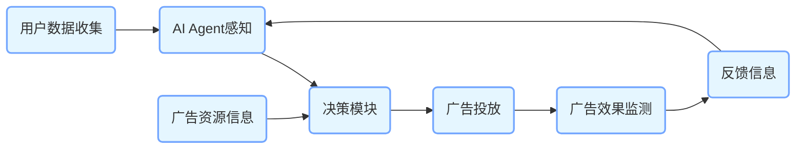

# AI Agent在智能广告投放优化中的应用

> 关键词：AI Agent、智能广告投放、优化策略、机器学习、用户行为分析、广告效果评估、数据驱动决策

> 摘要：本文深入探讨了AI Agent在智能广告投放优化中的应用。首先介绍了相关背景，包括目的范围、预期读者等内容。接着阐述了AI Agent及智能广告投放的核心概念与联系，详细讲解了核心算法原理与具体操作步骤，并给出Python源代码示例。同时，对相关数学模型和公式进行了分析与举例说明。通过项目实战展示了代码实现与解读，探讨了AI Agent在不同实际应用场景中的作用。还推荐了学习资源、开发工具框架以及相关论文著作。最后总结了未来发展趋势与挑战，提供了常见问题解答和扩展阅读参考资料，旨在为广告行业利用AI Agent提升广告投放效果提供全面且深入的技术指导。

## 1. 背景介绍 
### 1.1 目的和范围
随着互联网的迅速发展，广告投放市场日益竞争激烈，如何提高广告投放的效果和效率成为广告从业者关注的焦点。AI Agent作为一种具有自主决策和学习能力的智能体，为智能广告投放优化带来了新的思路和方法。本文的目的在于全面探讨AI Agent在智能广告投放优化中的应用，涵盖从核心概念到实际应用的各个方面，包括算法原理、数学模型、项目实战等，以帮助读者深入理解和掌握相关技术。

### 1.2 预期读者
本文预期读者包括广告行业从业者，如广告策划师、投放专员等，他们希望借助AI技术提升广告投放效果；计算机科学和人工智能领域的专业人士，如程序员、数据科学家、软件架构师等，对AI Agent在广告领域的应用感兴趣；以及相关专业的学生，希望通过本文了解AI Agent在实际业务中的应用案例和技术细节。

### 1.3 文档结构概述
本文首先介绍背景信息，包括目的、预期读者和文档结构。接着阐述AI Agent和智能广告投放的核心概念与联系，展示其原理和架构。然后详细讲解核心算法原理和具体操作步骤，并给出Python代码示例。之后分析相关数学模型和公式，并举例说明。通过项目实战展示代码实现和解读。探讨AI Agent在实际应用场景中的作用。推荐学习资源、开发工具框架和相关论文著作。最后总结未来发展趋势与挑战，提供常见问题解答和扩展阅读参考资料。

### 1.4 术语表
#### 1.4.1 核心术语定义
- **AI Agent（人工智能智能体）**：是一种能够感知环境、进行决策并采取行动的智能实体，它可以根据环境的变化自主调整行为以实现特定目标。
- **智能广告投放**：利用先进的技术和数据分析手段，对广告投放过程进行自动化、智能化的管理和优化，以提高广告的效果和投资回报率。
- **用户画像**：通过对用户行为、兴趣、偏好等多方面数据的分析和挖掘，构建出的用户特征模型，用于精准广告投放。
- **广告效果评估**：对广告投放后的效果进行量化评估，包括点击率、转化率、曝光量等指标，以衡量广告的有效性。

#### 1.4.2 相关概念解释
- **机器学习**：是AI Agent实现自主学习和决策的重要技术手段，通过对大量数据的学习，模型可以发现数据中的规律和模式，从而进行预测和决策。
- **强化学习**：一种机器学习方法，智能体通过与环境进行交互，根据环境反馈的奖励信号来学习最优行为策略，以最大化长期累积奖励。
- **数据挖掘**：从大量的数据中发现有价值的信息和知识，为广告投放决策提供支持。

#### 1.4.3 缩略词列表
- **CTR（Click - Through Rate）**：点击率，指广告被点击的次数与展示次数的比率。
- **CVR（Conversion Rate）**：转化率，指用户完成特定目标（如购买、注册等）的次数与点击次数的比率。
- **ROI（Return on Investment）**：投资回报率，衡量广告投放收益与成本的比例关系。

## 2. 核心概念与联系 

### 2.1 AI Agent原理
AI Agent的核心原理基于感知、决策和行动三个关键环节。它通过传感器感知环境信息，将这些信息输入到决策模块中。决策模块基于预定义的规则、机器学习模型或强化学习算法，对感知到的信息进行分析和处理，从而生成相应的行动决策。最后，行动模块根据决策结果执行具体的行动，对环境产生影响。环境的变化又会反馈给AI Agent，形成一个闭环的学习和决策过程。

### 2.2 智能广告投放原理
智能广告投放的目标是在合适的时间、合适的地点，向合适的用户展示合适的广告。其原理是基于对用户数据的收集、分析和挖掘，构建用户画像。通过对广告资源的管理和优化，根据用户画像和广告投放策略，选择最适合的广告进行投放。同时，实时监测广告效果，根据效果评估结果调整投放策略，以提高广告的效果和效率。

### 2.3 两者联系
AI Agent可以应用于智能广告投放的各个环节。在用户画像构建阶段，AI Agent可以自动收集和分析用户数据，发现用户的潜在特征和行为模式，从而更精准地构建用户画像。在广告投放决策阶段，AI Agent可以根据用户画像、广告资源和实时环境信息，做出最优的广告投放决策。在广告效果评估和优化阶段，AI Agent可以实时监测广告效果，根据反馈的奖励信号（如点击率、转化率等），不断调整投放策略，以实现广告效果的最大化。

### 2.4 文本示意图
AI Agent与智能广告投放的联系可以描述为：AI Agent作为智能体，通过感知用户行为数据、广告环境信息等，在决策模块中运用机器学习和强化学习算法进行分析和决策。决策结果用于选择合适的广告进行投放，投放后收集广告效果数据作为反馈信息，再次输入到AI Agent中进行学习和优化，从而不断提升智能广告投放的效果。

### 2.5 Mermaid流程图


## 3. 核心算法原理 & 具体操作步骤 

### 3.1 核心算法原理
在智能广告投放优化中，常用的核心算法包括强化学习算法，如Q - learning算法。Q - learning算法是一种无模型的强化学习算法，其核心思想是通过学习一个动作价值函数$Q(s, a)$，来表示在状态$s$下采取动作$a$的预期累积奖励。智能体通过与环境进行交互，不断更新$Q$值，以找到最优的行为策略。

### 3.2 具体操作步骤
1. **初始化**：初始化$Q$表，将所有的$Q(s, a)$值初始化为0。定义状态空间、动作空间、学习率$\alpha$、折扣因子$\gamma$和探索率$\epsilon$。
2. **选择动作**：在每个时间步$t$，智能体根据当前状态$s_t$，使用$\epsilon$-贪心策略选择动作$a_t$。以概率$\epsilon$随机选择一个动作，以概率$1 - \epsilon$选择$Q$值最大的动作。
3. **执行动作**：智能体执行选择的动作$a_t$，与环境进行交互，环境返回下一个状态$s_{t + 1}$和奖励$r_t$。
4. **更新$Q$值**：根据Q - learning更新公式更新$Q$值：
   - $Q(s_t, a_t) = Q(s_t, a_t)+\alpha\left[r_t+\gamma\max_{a}Q(s_{t + 1}, a)-Q(s_t, a_t)\right]$
5. **重复步骤2 - 4**：直到达到终止条件（如达到最大时间步数或达到目标状态）。

### 3.3 Python源代码示例
```python
import numpy as np

# 定义状态空间和动作空间
state_space = 5
action_space = 3

# 初始化Q表
Q = np.zeros((state_space, action_space))

# 定义超参数
alpha = 0.1  # 学习率
gamma = 0.9  # 折扣因子
epsilon = 0.1  # 探索率
max_episodes = 1000

# 环境交互函数
def interact(state, action):
    # 这里简单模拟环境返回下一个状态和奖励
    next_state = np.random.randint(0, state_space)
    reward = np.random.randint(0, 10)
    return next_state, reward

# Q - learning算法实现
for episode in range(max_episodes):
    state = np.random.randint(0, state_space)
    done = False
    while not done:
        if np.random.uniform(0, 1) < epsilon:
            action = np.random.randint(0, action_space)
        else:
            action = np.argmax(Q[state, :])
        
        next_state, reward = interact(state, action)
        
        # 更新Q值
        Q[state, action] = Q[state, action] + alpha * (reward + gamma * np.max(Q[next_state, :]) - Q[state, action])
        
        state = next_state
        
        # 简单模拟终止条件
        if np.random.uniform(0, 1) < 0.1:
            done = True
```

## 4. 数学模型和公式 & 详细讲解 & 举例说明 

### 4.1 Q - learning算法数学模型
Q - learning算法的数学模型基于贝尔曼方程。贝尔曼方程描述了最优动作价值函数$Q^*(s, a)$的递归关系：
$$Q^*(s, a)=E\left[r+\gamma\max_{a'}Q^*(s', a')\mid s, a\right]$$
其中，$r$是即时奖励，$\gamma$是折扣因子，$s'$是下一个状态，$a'$是下一个动作。

Q - learning算法通过迭代更新$Q$值来逼近最优动作价值函数。更新公式为：
$$Q(s_t, a_t)=Q(s_t, a_t)+\alpha\left[r_t+\gamma\max_{a}Q(s_{t + 1}, a)-Q(s_t, a_t)\right]$$
其中，$\alpha$是学习率，控制每次更新的步长。

### 4.2 详细讲解
- **学习率$\alpha$**：$\alpha$的取值范围在$[0, 1]$之间。当$\alpha$接近1时，智能体更倾向于使用最新的经验来更新$Q$值；当$\alpha$接近0时，智能体更倾向于保留之前的$Q$值。
- **折扣因子$\gamma$**：$\gamma$的取值范围在$[0, 1]$之间。$\gamma$表示对未来奖励的重视程度。当$\gamma$接近1时，智能体更关注长期奖励；当$\gamma$接近0时，智能体更关注即时奖励。
- **探索率$\epsilon$**：$\epsilon$控制智能体的探索和利用平衡。在训练初期，较大的$\epsilon$值可以让智能体更多地探索不同的动作；在训练后期，较小的$\epsilon$值可以让智能体更多地利用已经学习到的最优策略。

### 4.3 举例说明
假设一个简单的广告投放环境，状态空间表示用户的不同兴趣类别（如体育、娱乐、科技等），动作空间表示不同的广告类型（如图片广告、视频广告、文字广告等）。初始时，$Q$表中的所有值都为0。智能体在某个状态（如用户兴趣为体育）下，以一定的概率选择一个动作（如图片广告）。执行该动作后，环境返回一个奖励（如点击率）和下一个状态（用户兴趣可能发生变化）。智能体根据Q - learning更新公式更新$Q$值，不断学习不同状态下的最优广告投放策略。

## 5. 项目实战：代码实际案例和详细解释说明 

### 5.1  开发环境搭建
1. **安装Python**：推荐使用Python 3.7及以上版本。可以从Python官方网站（https://www.python.org/downloads/）下载安装包进行安装。
2. **安装必要的库**：在命令行中使用以下命令安装所需的库：
   - `pip install numpy`：用于数值计算。
   - `pip install pandas`：用于数据处理和分析。
   - `pip install matplotlib`：用于数据可视化。

### 5.2  源代码详细实现和代码解读
```python
import numpy as np
import pandas as pd
import matplotlib.pyplot as plt

# 加载广告投放数据
def load_data(file_path):
    data = pd.read_csv(file_path)
    return data

# 定义状态空间和动作空间
def define_space(data):
    # 假设状态由用户年龄和性别组成
    age_bins = [0, 20, 40, 60, 100]
    data['age_group'] = pd.cut(data['age'], bins = age_bins)
    state_space = data[['age_group', 'gender']].drop_duplicates()
    state_space = state_space.reset_index(drop = True)
    
    # 假设动作是不同的广告类型
    action_space = data['ad_type'].unique()
    
    return state_space, action_space

# 初始化Q表
def initialize_Q(state_space, action_space):
    Q = np.zeros((len(state_space), len(action_space)))
    return Q

# 根据状态和动作获取奖励
def get_reward(data, state, action):
    state_mask = (data['age_group'] == state[0]) & (data['gender'] == state[1])
    action_mask = data['ad_type'] == action
    filtered_data = data[state_mask & action_mask]
    if len(filtered_data) > 0:
        reward = filtered_data['ctr'].mean()
    else:
        reward = 0
    return reward

# Q - learning算法实现
def q_learning(data, state_space, action_space, Q, alpha = 0.1, gamma = 0.9, epsilon = 0.1, max_episodes = 1000):
    rewards = []
    for episode in range(max_episodes):
        state_index = np.random.randint(0, len(state_space))
        state = state_space.loc[state_index]
        total_reward = 0
        done = False
        while not done:
            if np.random.uniform(0, 1) < epsilon:
                action_index = np.random.randint(0, len(action_space))
            else:
                action_index = np.argmax(Q[state_index, :])
            
            action = action_space[action_index]
            reward = get_reward(data, state, action)
            
            # 简单模拟下一个状态
            next_state_index = np.random.randint(0, len(state_space))
            next_state = state_space.loc[next_state_index]
            
            # 更新Q值
            Q[state_index, action_index] = Q[state_index, action_index] + alpha * (reward + gamma * np.max(Q[next_state_index, :]) - Q[state_index, action_index])
            
            state_index = next_state_index
            state = next_state
            total_reward += reward
            
            # 简单模拟终止条件
            if np.random.uniform(0, 1) < 0.1:
                done = True
        
        rewards.append(total_reward)
    
    return Q, rewards

# 主函数
def main():
    file_path = 'ad_data.csv'
    data = load_data(file_path)
    state_space, action_space = define_space(data)
    Q = initialize_Q(state_space, action_space)
    Q, rewards = q_learning(data, state_space, action_space, Q)
    
    # 绘制奖励曲线
    plt.plot(rewards)
    plt.xlabel('Episodes')
    plt.ylabel('Total Reward')
    plt.title('Q - learning Training Rewards')
    plt.show()

if __name__ == "__main__":
    main()
```

### 5.3  代码解读与分析
1. **数据加载**：`load_data`函数用于加载广告投放数据，数据格式为CSV文件。
2. **状态空间和动作空间定义**：`define_space`函数根据用户的年龄和性别定义状态空间，根据广告类型定义动作空间。
3. **Q表初始化**：`initialize_Q`函数将Q表初始化为全零矩阵。
4. **奖励获取**：`get_reward`函数根据当前状态和动作，从数据中获取对应的点击率作为奖励。
5. **Q - learning算法实现**：`q_learning`函数实现了Q - learning算法的核心逻辑，包括动作选择、环境交互、Q值更新等步骤。
6. **主函数**：`main`函数调用上述函数完成数据加载、空间定义、Q表初始化、训练等操作，并绘制奖励曲线。通过观察奖励曲线，可以判断Q - learning算法的训练效果。如果奖励曲线逐渐上升并趋于稳定，说明算法在不断学习和优化广告投放策略。

## 6. 实际应用场景 
### 6.1 搜索引擎广告
在搜索引擎广告中，AI Agent可以根据用户的搜索关键词、搜索历史、地理位置等信息，实时感知用户的需求和状态。通过强化学习算法，AI Agent可以在众多的广告中选择最适合的广告进行展示，以提高广告的点击率和转化率。例如，当用户搜索“智能手机”时，AI Agent可以根据用户的历史购买记录、浏览偏好等信息，选择与之相关的手机品牌广告进行展示。

### 6.2 社交媒体广告
社交媒体平台拥有丰富的用户数据，如用户的兴趣爱好、社交关系、行为习惯等。AI Agent可以利用这些数据构建用户画像，精准地定位目标用户。在广告投放过程中，AI Agent可以根据用户的实时状态和行为，动态调整广告投放策略。例如，当用户在社交媒体上点赞了一篇关于旅游的文章时，AI Agent可以及时推送相关的旅游广告。

### 6.3 视频广告
在视频广告领域，AI Agent可以分析用户的观看行为、视频偏好等信息。对于不同类型的视频内容，AI Agent可以选择合适的广告形式和投放时机。例如，在观看体育赛事视频时，AI Agent可以投放体育用品广告；在观看电视剧时，AI Agent可以投放与剧情相关的商品广告。

### 6.4 电商广告
电商平台的广告投放需要考虑用户的购物历史、收藏偏好、购物车状态等信息。AI Agent可以根据这些信息，为用户推荐个性化的商品广告。例如，当用户在电商平台上浏览了一款运动鞋后，AI Agent可以推送相关品牌的其他款式运动鞋广告，或者推荐配套的运动服装广告。

## 7. 工具和资源推荐
### 7.1 学习资源推荐
#### 7.1.1 书籍推荐
- 《人工智能：一种现代的方法》：全面介绍了人工智能的基本概念、算法和应用，是人工智能领域的经典教材。
- 《强化学习：原理与Python实现》：详细讲解了强化学习的理论和算法，并给出了Python代码实现，适合初学者深入学习强化学习。
- 《Python数据分析实战》：介绍了Python在数据分析领域的应用，包括数据处理、可视化等内容，对于处理广告投放数据非常有帮助。

#### 7.1.2 在线课程
- Coursera上的“人工智能基础”课程：由知名高校的教授授课，系统地介绍了人工智能的基础知识和算法。
- edX上的“强化学习”课程：深入讲解了强化学习的原理和应用，提供了丰富的案例和实践项目。
- 中国大学MOOC上的“Python语言程序设计”课程：适合初学者学习Python编程，为后续的AI Agent开发打下基础。

#### 7.1.3 技术博客和网站
- Medium：上面有很多关于人工智能、机器学习和广告技术的优质博客文章，作者来自全球各地的专业人士。
- Towards Data Science：专注于数据科学和机器学习领域，提供了很多实用的技术教程和案例分析。
- 机器之心：国内知名的人工智能媒体，及时报道人工智能领域的最新技术和应用案例。

### 7.2 开发工具框架推荐
#### 7.2.1 IDE和编辑器
- PyCharm：一款专业的Python集成开发环境，提供了丰富的代码编辑、调试和项目管理功能，适合开发AI Agent相关的Python代码。
- Jupyter Notebook：一种交互式的开发环境，适合进行数据探索、算法验证和可视化展示，方便快速迭代和实验。
- Visual Studio Code：一款轻量级的代码编辑器，支持多种编程语言和插件扩展，可用于AI Agent开发的各个环节。

#### 7.2.2 调试和性能分析工具
- PDB：Python自带的调试器，可以帮助开发者定位代码中的错误和问题。
- cProfile：Python的性能分析工具，可以分析代码的运行时间和函数调用情况，帮助优化代码性能。
- TensorBoard：用于可视化深度学习模型的训练过程和性能指标，对于使用深度学习算法的AI Agent开发非常有用。

#### 7.2.3 相关框架和库
- TensorFlow：一个开源的机器学习框架，提供了丰富的深度学习模型和工具，可用于构建复杂的AI Agent模型。
- PyTorch：另一个流行的深度学习框架，具有简洁的API和高效的计算性能，适合快速开发和实验。
- Scikit - learn：一个简单易用的机器学习库，提供了多种机器学习算法和工具，可用于数据预处理、模型选择和评估等任务。

### 7.3 相关论文著作推荐
#### 7.3.1 经典论文
- “Q - learning”：由Watkins和Dayan发表的经典论文，首次提出了Q - learning算法，是强化学习领域的重要里程碑。
- “Deep Q - Networks”：介绍了深度Q网络（DQN）算法，将深度学习与强化学习相结合，在游戏等领域取得了很好的效果。
- “Policy Gradient Methods for Reinforcement Learning with Function Approximation”：提出了策略梯度方法，为基于策略的强化学习算法奠定了基础。

#### 7.3.2 最新研究成果
- 关注顶级学术会议如NeurIPS（神经信息处理系统大会）、ICML（国际机器学习会议）和KDD（知识发现与数据挖掘会议）上的最新论文，了解AI Agent在智能广告投放优化领域的最新研究进展。
- 一些知名学术期刊如Journal of Artificial Intelligence Research（JAIR）和Artificial Intelligence也会发表相关的高质量研究论文。

#### 7.3.3 应用案例分析
- 一些行业报告和案例研究可以帮助读者了解AI Agent在实际广告投放中的应用效果和经验教训。例如，Google、Facebook等公司会发布关于广告技术的研究报告和案例分享，可供参考。

## 8. 总结：未来发展趋势与挑战
### 8.1 未来发展趋势
- **多智能体协同**：未来，多个AI Agent可能会协同工作，共同优化广告投放策略。例如，不同的AI Agent可以分别负责用户画像构建、广告投放决策、效果评估等任务，通过协作提高广告投放的整体效率和效果。
- **融合更多技术**：AI Agent将与计算机视觉、自然语言处理等技术深度融合。例如，在视频广告中，利用计算机视觉技术分析视频内容，更精准地选择广告投放时机；在文本广告中，利用自然语言处理技术理解用户的搜索意图，提供更相关的广告。
- **个性化程度提升**：随着数据的不断积累和算法的不断优化，AI Agent将能够实现更高程度的个性化广告投放。不仅考虑用户的基本信息和行为习惯，还会考虑用户的情绪、场景等因素，为用户提供更加个性化的广告体验。
- **跨平台整合**：AI Agent将能够整合多个广告平台的数据和资源，实现跨平台的广告投放优化。例如，同时在搜索引擎、社交媒体、电商平台等多个渠道进行广告投放，并根据不同平台的特点和用户行为进行统一的优化。

### 8.2 挑战
- **数据隐私和安全**：广告投放需要收集和分析大量的用户数据，如何保护用户的隐私和数据安全是一个重要的挑战。在数据收集、存储和使用过程中，需要遵循严格的法律法规和道德准则，防止数据泄露和滥用。
- **算法可解释性**：AI Agent的决策过程往往比较复杂，尤其是使用深度学习等复杂算法时，算法的可解释性较差。在广告投放中，广告主和监管机构需要了解广告投放决策的依据，因此提高算法的可解释性是一个亟待解决的问题。
- **环境动态变化**：广告投放环境是动态变化的，用户的行为和市场趋势随时可能发生变化。AI Agent需要具备快速适应环境变化的能力，及时调整广告投放策略，以保持良好的广告效果。
- **计算资源需求**：一些复杂的AI Agent算法需要大量的计算资源和时间进行训练和优化。如何在有限的计算资源下提高算法的效率和性能，是一个实际的挑战。

## 9. 附录：常见问题与解答
### 9.1 如何选择合适的AI Agent算法？
选择合适的AI Agent算法需要考虑多个因素，如问题的复杂度、数据的特点、计算资源等。如果问题的状态空间和动作空间较小，可以选择传统的强化学习算法，如Q - learning算法；如果问题比较复杂，可以考虑使用深度学习与强化学习相结合的算法，如深度Q网络（DQN）、策略梯度算法等。同时，还可以通过实验和比较不同算法的性能，选择最适合的算法。

### 9.2 如何评估AI Agent在智能广告投放中的效果？
可以从多个方面评估AI Agent在智能广告投放中的效果，如点击率（CTR）、转化率（CVR）、投资回报率（ROI）等。同时，还可以分析用户的留存率、复购率等指标，以评估广告投放对用户长期行为的影响。此外，还可以通过A/B测试等方法，比较使用AI Agent前后广告投放效果的差异。

### 9.3 如何处理广告投放数据中的噪声和缺失值？
对于广告投放数据中的噪声，可以使用数据清洗和预处理技术，如过滤、平滑等方法进行处理。对于缺失值，可以采用均值填充、中位数填充、回归填充等方法进行填充，或者使用基于机器学习的方法进行预测填充。在处理数据时，需要根据数据的特点和问题的需求选择合适的方法。

### 9.4 如何提高AI Agent的学习效率？
可以通过以下方法提高AI Agent的学习效率：
- 优化算法参数：合理选择学习率、折扣因子、探索率等超参数，以平衡学习速度和收敛性。
- 增加训练数据：收集更多的广告投放数据，让AI Agent有更多的学习机会，提高模型的泛化能力。
- 使用经验回放：在强化学习中，使用经验回放机制可以提高数据的利用率，加速学习过程。
- 并行计算：利用多核处理器或GPU进行并行计算，加快训练速度。

## 10. 扩展阅读 & 参考资料
### 10.1 扩展阅读
- 《人工智能时代的广告革命》：探讨了人工智能对广告行业的影响和变革，以及未来广告发展的趋势和方向。
- 《智能营销：数据驱动的营销革命》：介绍了数据驱动的营销理念和方法，包括用户画像、精准营销等内容，与AI Agent在智能广告投放中的应用密切相关。
- 《机器学习实战》：通过实际案例介绍了机器学习算法的应用，对于理解AI Agent的算法原理和实现有很大的帮助。

### 10.2 参考资料
- 相关的学术论文和研究报告，如NeurIPS、ICML、KDD等会议的论文，以及行业内的研究报告。
- 各大广告平台的官方文档和技术博客，如Google Ads、Facebook Ads等平台的相关资料。
- 开源代码库和社区，如GitHub上的相关项目，可参考其他开发者的实现和经验。