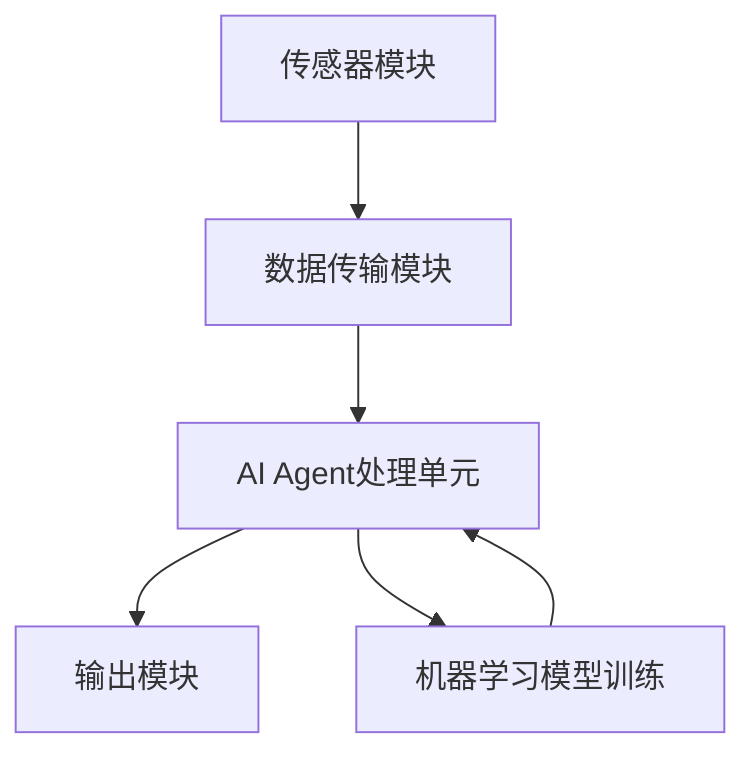

# AI Agent在智能床头柜中的清醒度评估

> 关键词：AI Agent、智能床头柜、清醒度评估、传感器技术、机器学习

> 摘要：本文聚焦于AI Agent在智能床头柜中进行清醒度评估的相关技术与应用。首先介绍了该研究的背景，包括目的、预期读者等内容。接着阐述了核心概念与联系，通过文本示意图和Mermaid流程图展示其架构原理。详细讲解了核心算法原理及具体操作步骤，并给出Python源代码示例。深入探讨了相关数学模型和公式，通过举例说明其应用。在项目实战部分，给出了开发环境搭建、源代码实现及解读。还介绍了实际应用场景、推荐了相关工具和资源，最后对未来发展趋势与挑战进行总结，并提供常见问题解答和扩展阅读参考资料，旨在全面剖析AI Agent在智能床头柜清醒度评估中的应用与发展。

## 1. 背景介绍 
### 1.1 目的和范围
在现代快节奏的生活中，人们对睡眠质量和起床后的状态越来越关注。智能床头柜作为智能家居的一部分，具备多种功能，而其中对用户清醒度的评估具有重要意义。本研究的目的在于利用AI Agent技术，通过智能床头柜上的各类传感器收集数据，实现对用户清醒度的准确评估。范围涵盖了从传感器数据采集、数据处理、算法分析到最终清醒度评估结果输出的整个过程，以及相关技术在智能床头柜产品中的应用。

### 1.2 预期读者
本文预期读者包括智能家居领域的开发者、研究人员，对人工智能技术在生活场景中应用感兴趣的爱好者，以及从事智能硬件产品设计和开发的工程师等。这些读者可能希望深入了解AI Agent在智能床头柜清醒度评估中的原理、实现方法和应用前景，以获取相关技术知识和灵感，用于产品开发或研究工作。

### 1.3 文档结构概述
本文首先介绍背景信息，包括研究目的、预期读者和文档结构。接着阐述核心概念与联系，通过示意图和流程图展示AI Agent在智能床头柜清醒度评估中的架构。然后详细讲解核心算法原理和具体操作步骤，并给出Python代码示例。随后介绍相关数学模型和公式，并举例说明。在项目实战部分，介绍开发环境搭建、源代码实现及解读。之后介绍实际应用场景和推荐相关工具和资源。最后总结未来发展趋势与挑战，提供常见问题解答和扩展阅读参考资料。

### 1.4 术语表
#### 1.4.1 核心术语定义
- **AI Agent（人工智能智能体）**：是一种能够感知环境、进行决策并采取行动以实现特定目标的人工智能实体。在本文中，AI Agent负责处理智能床头柜收集的传感器数据，进行清醒度评估。
- **智能床头柜**：集成了多种传感器和智能功能的床头柜，能够与用户进行交互，收集用户的相关数据，并提供相应的服务。
- **清醒度评估**：通过对用户的生理和行为数据进行分析，判断用户当前的清醒程度，例如困倦、半清醒、清醒等状态。

#### 1.4.2 相关概念解释
- **传感器技术**：用于收集用户的生理和行为数据，如心率、呼吸频率、体动等。常见的传感器包括心率传感器、加速度计、麦克风等。
- **机器学习**：AI Agent进行清醒度评估的重要技术手段，通过对大量数据的学习和训练，建立模型来预测用户的清醒度。

#### 1.4.3 缩略词列表
- **AI**：Artificial Intelligence（人工智能）
- **ML**：Machine Learning（机器学习）

## 2. 核心概念与联系 
### 核心概念原理
AI Agent在智能床头柜中的清醒度评估主要基于传感器技术和机器学习算法。智能床头柜上的传感器收集用户的生理和行为数据，如心率、呼吸频率、体动等。这些数据被传输到AI Agent中，AI Agent利用机器学习算法对数据进行分析和处理，建立清醒度评估模型。根据模型的输出，判断用户当前的清醒程度。

### 架构的文本示意图
智能床头柜清醒度评估系统主要由以下几个部分组成：
1. **传感器模块**：负责收集用户的生理和行为数据，包括心率传感器、加速度计、麦克风等。
2. **数据传输模块**：将传感器收集的数据传输到AI Agent所在的处理单元。
3. **AI Agent处理单元**：对传输过来的数据进行处理和分析，利用机器学习算法建立清醒度评估模型。
4. **输出模块**：将清醒度评估结果输出，例如通过显示屏显示或通过语音提示用户。

### Mermaid流程图


## 3. 核心算法原理 & 具体操作步骤 
### 核心算法原理
在AI Agent进行清醒度评估时，常用的机器学习算法包括决策树、支持向量机、神经网络等。这里以神经网络算法为例进行说明。神经网络是一种模仿人类神经系统的计算模型，由输入层、隐藏层和输出层组成。输入层接收传感器收集的数据，隐藏层对数据进行处理和变换，输出层输出清醒度评估结果。

### 具体操作步骤
1. **数据收集**：利用智能床头柜上的传感器收集用户的生理和行为数据，如心率、呼吸频率、体动等。
2. **数据预处理**：对收集到的数据进行清洗、归一化等处理，去除噪声和异常值，使数据具有可比性。
3. **特征提取**：从预处理后的数据中提取有用的特征，例如心率的变化趋势、体动的频率等。
4. **模型训练**：使用提取的特征作为输入，用户的清醒度标签作为输出，对神经网络模型进行训练。
5. **模型评估**：使用测试数据对训练好的模型进行评估，计算模型的准确率、召回率等指标。
6. **清醒度评估**：将实时收集的传感器数据输入到训练好的模型中，得到用户的清醒度评估结果。

### Python源代码示例
```python
import numpy as np
from sklearn.neural_network import MLPClassifier
from sklearn.preprocessing import StandardScaler
from sklearn.model_selection import train_test_split

# 模拟传感器数据
X = np.random.rand(100, 5)  # 100个样本，每个样本5个特征
y = np.random.randint(0, 3, 100)  # 清醒度标签，0: 困倦，1: 半清醒，2: 清醒

# 数据预处理
scaler = StandardScaler()
X = scaler.fit_transform(X)

# 划分训练集和测试集
X_train, X_test, y_train, y_test = train_test_split(X, y, test_size=0.2, random_state=42)

# 构建神经网络模型
model = MLPClassifier(hidden_layer_sizes=(10, 5), activation='relu', solver='adam', max_iter=1000)

# 模型训练
model.fit(X_train, y_train)

# 模型评估
accuracy = model.score(X_test, y_test)
print(f"模型准确率: {accuracy}")

# 模拟实时数据
new_data = np.random.rand(1, 5)
new_data = scaler.transform(new_data)

# 清醒度评估
prediction = model.predict(new_data)
print(f"清醒度评估结果: {prediction[0]}")
```

## 4. 数学模型和公式 & 详细讲解 & 举例说明 
### 数学模型
在神经网络中，每个神经元的输出可以通过以下公式计算：
$$z = \sum_{i=1}^{n} w_i x_i + b$$
其中，$z$ 是神经元的输入，$w_i$ 是第 $i$ 个输入的权重，$x_i$ 是第 $i$ 个输入的值，$b$ 是偏置。

神经元的输出 $y$ 可以通过激活函数进行计算，常见的激活函数包括Sigmoid函数、ReLU函数等。以ReLU函数为例：
$$y = \max(0, z)$$

### 详细讲解
在神经网络的训练过程中，目标是通过调整权重 $w$ 和偏置 $b$，使得模型的输出与真实标签之间的误差最小。常用的损失函数包括均方误差（MSE）、交叉熵损失等。以交叉熵损失为例：
$$L = -\frac{1}{N} \sum_{i=1}^{N} \sum_{j=1}^{C} y_{ij} \log(p_{ij})$$
其中，$N$ 是样本数量，$C$ 是类别数量，$y_{ij}$ 是第 $i$ 个样本的第 $j$ 个类别的真实标签，$p_{ij}$ 是第 $i$ 个样本的第 $j$ 个类别的预测概率。

通过反向传播算法，可以计算损失函数对权重和偏置的梯度，然后使用梯度下降法更新权重和偏置：
$$w_{new} = w_{old} - \alpha \frac{\partial L}{\partial w}$$
$$b_{new} = b_{old} - \alpha \frac{\partial L}{\partial b}$$
其中，$\alpha$ 是学习率。

### 举例说明
假设我们有一个简单的神经网络，输入层有2个神经元，隐藏层有3个神经元，输出层有2个神经元。输入数据为 $x = [1, 2]$，权重矩阵 $W_1$ 为：
$$W_1 = \begin{bmatrix}
0.1 & 0.2 & 0.3 \\
0.4 & 0.5 & 0.6
\end{bmatrix}$$
偏置向量 $b_1$ 为：
$$b_1 = \begin{bmatrix}
0.1 \\
0.2 \\
0.3
\end{bmatrix}$$
则隐藏层的输入 $z_1$ 为：
$$z_1 = W_1^T x + b_1 = \begin{bmatrix}
0.1 & 0.4 \\
0.2 & 0.5 \\
0.3 & 0.6
\end{bmatrix} \begin{bmatrix}
1 \\
2
\end{bmatrix} + \begin{bmatrix}
0.1 \\
0.2 \\
0.3
\end{bmatrix} = \begin{bmatrix}
0.9 \\
1.4 \\
1.9
\end{bmatrix}$$
使用ReLU激活函数，隐藏层的输出 $y_1$ 为：
$$y_1 = \max(0, z_1) = \begin{bmatrix}
0.9 \\
1.4 \\
1.9
\end{bmatrix}$$

假设输出层的权重矩阵 $W_2$ 为：
$$W_2 = \begin{bmatrix}
0.7 & 0.8 \\
0.9 & 1.0 \\
1.1 & 1.2
\end{bmatrix}$$
偏置向量 $b_2$ 为：
$$b_2 = \begin{bmatrix}
0.4 \\
0.5
\end{bmatrix}$$
则输出层的输入 $z_2$ 为：
$$z_2 = W_2^T y_1 + b_2 = \begin{bmatrix}
0.7 & 0.9 & 1.1 \\
0.8 & 1.0 & 1.2
\end{bmatrix} \begin{bmatrix}
0.9 \\
1.4 \\
1.9
\end{bmatrix} + \begin{bmatrix}
0.4 \\
0.5
\end{bmatrix} = \begin{bmatrix}
3.86 \\
4.36
\end{bmatrix}$$
使用Softmax函数将输出转换为概率分布：
$$p = \frac{e^{z_2}}{\sum_{i=1}^{2} e^{z_{2i}}} = \begin{bmatrix}
0.44 \\
0.56
\end{bmatrix}$$

## 5. 项目实战：代码实际案例和详细解释说明 
### 5.1  开发环境搭建
1. **硬件环境**：选择一款合适的智能床头柜硬件平台，如树莓派等。在床头柜上安装所需的传感器，如心率传感器、加速度计、麦克风等。确保传感器与硬件平台能够正常通信。
2. **软件环境**：安装Python开发环境，建议使用Python 3.7及以上版本。安装必要的Python库，如NumPy、SciPy、Scikit-learn、TensorFlow等。可以使用pip命令进行安装，例如：
```sh
pip install numpy scipy scikit-learn tensorflow
```

### 5.2  源代码详细实现和代码解读
```python
import numpy as np
import pandas as pd
from sklearn.neural_network import MLPClassifier
from sklearn.preprocessing import StandardScaler
from sklearn.model_selection import train_test_split
import serial  # 用于与传感器通信

# 从传感器读取数据
def read_sensor_data():
    ser = serial.Serial('COM3', 9600)  # 根据实际情况修改串口和波特率
    data = ser.readline().decode('utf-8').strip().split(',')
    data = [float(x) for x in data]
    ser.close()
    return np.array(data).reshape(1, -1)

# 数据预处理
def preprocess_data(X):
    scaler = StandardScaler()
    X = scaler.fit_transform(X)
    return X

# 模型训练
def train_model(X, y):
    X = preprocess_data(X)
    X_train, X_test, y_train, y_test = train_test_split(X, y, test_size=0.2, random_state=42)
    model = MLPClassifier(hidden_layer_sizes=(10, 5), activation='relu', solver='adam', max_iter=1000)
    model.fit(X_train, y_train)
    accuracy = model.score(X_test, y_test)
    print(f"模型准确率: {accuracy}")
    return model

# 清醒度评估
def evaluate_alertness(model):
    new_data = read_sensor_data()
    new_data = preprocess_data(new_data)
    prediction = model.predict(new_data)
    print(f"清醒度评估结果: {prediction[0]}")
    return prediction[0]

# 主函数
if __name__ == "__main__":
    # 加载训练数据
    data = pd.read_csv('training_data.csv')
    X = data.iloc[:, :-1].values
    y = data.iloc[:, -1].values

    # 训练模型
    model = train_model(X, y)

    # 进行清醒度评估
    while True:
        alertness = evaluate_alertness(model)
        # 可以根据评估结果进行相应的操作，如控制灯光、播放音乐等
```

### 5.3  代码解读与分析
1. **数据读取**：`read_sensor_data` 函数通过串口通信从传感器读取数据，并将其转换为NumPy数组。
2. **数据预处理**：`preprocess_data` 函数使用 `StandardScaler` 对数据进行归一化处理，使数据具有可比性。
3. **模型训练**：`train_model` 函数将数据划分为训练集和测试集，使用 `MLPClassifier` 构建神经网络模型，并进行训练和评估。
4. **清醒度评估**：`evaluate_alertness` 函数读取实时传感器数据，进行预处理后输入到训练好的模型中，得到清醒度评估结果。
5. **主函数**：加载训练数据，调用 `train_model` 函数训练模型，然后进入循环，不断进行清醒度评估。

## 6. 实际应用场景 
### 智能唤醒功能
根据用户的清醒度评估结果，智能床头柜可以调整唤醒方式。如果用户清醒度较低，床头柜可以逐渐增加灯光亮度，播放轻柔的音乐，帮助用户自然地醒来。如果用户清醒度较高，床头柜可以直接播放设定的闹钟铃声。

### 健康监测
通过长期记录用户的清醒度数据，智能床头柜可以分析用户的睡眠质量和日常清醒状态。如果发现用户长期处于困倦状态，床头柜可以提醒用户注意休息，或者提供一些改善睡眠质量的建议。

### 个性化服务
根据用户的清醒度和个人偏好，智能床头柜可以提供个性化的服务。例如，在用户清醒度较低时，提供一杯热咖啡的推荐；在用户清醒度较高时，推荐一些适合此时进行的活动，如阅读、运动等。

## 7. 工具和资源推荐
### 7.1 学习资源推荐
#### 7.1.1 书籍推荐
- 《Python机器学习》：全面介绍了Python在机器学习领域的应用，包括各种机器学习算法的原理和实现。
- 《深度学习》：由深度学习领域的权威专家撰写，深入讲解了深度学习的理论和实践。

#### 7.1.2 在线课程
- Coursera上的“机器学习”课程：由斯坦福大学教授Andrew Ng主讲，是机器学习领域的经典课程。
- edX上的“深度学习”课程：提供了深度学习的系统学习内容，包括理论和实践项目。

#### 7.1.3 技术博客和网站
- Medium：有很多关于人工智能和机器学习的优秀博客文章，涵盖了最新的技术和研究成果。
- Towards Data Science：专注于数据科学和机器学习领域的知识分享，有很多实用的教程和案例。

### 7.2 开发工具框架推荐
#### 7.2.1 IDE和编辑器
- PyCharm：功能强大的Python集成开发环境，提供了代码编辑、调试、版本控制等功能。
- Visual Studio Code：轻量级的代码编辑器，支持多种编程语言，有丰富的插件扩展功能。

#### 7.2.2 调试和性能分析工具
- PDB：Python自带的调试工具，可以帮助开发者定位代码中的问题。
- TensorBoard：TensorFlow提供的可视化工具，可以用于分析模型的训练过程和性能。

#### 7.2.3 相关框架和库
- Scikit-learn：提供了丰富的机器学习算法和工具，方便开发者进行模型训练和评估。
- TensorFlow：开源的深度学习框架，广泛应用于各种深度学习任务。

### 7.3 相关论文著作推荐
#### 7.3.1 经典论文
- “Gradient-Based Learning Applied to Document Recognition”：由Yann LeCun等人撰写，介绍了卷积神经网络在手写字符识别中的应用。
- “ImageNet Classification with Deep Convolutional Neural Networks”：由Alex Krizhevsky等人撰写，开创了深度学习在图像分类领域的先河。

#### 7.3.2 最新研究成果
- 关注顶级学术会议，如NeurIPS、ICML、CVPR等，了解人工智能和机器学习领域的最新研究成果。

#### 7.3.3 应用案例分析
- 一些科技公司的官方博客和技术报告中会分享他们在人工智能应用方面的案例，如Google、Microsoft等。

## 8. 总结：未来发展趋势与挑战
### 未来发展趋势
1. **多模态数据融合**：未来的智能床头柜可能会融合更多类型的传感器数据，如脑电波、眼动等，以更全面地评估用户的清醒度。
2. **个性化定制**：根据用户的个体差异和偏好，提供更加个性化的清醒度评估和服务。
3. **与其他智能家居设备的联动**：智能床头柜可以与其他智能家居设备进行联动，如智能窗帘、智能空调等，根据用户的清醒度自动调整家居环境。

### 挑战
1. **数据隐私和安全**：智能床头柜收集的用户生理和行为数据涉及到个人隐私，如何保证数据的安全和隐私是一个重要的挑战。
2. **算法准确性**：目前的清醒度评估算法还存在一定的误差，如何提高算法的准确性是未来需要解决的问题。
3. **用户接受度**：用户对智能床头柜的功能和使用方式可能存在一定的疑虑，如何提高用户的接受度和满意度也是一个挑战。

## 9. 附录：常见问题与解答
### 问题1：传感器数据不准确怎么办？
解答：首先检查传感器的安装是否正确，确保传感器与用户的接触良好。如果问题仍然存在，可以尝试对传感器进行校准，或者更换新的传感器。

### 问题2：模型训练时间过长怎么办？
解答：可以尝试减少训练数据的数量，或者调整模型的参数，如减少隐藏层的神经元数量、降低学习率等。也可以使用更强大的计算资源，如GPU加速训练过程。

### 问题3：如何保证数据的安全和隐私？
解答：在数据传输过程中，使用加密技术对数据进行加密。在数据存储方面，采用安全的存储方式，如数据库加密、访问控制等。同时，遵守相关的法律法规，确保用户数据的合法使用。

## 10. 扩展阅读 & 参考资料
### 扩展阅读
- 《智能家居：原理、技术与应用》：全面介绍了智能家居的相关技术和应用，包括智能床头柜等设备。
- 《人工智能：现代方法》：深入讲解了人工智能的理论和方法，对于理解AI Agent的工作原理有很大帮助。

### 参考资料
- 相关传感器的技术文档和用户手册。
- 机器学习和深度学习相关的学术论文和研究报告。
- 智能床头柜相关的产品说明书和技术资料。