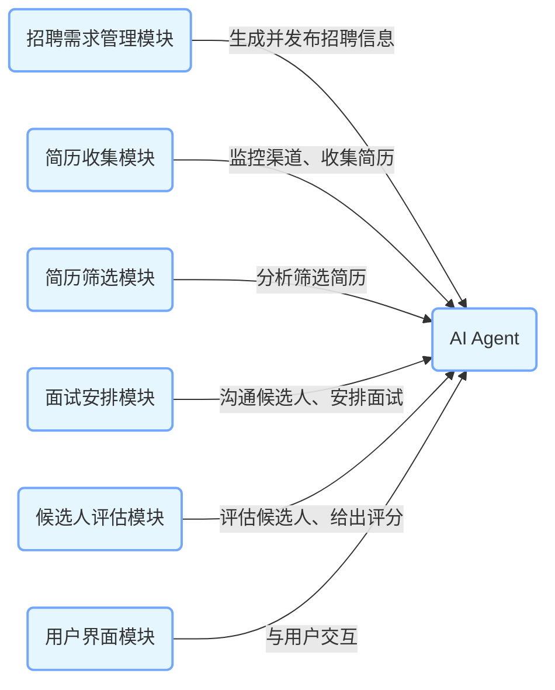

# AI Agent在智能招聘系统中的应用

> 关键词：AI Agent、智能招聘系统、人工智能、招聘流程优化、自然语言处理、机器学习、自动化

> 摘要：本文深入探讨了AI Agent在智能招聘系统中的应用。随着人工智能技术的飞速发展，AI Agent在招聘领域展现出巨大的潜力，能够有效提升招聘效率、优化招聘流程、提高招聘质量。文章首先介绍了相关背景，包括目的范围、预期读者等内容；接着阐述了AI Agent与智能招聘系统的核心概念及联系，给出了原理和架构的示意图与流程图；详细讲解了核心算法原理和具体操作步骤，并结合Python代码进行说明；介绍了相关的数学模型和公式；通过项目实战展示了代码实现和详细解释；分析了AI Agent在智能招聘系统中的实际应用场景；推荐了学习、开发工具和相关论文著作等资源；最后总结了未来发展趋势与挑战，还提供了常见问题解答和扩展阅读参考资料，旨在为读者全面呈现AI Agent在智能招聘系统中应用的全貌。

## 1. 背景介绍 
### 1.1 目的和范围
在当今竞争激烈的就业市场中，招聘流程的效率和质量至关重要。传统的招聘方式往往需要耗费大量的人力、物力和时间，而且容易受到人为因素的影响，导致招聘结果不够理想。智能招聘系统的出现为解决这些问题提供了新的途径，而AI Agent作为人工智能技术的重要应用，能够在智能招聘系统中发挥关键作用。

本文的目的在于深入探讨AI Agent在智能招聘系统中的应用，包括其原理、算法、实际案例等方面。范围涵盖了AI Agent在招聘流程各个环节的应用，如简历筛选、面试安排、候选人评估等，旨在为企业和招聘人员提供全面的了解和参考，以便更好地利用AI Agent提升招聘效率和质量。

### 1.2 预期读者
本文的预期读者包括企业招聘人员、人力资源管理者、人工智能研究者、软件开发人员以及对智能招聘系统和AI Agent感兴趣的人士。对于企业招聘人员和人力资源管理者来说，本文可以帮助他们了解如何利用AI Agent优化招聘流程，提高招聘效果；对于人工智能研究者和软件开发人员，本文提供了技术实现的原理和方法，有助于他们进行相关的研究和开发工作；对于对该领域感兴趣的人士，本文可以作为一个科普性的资料，帮助他们了解AI Agent在智能招聘系统中的应用现状和发展趋势。

### 1.3 文档结构概述
本文将按照以下结构进行组织：
1. 背景介绍：阐述文章的目的、范围、预期读者和文档结构概述，并对相关术语进行定义和解释。
2. 核心概念与联系：介绍AI Agent和智能招聘系统的核心概念，以及它们之间的联系，同时给出原理和架构的文本示意图和Mermaid流程图。
3. 核心算法原理 & 具体操作步骤：详细讲解AI Agent在智能招聘系统中应用的核心算法原理，并结合Python源代码进行说明，同时给出具体的操作步骤。
4. 数学模型和公式 & 详细讲解 & 举例说明：介绍相关的数学模型和公式，并进行详细讲解，通过具体的例子进行说明。
5. 项目实战：代码实际案例和详细解释说明：通过一个实际的项目案例，展示AI Agent在智能招聘系统中的应用，包括开发环境搭建、源代码详细实现和代码解读。
6. 实际应用场景：分析AI Agent在智能招聘系统中的实际应用场景，如简历筛选、面试安排、候选人评估等。
7. 工具和资源推荐：推荐学习、开发工具和相关论文著作等资源，帮助读者进一步深入学习和研究。
8. 总结：未来发展趋势与挑战：总结AI Agent在智能招聘系统中应用的未来发展趋势和面临的挑战。
9. 附录：常见问题与解答：解答读者在阅读过程中可能遇到的常见问题。
10. 扩展阅读 & 参考资料：提供相关的扩展阅读资料和参考文献，方便读者进一步查阅。

### 1.4 术语表
#### 1.4.1 核心术语定义
- **AI Agent（人工智能代理）**：是一种能够感知环境、自主决策并采取行动以实现特定目标的人工智能实体。在智能招聘系统中，AI Agent可以模拟招聘人员的行为，完成简历筛选、面试安排等任务。
- **智能招聘系统**：是一种利用人工智能技术优化招聘流程的系统，能够自动完成简历筛选、面试安排、候选人评估等任务，提高招聘效率和质量。
- **自然语言处理（NLP）**：是人工智能的一个重要领域，主要研究如何让计算机理解和处理人类语言。在智能招聘系统中，NLP技术可以用于简历分析、面试问题生成等任务。
- **机器学习**：是一门多领域交叉学科，涉及概率论、统计学、逼近论、凸分析、算法复杂度理论等多门学科。它专门研究计算机怎样模拟或实现人类的学习行为，以获取新的知识或技能，重新组织已有的知识结构使之不断改善自身的性能。在智能招聘系统中，机器学习可以用于候选人评估、招聘预测等任务。

#### 1.4.2 相关概念解释
- **招聘流程**：指企业从确定招聘需求到最终录用候选人的一系列过程，包括发布招聘信息、收集简历、简历筛选、面试、背景调查、录用等环节。
- **简历筛选**：是招聘流程中的重要环节，主要是从大量的简历中筛选出符合岗位要求的候选人。
- **面试安排**：指根据候选人的时间和招聘人员的安排，确定面试的时间、地点和方式。
- **候选人评估**：是对候选人的能力、素质、经验等方面进行综合评估，以确定其是否适合该岗位。

#### 1.4.3 缩略词列表
- **AI**：Artificial Intelligence，人工智能
- **NLP**：Natural Language Processing，自然语言处理
- **ML**：Machine Learning，机器学习

## 2. 核心概念与联系 
### 2.1 AI Agent核心概念
AI Agent是一种具有自主性、反应性、社会性和主动性的人工智能实体。自主性意味着AI Agent能够在没有人类干预的情况下自主地感知环境、决策和行动；反应性表示AI Agent能够对环境中的变化做出及时的反应；社会性体现了AI Agent能够与其他Agent或人类进行交互；主动性则表明AI Agent能够主动地采取行动以实现特定的目标。

在智能招聘系统中，AI Agent可以被看作是一个虚拟的招聘助手，它能够自动完成招聘流程中的一些任务，如简历筛选、面试安排等。AI Agent通过与招聘系统中的其他组件（如数据库、用户界面等）进行交互，获取相关信息，并根据预设的规则和算法进行决策和行动。

### 2.2 智能招聘系统核心概念
智能招聘系统是一种利用人工智能技术优化招聘流程的系统。它通过集成自然语言处理、机器学习等技术，实现简历自动筛选、面试智能安排、候选人精准评估等功能，提高招聘效率和质量。

智能招聘系统通常包括以下几个主要组件：
- **招聘需求管理模块**：用于管理企业的招聘需求，包括岗位信息、招聘人数、岗位要求等。
- **简历收集模块**：负责收集候选人的简历，可以通过多种渠道（如招聘网站、社交媒体等）获取。
- **简历筛选模块**：利用自然语言处理和机器学习技术，对收集到的简历进行筛选，找出符合岗位要求的候选人。
- **面试安排模块**：根据候选人的时间和招聘人员的安排，自动安排面试的时间、地点和方式。
- **候选人评估模块**：对候选人的能力、素质、经验等方面进行综合评估，为招聘决策提供依据。
- **用户界面模块**：为招聘人员和候选人提供交互界面，方便他们进行操作和查询信息。

### 2.3 AI Agent与智能招聘系统的联系
AI Agent在智能招聘系统中扮演着重要的角色，它可以与智能招聘系统的各个组件进行交互，实现招聘流程的自动化和智能化。具体来说，AI Agent与智能招聘系统的联系如下：
- **与招聘需求管理模块的联系**：AI Agent可以根据企业的招聘需求，自动生成招聘信息，并发布到相关的招聘渠道上。
- **与简历收集模块的联系**：AI Agent可以监控招聘渠道，自动收集候选人的简历，并将其存储到简历数据库中。
- **与简历筛选模块的联系**：AI Agent可以利用自然语言处理和机器学习技术，对简历进行分析和筛选，找出符合岗位要求的候选人。
- **与面试安排模块的联系**：AI Agent可以与候选人进行沟通，了解他们的时间安排，并根据招聘人员的要求，自动安排面试的时间、地点和方式。
- **与候选人评估模块的联系**：AI Agent可以对候选人的面试表现进行评估，结合简历信息和其他相关数据，为候选人给出综合评分，为招聘决策提供参考。
- **与用户界面模块的联系**：AI Agent可以通过用户界面与招聘人员和候选人进行交互，回答他们的问题，提供相关的信息和建议。

### 2.4 核心概念原理和架构的文本示意图
```plaintext
智能招聘系统
├── 招聘需求管理模块
│   └── AI Agent：根据需求生成并发布招聘信息
├── 简历收集模块
│   └── AI Agent：监控渠道、收集简历
├── 简历筛选模块
│   └── AI Agent：分析筛选简历
├── 面试安排模块
│   └── AI Agent：沟通候选人、安排面试
├── 候选人评估模块
│   └── AI Agent：评估候选人、给出评分
└── 用户界面模块
    └── AI Agent：与用户交互
```

### 2.5 Mermaid流程图


## 3. 核心算法原理 & 具体操作步骤 
### 3.1 自然语言处理算法在简历筛选中的应用
在简历筛选环节，自然语言处理算法起着关键作用。主要包括词法分析、句法分析和语义分析等步骤。

#### 3.1.1 词法分析
词法分析是将简历文本分割成一个个独立的词语。在Python中，可以使用`jieba`库来实现中文词法分析。以下是示例代码：
```python
import jieba

# 示例简历文本
resume_text = "我具有丰富的软件开发经验，熟悉Python和Java编程语言。"

# 进行词法分析
words = jieba.lcut(resume_text)
print(words)
```
#### 3.1.2 句法分析
句法分析是分析词语之间的语法关系。`spaCy`是一个功能强大的自然语言处理库，可以用于句法分析。以下是示例代码：
```python
import spacy

# 加载英文语言模型
nlp = spacy.load("en_core_web_sm")

# 示例英文简历文本
resume_text_en = "I have extensive experience in software development and am familiar with Python and Java programming languages."

# 进行句法分析
doc = nlp(resume_text_en)
for token in doc:
    print(token.text, token.dep_, token.head.text)
```
#### 3.1.3 语义分析
语义分析是理解文本的含义。可以使用预训练的词向量模型，如`Word2Vec`，来实现语义分析。以下是示例代码：
```python
from gensim.models import Word2Vec

# 示例简历文本列表
resume_texts = [
    "我具有丰富的软件开发经验，熟悉Python和Java编程语言。",
    "我擅长数据处理和分析，掌握SQL和Python技能。"
]

# 分词
sentences = [jieba.lcut(text) for text in resume_texts]

# 训练Word2Vec模型
model = Word2Vec(sentences, min_count=1)

# 获取词语的词向量
vector = model.wv['Python']
print(vector)
```

### 3.2 机器学习算法在候选人评估中的应用
在候选人评估环节，机器学习算法可以根据候选人的简历信息、面试表现等数据，对候选人进行综合评估。常用的机器学习算法包括逻辑回归、决策树、随机森林等。

#### 3.2.1 数据准备
首先，需要准备候选人的相关数据，包括简历信息、面试得分等。以下是示例代码：
```python
import pandas as pd

# 示例候选人数据
data = {
    '工作经验': [3, 5, 2, 4],
    '学历': [2, 3, 1, 2],
    '面试得分': [80, 90, 70, 85],
    '是否录用': [1, 1, 0, 1]
}

df = pd.DataFrame(data)

# 特征和标签分离
X = df[['工作经验', '学历', '面试得分']]
y = df['是否录用']
```
#### 3.2.2 模型训练
使用逻辑回归算法进行模型训练。以下是示例代码：
```python
from sklearn.linear_model import LogisticRegression
from sklearn.model_selection import train_test_split

# 划分训练集和测试集
X_train, X_test, y_train, y_test = train_test_split(X, y, test_size=0.2, random_state=42)

# 创建逻辑回归模型
model = LogisticRegression()

# 模型训练
model.fit(X_train, y_train)
```
#### 3.2.3 模型评估
使用测试集对模型进行评估。以下是示例代码：
```python
from sklearn.metrics import accuracy_score

# 模型预测
y_pred = model.predict(X_test)

# 计算准确率
accuracy = accuracy_score(y_test, y_pred)
print(f"模型准确率: {accuracy}")
```

### 3.3 具体操作步骤
1. **数据收集**：收集企业的招聘需求信息、候选人的简历信息和面试表现数据等。
2. **数据预处理**：对收集到的数据进行清洗、分词、特征提取等预处理操作。
3. **模型训练**：根据预处理后的数据，选择合适的算法进行模型训练。
4. **模型评估**：使用测试集对训练好的模型进行评估，调整模型参数，提高模型性能。
5. **模型部署**：将训练好的模型部署到智能招聘系统中，实现简历筛选、候选人评估等功能。
6. **系统监控和优化**：对智能招聘系统进行实时监控，根据实际使用情况对模型和系统进行优化。

## 4. 数学模型和公式 & 详细讲解 & 举例说明 
### 4.1 词向量模型的数学原理
词向量模型（如Word2Vec）的核心思想是将词语表示为低维向量，使得语义相似的词语在向量空间中距离较近。Word2Vec主要有两种训练方法：Skip - Gram和CBOW。

#### 4.1.1 Skip - Gram模型
Skip - Gram模型的目标是根据中心词预测其上下文词。假设输入的中心词为 $w_t$，其上下文词为 $w_{t - c}, w_{t - c + 1}, \cdots, w_{t + c}$（$c$ 为上下文窗口大小）。模型的损失函数可以表示为：
$$
L = -\sum_{t = 1}^{T}\sum_{-c \leq j \leq c, j \neq 0} \log p(w_{t + j} | w_t)
$$
其中，$p(w_{t + j} | w_t)$ 是在已知中心词 $w_t$ 的情况下，预测上下文词 $w_{t + j}$ 的概率，通常使用softmax函数计算：
$$
p(w_{o} | w_{i}) = \frac{\exp(u_{o}^{T} v_{i})}{\sum_{k = 1}^{V} \exp(u_{k}^{T} v_{i})}
$$
其中，$v_{i}$ 是中心词 $w_{i}$ 的输入向量，$u_{o}$ 是上下文词 $w_{o}$ 的输出向量，$V$ 是词汇表的大小。

#### 4.1.2 举例说明
假设词汇表为 $\{apple, banana, orange, grape\}$，上下文窗口大小 $c = 1$。对于中心词 “apple”，其上下文词可能是 “banana”。根据Skip - Gram模型，需要计算在已知 “apple” 的情况下，预测 “banana” 的概率。

### 4.2 逻辑回归模型的数学原理
逻辑回归是一种用于二分类问题的机器学习算法。假设输入特征为 $x = (x_1, x_2, \cdots, x_n)$，逻辑回归模型的输出是一个概率值，表示样本属于正类的概率。逻辑回归模型的表达式为：
$$
p(y = 1 | x) = \frac{1}{1 + \exp(-z)}
$$
其中，$z = w_0 + w_1x_1 + w_2x_2 + \cdots + w_nx_n$，$w = (w_0, w_1, \cdots, w_n)$ 是模型的参数。

逻辑回归模型的损失函数通常使用对数损失函数：
$$
L(w) = -\frac{1}{m}\sum_{i = 1}^{m}[y^{(i)}\log(p(y^{(i)} = 1 | x^{(i)})) + (1 - y^{(i)})\log(1 - p(y^{(i)} = 1 | x^{(i)}))]
$$
其中，$m$ 是样本数量，$y^{(i)}$ 是第 $i$ 个样本的真实标签。

#### 4.2.2 举例说明
假设有一个二分类问题，输入特征为 $x = (1, 2)$，模型参数 $w = (0.1, 0.2, 0.3)$，则 $z = 0.1+0.2\times1 + 0.3\times2 = 0.9$，$p(y = 1 | x)=\frac{1}{1+\exp(-0.9)}\approx0.71$。

## 5. 项目实战：代码实际案例和详细解释说明 
### 5.1  开发环境搭建
#### 5.1.1 安装Python
首先，需要安装Python开发环境。可以从Python官方网站（https://www.python.org/downloads/）下载适合自己操作系统的Python版本，并按照安装向导进行安装。

#### 5.1.2 安装必要的库
使用`pip`命令安装项目所需的库，如`jieba`、`spacy`、`gensim`、`pandas`、`sklearn`等。以下是安装命令：
```sh
pip install jieba spacy gensim pandas scikit-learn
```
同时，还需要下载`spacy`的英文语言模型：
```sh
python -m spacy download en_core_web_sm
```

### 5.2  源代码详细实现和代码解读
#### 5.2.1 简历筛选模块
```python
import jieba
from gensim.models import Word2Vec

# 示例岗位要求
job_requirement = "熟悉Python和Java编程语言，有软件开发经验。"

# 示例简历文本
resume_text = "我具有丰富的软件开发经验，熟悉Python和Java编程语言。"

# 分词
job_words = jieba.lcut(job_requirement)
resume_words = jieba.lcut(resume_text)

# 训练Word2Vec模型
sentences = [job_words, resume_words]
model = Word2Vec(sentences, min_count=1)

# 计算相似度
similarity_score = 0
for word in job_words:
    if word in model.wv:
        max_similarity = 0
        for resume_word in resume_words:
            if resume_word in model.wv:
                similarity = model.wv.similarity(word, resume_word)
                if similarity > max_similarity:
                    max_similarity = similarity
        similarity_score += max_similarity

similarity_score /= len(job_words)

print(f"简历与岗位要求的相似度: {similarity_score}")
```
**代码解读**：
- 首先，定义了岗位要求和简历文本，并使用`jieba`库进行分词。
- 然后，使用分词后的文本训练Word2Vec模型。
- 接着，计算岗位要求中的每个词语与简历中的词语的最大相似度，并将这些相似度求和取平均，得到简历与岗位要求的相似度得分。

#### 5.2.2 候选人评估模块
```python
import pandas as pd
from sklearn.linear_model import LogisticRegression
from sklearn.model_selection import train_test_split
from sklearn.metrics import accuracy_score

# 示例候选人数据
data = {
    '工作经验': [3, 5, 2, 4],
    '学历': [2, 3, 1, 2],
    '面试得分': [80, 90, 70, 85],
    '是否录用': [1, 1, 0, 1]
}

df = pd.DataFrame(data)

# 特征和标签分离
X = df[['工作经验', '学历', '面试得分']]
y = df['是否录用']

# 划分训练集和测试集
X_train, X_test, y_train, y_test = train_test_split(X, y, test_size=0.2, random_state=42)

# 创建逻辑回归模型
model = LogisticRegression()

# 模型训练
model.fit(X_train, y_train)

# 模型预测
y_pred = model.predict(X_test)

# 计算准确率
accuracy = accuracy_score(y_test, y_pred)
print(f"模型准确率: {accuracy}")
```
**代码解读**：
- 首先，使用`pandas`库创建候选人数据的DataFrame。
- 然后，将特征和标签分离，并使用`train_test_split`函数划分训练集和测试集。
- 接着，创建逻辑回归模型并进行训练。
- 最后，使用测试集进行预测，并计算模型的准确率。

### 5.3  代码解读与分析
#### 5.3.1 简历筛选模块分析
- **优点**：使用Word2Vec模型可以考虑词语的语义信息，提高简历筛选的准确性。
- **缺点**：Word2Vec模型的训练需要一定的计算资源和时间，而且对于一些生僻词语的处理效果可能不佳。

#### 5.3.2 候选人评估模块分析
- **优点**：逻辑回归模型简单易懂，训练速度快，对于二分类问题有较好的效果。
- **缺点**：逻辑回归模型是一个线性模型，对于复杂的非线性关系处理能力有限。

## 6. 实际应用场景 
### 6.1 简历筛选
在大规模招聘中，企业往往会收到大量的简历，人工筛选简历需要耗费大量的时间和精力。AI Agent可以利用自然语言处理技术对简历进行分析和筛选，快速找出符合岗位要求的候选人。例如，AI Agent可以提取简历中的关键词，如工作经验、技能、学历等，与岗位要求进行匹配，根据匹配度对简历进行排序，提高简历筛选的效率和准确性。

### 6.2 面试安排
AI Agent可以与候选人进行沟通，了解他们的时间安排，并根据招聘人员的要求，自动安排面试的时间、地点和方式。例如，AI Agent可以通过邮件或短信与候选人进行沟通，询问他们的可用时间，然后根据招聘人员的日程安排，自动生成面试邀请，并发送给候选人。这样可以减少人工沟通的成本，提高面试安排的效率。

### 6.3 候选人评估
AI Agent可以对候选人的面试表现进行评估，结合简历信息和其他相关数据，为候选人给出综合评分，为招聘决策提供参考。例如，AI Agent可以根据面试过程中的语音、文字记录，分析候选人的语言表达能力、专业知识水平、问题解决能力等，然后根据预设的评估标准，为候选人给出评分。同时，AI Agent还可以结合候选人的简历信息，如工作经验、学历等，进行综合评估，提高评估的准确性和客观性。

### 6.4 招聘预测
AI Agent可以利用机器学习技术对招聘数据进行分析和挖掘，预测招聘需求、招聘周期、候选人来源等信息，为企业的招聘决策提供支持。例如，AI Agent可以分析历史招聘数据，找出招聘需求的变化规律，预测未来的招聘需求，帮助企业提前做好招聘准备。同时，AI Agent还可以分析候选人来源渠道，找出最有效的招聘渠道，提高招聘效率。

## 7. 工具和资源推荐
### 7.1 学习资源推荐
#### 7.1.1 书籍推荐
- 《Python自然语言处理实战：核心技术与算法》：本书详细介绍了Python在自然语言处理领域的应用，包括词法分析、句法分析、语义分析等内容，适合初学者和有一定基础的开发者阅读。
- 《机器学习》（周志华著）：这本书被称为“西瓜书”，是机器学习领域的经典教材，系统地介绍了机器学习的基本概念、算法和应用，适合对机器学习感兴趣的读者深入学习。
- 《人工智能：一种现代的方法》：本书是人工智能领域的权威教材，全面介绍了人工智能的各个方面，包括搜索算法、知识表示、机器学习、自然语言处理等内容，适合作为人工智能领域的入门书籍。

#### 7.1.2 在线课程
- Coursera平台上的“Machine Learning”（Andrew Ng教授主讲）：这是一门非常经典的机器学习在线课程，课程内容涵盖了机器学习的基本概念、算法和应用，通过大量的实例和编程作业帮助学生掌握机器学习的知识和技能。
- edX平台上的“Natural Language Processing with Deep Learning”：该课程主要介绍了深度学习在自然语言处理中的应用，包括词向量模型、循环神经网络、卷积神经网络等内容，适合有一定编程基础和机器学习知识的学习者。
- 中国大学MOOC平台上的“人工智能基础”：这门课程由国内知名高校的教授授课，系统地介绍了人工智能的基本概念、方法和应用，适合对人工智能感兴趣的初学者。

#### 7.1.3 技术博客和网站
- 博客园（https://www.cnblogs.com/）：这是一个技术人员分享技术经验和心得的平台，上面有很多关于人工智能、机器学习、自然语言处理等领域的技术文章，可以帮助读者了解最新的技术动态和解决方案。
- 开源中国（https://www.oschina.net/）：该网站提供了丰富的开源项目和技术资源，对于开发者来说，可以在这里找到很多有用的开源代码和工具，同时也可以了解到行业的最新动态。
- Towards Data Science（https://towardsdatascience.com/）：这是一个专注于数据科学和人工智能领域的技术博客，上面有很多高质量的技术文章和案例分析，适合对数据科学和人工智能感兴趣的读者阅读。

### 7.2 开发工具框架推荐
#### 7.2.1 IDE和编辑器
- PyCharm：这是一款专门为Python开发设计的集成开发环境（IDE），具有代码自动补全、调试、版本控制等功能，适合专业的Python开发者使用。
- Visual Studio Code：这是一款轻量级的代码编辑器，支持多种编程语言，通过安装各种插件可以实现丰富的功能，如代码高亮、代码格式化、调试等，是很多开发者喜欢使用的编辑器之一。
- Jupyter Notebook：这是一个交互式的开发环境，适合进行数据探索、模型训练和可视化等工作。通过Jupyter Notebook，开发者可以将代码、文本、图表等内容整合在一个文档中，方便进行记录和分享。

#### 7.2.2 调试和性能分析工具
- pdb：这是Python自带的调试工具，可以帮助开发者在代码中设置断点、单步执行、查看变量值等，方便进行代码调试。
- cProfile：这是Python的性能分析工具，可以帮助开发者分析代码的性能瓶颈，找出耗时较长的函数和操作，从而进行优化。
- TensorBoard：这是TensorFlow提供的可视化工具，可以帮助开发者可视化模型的训练过程、网络结构、指标变化等信息，方便进行模型调试和优化。

#### 7.2.3 相关框架和库
- TensorFlow：这是一个开源的机器学习框架，由Google开发和维护，提供了丰富的工具和接口，支持多种深度学习模型的开发和训练，如卷积神经网络、循环神经网络等。
- PyTorch：这是另一个流行的深度学习框架，由Facebook开发和维护，具有简洁易用、动态图等特点，受到很多研究者和开发者的喜爱。
- Scikit - learn：这是一个简单易用的机器学习库，提供了各种机器学习算法和工具，如分类、回归、聚类等，适合初学者和快速开发。

### 7.3 相关论文著作推荐
#### 7.3.1 经典论文
- “Efficient Estimation of Word Representations in Vector Space”（Mikolov et al.）：这篇论文提出了Word2Vec模型，是词向量模型领域的经典论文，对自然语言处理技术的发展产生了重要影响。
- “Gradient - Based Learning Applied to Document Recognition”（LeCun et al.）：这篇论文介绍了卷积神经网络（CNN）在手写数字识别中的应用，是CNN领域的经典论文，为深度学习的发展奠定了基础。
- “Long Short - Term Memory”（Hochreiter & Schmidhuber）：这篇论文提出了长短期记忆网络（LSTM），解决了循环神经网络（RNN）中的梯度消失和梯度爆炸问题，在自然语言处理和序列预测等领域得到了广泛应用。

#### 7.3.2 最新研究成果
- 关注顶级学术会议如NeurIPS（神经信息处理系统大会）、ICML（国际机器学习会议）、ACL（计算语言学协会年会）等的最新研究成果，这些会议上发表的论文代表了人工智能和自然语言处理领域的最新研究动态和技术进展。
- 查阅相关学术期刊如Journal of Artificial Intelligence Research（JAIR）、Artificial Intelligence等的最新论文，这些期刊上发表的论文通常具有较高的学术水平和研究价值。

#### 7.3.3 应用案例分析
- 一些企业和研究机构会发布关于AI Agent在招聘领域应用的案例分析报告，可以通过他们的官方网站或相关技术博客进行查阅。这些案例分析可以帮助读者了解AI Agent在实际应用中的效果和挑战，以及如何进行优化和改进。

## 8. 总结：未来发展趋势与挑战
### 8.1 未来发展趋势
#### 8.1.1 更智能化的招聘流程
未来，AI Agent将在智能招聘系统中发挥更加重要的作用，实现招聘流程的全面智能化。例如，AI Agent可以自动识别企业的招聘需求，根据需求生成个性化的招聘信息，并通过多种渠道进行推广；在简历筛选环节，AI Agent可以利用更先进的自然语言处理和机器学习技术，更准确地理解简历内容，筛选出最适合的候选人；在面试环节，AI Agent可以实现智能面试，通过语音识别、图像识别等技术，更全面地评估候选人的能力和素质。

#### 8.1.2 多模态信息融合
随着技术的发展，智能招聘系统将不再仅仅依赖于文本信息，而是会融合多模态信息，如语音、图像、视频等。例如，AI Agent可以通过分析候选人的面试视频，了解他们的肢体语言、表情等非语言信息，更全面地评估候选人的综合素质；通过语音识别技术，分析候选人的语音语调、语言表达能力等。

#### 8.1.3 个性化招聘服务
未来的智能招聘系统将更加注重个性化服务，根据企业的特点和岗位需求，为企业提供个性化的招聘解决方案。同时，也会根据候选人的背景和兴趣，为他们提供个性化的求职建议和推荐，提高招聘和求职的匹配度。

#### 8.1.4 与其他系统的集成
智能招聘系统将与企业的其他管理系统，如人力资源管理系统、企业资源规划系统等进行集成，实现数据的共享和业务的协同。例如，智能招聘系统可以将招聘到的候选人信息自动同步到人力资源管理系统中，方便进行后续的员工管理；同时，也可以从企业资源规划系统中获取相关的业务信息，更好地了解企业的招聘需求。

### 8.2 挑战
#### 8.2.1 数据质量和隐私问题
AI Agent的训练和应用需要大量的数据支持，而数据的质量直接影响到AI Agent的性能。在智能招聘系统中，数据可能存在不完整、不准确、不一致等问题，需要进行数据清洗和预处理。同时，候选人的个人信息属于敏感信息，需要严格保护，防止数据泄露和滥用。

#### 8.2.2 算法偏见问题
AI Agent的算法可能存在偏见，导致在招聘过程中对某些群体产生不公平的待遇。例如，算法可能会根据候选人的性别、种族、年龄等因素进行歧视性的筛选和评估。因此，需要对算法进行公平性评估和优化，确保招聘过程的公平性和公正性。

#### 8.2.3 技术复杂度和成本问题
AI Agent的开发和应用涉及到自然语言处理、机器学习、深度学习等多种复杂的技术，需要具备专业的技术知识和技能。同时，开发和维护智能招聘系统也需要一定的成本，包括硬件设备、软件授权、人员培训等方面的费用。因此，企业需要在技术复杂度和成本之间进行平衡，选择适合自己的技术方案。

#### 8.2.4 用户接受度问题
一些招聘人员和候选人可能对AI Agent在智能招聘系统中的应用存在疑虑和抵触情绪。招聘人员可能担心AI Agent会取代他们的工作，候选人可能担心AI Agent的评估不够准确和公正。因此，需要加强对用户的培训和宣传，提高用户对AI Agent的接受度和信任度。

## 9. 附录：常见问题与解答
### 9.1 AI Agent在智能招聘系统中会完全取代招聘人员吗？
不会。虽然AI Agent可以自动完成一些招聘任务，如简历筛选、面试安排等，但招聘过程中还需要招聘人员的专业判断和决策。例如，在面试过程中，招聘人员可以通过与候选人的交流，了解他们的个性、价值观等方面的信息，这些信息是AI Agent难以获取和评估的。同时，招聘人员还需要与候选人进行沟通和协调，处理一些特殊情况和问题。因此，AI Agent在智能招聘系统中是作为招聘人员的助手，而不是取代招聘人员。

### 9.2 AI Agent在简历筛选中会出现误判吗？
会。虽然AI Agent可以利用自然语言处理和机器学习技术对简历进行分析和筛选，但由于语言的复杂性和多样性，以及简历内容的不规范和不完整，AI Agent在简历筛选中可能会出现误判。例如，一些候选人可能会使用一些模糊的表述或行业术语，导致AI Agent无法准确理解简历内容；或者一些候选人的简历中可能缺少关键信息，影响AI Agent的判断。为了减少误判的发生，需要对AI Agent的算法进行优化和调整，同时也需要招聘人员对筛选结果进行人工审核。

### 9.3 如何确保AI Agent在智能招聘系统中的数据安全和隐私保护？
为了确保AI Agent在智能招聘系统中的数据安全和隐私保护，可以采取以下措施：
- **数据加密**：对候选人的个人信息和招聘数据进行加密处理，防止数据在传输和存储过程中被泄露。
- **访问控制**：设置严格的访问权限，只有授权的人员才能访问和处理相关数据。
- **匿名化处理**：在数据使用过程中，对候选人的个人信息进行匿名化处理，保护候选人的隐私。
- **合规性管理**：遵守相关的法律法规和行业标准，如《中华人民共和国个人信息保护法》等，确保数据的合法使用和保护。

### 9.4 AI Agent在智能招聘系统中的性能如何评估？
可以从以下几个方面评估AI Agent在智能招聘系统中的性能：
- **准确率**：评估AI Agent在简历筛选、候选人评估等任务中的准确率，即正确判断的比例。
- **召回率**：评估AI Agent在简历筛选中能够找出所有符合要求的候选人的比例。
- **效率**：评估AI Agent完成各项任务的时间和资源消耗，如简历筛选的速度、面试安排的效率等。
- **用户满意度**：通过招聘人员和候选人的反馈，了解他们对AI Agent的满意度和使用体验。

## 10. 扩展阅读 & 参考资料
### 10.1 扩展阅读
- 《智能时代》（吴军著）：这本书介绍了人工智能在各个领域的应用和影响，帮助读者了解智能时代的发展趋势和挑战。
- 《人类简史：从动物到上帝》（尤瓦尔·赫拉利著）：虽然这本书不是专门关于人工智能的书籍，但它从人类发展的角度探讨了技术对人类社会的影响，有助于读者从更宏观的角度思考人工智能的发展和应用。
- 《未来简史：从智人到神人》（尤瓦尔·赫拉利著）：本书延续了《人类简史》的主题，探讨了未来人类社会的发展趋势，包括人工智能、生物技术等领域的发展对人类的影响。

### 10.2 参考资料
- 相关学术论文和研究报告，如在IEEE Xplore、ACM Digital Library等数据库中搜索关于AI Agent和智能招聘系统的论文。
- 企业和研究机构发布的技术文档和白皮书，如Google、Facebook等公司发布的关于人工智能技术的相关文档。
- 相关技术标准和规范，如国际标准化组织（ISO）发布的关于人工智能、数据安全等方面的标准。