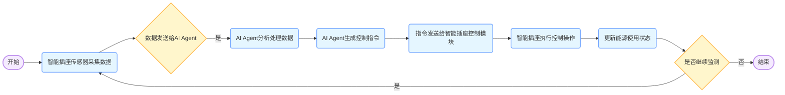

# AI Agent在智能插座中的能源使用优化

> 关键词：AI Agent、智能插座、能源使用优化、机器学习、物联网

> 摘要：本文深入探讨了AI Agent在智能插座中实现能源使用优化的相关技术和应用。首先介绍了研究的背景和目的，明确预期读者和文档结构。接着阐述了AI Agent、智能插座等核心概念及其联系，通过文本示意图和Mermaid流程图进行直观展示。详细讲解了实现能源使用优化的核心算法原理，并给出Python源代码示例。对相关数学模型和公式进行推导和举例说明。通过项目实战，从开发环境搭建、源代码实现到代码解读进行了全面分析。探讨了AI Agent在智能插座能源优化中的实际应用场景，推荐了相关的学习资源、开发工具框架以及论文著作。最后总结了未来发展趋势与挑战，提供常见问题解答和扩展阅读参考资料，旨在为相关领域的研究和实践提供全面而深入的指导。

## 1. 背景介绍 
### 1.1 目的和范围
随着全球能源问题的日益突出，提高能源利用效率成为当务之急。智能插座作为智能家居系统的重要组成部分，能够实时监测和控制电器的能源消耗。AI Agent具有自主学习和决策的能力，将其应用于智能插座中，可以根据用户的使用习惯、电器特性以及环境因素等，实现能源使用的优化，减少不必要的能源浪费，降低能源成本。本研究的范围主要集中在探讨AI Agent如何在智能插座中发挥作用，实现能源使用的优化，包括相关算法的设计、模型的建立以及实际应用的验证。

### 1.2 预期读者
本文预期读者包括从事智能家居、能源管理、人工智能等领域的研究人员、工程师、开发者，以及对智能插座能源优化感兴趣的技术爱好者和相关行业从业者。通过阅读本文，读者可以深入了解AI Agent在智能插座能源优化中的原理、方法和应用，为其在实际工作和研究中提供参考和借鉴。

### 1.3 文档结构概述
本文将按照以下结构进行组织：首先介绍背景信息，包括目的、预期读者和文档结构概述；接着阐述核心概念与联系，通过文本示意图和Mermaid流程图展示AI Agent和智能插座的关系；详细讲解核心算法原理和具体操作步骤，并给出Python源代码；推导数学模型和公式，通过举例进行说明；进行项目实战，包括开发环境搭建、源代码实现和代码解读；探讨实际应用场景；推荐相关的工具和资源；总结未来发展趋势与挑战；提供常见问题解答和扩展阅读参考资料。

### 1.4 术语表
#### 1.4.1 核心术语定义
- **AI Agent（人工智能代理）**：是一种能够感知环境、进行推理和决策，并采取行动以实现特定目标的智能实体。在智能插座能源优化中，AI Agent可以根据能源消耗数据、用户习惯等信息，自主地控制智能插座的开关，实现能源的优化使用。
- **智能插座**：是一种具备通信和控制功能的插座，能够实时监测电器的能源消耗，并通过网络与其他设备进行通信，实现远程控制和智能化管理。
- **能源使用优化**：通过合理的控制和管理，使能源的使用更加高效、经济，减少能源浪费，降低能源成本。

#### 1.4.2 相关概念解释
- **机器学习**：是一门多领域交叉学科，涉及概率论、统计学、逼近论、凸分析、算法复杂度理论等多门学科。它专门研究计算机怎样模拟或实现人类的学习行为，以获取新的知识或技能，重新组织已有的知识结构使之不断改善自身的性能。在智能插座能源优化中，机器学习算法可以用于分析能源消耗数据，预测用户的使用习惯，从而实现智能的能源控制。
- **物联网（IoT）**：是指通过各种信息传感器、射频识别技术、全球定位系统、红外感应器、激光扫描器等各种装置与技术，实时采集任何需要监控、连接、互动的物体或过程，采集其声、光、热、电、力学、化学、生物、位置等各种需要的信息，通过各类可能的网络接入，实现物与物、物与人的泛在连接，实现对物品和过程的智能化感知、识别和管理。智能插座作为物联网的终端设备，通过与其他设备的连接和通信，实现能源的智能化管理。

#### 1.4.3 缩略词列表
- **AI**：Artificial Intelligence（人工智能）
- **IoT**：Internet of Things（物联网）

## 2. 核心概念与联系 
### 核心概念原理
#### AI Agent原理
AI Agent的核心原理是基于感知、推理和决策的循环过程。它通过传感器感知环境信息，然后对这些信息进行分析和推理，根据预设的目标和规则，做出决策并采取相应的行动。在智能插座能源优化中，AI Agent可以通过智能插座的传感器获取电器的能源消耗数据、环境温度、时间等信息，然后利用机器学习算法对这些数据进行分析，预测用户的使用习惯和电器的能源需求，从而做出合理的决策，控制智能插座的开关，实现能源的优化使用。

#### 智能插座原理
智能插座通常由电源模块、控制模块、通信模块和传感器模块组成。电源模块为智能插座提供电力支持；控制模块负责对智能插座的开关进行控制；通信模块实现智能插座与其他设备的通信，如通过Wi-Fi、蓝牙等网络协议与智能手机、智能家居网关等设备进行连接；传感器模块用于实时监测电器的能源消耗、电流、电压等信息。智能插座通过这些模块的协同工作，实现对电器的智能化管理和能源监测。

### 架构的文本示意图
AI Agent与智能插座的架构关系可以描述为：AI Agent作为智能决策的核心，通过网络与智能插座进行通信。智能插座的传感器模块将采集到的能源消耗数据、环境信息等发送给AI Agent，AI Agent对这些数据进行分析和处理，根据预设的算法和模型，生成控制指令，并将指令发送给智能插座的控制模块，控制智能插座的开关状态，从而实现能源的优化使用。同时，AI Agent还可以与其他智能家居设备或云平台进行通信，获取更多的信息和数据，进一步优化能源管理策略。

### Mermaid流程图


## 3. 核心算法原理 & 具体操作步骤 
### 核心算法原理
在智能插座能源优化中，常用的核心算法包括机器学习算法，如决策树、神经网络、强化学习等。这里以强化学习算法为例进行讲解。

强化学习是一种通过智能体（Agent）与环境进行交互，不断尝试不同的行为，根据环境反馈的奖励信号来学习最优策略的机器学习方法。在智能插座能源优化中，AI Agent作为智能体，智能插座及其连接的电器和环境构成环境。AI Agent的目标是通过控制智能插座的开关，在满足用户需求的前提下，最小化能源消耗。

### 具体操作步骤
1. **定义状态空间**：状态空间包括电器的当前能源消耗、环境温度、时间、用户的历史使用习惯等信息。例如，可以将状态表示为一个向量 $s = [P, T, t, h]$，其中 $P$ 表示电器的当前功率，$T$ 表示环境温度，$t$ 表示当前时间，$h$ 表示用户的历史使用习惯。
2. **定义动作空间**：动作空间包括智能插座的开关状态，通常可以表示为 $a \in \{0, 1\}$，其中 $0$ 表示关闭，$1$ 表示打开。
3. **定义奖励函数**：奖励函数用于评估AI Agent采取某个动作后的效果。在能源优化中，奖励函数可以设计为与能源消耗和用户满意度相关。例如，奖励函数可以表示为 $r = -k_1P - k_2\delta$，其中 $P$ 表示能源消耗，$\delta$ 表示用户满意度的惩罚项，$k_1$ 和 $k_2$ 是权重系数。
4. **训练强化学习模型**：使用强化学习算法，如Q - learning算法，训练AI Agent学习最优策略。Q - learning算法通过不断更新Q值表来学习最优策略，Q值表示在某个状态下采取某个动作的预期奖励。
5. **部署和应用**：将训练好的强化学习模型部署到AI Agent中，AI Agent根据当前状态选择最优动作，控制智能插座的开关，实现能源的优化使用。

### Python源代码示例
```python
import numpy as np

# 定义状态空间、动作空间和奖励函数
state_space_size = 4  # 假设状态空间维度为4
action_space_size = 2  # 动作空间为2（0：关闭，1：打开）

# 初始化Q值表
q_table = np.zeros((state_space_size, action_space_size))

# 超参数设置
learning_rate = 0.1
discount_factor = 0.9
epsilon = 0.1
num_episodes = 1000

# 模拟环境交互函数
def get_reward(state, action):
    # 简单示例奖励函数，根据动作和状态计算奖励
    if action == 0:  # 关闭
        reward = -state[0] * 0.5  # 减少能源消耗奖励
    else:  # 打开
        reward = -state[0] * 1.0  # 增加能源消耗惩罚
    return reward

# 模拟环境状态转移函数
def get_next_state(state, action):
    # 简单示例状态转移函数，根据动作更新状态
    next_state = state.copy()
    if action == 0:  # 关闭
        next_state[0] = 0  # 功率变为0
    else:  # 打开
        next_state[0] = 100  # 功率变为100
    return next_state

# Q - learning算法训练
for episode in range(num_episodes):
    state = np.random.rand(state_space_size)  # 初始化状态
    done = False
    while not done:
        if np.random.uniform(0, 1) < epsilon:
            action = np.random.choice(action_space_size)  # 探索
        else:
            action = np.argmax(q_table[state])  # 利用

        reward = get_reward(state, action)
        next_state = get_next_state(state, action)

        # 更新Q值表
        q_table[state, action] = q_table[state, action] + learning_rate * (
                reward + discount_factor * np.max(q_table[next_state]) - q_table[state, action])

        state = next_state

        # 判断是否结束
        if np.sum(state) < 1:
            done = True

# 部署和应用
test_state = np.random.rand(state_space_size)
best_action = np.argmax(q_table[test_state])
print(f"在状态 {test_state} 下的最优动作是 {best_action}")
```

## 4. 数学模型和公式 & 详细讲解 & 举例说明 
### 强化学习数学模型
强化学习的数学模型主要基于马尔可夫决策过程（MDP）。一个马尔可夫决策过程可以用一个五元组 $\langle S, A, P, R, \gamma \rangle$ 表示，其中：
- $S$ 是状态空间，表示智能体可能处于的所有状态的集合。
- $A$ 是动作空间，表示智能体可以采取的所有动作的集合。
- $P(s'|s, a)$ 是状态转移概率，表示在状态 $s$ 下采取动作 $a$ 后转移到状态 $s'$ 的概率。
- $R(s, a, s')$ 是奖励函数，表示在状态 $s$ 下采取动作 $a$ 转移到状态 $s'$ 时获得的奖励。
- $\gamma \in [0, 1]$ 是折扣因子，表示未来奖励的重要程度。

### Q - learning算法公式
Q - learning算法的核心是更新Q值表。Q值表中的 $Q(s, a)$ 表示在状态 $s$ 下采取动作 $a$ 的预期奖励。Q - learning算法的更新公式为：
$$
Q(s, a) \leftarrow Q(s, a) + \alpha \left[R(s, a, s') + \gamma \max_{a'} Q(s', a') - Q(s, a)\right]
$$
其中：
- $\alpha$ 是学习率，表示每次更新Q值的步长。
- $R(s, a, s')$ 是在状态 $s$ 下采取动作 $a$ 转移到状态 $s'$ 时获得的奖励。
- $\gamma$ 是折扣因子，表示未来奖励的重要程度。
- $\max_{a'} Q(s', a')$ 表示在状态 $s'$ 下采取最优动作的Q值。

### 详细讲解
Q - learning算法的基本思想是通过不断地与环境进行交互，尝试不同的动作，根据环境反馈的奖励来更新Q值表，最终学习到最优策略。在每次交互中，智能体根据当前状态选择一个动作，执行该动作后，环境会反馈一个奖励和下一个状态。智能体根据这个奖励和下一个状态的最优Q值，更新当前状态和动作的Q值。随着交互次数的增加，Q值表会逐渐收敛到最优值，智能体也会学习到最优策略。

### 举例说明
假设智能插座的状态空间 $S = \{s_1, s_2\}$，动作空间 $A = \{a_1, a_2\}$，初始Q值表为：
$$
Q = \begin{bmatrix}
0 & 0 \\
0 & 0
\end{bmatrix}
$$
学习率 $\alpha = 0.1$，折扣因子 $\gamma = 0.9$。

在某一次交互中，智能体处于状态 $s_1$，选择动作 $a_1$，执行该动作后，环境反馈奖励 $R(s_1, a_1, s_2) = 10$，下一个状态为 $s_2$。在状态 $s_2$ 下，最优动作的Q值为 $\max_{a'} Q(s_2, a') = 5$。

根据Q - learning更新公式，更新 $Q(s_1, a_1)$ 的值：
$$
\begin{align*}
Q(s_1, a_1) &\leftarrow Q(s_1, a_1) + \alpha \left[R(s_1, a_1, s_2) + \gamma \max_{a'} Q(s_2, a') - Q(s_1, a_1)\right] \\
&= 0 + 0.1 \times (10 + 0.9 \times 5 - 0) \\
&= 0 + 0.1 \times (10 + 4.5) \\
&= 0 + 0.1 \times 14.5 \\
&= 1.45
\end{align*}
$$
更新后的Q值表为：
$$
Q = \begin{bmatrix}
1.45 & 0 \\
0 & 0
\end{bmatrix}
$$

## 5. 项目实战：代码实际案例和详细解释说明 
### 5.1  开发环境搭建
#### 硬件环境
- **智能插座**：选择支持通信功能的智能插座，如支持Wi-Fi或蓝牙通信的智能插座。常见的品牌有小米智能插座、TP - Link智能插座等。
- **开发板**：可以选择树莓派等开发板作为AI Agent的运行平台。树莓派具有丰富的接口和强大的计算能力，适合进行人工智能算法的开发和运行。

#### 软件环境
- **操作系统**：在开发板上安装Linux操作系统，如Raspbian系统。
- **编程语言**：使用Python作为开发语言，Python具有丰富的机器学习和物联网开发库，如TensorFlow、Keras、Paho - MQTT等。
- **开发工具**：使用PyCharm等集成开发环境进行Python代码的开发和调试。

### 5.2  源代码详细实现和代码解读
#### 智能插座数据采集模块
```python
import paho.mqtt.client as mqtt

# 智能插座MQTT服务器配置
MQTT_BROKER = "192.168.1.100"
MQTT_PORT = 1883
MQTT_TOPIC = "smart_socket/data"

# 连接成功回调函数
def on_connect(client, userdata, flags, rc):
    print(f"Connected with result code {rc}")
    client.subscribe(MQTT_TOPIC)

# 收到消息回调函数
def on_message(client, userdata, msg):
    data = msg.payload.decode()
    print(f"Received data: {data}")

# 创建MQTT客户端
client = mqtt.Client()
client.on_connect = on_connect
client.on_message = on_message

# 连接MQTT服务器
client.connect(MQTT_BROKER, MQTT_PORT, 60)

# 循环处理网络流量
client.loop_forever()
```
**代码解读**：
- 该代码使用Paho - MQTT库实现了智能插座数据的采集。首先配置了MQTT服务器的地址、端口和订阅的主题。
- 定义了 `on_connect` 回调函数，当客户端成功连接到MQTT服务器时，会打印连接结果并订阅指定的主题。
- 定义了 `on_message` 回调函数，当收到MQTT消息时，会将消息内容解码并打印出来。
- 创建MQTT客户端，设置回调函数，连接到MQTT服务器，并进入循环处理网络流量。

#### AI Agent决策模块
```python
import numpy as np

# 加载训练好的Q值表
q_table = np.load("q_table.npy")

# 定义状态空间和动作空间
state_space_size = 4
action_space_size = 2

# 根据状态选择动作
def choose_action(state):
    if np.random.uniform(0, 1) < 0.1:
        action = np.random.choice(action_space_size)  # 探索
    else:
        action = np.argmax(q_table[state])  # 利用
    return action

# 模拟获取状态
def get_state():
    state = np.random.rand(state_space_size)
    return state

# 主循环
while True:
    state = get_state()
    action = choose_action(state)
    print(f"当前状态: {state}, 选择动作: {action}")
```
**代码解读**：
- 该代码实现了AI Agent的决策功能。首先加载训练好的Q值表。
- 定义了状态空间和动作空间的大小。
- `choose_action` 函数根据当前状态选择动作，以一定的概率进行探索，否则选择Q值最大的动作。
- `get_state` 函数模拟获取当前状态。
- 主循环中不断获取状态，选择动作，并打印状态和动作信息。

#### 智能插座控制模块
```python
import paho.mqtt.client as mqtt

# 智能插座MQTT服务器配置
MQTT_BROKER = "192.168.1.100"
MQTT_PORT = 1883
MQTT_TOPIC = "smart_socket/control"

# 连接成功回调函数
def on_connect(client, userdata, flags, rc):
    print(f"Connected with result code {rc}")

# 创建MQTT客户端
client = mqtt.Client()
client.on_connect = on_connect

# 连接MQTT服务器
client.connect(MQTT_BROKER, MQTT_PORT, 60)

# 发送控制指令
def send_control_command(action):
    command = "ON" if action == 1 else "OFF"
    client.publish(MQTT_TOPIC, command)
    print(f"Sent control command: {command}")

# 示例调用
action = 1
send_control_command(action)

# 循环处理网络流量
client.loop_forever()
```
**代码解读**：
- 该代码实现了智能插座的控制功能。首先配置了MQTT服务器的地址、端口和发布的主题。
- 定义了 `on_connect` 回调函数，当客户端成功连接到MQTT服务器时，会打印连接结果。
- 创建MQTT客户端，设置回调函数，连接到MQTT服务器。
- `send_control_command` 函数根据动作值生成控制指令（ON或OFF），并通过MQTT发布到指定主题。
- 示例调用中发送了一个打开的控制指令。
- 最后进入循环处理网络流量。

### 5.3  代码解读与分析
#### 数据采集模块分析
数据采集模块通过MQTT协议从智能插座获取能源消耗等数据。MQTT是一种轻量级的消息传输协议，适合物联网设备之间的通信。通过订阅智能插座发布的主题，可以实时获取数据，为AI Agent的决策提供依据。

#### 决策模块分析
决策模块根据训练好的Q值表和当前状态选择最优动作。使用了Q - learning算法的思想，以一定的概率进行探索，避免陷入局部最优解。通过不断地与环境进行交互，更新Q值表，最终学习到最优策略。

#### 控制模块分析
控制模块根据决策模块选择的动作，通过MQTT协议向智能插座发送控制指令。将动作值转换为具体的控制指令（ON或OFF），实现对智能插座的远程控制，从而实现能源的优化使用。

## 6. 实际应用场景 
### 家庭能源管理
在家庭环境中，AI Agent可以根据用户的日常使用习惯，自动控制智能插座的开关。例如，在用户通常离开家的时间段，自动关闭不必要的电器，如电视、台灯等，减少能源浪费。在用户即将回家时，提前打开空调、热水器等电器，为用户提供舒适的居住环境。同时，AI Agent还可以根据实时电价信息，在电价低谷时段启动一些大功率电器，如洗衣机、烘干机等，降低家庭的能源成本。

### 商业场所能源管理
在商业场所，如办公室、商场等，AI Agent可以对大量的智能插座进行集中管理。根据场所的营业时间、人员流动情况等因素，自动控制电器的开关。例如，在办公室下班后，自动关闭电脑、打印机等设备；在商场非营业时间，关闭照明、空调等设备。通过优化能源使用，降低商业场所的运营成本。

### 工业能源管理
在工业领域，AI Agent可以应用于智能插座，对工业设备的能源消耗进行实时监测和优化。根据设备的生产计划、运行状态等信息，合理控制设备的启动和停止，提高能源利用效率。例如，在设备空闲时，自动降低设备的功率或关闭设备，减少能源浪费。同时，AI Agent还可以预测设备的能源需求，提前做好能源调配，确保工业生产的正常进行。

## 7. 工具和资源推荐
### 7.1 学习资源推荐
#### 7.1.1 书籍推荐
- 《人工智能：一种现代的方法》：全面介绍了人工智能的基本概念、算法和应用，是人工智能领域的经典教材。
- 《强化学习：原理与Python实现》：详细讲解了强化学习的原理和算法，并通过Python代码进行实现，适合初学者学习。
- 《物联网：从原理到实践》：介绍了物联网的基本原理、技术和应用，对理解智能插座和物联网的关系有很大帮助。

#### 7.1.2 在线课程
- Coursera上的“人工智能基础”课程：由知名高校教授授课，系统地介绍了人工智能的基础知识和算法。
- edX上的“强化学习”课程：深入讲解了强化学习的理论和实践，提供了丰富的案例和代码示例。
- 中国大学MOOC上的“物联网技术与应用”课程：介绍了物联网的关键技术和应用场景，对智能插座的开发和应用有指导作用。

#### 7.1.3 技术博客和网站
- 机器之心：提供人工智能领域的最新技术和研究成果，有很多关于强化学习和物联网的技术文章。
- 开源中国：涵盖了物联网、人工智能等多个领域的技术文章和开源项目，对学习和实践有很大帮助。
- 知乎：有很多关于人工智能、智能插座等话题的讨论和分享，可以了解到不同的观点和经验。

### 7.2 开发工具框架推荐
#### 7.2.1 IDE和编辑器
- PyCharm：是一款专业的Python集成开发环境，具有代码自动补全、调试、版本控制等功能，适合Python开发。
- Visual Studio Code：是一款轻量级的代码编辑器，支持多种编程语言和插件，可用于物联网和人工智能开发。
- Jupyter Notebook：是一种交互式的开发环境，适合进行数据探索、模型训练和代码演示。

#### 7.2.2 调试和性能分析工具
- PDB：Python自带的调试工具，可以对Python代码进行单步调试、设置断点等操作。
- TensorBoard：是TensorFlow的可视化工具，可以对深度学习模型的训练过程进行可视化分析，包括损失函数、准确率等指标。
- cProfile：Python的性能分析工具，可以分析代码的运行时间和函数调用情况，帮助优化代码性能。

#### 7.2.3 相关框架和库
- TensorFlow：是一个开源的机器学习框架，提供了丰富的深度学习算法和工具，可用于强化学习模型的训练和部署。
- Keras：是一个高级神经网络API，基于TensorFlow等后端，简化了深度学习模型的构建和训练过程。
- Paho - MQTT：是一个Python的MQTT客户端库，用于实现MQTT协议的通信，适合物联网设备之间的消息传输。

### 7.3 相关论文著作推荐
#### 7.3.1 经典论文
- “Reinforcement Learning: A Survey”：对强化学习的发展历程、算法和应用进行了全面的综述，是强化学习领域的经典论文。
- “A Markov Decision Process”：介绍了马尔可夫决策过程的基本概念和理论，是强化学习的理论基础。
- “Internet of Things: A Survey”：对物联网的概念、技术和应用进行了详细的介绍，对理解智能插座在物联网中的应用有重要参考价值。

#### 7.3.2 最新研究成果
- 关注IEEE、ACM等学术会议和期刊上的最新研究成果，如IEEE Internet of Things Journal、ACM Transactions on Sensor Networks等，了解AI Agent在智能插座能源优化中的最新技术和方法。

#### 7.3.3 应用案例分析
- 查阅相关的行业报告和案例分析，了解AI Agent在家庭、商业和工业等领域的智能插座能源优化中的实际应用效果和经验教训，为自己的项目提供参考。

## 8. 总结：未来发展趋势与挑战
### 未来发展趋势
#### 多智能体协同优化
未来，多个AI Agent可以在智能插座系统中协同工作，实现更复杂的能源优化策略。例如，不同房间的智能插座的AI Agent可以相互通信和协作，根据整个房屋的能源需求和环境信息，统一控制电器的开关，实现全局的能源优化。

#### 与其他智能家居系统的融合
AI Agent在智能插座中的应用将与其他智能家居系统，如智能照明、智能安防等进行深度融合。通过整合各个系统的数据和功能，可以实现更智能化的家居管理，提高用户的生活质量和能源利用效率。

#### 边缘计算与云计算的结合
将边缘计算和云计算技术相结合，AI Agent可以在智能插座本地进行部分数据处理和决策，减少数据传输延迟和云计算的压力。同时，将一些复杂的模型训练和数据分析任务放在云端进行，充分利用云计算的强大计算能力和存储资源。

### 挑战
#### 数据隐私和安全问题
智能插座采集的能源消耗数据和用户使用习惯等信息涉及用户的隐私和安全。如何保证这些数据的安全存储和传输，防止数据泄露和恶意攻击，是一个亟待解决的问题。

#### 模型的泛化能力
由于不同用户的使用习惯和电器特性存在差异，如何训练出具有良好泛化能力的AI Agent模型，使其能够在不同的环境和用户需求下都能实现有效的能源优化，是一个挑战。

#### 硬件成本和兼容性问题
智能插座和AI Agent的硬件成本较高，限制了其大规模推广应用。同时，不同品牌和型号的智能插座之间的兼容性问题也需要解决，以实现不同设备之间的互联互通和协同工作。

## 9. 附录：常见问题与解答
### 1. 如何选择适合的智能插座？
选择智能插座时，需要考虑以下因素：
- **通信协议**：常见的通信协议有Wi-Fi、蓝牙、ZigBee等。Wi-Fi通信范围广，使用方便；蓝牙功耗低，但通信距离有限；ZigBee适合大规模设备组网。
- **功能特性**：如是否支持能源监测、定时开关、远程控制等功能。
- **品牌和质量**：选择知名品牌的智能插座，质量和售后服务更有保障。

### 2. AI Agent模型训练需要多长时间？
AI Agent模型的训练时间取决于多个因素，如模型的复杂度、训练数据的规模、计算资源等。简单的模型可能只需要几分钟到几小时的训练时间，而复杂的模型可能需要数天甚至数周的训练时间。

### 3. 如何保证智能插座的安全性？
可以采取以下措施保证智能插座的安全性：
- **使用强密码**：设置复杂的登录密码和通信密钥，防止他人非法访问。
- **定期更新固件**：及时更新智能插座的固件，修复安全漏洞。
- **网络隔离**：将智能插座所在的网络与其他重要网络进行隔离，防止网络攻击。

### 4. AI Agent在智能插座中能源优化的效果如何评估？
可以从以下几个方面评估AI Agent在智能插座中能源优化的效果：
- **能源消耗降低率**：比较使用AI Agent前后的能源消耗，计算能源消耗降低的百分比。
- **用户满意度**：通过用户调查和反馈，了解用户对智能插座能源优化功能的满意度。
- **成本效益分析**：计算能源优化带来的成本节约，评估投资回报率。

## 10. 扩展阅读 & 参考资料
### 扩展阅读
- 阅读关于人工智能、机器学习、物联网等领域的最新研究成果和技术文章，深入了解相关技术的发展趋势和应用前景。
- 参与相关的技术论坛和社区，与其他技术爱好者和专家交流经验和心得，拓宽自己的视野。

### 参考资料
- 相关的学术论文、研究报告、技术文档等，为本文的研究和撰写提供了理论支持和数据依据。
- 智能插座和AI Agent相关的产品说明书、开发文档等，帮助了解产品的功能和使用方法。
- 在线开源代码库和项目，如GitHub上的相关项目，提供了实际的代码示例和开发经验。