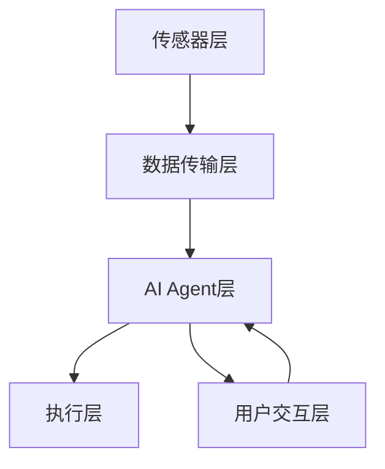

# AI Agent在智能晾衣架中的衣物护理建议

> 关键词：AI Agent、智能晾衣架、衣物护理、传感器技术、机器学习

> 摘要：本文聚焦于AI Agent在智能晾衣架中的应用，深入探讨其如何为衣物护理提供专业建议。首先介绍了相关背景知识，包括目的范围、预期读者等内容。接着阐述了核心概念与联系，通过文本示意图和Mermaid流程图清晰呈现。详细讲解了核心算法原理及具体操作步骤，结合Python代码进行说明。对涉及的数学模型和公式也进行了详细推导与举例。通过项目实战，展示了代码实际案例及解读。分析了AI Agent在智能晾衣架衣物护理方面的实际应用场景，推荐了相关工具和资源。最后总结了未来发展趋势与挑战，并提供了常见问题解答和扩展阅读参考资料，旨在全面介绍AI Agent在智能晾衣架衣物护理领域的应用与潜力。

## 1. 背景介绍 
### 1.1 目的和范围
随着智能家居的快速发展，智能晾衣架逐渐成为家庭生活中的一部分。传统晾衣架功能单一，仅能实现晾晒衣物的基本功能。而智能晾衣架借助先进的技术，如传感器、AI Agent等，不仅能实现自动化的晾晒操作，还能为用户提供专业的衣物护理建议。本文的目的在于深入探讨AI Agent在智能晾衣架中的应用原理、实现方法以及其在衣物护理建议方面的具体作用。范围涵盖了从AI Agent的基本概念到其在智能晾衣架中具体实现的各个环节，包括算法原理、数学模型、项目实战等内容。

### 1.2 预期读者
本文预期读者包括对智能家居技术感兴趣的普通消费者，希望了解智能晾衣架的新功能和应用前景；从事智能家居领域的研发人员，可从中获取AI Agent在智能晾衣架中应用的技术细节和实现思路；相关专业的学生和研究人员，作为学习和研究智能家居技术的参考资料。

### 1.3 文档结构概述
本文首先介绍背景知识，包括目的、预期读者和文档结构等内容。接着阐述核心概念与联系，帮助读者理解AI Agent和智能晾衣架的相关原理和架构。然后详细讲解核心算法原理和具体操作步骤，结合Python代码进行说明。随后介绍数学模型和公式，并举例说明其应用。通过项目实战，展示代码实际案例及解读。分析实际应用场景，推荐相关工具和资源。最后总结未来发展趋势与挑战，提供常见问题解答和扩展阅读参考资料。

### 1.4 术语表
#### 1.4.1 核心术语定义
- **AI Agent（人工智能代理）**：是一种能够感知环境、根据感知信息进行决策并采取行动以实现特定目标的智能实体。在智能晾衣架中，AI Agent通过传感器感知环境信息和衣物状态，为衣物护理提供建议。
- **智能晾衣架**：具备智能化功能的晾衣架，可通过传感器、网络通信等技术实现自动化控制和与用户的交互，能根据环境和衣物状态提供相应的服务。
- **衣物护理建议**：基于衣物的材质、颜色、污渍程度等信息以及环境条件，为用户提供的关于衣物晾晒、清洗、熨烫等方面的专业建议。

#### 1.4.2 相关概念解释
- **传感器技术**：用于感知环境信息和衣物状态的技术，包括温湿度传感器、光照传感器、重量传感器等。通过传感器获取的数据是AI Agent进行决策的重要依据。
- **机器学习**：AI Agent实现智能决策的一种重要方法，通过对大量数据的学习和分析，建立模型，从而对未知数据进行预测和分类。在智能晾衣架中，机器学习可用于根据衣物信息和环境条件生成合适的护理建议。

#### 1.4.3 缩略词列表
- **AI**：Artificial Intelligence（人工智能）
- **IoT**：Internet of Things（物联网）

## 2. 核心概念与联系 

### 核心概念原理
AI Agent在智能晾衣架中的应用基于感知、决策和执行的基本原理。智能晾衣架通过各种传感器感知环境信息（如温度、湿度、光照强度等）和衣物状态（如衣物材质、重量、污渍程度等），将这些信息传输给AI Agent。AI Agent根据预设的规则和机器学习模型对这些信息进行分析和处理，做出决策，生成衣物护理建议。最后，智能晾衣架根据这些建议执行相应的操作，如调整晾晒角度、控制烘干功能等。

### 架构的文本示意图
智能晾衣架的架构主要包括以下几个部分：
1. **传感器层**：负责感知环境信息和衣物状态，包括温湿度传感器、光照传感器、重量传感器、颜色传感器等。
2. **数据传输层**：将传感器采集的数据传输给AI Agent，可通过有线或无线通信方式实现，如Wi-Fi、蓝牙等。
3. **AI Agent层**：对采集的数据进行分析和处理，根据预设规则和机器学习模型生成衣物护理建议。
4. **执行层**：根据AI Agent生成的建议，控制智能晾衣架的各个部件执行相应的操作，如电机控制晾晒角度、加热元件控制烘干功能等。
5. **用户交互层**：用户可以通过手机APP、语音控制等方式与智能晾衣架进行交互，获取衣物护理建议并控制晾衣架的操作。

### Mermaid流程图


## 3. 核心算法原理 & 具体操作步骤 

### 核心算法原理
AI Agent在智能晾衣架中生成衣物护理建议主要基于规则推理和机器学习算法。规则推理是根据预设的规则对采集的数据进行判断和决策。例如，如果温度较低且湿度较高，建议开启烘干功能；如果衣物材质为丝绸，建议避免强光直射等。机器学习算法则通过对大量历史数据的学习和分析，建立模型，对未知数据进行预测和分类。例如，通过对不同材质衣物在不同环境条件下的晾晒时间和效果进行学习，预测新衣物的最佳晾晒时间。

### 具体操作步骤
1. **数据采集**：智能晾衣架的传感器实时采集环境信息和衣物状态数据，如温度、湿度、光照强度、衣物重量、颜色等。
2. **数据预处理**：对采集的数据进行清洗、归一化等预处理操作，去除噪声和异常值，将数据转换为适合算法处理的格式。
3. **规则推理**：根据预设的规则对预处理后的数据进行判断和决策，生成初步的衣物护理建议。
4. **机器学习预测**：将预处理后的数据输入到训练好的机器学习模型中，进行预测和分类，进一步优化衣物护理建议。
5. **建议生成**：综合规则推理和机器学习预测的结果，生成最终的衣物护理建议。
6. **执行与反馈**：智能晾衣架根据生成的建议执行相应的操作，并将执行结果反馈给AI Agent，以便进行后续的优化和调整。

### Python源代码详细阐述
以下是一个简单的Python示例代码，演示了如何根据温度和湿度数据进行规则推理，生成衣物护理建议：

```python
# 定义规则推理函数
def clothing_care_advice(temperature, humidity):
    if temperature < 10 and humidity > 80:
        return "温度较低且湿度较高，建议开启烘干功能。"
    elif temperature > 30 and humidity < 30:
        return "温度较高且湿度较低，注意衣物防晒和保湿。"
    else:
        return "当前环境适宜晾晒衣物。"

# 示例数据
temperature = 25
humidity = 60

# 生成衣物护理建议
advice = clothing_care_advice(temperature, humidity)
print(advice)
```

## 4. 数学模型和公式 & 详细讲解 & 举例说明 

### 数学模型和公式
在AI Agent生成衣物护理建议的过程中，机器学习模型是一个重要的组成部分。常见的机器学习模型包括决策树、支持向量机、神经网络等。以决策树为例，决策树是一种基于树结构进行决策的模型，每个内部节点表示一个属性上的测试，每个分支表示一个测试输出，每个叶节点表示一个类别或值。

决策树的构建过程可以使用信息增益、基尼指数等指标来选择最优的划分属性。信息增益的计算公式为：

$$IG(D, a) = Ent(D) - \sum_{v=1}^{V} \frac{|D^v|}{|D|} Ent(D^v)$$

其中，$IG(D, a)$ 表示属性 $a$ 对数据集 $D$ 的信息增益，$Ent(D)$ 表示数据集 $D$ 的信息熵，$D^v$ 表示属性 $a$ 取值为 $v$ 的样本子集，$V$ 表示属性 $a$ 的取值个数。

信息熵的计算公式为：

$$Ent(D) = -\sum_{k=1}^{K} p_k \log_2 p_k$$

其中，$p_k$ 表示数据集 $D$ 中第 $k$ 类样本所占的比例，$K$ 表示类别个数。

### 详细讲解
信息增益的作用是衡量属性对数据集的划分能力，信息增益越大，说明该属性对数据集的划分效果越好。在决策树的构建过程中，每次选择信息增益最大的属性作为当前节点的划分属性，递归地构建决策树。

### 举例说明
假设有一个衣物晾晒数据集，包含温度、湿度、衣物材质等属性，以及是否需要烘干的类别标签。我们可以使用信息增益来选择最优的划分属性，构建决策树模型。

以下是一个简单的Python示例代码，使用`scikit-learn`库构建决策树模型：

```python
from sklearn.datasets import load_iris
from sklearn.model_selection import train_test_split
from sklearn.tree import DecisionTreeClassifier
from sklearn.metrics import accuracy_score

# 加载示例数据集
iris = load_iris()
X = iris.data
y = iris.target

# 划分训练集和测试集
X_train, X_test, y_train, y_test = train_test_split(X, y, test_size=0.2, random_state=42)

# 构建决策树模型
clf = DecisionTreeClassifier(criterion='entropy')
clf.fit(X_train, y_train)

# 预测
y_pred = clf.predict(X_test)

# 计算准确率
accuracy = accuracy_score(y_test, y_pred)
print(f"Accuracy: {accuracy}")
```

## 5. 项目实战：代码实际案例和详细解释说明 

### 5.1  开发环境搭建
1. **硬件环境**：选择合适的智能晾衣架硬件平台，如带有温湿度传感器、光照传感器、电机等的智能晾衣架。确保传感器和执行部件能够正常工作，并与开发板进行连接。
2. **软件环境**：安装Python开发环境，建议使用Python 3.7及以上版本。安装相关的库，如`pandas`、`numpy`、`scikit-learn`等，用于数据处理和机器学习模型的构建。

### 5.2  源代码详细实现和代码解读
以下是一个完整的智能晾衣架衣物护理建议系统的Python代码示例：

```python
import pandas as pd
import numpy as np
from sklearn.tree import DecisionTreeClassifier
from sklearn.model_selection import train_test_split
from sklearn.metrics import accuracy_score

# 模拟传感器数据采集
def collect_sensor_data():
    temperature = np.random.randint(10, 35)
    humidity = np.random.randint(30, 90)
    clothing_material = np.random.choice(['cotton', 'silk', 'wool'])
    return temperature, humidity, clothing_material

# 数据预处理
def preprocess_data(temperature, humidity, clothing_material):
    material_mapping = {'cotton': 0, 'silk': 1, 'wool': 2}
    material_code = material_mapping[clothing_material]
    data = np.array([[temperature, humidity, material_code]])
    return data

# 训练决策树模型
def train_model():
    # 模拟数据集
    data = pd.DataFrame({
        'temperature': [20, 25, 30, 15, 22],
        'humidity': [60, 50, 40, 80, 70],
        'clothing_material': [0, 1, 2, 0, 1],
        'advice': [0, 1, 1, 2, 0]
    })
    X = data[['temperature', 'humidity', 'clothing_material']]
    y = data['advice']
    X_train, X_test, y_train, y_test = train_test_split(X, y, test_size=0.2, random_state=42)
    clf = DecisionTreeClassifier(criterion='entropy')
    clf.fit(X_train, y_train)
    y_pred = clf.predict(X_test)
    accuracy = accuracy_score(y_test, y_pred)
    print(f"Model accuracy: {accuracy}")
    return clf

# 生成衣物护理建议
def generate_advice(model, data):
    advice_mapping = {0: "正常晾晒", 1: "注意防晒", 2: "开启烘干功能"}
    prediction = model.predict(data)
    advice = advice_mapping[prediction[0]]
    return advice

# 主函数
def main():
    # 训练模型
    model = train_model()
    # 采集传感器数据
    temperature, humidity, clothing_material = collect_sensor_data()
    # 数据预处理
    data = preprocess_data(temperature, humidity, clothing_material)
    # 生成衣物护理建议
    advice = generate_advice(model, data)
    print(f"温度: {temperature}°C, 湿度: {humidity}%, 衣物材质: {clothing_material}")
    print(f"衣物护理建议: {advice}")

if __name__ == "__main__":
    main()
```

### 5.3  代码解读与分析
1. **数据采集**：`collect_sensor_data`函数模拟传感器采集环境信息和衣物状态数据，包括温度、湿度和衣物材质。
2. **数据预处理**：`preprocess_data`函数将衣物材质转换为数字编码，方便机器学习模型处理。
3. **模型训练**：`train_model`函数使用模拟数据集训练决策树模型，并计算模型的准确率。
4. **建议生成**：`generate_advice`函数根据训练好的模型对预处理后的数据进行预测，生成衣物护理建议。
5. **主函数**：`main`函数调用上述函数，完成数据采集、预处理、模型训练和建议生成的整个流程。

## 6. 实际应用场景 
1. **家庭日常使用**：在家庭中，智能晾衣架可以根据不同的天气条件和衣物材质，为用户提供专业的衣物护理建议。例如，在阴雨天气，建议开启烘干功能；对于丝绸衣物，建议避免强光直射等。
2. **酒店和民宿**：酒店和民宿可以使用智能晾衣架为客人提供更加贴心的服务。根据客人衣物的材质和需求，提供合适的晾晒和护理建议，提高客人的满意度。
3. **洗衣店**：洗衣店可以利用智能晾衣架的衣物护理建议功能，对清洗后的衣物进行科学的晾晒和护理，提高衣物的清洗质量和使用寿命。

## 7. 工具和资源推荐
### 7.1 学习资源推荐
#### 7.1.1 书籍推荐
- 《Python机器学习》：全面介绍了Python在机器学习领域的应用，包括数据处理、模型训练、评估等内容。
- 《人工智能：一种现代的方法》：经典的人工智能教材，涵盖了AI Agent、机器学习、自然语言处理等多个领域的知识。
#### 7.1.2 在线课程
- Coursera上的“Machine Learning”课程：由Andrew Ng教授主讲，是机器学习领域的经典课程。
- edX上的“Artificial Intelligence”课程：系统介绍了人工智能的基本概念、算法和应用。
#### 7.1.3 技术博客和网站
- Medium：有许多关于人工智能和智能家居的技术博客文章，提供了最新的技术动态和实践经验。
- Towards Data Science：专注于数据科学和机器学习领域，有很多高质量的技术文章和案例分析。

### 7.2 开发工具框架推荐
#### 7.2.1 IDE和编辑器
- PyCharm：专业的Python集成开发环境，提供了丰富的功能和插件，方便Python代码的开发和调试。
- Visual Studio Code：轻量级的代码编辑器，支持多种编程语言，有丰富的插件和扩展功能。
#### 7.2.2 调试和性能分析工具
- PDB：Python自带的调试工具，可以帮助开发者调试Python代码。
- cProfile：Python的性能分析工具，可以分析代码的运行时间和性能瓶颈。
#### 7.2.3 相关框架和库
- `scikit-learn`：Python的机器学习库，提供了丰富的机器学习算法和工具，方便模型的训练和评估。
- `TensorFlow`：开源的深度学习框架，可用于构建和训练神经网络模型。

### 7.3 相关论文著作推荐
#### 7.3.1 经典论文
- “A Logical Calculus of the Ideas Immanent in Nervous Activity”：Warren S. McCulloch和Walter Pitts发表的经典论文，提出了神经元模型，为神经网络的发展奠定了基础。
- “Learning Representations by Back-propagating Errors”：David E. Rumelhart、Geoffrey E. Hinton和Ronald J. Williams发表的论文，介绍了反向传播算法，推动了神经网络的发展。
#### 7.3.2 最新研究成果
- 关注顶级学术会议，如NeurIPS（神经信息处理系统大会）、ICML（国际机器学习会议）等，了解人工智能领域的最新研究成果。
#### 7.3.3 应用案例分析
- 查阅相关的学术期刊和研究报告，了解AI Agent在智能家居领域的应用案例和实践经验。

## 8. 总结：未来发展趋势与挑战
### 未来发展趋势
1. **智能化程度不断提高**：随着人工智能技术的不断发展，AI Agent在智能晾衣架中的应用将更加深入，能够提供更加个性化、精准的衣物护理建议。
2. **与其他智能家居设备的集成**：智能晾衣架将与其他智能家居设备进行集成，实现更加智能化的家居控制。例如，与智能空调、智能窗帘等设备联动，根据环境条件自动调整家居设备的运行状态。
3. **大数据和云计算的应用**：通过大数据和云计算技术，智能晾衣架可以收集和分析更多的用户数据和环境数据，不断优化衣物护理建议模型，提高服务质量。

### 挑战
1. **数据隐私和安全问题**：智能晾衣架在采集和处理用户数据的过程中，需要保障数据的隐私和安全，防止数据泄露和滥用。
2. **技术标准和规范的统一**：目前智能家居领域的技术标准和规范尚未统一，智能晾衣架的兼容性和互操作性存在一定的问题，需要加强标准和规范的制定。
3. **用户接受度**：部分用户对智能晾衣架的新功能和应用还存在疑虑，需要加强市场推广和用户教育，提高用户的接受度。

## 9. 附录：常见问题与解答
1. **智能晾衣架的传感器数据准确吗？**
智能晾衣架的传感器数据一般具有较高的准确性，但可能会受到环境因素的影响。在使用过程中，如果发现数据异常，可以检查传感器是否正常工作，或者进行校准操作。
2. **AI Agent生成的衣物护理建议可靠吗？**
AI Agent生成的衣物护理建议是基于大量的历史数据和机器学习模型，但由于实际情况的复杂性，建议仅供参考。用户在进行衣物护理时，还应结合自己的经验和实际情况进行判断。
3. **智能晾衣架的维护和保养需要注意什么？**
智能晾衣架的维护和保养主要包括定期清洁传感器、检查电机和电路等部件的工作状态、避免在潮湿环境中使用等。具体的维护和保养方法可以参考产品说明书。

## 10. 扩展阅读 & 参考资料
1. 《智能家居技术与应用》
2. 相关学术期刊：《Artificial Intelligence》、《Journal of Machine Learning Research》等
3. 相关网站：智能家居行业协会官网、人工智能研究机构官网等