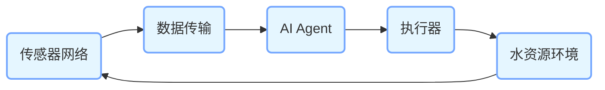

# AI Agent在智能水资源管理中的实践

> 关键词：AI Agent、智能水资源管理、机器学习、决策支持、传感器网络

> 摘要：本文深入探讨了AI Agent在智能水资源管理中的实践应用。首先介绍了智能水资源管理的背景和AI Agent的相关概念，阐述了二者结合的目的和意义。接着详细讲解了AI Agent的核心概念、架构及工作原理，通过Python代码展示了其核心算法。同时，给出了相关的数学模型和公式，并结合实际案例进行说明。在项目实战部分，从开发环境搭建到源代码实现与解读，全面介绍了如何在智能水资源管理中应用AI Agent。还分析了AI Agent在不同场景下的实际应用，并推荐了学习、开发相关的工具和资源。最后总结了AI Agent在智能水资源管理中的未来发展趋势与挑战，解答了常见问题，并提供了扩展阅读和参考资料。

## 1. 背景介绍 
### 1.1 目的和范围
随着全球人口的增长和经济的发展，水资源的合理管理和利用变得至关重要。智能水资源管理旨在利用先进的信息技术手段，实现水资源的高效配置、精准监测和科学决策。AI Agent作为一种具有自主决策和学习能力的智能实体，能够在复杂的水资源管理系统中发挥重要作用。本文的目的是详细介绍AI Agent在智能水资源管理中的实践应用，包括其原理、算法、实际案例等，范围涵盖了从理论基础到实际项目开发的各个方面。

### 1.2 预期读者
本文预期读者包括从事水资源管理、人工智能、计算机科学等领域的专业人士，如水资源工程师、数据科学家、软件开发者等。同时，对于对智能水资源管理和AI技术感兴趣的学生和研究人员也具有一定的参考价值。

### 1.3 文档结构概述
本文共分为十个部分。第一部分为背景介绍，阐述了文章的目的、预期读者和文档结构。第二部分介绍AI Agent和智能水资源管理的核心概念及其联系。第三部分详细讲解AI Agent的核心算法原理，并给出Python源代码。第四部分给出相关的数学模型和公式，并进行详细讲解和举例说明。第五部分是项目实战，包括开发环境搭建、源代码实现和代码解读。第六部分分析AI Agent在智能水资源管理中的实际应用场景。第七部分推荐了学习、开发相关的工具和资源。第八部分总结了未来发展趋势与挑战。第九部分解答了常见问题。第十部分提供了扩展阅读和参考资料。

### 1.4 术语表
#### 1.4.1 核心术语定义
- **AI Agent**：人工智能代理，是一种能够感知环境、自主决策并采取行动以实现特定目标的智能实体。
- **智能水资源管理**：利用先进的信息技术，如传感器网络、数据分析、人工智能等，对水资源进行实时监测、精准调控和科学决策的管理模式。
- **传感器网络**：由多个传感器节点组成的网络，用于实时采集水资源相关的数据，如水位、水质、流量等。
- **机器学习**：一门多领域交叉学科，涉及概率论、统计学、逼近论、凸分析、算法复杂度理论等多门学科。它专门研究计算机怎样模拟或实现人类的学习行为，以获取新的知识或技能，重新组织已有的知识结构使之不断改善自身的性能。

#### 1.4.2 相关概念解释
- **多Agent系统（MAS）**：由多个AI Agent组成的系统，这些Agent之间可以通过通信和协作来完成复杂的任务。在智能水资源管理中，多个AI Agent可以分别负责不同的任务，如数据采集、数据分析、决策制定等，通过协作实现水资源的高效管理。
- **强化学习**：一种机器学习方法，Agent通过与环境进行交互，根据环境反馈的奖励信号来学习最优的行为策略。在智能水资源管理中，AI Agent可以通过强化学习来学习如何根据不同的水资源状况做出最优的决策。

#### 1.4.3 缩略词列表
- **AI**：Artificial Intelligence，人工智能
- **MAS**：Multi-Agent System，多Agent系统
- **ML**：Machine Learning，机器学习
- **RL**：Reinforcement Learning，强化学习

## 2. 核心概念与联系 

### 2.1 AI Agent的核心概念
AI Agent是一种具有自主性、反应性、社会性和主动性的智能实体。自主性意味着Agent能够在没有人类干预的情况下自主地做出决策和采取行动；反应性表示Agent能够感知环境的变化并及时做出响应；社会性指Agent能够与其他Agent或人类进行通信和协作；主动性则表示Agent能够主动地追求目标。

在智能水资源管理中，AI Agent可以被看作是一个智能的决策者，它能够根据传感器网络采集到的水资源数据，如水位、水质、流量等，以及预设的目标和规则，自主地做出决策，如调整水库的水位、控制水闸的开关等。

### 2.2 智能水资源管理的核心概念
智能水资源管理是一种基于信息技术的水资源管理模式，它通过传感器网络实时采集水资源数据，利用数据分析和人工智能技术对数据进行处理和分析，从而实现水资源的高效配置、精准监测和科学决策。智能水资源管理的核心目标是在满足社会经济发展需求的前提下，最大限度地保护水资源的质量和数量，实现水资源的可持续利用。

### 2.3 AI Agent与智能水资源管理的联系
AI Agent与智能水资源管理之间存在着密切的联系。AI Agent可以作为智能水资源管理系统的核心组成部分，负责数据处理、决策制定和任务执行等重要任务。通过AI Agent的自主决策和学习能力，智能水资源管理系统能够更加灵活、高效地应对各种复杂的水资源管理问题。

### 2.4 核心概念原理和架构的文本示意图
```plaintext
智能水资源管理系统
|-- 传感器网络
|   |-- 水位传感器
|   |-- 水质传感器
|   |-- 流量传感器
|-- 数据传输
|   |-- 无线通信
|   |-- 有线通信
|-- AI Agent
|   |-- 数据处理模块
|   |-- 决策制定模块
|   |-- 任务执行模块
|-- 执行器
|   |-- 水闸
|   |-- 水泵
```

### 2.5 Mermaid流程图


## 3. 核心算法原理 & 具体操作步骤 

### 3.1 核心算法原理
在智能水资源管理中，AI Agent可以采用强化学习算法来实现自主决策。强化学习是一种通过与环境进行交互来学习最优行为策略的机器学习方法。在强化学习中，Agent通过不断地尝试不同的行为，并根据环境反馈的奖励信号来调整自己的行为策略，以最大化长期累积奖励。

以水库水位控制为例，AI Agent的目标是在满足下游用水需求的前提下，尽可能地保持水库水位在一个合理的范围内。Agent可以根据当前的水库水位、下游用水需求等信息，选择不同的放水策略，如放水量的大小和放水时间。环境会根据Agent的决策给出相应的奖励信号，如如果放水后水库水位保持在合理范围内且满足下游用水需求，则给予正奖励；如果放水后水库水位过低或过高，或者不满足下游用水需求，则给予负奖励。Agent通过不断地尝试不同的放水策略，并根据奖励信号来调整自己的行为策略，最终学习到最优的放水策略。

### 3.2 Python源代码实现
```python
import numpy as np

# 定义环境类
class ReservoirEnvironment:
    def __init__(self, initial_water_level, min_water_level, max_water_level, demand):
        self.water_level = initial_water_level
        self.min_water_level = min_water_level
        self.max_water_level = max_water_level
        self.demand = demand

    def step(self, action):
        # 执行动作，更新水库水位
        self.water_level -= action
        # 检查水位是否在合理范围内
        if self.water_level < self.min_water_level:
            reward = -10  # 水位过低，给予负奖励
        elif self.water_level > self.max_water_level:
            reward = -10  # 水位过高，给予负奖励
        elif action < self.demand:
            reward = -5  # 不满足下游用水需求，给予负奖励
        else:
            reward = 1  # 满足条件，给予正奖励
        # 判断是否结束
        done = False
        return self.water_level, reward, done

# 定义AI Agent类
class ReservoirAgent:
    def __init__(self, num_actions):
        self.num_actions = num_actions
        self.q_table = np.zeros((100, num_actions))  # 初始化Q表
        self.learning_rate = 0.1
        self.discount_factor = 0.9
        self.epsilon = 0.1

    def choose_action(self, state):
        if np.random.uniform(0, 1) < self.epsilon:
            # 探索：随机选择一个动作
            action = np.random.choice(self.num_actions)
        else:
            # 利用：选择Q值最大的动作
            action = np.argmax(self.q_table[state, :])
        return action

    def learn(self, state, action, reward, next_state):
        # 更新Q表
        predict = self.q_table[state, action]
        target = reward + self.discount_factor * np.max(self.q_table[next_state, :])
        self.q_table[state, action] += self.learning_rate * (target - predict)

# 主程序
if __name__ == "__main__":
    # 初始化环境
    env = ReservoirEnvironment(initial_water_level=50, min_water_level=20, max_water_level=80, demand=5)
    # 初始化Agent
    agent = ReservoirAgent(num_actions=10)
    num_episodes = 1000
    for episode in range(num_episodes):
        state = int(env.water_level)
        done = False
        while not done:
            action = agent.choose_action(state)
            next_state, reward, done = env.step(action)
            next_state = int(next_state)
            agent.learn(state, action, reward, next_state)
            state = next_state
        print(f"Episode {episode + 1} finished.")
```

### 3.3 具体操作步骤
1. **初始化环境和Agent**：创建水库环境对象和AI Agent对象，并初始化相关参数。
2. **训练Agent**：通过多次迭代，让Agent与环境进行交互，根据环境反馈的奖励信号来更新Q表，学习最优的行为策略。
3. **测试Agent**：使用训练好的Agent在实际环境中进行测试，观察其决策效果。

## 4. 数学模型和公式 & 详细讲解 & 举例说明 

### 4.1 强化学习的数学模型
强化学习的数学模型可以用马尔可夫决策过程（MDP）来描述。MDP是一个五元组 $(S, A, P, R, \gamma)$，其中：
- $S$ 是状态空间，表示环境的所有可能状态。
- $A$ 是动作空间，表示Agent可以采取的所有可能动作。
- $P(s'|s, a)$ 是状态转移概率，表示在状态 $s$ 下采取动作 $a$ 后转移到状态 $s'$ 的概率。
- $R(s, a, s')$ 是奖励函数，表示在状态 $s$ 下采取动作 $a$ 后转移到状态 $s'$ 时获得的奖励。
- $\gamma$ 是折扣因子，取值范围为 $[0, 1]$，用于权衡当前奖励和未来奖励的重要性。

### 4.2 Q学习算法的公式
Q学习是一种基于值函数的强化学习算法，其核心思想是通过不断地更新Q表来学习最优的行为策略。Q表是一个二维数组，$Q(s, a)$ 表示在状态 $s$ 下采取动作 $a$ 的价值。Q学习的更新公式如下：

$$
Q(s, a) \leftarrow Q(s, a) + \alpha [R(s, a, s') + \gamma \max_{a'} Q(s', a') - Q(s, a)]
$$

其中：
- $\alpha$ 是学习率，控制每次更新的步长。
- $R(s, a, s')$ 是在状态 $s$ 下采取动作 $a$ 后转移到状态 $s'$ 时获得的奖励。
- $\gamma$ 是折扣因子，用于权衡当前奖励和未来奖励的重要性。
- $\max_{a'} Q(s', a')$ 表示在状态 $s'$ 下采取最优动作的价值。

### 4.3 详细讲解
在Q学习算法中，Agent通过不断地与环境进行交互，根据当前状态 $s$ 选择一个动作 $a$，执行动作后环境会反馈一个奖励 $R(s, a, s')$ 并转移到下一个状态 $s'$。然后，Agent根据Q学习的更新公式来更新Q表中 $Q(s, a)$ 的值。通过多次迭代，Q表会逐渐收敛到最优的Q值，从而得到最优的行为策略。

### 4.4 举例说明
假设在水库水位控制问题中，状态空间 $S$ 表示水库的水位，动作空间 $A$ 表示放水量的大小。初始时，Q表中的所有值都为0。Agent在状态 $s$ 下选择一个动作 $a$，执行动作后环境反馈一个奖励 $R(s, a, s')$ 并转移到下一个状态 $s'$。假设当前的学习率 $\alpha = 0.1$，折扣因子 $\gamma = 0.9$，$Q(s, a) = 0$，$R(s, a, s') = 1$，$\max_{a'} Q(s', a') = 2$。根据Q学习的更新公式，$Q(s, a)$ 的更新值为：

$$
Q(s, a) = 0 + 0.1 [1 + 0.9 \times 2 - 0] = 0.28
$$

通过不断地迭代更新，Q表会逐渐收敛到最优的Q值，从而得到最优的放水策略。

## 5. 项目实战：代码实际案例和详细解释说明 

### 5.1  开发环境搭建
#### 5.1.1 安装Python
首先，需要安装Python编程语言。可以从Python官方网站（https://www.python.org/downloads/）下载适合自己操作系统的Python安装包，并按照安装向导进行安装。

#### 5.1.2 安装必要的库
在本项目中，需要使用NumPy库进行数值计算。可以使用以下命令来安装NumPy：
```sh
pip install numpy
```

### 5.2  源代码详细实现和代码解读
#### 5.2.1 环境类的实现
```python
class ReservoirEnvironment:
    def __init__(self, initial_water_level, min_water_level, max_water_level, demand):
        self.water_level = initial_water_level
        self.min_water_level = min_water_level
        self.max_water_level = max_water_level
        self.demand = demand

    def step(self, action):
        # 执行动作，更新水库水位
        self.water_level -= action
        # 检查水位是否在合理范围内
        if self.water_level < self.min_water_level:
            reward = -10  # 水位过低，给予负奖励
        elif self.water_level > self.max_water_level:
            reward = -10  # 水位过高，给予负奖励
        elif action < self.demand:
            reward = -5  # 不满足下游用水需求，给予负奖励
        else:
            reward = 1  # 满足条件，给予正奖励
        # 判断是否结束
        done = False
        return self.water_level, reward, done
```
**代码解读**：
- `__init__` 方法：初始化水库环境的参数，包括初始水位、最低水位、最高水位和下游用水需求。
- `step` 方法：执行Agent的动作，更新水库水位，并根据水位和用水需求情况给出相应的奖励信号。

#### 5.2.2 Agent类的实现
```python
class ReservoirAgent:
    def __init__(self, num_actions):
        self.num_actions = num_actions
        self.q_table = np.zeros((100, num_actions))  # 初始化Q表
        self.learning_rate = 0.1
        self.discount_factor = 0.9
        self.epsilon = 0.1

    def choose_action(self, state):
        if np.random.uniform(0, 1) < self.epsilon:
            # 探索：随机选择一个动作
            action = np.random.choice(self.num_actions)
        else:
            # 利用：选择Q值最大的动作
            action = np.argmax(self.q_table[state, :])
        return action

    def learn(self, state, action, reward, next_state):
        # 更新Q表
        predict = self.q_table[state, action]
        target = reward + self.discount_factor * np.max(self.q_table[next_state, :])
        self.q_table[state, action] += self.learning_rate * (target - predict)
```
**代码解读**：
- `__init__` 方法：初始化Agent的参数，包括动作数量、Q表、学习率、折扣因子和探索率。
- `choose_action` 方法：根据当前状态选择一个动作，采用 $\epsilon$-贪心策略，以一定的概率进行探索，以一定的概率进行利用。
- `learn` 方法：根据环境反馈的奖励信号和下一个状态，更新Q表中当前状态和动作的Q值。

#### 5.2.3 主程序的实现
```python
if __name__ == "__main__":
    # 初始化环境
    env = ReservoirEnvironment(initial_water_level=50, min_water_level=20, max_water_level=80, demand=5)
    # 初始化Agent
    agent = ReservoirAgent(num_actions=10)
    num_episodes = 1000
    for episode in range(num_episodes):
        state = int(env.water_level)
        done = False
        while not done:
            action = agent.choose_action(state)
            next_state, reward, done = env.step(action)
            next_state = int(next_state)
            agent.learn(state, action, reward, next_state)
            state = next_state
        print(f"Episode {episode + 1} finished.")
```
**代码解读**：
- 初始化水库环境和AI Agent。
- 进行多次迭代训练，每次迭代称为一个回合（episode）。
- 在每个回合中，Agent根据当前状态选择一个动作，执行动作后环境反馈奖励和下一个状态，Agent根据奖励和下一个状态更新Q表。

### 5.3  代码解读与分析
#### 5.3.1 代码的核心逻辑
代码的核心逻辑是通过强化学习算法让AI Agent学习最优的放水策略。Agent通过与水库环境进行交互，不断地尝试不同的放水策略，并根据环境反馈的奖励信号来调整自己的行为策略，最终学习到最优的放水策略。

#### 5.3.2 代码的优缺点
**优点**：
- 代码结构清晰，易于理解和扩展。
- 采用强化学习算法，能够自适应地学习最优的行为策略。

**缺点**：
- Q学习算法的收敛速度较慢，需要大量的训练时间。
- 代码中使用的状态和动作空间是离散的，对于连续的状态和动作空间需要进行扩展。

#### 5.3.3 代码的改进方向
- 可以采用更高效的强化学习算法，如深度Q网络（DQN），以提高收敛速度。
- 可以将状态和动作空间扩展为连续的，以适应更复杂的实际应用场景。

## 6. 实际应用场景 
### 6.1 水库水位控制
在水库水位控制中，AI Agent可以根据实时的水位数据、下游用水需求和气象预报等信息，自主地调整水库的放水量，以保持水库水位在一个合理的范围内。例如，在干旱季节，AI Agent可以减少放水量，以保证水库有足够的水量供应；在雨季，AI Agent可以增加放水量，以防止水库水位过高。

### 6.2 水质监测与处理
AI Agent可以通过传感器网络实时监测水质数据，如酸碱度、溶解氧、化学需氧量等。当水质数据超过预设的阈值时，AI Agent可以自动触发相应的处理措施，如投放消毒剂、调整水流速度等，以保证水质符合标准。

### 6.3 水资源分配
在水资源分配中，AI Agent可以根据不同用户的用水需求、水资源的可利用量和水资源的优先级等因素，合理地分配水资源。例如，在农业灌溉中，AI Agent可以根据农作物的生长阶段和土壤湿度等信息，合理地分配灌溉用水，以提高水资源的利用效率。

### 6.4 洪水预警与应急处理
AI Agent可以通过传感器网络实时监测水位、流量等数据，结合气象预报和历史数据，对洪水进行预警。当预测到可能发生洪水时，AI Agent可以自动触发应急处理措施，如提前打开水闸、疏散人员等，以减少洪水造成的损失。

## 7. 工具和资源推荐
### 7.1 学习资源推荐
#### 7.1.1 书籍推荐
- 《人工智能：一种现代的方法》：这本书是人工智能领域的经典教材，全面介绍了人工智能的各个方面，包括搜索算法、知识表示、推理、机器学习、自然语言处理等。
- 《强化学习：原理与Python实现》：这本书详细介绍了强化学习的基本原理和算法，并通过Python代码实现了多个强化学习的案例。
- 《Python机器学习实战》：这本书介绍了Python在机器学习中的应用，包括数据预处理、模型选择、分类算法、回归算法等。

#### 7.1.2 在线课程
- Coursera上的“人工智能基础”课程：该课程由知名教授授课，全面介绍了人工智能的基本概念、算法和应用。
- edX上的“强化学习”课程：该课程深入讲解了强化学习的原理和算法，并通过实际案例进行了演示。
- 中国大学MOOC上的“Python语言程序设计”课程：该课程适合初学者，介绍了Python语言的基本语法和编程技巧。

#### 7.1.3 技术博客和网站
- Medium：Medium上有很多关于人工智能和机器学习的技术博客，其中不乏一些优秀的文章和教程。
- Towards Data Science：这是一个专注于数据科学和机器学习的网站，提供了大量的技术文章和案例分析。
- 博客园：博客园上有很多国内开发者分享的技术文章和经验，对于学习和实践有很大的帮助。

### 7.2 开发工具框架推荐
#### 7.2.1 IDE和编辑器
- PyCharm：PyCharm是一款专门为Python开发设计的集成开发环境，具有代码自动补全、调试、版本控制等功能。
- Visual Studio Code：Visual Studio Code是一款轻量级的代码编辑器，支持多种编程语言，具有丰富的插件和扩展功能。
- Jupyter Notebook：Jupyter Notebook是一个交互式的编程环境，适合进行数据分析和机器学习的实验和演示。

#### 7.2.2 调试和性能分析工具
- PDB：PDB是Python自带的调试工具，可以在代码中设置断点，逐步执行代码，查看变量的值和程序的执行流程。
- cProfile：cProfile是Python的性能分析工具，可以分析代码的运行时间和函数调用次数，帮助找出性能瓶颈。
- TensorBoard：TensorBoard是TensorFlow的可视化工具，可以可视化训练过程中的损失函数、准确率等指标，帮助调试和优化模型。

#### 7.2.3 相关框架和库
- NumPy：NumPy是Python的数值计算库，提供了高效的多维数组对象和数学函数，是机器学习和数据分析的基础库。
- Pandas：Pandas是Python的数据处理库，提供了高效的数据结构和数据处理方法，适合进行数据清洗、分析和可视化。
- TensorFlow：TensorFlow是Google开发的深度学习框架，提供了丰富的深度学习模型和工具，支持分布式训练和部署。
- PyTorch：PyTorch是Facebook开发的深度学习框架，具有动态图的特点，易于使用和调试，在学术界和工业界都有广泛的应用。

### 7.3 相关论文著作推荐
#### 7.3.1 经典论文
- “Reinforcement Learning: An Introduction”：这是强化学习领域的经典著作，全面介绍了强化学习的基本原理和算法。
- “Playing Atari with Deep Reinforcement Learning”：这篇论文提出了深度Q网络（DQN）算法，将深度学习和强化学习相结合，在Atari游戏中取得了很好的效果。
- “Mastering the Game of Go without Human Knowledge”：这篇论文介绍了AlphaGo Zero算法，通过强化学习和自学习的方式，在围棋游戏中取得了超越人类的水平。

#### 7.3.2 最新研究成果
- 可以关注arXiv（https://arxiv.org/）上关于人工智能和水资源管理的最新研究论文，了解最新的研究动态和技术进展。

#### 7.3.3 应用案例分析
- 可以参考一些学术期刊和会议论文，了解AI Agent在智能水资源管理中的实际应用案例和效果分析。

## 8. 总结：未来发展趋势与挑战
### 8.1 未来发展趋势
#### 8.1.1 多Agent系统的应用
未来，智能水资源管理系统将越来越多地采用多Agent系统。多个AI Agent可以分别负责不同的任务，如数据采集、数据分析、决策制定等，通过协作实现水资源的高效管理。多Agent系统可以提高系统的灵活性和适应性，更好地应对复杂多变的水资源管理问题。

#### 8.1.2 深度学习与强化学习的融合
深度学习和强化学习的融合将是未来AI Agent在智能水资源管理中的一个重要发展趋势。深度学习可以用于处理复杂的传感器数据，如图像、视频等，提取更丰富的特征信息；强化学习可以用于决策制定，根据深度学习提取的特征信息做出最优的决策。通过深度学习和强化学习的融合，可以提高AI Agent的智能水平和决策能力。

#### 8.1.3 与物联网和大数据的结合
随着物联网和大数据技术的发展，智能水资源管理系统将能够采集更多、更准确的水资源数据。AI Agent可以利用这些大数据进行更深入的分析和挖掘，从而做出更科学、更合理的决策。同时，物联网技术可以实现设备的远程监控和控制，提高水资源管理的效率和便捷性。

### 8.2 挑战
#### 8.2.1 数据质量和安全问题
智能水资源管理系统依赖于大量的传感器数据，数据的质量和安全直接影响到AI Agent的决策效果。数据可能存在噪声、缺失值等问题，需要进行预处理和清洗。同时，数据的安全也是一个重要的问题，需要采取有效的措施来保护数据的隐私和完整性。

#### 8.2.2 算法的可解释性
AI Agent采用的一些复杂的机器学习和深度学习算法，如深度神经网络，往往具有较高的复杂度和黑盒性，其决策过程难以解释。在智能水资源管理中，决策的可解释性非常重要，因为管理者需要了解决策的依据和合理性。因此，如何提高算法的可解释性是一个亟待解决的问题。

#### 8.2.3 系统的可靠性和稳定性
智能水资源管理系统涉及到水资源的调配和控制，系统的可靠性和稳定性直接关系到人民的生命财产安全。AI Agent在实际应用中可能会遇到各种复杂的情况，如网络故障、传感器故障等，需要具备一定的容错能力和应急处理能力，以保证系统的可靠性和稳定性。

## 9. 附录：常见问题与解答
### 9.1 什么是AI Agent？
AI Agent是一种能够感知环境、自主决策并采取行动以实现特定目标的智能实体。它具有自主性、反应性、社会性和主动性等特点。

### 9.2 AI Agent在智能水资源管理中有哪些应用？
AI Agent在智能水资源管理中的应用包括水库水位控制、水质监测与处理、水资源分配、洪水预警与应急处理等。

### 9.3 如何实现AI Agent在智能水资源管理中的应用？
可以采用强化学习等机器学习算法来实现AI Agent在智能水资源管理中的应用。具体步骤包括初始化环境和Agent、训练Agent、测试Agent等。

### 9.4 AI Agent在智能水资源管理中的应用有哪些挑战？
AI Agent在智能水资源管理中的应用面临着数据质量和安全问题、算法的可解释性问题、系统的可靠性和稳定性问题等挑战。

### 9.5 如何提高AI Agent在智能水资源管理中的决策效果？
可以通过提高数据质量、采用更高效的算法、优化模型参数等方式来提高AI Agent在智能水资源管理中的决策效果。同时，还可以结合领域知识和专家经验，对AI Agent的决策进行验证和调整。

## 10. 扩展阅读 & 参考资料
### 10.1 扩展阅读
- 《智能水资源系统》：这本书介绍了智能水资源系统的基本概念、技术和应用，对于深入了解智能水资源管理有很大的帮助。
- 《人工智能与水资源管理》：这本书探讨了人工智能在水资源管理中的应用前景和挑战，提供了一些实际案例和解决方案。

### 10.2 参考资料
- 相关的学术期刊和会议论文，如《Water Resources Research》、《Journal of Hydrology》等。
- 政府部门和行业组织发布的水资源管理相关政策和报告。
- 开源的智能水资源管理项目和代码库。