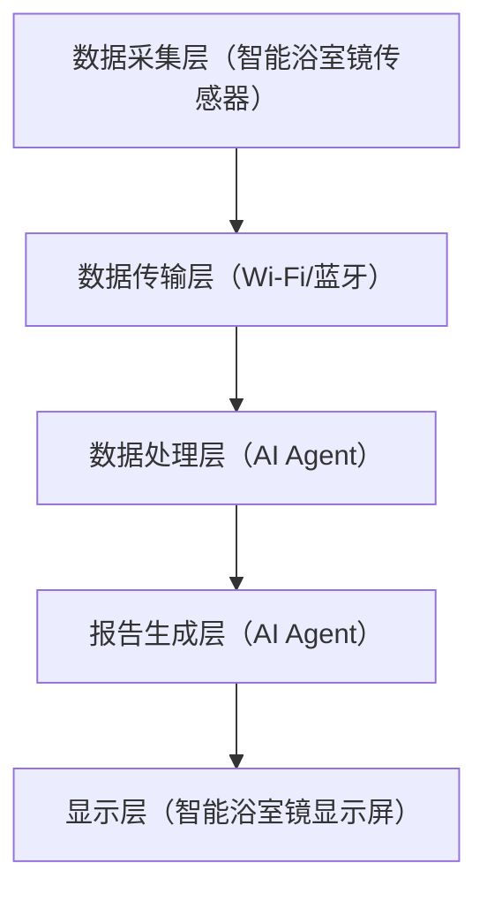

# AI Agent在智能浴室镜中的每日健康报告

> 关键词：AI Agent、智能浴室镜、每日健康报告、健康监测、人工智能

> 摘要：本文深入探讨了AI Agent在智能浴室镜中实现每日健康报告的相关技术与应用。首先介绍了该研究的背景，包括目的、预期读者、文档结构和术语表。接着阐述了核心概念与联系，通过文本示意图和Mermaid流程图展示其架构。详细讲解了核心算法原理及具体操作步骤，用Python代码进行了说明。同时给出了相关的数学模型和公式，并举例说明。通过项目实战部分，展示了代码实际案例及详细解释。探讨了其实际应用场景，推荐了相关的工具和资源。最后总结了未来发展趋势与挑战，提供了常见问题解答和扩展阅读参考资料，旨在为智能浴室镜结合AI Agent实现健康报告的技术发展和应用提供全面的技术指导和参考。

## 1. 背景介绍 
### 1.1 目的和范围
随着科技的飞速发展，智能家居设备逐渐走进人们的生活。智能浴室镜作为智能家居的重要组成部分，不再仅仅是简单的镜子，而是具备了更多的功能。本研究的目的在于探讨如何利用AI Agent技术，使智能浴室镜能够为用户生成每日健康报告，为用户提供更加个性化、便捷的健康监测和管理服务。

研究范围涵盖了AI Agent的相关理论和技术、智能浴室镜的硬件和软件架构、健康数据的采集和分析方法，以及如何将这些技术整合在一起，实现每日健康报告的生成和展示。

### 1.2 预期读者
本文的预期读者包括智能家居领域的研发人员、人工智能专家、健康监测设备的开发者、对智能浴室镜和健康管理感兴趣的技术爱好者以及相关行业的研究人员。通过阅读本文，读者可以了解到AI Agent在智能浴室镜中的应用原理、技术实现细节和未来发展趋势，为相关领域的研究和开发提供参考。

### 1.3 文档结构概述
本文将按照以下结构进行阐述：
1. 背景介绍：介绍研究的目的、预期读者、文档结构和术语表。
2. 核心概念与联系：阐述AI Agent、智能浴室镜和每日健康报告的核心概念，展示它们之间的联系和架构。
3. 核心算法原理 & 具体操作步骤：详细讲解实现每日健康报告的核心算法原理，并给出具体的操作步骤和Python代码示例。
4. 数学模型和公式 & 详细讲解 & 举例说明：介绍相关的数学模型和公式，对其进行详细讲解，并通过实际例子进行说明。
5. 项目实战：代码实际案例和详细解释说明：通过一个实际的项目案例，展示如何实现AI Agent在智能浴室镜中的每日健康报告功能，包括开发环境搭建、源代码实现和代码解读。
6. 实际应用场景：探讨AI Agent在智能浴室镜中每日健康报告的实际应用场景和优势。
7. 工具和资源推荐：推荐相关的学习资源、开发工具框架和论文著作。
8. 总结：未来发展趋势与挑战：总结AI Agent在智能浴室镜中每日健康报告的发展趋势和面临的挑战。
9. 附录：常见问题与解答：提供常见问题的解答，帮助读者更好地理解和应用相关技术。
10. 扩展阅读 & 参考资料：提供扩展阅读的建议和相关参考资料，方便读者进一步深入研究。

### 1.4 术语表
#### 1.4.1 核心术语定义
- **AI Agent（人工智能代理）**：是一种能够感知环境、做出决策并采取行动的智能实体。在本文中，AI Agent用于处理智能浴室镜采集的健康数据，进行分析和生成每日健康报告。
- **智能浴室镜**：集成了多种传感器和智能技术的浴室镜，能够采集用户的健康数据，如心率、血压、体脂率等，并与AI Agent进行交互，展示每日健康报告。
- **每日健康报告**：根据智能浴室镜采集的用户健康数据，由AI Agent生成的包含用户健康状况、健康建议等信息的报告，每天更新一次。

#### 1.4.2 相关概念解释
- **传感器技术**：用于采集用户健康数据的技术，如光学传感器、生物电传感器等。
- **数据分析**：对采集到的健康数据进行处理和分析，提取有价值的信息，如健康指标的变化趋势、异常情况等。
- **机器学习**：一种人工智能技术，通过对大量数据的学习和训练，使计算机能够自动识别模式和规律，用于健康数据的预测和分析。

#### 1.4.3 缩略词列表
- **AI**：Artificial Intelligence（人工智能）
- **IoT**：Internet of Things（物联网）
- **API**：Application Programming Interface（应用程序编程接口）

## 2. 核心概念与联系 

### 核心概念原理
#### AI Agent
AI Agent是人工智能领域中的一个重要概念，它可以被看作是一个具有自主决策能力的智能体。AI Agent通过感知环境获取信息，然后根据预设的规则或通过机器学习算法进行决策，最后采取相应的行动。在智能浴室镜的场景中，AI Agent的主要任务是接收智能浴室镜采集的健康数据，对这些数据进行分析和处理，生成每日健康报告，并将报告展示给用户。

#### 智能浴室镜
智能浴室镜是一种集成了多种传感器和智能技术的设备。它通过内置的传感器，如心率传感器、血压传感器、体脂率传感器等，采集用户的健康数据。同时，智能浴室镜还具备显示功能，能够将AI Agent生成的每日健康报告展示给用户。此外，智能浴室镜还可以与其他智能家居设备进行联动，实现更加智能化的家居体验。

#### 每日健康报告
每日健康报告是根据智能浴室镜采集的用户健康数据生成的一份报告。报告中通常包含用户的基本健康指标，如心率、血压、体脂率等，以及这些指标的变化趋势和健康建议。每日健康报告的目的是帮助用户了解自己的健康状况，及时发现潜在的健康问题，并提供相应的健康建议，促进用户的健康管理。

### 架构的文本示意图
智能浴室镜与AI Agent实现每日健康报告的架构主要包括以下几个部分：
1. **数据采集层**：由智能浴室镜中的各种传感器组成，负责采集用户的健康数据，如心率、血压、体脂率等。
2. **数据传输层**：将采集到的健康数据通过无线通信技术（如Wi-Fi、蓝牙等）传输到AI Agent所在的服务器或本地设备。
3. **数据处理层**：AI Agent对传输过来的健康数据进行分析和处理，运用机器学习算法和数据分析技术，提取有价值的信息。
4. **报告生成层**：根据数据处理层的分析结果，AI Agent生成每日健康报告，报告中包含用户的健康指标、变化趋势和健康建议。
5. **显示层**：智能浴室镜将AI Agent生成的每日健康报告展示给用户，用户可以通过触摸屏幕或语音交互等方式查看报告内容。

### Mermaid流程图


## 3. 核心算法原理 & 具体操作步骤 

### 核心算法原理
在实现AI Agent在智能浴室镜中的每日健康报告功能时，主要涉及到以下几种核心算法：
1. **数据预处理算法**：由于传感器采集到的原始数据可能存在噪声、缺失值等问题，需要对数据进行预处理。常见的数据预处理算法包括数据清洗、数据归一化、数据插值等。
2. **数据分析算法**：对预处理后的数据进行分析，提取有价值的信息。例如，通过计算健康指标的平均值、标准差、变化趋势等，了解用户的健康状况。常用的数据分析算法包括统计分析、机器学习算法等。
3. **健康评估算法**：根据数据分析的结果，对用户的健康状况进行评估。例如，根据心率、血压等指标，判断用户是否存在健康风险。健康评估算法可以基于医学知识和经验规则，也可以通过机器学习算法进行训练。
4. **报告生成算法**：根据健康评估的结果，生成每日健康报告。报告生成算法需要考虑报告的格式、内容和可读性，确保用户能够轻松理解报告中的信息。

### 具体操作步骤及Python代码示例

#### 数据预处理
以下是一个简单的数据预处理示例，用于清洗和归一化健康数据：

```python
import numpy as np

# 模拟采集到的健康数据
raw_data = np.array([120, 80, 70, np.nan, 130, 85])

# 数据清洗：处理缺失值
cleaned_data = np.nan_to_num(raw_data, nan=np.nanmean(raw_data))

# 数据归一化
normalized_data = (cleaned_data - np.min(cleaned_data)) / (np.max(cleaned_data) - np.min(cleaned_data))

print("原始数据:", raw_data)
print("清洗后的数据:", cleaned_data)
print("归一化后的数据:", normalized_data)
```

#### 数据分析
以下是一个简单的数据分析示例，用于计算健康数据的平均值和标准差：

```python
import numpy as np

# 模拟预处理后的健康数据
processed_data = np.array([0.5, 0.6, 0.7, 0.8, 0.9])

# 计算平均值
mean_value = np.mean(processed_data)

# 计算标准差
std_value = np.std(processed_data)

print("平均值:", mean_value)
print("标准差:", std_value)
```

#### 健康评估
以下是一个简单的健康评估示例，根据心率数据判断用户是否存在健康风险：

```python
# 模拟心率数据
heart_rate = 120

# 定义健康阈值
normal_range = (60, 100)

if heart_rate < normal_range[0] or heart_rate > normal_range[1]:
    print("心率异常，存在健康风险！")
else:
    print("心率正常。")
```

#### 报告生成
以下是一个简单的报告生成示例，将健康评估结果生成文本报告：

```python
# 模拟健康评估结果
health_status = "心率异常，存在健康风险！"

# 生成报告
report = f"今日健康报告：\n健康状况：{health_status}\n建议：请及时就医检查。"

print(report)
```

## 4. 数学模型和公式 & 详细讲解 & 举例说明 

### 数据预处理相关公式
#### 数据清洗 - 均值填充
当数据中存在缺失值时，可以使用均值填充的方法进行处理。设原始数据为 $x_1, x_2, \cdots, x_n$，其中存在缺失值，填充后的数据集为 $\hat{x}_1, \hat{x}_2, \cdots, \hat{x}_n$。均值填充的公式为：

$$
\hat{x}_i = 
\begin{cases}
x_i, & \text{如果 } x_i \text{ 不是缺失值} \\
\frac{1}{m} \sum_{j=1}^{m} x_{k_j}, & \text{如果 } x_i \text{ 是缺失值}
\end{cases}
$$

其中，$m$ 是数据集中非缺失值的数量，$x_{k_j}$ 是第 $j$ 个非缺失值。

**举例说明**：假设有数据 $[10, 20, \text{nan}, 40]$，非缺失值的均值为 $\frac{10 + 20 + 40}{3} = \frac{70}{3} \approx 23.33$，则填充后的数据为 $[10, 20, 23.33, 40]$。

#### 数据归一化 - 最小 - 最大归一化
最小 - 最大归一化是一种常用的数据归一化方法，将数据缩放到 $[0, 1]$ 区间。设原始数据为 $x$，归一化后的数据为 $\hat{x}$，则最小 - 最大归一化的公式为：

$$
\hat{x} = \frac{x - \min(X)}{\max(X) - \min(X)}
$$

其中，$\min(X)$ 和 $\max(X)$ 分别是数据集 $X$ 中的最小值和最大值。

**举例说明**：假设有数据 $[10, 20, 30, 40]$，$\min(X) = 10$，$\max(X) = 40$，则归一化后的数据为 $[0, \frac{1}{3}, \frac{2}{3}, 1]$。

### 数据分析相关公式
#### 均值
均值是一组数据的平均值，用于反映数据的集中趋势。设数据集为 $x_1, x_2, \cdots, x_n$，则均值 $\bar{x}$ 的计算公式为：

$$
\bar{x} = \frac{1}{n} \sum_{i=1}^{n} x_i
$$

**举例说明**：假设有数据 $[1, 2, 3, 4, 5]$，则均值为 $\frac{1 + 2 + 3 + 4 + 5}{5} = 3$。

#### 标准差
标准差是衡量数据离散程度的指标。设数据集为 $x_1, x_2, \cdots, x_n$，均值为 $\bar{x}$，则标准差 $\sigma$ 的计算公式为：

$$
\sigma = \sqrt{\frac{1}{n} \sum_{i=1}^{n} (x_i - \bar{x})^2}
$$

**举例说明**：假设有数据 $[1, 2, 3, 4, 5]$，均值为 $3$，则标准差为 $\sqrt{\frac{(1 - 3)^2 + (2 - 3)^2 + (3 - 3)^2 + (4 - 3)^2 + (5 - 3)^2}{5}} = \sqrt{2} \approx 1.414$。

### 健康评估相关公式
在健康评估中，通常会根据健康指标的正常范围来判断用户的健康状况。设健康指标为 $x$，正常范围为 $[a, b]$，则健康评估的判断规则为：

$$
\text{健康状况} = 
\begin{cases}
\text{正常}, & \text{如果 } a \leq x \leq b \\
\text{异常}, & \text{如果 } x < a \text{ 或 } x > b
\end{cases}
$$

**举例说明**：假设心率的正常范围为 $[60, 100]$，当前心率为 $120$，则判断结果为异常。

## 5. 项目实战：代码实际案例和详细解释说明 

### 5.1  开发环境搭建
#### 硬件环境
- **智能浴室镜**：选择一款支持传感器扩展和网络通信的智能浴室镜，确保其具备足够的计算能力和存储空间。
- **传感器**：根据需求选择合适的传感器，如心率传感器、血压传感器、体脂率传感器等，并将其连接到智能浴室镜。
- **服务器或本地设备**：用于运行AI Agent和存储健康数据。可以选择云服务器或本地的计算机。

#### 软件环境
- **操作系统**：根据服务器或本地设备的硬件平台选择合适的操作系统，如Linux、Windows等。
- **编程语言**：选择Python作为开发语言，因为Python具有丰富的数据分析和机器学习库。
- **开发框架**：使用Flask或Django等Web框架来搭建后端服务，用于接收和处理智能浴室镜传输的健康数据。
- **数据库**：选择合适的数据库来存储健康数据，如MySQL、MongoDB等。

### 5.2  源代码详细实现和代码解读
以下是一个简单的项目示例，实现了智能浴室镜采集健康数据并生成每日健康报告的功能。

#### 智能浴室镜端代码（模拟）
```python
import random
import time
import requests

# 模拟传感器采集健康数据
def collect_health_data():
    heart_rate = random.randint(60, 120)
    blood_pressure = (random.randint(80, 140), random.randint(60, 90))
    body_fat_rate = random.uniform(10, 30)
    return heart_rate, blood_pressure, body_fat_rate

# 发送健康数据到服务器
def send_health_data(heart_rate, blood_pressure, body_fat_rate):
    data = {
        "heart_rate": heart_rate,
        "systolic_pressure": blood_pressure[0],
        "diastolic_pressure": blood_pressure[1],
        "body_fat_rate": body_fat_rate
    }
    response = requests.post("http://localhost:5000/api/health_data", json=data)
    if response.status_code == 200:
        print("健康数据发送成功！")
    else:
        print("健康数据发送失败！")

if __name__ == "__main__":
    while True:
        heart_rate, blood_pressure, body_fat_rate = collect_health_data()
        send_health_data(heart_rate, blood_pressure, body_fat_rate)
        time.sleep(60)  # 每分钟采集一次数据
```

**代码解读**：
- `collect_health_data` 函数模拟传感器采集健康数据，随机生成心率、血压和体脂率数据。
- `send_health_data` 函数将采集到的健康数据通过HTTP POST请求发送到服务器的 `/api/health_data` 接口。
- 主程序中使用一个无限循环，每分钟采集一次数据并发送到服务器。

#### 服务器端代码（Flask框架）
```python
from flask import Flask, request, jsonify
import numpy as np

app = Flask(__name__)

# 存储健康数据的列表
health_data_list = []

# 接收健康数据的接口
@app.route('/api/health_data', methods=['POST'])
def receive_health_data():
    data = request.get_json()
    heart_rate = data.get("heart_rate")
    systolic_pressure = data.get("systolic_pressure")
    diastolic_pressure = data.get("diastolic_pressure")
    body_fat_rate = data.get("body_fat_rate")

    # 存储健康数据
    health_data_list.append((heart_rate, systolic_pressure, diastolic_pressure, body_fat_rate))

    # 生成每日健康报告
    report = generate_daily_health_report()

    return jsonify({"report": report})

# 生成每日健康报告
def generate_daily_health_report():
    if not health_data_list:
        return "暂无健康数据。"

    heart_rate_data = np.array([data[0] for data in health_data_list])
    systolic_pressure_data = np.array([data[1] for data in health_data_list])
    diastolic_pressure_data = np.array([data[2] for data in health_data_list])
    body_fat_rate_data = np.array([data[3] for data in health_data_list])

    # 计算平均值
    heart_rate_mean = np.mean(heart_rate_data)
    systolic_pressure_mean = np.mean(systolic_pressure_data)
    diastolic_pressure_mean = np.mean(diastolic_pressure_data)
    body_fat_rate_mean = np.mean(body_fat_rate_data)

    # 健康评估
    heart_rate_status = "正常" if 60 <= heart_rate_mean <= 100 else "异常"
    blood_pressure_status = "正常" if 80 <= systolic_pressure_mean <= 140 and 60 <= diastolic_pressure_mean <= 90 else "异常"
    body_fat_rate_status = "正常" if 15 <= body_fat_rate_mean <= 25 else "异常"

    # 生成报告
    report = f"今日健康报告：\n"
    report += f"心率平均值：{heart_rate_mean}，状态：{heart_rate_status}\n"
    report += f"收缩压平均值：{systolic_pressure_mean}，状态：{blood_pressure_status}\n"
    report += f"舒张压平均值：{diastolic_pressure_mean}，状态：{blood_pressure_status}\n"
    report += f"体脂率平均值：{body_fat_rate_mean}，状态：{body_fat_rate_status}\n"
    report += "建议：保持健康的生活方式，定期进行体检。"

    return report

if __name__ == '__main__':
    app.run(debug=True)
```

**代码解读**：
- 服务器使用Flask框架搭建，定义了一个 `/api/health_data` 接口，用于接收智能浴室镜发送的健康数据。
- 接收到健康数据后，将其存储在 `health_data_list` 列表中。
- `generate_daily_health_report` 函数用于生成每日健康报告，计算各项健康指标的平均值，进行健康评估，并生成报告文本。
- 最后将报告以JSON格式返回给智能浴室镜。

### 5.3  代码解读与分析
#### 智能浴室镜端代码分析
- 该代码模拟了智能浴室镜的传感器采集健康数据的过程，并将数据发送到服务器。通过使用 `random` 模块随机生成健康数据，模拟了实际传感器的采集过程。使用 `requests` 库发送HTTP请求，将数据发送到服务器。
- 每分钟采集一次数据的设计可以根据实际需求进行调整，例如可以改为每小时、每天采集一次数据。

#### 服务器端代码分析
- 服务器使用Flask框架搭建，通过定义 `/api/health_data` 接口接收健康数据。使用列表 `health_data_list` 存储健康数据，方便后续的数据分析和报告生成。
- 在 `generate_daily_health_report` 函数中，使用 `numpy` 库计算各项健康指标的平均值，并根据正常范围进行健康评估。最后将评估结果和建议生成报告文本。
- 该代码的局限性在于，只是简单地模拟了健康数据的采集和报告生成过程，实际应用中需要考虑更多的因素，如数据的安全性、准确性，以及如何处理大量的健康数据等。

## 6. 实际应用场景 
### 家庭健康管理
AI Agent在智能浴室镜中的每日健康报告可以为家庭成员提供便捷的健康管理服务。家庭成员在使用浴室镜时，即可查看自己的每日健康报告，了解自己的健康状况。例如，老年人可以通过报告及时发现自己的血压、心率等指标的异常情况，及时就医；年轻人可以根据体脂率等指标调整自己的饮食和运动计划，保持健康的生活方式。

### 健康监测与预警
智能浴室镜可以实时采集用户的健康数据，并通过AI Agent进行分析和评估。当发现用户的健康指标出现异常时，及时发出预警，提醒用户关注自己的健康状况。例如，当用户的心率突然升高或血压异常时，智能浴室镜可以通过声音、灯光等方式发出警报，并提供相应的健康建议，帮助用户及时采取措施。

### 医疗辅助诊断
智能浴室镜采集的健康数据可以为医生提供参考，辅助医生进行诊断。例如，患者在就诊前可以将智能浴室镜生成的每日健康报告提供给医生，医生可以根据报告中的数据了解患者的健康状况，进行更准确的诊断和治疗。此外，智能浴室镜还可以与医院的信息系统进行对接，实现健康数据的共享和远程医疗服务。

### 个性化健康服务
AI Agent可以根据用户的健康数据和个人信息，为用户提供个性化的健康服务。例如，根据用户的年龄、性别、体质等因素，为用户制定个性化的饮食和运动计划；根据用户的健康状况，推荐适合的保健品和药品等。通过个性化的健康服务，提高用户的健康管理效果。

## 7. 工具和资源推荐
### 7.1 学习资源推荐
#### 7.1.1 书籍推荐
- 《Python数据分析实战》：介绍了Python在数据分析领域的应用，包括数据预处理、数据分析和数据可视化等方面的知识和技巧。
- 《机器学习》：由周志华教授编写，是机器学习领域的经典教材，系统地介绍了机器学习的基本概念、算法和应用。
- 《人工智能：一种现代的方法》：全面介绍了人工智能的各个领域，包括搜索算法、知识表示、机器学习、自然语言处理等，是人工智能领域的权威著作。

#### 7.1.2 在线课程
- Coursera上的“机器学习”课程：由Andrew Ng教授授课，是一门非常经典的机器学习在线课程，适合初学者学习。
- edX上的“Python for Data Science”课程：介绍了Python在数据科学领域的应用，包括数据处理、数据分析和数据可视化等方面的内容。
- 中国大学MOOC上的“人工智能基础”课程：由国内知名高校的教授授课，系统地介绍了人工智能的基本概念、算法和应用。

#### 7.1.3 技术博客和网站
- Medium：是一个技术博客平台，上面有很多关于人工智能、数据分析和智能家居等领域的优秀文章。
- 开源中国：是国内知名的开源技术社区，提供了丰富的技术文章、开源项目和技术论坛。
- 知乎：是一个知识问答社区，上面有很多关于人工智能、智能家居等领域的专业人士分享的经验和见解。

### 7.2 开发工具框架推荐
#### 7.2.1 IDE和编辑器
- PyCharm：是一款专门为Python开发设计的集成开发环境，具有强大的代码编辑、调试和自动补全功能。
- Visual Studio Code：是一款轻量级的代码编辑器，支持多种编程语言，并且有丰富的插件可以扩展其功能。
- Jupyter Notebook：是一个交互式的编程环境，适合进行数据分析和机器学习的实验和开发。

#### 7.2.2 调试和性能分析工具
- PDB：是Python自带的调试工具，可以帮助开发者定位和解决代码中的问题。
- Py-Spy：是一个性能分析工具，可以分析Python程序的性能瓶颈，帮助开发者优化代码。
- cProfile：是Python的性能分析模块，可以统计程序中各个函数的执行时间和调用次数。

#### 7.2.3 相关框架和库
- Flask：是一个轻量级的Web框架，适合快速搭建后端服务。
- Django：是一个功能强大的Web框架，提供了丰富的功能和工具，适合开发大型的Web应用。
- NumPy：是Python中用于科学计算的基础库，提供了高效的数组操作和数学函数。
- Pandas：是Python中用于数据分析的库，提供了数据结构和数据分析工具，方便数据的处理和分析。
- Scikit-learn：是Python中用于机器学习的库，提供了各种机器学习算法和工具，方便进行机器学习的开发和实验。

### 7.3 相关论文著作推荐
#### 7.3.1 经典论文
- “A Logical Calculus of the Ideas Immanent in Nervous Activity”：由Warren S. McCulloch和Walter Pitts发表，是神经网络领域的经典论文，提出了神经元模型和神经网络的基本概念。
- “A Machine Learning Approach to Predictive Maintenance”：介绍了机器学习在预测性维护领域的应用，为智能设备的维护和管理提供了新的思路和方法。
- “Deep Learning”：由Yoshua Bengio、Ian J. Goodfellow和Aaron Courville编写，是深度学习领域的经典著作，系统地介绍了深度学习的基本概念、算法和应用。

#### 7.3.2 最新研究成果
- 在IEEE Transactions on Biomedical Engineering、Journal of Medical Internet Research等期刊上可以找到关于智能健康监测和人工智能在医疗领域应用的最新研究成果。
- 在ACM SIGKDD、NeurIPS等学术会议上可以了解到人工智能和数据挖掘领域的最新研究进展。

#### 7.3.3 应用案例分析
- 一些科技公司的官方博客和技术报告中会分享他们在智能浴室镜、智能家居等领域的应用案例和实践经验，例如谷歌、苹果、小米等公司的相关资料。
- 一些行业研究机构发布的报告中也会包含智能健康监测和智能家居领域的应用案例分析，如艾瑞咨询、Gartner等机构的报告。

## 8. 总结：未来发展趋势与挑战
### 未来发展趋势
#### 多传感器融合
未来的智能浴室镜将集成更多种类的传感器，如皮肤水分传感器、睡眠监测传感器等，实现多传感器融合。通过综合分析多种健康数据，可以更全面、准确地了解用户的健康状况，提供更加个性化的健康服务。

#### 人工智能与物联网的深度融合
AI Agent将与物联网技术深度融合，实现智能浴室镜与其他智能家居设备的互联互通。例如，智能浴室镜可以根据用户的健康状况自动调节浴室的温度、湿度等环境参数，提供更加舒适、健康的使用体验。

#### 个性化健康管理
随着人工智能技术的不断发展，AI Agent将能够根据用户的健康数据、生活习惯、基因信息等多方面因素，为用户提供更加个性化的健康管理方案。例如，为用户定制专属的饮食、运动计划，推荐适合的保健品和药品等。

#### 医疗级应用
智能浴室镜的健康监测功能将向医疗级应用发展，其采集的健康数据将具有更高的准确性和可靠性。未来，智能浴室镜可能会获得医疗设备认证，成为家庭医疗监测的重要工具，为远程医疗和疾病预防提供支持。

### 挑战
#### 数据安全与隐私保护
智能浴室镜采集的健康数据涉及用户的隐私和个人信息，数据安全和隐私保护是一个重要的挑战。需要采取有效的技术措施，如数据加密、访问控制等，确保健康数据的安全性和隐私性。

#### 数据准确性和可靠性
传感器采集的健康数据可能存在误差和噪声，如何提高数据的准确性和可靠性是一个关键问题。需要优化传感器技术，改进数据处理算法，减少数据误差和噪声的影响。

#### 标准和规范的缺乏
目前，智能浴室镜和健康监测领域还缺乏统一的标准和规范，不同品牌和型号的产品在功能、数据格式等方面存在差异。这给数据的共享和互操作性带来了困难，需要加快标准和规范的制定。

#### 用户接受度
用户对智能浴室镜的健康监测功能的接受度也是一个挑战。一些用户可能对智能设备采集个人健康数据存在疑虑，担心数据泄露和隐私问题。需要加强对用户的宣传和教育，提高用户对智能浴室镜健康监测功能的认知和信任度。

## 9. 附录：常见问题与解答
### 1. 智能浴室镜采集的健康数据准确吗？
智能浴室镜采集的健康数据的准确性受到多种因素的影响，如传感器的精度、使用方法等。一般来说，正规品牌的智能浴室镜采用的传感器具有较高的精度，但在使用过程中仍可能存在一定的误差。为了提高数据的准确性，建议按照产品说明书正确使用智能浴室镜，并定期对传感器进行校准。

### 2. 如何保证智能浴室镜采集的健康数据的安全和隐私？
为了保证健康数据的安全和隐私，智能浴室镜制造商通常会采取多种技术措施，如数据加密、访问控制等。在数据传输过程中，采用安全的通信协议，对数据进行加密处理，防止数据被窃取和篡改。在数据存储方面，采用安全的数据库管理系统，对数据进行访问控制，只有授权的人员才能访问和处理数据。此外，用户也可以注意保护自己的账号密码，不随意分享个人健康数据。

### 3. 智能浴室镜的健康报告可以作为医疗诊断的依据吗？
智能浴室镜的健康报告不能作为医疗诊断的唯一依据。虽然智能浴室镜可以采集和分析用户的健康数据，但这些数据的准确性和可靠性有限，不能替代专业的医疗检查和诊断。如果用户发现自己的健康指标出现异常，建议及时就医，进行进一步的检查和诊断。

### 4. 智能浴室镜的健康监测功能会对人体有危害吗？
一般来说，智能浴室镜的健康监测功能采用的是安全无害的传感器技术，不会对人体造成危害。例如，心率传感器通常采用光学原理，通过检测人体血管内血液的流动情况来测量心率，不会对人体产生任何刺激和伤害。但如果用户对某些传感器技术过敏或有特殊的健康状况，建议在使用前咨询医生的意见。

### 5. 智能浴室镜的健康监测功能可以检测哪些疾病？
智能浴室镜的健康监测功能主要是对一些基本的健康指标进行监测，如心率、血压、体脂率等。通过对这些指标的分析，可以发现一些潜在的健康问题，但不能直接检测出具体的疾病。例如，心率异常可能是心脏病、甲状腺疾病等多种疾病的表现之一，但不能确定具体是哪种疾病。如果用户发现自己的健康指标出现异常，建议及时就医，进行进一步的检查和诊断。

## 10. 扩展阅读 & 参考资料
### 扩展阅读
- 《智能家居技术与应用》：介绍了智能家居的相关技术和应用，包括智能家电、智能安防、智能照明等方面的内容，可以帮助读者更全面地了解智能家居领域的发展。
- 《健康大数据：从基础到应用》：探讨了健康大数据的采集、存储、分析和应用等方面的问题，对于理解智能浴室镜健康监测功能中的数据处理和分析有很大的帮助。
- 《人工智能的未来》：由Ray Kurzweil编写，探讨了人工智能的发展趋势和未来前景，对于思考AI Agent在智能浴室镜中的应用和发展有一定的启发。

### 参考资料
- 各智能浴室镜制造商的产品说明书和技术文档。
- 相关的学术论文和研究报告，如IEEE、ACM等学术组织发表的论文。
- 行业标准和规范，如智能家居相关的国家标准和行业标准。