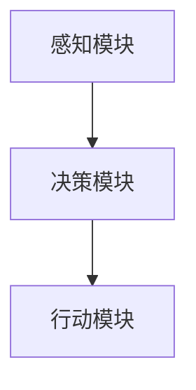
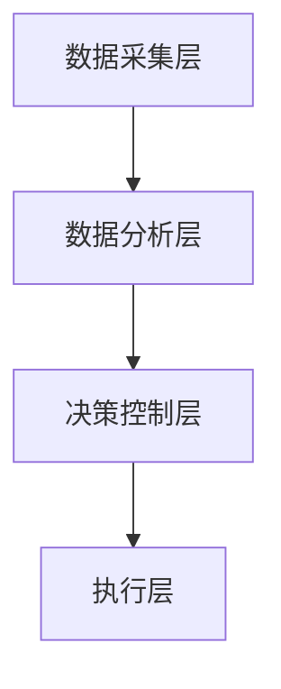

# AI Agent在智能电力负荷均衡中的应用

> 关键词：AI Agent、智能电力、负荷均衡、电力系统、人工智能、分布式控制、能源管理

> 摘要：本文聚焦于AI Agent在智能电力负荷均衡中的应用。随着电力系统的日益复杂和智能化需求的增长，实现高效的负荷均衡成为关键挑战。AI Agent作为一种具备自主决策和交互能力的智能实体，为解决这一问题提供了新的思路和方法。文章详细介绍了AI Agent和智能电力负荷均衡的核心概念及其联系，深入剖析了相关核心算法原理和操作步骤，给出了数学模型和公式，并结合项目实战展示了代码实现与分析。同时，探讨了AI Agent在智能电力负荷均衡中的实际应用场景，推荐了相关的学习资源、开发工具框架以及论文著作。最后对未来发展趋势与挑战进行了总结，并提供了常见问题解答和参考资料，旨在为相关领域的研究和实践提供全面而深入的指导。

## 1. 背景介绍 
### 1.1 目的和范围
电力系统的稳定运行和高效能源利用是现代社会发展的重要保障。智能电力负荷均衡旨在合理分配电力负荷，避免局部过载和能源浪费，提高电力系统的可靠性和经济性。本文章的目的在于探讨AI Agent在智能电力负荷均衡中的应用原理、方法和实践，为实现更智能、高效的电力负荷均衡提供理论支持和技术指导。文章的范围涵盖了AI Agent和智能电力负荷均衡的基本概念、相关算法、数学模型、项目实战、应用场景以及未来发展趋势等方面。

### 1.2 预期读者
本文预期读者包括电力系统工程师、人工智能研究人员、能源管理专业人士、相关领域的科研工作者以及对智能电力和AI Agent技术感兴趣的技术爱好者。希望通过本文的阐述，为不同背景的读者提供有价值的参考和启示。

### 1.3 文档结构概述
本文将按照以下结构展开：首先介绍背景信息，包括目的、预期读者和文档结构概述；接着阐述AI Agent和智能电力负荷均衡的核心概念及其联系；然后深入分析核心算法原理和具体操作步骤，结合Python源代码进行详细讲解；随后给出相关的数学模型和公式，并举例说明；再通过项目实战展示代码实际案例和详细解释；之后探讨AI Agent在智能电力负荷均衡中的实际应用场景；接着推荐相关的工具和资源；最后总结未来发展趋势与挑战，提供常见问题解答和参考资料。

### 1.4 术语表
#### 1.4.1 核心术语定义
- **AI Agent**：人工智能代理，是一种能够感知环境、自主决策并采取行动以实现特定目标的智能实体。它可以根据环境信息和自身的知识、策略进行推理和决策，与其他Agent或环境进行交互。
- **智能电力**：利用先进的信息技术、通信技术和控制技术，实现电力系统的智能化运行和管理，包括发电、输电、变电、配电和用电等各个环节的自动化、信息化和智能化。
- **负荷均衡**：在电力系统中，通过合理分配电力负荷，使各个部分的负荷分布更加均匀，避免局部过载和能源浪费，提高电力系统的可靠性和经济性。
- **电力系统**：由发电、输电、变电、配电和用电等环节组成的统一整体，是现代社会的重要基础设施之一。

#### 1.4.2 相关概念解释
- **分布式控制**：一种控制方式，将控制任务分布到多个智能体或节点上，通过它们之间的协作和交互实现整体的控制目标。在智能电力负荷均衡中，分布式控制可以提高系统的灵活性和可靠性。
- **能源管理**：对能源的生产、分配、使用等过程进行规划、组织、控制和监督，以实现能源的高效利用和可持续发展。智能电力负荷均衡是能源管理的重要组成部分。

#### 1.4.3 缩略词列表
- **AI**：Artificial Intelligence（人工智能）
- **IoT**：Internet of Things（物联网）
- **EMS**：Energy Management System（能源管理系统）

## 2. 核心概念与联系 
### 2.1 AI Agent的原理和架构
AI Agent的基本原理是基于感知、决策和行动的循环过程。它通过传感器感知环境信息，然后根据自身的知识和策略进行决策，最后通过执行器采取相应的行动。AI Agent的架构可以分为三个主要部分：感知模块、决策模块和行动模块。

感知模块负责收集环境信息，例如电力系统中的负荷数据、电压数据、电流数据等。决策模块根据感知到的信息和预设的目标、策略进行推理和决策，确定应该采取的行动。行动模块则将决策结果转化为具体的行动，例如调整电力设备的运行状态、控制电力负荷的分配等。

以下是AI Agent架构的文本示意图：

```plaintext
+-------------------+
|   感知模块        |
|  (传感器)         |
+-------------------+
         |
         v
+-------------------+
|   决策模块        |
|  (推理引擎、策略) |
+-------------------+
         |
         v
+-------------------+
|   行动模块        |
|  (执行器)         |
+-------------------+
```

以下是对应的Mermaid流程图：



### 2.2 智能电力负荷均衡的原理和架构
智能电力负荷均衡的原理是通过实时监测电力系统中的负荷情况，根据一定的算法和策略，对电力负荷进行合理分配，使各个部分的负荷分布更加均匀。智能电力负荷均衡的架构通常包括数据采集层、数据分析层、决策控制层和执行层。

数据采集层负责收集电力系统中的各种数据，例如负荷数据、电压数据、电流数据等。数据分析层对采集到的数据进行处理和分析，提取有用的信息，例如负荷趋势、负荷峰值等。决策控制层根据数据分析的结果，制定负荷均衡的策略和方案。执行层则将决策控制层的指令转化为具体的行动，例如调整电力设备的运行状态、控制电力负荷的分配等。

以下是智能电力负荷均衡架构的文本示意图：

```plaintext
+-------------------+
|   数据采集层      |
|  (传感器网络)     |
+-------------------+
         |
         v
+-------------------+
|   数据分析层      |
|  (数据处理、挖掘) |
+-------------------+
         |
         v
+-------------------+
|   决策控制层      |
|  (策略制定、优化) |
+-------------------+
         |
         v
+-------------------+
|   执行层          |
|  (电力设备控制)   |
+-------------------+
```

以下是对应的Mermaid流程图：



### 2.3 AI Agent与智能电力负荷均衡的联系
AI Agent在智能电力负荷均衡中具有重要的应用价值。AI Agent可以作为智能电力系统中的智能节点，通过感知电力系统的环境信息，自主决策并采取行动，实现电力负荷的均衡分配。具体来说，AI Agent可以在以下几个方面发挥作用：

- **实时监测**：AI Agent可以实时感知电力系统中的负荷情况、电压情况、电流情况等信息，为负荷均衡提供准确的数据支持。
- **自主决策**：AI Agent可以根据感知到的信息和预设的目标、策略，自主决策应该采取的行动，例如调整电力设备的运行状态、控制电力负荷的分配等。
- **分布式协作**：多个AI Agent可以通过通信和协作，实现分布式的负荷均衡控制。每个AI Agent可以根据自身的局部信息和其他Agent的信息，共同制定和执行负荷均衡的策略。
- **自适应优化**：AI Agent可以根据电力系统的动态变化，自适应地调整自身的决策和行动，实现负荷均衡策略的优化。

## 3. 核心算法原理 & 具体操作步骤 
### 3.1 基于强化学习的AI Agent算法原理
强化学习是一种机器学习方法，通过智能体与环境的交互，不断学习最优的行为策略，以最大化累积奖励。在智能电力负荷均衡中，AI Agent可以作为强化学习的智能体，通过与电力系统环境的交互，学习如何合理分配电力负荷，以实现负荷均衡的目标。

强化学习的基本要素包括智能体、环境、状态、动作和奖励。智能体在环境中感知当前状态，选择一个动作执行，环境根据智能体的动作转移到下一个状态，并给予智能体一个奖励。智能体的目标是通过不断地与环境交互，学习到一个最优的策略，使得累积奖励最大化。

以下是基于强化学习的AI Agent算法的Python源代码示例：

```python
import numpy as np

# 定义环境类
class PowerGridEnv:
    def __init__(self):
        # 初始化环境状态
        self.state = np.random.rand(10)  # 假设有10个负荷节点
        self.reward = 0

    def reset(self):
        # 重置环境状态
        self.state = np.random.rand(10)
        return self.state

    def step(self, action):
        # 执行动作并更新环境状态
        # 这里简单模拟动作对负荷的影响
        self.state += action
        # 计算奖励，例如以负荷均衡程度作为奖励
        load_mean = np.mean(self.state)
        load_var = np.var(self.state)
        self.reward = -load_var  # 方差越小，负荷越均衡，奖励越大
        done = False  # 假设任务不会结束
        return self.state, self.reward, done, {}

# 定义AI Agent类
class AI_Agent:
    def __init__(self, state_size, action_size):
        self.state_size = state_size
        self.action_size = action_size
        # 初始化Q表
        self.q_table = np.zeros((state_size, action_size))
        self.learning_rate = 0.1
        self.discount_factor = 0.9
        self.epsilon = 0.1

    def get_action(self, state):
        if np.random.uniform(0, 1) < self.epsilon:
            # 探索：随机选择动作
            action = np.random.choice(self.action_size)
        else:
            # 利用：选择Q值最大的动作
            action = np.argmax(self.q_table[state])
        return action

    def update_q_table(self, state, action, reward, next_state):
        # 更新Q表
        q_value = self.q_table[state][action]
        max_q_next = np.max(self.q_table[next_state])
        new_q_value = q_value + self.learning_rate * (reward + self.discount_factor * max_q_next - q_value)
        self.q_table[state][action] = new_q_value

# 训练过程
env = PowerGridEnv()
agent = AI_Agent(state_size=10, action_size=5)  # 假设有5个动作

num_episodes = 1000
for episode in range(num_episodes):
    state = env.reset()
    done = False
    while not done:
        action = agent.get_action(state)
        next_state, reward, done, _ = env.step(action)
        agent.update_q_table(state, action, reward, next_state)
        state = next_state
```

### 3.2 具体操作步骤
1. **环境建模**：将智能电力系统抽象为一个环境，定义环境的状态、动作和奖励函数。例如，状态可以是各个负荷节点的负荷值，动作可以是调整负荷的操作，奖励可以是负荷均衡程度的度量。
2. **AI Agent初始化**：初始化AI Agent的参数，例如Q表、学习率、折扣因子和探索率等。
3. **训练过程**：在每个训练周期中，AI Agent从环境中获取当前状态，选择一个动作执行，环境根据动作更新状态并给予奖励，AI Agent根据奖励更新Q表。
4. **测试过程**：在训练完成后，使用训练好的AI Agent在实际环境中进行测试，评估其负荷均衡的效果。

## 4. 数学模型和公式 & 详细讲解 & 举例说明 
### 4.1 强化学习的数学模型
强化学习的数学模型可以用马尔可夫决策过程（MDP）来描述。MDP由一个四元组 $(S, A, P, R)$ 组成，其中：
- $S$ 是状态空间，表示环境的所有可能状态。
- $A$ 是动作空间，表示智能体可以采取的所有可能动作。
- $P(s'|s, a)$ 是状态转移概率，表示在状态 $s$ 下采取动作 $a$ 后转移到状态 $s'$ 的概率。
- $R(s, a, s')$ 是奖励函数，表示在状态 $s$ 下采取动作 $a$ 转移到状态 $s'$ 时获得的奖励。

智能体的目标是找到一个最优策略 $\pi^*(s)$，使得累积奖励的期望最大化。累积奖励可以表示为：

$$G_t = \sum_{k=0}^{\infty} \gamma^k R_{t+k+1}$$

其中，$\gamma$ 是折扣因子，$0 \leq \gamma \leq 1$，用于权衡当前奖励和未来奖励的重要性。

### 4.2 Q学习算法的数学公式
Q学习是一种基于价值的强化学习算法，通过学习状态-动作对的价值函数 $Q(s, a)$ 来找到最优策略。Q学习的更新公式为：

$$Q(s, a) \leftarrow Q(s, a) + \alpha [R(s, a, s') + \gamma \max_{a'} Q(s', a') - Q(s, a)]$$

其中，$\alpha$ 是学习率，$0 \leq \alpha \leq 1$，用于控制每次更新的步长。

### 4.3 举例说明
假设智能电力系统有3个负荷节点，状态空间 $S$ 可以表示为3维向量，动作空间 $A$ 有2个动作（增加负荷和减少负荷）。奖励函数 $R$ 可以定义为负荷方差的负值，即负荷越均衡，奖励越大。

初始状态 $s = [10, 20, 30]$，动作 $a = 0$（增加负荷），转移到下一个状态 $s' = [12, 20, 30]$，奖励 $R = -((12 - 20.67)^2 + (20 - 20.67)^2 + (30 - 20.67)^2) / 3 = -37.33$。

假设当前 $Q(s, a) = 10$，学习率 $\alpha = 0.1$，折扣因子 $\gamma = 0.9$，$Q(s', 0) = 8$，$Q(s', 1) = 12$。则更新后的 $Q(s, a)$ 为：

$$Q(s, a) = 10 + 0.1 [-37.33 + 0.9 \times 12 - 10] = 10 + 0.1 [-37.33 + 10.8 - 10] = 10 + 0.1 [-36.53] = 6.347$$

## 5. 项目实战：代码实际案例和详细解释说明 
### 5.1  开发环境搭建
- **Python环境**：安装Python 3.x版本，可以从Python官方网站（https://www.python.org/downloads/）下载并安装。
- **依赖库**：安装必要的Python库，例如NumPy、Matplotlib等。可以使用以下命令进行安装：
```sh
pip install numpy matplotlib
```

### 5.2  源代码详细实现和代码解读
以下是一个完整的基于强化学习的AI Agent在智能电力负荷均衡中的项目实战代码：

```python
import numpy as np
import matplotlib.pyplot as plt

# 定义环境类
class PowerGridEnv:
    def __init__(self, num_nodes=10):
        self.num_nodes = num_nodes
        self.state = np.random.rand(self.num_nodes) * 100  # 初始负荷随机分布
        self.reward = 0

    def reset(self):
        self.state = np.random.rand(self.num_nodes) * 100
        return self.state

    def step(self, action):
        # 动作是一个长度为num_nodes的向量，表示每个节点的负荷调整量
        self.state += action
        # 确保负荷不小于0
        self.state = np.maximum(self.state, 0)
        # 计算奖励，以负荷均衡程度作为奖励
        load_mean = np.mean(self.state)
        load_var = np.var(self.state)
        self.reward = -load_var  # 方差越小，负荷越均衡，奖励越大
        done = False  # 假设任务不会结束
        return self.state, self.reward, done, {}

# 定义AI Agent类
class AI_Agent:
    def __init__(self, state_size, action_size, learning_rate=0.1, discount_factor=0.9, epsilon=0.1):
        self.state_size = state_size
        self.action_size = action_size
        # 初始化Q表
        self.q_table = np.zeros((state_size, action_size))
        self.learning_rate = learning_rate
        self.discount_factor = discount_factor
        self.epsilon = epsilon

    def get_action(self, state):
        if np.random.uniform(0, 1) < self.epsilon:
            # 探索：随机选择动作
            action = np.random.choice(self.action_size)
        else:
            # 利用：选择Q值最大的动作
            action = np.argmax(self.q_table[state])
        return action

    def update_q_table(self, state, action, reward, next_state):
        # 更新Q表
        q_value = self.q_table[state][action]
        max_q_next = np.max(self.q_table[next_state])
        new_q_value = q_value + self.learning_rate * (reward + self.discount_factor * max_q_next - q_value)
        self.q_table[state][action] = new_q_value

# 训练过程
num_nodes = 10
env = PowerGridEnv(num_nodes)
agent = AI_Agent(state_size=num_nodes, action_size=3)  # 假设有3个动作：增加负荷、减少负荷、不操作

num_episodes = 1000
reward_history = []
for episode in range(num_episodes):
    state = env.reset()
    total_reward = 0
    done = False
    while not done:
        action = agent.get_action(state)
        # 将动作转换为负荷调整向量
        if action == 0:
            action_vector = np.random.rand(num_nodes) * 10  # 增加负荷
        elif action == 1:
            action_vector = -np.random.rand(num_nodes) * 10  # 减少负荷
        else:
            action_vector = np.zeros(num_nodes)  # 不操作
        next_state, reward, done, _ = env.step(action_vector)
        agent.update_q_table(state, action, reward, next_state)
        state = next_state
        total_reward += reward
    reward_history.append(total_reward)
    if episode % 100 == 0:
        print(f"Episode {episode}: Total Reward = {total_reward}")

# 绘制奖励曲线
plt.plot(reward_history)
plt.xlabel('Episode')
plt.ylabel('Total Reward')
plt.title('Training Reward History')
plt.show()
```

### 5.3  代码解读与分析
1. **环境类 `PowerGridEnv`**：
    - `__init__` 方法：初始化环境的负荷节点数量和初始负荷状态。
    - `reset` 方法：重置环境的负荷状态。
    - `step` 方法：执行动作，更新负荷状态，计算奖励并返回新的状态、奖励、是否结束和其他信息。

2. **AI Agent类 `AI_Agent`**：
    - `__init__` 方法：初始化AI Agent的参数，包括状态空间大小、动作空间大小、学习率、折扣因子和探索率，以及Q表。
    - `get_action` 方法：根据当前状态选择一个动作，采用探索-利用策略。
    - `update_q_table` 方法：根据奖励和下一个状态更新Q表。

3. **训练过程**：
    - 在每个训练周期中，AI Agent从环境中获取当前状态，选择一个动作执行，环境根据动作更新状态并给予奖励，AI Agent根据奖励更新Q表。
    - 记录每个训练周期的总奖励，最后绘制奖励曲线，观察训练过程的收敛情况。

## 6. 实际应用场景 
### 6.1 工业园区的电力负荷均衡
在工业园区中，不同的工业企业具有不同的电力负荷特性和生产计划。AI Agent可以实时监测各个企业的电力负荷情况，根据企业的生产需求和电力系统的整体情况，合理分配电力负荷。例如，当某个企业的生产任务较轻时，AI Agent可以将部分电力负荷转移到其他企业，以提高电力系统的利用率。

### 6.2 智能小区的电力负荷均衡
在智能小区中，居民的用电行为具有一定的随机性和波动性。AI Agent可以通过与智能电表、智能家居设备等进行交互，实时获取居民的用电信息，根据居民的用电习惯和电力系统的负荷情况，调整居民的用电设备的运行状态，实现电力负荷的均衡分配。例如，在用电高峰期，AI Agent可以自动控制空调、热水器等大功率设备的运行时间，以减少居民的用电负荷。

### 6.3 微电网的电力负荷均衡
微电网是一种小型的电力系统，通常由分布式电源、储能装置、负荷等组成。AI Agent可以在微电网中实现分布式的负荷均衡控制。每个AI Agent可以作为一个智能节点，根据自身的局部信息和其他节点的信息，共同制定和执行负荷均衡的策略。例如，当某个分布式电源的输出功率不足时，AI Agent可以协调其他分布式电源和储能装置，以满足微电网的负荷需求。

## 7. 工具和资源推荐
### 7.1 学习资源推荐
#### 7.1.1 书籍推荐
- 《人工智能：一种现代的方法》（Artificial Intelligence: A Modern Approach）：这本书是人工智能领域的经典教材，全面介绍了人工智能的基本概念、算法和应用。
- 《强化学习：原理与Python实现》（Reinforcement Learning: An Introduction）：这本书是强化学习领域的经典著作，详细介绍了强化学习的基本原理、算法和应用。
- 《智能电网技术》：这本书系统介绍了智能电网的基本概念、技术和应用，包括智能电力负荷均衡等方面的内容。

#### 7.1.2 在线课程
- Coursera上的“人工智能基础”（Foundations of Artificial Intelligence）课程：该课程由知名教授授课，全面介绍了人工智能的基本概念、算法和应用。
- edX上的“强化学习”（Reinforcement Learning）课程：该课程深入介绍了强化学习的基本原理、算法和应用，提供了丰富的实践案例。
- 中国大学MOOC上的“智能电网”课程：该课程系统介绍了智能电网的基本概念、技术和应用，包括智能电力负荷均衡等方面的内容。

#### 7.1.3 技术博客和网站
- Medium上的人工智能和强化学习相关博客：Medium上有很多人工智能和强化学习领域的专家和爱好者分享的技术博客，内容丰富、实用。
- 知乎上的人工智能和智能电网相关话题：知乎上有很多关于人工智能和智能电网的讨论和分享，可以了解到最新的技术动态和研究成果。
- IEEE Xplore：IEEE Xplore是电气和电子工程师协会（IEEE）的数字图书馆，提供了大量的关于人工智能、智能电网等领域的学术论文和技术报告。

### 7.2 开发工具框架推荐
#### 7.2.1 IDE和编辑器
- PyCharm：PyCharm是一款专业的Python集成开发环境（IDE），提供了丰富的功能和工具，方便Python代码的开发和调试。
- Visual Studio Code：Visual Studio Code是一款轻量级的代码编辑器，支持多种编程语言，包括Python。它具有丰富的插件和扩展，可以满足不同的开发需求。

#### 7.2.2 调试和性能分析工具
- PDB：PDB是Python自带的调试工具，可以帮助开发者调试Python代码，定位和解决问题。
- cProfile：cProfile是Python的性能分析工具，可以帮助开发者分析Python代码的性能瓶颈，优化代码。

#### 7.2.3 相关框架和库
- TensorFlow：TensorFlow是一个开源的机器学习框架，提供了丰富的工具和库，方便开发者进行深度学习和强化学习的开发。
- PyTorch：PyTorch是一个开源的深度学习框架，具有简洁易用的接口和高效的计算性能，广泛应用于人工智能领域。
- NumPy：NumPy是Python的一个科学计算库，提供了高效的数组操作和数学函数，是Python科学计算的基础库。

### 7.3 相关论文著作推荐
#### 7.3.1 经典论文
- “Q-Learning” by Christopher J. C. H. Watkins and Peter Dayan：这篇论文是Q学习算法的经典论文，详细介绍了Q学习算法的原理和应用。
- “Markov Decision Processes” by Richard Bellman：这篇论文是马尔可夫决策过程的经典论文，奠定了强化学习的理论基础。

#### 7.3.2 最新研究成果
- 关注IEEE Transactions on Smart Grid、Applied Energy等学术期刊，这些期刊上发表了很多关于智能电力和人工智能的最新研究成果。

#### 7.3.3 应用案例分析
- 可以参考一些实际的智能电力项目案例分析，了解AI Agent在智能电力负荷均衡中的实际应用效果和经验教训。

## 8. 总结：未来发展趋势与挑战
### 8.1 未来发展趋势
- **多智能体协作**：未来的智能电力负荷均衡系统将更加注重多智能体之间的协作和交互。多个AI Agent可以通过通信和协作，实现分布式的负荷均衡控制，提高系统的灵活性和可靠性。
- **与物联网的融合**：随着物联网技术的发展，智能电力系统将与物联网深度融合。AI Agent可以通过与物联网设备的交互，实时获取更多的电力系统信息，实现更加精准的负荷均衡控制。
- **深度学习的应用**：深度学习技术在人工智能领域取得了巨大的成功，未来将在智能电力负荷均衡中得到更广泛的应用。例如，使用深度学习模型对电力负荷进行预测，为负荷均衡提供更准确的决策依据。

### 8.2 挑战
- **数据安全和隐私**：智能电力系统涉及大量的敏感数据，如用户的用电信息、电力设备的运行状态等。保障数据的安全和隐私是AI Agent在智能电力负荷均衡中面临的重要挑战。
- **算法复杂度和计算资源**：一些复杂的AI算法，如深度学习算法，具有较高的计算复杂度，需要大量的计算资源。如何在有限的计算资源下实现高效的负荷均衡控制是一个挑战。
- **系统的可靠性和稳定性**：智能电力系统是一个关键的基础设施，其可靠性和稳定性至关重要。AI Agent在智能电力负荷均衡中的应用需要确保系统的可靠性和稳定性，避免因AI Agent的决策失误导致系统故障。

## 9. 附录：常见问题与解答
### 9.1 什么是AI Agent？
AI Agent是一种能够感知环境、自主决策并采取行动以实现特定目标的智能实体。它可以根据环境信息和自身的知识、策略进行推理和决策，与其他Agent或环境进行交互。

### 9.2 AI Agent在智能电力负荷均衡中有哪些优势？
AI Agent在智能电力负荷均衡中具有实时监测、自主决策、分布式协作和自适应优化等优势，可以提高电力系统的负荷均衡效率和可靠性。

### 9.3 如何训练AI Agent实现智能电力负荷均衡？
可以使用强化学习等方法训练AI Agent。首先将智能电力系统抽象为一个环境，定义环境的状态、动作和奖励函数，然后让AI Agent在环境中不断地进行交互和学习，更新自身的策略，以实现负荷均衡的目标。

### 9.4 AI Agent在智能电力负荷均衡中面临哪些挑战？
AI Agent在智能电力负荷均衡中面临数据安全和隐私、算法复杂度和计算资源、系统的可靠性和稳定性等挑战。

## 10. 扩展阅读 & 参考资料
### 10.1 扩展阅读
- 可以进一步阅读关于分布式人工智能、多智能体系统、能源互联网等方面的书籍和论文，深入了解相关领域的知识和技术。
- 关注智能电力和人工智能领域的最新研究动态和技术发展趋势，了解前沿的研究成果和应用案例。

### 10.2 参考资料
- 本文参考了大量的学术论文、技术报告、书籍和在线资源，具体的参考文献列表如下：
    - [1] 人工智能：一种现代的方法（Artificial Intelligence: A Modern Approach）
    - [2] 强化学习：原理与Python实现（Reinforcement Learning: An Introduction）
    - [3] 智能电网技术
    - [4] “Q-Learning” by Christopher J. C. H. Watkins and Peter Dayan
    - [5] “Markov Decision Processes” by Richard Bellman
    - [6] IEEE Transactions on Smart Grid
    - [7] Applied Energy
    - [8] Coursera上的“人工智能基础”（Foundations of Artificial Intelligence）课程
    - [9] edX上的“强化学习”（Reinforcement Learning）课程
    - [10] 中国大学MOOC上的“智能电网”课程
    - [11] Medium上的人工智能和强化学习相关博客
    - [12] 知乎上的人工智能和智能电网相关话题
    - [13] IEEE Xplore
    - [14] PyCharm官方网站
    - [15] Visual Studio Code官方网站
    - [16] TensorFlow官方网站
    - [17] PyTorch官方网站
    - [18] NumPy官方网站