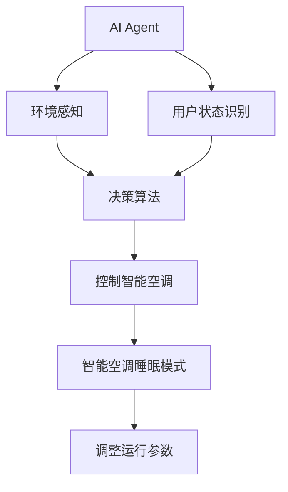

# AI Agent在智能空调中的睡眠模式优化

> 关键词：AI Agent、智能空调、睡眠模式优化、温度调节、用户体验

> 摘要：本文聚焦于AI Agent在智能空调睡眠模式优化中的应用。通过深入剖析AI Agent的核心概念和原理，详细阐述其如何运用算法对智能空调睡眠模式进行优化。介绍了相关数学模型和公式，结合实际项目案例展示代码实现与解读。探讨了AI Agent在智能空调睡眠模式优化的实际应用场景，推荐了学习、开发所需的工具和资源。最后总结未来发展趋势与挑战，并提供常见问题解答及扩展阅读参考资料，旨在为相关领域的研究和实践提供全面的技术指导。

## 1. 背景介绍 
### 1.1 目的和范围
随着人们生活水平的提高，对居住环境舒适度的要求也日益增加。智能空调作为智能家居的重要组成部分，其睡眠模式的优化对于提升用户睡眠质量至关重要。本文的目的在于探讨如何利用AI Agent技术对智能空调的睡眠模式进行优化，以实现更加个性化、智能化的温度调节。研究范围涵盖AI Agent的核心概念、算法原理、数学模型，以及在实际项目中的应用，同时分析其在不同场景下的应用效果和未来发展趋势。

### 1.2 预期读者
本文预期读者包括智能家居领域的开发者、研究人员，对智能空调技术感兴趣的工程师，以及希望了解AI Agent在实际应用中如何发挥作用的技术爱好者。

### 1.3 文档结构概述
本文将按照以下结构进行阐述：首先介绍AI Agent和智能空调睡眠模式的核心概念及其联系；接着详细讲解AI Agent用于优化睡眠模式的核心算法原理和具体操作步骤，并给出Python源代码示例；然后介绍相关的数学模型和公式，并举例说明；通过实际项目案例展示代码的实现和解读；探讨AI Agent在智能空调睡眠模式优化中的实际应用场景；推荐学习和开发所需的工具和资源；最后总结未来发展趋势与挑战，提供常见问题解答和扩展阅读参考资料。

### 1.4 术语表
#### 1.4.1 核心术语定义
- **AI Agent**：人工智能代理，是一种能够感知环境、进行决策并采取行动以实现特定目标的智能实体。在本文中，AI Agent用于感知用户睡眠环境和状态，决策空调的运行参数，以优化睡眠模式。
- **智能空调**：具备智能化功能的空调设备，能够通过网络与其他设备进行通信，接收和执行指令，实现自动化控制。
- **睡眠模式**：智能空调为用户在睡眠期间提供的一种特殊运行模式，旨在根据用户睡眠时的生理需求自动调节温度、风速等参数，以提高睡眠质量。

#### 1.4.2 相关概念解释
- **环境感知**：AI Agent通过传感器收集智能空调周围环境的信息，如温度、湿度、光照等。
- **用户状态识别**：利用传感器和数据分析技术，识别用户的睡眠状态，如浅睡眠、深睡眠等。
- **个性化调节**：根据用户的个人偏好、睡眠习惯和生理特征，为用户提供定制化的睡眠模式。

#### 1.4.3 缩略词列表
- **AI**：Artificial Intelligence，人工智能
- **IoT**：Internet of Things，物联网

## 2. 核心概念与联系 

### 2.1 AI Agent核心概念
AI Agent是一种自主的智能实体，它可以感知周围环境的信息，根据内置的算法和规则进行决策，并采取相应的行动。在智能空调的睡眠模式优化中，AI Agent可以通过传感器收集环境信息和用户状态信息，如温度、湿度、用户的睡眠姿势等。然后，它会根据这些信息进行分析和决策，调整空调的运行参数，如温度、风速、模式等，以提供更加舒适的睡眠环境。

### 2.2 智能空调睡眠模式核心概念
智能空调的睡眠模式是为了满足用户在睡眠期间对舒适环境的需求而设计的。在传统的睡眠模式中，空调通常会根据预设的程序在一定时间内逐渐调整温度。然而，这种模式缺乏个性化，不能根据用户的实际需求进行实时调整。而引入AI Agent后，睡眠模式可以实现更加智能化和个性化的调节。

### 2.3 两者的联系
AI Agent为智能空调的睡眠模式优化提供了强大的技术支持。通过AI Agent的环境感知和决策能力，智能空调可以实时了解用户的睡眠状态和环境变化，从而动态调整运行参数。例如，当AI Agent检测到用户进入深睡眠状态时，它可以适当调高温度，降低风速，以减少空调对用户的干扰；当环境湿度较高时，它可以开启除湿功能，提高睡眠的舒适度。

### 2.4 文本示意图
```plaintext
AI Agent
|
|-- 环境感知（温度、湿度、光照等传感器）
|-- 用户状态识别（睡眠状态监测）
|-- 决策算法（根据环境和用户状态进行决策）
|
|-- 控制智能空调（调整温度、风速、模式等）

智能空调
|
|-- 睡眠模式（传统预设模式 + AI Agent优化模式）
|-- 运行参数（温度、风速、模式等）
```

### 2.5 Mermaid流程图


## 3. 核心算法原理 & 具体操作步骤 

### 3.1 核心算法原理
在智能空调睡眠模式优化中，我们可以使用基于机器学习的算法，如神经网络算法。神经网络可以通过学习大量的环境数据和用户睡眠状态数据，建立起环境参数、用户状态与空调最佳运行参数之间的映射关系。

以下是一个简单的多层感知器（Multilayer Perceptron, MLP）神经网络的Python代码示例，用于实现这个映射关系：

```python
import numpy as np
from sklearn.neural_network import MLPRegressor

# 假设我们有一些训练数据
# X 是输入特征，包括温度、湿度、用户睡眠状态等
X = np.array([[25, 60, 0], [26, 55, 1], [24, 65, 0]])
# y 是对应的空调最佳运行参数，如温度设定值
y = np.array([26, 27, 25])

# 创建一个MLP回归器
mlp = MLPRegressor(hidden_layer_sizes=(10, 10), activation='relu', solver='adam', max_iter=1000)

# 训练模型
mlp.fit(X, y)

# 假设有新的环境数据和用户状态数据
new_X = np.array([[25.5, 58, 1]])

# 预测最佳空调运行参数
predicted_y = mlp.predict(new_X)
print("预测的最佳空调运行参数：", predicted_y)
```

### 3.2 具体操作步骤
1. **数据收集**：使用传感器收集环境数据（温度、湿度、光照等）和用户睡眠状态数据（浅睡眠、深睡眠等）。
2. **数据预处理**：对收集到的数据进行清洗、归一化等处理，以便于后续的训练。
3. **模型训练**：使用预处理后的数据训练神经网络模型，调整模型的参数以提高预测的准确性。
4. **实时监测**：在智能空调运行过程中，实时收集环境数据和用户状态数据。
5. **参数预测**：将实时数据输入到训练好的模型中，预测最佳的空调运行参数。
6. **空调控制**：根据预测的参数，调整智能空调的运行状态。

## 4. 数学模型和公式 & 详细讲解 & 举例说明 

### 4.1 数学模型
在上述的神经网络模型中，我们可以用以下数学模型来表示输入和输出之间的关系。

假设输入向量 $\mathbf{x} = [x_1, x_2, \cdots, x_n]^T$，其中 $x_i$ 表示第 $i$ 个输入特征（如温度、湿度等）。

神经网络的第 $l$ 层有 $m_l$ 个神经元，第 $l$ 层第 $j$ 个神经元的输入可以表示为：

$$z_j^{(l)} = \sum_{i = 0}^{m_{l - 1}} w_{ji}^{(l)} a_i^{(l - 1)}$$

其中，$w_{ji}^{(l)}$ 是第 $l$ 层第 $j$ 个神经元与第 $l - 1$ 层第 $i$ 个神经元之间的权重，$a_i^{(l - 1)}$ 是第 $l - 1$ 层第 $i$ 个神经元的输出。为了方便表示，我们通常将 $a_0^{(l - 1)} = 1$ 作为偏置项。

第 $l$ 层第 $j$ 个神经元的输出可以表示为：

$$a_j^{(l)} = f(z_j^{(l)})$$

其中，$f$ 是激活函数，常见的激活函数有ReLU函数：

$$f(x) = \max(0, x)$$

最终的输出向量 $\mathbf{y} = [y_1, y_2, \cdots, y_m]^T$ 是神经网络最后一层的输出。

### 4.2 详细讲解
在神经网络的训练过程中，我们的目标是最小化预测输出 $\mathbf{y}$ 与真实输出 $\mathbf{y}_{true}$ 之间的误差。常用的误差函数是均方误差（Mean Squared Error, MSE）：

$$MSE = \frac{1}{N} \sum_{i = 1}^{N} (\mathbf{y}_i - \mathbf{y}_{true, i})^2$$

其中，$N$ 是训练数据的数量。

为了最小化误差函数，我们可以使用梯度下降算法。梯度下降算法通过不断更新权重 $w_{ji}^{(l)}$ 来减小误差。权重的更新公式为：

$$w_{ji}^{(l)} = w_{ji}^{(l)} - \alpha \frac{\partial MSE}{\partial w_{ji}^{(l)}}$$

其中，$\alpha$ 是学习率，控制每次更新的步长。

### 4.3 举例说明
假设我们有一个简单的两层神经网络，输入层有2个神经元，隐藏层有3个神经元，输出层有1个神经元。输入向量 $\mathbf{x} = [x_1, x_2]^T$，隐藏层的输入为：

$$z_1^{(1)} = w_{10}^{(1)} + w_{11}^{(1)} x_1 + w_{12}^{(1)} x_2$$
$$z_2^{(1)} = w_{20}^{(1)} + w_{21}^{(1)} x_1 + w_{22}^{(1)} x_2$$
$$z_3^{(1)} = w_{30}^{(1)} + w_{31}^{(1)} x_1 + w_{32}^{(1)} x_2$$

隐藏层的输出为：

$$a_1^{(1)} = f(z_1^{(1)})$$
$$a_2^{(1)} = f(z_2^{(1)})$$
$$a_3^{(1)} = f(z_3^{(1)})$$

输出层的输入为：

$$z_1^{(2)} = w_{10}^{(2)} + w_{11}^{(2)} a_1^{(1)} + w_{12}^{(2)} a_2^{(1)} + w_{13}^{(2)} a_3^{(1)}$$

输出层的输出为：

$$y = f(z_1^{(2)})$$

假设我们有一个训练数据点 $(\mathbf{x}, y_{true})$，我们可以计算出误差 $MSE = (y - y_{true})^2$，然后使用梯度下降算法更新权重 $w_{ji}^{(l)}$。

## 5. 项目实战：代码实际案例和详细解释说明 

### 5.1  开发环境搭建
- **操作系统**：推荐使用Linux或Windows操作系统。
- **Python环境**：安装Python 3.7及以上版本。
- **依赖库**：安装`numpy`、`scikit-learn`等库，可以使用以下命令进行安装：
```sh
pip install numpy scikit-learn
```

### 5.2  源代码详细实现和代码解读
```python
import numpy as np
from sklearn.neural_network import MLPRegressor

# 模拟数据收集
def collect_data():
    # 假设这里使用传感器收集环境数据和用户状态数据
    # 这里简单生成一些随机数据作为示例
    temperature = np.random.uniform(20, 30, 100)
    humidity = np.random.uniform(40, 70, 100)
    sleep_state = np.random.randint(0, 2, 100)
    X = np.column_stack((temperature, humidity, sleep_state))
    # 假设最佳空调运行参数与环境数据和用户状态有关
    y = 20 + 0.5 * temperature + 0.2 * humidity + 1 * sleep_state
    return X, y

# 数据预处理
def preprocess_data(X, y):
    from sklearn.preprocessing import StandardScaler
    scaler = StandardScaler()
    X_scaled = scaler.fit_transform(X)
    return X_scaled, y

# 模型训练
def train_model(X, y):
    mlp = MLPRegressor(hidden_layer_sizes=(10, 10), activation='relu', solver='adam', max_iter=1000)
    mlp.fit(X, y)
    return mlp

# 实时监测和参数预测
def predict_parameters(model, new_X):
    predicted_y = model.predict(new_X)
    return predicted_y

# 主函数
def main():
    # 数据收集
    X, y = collect_data()
    # 数据预处理
    X_scaled, y = preprocess_data(X, y)
    # 模型训练
    model = train_model(X_scaled, y)
    # 模拟实时监测
    new_X = np.array([[25, 55, 1]])
    new_X_scaled = preprocess_data(new_X, np.array([0]))[0]
    # 参数预测
    predicted_y = predict_parameters(model, new_X_scaled)
    print("预测的最佳空调运行参数：", predicted_y)

if __name__ == "__main__":
    main()
```

### 5.3  代码解读与分析
- **数据收集**：`collect_data` 函数模拟了传感器收集环境数据和用户状态数据的过程，并生成了相应的最佳空调运行参数。
- **数据预处理**：`preprocess_data` 函数使用 `StandardScaler` 对输入数据进行归一化处理，以提高模型的训练效果。
- **模型训练**：`train_model` 函数使用 `MLPRegressor` 训练神经网络模型。
- **实时监测和参数预测**：`predict_parameters` 函数根据训练好的模型对新的环境数据和用户状态数据进行预测。
- **主函数**：`main` 函数调用上述函数，完成数据收集、预处理、模型训练和参数预测的整个流程。

## 6. 实际应用场景 
### 6.1 家庭卧室
在家庭卧室中，AI Agent可以实时感知卧室的温度、湿度、光照等环境信息，以及用户的睡眠状态。根据这些信息，智能空调可以自动调整温度、风速和模式，为用户提供更加舒适的睡眠环境。例如，当用户进入深睡眠状态时，空调可以适当调高温度，降低风速，减少噪音干扰；当环境湿度较高时，空调可以开启除湿功能。

### 6.2 酒店客房
酒店客房通常需要满足不同客人的个性化需求。AI Agent可以根据客人的睡眠习惯和偏好，为每位客人提供定制化的睡眠模式。当客人入住时，智能空调可以通过与客人的手机或其他设备连接，获取客人的睡眠数据和偏好设置，然后自动调整空调的运行参数。这样可以提高客人的满意度，提升酒店的服务质量。

### 6.3 养老院
在养老院中，老人的睡眠质量尤为重要。AI Agent可以实时监测老人的睡眠状态和健康状况，如心率、呼吸等。当老人出现异常情况时，智能空调可以及时调整运行参数，同时通知医护人员。此外，AI Agent还可以根据老人的身体状况和季节变化，为老人提供更加适宜的睡眠环境。

## 7. 工具和资源推荐
### 7.1 学习资源推荐
#### 7.1.1 书籍推荐
- 《Python机器学习实战》：本书介绍了Python在机器学习中的应用，包括神经网络、决策树等算法的实现。
- 《深度学习》：由Ian Goodfellow、Yoshua Bengio和Aaron Courville所著，是深度学习领域的经典教材。

#### 7.1.2 在线课程
- Coursera上的“机器学习”课程：由Andrew Ng教授讲授，是机器学习领域的入门经典课程。
- edX上的“深度学习”课程：由麻省理工学院（MIT）开设，深入介绍了深度学习的理论和实践。

#### 7.1.3 技术博客和网站
- Medium：上面有很多关于人工智能和机器学习的技术文章。
- Kaggle：一个数据科学竞赛平台，上面有很多优秀的开源代码和数据集。

### 7.2 开发工具框架推荐
#### 7.2.1 IDE和编辑器
- PyCharm：一款专门为Python开发设计的集成开发环境，具有代码自动补全、调试等功能。
- Visual Studio Code：一款轻量级的代码编辑器，支持多种编程语言，有丰富的插件扩展。

#### 7.2.2 调试和性能分析工具
- PDB：Python自带的调试工具，可以帮助开发者定位代码中的问题。
- cProfile：Python的性能分析工具，可以分析代码的运行时间和资源占用情况。

#### 7.2.3 相关框架和库
- TensorFlow：Google开发的深度学习框架，支持多种深度学习模型的构建和训练。
- PyTorch：Facebook开发的深度学习框架，具有动态图的特点，易于调试和开发。

### 7.3 相关论文著作推荐
#### 7.3.1 经典论文
- “Deep Learning” by Yann LeCun, Yoshua Bengio, and Geoffrey Hinton：这篇论文是深度学习领域的奠基之作，介绍了深度学习的基本概念和方法。
- “Gradient-based learning applied to document recognition” by Yann LeCun, Léon Bottou, Yoshua Bengio, and Patrick Haffner：提出了卷积神经网络（CNN）的概念，对图像识别领域产生了深远影响。

#### 7.3.2 最新研究成果
- 可以关注顶级学术会议如NeurIPS（神经信息处理系统大会）、ICML（国际机器学习会议）等的论文，了解最新的研究动态。

#### 7.3.3 应用案例分析
- 一些智能家居领域的研究报告和案例分析，可以帮助我们了解AI Agent在智能空调中的实际应用效果和挑战。

## 8. 总结：未来发展趋势与挑战
### 8.1 未来发展趋势
- **更加个性化**：未来的AI Agent将能够更加精准地识别用户的个人偏好和生理特征，为用户提供更加个性化的睡眠模式。例如，根据用户的年龄、性别、健康状况等因素，调整空调的运行参数。
- **多设备协同**：AI Agent将不仅仅局限于控制智能空调，还将与其他智能家居设备如智能床垫、智能窗帘等进行协同工作，共同营造更加舒适的睡眠环境。例如，当空调检测到环境温度过高时，智能窗帘可以自动关闭，减少阳光直射。
- **智能化程度提升**：随着人工智能技术的不断发展，AI Agent的决策能力和学习能力将不断提升。它可以通过不断学习用户的睡眠习惯和环境变化，自动优化睡眠模式，无需用户手动干预。

### 8.2 挑战
- **数据隐私和安全**：AI Agent需要收集大量的用户数据来进行决策，如何保护用户的数据隐私和安全是一个重要的挑战。例如，防止用户的睡眠数据被泄露或滥用。
- **算法复杂度和计算资源**：为了实现更加精准的决策，AI Agent需要使用复杂的算法和模型。这对计算资源的要求较高，如何在有限的计算资源下实现高效的算法是一个挑战。
- **标准和规范**：目前智能家居领域缺乏统一的标准和规范，不同品牌的智能设备之间可能存在兼容性问题。如何建立统一的标准和规范，促进AI Agent在智能空调中的广泛应用是一个亟待解决的问题。

## 9. 附录：常见问题与解答
### 9.1 AI Agent在智能空调中的稳定性如何保证？
可以通过以下方法保证AI Agent的稳定性：
- 选择可靠的传感器，确保数据收集的准确性和稳定性。
- 对收集到的数据进行预处理和质量控制，去除异常数据。
- 使用稳定的算法和模型，并进行充分的训练和测试。
- 定期对AI Agent进行维护和更新，修复可能出现的问题。

### 9.2 如何评估AI Agent对智能空调睡眠模式优化的效果？
可以从以下几个方面评估优化效果：
- 用户满意度调查：通过问卷调查的方式了解用户对睡眠环境的满意度。
- 睡眠质量监测：使用睡眠监测设备监测用户的睡眠质量，如睡眠时间、睡眠深度等。
- 能源消耗分析：对比优化前后智能空调的能源消耗情况，评估节能效果。

### 9.3 AI Agent是否会增加智能空调的成本？
在一定程度上，引入AI Agent会增加智能空调的成本。这主要包括传感器的成本、算法开发和训练的成本等。然而，随着技术的不断发展和规模效应的显现，成本会逐渐降低。此外，优化后的睡眠模式可以提高用户的满意度，增加产品的竞争力，从长远来看，可能会带来更高的收益。

## 10. 扩展阅读 & 参考资料
- 智能家居相关的行业报告和白皮书，可以了解行业的发展趋势和市场需求。
- 人工智能和机器学习领域的学术期刊，如Journal of Artificial Intelligence Research（JAIR）、Machine Learning等，获取最新的研究成果。
- 智能空调产品的官方文档和技术资料，深入了解产品的功能和特性。

以上就是关于AI Agent在智能空调中的睡眠模式优化的详细介绍，希望对读者有所帮助。通过不断的研究和实践，相信AI Agent将在智能空调领域发挥越来越重要的作用，为人们带来更加舒适的睡眠体验。 