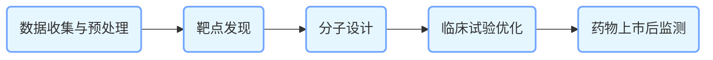

# AI Agent在智能药物研发中的角色

> 关键词：AI Agent、智能药物研发、药物发现、靶点预测、分子设计

> 摘要：本文聚焦于AI Agent在智能药物研发中的角色，深入探讨其在药物研发各环节的应用原理、算法实现及实际效果。通过详细介绍AI Agent的核心概念、相关算法原理、数学模型，结合项目实战案例，阐述其在药物靶点预测、分子设计等方面的关键作用。同时分析了AI Agent在实际应用场景中的优势，推荐了相关学习资源、开发工具和研究论文，最后对其未来发展趋势与挑战进行总结，旨在为智能药物研发领域的研究者和从业者提供全面而深入的参考。

## 1. 背景介绍 
### 1.1 目的和范围
药物研发是一个高度复杂、耗时且昂贵的过程，传统的药物研发模式面临着诸多挑战，如研发周期长、成功率低、成本高昂等。AI Agent作为人工智能技术的重要发展方向，具有自主学习、决策和执行任务的能力，为智能药物研发带来了新的机遇。本文的目的在于全面探讨AI Agent在智能药物研发中的角色，涵盖从药物靶点发现、分子设计到临床试验优化等多个环节，分析其工作原理、应用效果及潜在价值。

### 1.2 预期读者
本文预期读者包括药物研发领域的科研人员、人工智能领域的研究者、制药企业的技术人员以及对智能药物研发感兴趣的相关专业学生和爱好者。通过阅读本文，读者能够深入了解AI Agent在智能药物研发中的应用机制和实际作用，为其在相关领域的研究和实践提供理论支持和技术参考。

### 1.3 文档结构概述
本文首先介绍AI Agent和智能药物研发的相关背景知识，包括目的、预期读者和文档结构。接着阐述AI Agent的核心概念及其与智能药物研发的联系，通过文本示意图和Mermaid流程图展示其架构。然后详细讲解AI Agent在智能药物研发中涉及的核心算法原理和具体操作步骤，并给出Python源代码示例。之后介绍相关的数学模型和公式，并举例说明。通过项目实战案例，展示AI Agent在智能药物研发中的具体应用，包括开发环境搭建、源代码实现和代码解读。分析AI Agent在智能药物研发中的实际应用场景，推荐相关的学习资源、开发工具和研究论文。最后总结AI Agent在智能药物研发中的未来发展趋势与挑战，并提供常见问题解答和扩展阅读参考资料。

### 1.4 术语表
#### 1.4.1 核心术语定义
- **AI Agent（人工智能代理）**：是一种能够感知环境、自主学习、做出决策并执行相应行动的人工智能实体。它可以根据预设的目标和规则，在复杂的环境中自主地完成任务。
- **智能药物研发**：利用人工智能技术，如机器学习、深度学习、自然语言处理等，辅助药物研发过程，提高研发效率、降低成本、增加成功率的一种新型药物研发模式。
- **药物靶点**：是指药物在体内作用的特定分子，如蛋白质、核酸等，药物通过与靶点结合发挥治疗作用。
- **分子设计**：根据药物靶点的结构和性质，设计具有特定活性和性质的药物分子的过程。

#### 1.4.2 相关概念解释
- **机器学习**：是一门多领域交叉学科，涉及概率论、统计学、逼近论、凸分析、算法复杂度理论等多门学科。它专门研究计算机怎样模拟或实现人类的学习行为，以获取新的知识或技能，重新组织已有的知识结构使之不断改善自身的性能。
- **深度学习**：是机器学习的一个分支领域，它是一种基于对数据进行表征学习的方法。深度学习通过构建具有很多层的神经网络模型，自动从大量数据中学习特征和模式，从而实现对数据的分类、预测等任务。
- **自然语言处理**：是计算机科学与语言学的交叉领域，旨在让计算机能够理解、处理和生成人类语言。在智能药物研发中，自然语言处理可用于处理医学文献、临床试验报告等文本数据，提取有用信息。

#### 1.4.3 缩略词列表
- **ML（Machine Learning）**：机器学习
- **DL（Deep Learning）**：深度学习
- **NLP（Natural Language Processing）**：自然语言处理

## 2. 核心概念与联系 

### 2.1 AI Agent的核心概念
AI Agent是一个具有自主性、反应性、社会性和适应性的智能实体。自主性意味着它能够在没有人类直接干预的情况下，独立地感知环境、做出决策并执行行动。反应性使它能够对环境中的变化及时做出响应。社会性表示它可以与其他Agent或人类进行交互和协作。适应性则体现为它能够根据环境的变化和自身的经验不断调整自己的行为和策略。

### 2.2 AI Agent与智能药物研发的联系
在智能药物研发中，AI Agent可以在多个环节发挥重要作用。例如，在药物靶点发现阶段，AI Agent可以通过分析大量的生物数据，如基因序列、蛋白质结构等，自主地寻找潜在的药物靶点。在分子设计阶段，它可以根据靶点的结构和性质，设计出具有高活性和选择性的药物分子。在临床试验阶段，AI Agent可以优化试验设计、预测药物疗效和安全性，提高试验效率和成功率。

### 2.3 文本示意图
AI Agent在智能药物研发中的角色可以用以下文本示意图表示：

AI Agent在智能药物研发中主要涉及以下几个关键环节：
1. **数据收集与预处理**：AI Agent负责收集各种生物数据，如基因数据、蛋白质数据、临床试验数据等，并对这些数据进行清洗、标注和特征提取等预处理操作。
2. **靶点发现**：利用机器学习和深度学习算法，分析预处理后的数据，寻找潜在的药物靶点。
3. **分子设计**：根据靶点的结构和性质，设计具有特定活性和性质的药物分子。
4. **临床试验优化**：通过对临床试验数据的分析，优化试验设计，预测药物疗效和安全性，提高试验效率和成功率。
5. **药物上市后监测**：持续收集药物上市后的使用数据，监测药物的安全性和有效性，及时发现潜在的问题。

### 2.4 Mermaid流程图


## 3. 核心算法原理 & 具体操作步骤 

### 3.1 靶点发现算法原理
在靶点发现中，常用的算法包括机器学习中的支持向量机（SVM）、随机森林（Random Forest）和深度学习中的卷积神经网络（CNN）、循环神经网络（RNN）等。下面以卷积神经网络为例，介绍其原理和Python实现。

卷积神经网络是一种专门用于处理具有网格结构数据的深度学习模型，如图像、音频等。在靶点发现中，我们可以将生物数据（如蛋白质结构）表示为网格结构，利用卷积神经网络自动提取数据中的特征。

### 3.2 卷积神经网络的Python实现
```python
import tensorflow as tf
from tensorflow.keras import layers, models

# 构建卷积神经网络模型
def build_cnn_model(input_shape):
    model = models.Sequential()
    model.add(layers.Conv2D(32, (3, 3), activation='relu', input_shape=input_shape))
    model.add(layers.MaxPooling2D((2, 2)))
    model.add(layers.Conv2D(64, (3, 3), activation='relu'))
    model.add(layers.MaxPooling2D((2, 2)))
    model.add(layers.Conv2D(64, (3, 3), activation='relu'))
    model.add(layers.Flatten())
    model.add(layers.Dense(64, activation='relu'))
    model.add(layers.Dense(1, activation='sigmoid'))

    model.compile(optimizer='adam',
                  loss='binary_crossentropy',
                  metrics=['accuracy'])
    return model

# 示例数据
# 假设输入数据的形状为 (height, width, channels)
input_shape = (100, 100, 3)
model = build_cnn_model(input_shape)

# 打印模型结构
model.summary()
```

### 3.3 具体操作步骤
1. **数据准备**：收集生物数据，如蛋白质结构数据，并将其转换为适合卷积神经网络输入的格式。对数据进行预处理，包括归一化、划分训练集和测试集等。
2. **模型构建**：根据输入数据的形状，构建卷积神经网络模型。
3. **模型训练**：使用训练集数据对模型进行训练，调整模型的参数，使其能够准确地预测潜在的药物靶点。
4. **模型评估**：使用测试集数据对训练好的模型进行评估，计算模型的准确率、召回率等指标。
5. **靶点预测**：使用训练好的模型对新的数据进行预测，找出潜在的药物靶点。

## 4. 数学模型和公式 & 详细讲解 & 举例说明 

### 4.1 卷积神经网络的数学模型
卷积神经网络主要由卷积层、池化层和全连接层组成。下面分别介绍各层的数学模型。

#### 4.1.1 卷积层
卷积层的核心操作是卷积运算。设输入特征图为 $X \in \mathbb{R}^{H \times W \times C}$，其中 $H$ 为高度，$W$ 为宽度，$C$ 为通道数。卷积核为 $K \in \mathbb{R}^{h \times w \times C \times F}$，其中 $h$ 和 $w$ 为卷积核的高度和宽度，$F$ 为卷积核的数量。卷积层的输出特征图为 $Y \in \mathbb{R}^{H' \times W' \times F}$，其中 $H'$ 和 $W'$ 为输出特征图的高度和宽度。

卷积运算可以表示为：
$$
Y_{i,j,f} = \sum_{c=0}^{C-1} \sum_{m=0}^{h-1} \sum_{n=0}^{w-1} X_{i+m,j+n,c} \cdot K_{m,n,c,f} + b_f
$$
其中，$Y_{i,j,f}$ 表示输出特征图中第 $f$ 个通道的第 $(i,j)$ 个位置的值，$b_f$ 为偏置项。

#### 4.1.2 池化层
池化层的主要作用是降低特征图的维度，减少计算量。常用的池化方法有最大池化和平均池化。以最大池化为例，设输入特征图为 $X \in \mathbb{R}^{H \times W \times C}$，池化窗口的大小为 $p \times p$，步长为 $s$。最大池化的输出特征图为 $Y \in \mathbb{R}^{H' \times W' \times C}$，其中 $H' = \lfloor \frac{H - p}{s} \rfloor + 1$，$W' = \lfloor \frac{W - p}{s} \rfloor + 1$。

最大池化运算可以表示为：
$$
Y_{i,j,c} = \max_{m=0}^{p-1} \max_{n=0}^{p-1} X_{i \cdot s + m, j \cdot s + n, c}
$$

#### 4.1.3 全连接层
全连接层将卷积层和池化层提取的特征进行整合，输出最终的预测结果。设输入向量为 $x \in \mathbb{R}^{N}$，权重矩阵为 $W \in \mathbb{R}^{M \times N}$，偏置向量为 $b \in \mathbb{R}^{M}$，则全连接层的输出向量为 $y \in \mathbb{R}^{M}$，可以表示为：
$$
y = Wx + b
$$

### 4.2 举例说明
假设输入特征图 $X$ 的形状为 $(4, 4, 1)$，卷积核 $K$ 的形状为 $(2, 2, 1, 1)$，步长为 1，填充为 0。输入特征图 $X$ 和卷积核 $K$ 的值分别为：
$$
X = \begin{bmatrix}
1 & 2 & 3 & 4 \\
5 & 6 & 7 & 8 \\
9 & 10 & 11 & 12 \\
13 & 14 & 15 & 16
\end{bmatrix}
$$
$$
K = \begin{bmatrix}
1 & 2 \\
3 & 4
\end{bmatrix}
$$
偏置项 $b = 0$。

首先，计算卷积层的输出特征图 $Y$ 的第一个元素 $Y_{0,0,0}$：
$$
Y_{0,0,0} = \sum_{c=0}^{0} \sum_{m=0}^{1} \sum_{n=0}^{1} X_{0+m,0+n,c} \cdot K_{m,n,c,0} + b_0
$$
$$
= X_{0,0,0} \cdot K_{0,0,0,0} + X_{0,1,0} \cdot K_{0,1,0,0} + X_{1,0,0} \cdot K_{1,0,0,0} + X_{1,1,0} \cdot K_{1,1,0,0} + 0
$$
$$
= 1 \cdot 1 + 2 \cdot 2 + 5 \cdot 3 + 6 \cdot 4
$$
$$
= 1 + 4 + 15 + 24
$$
$$
= 44
$$

按照同样的方法，可以计算出输出特征图 $Y$ 的其他元素。最终输出特征图 $Y$ 的形状为 $(3, 3, 1)$。

## 5. 项目实战：代码实际案例和详细解释说明 

### 5.1  开发环境搭建
#### 5.1.1 安装Python
首先，确保你已经安装了Python 3.6或更高版本。可以从Python官方网站（https://www.python.org/downloads/）下载并安装。

#### 5.1.2 安装深度学习框架
本文使用TensorFlow作为深度学习框架，可以使用以下命令安装：
```sh
pip install tensorflow
```

#### 5.1.3 安装其他依赖库
还需要安装一些其他的依赖库，如NumPy、Pandas等，可以使用以下命令安装：
```sh
pip install numpy pandas
```

### 5.2  源代码详细实现和代码解读
以下是一个使用卷积神经网络进行药物靶点预测的完整代码示例：

```python
import tensorflow as tf
from tensorflow.keras import layers, models
import numpy as np
import pandas as pd
from sklearn.model_selection import train_test_split

# 加载数据
# 假设数据存储在CSV文件中，第一列为标签，其余列为特征
data = pd.read_csv('drug_target_data.csv')
labels = data.iloc[:, 0].values
features = data.iloc[:, 1:].values

# 数据预处理
# 将特征数据转换为适合卷积神经网络输入的形状
input_shape = (10, 10, 1)
features = features.reshape(-1, *input_shape)

# 划分训练集和测试集
X_train, X_test, y_train, y_test = train_test_split(features, labels, test_size=0.2, random_state=42)

# 构建卷积神经网络模型
def build_cnn_model(input_shape):
    model = models.Sequential()
    model.add(layers.Conv2D(32, (3, 3), activation='relu', input_shape=input_shape))
    model.add(layers.MaxPooling2D((2, 2)))
    model.add(layers.Conv2D(64, (3, 3), activation='relu'))
    model.add(layers.MaxPooling2D((2, 2)))
    model.add(layers.Conv2D(64, (3, 3), activation='relu'))
    model.add(layers.Flatten())
    model.add(layers.Dense(64, activation='relu'))
    model.add(layers.Dense(1, activation='sigmoid'))

    model.compile(optimizer='adam',
                  loss='binary_crossentropy',
                  metrics=['accuracy'])
    return model

# 创建模型
model = build_cnn_model(input_shape)

# 训练模型
model.fit(X_train, y_train, epochs=10, batch_size=32, validation_data=(X_test, y_test))

# 评估模型
test_loss, test_acc = model.evaluate(X_test, y_test)
print(f'Test accuracy: {test_acc}')
```

### 5.3  代码解读与分析
1. **数据加载**：使用Pandas库读取存储在CSV文件中的药物靶点数据，将第一列作为标签，其余列作为特征。
2. **数据预处理**：将特征数据转换为适合卷积神经网络输入的形状，这里假设输入数据的形状为 $(10, 10, 1)$。
3. **划分训练集和测试集**：使用Scikit-learn库的 `train_test_split` 函数将数据划分为训练集和测试集，测试集占比为 20%。
4. **模型构建**：定义一个卷积神经网络模型，包含卷积层、池化层和全连接层。使用 `adam` 优化器和 `binary_crossentropy` 损失函数进行编译。
5. **模型训练**：使用训练集数据对模型进行训练，训练 10 个 epoch，每个 batch 的大小为 32。同时使用测试集数据进行验证。
6. **模型评估**：使用测试集数据对训练好的模型进行评估，计算测试集的准确率。

## 6. 实际应用场景 
### 6.1 药物靶点发现
AI Agent可以通过分析大量的生物数据，如基因序列、蛋白质结构、代谢网络等，发现潜在的药物靶点。例如，通过对癌症患者的基因数据进行分析，AI Agent可以找出与癌症发生发展相关的基因突变，将其作为潜在的药物靶点。

### 6.2 分子设计
在分子设计阶段，AI Agent可以根据靶点的结构和性质，设计出具有高活性和选择性的药物分子。通过对已知药物分子的结构和活性数据进行学习，AI Agent可以生成新的药物分子结构，并预测其活性和性质。

### 6.3 临床试验优化
AI Agent可以优化临床试验的设计，提高试验效率和成功率。例如，通过对患者的基因数据、临床症状等信息进行分析，AI Agent可以筛选出最有可能从药物治疗中受益的患者，减少试验样本量，缩短试验周期。

### 6.4 药物安全性监测
在药物上市后，AI Agent可以持续监测药物的安全性。通过对医疗记录、不良反应报告等数据进行分析，AI Agent可以及时发现药物的潜在不良反应，为药物的安全性评估和风险管理提供支持。

## 7. 工具和资源推荐
### 7.1 学习资源推荐
#### 7.1.1 书籍推荐
- 《深度学习》（Deep Learning）：由Ian Goodfellow、Yoshua Bengio和Aaron Courville所著，是深度学习领域的经典教材，系统地介绍了深度学习的基本原理、算法和应用。
- 《Python机器学习》（Python Machine Learning）：由Sebastian Raschka和Vahid Mirjalili所著，详细介绍了Python在机器学习中的应用，包括各种机器学习算法的实现和优化。
- 《人工智能：一种现代的方法》（Artificial Intelligence: A Modern Approach）：由Stuart Russell和Peter Norvig所著，是人工智能领域的权威教材，全面介绍了人工智能的各个方面，包括搜索算法、知识表示、机器学习、自然语言处理等。

#### 7.1.2 在线课程
- Coursera上的“深度学习专项课程”（Deep Learning Specialization）：由Andrew Ng教授授课，包括神经网络和深度学习、改善深层神经网络、结构化机器学习项目、卷积神经网络、序列模型等课程，是学习深度学习的优质资源。
- edX上的“人工智能基础”（Introduction to Artificial Intelligence）：由麻省理工学院（MIT）的Patrick H. Winston教授授课，介绍了人工智能的基本概念、算法和应用。
- Kaggle上的“机器学习微课程”（Machine Learning Micro-Course）：提供了机器学习的入门教程，包括数据预处理、模型选择、评估等内容，适合初学者学习。

#### 7.1.3 技术博客和网站
- Medium：是一个技术博客平台，上面有很多关于人工智能、机器学习和药物研发的优秀文章。
- arXiv：是一个预印本平台，提供了大量的学术论文，涵盖了人工智能、生物信息学等领域的最新研究成果。
- BioRxiv：专门提供生物医学领域的预印本论文，对于了解智能药物研发的最新进展非常有帮助。

### 7.2 开发工具框架推荐
#### 7.2.1 IDE和编辑器
- PyCharm：是一款专门为Python开发设计的集成开发环境（IDE），具有代码编辑、调试、版本控制等功能，适合开发大型的Python项目。
- Jupyter Notebook：是一个交互式的开发环境，支持Python、R等多种编程语言。它可以将代码、文本、图表等内容整合在一个文档中，方便进行数据分析和模型开发。
- Visual Studio Code：是一款轻量级的代码编辑器，支持多种编程语言和插件扩展。它具有丰富的功能和良好的用户体验，适合快速开发和调试代码。

#### 7.2.2 调试和性能分析工具
- TensorBoard：是TensorFlow的可视化工具，可以帮助用户监控模型的训练过程，查看模型的结构、损失函数、准确率等指标，以及可视化数据和模型的中间结果。
- PyTorch Profiler：是PyTorch的性能分析工具，可以帮助用户分析模型的性能瓶颈，找出耗时的操作和内存占用情况，优化模型的性能。
- Scalene：是一个Python代码性能分析工具，可以同时分析CPU和内存的使用情况，帮助用户找出代码中的性能问题。

#### 7.2.3 相关框架和库
- TensorFlow：是一个开源的深度学习框架，由Google开发和维护。它提供了丰富的工具和库，支持各种深度学习模型的开发和训练。
- PyTorch：是另一个流行的开源深度学习框架，由Facebook开发和维护。它具有动态图机制，适合快速迭代和开发深度学习模型。
- RDKit：是一个开源的化学信息学工具包，提供了分子结构表示、分子性质计算、分子相似性比较等功能，在药物研发中广泛应用。

### 7.3 相关论文著作推荐
#### 7.3.1 经典论文
- “Attention Is All You Need”：提出了Transformer模型，是自然语言处理领域的经典论文，为后续的语言模型发展奠定了基础。
- “ImageNet Classification with Deep Convolutional Neural Networks”：介绍了AlexNet模型，在图像分类任务上取得了突破性的成果，开启了深度学习在计算机视觉领域的广泛应用。
- “Deep Learning in Drug Discovery”：综述了深度学习在药物研发中的应用，包括药物靶点发现、分子设计、药物疗效预测等方面。

#### 7.3.2 最新研究成果
- 关注arXiv、BioRxiv等预印本平台上关于智能药物研发和AI Agent的最新研究论文，了解该领域的前沿动态。
- 阅读《Nature》、《Science》、《Cell》等顶级学术期刊上的相关研究成果，掌握智能药物研发的最新进展。

#### 7.3.3 应用案例分析
- 研究制药企业和科研机构发布的智能药物研发应用案例，了解AI Agent在实际项目中的应用效果和经验教训。
- 参考一些知名的开源药物研发项目，学习其中的技术实现和算法优化方法。

## 8. 总结：未来发展趋势与挑战
### 8.1 未来发展趋势
- **多模态数据融合**：未来的AI Agent将能够融合更多类型的数据，如基因数据、蛋白质结构数据、临床影像数据等，提高药物研发的准确性和效率。
- **强化学习的应用**：强化学习可以让AI Agent在药物研发过程中不断学习和优化策略，更好地应对复杂的环境和任务。例如，在临床试验设计中，强化学习可以帮助选择最优的试验方案。
- **人机协作**：AI Agent将与人类专家更加紧密地协作，发挥各自的优势。人类专家的领域知识和经验可以指导AI Agent的学习和决策，而AI Agent可以为人类专家提供更多的信息和建议，提高药物研发的质量和效率。
- **个性化药物研发**：结合患者的个体特征，如基因信息、代谢状态等，AI Agent可以实现个性化的药物研发，为患者提供更加精准的治疗方案。

### 8.2 挑战
- **数据质量和隐私问题**：智能药物研发需要大量的高质量数据，但数据的收集、标注和管理面临着诸多挑战。同时，患者的隐私保护也是一个重要问题，需要在数据使用和共享过程中采取有效的措施。
- **模型可解释性**：深度学习模型通常是黑盒模型，其决策过程难以解释。在药物研发这样的关键领域，模型的可解释性至关重要，需要开发可解释的AI模型，让医生和研究人员能够理解模型的决策依据。
- **伦理和法律问题**：AI Agent在智能药物研发中的应用可能会引发一系列伦理和法律问题，如责任界定、算法偏见等。需要建立相应的伦理和法律框架，规范AI Agent的使用。
- **技术人才短缺**：智能药物研发需要既懂人工智能又懂药物研发的复合型人才，目前这类人才相对短缺，需要加强相关领域的人才培养。

## 9. 附录：常见问题与解答
### 9.1 AI Agent在智能药物研发中的准确性如何保证？
AI Agent的准确性主要通过以下几个方面来保证：
- **数据质量**：使用高质量、准确的数据进行训练和验证，对数据进行严格的预处理和清洗，去除噪声和错误数据。
- **模型选择和优化**：选择合适的模型结构，并对模型进行优化，如调整超参数、使用正则化方法等，提高模型的泛化能力。
- **交叉验证**：使用交叉验证方法对模型进行评估，确保模型在不同数据集上都具有较好的性能。
- **模型融合**：将多个不同的模型进行融合，综合它们的预测结果，提高预测的准确性。

### 9.2 AI Agent能否完全替代人类专家在药物研发中的作用？
目前AI Agent还不能完全替代人类专家在药物研发中的作用。虽然AI Agent可以处理大量的数据和复杂的任务，提供有价值的信息和建议，但人类专家的领域知识、经验和判断力仍然是不可或缺的。例如，在药物的临床试验设计和安全性评估中，需要人类专家根据伦理和医学原则进行决策。AI Agent和人类专家应该相互协作，发挥各自的优势，共同推动药物研发的发展。

### 9.3 如何解决AI Agent在智能药物研发中的数据隐私问题？
可以采取以下措施解决数据隐私问题：
- **数据加密**：对敏感数据进行加密处理，确保数据在存储和传输过程中的安全性。
- **匿名化处理**：在数据收集和使用过程中，对患者的个人信息进行匿名化处理，保护患者的隐私。
- **访问控制**：建立严格的访问控制机制，只有授权人员才能访问和使用数据。
- **合规性管理**：遵守相关的法律法规和伦理准则，确保数据的使用符合规定。

### 9.4 AI Agent在智能药物研发中的应用成本高吗？
AI Agent在智能药物研发中的应用成本取决于多个因素，如数据收集和存储成本、计算资源成本、模型开发和维护成本等。在初期，可能需要投入一定的资金进行数据基础设施建设和模型开发。但从长远来看，AI Agent可以提高药物研发的效率，缩短研发周期，降低研发成本。同时，随着技术的不断发展和成熟，应用成本也会逐渐降低。

## 10. 扩展阅读 & 参考资料
### 10.1 扩展阅读
- 《AI未来进行式》：由李开复和王咏刚所著，探讨了人工智能在各个领域的应用和未来发展趋势，包括医疗健康领域。
- 《生命3.0：人工智能时代人类的进化与重生》：由迈克斯·泰格马克所著，从哲学和科学的角度探讨了人工智能对人类社会和未来的影响。
- 《药物研发的未来：人工智能和机器学习的应用》：深入介绍了人工智能和机器学习在药物研发中的应用现状和未来发展方向。

### 10.2 参考资料
- 相关的学术论文和研究报告，如发表在《Nature Biotechnology》、《Journal of Chemical Information and Modeling》等期刊上的论文。
- 制药企业和科研机构的官方网站，获取关于智能药物研发和AI Agent应用的最新信息。
- 人工智能和药物研发领域的会议和研讨会资料，了解行业的最新动态和研究成果。