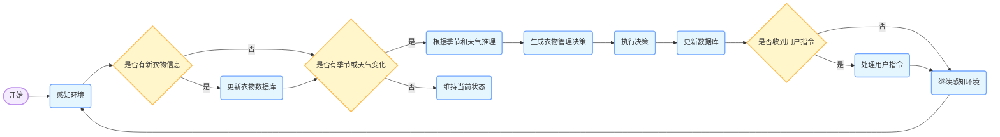

# AI Agent在智能衣柜中的季节性衣物管理

> 关键词：AI Agent、智能衣柜、季节性衣物管理、人工智能、智能家居、衣物分类、衣物推荐

> 摘要：本文聚焦于AI Agent在智能衣柜季节性衣物管理中的应用。详细阐述了相关核心概念、算法原理、数学模型等内容，通过项目实战展示了具体的代码实现与解读，分析了其实际应用场景，推荐了学习资源、开发工具框架以及相关论文著作等。旨在深入探讨AI Agent如何有效实现智能衣柜中季节性衣物的高效管理，为智能家居领域的发展提供有价值的参考，同时对未来发展趋势与挑战进行了总结与展望。

## 1. 背景介绍 
### 1.1 目的和范围
随着智能家居的快速发展，智能衣柜作为其中的重要组成部分，逐渐受到人们的关注。本文章的目的在于探讨如何利用AI Agent技术实现智能衣柜中季节性衣物的有效管理。范围涵盖了从AI Agent的核心概念、相关算法原理到实际应用场景的分析，以及开发过程中的环境搭建、代码实现等内容，旨在为智能衣柜的季节性衣物管理提供全面且深入的技术解决方案。

### 1.2 预期读者
本文预期读者包括对人工智能、智能家居领域感兴趣的技术爱好者，从事相关领域研究与开发的科研人员和工程师，以及希望了解智能衣柜技术发展的普通消费者等。对于不同层次的读者，文章将从基础概念到深入技术原理进行详细讲解，以满足不同读者的需求。

### 1.3 文档结构概述
本文首先介绍了相关背景信息，包括目的、预期读者和文档结构等。接着阐述核心概念与联系，展示其原理和架构的文本示意图与Mermaid流程图。然后详细讲解核心算法原理和具体操作步骤，并给出Python源代码。随后介绍数学模型和公式，通过举例进行说明。再通过项目实战展示代码实际案例及详细解释。之后分析实际应用场景，推荐相关工具和资源。最后总结未来发展趋势与挑战，提供常见问题与解答以及扩展阅读和参考资料。

### 1.4 术语表
#### 1.4.1 核心术语定义
- **AI Agent（人工智能代理）**：是一种能够感知环境、进行推理并采取行动以实现特定目标的智能实体。在智能衣柜中，AI Agent可以感知衣柜内衣物的状态、环境信息等，并根据这些信息进行衣物管理的决策。
- **智能衣柜**：是一种具备智能化功能的衣柜，通过集成各种传感器、控制器和通信模块，能够实现对衣物的自动化管理和与用户的交互。
- **季节性衣物管理**：指根据不同季节的特点和需求，对衣柜中的衣物进行分类、整理、存储和推荐等操作，以方便用户在不同季节快速找到合适的衣物。

#### 1.4.2 相关概念解释
- **机器学习**：是AI Agent实现智能决策的重要技术手段之一，通过对大量数据的学习和分析，让AI Agent能够自动发现数据中的规律和模式，从而做出准确的决策。
- **计算机视觉**：在智能衣柜中，计算机视觉技术可以用于识别衣物的种类、颜色、款式等信息，为AI Agent提供更准确的衣物数据。
- **物联网（IoT）**：智能衣柜通过物联网技术实现与其他设备的连接和数据交互，例如与气象站连接获取天气信息，与用户的移动设备连接实现远程控制等。

#### 1.4.3 缩略词列表
- **AI**：Artificial Intelligence（人工智能）
- **IoT**：Internet of Things（物联网）
- **ML**：Machine Learning（机器学习）

## 2. 核心概念与联系 
### 核心概念原理
AI Agent在智能衣柜的季节性衣物管理中扮演着核心角色。其原理基于对环境的感知、推理和行动三个主要步骤。首先，AI Agent通过各种传感器感知衣柜内衣物的状态，如衣物的位置、数量、种类等，同时获取外部环境信息，如季节、天气等。然后，利用机器学习和数据分析等技术对感知到的信息进行推理，例如根据季节和天气信息判断用户可能需要的衣物。最后，根据推理结果采取相应的行动，如推荐合适的衣物、提醒用户整理衣物等。

智能衣柜则是AI Agent运行的物理环境，它集成了多种传感器和执行器，为AI Agent提供数据输入和执行决策的手段。季节性衣物管理是AI Agent和智能衣柜共同实现的目标，通过合理的分类、整理和推荐，提高用户的衣物使用效率和舒适度。

### 架构的文本示意图
```plaintext
用户
|
| 交互（如手机APP、语音指令等）
v
智能衣柜（集成传感器、执行器、通信模块）
|
| 数据传输（衣物信息、环境信息等）
v
AI Agent（感知、推理、行动模块）
|
| 数据分析与决策
v
数据库（存储衣物信息、用户偏好、季节数据等）
```

### Mermaid流程图


## 3. 核心算法原理 & 具体操作步骤 
### 核心算法原理
在AI Agent实现智能衣柜季节性衣物管理的过程中，主要涉及到机器学习中的分类算法和推荐算法。

#### 分类算法
分类算法用于对衣柜中的衣物进行分类，例如将衣物分为上衣、裤子、裙子等不同类别，同时根据季节将衣物分为夏季衣物、冬季衣物等。这里我们可以使用决策树算法进行衣物分类。决策树算法是一种基于树结构进行决策的算法，它通过对特征的判断来划分不同的类别。

以下是一个简单的决策树分类算法的Python示例代码：
```python
from sklearn import tree
import numpy as np

# 示例数据：衣物的特征（长度、厚度）
X = np.array([[100, 10], [80, 5], [120, 20], [60, 3]])
# 示例标签：衣物的类别（冬季外套、夏季衬衫、冬季长裤、夏季短裤）
y = ['冬季外套', '夏季衬衫', '冬季长裤', '夏季短裤']

# 创建决策树分类器
clf = tree.DecisionTreeClassifier()
# 训练模型
clf = clf.fit(X, y)

# 预测新的衣物类别
new_clothes = np.array([[90, 8]])
predicted_class = clf.predict(new_clothes)
print("预测的衣物类别：", predicted_class)
```
在上述代码中，我们首先定义了一些衣物的特征和对应的类别标签，然后使用`DecisionTreeClassifier`创建了一个决策树分类器，并对其进行训练。最后，我们使用训练好的模型对新的衣物进行分类预测。

#### 推荐算法
推荐算法用于根据季节、天气和用户偏好等信息，为用户推荐合适的衣物。这里我们可以使用基于内容的推荐算法。基于内容的推荐算法是根据物品的特征和用户的偏好来进行推荐的。

以下是一个简单的基于内容的推荐算法的Python示例代码：
```python
import pandas as pd

# 示例数据：衣物信息（名称、季节、天气适宜度、用户偏好得分）
clothes_data = {
    '名称': ['短袖T恤', '长袖衬衫', '羽绒服', '短裤'],
    '季节': ['夏季', '春秋季', '冬季', '夏季'],
    '天气适宜度': [80, 60, 20, 70],
    '用户偏好得分': [70, 65, 50, 85]
}
df = pd.DataFrame(clothes_data)

# 当前季节和天气适宜度阈值
current_season = '夏季'
weather_threshold = 70

# 筛选出符合季节和天气条件的衣物
filtered_clothes = df[(df['季节'] == current_season) & (df['天气适宜度'] >= weather_threshold)]

# 根据用户偏好得分进行排序
recommended_clothes = filtered_clothes.sort_values(by='用户偏好得分', ascending=False)

print("推荐的衣物：")
print(recommended_clothes[['名称', '用户偏好得分']])
```
在上述代码中，我们首先定义了一些衣物的信息，包括名称、季节、天气适宜度和用户偏好得分等。然后，我们根据当前季节和天气适宜度阈值筛选出符合条件的衣物，并根据用户偏好得分进行排序，最后输出推荐的衣物。

### 具体操作步骤
1. **数据收集**：通过智能衣柜中的传感器收集衣物的特征信息，如颜色、材质、长度、厚度等，同时获取外部环境信息，如季节、天气等。
2. **数据预处理**：对收集到的数据进行清洗、转换和归一化等处理，以提高数据的质量和可用性。
3. **模型训练**：使用分类算法和推荐算法对预处理后的数据进行训练，得到分类模型和推荐模型。
4. **实时感知**：AI Agent实时感知衣柜内衣物的状态和外部环境信息。
5. **推理决策**：根据感知到的信息，使用训练好的模型进行推理，生成衣物管理决策。
6. **执行决策**：AI Agent控制智能衣柜中的执行器执行决策，如推荐衣物、提醒用户整理衣物等。
7. **反馈优化**：根据用户的反馈信息，对模型进行优化和调整，提高决策的准确性和用户满意度。

## 4. 数学模型和公式 & 详细讲解 & 举例说明 
### 分类算法的数学模型和公式
#### 决策树算法的信息增益公式
决策树算法中，常用信息增益来选择最优的划分特征。信息增益的计算公式为：
$$
IG(D, A) = H(D) - H(D|A)
$$
其中，$IG(D, A)$ 表示特征 $A$ 对数据集 $D$ 的信息增益，$H(D)$ 表示数据集 $D$ 的信息熵，$H(D|A)$ 表示在特征 $A$ 给定的条件下数据集 $D$ 的条件熵。

信息熵的计算公式为：
$$
H(D) = -\sum_{k=1}^{|y|}p_k\log_2p_k
$$
其中，$|y|$ 表示数据集 $D$ 中类别标签的数量，$p_k$ 表示第 $k$ 个类别标签在数据集 $D$ 中出现的概率。

条件熵的计算公式为：
$$
H(D|A) = \sum_{i=1}^{|A|}\frac{|D_i|}{|D|}H(D_i)
$$
其中，$|A|$ 表示特征 $A$ 的取值数量，$D_i$ 表示特征 $A$ 取值为第 $i$ 个值的样本子集，$|D_i|$ 表示 $D_i$ 的样本数量，$|D|$ 表示数据集 $D$ 的样本数量。

#### 举例说明
假设有一个数据集 $D$ 包含 10 个样本，其中 6 个样本的类别标签为正类，4 个样本的类别标签为负类。则数据集 $D$ 的信息熵为：
$$
H(D) = -\frac{6}{10}\log_2\frac{6}{10} - \frac{4}{10}\log_2\frac{4}{10} \approx 0.971
$$
假设特征 $A$ 有两个取值，$A_1$ 和 $A_2$，其中 $A_1$ 对应的样本子集 $D_1$ 包含 4 个样本，3 个正类和 1 个负类；$A_2$ 对应的样本子集 $D_2$ 包含 6 个样本，3 个正类和 3 个负类。则特征 $A$ 给定的条件下数据集 $D$ 的条件熵为：
$$
H(D|A) = \frac{4}{10}(-\frac{3}{4}\log_2\frac{3}{4} - \frac{1}{4}\log_2\frac{1}{4}) + \frac{6}{10}(-\frac{3}{6}\log_2\frac{3}{6} - \frac{3}{6}\log_2\frac{3}{6}) \approx 0.811
$$
特征 $A$ 对数据集 $D$ 的信息增益为：
$$
IG(D, A) = H(D) - H(D|A) \approx 0.971 - 0.811 = 0.16
$$

### 推荐算法的数学模型和公式
#### 基于内容的推荐算法的相似度计算
在基于内容的推荐算法中，常用余弦相似度来计算物品之间的相似度。余弦相似度的计算公式为：
$$
sim(A, B) = \frac{\vec{A} \cdot \vec{B}}{\|\vec{A}\| \|\vec{B}\|}
$$
其中，$\vec{A}$ 和 $\vec{B}$ 分别表示物品 $A$ 和物品 $B$ 的特征向量，$\vec{A} \cdot \vec{B}$ 表示向量 $\vec{A}$ 和 $\vec{B}$ 的点积，$\|\vec{A}\|$ 和 $\|\vec{B}\|$ 分别表示向量 $\vec{A}$ 和 $\vec{B}$ 的模。

#### 举例说明
假设有两个衣物的特征向量 $\vec{A} = [1, 2, 3]$ 和 $\vec{B} = [2, 4, 6]$。则它们的点积为：
$$
\vec{A} \cdot \vec{B} = 1\times2 + 2\times4 + 3\times6 = 2 + 8 + 18 = 28
$$
向量 $\vec{A}$ 的模为：
$$
\|\vec{A}\| = \sqrt{1^2 + 2^2 + 3^2} = \sqrt{1 + 4 + 9} = \sqrt{14}
$$
向量 $\vec{B}$ 的模为：
$$
\|\vec{B}\| = \sqrt{2^2 + 4^2 + 6^2} = \sqrt{4 + 16 + 36} = \sqrt{56} = 2\sqrt{14}
$$
则衣物 $A$ 和衣物 $B$ 的余弦相似度为：
$$
sim(A, B) = \frac{\vec{A} \cdot \vec{B}}{\|\vec{A}\| \|\vec{B}\|} = \frac{28}{\sqrt{14} \times 2\sqrt{14}} = 1
$$

## 5. 项目实战：代码实际案例和详细解释说明 
### 5.1  开发环境搭建
#### 硬件环境
- **智能衣柜**：选择一款支持物联网功能的智能衣柜，集成各种传感器，如红外传感器用于检测衣物的存在，摄像头用于识别衣物的外观特征等。
- **服务器**：可以选择云服务器或本地服务器，用于运行AI Agent和存储数据。
- **传感器设备**：包括温度传感器、湿度传感器、光照传感器等，用于获取外部环境信息。

#### 软件环境
- **操作系统**：选择适合服务器的操作系统，如Ubuntu、Windows Server等。
- **开发语言**：使用Python作为主要开发语言，因为Python具有丰富的机器学习和数据分析库。
- **开发框架**：使用Flask作为Web开发框架，用于搭建与智能衣柜和用户交互的接口。
- **数据库**：选择MySQL或MongoDB等数据库，用于存储衣物信息、用户偏好、季节数据等。

### 5.2  源代码详细实现和代码解读
以下是一个简单的智能衣柜季节性衣物管理系统的Python代码示例：

```python
from flask import Flask, request, jsonify
import pandas as pd
import numpy as np
from sklearn import tree

# 初始化Flask应用
app = Flask(__name__)

# 模拟衣物数据库
clothes_data = {
    '名称': ['短袖T恤', '长袖衬衫', '羽绒服', '短裤'],
    '季节': ['夏季', '春秋季', '冬季', '夏季'],
    '天气适宜度': [80, 60, 20, 70],
    '用户偏好得分': [70, 65, 50, 85],
    '长度': [60, 80, 120, 30],
    '厚度': [3, 5, 20, 2]
}
df = pd.DataFrame(clothes_data)

# 训练决策树分类器
X = df[['长度', '厚度']].values
y = df['季节'].values
clf = tree.DecisionTreeClassifier()
clf = clf.fit(X, y)

# 定义API接口
@app.route('/recommend_clothes', methods=['GET'])
def recommend_clothes():
    # 获取当前季节和天气适宜度阈值
    current_season = request.args.get('season', '夏季')
    weather_threshold = int(request.args.get('weather_threshold', 70))

    # 筛选出符合季节和天气条件的衣物
    filtered_clothes = df[(df['季节'] == current_season) & (df['天气适宜度'] >= weather_threshold)]

    # 根据用户偏好得分进行排序
    recommended_clothes = filtered_clothes.sort_values(by='用户偏好得分', ascending=False)

    # 返回推荐的衣物信息
    result = recommended_clothes[['名称', '用户偏好得分']].to_dict(orient='records')
    return jsonify(result)

@app.route('/classify_clothes', methods=['POST'])
def classify_clothes():
    # 获取衣物的特征信息
    data = request.get_json()
    length = data.get('length')
    thickness = data.get('thickness')

    # 预测衣物的季节类别
    new_clothes = np.array([[length, thickness]])
    predicted_season = clf.predict(new_clothes)

    # 返回预测结果
    return jsonify({'季节': predicted_season[0]})

if __name__ == '__main__':
    app.run(debug=True)
```

### 5.3  代码解读与分析
#### 整体功能
该代码实现了一个简单的智能衣柜季节性衣物管理系统，包括衣物分类和衣物推荐两个主要功能。通过Flask框架提供了两个API接口，分别用于衣物推荐和衣物分类。

#### 代码细节
1. **数据初始化**：使用`pandas`库创建了一个模拟的衣物数据库，包含衣物的名称、季节、天气适宜度、用户偏好得分、长度和厚度等信息。
2. **模型训练**：使用`sklearn`库中的`DecisionTreeClassifier`训练了一个决策树分类器，用于根据衣物的长度和厚度预测其季节类别。
3. **衣物推荐接口**：`/recommend_clothes`接口根据当前季节和天气适宜度阈值筛选出符合条件的衣物，并根据用户偏好得分进行排序，最后返回推荐的衣物信息。
4. **衣物分类接口**：`/classify_clothes`接口接收衣物的长度和厚度信息，使用训练好的决策树分类器预测其季节类别，并返回预测结果。

## 6. 实际应用场景 
### 日常衣物管理
用户可以通过手机APP或语音指令与智能衣柜交互，AI Agent根据当前季节和天气信息为用户推荐合适的衣物。例如，在夏季炎热的天气下，推荐短袖T恤、短裤等轻薄透气的衣物；在冬季寒冷的天气下，推荐羽绒服、毛衣等保暖的衣物。同时，AI Agent还可以提醒用户及时整理衣柜，将过季的衣物收纳起来，为当季的衣物腾出空间。

### 旅行场景
当用户计划旅行时，AI Agent可以根据旅行目的地的季节、天气和当地的文化习俗等信息，为用户推荐适合旅行的衣物。例如，旅行目的地是热带地区，AI Agent会推荐轻薄的夏季衣物和防晒用品；如果旅行目的地是寒冷的地区，AI Agent会推荐保暖的冬季衣物和防寒装备。

### 时尚搭配建议
AI Agent可以根据用户的衣物信息和个人风格偏好，为用户提供时尚搭配建议。例如，根据用户拥有的上衣和裤子，推荐合适的鞋子和配饰，帮助用户打造出不同的时尚造型。

## 7. 工具和资源推荐
### 7.1 学习资源推荐
#### 7.1.1 书籍推荐
- 《Python机器学习实战》：本书详细介绍了Python在机器学习领域的应用，包括各种机器学习算法的原理和实现，适合初学者学习。
- 《人工智能：一种现代的方法》：这是一本经典的人工智能教材，全面介绍了人工智能的各个领域，包括知识表示、推理、机器学习、自然语言处理等，对于深入理解AI Agent的原理和技术有很大帮助。
- 《智能家居技术与应用》：本书介绍了智能家居的相关技术和应用案例，包括智能衣柜、智能家电等，对于了解智能衣柜的发展趋势和技术实现有参考价值。

#### 7.1.2 在线课程
- Coursera上的“Machine Learning”课程：由斯坦福大学的Andrew Ng教授主讲，是一门非常经典的机器学习课程，涵盖了机器学习的基本概念、算法和应用。
- edX上的“Artificial Intelligence”课程：该课程介绍了人工智能的基本原理和技术，包括搜索算法、知识表示、机器学习等内容。
- 中国大学MOOC上的“智能家居系统设计与实现”课程：该课程介绍了智能家居系统的设计和实现方法，包括智能硬件、通信协议、云计算等方面的知识。

#### 7.1.3 技术博客和网站
- Medium：Medium上有很多关于人工智能、机器学习和智能家居的技术博客文章，作者来自世界各地的技术专家和爱好者，可以从中获取最新的技术动态和实践经验。
- 知乎：知乎上有很多关于人工智能和智能家居的讨论和问答，可以与其他技术爱好者交流和学习。
- 开源中国：开源中国是一个专注于开源技术的社区，上面有很多关于智能家居和人工智能的开源项目和技术文章，可以参考和学习。

### 7.2 开发工具框架推荐
#### 7.2.1 IDE和编辑器
- PyCharm：PyCharm是一款专门为Python开发设计的集成开发环境（IDE），具有代码编辑、调试、代码分析等功能，适合Python开发人员使用。
- Visual Studio Code：Visual Studio Code是一款轻量级的代码编辑器，支持多种编程语言，包括Python。它具有丰富的插件和扩展功能，可以提高开发效率。

#### 7.2.2 调试和性能分析工具
- pdb：pdb是Python自带的调试工具，可以在代码中设置断点，逐步执行代码，查看变量的值和程序的执行流程。
- cProfile：cProfile是Python的性能分析工具，可以统计程序中各个函数的执行时间和调用次数，帮助开发人员找出性能瓶颈。

#### 7.2.3 相关框架和库
- Flask：Flask是一个轻量级的Web开发框架，适合快速开发Web应用和API接口。
- scikit-learn：scikit-learn是一个常用的机器学习库，提供了各种机器学习算法的实现，包括分类、回归、聚类等。
- pandas：pandas是一个数据处理和分析库，提供了高效的数据结构和数据操作方法，适合处理和分析衣物信息等数据。

### 7.3 相关论文著作推荐
#### 7.3.1 经典论文
- “A Logical Calculus of the Ideas Immanent in Nervous Activity” by Warren S. McCulloch and Walter Pitts：这篇论文提出了人工神经网络的基本模型，是人工智能领域的经典之作。
- “Machine Learning” by Tom M. Mitchell：这篇论文对机器学习的基本概念和算法进行了系统的介绍，是机器学习领域的重要文献。

#### 7.3.2 最新研究成果
- 可以关注IEEE Transactions on Smart Homes and Healthcare、ACM Transactions on Intelligent Systems and Technology等学术期刊，获取关于智能衣柜和人工智能的最新研究成果。

#### 7.3.3 应用案例分析
- 可以参考一些智能家居领域的应用案例分析报告，了解智能衣柜在实际应用中的实现方法和效果，例如小米、华为等公司的智能家居产品案例。

## 8. 总结：未来发展趋势与挑战
### 未来发展趋势
- **更加智能化**：AI Agent将不断学习和进化，能够更好地理解用户的需求和偏好，提供更加个性化、智能化的衣物管理服务。例如，通过对用户的穿着习惯和反馈信息的分析，自动调整推荐策略，提供更符合用户心意的衣物搭配和推荐。
- **与其他智能家居设备的集成**：智能衣柜将与其他智能家居设备，如智能镜子、智能衣架等进行深度集成，实现更加便捷的交互和协同工作。例如，用户站在智能镜子前，智能镜子可以显示智能衣柜中推荐的衣物，并提供虚拟试穿的功能。
- **可持续发展**：随着人们对环保和可持续发展的关注度不断提高，智能衣柜将在衣物管理中融入可持续发展的理念。例如，推荐环保材质的衣物，提醒用户合理使用和保养衣物，减少衣物的浪费。

### 挑战
- **数据隐私和安全**：智能衣柜中存储了大量用户的衣物信息、个人偏好等敏感数据，如何保障这些数据的隐私和安全是一个重要的挑战。需要采用先进的加密技术和安全机制，防止数据泄露和恶意攻击。
- **技术标准和互操作性**：目前智能家居领域的技术标准还不够统一，不同品牌和厂商的智能衣柜和相关设备之间可能存在互操作性问题。需要建立统一的技术标准和协议，促进智能衣柜与其他设备的互联互通。
- **用户接受度**：智能衣柜作为一种新兴的智能家居产品，用户对其功能和使用方法的接受度还需要进一步提高。需要加强用户教育和宣传，让用户了解智能衣柜的优势和价值，提高用户的使用意愿和满意度。

## 9. 附录：常见问题与解答
### 1. 智能衣柜中的传感器如何保证数据的准确性？
智能衣柜中的传感器需要定期进行校准和维护，以保证数据的准确性。同时，可以采用多个传感器进行数据采集，并通过数据融合算法对多个传感器的数据进行处理和分析，提高数据的可靠性。

### 2. AI Agent如何学习用户的偏好？
AI Agent可以通过收集用户的历史选择、反馈信息等数据，使用机器学习算法进行分析和学习，从而逐渐了解用户的偏好。例如，用户经常选择某种颜色或款式的衣物，AI Agent就会将这些信息纳入到推荐模型中。

### 3. 智能衣柜的成本高吗？
智能衣柜的成本受到多种因素的影响，如衣柜的材质、功能配置、品牌等。目前，智能衣柜的价格相对较高，但随着技术的不断发展和市场的逐渐成熟，其成本有望逐渐降低。

### 4. 智能衣柜的使用寿命是多久？
智能衣柜的使用寿命与衣柜的材质、使用频率、维护情况等因素有关。一般来说，如果正确使用和维护，智能衣柜的使用寿命可以达到10年以上。

## 10. 扩展阅读 & 参考资料
### 扩展阅读
- 《未来智能家居生活》：这本书描绘了未来智能家居的发展蓝图，包括智能衣柜在内的各种智能家居设备将如何改变人们的生活方式。
- 《人工智能时代的家居变革》：探讨了人工智能技术在智能家居领域的应用和发展趋势，对智能衣柜的未来发展有深入的思考和分析。

### 参考资料
- 相关的学术论文和研究报告，如IEEE、ACM等学术组织发表的关于人工智能、智能家居的论文。
- 智能衣柜和智能家居相关的产品说明书和技术文档，如小米、华为等公司的智能衣柜产品资料。
- 在线技术论坛和社区的讨论和交流内容，如Stack Overflow、GitHub等平台上关于智能衣柜和人工智能的相关话题。