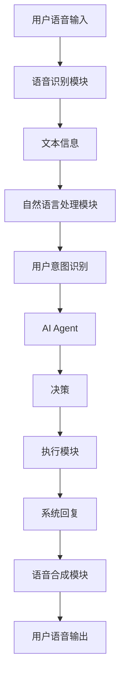

# AI Agent在智能语音助手中的应用

> 关键词：AI Agent、智能语音助手、自然语言处理、机器学习、对话管理、应用场景

> 摘要：本文深入探讨了AI Agent在智能语音助手中的应用。首先介绍了相关背景，包括目的、预期读者、文档结构和术语表。接着阐述了核心概念与联系，通过文本示意图和Mermaid流程图展示其原理和架构。详细讲解了核心算法原理及具体操作步骤，并用Python代码进行了示例。同时给出了数学模型和公式，并举例说明。通过项目实战展示了代码实际案例及详细解释。分析了实际应用场景，推荐了相关的工具和资源，包括学习资源、开发工具框架和论文著作。最后总结了未来发展趋势与挑战，还设置了附录解答常见问题，并提供了扩展阅读和参考资料，旨在为读者全面呈现AI Agent在智能语音助手中的应用全貌。

## 1. 背景介绍 
### 1.1 目的和范围
智能语音助手近年来在人们的生活和工作中得到了广泛应用，如苹果的Siri、亚马逊的Alexa等。然而，目前的智能语音助手在处理复杂任务、理解用户意图和提供个性化服务方面仍存在一定的局限性。AI Agent作为一种能够自主执行任务、与环境交互并做出决策的智能实体，为智能语音助手的发展提供了新的思路和方法。本文的目的是深入探讨AI Agent在智能语音助手中的应用，包括其核心概念、算法原理、实际应用场景等，旨在为相关领域的研究和开发提供参考。

本文的范围主要涵盖AI Agent和智能语音助手的基本概念、AI Agent在智能语音助手中的工作原理、核心算法、数学模型，以及实际项目中的应用案例。同时，还会介绍相关的工具和资源，以及对未来发展趋势和挑战的分析。

### 1.2 预期读者
本文预期读者包括但不限于以下几类人群：
- 人工智能领域的研究人员和学者，他们可以通过本文了解AI Agent在智能语音助手中的最新应用和研究进展，为自己的研究提供新的方向和思路。
- 智能语音助手的开发人员，本文将提供详细的算法原理和代码示例，帮助他们在实际开发中应用AI Agent技术，提升智能语音助手的性能和功能。
- 对人工智能和智能语音助手感兴趣的技术爱好者，通过阅读本文，他们可以深入了解AI Agent在智能语音助手中的应用原理和实际效果，拓宽自己的技术视野。

### 1.3 文档结构概述
本文将按照以下结构进行组织：
- 核心概念与联系：介绍AI Agent和智能语音助手的核心概念，以及它们之间的联系，通过文本示意图和Mermaid流程图展示其原理和架构。
- 核心算法原理 & 具体操作步骤：详细讲解AI Agent在智能语音助手中应用的核心算法原理，并给出具体的操作步骤，同时用Python代码进行示例。
- 数学模型和公式 & 详细讲解 & 举例说明：给出相关的数学模型和公式，并进行详细讲解，通过具体例子说明其应用。
- 项目实战：代码实际案例和详细解释说明：通过一个实际项目案例，展示AI Agent在智能语音助手中的应用，包括开发环境搭建、源代码实现和代码解读。
- 实际应用场景：分析AI Agent在智能语音助手中的实际应用场景，如智能家居控制、智能客服等。
- 工具和资源推荐：推荐相关的学习资源、开发工具框架和论文著作，帮助读者进一步深入学习和研究。
- 总结：未来发展趋势与挑战：总结AI Agent在智能语音助手中应用的未来发展趋势，并分析可能面临的挑战。
- 附录：常见问题与解答：解答读者在阅读本文过程中可能遇到的常见问题。
- 扩展阅读 & 参考资料：提供相关的扩展阅读材料和参考资料，方便读者进一步深入学习。

### 1.4 术语表
#### 1.4.1 核心术语定义
- **AI Agent（人工智能代理）**：是一种能够感知环境、自主决策并采取行动以实现特定目标的智能实体。它可以根据环境的变化自动调整自己的行为，与其他Agent进行交互。
- **智能语音助手**：是一种基于语音识别和自然语言处理技术，能够理解用户的语音指令并提供相应服务的软件系统。它可以完成各种任务，如查询信息、控制设备、进行对话等。
- **自然语言处理（NLP）**：是人工智能的一个重要领域，主要研究如何让计算机理解和处理人类语言。它包括语音识别、语义理解、文本生成等多个方面。
- **机器学习（ML）**：是一门多领域交叉学科，涉及概率论、统计学、逼近论、凸分析、算法复杂度理论等多门学科。它专门研究计算机怎样模拟或实现人类的学习行为，以获取新的知识或技能，重新组织已有的知识结构使之不断改善自身的性能。

#### 1.4.2 相关概念解释
- **对话管理**：在智能语音助手中，对话管理负责处理用户与语音助手之间的对话流程。它包括识别用户意图、维护对话状态、选择合适的回复策略等。
- **知识图谱**：是一种语义网络，用于表示实体之间的关系和知识。在智能语音助手中，知识图谱可以帮助语音助手更好地理解用户的问题，并提供更准确的答案。
- **强化学习**：是机器学习的一种方法，通过智能体与环境进行交互，根据环境反馈的奖励信号来学习最优的行为策略。在AI Agent中，强化学习可以用于优化Agent的决策过程。

#### 1.4.3 缩略词列表
- **NLP**：Natural Language Processing（自然语言处理）
- **ML**：Machine Learning（机器学习）
- **RL**：Reinforcement Learning（强化学习）

## 2. 核心概念与联系 

### 2.1 AI Agent的核心概念
AI Agent是一个具有自主性、反应性、社会性和主动性的智能实体。自主性意味着它可以在没有人类干预的情况下独立执行任务；反应性表示它能够感知环境的变化并做出相应的反应；社会性指的是它可以与其他Agent进行交互和协作；主动性则体现为它能够主动发起行动以实现自己的目标。

在智能语音助手中，AI Agent可以看作是一个智能的对话管理者和任务执行者。它接收用户的语音输入，通过自然语言处理技术理解用户的意图，然后根据自身的知识和策略做出决策，并采取相应的行动，如查询信息、控制设备等。

### 2.2 智能语音助手的核心概念
智能语音助手是一种基于语音交互的智能系统，它主要由语音识别、自然语言处理、对话管理和语音合成等模块组成。语音识别模块将用户的语音信号转换为文本；自然语言处理模块对文本进行分析和理解，识别用户的意图；对话管理模块负责处理对话流程，维护对话状态；语音合成模块将系统的回复转换为语音输出。

### 2.3 AI Agent与智能语音助手的联系
AI Agent可以作为智能语音助手的核心决策和执行单元，增强智能语音助手的智能性和自主性。具体来说，AI Agent可以根据用户的历史对话记录和当前的对话状态，预测用户的需求，主动提供相关的信息和服务。同时，AI Agent还可以与其他智能设备和系统进行交互，实现更复杂的任务。

### 2.4 文本示意图
以下是AI Agent在智能语音助手中的工作原理示意图：

```plaintext
用户语音输入 -> 语音识别模块 -> 文本信息 -> 自然语言处理模块 -> 用户意图识别
                                                   |
                                                   v
                                               AI Agent
                                                   |
                                                   v
                            决策（查询信息、控制设备等） -> 执行模块 -> 系统回复
                                                   |
                                                   v
                                            语音合成模块 -> 用户语音输出
```

### 2.5 Mermaid流程图


## 3. 核心算法原理 & 具体操作步骤 

### 3.1 自然语言处理算法原理
在智能语音助手中，自然语言处理是理解用户意图的关键步骤。常用的自然语言处理算法包括词法分析、句法分析和语义分析。

#### 3.1.1 词法分析
词法分析的主要任务是将输入的文本分割成一个个单词或词语。在Python中，可以使用`jieba`库进行中文词法分析。以下是一个简单的示例代码：

```python
import jieba

text = "智能语音助手是一种很有用的工具"
words = jieba.lcut(text)
print(words)
```

#### 3.1.2 句法分析
句法分析的目的是分析句子的语法结构，确定词语之间的关系。可以使用`spaCy`库进行英文句法分析，以下是一个示例：

```python
import spacy

nlp = spacy.load("en_core_web_sm")
text = "The smart voice assistant is a very useful tool."
doc = nlp(text)
for token in doc:
    print(token.text, token.dep_, token.head.text)
```

#### 3.1.3 语义分析
语义分析是理解句子的含义，通常使用深度学习模型，如BERT（Bidirectional Encoder Representations from Transformers）。以下是一个使用`transformers`库进行语义分析的示例：

```python
from transformers import AutoTokenizer, AutoModelForSequenceClassification
import torch

tokenizer = AutoTokenizer.from_pretrained("bert-base-chinese")
model = AutoModelForSequenceClassification.from_pretrained("bert-base-chinese")

text = "智能语音助手很方便"
inputs = tokenizer(text, return_tensors="pt")
outputs = model(**inputs)
logits = outputs.logits
predicted_class_id = logits.argmax().item()
print(predicted_class_id)
```

### 3.2 AI Agent决策算法原理
AI Agent的决策过程通常基于强化学习算法。强化学习通过智能体与环境进行交互，根据环境反馈的奖励信号来学习最优的行为策略。常用的强化学习算法有Q-learning和深度Q网络（DQN）。

#### 3.2.1 Q-learning算法原理
Q-learning是一种基于值函数的强化学习算法，它通过不断更新Q值（状态-动作价值）来学习最优策略。Q值表示在某个状态下采取某个动作所能获得的最大期望奖励。

Q-learning的更新公式如下：

$$Q(s_t, a_t) = Q(s_t, a_t) + \alpha [r_{t+1} + \gamma \max_{a} Q(s_{t+1}, a) - Q(s_t, a_t)]$$

其中，$s_t$ 是当前状态，$a_t$ 是当前动作，$r_{t+1}$ 是下一个时间步的奖励，$\alpha$ 是学习率，$\gamma$ 是折扣因子。

以下是一个简单的Q-learning算法的Python实现：

```python
import numpy as np

# 定义环境
states = 5
actions = 2
Q = np.zeros((states, actions))

# 超参数
alpha = 0.1
gamma = 0.9
episodes = 100

# 模拟环境反馈
def get_reward(state, action):
    if state == 3 and action == 1:
        return 1
    return 0

# Q-learning算法
for episode in range(episodes):
    state = 0
    done = False
    while not done:
        action = np.argmax(Q[state, :])
        reward = get_reward(state, action)
        next_state = state + 1 if action == 1 else state
        if next_state >= states:
            done = True
        Q[state, action] = Q[state, action] + alpha * (reward + gamma * np.max(Q[next_state, :]) - Q[state, action])
        state = next_state

print(Q)
```

### 3.3 具体操作步骤
#### 3.3.1 数据预处理
- 收集和整理用户的语音数据和对话记录。
- 对语音数据进行清洗和标注，将其转换为文本数据。
- 对文本数据进行词法分析、句法分析和语义分析，提取有用的信息。

#### 3.3.2 模型训练
- 使用预处理后的数据训练自然语言处理模型，如BERT、GPT等。
- 使用强化学习算法训练AI Agent的决策模型，如Q-learning、DQN等。

#### 3.3.3 系统集成
- 将训练好的自然语言处理模型和AI Agent决策模型集成到智能语音助手系统中。
- 实现语音识别、语音合成等模块，完成智能语音助手的开发。

#### 3.3.4 测试和优化
- 对智能语音助手进行功能测试和性能测试，发现并修复存在的问题。
- 根据测试结果对模型进行优化，提高智能语音助手的性能和准确性。

## 4. 数学模型和公式 & 详细讲解 & 举例说明 

### 4.1 自然语言处理中的数学模型
#### 4.1.1 词向量模型
词向量模型是将词语表示为向量的一种方法，常用的词向量模型有Word2Vec和GloVe。

Word2Vec通过神经网络学习词语的上下文信息，将词语映射到低维向量空间中。其核心思想是根据词语的上下文预测该词语，或者根据词语预测其上下文。

假设我们有一个文本序列 $w_1, w_2, \cdots, w_T$，Word2Vec的目标是最大化以下概率：

$$P(w_{t-k}, \cdots, w_{t-1}, w_{t+1}, \cdots, w_{t+k} | w_t)$$

其中，$k$ 是上下文窗口的大小。

#### 4.1.2 语言模型
语言模型用于计算一个句子或文本序列的概率。常用的语言模型有n-gram模型和神经网络语言模型。

n-gram模型基于马尔可夫假设，即一个词语的出现只与前面的 $n-1$ 个词语有关。n-gram模型的概率计算公式如下：

$$P(w_t | w_{t-1}, \cdots, w_{t-n+1}) = \frac{C(w_{t-1}, \cdots, w_{t-n+1}, w_t)}{C(w_{t-1}, \cdots, w_{t-n+1})}$$

其中，$C(\cdot)$ 表示词语序列的出现次数。

### 4.2 AI Agent决策中的数学模型
#### 4.2.1 马尔可夫决策过程（MDP）
马尔可夫决策过程是强化学习的基础模型，它由状态集合 $S$、动作集合 $A$、状态转移概率 $P(s' | s, a)$、奖励函数 $R(s, a, s')$ 和折扣因子 $\gamma$ 组成。

在MDP中，智能体在每个时间步 $t$ 根据当前状态 $s_t$ 选择一个动作 $a_t$，环境根据状态转移概率 $P(s_{t+1} | s_t, a_t)$ 转移到下一个状态 $s_{t+1}$，并给予智能体一个奖励 $R(s_t, a_t, s_{t+1})$。

智能体的目标是最大化长期累积奖励：

$$G_t = \sum_{k=0}^{\infty} \gamma^k R_{t+k+1}$$

#### 4.2.2 Q-learning公式
如前面所述，Q-learning的更新公式为：

$$Q(s_t, a_t) = Q(s_t, a_t) + \alpha [r_{t+1} + \gamma \max_{a} Q(s_{t+1}, a) - Q(s_t, a_t)]$$

其中，$Q(s_t, a_t)$ 表示在状态 $s_t$ 下采取动作 $a_t$ 的Q值，$\alpha$ 是学习率，$\gamma$ 是折扣因子，$r_{t+1}$ 是下一个时间步的奖励。

### 4.3 举例说明
#### 4.3.1 词向量模型举例
假设我们有一个简单的文本语料库：["我 喜欢 苹果", "他 喜欢 香蕉"]。使用Word2Vec训练词向量后，“苹果”和“香蕉”可能会在向量空间中距离较近，因为它们都属于水果类。

#### 4.3.2 Q-learning举例
考虑一个简单的迷宫环境，智能体的目标是从起点走到终点。状态可以表示智能体在迷宫中的位置，动作可以是上下左右移动。奖励函数可以设置为：如果智能体走到终点，给予正奖励；如果智能体撞到墙壁，给予负奖励。

通过Q-learning算法，智能体可以学习到从起点到终点的最优路径。在训练过程中，Q值会不断更新，最终收敛到最优策略。

## 5. 项目实战：代码实际案例和详细解释说明 

### 5.1  开发环境搭建
#### 5.1.1 安装Python
首先，需要安装Python 3.x版本。可以从Python官方网站（https://www.python.org/downloads/）下载并安装。

#### 5.1.2 安装必要的库
使用`pip`命令安装以下必要的库：
```sh
pip install jieba spacy transformers numpy
```

#### 5.1.3 下载预训练模型
对于`transformers`库，需要下载相应的预训练模型，如`bert-base-chinese`：
```python
from transformers import AutoTokenizer, AutoModelForSequenceClassification

tokenizer = AutoTokenizer.from_pretrained("bert-base-chinese")
model = AutoModelForSequenceClassification.from_pretrained("bert-base-chinese")
```

### 5.2  源代码详细实现和代码解读
以下是一个简单的智能语音助手示例代码，结合了自然语言处理和AI Agent决策：

```python
import jieba
from transformers import AutoTokenizer, AutoModelForSequenceClassification
import torch
import numpy as np

# 自然语言处理模块
class NLPModule:
    def __init__(self):
        self.tokenizer = AutoTokenizer.from_pretrained("bert-base-chinese")
        self.model = AutoModelForSequenceClassification.from_pretrained("bert-base-chinese")

    def process_text(self, text):
        words = jieba.lcut(text)
        inputs = self.tokenizer(" ".join(words), return_tensors="pt")
        outputs = self.model(**inputs)
        logits = outputs.logits
        predicted_class_id = logits.argmax().item()
        return predicted_class_id

# AI Agent决策模块
class AIAgent:
    def __init__(self):
        self.states = 5
        self.actions = 2
        self.Q = np.zeros((self.states, self.actions))
        self.alpha = 0.1
        self.gamma = 0.9

    def get_action(self, state):
        action = np.argmax(self.Q[state, :])
        return action

    def update_Q(self, state, action, reward, next_state):
        self.Q[state, action] = self.Q[state, action] + self.alpha * (reward + self.gamma * np.max(self.Q[next_state, :]) - self.Q[state, action])

# 智能语音助手主类
class SmartVoiceAssistant:
    def __init__(self):
        self.nlp_module = NLPModule()
        self.ai_agent = AIAgent()
        self.current_state = 0

    def handle_voice_input(self, voice_input):
        # 语音识别（这里简化为直接使用文本输入）
        text = voice_input
        # 自然语言处理
        intent = self.nlp_module.process_text(text)
        # AI Agent决策
        action = self.ai_agent.get_action(self.current_state)
        # 模拟奖励
        reward = 1 if intent == action else 0
        next_state = self.current_state + 1 if action == 1 else self.current_state
        # 更新Q值
        self.ai_agent.update_Q(self.current_state, action, reward, next_state)
        self.current_state = next_state
        # 生成回复
        response = f"你输入的意图是 {intent}，我采取的动作是 {action}"
        return response

# 测试
if __name__ == "__main__":
    assistant = SmartVoiceAssistant()
    voice_input = "智能语音助手很方便"
    response = assistant.handle_voice_input(voice_input)
    print(response)
```

### 5.3  代码解读与分析
#### 5.3.1 NLPModule类
- `__init__`方法：初始化自然语言处理模型，包括加载预训练的BERT模型和分词器。
- `process_text`方法：对输入的文本进行词法分析和语义分析，返回预测的意图类别。

#### 5.3.2 AIAgent类
- `__init__`方法：初始化AI Agent的状态空间、动作空间和Q值表，设置学习率和折扣因子。
- `get_action`方法：根据当前状态选择最优动作。
- `update_Q`方法：根据奖励和下一个状态更新Q值。

#### 5.3.3 SmartVoiceAssistant类
- `__init__`方法：初始化自然语言处理模块和AI Agent决策模块，设置当前状态。
- `handle_voice_input`方法：处理用户的语音输入，包括语音识别（这里简化为直接使用文本输入）、自然语言处理、AI Agent决策、更新Q值和生成回复。

#### 5.3.4 测试部分
创建一个智能语音助手实例，输入一个语音文本，调用`handle_voice_input`方法处理输入并输出回复。

## 6. 实际应用场景 
### 6.1 智能家居控制
AI Agent可以集成到智能语音助手中，实现对智能家居设备的控制。用户可以通过语音指令让智能语音助手打开灯光、调节温度、播放音乐等。AI Agent可以根据用户的习惯和环境状态，自动调整设备的参数，提供更加个性化的服务。

例如，当用户说“打开客厅的灯”时，智能语音助手通过自然语言处理识别用户的意图，AI Agent根据当前的家居设备状态和用户的历史使用记录，判断是否需要调整灯光的亮度和颜色，然后向相应的智能设备发送控制指令。

### 6.2 智能客服
在智能客服场景中，AI Agent可以帮助智能语音助手更好地理解用户的问题，并提供准确的答案。AI Agent可以根据用户的问题和历史对话记录，主动引导用户提供更多的信息，从而更准确地解决问题。

例如，当用户咨询某款产品的价格时，智能语音助手识别用户的问题后，AI Agent可以进一步询问用户是否关注产品的特定型号、配置等信息，以便提供更准确的价格。同时，AI Agent还可以根据用户的需求，推荐相关的产品和服务。

### 6.3 智能车载系统
在智能车载系统中，AI Agent可以与智能语音助手配合，为驾驶员提供更加便捷和安全的服务。驾驶员可以通过语音指令查询导航信息、控制车内设备、播放音乐等。AI Agent可以根据车辆的行驶状态和驾驶员的习惯，提供个性化的建议和服务。

例如，当驾驶员说“导航到最近的加油站”时，智能语音助手识别用户的意图，AI Agent根据车辆的当前位置和剩余油量，选择最合适的加油站，并规划导航路线。同时，AI Agent还可以提醒驾驶员注意交通状况和安全事项。

### 6.4 智能教育
在智能教育领域，AI Agent可以帮助智能语音助手为学生提供个性化的学习服务。学生可以通过语音与智能语音助手交流，询问问题、获取学习资料等。AI Agent可以根据学生的学习进度和能力，制定个性化的学习计划，推荐适合的学习资源。

例如，当学生询问某道数学题的解法时，智能语音助手识别问题后，AI Agent可以根据学生的历史学习记录和当前的知识掌握情况，选择合适的解题方法进行讲解，并提供相关的练习题进行巩固。

## 7. 工具和资源推荐
### 7.1 学习资源推荐
#### 7.1.1 书籍推荐
- 《人工智能：一种现代的方法》：这本书是人工智能领域的经典教材，全面介绍了人工智能的各个方面，包括搜索算法、知识表示、自然语言处理、机器学习等。
- 《Python自然语言处理》：详细介绍了使用Python进行自然语言处理的方法和技术，包括词法分析、句法分析、语义分析等。
- 《强化学习：原理与Python实现》：系统地介绍了强化学习的基本原理和算法，并通过Python代码进行了详细的实现和讲解。

#### 7.1.2 在线课程
- Coursera上的“人工智能基础”课程：由知名教授授课，涵盖了人工智能的基本概念、算法和应用。
- edX上的“自然语言处理”课程：深入讲解了自然语言处理的理论和实践，包括语音识别、机器翻译等。
- Udemy上的“强化学习实战”课程：通过实际项目案例，让学员掌握强化学习的应用和开发。

#### 7.1.3 技术博客和网站
- 机器之心：提供人工智能领域的最新技术动态、研究成果和应用案例。
- 深度学习技术前沿：专注于深度学习的技术分享和研究，包括自然语言处理、计算机视觉等方面。
- OpenAI官方博客：发布OpenAI的最新研究成果和技术进展，对AI Agent和智能语音助手的研究有很大的参考价值。

### 7.2 开发工具框架推荐
#### 7.2.1 IDE和编辑器
- PyCharm：一款功能强大的Python集成开发环境，提供代码编辑、调试、版本控制等功能。
- Visual Studio Code：轻量级的代码编辑器，支持多种编程语言，有丰富的插件可以扩展功能。

#### 7.2.2 调试和性能分析工具
- Py-Spy：一个用于分析Python程序性能的工具，可以查看函数调用时间、内存使用等信息。
- PDB：Python自带的调试器，可以帮助开发者逐步调试代码，查找问题。

#### 7.2.3 相关框架和库
- TensorFlow：一个开源的机器学习框架，广泛应用于自然语言处理、计算机视觉等领域。
- PyTorch：另一个流行的深度学习框架，具有简洁易用的特点，适合快速开发和研究。
- NLTK：自然语言处理工具包，提供了丰富的语料库和工具，用于词法分析、句法分析等。

### 7.3 相关论文著作推荐
#### 7.3.1 经典论文
- “Attention Is All You Need”：提出了Transformer模型，为自然语言处理领域带来了革命性的变化。
- “Playing Atari with Deep Reinforcement Learning”：首次将深度神经网络与强化学习相结合，在Atari游戏上取得了很好的效果。
- “BERT: Pre-training of Deep Bidirectional Transformers for Language Understanding”：介绍了BERT模型，在自然语言处理的多个任务上取得了优异的成绩。

#### 7.3.2 最新研究成果
- 关注顶级学术会议如NeurIPS、ICML、ACL等的最新论文，了解AI Agent和智能语音助手领域的最新研究进展。
- 一些知名研究机构如OpenAI、Google Brain等发布的研究报告和论文，通常代表了该领域的前沿技术。

#### 7.3.3 应用案例分析
- 分析苹果Siri、亚马逊Alexa等知名智能语音助手的技术实现和应用案例，学习它们的优点和经验。
- 一些企业和研究机构发布的智能语音助手应用案例报告，如智能家居控制、智能客服等方面的案例。

## 8. 总结：未来发展趋势与挑战
### 8.1 未来发展趋势
#### 8.1.1 更加智能化和个性化
未来的智能语音助手将更加智能化，能够更好地理解用户的意图和情感，提供更加个性化的服务。AI Agent可以通过学习用户的历史行为和偏好，为用户提供定制化的推荐和建议。

#### 8.1.2 多模态交互
智能语音助手将不仅仅局限于语音交互，还将与视觉、触觉等多种模态进行融合。例如，用户可以通过手势、表情等与智能语音助手进行交互，提高交互的便捷性和自然度。

#### 8.1.3 跨领域应用
智能语音助手将在更多的领域得到应用，如医疗、金融、交通等。AI Agent可以帮助智能语音助手更好地处理这些领域的专业知识和复杂任务，为用户提供更加专业的服务。

#### 8.1.4 与物联网深度融合
随着物联网技术的发展，智能语音助手将与更多的智能设备进行连接和交互。AI Agent可以实现对物联网设备的统一管理和控制，打造更加智能的生活和工作环境。

### 8.2 挑战
#### 8.2.1 自然语言理解的准确性
虽然自然语言处理技术取得了很大的进展，但在处理复杂的语言表达和语义理解方面仍然存在一定的挑战。例如，用户的语言可能存在歧义、模糊性等问题，需要进一步提高自然语言理解的准确性。

#### 8.2.2 数据隐私和安全
智能语音助手需要收集和处理大量的用户数据，包括语音、文本等。如何保护用户的数据隐私和安全是一个重要的问题。需要采取有效的技术手段和管理措施，防止用户数据泄露和滥用。

#### 8.2.3 多智能体协作
在一些复杂的应用场景中，可能需要多个AI Agent进行协作。如何实现多智能体之间的有效协作和通信，是一个具有挑战性的问题。需要研究合适的算法和机制，提高多智能体系统的性能和效率。

#### 8.2.4 可解释性和透明度
AI Agent的决策过程往往是基于复杂的模型和算法，缺乏可解释性和透明度。在一些关键应用场景中，如医疗诊断、金融决策等，需要AI Agent能够解释自己的决策过程和依据，以提高用户的信任度。

## 9. 附录：常见问题与解答
### 9.1 什么是AI Agent？
AI Agent是一种能够感知环境、自主决策并采取行动以实现特定目标的智能实体。它可以根据环境的变化自动调整自己的行为，与其他Agent进行交互。

### 9.2 智能语音助手的工作原理是什么？
智能语音助手主要由语音识别、自然语言处理、对话管理和语音合成等模块组成。语音识别模块将用户的语音信号转换为文本；自然语言处理模块对文本进行分析和理解，识别用户的意图；对话管理模块负责处理对话流程，维护对话状态；语音合成模块将系统的回复转换为语音输出。

### 9.3 AI Agent在智能语音助手中的作用是什么？
AI Agent可以作为智能语音助手的核心决策和执行单元，增强智能语音助手的智能性和自主性。它可以根据用户的历史对话记录和当前的对话状态，预测用户的需求，主动提供相关的信息和服务。同时，AI Agent还可以与其他智能设备和系统进行交互，实现更复杂的任务。

### 9.4 如何提高智能语音助手的性能？
可以从以下几个方面提高智能语音助手的性能：
- 提高自然语言处理的准确性，使用更先进的模型和算法。
- 优化AI Agent的决策算法，提高决策的合理性和效率。
- 收集和整理更多的训练数据，提高模型的泛化能力。
- 进行性能测试和优化，发现并解决系统中存在的问题。

### 9.5 智能语音助手的应用场景有哪些？
智能语音助手的应用场景包括智能家居控制、智能客服、智能车载系统、智能教育等。在这些场景中，智能语音助手可以为用户提供更加便捷和个性化的服务。

## 10. 扩展阅读 & 参考资料
### 10.1 扩展阅读
- 《人工智能哲学》：探讨人工智能的哲学基础和伦理问题，有助于深入理解AI Agent和智能语音助手的本质和影响。
- 《未来简史：从智人到神人》：思考人工智能对人类社会和未来发展的影响，拓宽对智能语音助手应用前景的视野。
- 《智能时代》：介绍人工智能在各个领域的应用和发展趋势，为智能语音助手的研究和开发提供灵感。

### 10.2 参考资料
- 相关学术论文和研究报告，如发表在NeurIPS、ICML、ACL等会议上的论文。
- 开源项目和代码库，如GitHub上的智能语音助手相关项目。
- 企业和机构发布的技术文档和白皮书，如苹果、亚马逊等公司关于智能语音助手的技术资料。