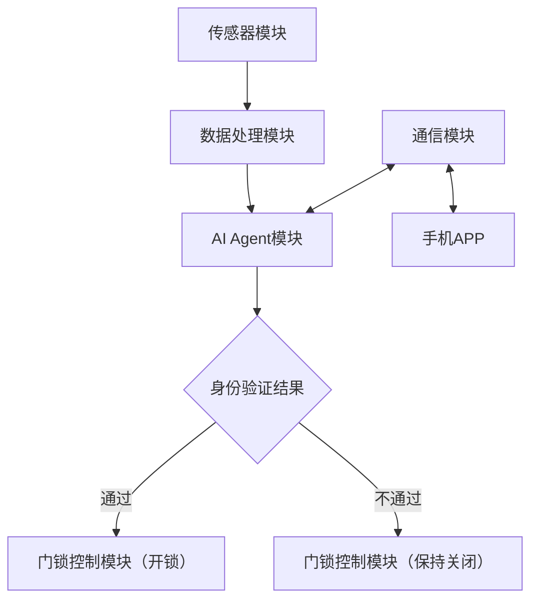

# AI Agent在智能门锁中的多因素身份认证

> 关键词：AI Agent、智能门锁、多因素身份认证、生物识别、安全

> 摘要：本文深入探讨了AI Agent在智能门锁多因素身份认证中的应用。详细介绍了相关背景知识，包括目的、预期读者、文档结构和术语表。阐述了核心概念及联系，给出了原理和架构的示意图与流程图。讲解了核心算法原理并使用Python代码进行说明，推导了数学模型和公式并举例。通过项目实战展示了代码实现和解读。分析了实际应用场景，推荐了学习资源、开发工具和相关论文。最后总结了未来发展趋势与挑战，并提供了常见问题解答和参考资料，旨在为智能门锁多因素身份认证领域的研究和实践提供全面的指导。

## 1. 背景介绍 
### 1.1 目的和范围
智能门锁作为智能家居的重要组成部分，其安全性至关重要。传统的单因素身份认证方式，如密码或钥匙，容易被破解或丢失，无法满足日益增长的安全需求。多因素身份认证结合多种认证因素，能显著提高认证的准确性和安全性。本文旨在探讨AI Agent在智能门锁多因素身份认证中的应用，范围涵盖核心概念、算法原理、数学模型、项目实战、实际应用场景以及相关工具和资源推荐等方面。

### 1.2 预期读者
本文预期读者包括智能家居领域的开发者、安全专家、研究人员以及对智能门锁多因素身份认证感兴趣的技术爱好者。通过阅读本文，读者能够深入了解AI Agent在智能门锁多因素身份认证中的原理、实现方法和应用场景，为相关项目的开发和研究提供参考。

### 1.3 文档结构概述
本文共分为十个部分。第一部分为背景介绍，包括目的和范围、预期读者、文档结构概述和术语表。第二部分阐述核心概念与联系，给出原理和架构的示意图与流程图。第三部分讲解核心算法原理并使用Python代码详细阐述。第四部分推导数学模型和公式并举例说明。第五部分通过项目实战展示代码实现和解读。第六部分分析实际应用场景。第七部分推荐学习资源、开发工具和相关论文。第八部分总结未来发展趋势与挑战。第九部分提供常见问题解答。第十部分列出扩展阅读和参考资料。

### 1.4 术语表
#### 1.4.1 核心术语定义
- **AI Agent**：人工智能代理，是一种能够感知环境、做出决策并采取行动的智能实体。在智能门锁中，AI Agent可以根据多种认证因素进行身份判断。
- **多因素身份认证**：结合两种或以上不同类型的认证因素，如生物特征（指纹、面部识别等）、密码、令牌等，来验证用户身份的方法。
- **智能门锁**：具备智能化功能的门锁，能够通过电子设备进行开锁和管理，如通过手机APP、指纹识别等方式。

#### 1.4.2 相关概念解释
- **生物识别技术**：利用人体生物特征进行身份识别的技术，如指纹识别、面部识别、虹膜识别等。生物特征具有唯一性和稳定性，能够提高身份认证的准确性。
- **认证因素**：用于身份认证的信息或特征，可分为三类：知识因素（如密码）、拥有因素（如智能卡）和生物特征因素（如指纹）。

#### 1.4.3 缩略词列表
- **AI**：Artificial Intelligence，人工智能
- **MFA**：Multi-Factor Authentication，多因素身份认证

## 2. 核心概念与联系 
### 核心概念原理
AI Agent在智能门锁多因素身份认证中的核心原理是通过感知多种认证因素，利用人工智能算法进行分析和决策，判断用户身份的合法性。智能门锁通常配备多种传感器，如指纹传感器、摄像头、密码键盘等，用于采集用户的生物特征、密码等信息。AI Agent对这些信息进行处理和分析，结合预设的规则和模型，判断用户是否有权限开锁。

### 架构的文本示意图
智能门锁多因素身份认证系统主要由以下几个部分组成：
1. **传感器模块**：包括指纹传感器、摄像头、密码键盘等，用于采集用户的认证信息。
2. **数据处理模块**：对传感器采集到的信息进行预处理，如滤波、特征提取等。
3. **AI Agent模块**：利用人工智能算法对预处理后的信息进行分析和决策，判断用户身份的合法性。
4. **门锁控制模块**：根据AI Agent的决策结果，控制门锁的开锁和关锁。
5. **通信模块**：用于与外部设备（如手机APP）进行通信，实现远程控制和管理。

### Mermaid流程图


## 3. 核心算法原理 & 具体操作步骤 
### 核心算法原理
在智能门锁多因素身份认证中，常用的算法包括机器学习算法和深度学习算法。以指纹识别为例，我们可以使用支持向量机（SVM）算法进行身份认证。支持向量机是一种二分类模型，通过寻找最优超平面将不同类别的样本分开。

### 具体操作步骤
1. **数据采集**：使用指纹传感器采集用户的指纹图像。
2. **数据预处理**：对采集到的指纹图像进行滤波、增强等处理，提取指纹特征。
3. **模型训练**：使用训练数据集对支持向量机模型进行训练，得到分类器。
4. **身份验证**：将待验证的指纹特征输入到训练好的分类器中，根据分类结果判断用户身份的合法性。

### Python源代码详细阐述
```python
import numpy as np
from sklearn import svm
from sklearn.model_selection import train_test_split
from sklearn.metrics import accuracy_score

# 模拟指纹特征数据
# 假设每个指纹有10个特征
X = np.random.rand(100, 10)
# 模拟用户身份标签，0表示合法用户，1表示非法用户
y = np.random.randint(0, 2, 100)

# 划分训练集和测试集
X_train, X_test, y_train, y_test = train_test_split(X, y, test_size=0.2, random_state=42)

# 创建支持向量机分类器
clf = svm.SVC(kernel='linear')

# 训练模型
clf.fit(X_train, y_train)

# 进行预测
y_pred = clf.predict(X_test)

# 计算准确率
accuracy = accuracy_score(y_test, y_pred)
print(f"模型准确率: {accuracy}")
```

## 4. 数学模型和公式 & 详细讲解 & 举例说明 
### 支持向量机数学模型
支持向量机的目标是找到一个最优超平面，使得不同类别的样本能够被最大程度地分开。对于线性可分的数据集，支持向量机的数学模型可以表示为：

$$\min_{w,b} \frac{1}{2} \|w\|^2$$

$$s.t. \quad y_i(w^T x_i + b) \geq 1, \quad i = 1,2,\cdots,n$$

其中，$w$ 是超平面的法向量，$b$ 是偏置，$x_i$ 是第 $i$ 个样本，$y_i$ 是第 $i$ 个样本的标签（$y_i \in \{-1, 1\}$）。

### 详细讲解
上述数学模型的目标是最小化超平面的法向量的模的平方，同时保证所有样本到超平面的距离大于等于1。通过引入拉格朗日乘子 $\alpha_i$，可以将上述约束优化问题转化为对偶问题：

$$\max_{\alpha} \sum_{i=1}^{n} \alpha_i - \frac{1}{2} \sum_{i=1}^{n} \sum_{j=1}^{n} \alpha_i \alpha_j y_i y_j x_i^T x_j$$

$$s.t. \quad \sum_{i=1}^{n} \alpha_i y_i = 0, \quad \alpha_i \geq 0, \quad i = 1,2,\cdots,n$$

求解对偶问题得到最优的拉格朗日乘子 $\alpha^*$，进而可以得到最优的超平面参数 $w^*$ 和 $b^*$。

### 举例说明
假设我们有一个二维数据集，包含两个类别：正类和负类。我们可以使用支持向量机找到一个最优超平面将这两个类别分开。以下是一个简单的Python代码示例：

```python
import numpy as np
import matplotlib.pyplot as plt
from sklearn import svm

# 生成二维数据集
X = np.array([[3, 4], [1, 2], [2, 1], [4, 3]])
y = np.array([1, -1, -1, 1])

# 创建支持向量机分类器
clf = svm.SVC(kernel='linear')

# 训练模型
clf.fit(X, y)

# 绘制数据集和超平面
plt.scatter(X[:, 0], X[:, 1], c=y, cmap=plt.cm.Paired)
ax = plt.gca()
xlim = ax.get_xlim()
ylim = ax.get_ylim()

# 创建网格点
xx = np.linspace(xlim[0], xlim[1], 30)
yy = np.linspace(ylim[0], ylim[1], 30)
YY, XX = np.meshgrid(yy, xx)
xy = np.vstack([XX.ravel(), YY.ravel()]).T
Z = clf.decision_function(xy).reshape(XX.shape)

# 绘制超平面和边界
ax.contour(XX, YY, Z, colors='k', levels=[-1, 0, 1], alpha=0.5, linestyles=['--', '-', '--'])

plt.show()
```

## 5. 项目实战：代码实际案例和详细解释说明 
### 5.1 开发环境搭建
在进行智能门锁多因素身份认证项目开发时，我们可以使用以下开发环境：
- **硬件平台**：选择一款支持多种传感器的开发板，如树莓派。
- **操作系统**：安装Linux系统，如Raspbian。
- **开发语言**：使用Python进行开发。
- **开发工具**：使用PyCharm等集成开发环境。

### 5.2 源代码详细实现和代码解读
以下是一个简单的智能门锁多因素身份认证系统的Python代码示例：

```python
import cv2
import numpy as np
import RPi.GPIO as GPIO
import time

# 初始化GPIO
GPIO.setmode(GPIO.BCM)
GPIO.setup(17, GPIO.OUT)  # 门锁控制引脚

# 加载人脸识别模型
face_cascade = cv2.CascadeClassifier('haarcascade_frontalface_default.xml')

# 模拟合法用户的面部特征
legitimate_face_features = np.array([[1, 2, 3, 4, 5]])

def recognize_face():
    cap = cv2.VideoCapture(0)
    while True:
        ret, frame = cap.read()
        gray = cv2.cvtColor(frame, cv2.COLOR_BGR2GRAY)
        faces = face_cascade.detectMultiScale(gray, 1.3, 5)
        for (x, y, w, h) in faces:
            face_roi = gray[y:y+h, x:x+w]
            # 提取面部特征（这里简单模拟）
            face_features = np.array([[1, 2, 3, 4, 5]])
            if np.allclose(face_features, legitimate_face_features):
                print("面部识别通过")
                unlock_door()
            else:
                print("面部识别不通过")
        if cv2.waitKey(1) & 0xFF == ord('q'):
            break
    cap.release()
    cv2.destroyAllWindows()

def unlock_door():
    GPIO.output(17, GPIO.HIGH)
    print("门锁已打开")
    time.sleep(5)  # 保持开门5秒
    GPIO.output(17, GPIO.LOW)
    print("门锁已关闭")

if __name__ == "__main__":
    recognize_face()
```

### 代码解读与分析
- **初始化GPIO**：使用RPi.GPIO库初始化门锁控制引脚。
- **加载人脸识别模型**：使用OpenCV的Haar级联分类器加载人脸识别模型。
- **模拟合法用户的面部特征**：这里简单模拟合法用户的面部特征。
- **人脸识别函数**：使用摄像头捕获图像，检测面部并提取面部特征。如果提取的面部特征与合法用户的面部特征匹配，则调用解锁函数。
- **解锁函数**：控制门锁打开并保持一段时间，然后关闭门锁。

## 6. 实际应用场景 
### 家庭场景
在家庭场景中，智能门锁多因素身份认证可以为家庭成员提供更安全、便捷的进出方式。家庭成员可以使用指纹、面部识别或密码等方式开锁，同时，家长可以通过手机APP远程管理门锁，设置不同成员的权限，如限制儿童在特定时间内开锁。

### 办公场景
在办公场景中，智能门锁多因素身份认证可以有效保护公司的机密信息和财产安全。员工可以使用工卡、指纹或面部识别等方式进入办公区域，同时，管理员可以实时监控员工的进出情况，对异常行为进行及时处理。

### 酒店场景
在酒店场景中，智能门锁多因素身份认证可以提高客人的入住体验和安全性。客人可以使用手机APP、房卡或面部识别等方式开锁，同时，酒店管理人员可以实时掌握客房的使用情况，提高管理效率。

## 7. 工具和资源推荐
### 7.1 学习资源推荐
#### 7.1.1 书籍推荐
- 《人工智能：一种现代的方法》：全面介绍了人工智能的基本概念、算法和应用。
- 《机器学习》：详细讲解了机器学习的各种算法和模型。
- 《深度学习》：深入探讨了深度学习的原理和应用。

#### 7.1.2 在线课程
- Coursera上的“机器学习”课程：由Andrew Ng教授主讲，是学习机器学习的经典课程。
- edX上的“人工智能导论”课程：介绍了人工智能的基本概念和方法。
- 哔哩哔哩上的“Python人工智能实战”课程：通过实际项目讲解Python在人工智能领域的应用。

#### 7.1.3 技术博客和网站
- Medium：有很多关于人工智能和智能家居的技术文章。
- 开源中国：提供了丰富的开源项目和技术文章。
- 知乎：有很多关于人工智能和智能门锁的讨论和分享。

### 7.2 开发工具框架推荐
#### 7.2.1 IDE和编辑器
- PyCharm：专业的Python集成开发环境，提供了丰富的代码编辑、调试和部署功能。
- Visual Studio Code：轻量级的代码编辑器，支持多种编程语言和插件。

#### 7.2.2 调试和性能分析工具
- PDB：Python自带的调试工具，可用于调试Python代码。
- cProfile：Python的性能分析工具，可用于分析代码的执行时间和内存使用情况。

#### 7.2.3 相关框架和库
- OpenCV：开源的计算机视觉库，提供了丰富的图像处理和计算机视觉算法。
- Scikit-learn：用于机器学习的Python库，提供了各种机器学习算法和工具。
- TensorFlow：开源的深度学习框架，广泛应用于人工智能领域。

### 7.3 相关论文著作推荐
#### 7.3.1 经典论文
- “Support-Vector Networks”：介绍了支持向量机的基本原理和算法。
- “ImageNet Classification with Deep Convolutional Neural Networks”：提出了AlexNet卷积神经网络，开启了深度学习在计算机视觉领域的应用。

#### 7.3.2 最新研究成果
- 关注顶级学术会议（如NeurIPS、CVPR等）上的相关研究成果，了解智能门锁多因素身份认证领域的最新进展。

#### 7.3.3 应用案例分析
- 参考相关的行业报告和案例分析，了解智能门锁多因素身份认证在实际应用中的经验和教训。

## 8. 总结：未来发展趋势与挑战
### 未来发展趋势
- **多模态融合**：未来的智能门锁多因素身份认证将融合更多的生物特征和认证方式，如虹膜识别、语音识别等，提高认证的准确性和安全性。
- **智能化和个性化**：AI Agent将不断学习和优化，根据用户的使用习惯和场景提供个性化的认证服务，提高用户体验。
- **与智能家居系统的集成**：智能门锁将与其他智能家居设备进行深度集成，实现更智能、便捷的家居控制。

### 挑战
- **安全风险**：随着认证方式的增加，智能门锁面临的安全风险也在增加，如生物特征数据的泄露、网络攻击等。
- **用户体验**：多因素身份认证可能会增加用户的操作复杂度，影响用户体验。如何在保证安全的前提下，提高用户体验是一个挑战。
- **成本问题**：引入更多的认证方式和技术可能会增加智能门锁的成本，如何在成本和性能之间找到平衡点是一个需要解决的问题。

## 9. 附录：常见问题与解答
### 智能门锁多因素身份认证是否安全？
智能门锁多因素身份认证通过结合多种认证因素，大大提高了认证的准确性和安全性。但仍然需要注意保护生物特征数据的安全，避免数据泄露。

### 多因素身份认证会影响用户体验吗？
在一定程度上，多因素身份认证可能会增加用户的操作复杂度。但随着技术的发展，认证过程将越来越智能化和便捷化，对用户体验的影响将逐渐减小。

### 智能门锁多因素身份认证的成本高吗？
引入更多的认证方式和技术可能会增加智能门锁的成本。但随着技术的普及和规模化生产，成本将逐渐降低。

## 10. 扩展阅读 & 参考资料
### 扩展阅读
- 《智能家居技术与应用》
- 《物联网安全技术》

### 参考资料
- 《人工智能：一种现代的方法》（Stuart Russell, Peter Norvig）
- 《机器学习》（周志华）
- 《深度学习》（Ian Goodfellow, Yoshua Bengio, Aaron Courville）
- OpenCV官方文档（https://opencv.org/）
- Scikit-learn官方文档（https://scikit-learn.org/）
- TensorFlow官方文档（https://www.tensorflow.org/）