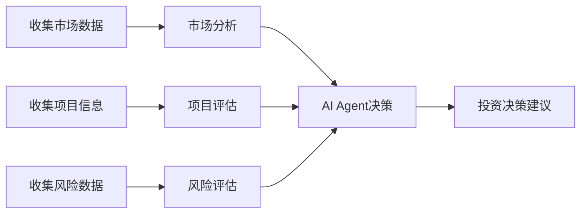

# AI Agent在智能风险投资分析中的应用

> 关键词：AI Agent、智能风险投资分析、投资决策、数据挖掘、机器学习

> 摘要：本文深入探讨了AI Agent在智能风险投资分析中的应用。首先介绍了相关背景，包括目的、预期读者等。接着阐述了AI Agent和智能风险投资分析的核心概念及联系，详细讲解了其核心算法原理和具体操作步骤，并给出了数学模型和公式。通过项目实战展示了代码实际案例及详细解释。分析了AI Agent在风险投资中的实际应用场景，推荐了学习资源、开发工具框架和相关论文著作。最后总结了未来发展趋势与挑战，并对常见问题进行了解答。

## 1. 背景介绍 
### 1.1 目的和范围
随着金融市场的不断发展和复杂化，风险投资面临着越来越多的挑战。传统的风险投资分析方法往往依赖于人工经验和简单的数据分析工具，难以应对海量数据和复杂多变的市场环境。本文章的目的在于探讨如何利用AI Agent技术提升智能风险投资分析的效率和准确性，为风险投资决策提供更科学、更可靠的依据。

本文的范围涵盖了AI Agent的基本概念、核心算法原理、在风险投资分析中的具体应用，以及相关的数学模型和实际案例。同时，还会对未来的发展趋势和面临的挑战进行分析。

### 1.2 预期读者
本文的预期读者包括风险投资行业的从业者，如投资经理、分析师等，他们希望通过引入AI Agent技术改进现有的投资分析方法；计算机科学和人工智能领域的研究人员和开发者，对将AI技术应用于金融领域感兴趣；以及对金融科技和智能投资有学习需求的学生和爱好者。

### 1.3 文档结构概述
本文将按照以下结构进行阐述：首先介绍核心概念与联系，让读者了解AI Agent和智能风险投资分析的基本原理和相互关系；接着详细讲解核心算法原理和具体操作步骤，包括使用Python代码进行实现；然后给出相关的数学模型和公式，并通过举例说明；通过项目实战展示代码实际案例和详细解释；分析AI Agent在实际风险投资中的应用场景；推荐学习资源、开发工具框架和相关论文著作；最后总结未来发展趋势与挑战，解答常见问题，并提供扩展阅读和参考资料。

### 1.4 术语表
#### 1.4.1 核心术语定义
- **AI Agent**：人工智能代理，是一种能够感知环境、做出决策并采取行动以实现特定目标的智能实体。它可以根据预设的规则或通过学习来处理信息和解决问题。
- **智能风险投资分析**：利用人工智能技术对风险投资项目进行全面、深入的分析，包括对市场趋势、项目前景、风险评估等方面的研究，以辅助投资决策。
- **投资决策**：在风险投资过程中，根据各种分析结果和信息，决定是否对某个项目进行投资以及投资的金额和方式。

#### 1.4.2 相关概念解释
- **机器学习**：是人工智能的一个重要分支，它让计算机通过数据学习模式和规律，从而能够进行预测和决策。在风险投资分析中，机器学习可以用于预测项目的成功率、评估风险等。
- **数据挖掘**：从大量的数据中发现有价值的信息和知识的过程。在风险投资领域，数据挖掘可以帮助挖掘潜在的投资机会和风险因素。

#### 1.4.3 缩略词列表
- **AI**：Artificial Intelligence，人工智能
- **ML**：Machine Learning，机器学习
- **VC**：Venture Capital，风险投资

## 2. 核心概念与联系 

### 2.1 AI Agent的基本原理
AI Agent可以被看作是一个具有自主性和智能性的实体，它能够感知周围环境的信息，根据这些信息进行推理和决策，并采取相应的行动。其基本架构通常包括感知模块、决策模块和行动模块。

感知模块负责收集环境中的各种数据，如市场数据、项目信息等。决策模块则对感知到的数据进行分析和处理，利用预设的规则或学习到的模型做出决策。行动模块根据决策结果采取相应的行动，如推荐投资项目、调整投资组合等。

以下是AI Agent基本架构的文本示意图：

```plaintext
+-----------------+
|    感知模块     |
| （收集环境数据） |
+-----------------+
        |
        v
+-----------------+
|    决策模块     |
| （分析数据决策） |
+-----------------+
        |
        v
+-----------------+
|    行动模块     |
| （执行决策行动） |
+-----------------+
```

### 2.2 智能风险投资分析的核心要素
智能风险投资分析主要涉及以下几个核心要素：
- **市场分析**：对目标市场的规模、增长趋势、竞争格局等进行研究，以评估投资项目的市场潜力。
- **项目评估**：对具体的投资项目进行全面评估，包括项目的商业模式、技术实力、团队能力等。
- **风险评估**：识别和评估投资项目可能面临的各种风险，如市场风险、技术风险、管理风险等，并制定相应的风险应对策略。

### 2.3 AI Agent与智能风险投资分析的联系
AI Agent可以在智能风险投资分析的各个环节发挥重要作用。在市场分析方面，AI Agent可以通过感知模块收集大量的市场数据，利用决策模块对这些数据进行分析，识别市场趋势和潜在机会。在项目评估环节，AI Agent可以对项目的各种信息进行评估，给出项目的评分和建议。在风险评估方面，AI Agent可以通过分析历史数据和实时信息，预测项目可能面临的风险，并提供相应的风险预警。

以下是AI Agent在智能风险投资分析中应用的Mermaid流程图：



## 3. 核心算法原理 & 具体操作步骤 

### 3.1 核心算法原理
在智能风险投资分析中，常用的核心算法包括机器学习算法，如决策树、支持向量机、神经网络等。这里以决策树算法为例进行详细讲解。

决策树是一种基于树结构进行决策的算法，它通过对数据的特征进行划分，构建一个树形结构，每个内部节点表示一个特征上的测试，每个分支表示一个测试输出，每个叶节点表示一个类别或值。

决策树的构建过程主要包括以下几个步骤：
1. **特征选择**：选择一个最优的特征作为当前节点的划分特征。常用的特征选择指标有信息增益、信息增益比、基尼指数等。
2. **划分数据集**：根据选择的特征对数据集进行划分，生成子数据集。
3. **递归构建决策树**：对每个子数据集重复步骤1和步骤2，直到满足停止条件，如数据集为空或所有样本属于同一类别。

### 3.2 Python源代码实现

```python
import numpy as np
from sklearn.datasets import load_iris
from sklearn.model_selection import train_test_split
from sklearn.tree import DecisionTreeClassifier
from sklearn.metrics import accuracy_score

# 加载数据集
iris = load_iris()
X = iris.data
y = iris.target

# 划分训练集和测试集
X_train, X_test, y_train, y_test = train_test_split(X, y, test_size=0.3, random_state=42)

# 创建决策树分类器
clf = DecisionTreeClassifier()

# 训练模型
clf.fit(X_train, y_train)

# 预测
y_pred = clf.predict(X_test)

# 计算准确率
accuracy = accuracy_score(y_test, y_pred)
print(f"Accuracy: {accuracy}")
```

### 3.3 具体操作步骤
1. **数据收集**：收集与风险投资相关的数据，如市场数据、项目信息、财务数据等。
2. **数据预处理**：对收集到的数据进行清洗、转换和归一化等处理，以提高数据的质量和可用性。
3. **特征工程**：从预处理后的数据中提取有价值的特征，如市场增长率、项目利润率等。
4. **模型训练**：使用选择的算法对训练数据进行训练，得到预测模型。
5. **模型评估**：使用测试数据对训练好的模型进行评估，计算评估指标，如准确率、召回率等。
6. **模型应用**：将评估合格的模型应用到实际的风险投资分析中，进行投资决策和风险评估。

## 4. 数学模型和公式 & 详细讲解 & 举例说明 

### 4.1 信息增益
信息增益是决策树算法中常用的特征选择指标，它衡量了一个特征对数据集分类的贡献程度。信息增益的计算公式如下：

$$IG(D, A) = H(D) - H(D|A)$$

其中，$IG(D, A)$ 表示特征 $A$ 对数据集 $D$ 的信息增益，$H(D)$ 表示数据集 $D$ 的信息熵，$H(D|A)$ 表示在已知特征 $A$ 的条件下，数据集 $D$ 的条件熵。

信息熵的计算公式为：

$$H(D) = -\sum_{k=1}^{K}p_k\log_2p_k$$

其中，$K$ 表示数据集 $D$ 中类别的数量，$p_k$ 表示第 $k$ 类样本在数据集 $D$ 中所占的比例。

条件熵的计算公式为：

$$H(D|A) = \sum_{i=1}^{n}\frac{|D_i|}{|D|}H(D_i)$$

其中，$n$ 表示特征 $A$ 的取值个数，$D_i$ 表示特征 $A$ 取值为第 $i$ 个值的样本子集，$|D|$ 表示数据集 $D$ 的样本数量，$|D_i|$ 表示子集 $D_i$ 的样本数量。

### 4.2 举例说明
假设有一个数据集 $D$ 包含 10 个样本，分为两类：正类和负类，其中正类样本有 6 个，负类样本有 4 个。现在有一个特征 $A$，它有两个取值：$A_1$ 和 $A_2$。特征 $A$ 取值为 $A_1$ 的样本有 4 个，其中正类样本有 3 个，负类样本有 1 个；特征 $A$ 取值为 $A_2$ 的样本有 6 个，其中正类样本有 3 个，负类样本有 3 个。

首先计算数据集 $D$ 的信息熵：

$$p_1 = \frac{6}{10} = 0.6, p_2 = \frac{4}{10} = 0.4$$

$$H(D) = -0.6\log_20.6 - 0.4\log_20.4 \approx 0.971$$

然后计算特征 $A$ 取值为 $A_1$ 时子集 $D_1$ 的信息熵：

$$p_{11} = \frac{3}{4} = 0.75, p_{12} = \frac{1}{4} = 0.25$$

$$H(D_1) = -0.75\log_20.75 - 0.25\log_20.25 \approx 0.811$$

特征 $A$ 取值为 $A_2$ 时子集 $D_2$ 的信息熵：

$$p_{21} = \frac{3}{6} = 0.5, p_{22} = \frac{3}{6} = 0.5$$

$$H(D_2) = -0.5\log_20.5 - 0.5\log_20.5 = 1$$

接着计算条件熵 $H(D|A)$：

$$H(D|A) = \frac{4}{10}H(D_1) + \frac{6}{10}H(D_2) = \frac{4}{10} \times 0.811 + \frac{6}{10} \times 1 \approx 0.924$$

最后计算信息增益 $IG(D, A)$：

$$IG(D, A) = H(D) - H(D|A) = 0.971 - 0.924 = 0.047$$

## 5. 项目实战：代码实际案例和详细解释说明 

### 5.1 开发环境搭建
为了实现AI Agent在智能风险投资分析中的应用，我们需要搭建以下开发环境：
- **操作系统**：可以选择Windows、Linux或Mac OS。
- **Python环境**：建议使用Python 3.7及以上版本。
- **开发工具**：可以使用PyCharm、Jupyter Notebook等。
- **相关库**：需要安装NumPy、Pandas、Scikit-learn等库。

以下是安装相关库的命令：

```sh
pip install numpy pandas scikit-learn
```

### 5.2 源代码详细实现和代码解读
我们以一个简单的风险投资项目评估为例，使用决策树算法对项目进行分类，判断项目是否值得投资。

```python
import pandas as pd
from sklearn.model_selection import train_test_split
from sklearn.tree import DecisionTreeClassifier
from sklearn.metrics import accuracy_score

# 加载数据集
data = pd.read_csv('investment_data.csv')

# 分离特征和标签
X = data.drop('investment_decision', axis=1)
y = data['investment_decision']

# 划分训练集和测试集
X_train, X_test, y_train, y_test = train_test_split(X, y, test_size=0.2, random_state=42)

# 创建决策树分类器
clf = DecisionTreeClassifier()

# 训练模型
clf.fit(X_train, y_train)

# 预测
y_pred = clf.predict(X_test)

# 计算准确率
accuracy = accuracy_score(y_test, y_pred)
print(f"Accuracy: {accuracy}")
```

### 代码解读
1. **数据加载**：使用Pandas库的`read_csv`函数加载风险投资数据集。
2. **特征和标签分离**：将数据集中的特征和标签分离，`investment_decision` 列作为标签，其余列作为特征。
3. **数据集划分**：使用`train_test_split`函数将数据集划分为训练集和测试集，测试集占比为 20%。
4. **模型创建**：创建一个决策树分类器对象。
5. **模型训练**：使用训练集对决策树分类器进行训练。
6. **预测和评估**：使用测试集进行预测，并计算预测的准确率。

### 5.3 代码解读与分析
通过上述代码，我们可以看到如何使用决策树算法对风险投资项目进行分类。决策树算法的优点是易于理解和解释，能够处理非线性数据。然而，它也存在一些缺点，如容易过拟合。为了避免过拟合，可以使用剪枝技术或集成学习方法，如随机森林。

## 6. 实际应用场景 
### 6.1 项目筛选
AI Agent可以根据预设的规则和模型，对大量的投资项目进行筛选。它可以快速分析项目的各种信息，如市场前景、技术实力、团队背景等，筛选出具有潜力的项目，为投资经理节省大量的时间和精力。

### 6.2 风险评估
AI Agent可以实时监测投资项目的风险状况，通过分析市场数据、行业动态和项目内部信息，识别潜在的风险因素。一旦发现风险，AI Agent可以及时发出预警，并提供相应的风险应对策略。

### 6.3 投资组合优化
AI Agent可以根据投资者的风险偏好和投资目标，优化投资组合。它可以分析不同投资项目之间的相关性，合理分配资金，降低投资风险，提高投资回报率。

### 6.4 市场趋势预测
AI Agent可以收集和分析大量的市场数据，包括宏观经济数据、行业数据和公司财务数据等，预测市场趋势。投资经理可以根据市场趋势预测结果，调整投资策略，把握投资机会。

## 7. 工具和资源推荐
### 7.1 学习资源推荐
#### 7.1.1 书籍推荐
- 《机器学习》（周志华）：这是一本经典的机器学习教材，系统地介绍了机器学习的基本概念、算法和应用。
- 《Python数据分析实战》（Sebastian Raschka）：本书详细介绍了使用Python进行数据分析的方法和技巧，包括数据处理、可视化和机器学习等方面。
- 《人工智能：一种现代的方法》（Stuart Russell、Peter Norvig）：这是一本全面介绍人工智能的书籍，涵盖了人工智能的各个领域，包括搜索算法、知识表示、机器学习等。

#### 7.1.2 在线课程
- Coursera上的“机器学习”课程（Andrew Ng教授）：这是一门非常受欢迎的机器学习课程，由斯坦福大学的Andrew Ng教授授课，内容涵盖了机器学习的基本概念、算法和应用。
- edX上的“人工智能基础”课程：该课程介绍了人工智能的基本概念、技术和应用，适合初学者学习。
- Kaggle上的机器学习和数据科学教程：Kaggle是一个数据科学竞赛平台，上面提供了丰富的机器学习和数据科学教程和案例。

#### 7.1.3 技术博客和网站
- Medium：这是一个技术博客平台，上面有很多关于人工智能、机器学习和金融科技的文章。
- Towards Data Science：专注于数据科学和机器学习领域的技术博客，提供了很多实用的教程和案例。
- 金融科技前沿：关注金融科技领域的最新动态和技术应用，对于了解AI Agent在金融领域的应用有很大帮助。

### 7.2 开发工具框架推荐
#### 7.2.1 IDE和编辑器
- PyCharm：一款功能强大的Python集成开发环境，提供了代码编辑、调试、版本控制等功能。
- Jupyter Notebook：一种交互式的开发环境，适合进行数据探索和模型开发，支持Python、R等多种编程语言。
- Visual Studio Code：一款轻量级的代码编辑器，支持多种编程语言和插件，可用于Python开发。

#### 7.2.2 调试和性能分析工具
- PDB：Python自带的调试工具，可以帮助开发者定位和解决代码中的问题。
- cProfile：Python的性能分析工具，可以分析代码的运行时间和内存使用情况。
- TensorBoard：TensorFlow的可视化工具，可用于可视化训练过程和模型性能。

#### 7.2.3 相关框架和库
- Scikit-learn：一个简单易用的机器学习库，提供了各种机器学习算法和工具，如分类、回归、聚类等。
- TensorFlow：一个开源的深度学习框架，广泛应用于图像识别、自然语言处理等领域。
- PyTorch：另一个流行的深度学习框架，具有动态图的特点，易于使用和调试。

### 7.3 相关论文著作推荐
#### 7.3.1 经典论文
- “A Mathematical Theory of Communication”（Claude E. Shannon）：这篇论文奠定了信息论的基础，对于理解信息熵和信息增益等概念有重要意义。
- “Induction of Decision Trees”（J. Ross Quinlan）：介绍了决策树算法的基本原理和构建方法。
- “Gradient-Based Learning Applied to Document Recognition”（Yann LeCun、Léon Bottou、Yoshua Bengio、Patrick Haffner）：这篇论文提出了卷积神经网络（CNN）的概念，对于图像识别和深度学习的发展起到了重要作用。

#### 7.3.2 最新研究成果
- 关注顶级学术会议，如NeurIPS（神经信息处理系统大会）、ICML（国际机器学习会议）、KDD（知识发现与数据挖掘会议）等，这些会议上会发表很多关于人工智能和机器学习的最新研究成果。
- 查阅相关的学术期刊，如Journal of Artificial Intelligence Research（JAIR）、Artificial Intelligence等。

#### 7.3.3 应用案例分析
- 可以参考一些金融科技公司的研究报告和案例分析，了解AI Agent在实际风险投资中的应用情况和效果。
- 关注一些知名投资机构的研究成果，如红杉资本、IDG资本等，他们可能会分享一些关于智能投资分析的实践经验。

## 8. 总结：未来发展趋势与挑战
### 8.1 未来发展趋势
- **更强大的数据分析能力**：随着数据量的不断增加和计算能力的提升，AI Agent将具备更强大的数据分析能力，能够处理更复杂的数据和问题。
- **与其他技术的融合**：AI Agent将与区块链、物联网等技术融合，创造出更多的应用场景和商业价值。例如，区块链技术可以提供更安全、透明的投资环境，物联网技术可以提供更多的实时数据。
- **个性化投资服务**：AI Agent可以根据投资者的个人偏好和风险承受能力，提供个性化的投资服务。投资者可以根据自己的需求定制投资策略和投资组合。

### 8.2 挑战
- **数据质量和安全问题**：AI Agent的性能依赖于高质量的数据，然而，金融数据往往存在噪声、缺失值等问题，需要进行有效的数据清洗和预处理。同时，金融数据的安全也是一个重要问题，需要采取有效的措施保护数据的隐私和安全。
- **模型可解释性**：一些复杂的机器学习模型，如深度学习模型，往往缺乏可解释性。在风险投资领域，投资决策需要有明确的解释和依据，因此，提高模型的可解释性是一个亟待解决的问题。
- **法律法规和监管问题**：AI Agent在金融领域的应用需要遵守相关的法律法规和监管要求。目前，相关的法律法规和监管政策还不够完善，需要进一步加强研究和制定。

## 9. 附录：常见问题与解答
### 9.1 AI Agent在风险投资分析中的准确性如何保证？
可以通过以下几个方面来保证AI Agent在风险投资分析中的准确性：
- **高质量的数据**：收集和使用准确、完整、及时的数据，对数据进行有效的清洗和预处理。
- **合适的算法和模型**：选择适合风险投资分析的算法和模型，并进行合理的调优。
- **模型评估和验证**：使用交叉验证等方法对模型进行评估和验证，确保模型的泛化能力。
- **实时监测和更新**：实时监测模型的性能，根据市场变化和新的数据及时更新模型。

### 9.2 AI Agent能否完全替代投资经理？
目前，AI Agent还不能完全替代投资经理。虽然AI Agent可以提供大量的数据分析和决策支持，但投资决策不仅仅依赖于数据和模型，还需要考虑人的经验、判断力和直觉等因素。投资经理可以根据AI Agent提供的建议，结合自己的专业知识和经验，做出更合理的投资决策。

### 9.3 如何选择适合的AI Agent开发工具和框架？
选择适合的AI Agent开发工具和框架需要考虑以下几个因素：
- **项目需求**：根据项目的具体需求，选择功能和性能适合的工具和框架。
- **开发经验**：如果开发团队有丰富的某种工具和框架的使用经验，可以优先考虑使用该工具和框架。
- **社区支持**：选择社区活跃、文档丰富的工具和框架，这样可以更容易获取帮助和资源。
- **可扩展性**：考虑工具和框架的可扩展性，以便在项目发展过程中能够方便地进行功能扩展。

## 10. 扩展阅读 & 参考资料
- 《金融科技前沿》杂志
- 相关的金融科技网站和论坛
- 各大高校和研究机构关于人工智能和金融科技的研究报告

以上内容仅供参考，在实际应用中，需要根据具体情况进行调整和优化。希望本文能够为读者提供一些关于AI Agent在智能风险投资分析中应用的有价值的信息和思路。