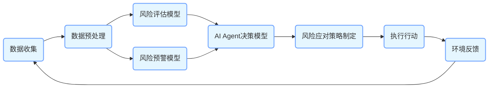

# AI Agent在智能风险管理系统中的应用

> 关键词：AI Agent、智能风险管理系统、风险管理、人工智能、应用场景

> 摘要：本文深入探讨了AI Agent在智能风险管理系统中的应用。首先介绍了研究的背景、目的、预期读者和文档结构，阐述了相关术语。接着详细解释了AI Agent和智能风险管理系统的核心概念及其联系，给出了原理和架构的文本示意图与Mermaid流程图。然后讲解了核心算法原理，并用Python源代码进行详细阐述，同时介绍了相关的数学模型和公式。通过项目实战，展示了AI Agent在智能风险管理系统中的具体代码实现和详细解读。分析了其实际应用场景，推荐了学习资源、开发工具框架和相关论文著作。最后总结了未来发展趋势与挑战，提供了常见问题的解答和扩展阅读参考资料，旨在为读者全面呈现AI Agent在智能风险管理系统中的应用全貌。

## 1. 背景介绍 
### 1.1 目的和范围
随着金融市场的日益复杂和全球经济环境的不断变化，风险管理对于各类企业和金融机构来说变得至关重要。传统的风险管理方法往往依赖于人工经验和简单的统计模型，难以应对日益复杂和多变的风险场景。AI Agent作为人工智能领域的新兴技术，具有自主学习、决策和交互的能力，为智能风险管理系统带来了新的解决方案。

本文的目的是深入探讨AI Agent在智能风险管理系统中的应用，涵盖从核心概念到实际应用的各个方面，包括算法原理、数学模型、项目实战等，旨在为读者提供一个全面而深入的了解。范围主要聚焦于金融领域的风险管理，但相关原理和方法也可应用于其他行业。

### 1.2 预期读者
本文的预期读者包括风险管理领域的专业人士，如金融分析师、风险经理等，他们可以从文中了解如何利用AI Agent提升风险管理的效率和准确性；人工智能领域的研究者和开发者，能够从中获取AI Agent在实际应用中的具体案例和技术细节；以及对智能风险管理系统感兴趣的学生和爱好者，帮助他们建立相关的知识体系。

### 1.3 文档结构概述
本文将按照以下结构进行组织：首先介绍核心概念与联系，明确AI Agent和智能风险管理系统的定义、原理和架构；接着阐述核心算法原理和具体操作步骤，并用Python代码进行详细说明；然后介绍相关的数学模型和公式，并通过举例进行讲解；通过项目实战展示代码的实际应用和详细解释；分析AI Agent在智能风险管理系统中的实际应用场景；推荐学习资源、开发工具框架和相关论文著作；最后总结未来发展趋势与挑战，提供常见问题的解答和扩展阅读参考资料。

### 1.4 术语表
#### 1.4.1 核心术语定义
- **AI Agent**：人工智能代理，是一种能够感知环境、自主学习、做出决策并采取行动的软件实体。它可以根据环境的变化自动调整自己的行为，以实现特定的目标。
- **智能风险管理系统**：利用人工智能技术构建的风险管理系统，能够自动识别、评估和应对各种风险，提高风险管理的效率和准确性。
- **风险评估**：对可能发生的风险事件的可能性和影响程度进行评估的过程。
- **风险预警**：在风险事件发生之前，通过对相关数据的分析和监测，提前发出警示信号的过程。

#### 1.4.2 相关概念解释
- **机器学习**：是AI Agent实现自主学习的重要技术手段，通过对大量数据的学习和分析，建立模型并进行预测和决策。
- **深度学习**：是机器学习的一个分支，通过构建深度神经网络，能够处理复杂的数据和模式，在图像识别、自然语言处理等领域取得了显著的成果。
- **强化学习**：是一种通过智能体与环境进行交互，根据环境反馈的奖励信号来学习最优策略的机器学习方法。

#### 1.4.3 缩略词列表
- **AI**：Artificial Intelligence，人工智能
- **ML**：Machine Learning，机器学习
- **DL**：Deep Learning，深度学习
- **RL**：Reinforcement Learning，强化学习

## 2. 核心概念与联系 
### 核心概念原理
#### AI Agent原理
AI Agent的核心原理是基于感知、决策和行动的循环。它通过传感器感知环境信息，然后利用内部的决策模型对这些信息进行分析和处理，做出相应的决策，并通过执行器采取行动。决策模型可以基于机器学习、深度学习或强化学习等技术，不断学习和优化，以适应不同的环境和任务。

#### 智能风险管理系统原理
智能风险管理系统的原理是通过收集和分析各种风险相关的数据，利用模型和算法对风险进行评估和预警。系统可以实时监测市场数据、企业财务数据等，识别潜在的风险因素，并根据预设的规则和策略采取相应的措施。

### 架构的文本示意图
```plaintext
智能风险管理系统
├── 数据层
│   ├── 市场数据
│   ├── 企业财务数据
│   ├── 宏观经济数据
├── 模型层
│   ├── 风险评估模型
│   ├── 风险预警模型
│   ├── AI Agent决策模型
├── 应用层
│   ├── 风险评估与报告
│   ├── 风险预警与提示
│   ├── 风险应对策略制定
```

### Mermaid流程图


## 3. 核心算法原理 & 具体操作步骤 
### 核心算法原理
在智能风险管理系统中，AI Agent可以使用强化学习算法来进行决策。强化学习的核心思想是智能体通过与环境进行交互，根据环境反馈的奖励信号来学习最优策略。

以一个简单的风险投资决策问题为例，AI Agent的目标是在不同的投资组合中选择最优的组合，以最大化投资回报并最小化风险。环境可以是金融市场，奖励信号可以是投资组合的收益率。

### 具体操作步骤
1. **定义状态空间**：状态空间是智能体感知到的环境信息，例如市场的历史数据、企业的财务指标等。
2. **定义动作空间**：动作空间是智能体可以采取的行动，例如买入、卖出或持有某种资产。
3. **定义奖励函数**：奖励函数是环境对智能体行动的反馈，例如投资组合的收益率。
4. **选择强化学习算法**：常用的强化学习算法包括Q-learning、Deep Q-Network (DQN)等。
5. **训练模型**：通过与环境进行多次交互，不断更新模型的参数，以学习最优策略。
6. **应用模型**：在实际应用中，使用训练好的模型进行决策。

### Python源代码详细阐述
```python
import numpy as np
import random

# 定义状态空间、动作空间和奖励函数
state_space = [0, 1, 2]  # 简单示例，假设三种市场状态
action_space = [0, 1, 2]  # 简单示例，假设三种投资动作

# 初始化Q表
q_table = np.zeros((len(state_space), len(action_space)))

# 定义超参数
learning_rate = 0.1
discount_factor = 0.9
epsilon = 0.1
episodes = 1000

# 定义奖励函数
def get_reward(state, action):
    # 简单示例，根据状态和动作返回奖励
    if state == 0 and action == 0:
        return 1
    elif state == 1 and action == 1:
        return 2
    elif state == 2 and action == 2:
        return 3
    else:
        return -1

# Q-learning算法
for episode in range(episodes):
    state = random.choice(state_space)
    done = False
    while not done:
        if random.uniform(0, 1) < epsilon:
            action = random.choice(action_space)
        else:
            action = np.argmax(q_table[state, :])
        
        reward = get_reward(state, action)
        next_state = random.choice(state_space)  # 简单示例，随机选择下一个状态
        
        # 更新Q表
        q_table[state, action] = (1 - learning_rate) * q_table[state, action] + \
                                 learning_rate * (reward + discount_factor * np.max(q_table[next_state, :]))
        
        state = next_state
        
        # 简单示例，假设达到一定步数结束
        if episode > 100:
            done = True

# 打印最终的Q表
print("Final Q-table:")
print(q_table)
```

## 4. 数学模型和公式 & 详细讲解 & 举例说明 
### Q-learning算法数学模型
Q-learning算法的核心是Q表的更新公式：

$$Q(s, a) = (1 - \alpha)Q(s, a) + \alpha\left[r + \gamma\max_{a'}Q(s', a')\right]$$

其中：
- $Q(s, a)$ 表示在状态 $s$ 下采取动作 $a$ 的Q值。
- $\alpha$ 是学习率，控制新信息对旧信息的更新程度。
- $r$ 是环境反馈的奖励。
- $\gamma$ 是折扣因子，用于平衡当前奖励和未来奖励的重要性。
- $s'$ 是下一个状态。
- $\max_{a'}Q(s', a')$ 表示在下一个状态 $s'$ 下所有可能动作中最大的Q值。

### 详细讲解
Q-learning算法通过不断与环境进行交互，根据环境反馈的奖励来更新Q表。学习率 $\alpha$ 决定了新的经验对旧的Q值的影响程度。折扣因子 $\gamma$ 表示智能体对未来奖励的重视程度，$\gamma$ 越接近1，智能体越关注未来的奖励；$\gamma$ 越接近0，智能体越关注当前的奖励。

### 举例说明
假设当前状态 $s = 0$，采取动作 $a = 1$，得到奖励 $r = -1$，下一个状态 $s' = 2$。当前Q表中 $Q(0, 1) = 0$，$Q(2, 0) = 0.5$，$Q(2, 1) = 0.3$，$Q(2, 2) = 0.7$。学习率 $\alpha = 0.1$，折扣因子 $\gamma = 0.9$。

根据Q-learning更新公式：

$$
\begin{align*}
Q(0, 1) &= (1 - 0.1) \times 0 + 0.1 \times (-1 + 0.9 \times 0.7)\\
&= 0 + 0.1 \times (-1 + 0.63)\\
&= 0.1 \times (-0.37)\\
&= -0.037
\end{align*}
$$

更新后，$Q(0, 1)$ 的值变为 -0.037。

## 5. 项目实战：代码实际案例和详细解释说明 
### 5.1 开发环境搭建
- **操作系统**：可以选择Windows、Linux或macOS。
- **Python版本**：建议使用Python 3.7及以上版本。
- **开发工具**：可以使用Jupyter Notebook、PyCharm等。
- **相关库**：需要安装NumPy、Pandas、Matplotlib等常用库，以及强化学习相关的库，如OpenAI Gym。

```bash
# 安装所需库
pip install numpy pandas matplotlib gym
```

### 5.2 源代码详细实现和代码解读
```python
import gym
import numpy as np

# 创建环境
env = gym.make('CartPole-v1')

# 定义Q表
state_space_size = env.observation_space.shape[0]
action_space_size = env.action_space.n
q_table = np.zeros((state_space_size, action_space_size))

# 定义超参数
learning_rate = 0.1
discount_factor = 0.99
epsilon = 1.0
max_epsilon = 1.0
min_epsilon = 0.01
epsilon_decay_rate = 0.01
episodes = 5000
max_steps_per_episode = 200

# 训练模型
for episode in range(episodes):
    state = env.reset()
    done = False
    total_reward = 0
    
    for step in range(max_steps_per_episode):
        # 探索与利用
        if random.uniform(0, 1) > epsilon:
            action = np.argmax(q_table[state, :])
        else:
            action = env.action_space.sample()
        
        new_state, reward, done, info = env.step(action)
        
        # 更新Q表
        q_table[state, action] = (1 - learning_rate) * q_table[state, action] + \
                                 learning_rate * (reward + discount_factor * np.max(q_table[new_state, :]))
        
        state = new_state
        total_reward += reward
        
        if done:
            break
    
    # 降低探索率
    epsilon = min_epsilon + (max_epsilon - min_epsilon) * np.exp(-epsilon_decay_rate * episode)
    
    if episode % 100 == 0:
        print(f"Episode: {episode}, Total Reward: {total_reward}")

# 测试模型
state = env.reset()
done = False
total_reward = 0

while not done:
    action = np.argmax(q_table[state, :])
    new_state, reward, done, info = env.step(action)
    state = new_state
    total_reward += reward

print(f"Test Total Reward: {total_reward}")

env.close()
```

### 代码解读与分析
- **环境创建**：使用 `gym.make('CartPole-v1')` 创建一个CartPole环境，这是一个经典的强化学习环境，智能体需要控制一个杆子保持平衡。
- **Q表初始化**：根据环境的状态空间和动作空间大小初始化Q表。
- **超参数设置**：设置学习率、折扣因子、探索率等超参数。
- **训练过程**：在每个episode中，智能体与环境进行交互，根据探索与利用策略选择动作，更新Q表，并降低探索率。
- **测试过程**：使用训练好的Q表进行测试，观察智能体的表现。

## 6. 实际应用场景 
### 金融市场风险管理
在金融市场中，AI Agent可以用于风险评估、风险预警和投资决策。通过实时监测市场数据，AI Agent可以识别潜在的风险因素，如市场波动、信用风险等，并及时发出预警。在投资决策方面，AI Agent可以根据市场情况和投资者的风险偏好，选择最优的投资组合。

### 企业风险管理
企业面临着各种风险，如市场风险、信用风险、操作风险等。AI Agent可以帮助企业识别和评估这些风险，制定相应的风险应对策略。例如，在供应链管理中，AI Agent可以监测供应商的信用状况和交货时间，提前预警潜在的供应中断风险。

### 保险行业风险管理
在保险行业中，AI Agent可以用于风险评估和定价。通过分析投保人的个人信息、历史理赔数据等，AI Agent可以评估投保人的风险水平，为保险产品定价提供参考。同时，AI Agent还可以监测保险标的的风险状况，及时发现潜在的风险事件。

## 7. 工具和资源推荐
### 7.1 学习资源推荐
#### 7.1.1 书籍推荐
- 《人工智能：一种现代的方法》：全面介绍了人工智能的基本概念、算法和应用，是人工智能领域的经典教材。
- 《强化学习：原理与Python实现》：详细介绍了强化学习的原理和算法，并通过Python代码进行实现，适合初学者学习。
- 《Python机器学习》：介绍了Python在机器学习中的应用，包括数据预处理、模型选择、深度学习等内容。

#### 7.1.2 在线课程
- Coursera上的“人工智能基础”课程：由知名教授授课，系统介绍了人工智能的基本概念和算法。
- edX上的“强化学习”课程：深入讲解了强化学习的原理和应用，提供了丰富的实践案例。
- 吴恩达的“机器学习”课程：经典的机器学习课程，适合初学者入门。

#### 7.1.3 技术博客和网站
- Medium：有很多人工智能和机器学习领域的优秀博客文章，涵盖了最新的研究成果和实践经验。
- Towards Data Science：专注于数据科学和机器学习领域，提供了大量的技术文章和案例分析。
- AI Stack Exchange：一个人工智能领域的问答社区，可以在这里提问和交流。

### 7.2 开发工具框架推荐
#### 7.2.1 IDE和编辑器
- PyCharm：一款专业的Python集成开发环境，提供了丰富的功能和插件，适合大型项目开发。
- Jupyter Notebook：一个交互式的开发环境，适合数据分析和机器学习实验。
- Visual Studio Code：一款轻量级的代码编辑器，支持多种编程语言，具有丰富的插件生态系统。

#### 7.2.2 调试和性能分析工具
- PySnooper：一个简单易用的Python调试工具，可以实时输出函数的执行过程和变量的值。
- cProfile：Python内置的性能分析工具，可以分析代码的执行时间和函数调用次数。
- TensorBoard：TensorFlow提供的可视化工具，可以用于可视化训练过程和模型性能。

#### 7.2.3 相关框架和库
- TensorFlow：一个开源的深度学习框架，提供了丰富的深度学习模型和工具。
- PyTorch：另一个流行的深度学习框架，具有动态图和易于使用的特点。
- Stable Baselines3：一个基于OpenAI Gym的强化学习库，提供了多种强化学习算法的实现。

### 7.3 相关论文著作推荐
#### 7.3.1 经典论文
- “Q-learning”：由Watkins和Dayan在1992年发表的论文，首次提出了Q-learning算法。
- “Playing Atari with Deep Reinforcement Learning”：由DeepMind团队在2013年发表的论文，介绍了使用深度强化学习玩Atari游戏的方法。
- “Human-level control through deep reinforcement learning”：同样由DeepMind团队在2015年发表的论文，展示了深度强化学习在Atari游戏中的卓越表现。

#### 7.3.2 最新研究成果
- 可以关注NeurIPS、ICML、AAAI等人工智能领域的顶级会议，了解最新的研究成果和技术趋势。
- arXiv是一个预印本平台，很多研究人员会在上面发布最新的研究论文。

#### 7.3.3 应用案例分析
- 可以参考金融机构和企业的官方报告和研究成果，了解AI Agent在实际风险管理中的应用案例。
- 一些知名的咨询公司和研究机构也会发布相关的研究报告和案例分析。

## 8. 总结：未来发展趋势与挑战
### 未来发展趋势
- **多模态数据融合**：未来的智能风险管理系统将融合更多类型的数据，如文本、图像、音频等，以更全面地评估风险。
- **强化学习与深度学习的结合**：强化学习和深度学习的结合将进一步提升AI Agent的决策能力和适应性。
- **智能化的风险应对策略**：AI Agent将能够自动生成更加智能化的风险应对策略，提高风险管理的效率和效果。
- **与区块链技术的结合**：区块链技术的去中心化、不可篡改等特点可以为风险管理提供更可靠的数据支持，与AI Agent的结合将为风险管理带来新的突破。

### 挑战
- **数据质量和隐私问题**：智能风险管理系统依赖于大量的数据，数据的质量和隐私保护是一个重要的挑战。
- **算法可解释性**：AI Agent的决策过程往往是黑盒的，如何提高算法的可解释性，让决策者理解和信任AI Agent的决策是一个亟待解决的问题。
- **技术复杂度和成本**：开发和部署智能风险管理系统需要较高的技术水平和成本，如何降低技术门槛和成本是推广应用的关键。
- **法规和监管**：随着人工智能技术在风险管理领域的应用越来越广泛，相关的法规和监管也需要不断完善，以确保技术的合理应用和风险的有效控制。

## 9. 附录：常见问题与解答
### 问题1：AI Agent在智能风险管理系统中的决策是否可靠？
解答：AI Agent的决策可靠性取决于多个因素，如数据质量、算法模型、训练程度等。在实际应用中，需要对数据进行严格的预处理和清洗，选择合适的算法模型，并进行充分的训练和验证。同时，还可以结合人工专家的经验和判断，提高决策的可靠性。

### 问题2：如何选择适合的强化学习算法？
解答：选择适合的强化学习算法需要考虑问题的特点和需求。如果问题的状态空间和动作空间较小，可以选择传统的Q-learning算法；如果问题比较复杂，可以选择深度强化学习算法，如DQN、A2C等。此外，还需要考虑算法的收敛速度、稳定性等因素。

### 问题3：AI Agent在智能风险管理系统中的应用是否会取代人工？
解答：AI Agent在智能风险管理系统中的应用可以提高风险管理的效率和准确性，但不会完全取代人工。人工在风险管理中仍然具有重要的作用，如对风险的主观判断、对复杂情况的处理等。AI Agent和人工应该相互协作，共同提高风险管理的水平。

### 问题4：如何评估AI Agent在智能风险管理系统中的性能？
解答：可以使用多种指标来评估AI Agent在智能风险管理系统中的性能，如准确率、召回率、F1值、平均回报等。同时，还可以通过实际应用中的风险控制效果、决策的合理性等方面进行综合评估。

## 10. 扩展阅读 & 参考资料
### 扩展阅读
- 《人工智能时代的风险管理》：探讨了人工智能技术在风险管理领域的应用和挑战。
- 《金融科技与风险管理》：介绍了金融科技的发展对风险管理的影响和创新应用。
- 《数据驱动的风险管理》：强调了数据在风险管理中的重要性和应用方法。

### 参考资料
- [OpenAI Gym官方文档](https://gym.openai.com/docs/)
- [TensorFlow官方文档](https://www.tensorflow.org/api_docs)
- [PyTorch官方文档](https://pytorch.org/docs/stable/index.html)
- [Stable Baselines3官方文档](https://stable-baselines3.readthedocs.io/en/master/)