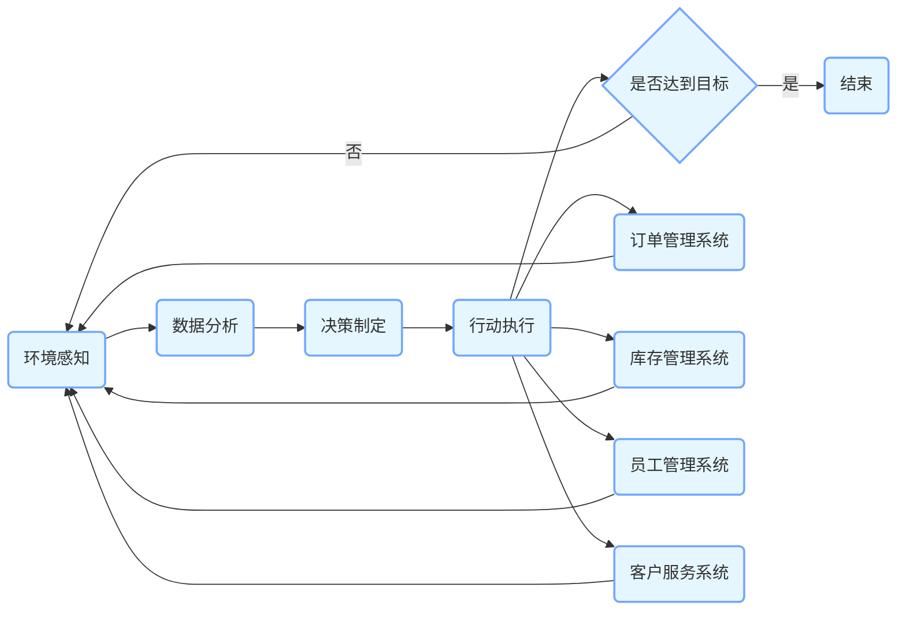

# AI Agent在智能餐饮管理中的实践

> 关键词：AI Agent、智能餐饮管理、实践应用、自动化决策、数据分析

> 摘要：本文深入探讨了AI Agent在智能餐饮管理中的实践应用。首先介绍了相关背景，包括目的、预期读者等内容。接着阐述了AI Agent及智能餐饮管理的核心概念与联系，分析了核心算法原理并给出具体操作步骤。通过数学模型和公式进一步剖析其内在逻辑，并结合实际案例进行详细说明。在项目实战部分，从开发环境搭建到源代码实现及解读都进行了全面阐述。同时，探讨了AI Agent在智能餐饮管理中的实际应用场景，推荐了相关的工具和资源。最后总结了未来发展趋势与挑战，提供了常见问题解答及扩展阅读和参考资料，旨在为餐饮行业引入AI Agent提供全面且深入的技术指导。

## 1. 背景介绍 
### 1.1 目的和范围
本文章的主要目的是详细探讨AI Agent在智能餐饮管理中的实际应用。随着人工智能技术的飞速发展，餐饮行业也在积极寻求智能化转型，AI Agent作为一种具有自主决策和执行能力的智能体，为餐饮管理带来了新的机遇和解决方案。本文将涵盖AI Agent在餐饮管理各个环节的应用，包括订单管理、库存管理、员工调度、客户服务等方面，旨在为餐饮企业和相关技术人员提供全面的技术指导和实践参考。

### 1.2 预期读者
本文的预期读者主要包括餐饮企业的管理者、技术负责人、软件开发人员以及对人工智能在餐饮行业应用感兴趣的研究人员。餐饮企业管理者可以通过本文了解如何利用AI Agent提升餐饮管理的效率和质量；技术负责人可以获取关于AI Agent技术实现的详细信息；软件开发人员能够学习到相关的算法原理和代码实现；研究人员则可以在本文的基础上进行更深入的学术研究。

### 1.3 文档结构概述
本文将按照以下结构进行阐述：首先介绍核心概念与联系，明确AI Agent和智能餐饮管理的定义和相互关系；接着讲解核心算法原理和具体操作步骤，通过Python代码进行详细说明；然后给出数学模型和公式，并举例说明其应用；在项目实战部分，详细介绍开发环境搭建、源代码实现和代码解读；之后探讨实际应用场景；再推荐相关的工具和资源；最后总结未来发展趋势与挑战，提供常见问题解答和扩展阅读及参考资料。

### 1.4 术语表
#### 1.4.1 核心术语定义
- **AI Agent**：即人工智能智能体，是一种能够感知环境、进行决策并采取行动以实现特定目标的软件实体。它可以根据环境的变化自主调整策略，具有一定的自主性和适应性。
- **智能餐饮管理**：利用先进的信息技术和智能化手段，对餐饮企业的各个环节进行自动化、智能化管理，包括订单处理、库存管理、员工调度、客户服务等，以提高管理效率和服务质量。
- **自动化决策**：AI Agent根据预设的规则和算法，对收集到的数据进行分析和处理，自动做出决策的过程，无需人工干预。
- **数据分析**：对餐饮企业运营过程中产生的数据进行收集、整理、分析和挖掘，以发现潜在的规律和趋势，为决策提供支持。

#### 1.4.2 相关概念解释
- **强化学习**：一种机器学习方法，智能体通过与环境进行交互，根据环境反馈的奖励信号来学习最优的行为策略。在餐饮管理中，AI Agent可以通过强化学习来优化订单分配、库存管理等决策。
- **自然语言处理**：研究如何让计算机理解和处理人类语言的技术。在餐饮管理中，可用于实现智能客服、语音点餐等功能。
- **计算机视觉**：让计算机能够像人类一样“看”，识别图像和视频中的内容。在餐饮管理中，可用于监控厨房卫生、顾客行为分析等。

#### 1.4.3 缩略词列表
- **AI**：Artificial Intelligence，人工智能
- **ML**：Machine Learning，机器学习
- **RL**：Reinforcement Learning，强化学习
- **NLP**：Natural Language Processing，自然语言处理
- **CV**：Computer Vision，计算机视觉

## 2. 核心概念与联系 

### 核心概念原理
#### AI Agent原理
AI Agent的核心原理基于感知、决策和行动三个主要步骤。它通过传感器或数据接口感知环境信息，例如在餐饮管理中，可能会感知订单数量、库存水平、员工状态等信息。然后，AI Agent利用内置的算法和模型对这些信息进行分析和处理，做出决策，如决定是否需要补货、如何分配订单等。最后，AI Agent将决策转化为具体的行动，执行相应的操作。

#### 智能餐饮管理原理
智能餐饮管理的原理是将信息技术与餐饮业务流程相结合，通过自动化和智能化手段提高管理效率和服务质量。它利用数据采集设备收集餐饮运营过程中的各种数据，如顾客订单、菜品销售情况、库存消耗等，然后对这些数据进行分析和处理，为管理者提供决策支持。同时，通过自动化系统实现订单处理、库存管理、员工调度等业务流程的自动化操作。

### 架构的文本示意图
AI Agent在智能餐饮管理中的架构可以描述如下：

AI Agent作为核心模块，与多个子系统进行交互。首先，它与订单管理系统相连，获取订单信息，包括订单数量、菜品详情、顾客信息等。根据这些信息，AI Agent可以进行订单分配和调度，确保订单能够及时准确地处理。

其次，AI Agent与库存管理系统交互，实时了解库存水平。当库存低于设定的阈值时，AI Agent可以自动生成补货订单，实现库存的动态管理。

此外，AI Agent还与员工管理系统相连，了解员工的工作状态和技能信息。根据订单需求和员工状态，AI Agent可以合理分配员工任务，提高员工工作效率。

最后，AI Agent与客户服务系统交互，通过自然语言处理技术实现智能客服功能，为顾客提供及时的服务和解答。

### Mermaid流程图


## 3. 核心算法原理 & 具体操作步骤 

### 核心算法原理
在智能餐饮管理中，AI Agent常用的算法包括强化学习算法和规则引擎算法。

#### 强化学习算法
强化学习是一种通过智能体与环境进行交互来学习最优策略的算法。在餐饮管理中，AI Agent可以将订单分配、库存管理等问题看作是一个马尔可夫决策过程（MDP）。

马尔可夫决策过程由四个元素组成：状态空间 $S$、动作空间 $A$、转移概率 $P$ 和奖励函数 $R$。状态空间 $S$ 表示餐饮管理系统的所有可能状态，例如订单数量、库存水平、员工状态等；动作空间 $A$ 表示AI Agent可以采取的所有动作，如分配订单、补货等；转移概率 $P$ 描述了在某个状态下采取某个动作后，系统转移到下一个状态的概率；奖励函数 $R$ 用于评估AI Agent采取某个动作后的奖励值，例如订单处理的及时性、库存成本的降低等。

AI Agent通过不断与环境进行交互，根据当前状态选择一个动作，执行该动作后观察环境的反馈（即下一个状态和奖励值），然后更新自己的策略，以最大化长期累积奖励。

#### 规则引擎算法
规则引擎算法是基于预设的规则进行决策的算法。在餐饮管理中，可以定义一系列的规则，例如当库存水平低于某个阈值时，自动生成补货订单；当订单数量超过一定数量时，增加员工调度等。规则引擎算法的优点是简单易懂、易于实现，适用于一些确定性较强的决策问题。

### 具体操作步骤

#### 数据收集
首先，需要收集餐饮管理系统中的各种数据，包括订单信息、库存信息、员工信息、顾客评价等。这些数据可以通过数据库、传感器、API接口等方式获取。

#### 数据预处理
对收集到的数据进行预处理，包括数据清洗、数据转换、数据归一化等操作。数据清洗可以去除噪声数据和异常值；数据转换可以将数据转换为适合算法处理的格式；数据归一化可以将不同范围的数据映射到相同的范围内，提高算法的稳定性和准确性。

#### 算法选择和模型训练
根据具体的问题选择合适的算法，如强化学习算法或规则引擎算法。如果选择强化学习算法，需要定义状态空间、动作空间、转移概率和奖励函数，并使用收集到的数据进行模型训练。训练过程中，AI Agent不断与环境进行交互，调整自己的策略，直到达到最优策略。

#### 决策执行
训练好的AI Agent可以根据当前的环境状态做出决策，并将决策转化为具体的行动。例如，在订单管理中，AI Agent可以根据订单数量和员工状态分配订单；在库存管理中，AI Agent可以根据库存水平生成补货订单。

#### 性能评估和优化
定期对AI Agent的性能进行评估，评估指标可以包括订单处理的及时性、库存成本的降低、顾客满意度等。根据评估结果，对AI Agent的算法和模型进行优化，以提高其性能和效率。

### Python源代码示例
以下是一个简单的基于规则引擎算法的库存管理AI Agent的Python代码示例：

```python
# 定义库存阈值
INVENTORY_THRESHOLD = 10

# 定义库存管理AI Agent类
class InventoryManagementAgent:
    def __init__(self, inventory_level):
        self.inventory_level = inventory_level

    def make_decision(self):
        if self.inventory_level < INVENTORY_THRESHOLD:
            return "生成补货订单"
        else:
            return "无需补货"

# 模拟库存水平
inventory_level = 8
agent = InventoryManagementAgent(inventory_level)
decision = agent.make_decision()
print(f"当前库存水平: {inventory_level}")
print(f"决策结果: {decision}")
```

在这个示例中，定义了一个库存管理AI Agent类，该类包含一个`make_decision`方法，根据当前的库存水平和预设的库存阈值做出决策。如果库存水平低于阈值，则生成补货订单；否则，无需补货。

## 4. 数学模型和公式 & 详细讲解 & 举例说明 

### 马尔可夫决策过程（MDP）模型
马尔可夫决策过程（MDP）是强化学习中常用的数学模型，用于描述智能体与环境之间的交互过程。

#### 数学公式
- 状态空间 $S$：表示系统的所有可能状态，用 $s \in S$ 表示一个具体的状态。
- 动作空间 $A$：表示智能体可以采取的所有动作，用 $a \in A$ 表示一个具体的动作。
- 转移概率 $P$：$P(s'|s, a)$ 表示在状态 $s$ 下采取动作 $a$ 后，系统转移到状态 $s'$ 的概率。
- 奖励函数 $R$：$R(s, a, s')$ 表示在状态 $s$ 下采取动作 $a$ 后，系统转移到状态 $s'$ 所获得的奖励值。
- 策略 $\pi$：$\pi(a|s)$ 表示在状态 $s$ 下采取动作 $a$ 的概率。

智能体的目标是找到一个最优策略 $\pi^*$，使得长期累积奖励最大化。长期累积奖励可以用折扣累积奖励来表示：

$$G_t = \sum_{k=0}^{\infty} \gamma^k R_{t+k+1}$$

其中，$G_t$ 表示从时间步 $t$ 开始的折扣累积奖励，$\gamma \in [0, 1]$ 是折扣因子，用于平衡即时奖励和未来奖励。

#### 详细讲解
在餐饮管理中，状态空间 $S$ 可以包括订单数量、库存水平、员工状态等信息；动作空间 $A$ 可以包括分配订单、补货、调整员工调度等动作；转移概率 $P$ 描述了在某个状态下采取某个动作后，系统转移到下一个状态的概率，例如在库存充足的情况下补货，库存水平会增加；奖励函数 $R$ 可以根据订单处理的及时性、库存成本的降低等因素来定义，例如及时处理订单可以获得正奖励，库存积压会获得负奖励。

智能体通过不断与环境进行交互，根据当前状态 $s$ 选择一个动作 $a$，执行该动作后观察环境的反馈（即下一个状态 $s'$ 和奖励值 $R(s, a, s')$），然后根据策略 $\pi$ 调整自己的行为，以最大化长期累积奖励 $G_t$。

#### 举例说明
假设一个简单的餐饮库存管理问题，状态空间 $S$ 包括库存水平 $s \in \{0, 1, 2, \cdots, 20\}$，动作空间 $A$ 包括补货 $a_1$ 和不补货 $a_2$。转移概率 $P$ 可以定义为：如果采取补货动作 $a_1$，库存水平会增加一定数量；如果采取不补货动作 $a_2$，库存水平会随着订单的消耗而减少。奖励函数 $R$ 可以定义为：当库存水平过低时，会获得负奖励；当库存水平过高时，也会获得负奖励，因为会增加库存成本。

智能体的目标是找到一个最优策略 $\pi^*$，使得在长期运营中，既能保证有足够的库存满足订单需求，又能避免库存积压。

### Q - 学习算法
Q - 学习算法是一种基于价值的强化学习算法，用于求解马尔可夫决策过程的最优策略。

#### 数学公式
Q - 学习算法通过更新 Q 值来学习最优策略。Q 值 $Q(s, a)$ 表示在状态 $s$ 下采取动作 $a$ 的预期累积奖励。

Q - 学习算法的更新公式为：

$$Q(s_t, a_t) \leftarrow Q(s_t, a_t) + \alpha [R(s_t, a_t, s_{t+1}) + \gamma \max_{a} Q(s_{t+1}, a) - Q(s_t, a_t)]$$

其中，$\alpha \in [0, 1]$ 是学习率，用于控制每次更新的步长；$\gamma \in [0, 1]$ 是折扣因子，用于平衡即时奖励和未来奖励。

#### 详细讲解
Q - 学习算法的基本思想是通过不断与环境进行交互，根据当前状态 $s_t$ 选择一个动作 $a_t$，执行该动作后观察环境的反馈（即下一个状态 $s_{t+1}$ 和奖励值 $R(s_t, a_t, s_{t+1})$），然后根据更新公式更新 Q 值。在选择动作时，可以采用贪心策略，即选择 Q 值最大的动作：

$$a_t = \arg \max_{a} Q(s_t, a)$$

通过不断更新 Q 值，智能体可以逐渐学习到最优策略。

#### 举例说明
在餐饮订单分配问题中，状态空间 $S$ 可以包括订单数量、员工状态等信息；动作空间 $A$ 可以包括将订单分配给不同的员工。Q 值 $Q(s, a)$ 表示在状态 $s$ 下将订单分配给员工 $a$ 的预期累积奖励，奖励可以根据订单处理的及时性、员工的满意度等因素来定义。

智能体通过不断与环境进行交互，根据当前状态选择一个动作，执行该动作后更新 Q 值。经过多次迭代，智能体可以学习到最优的订单分配策略。

## 5. 项目实战：代码实际案例和详细解释说明 

### 5.1  开发环境搭建
#### 操作系统
建议使用Linux系统，如Ubuntu 18.04或更高版本，因为Linux系统具有良好的稳定性和兼容性，并且支持多种开发工具和编程语言。

#### 编程语言
使用Python作为主要的编程语言，因为Python具有丰富的机器学习和数据分析库，如TensorFlow、PyTorch、Scikit - learn等，非常适合开发AI Agent。

#### 开发工具
- **Anaconda**：用于管理Python环境和安装各种Python库。可以从Anaconda官方网站下载并安装适合自己操作系统的版本。
- **PyCharm**：一款功能强大的Python集成开发环境（IDE），可以提高开发效率。可以从JetBrains官方网站下载并安装。

#### 数据库
使用MySQL数据库来存储餐饮管理系统中的各种数据，如订单信息、库存信息、员工信息等。可以从MySQL官方网站下载并安装适合自己操作系统的版本。

### 5.2  源代码详细实现和代码解读

#### 订单分配AI Agent的实现
以下是一个基于Q - 学习算法的订单分配AI Agent的Python代码示例：

```python
import numpy as np

# 定义状态空间和动作空间
STATE_SPACE = 10  # 假设订单数量有10种不同的状态
ACTION_SPACE = 5  # 假设有5个员工可供分配订单

# 初始化Q表
Q_TABLE = np.zeros((STATE_SPACE, ACTION_SPACE))

# 定义超参数
ALPHA = 0.1  # 学习率
GAMMA = 0.9  # 折扣因子
EPSILON = 0.1  # 探索率

# 定义奖励函数
def get_reward(state, action):
    # 简单示例：根据订单数量和员工分配情况计算奖励
    if state > 5 and action == 0:
        return -1  # 如果订单数量多，分配给第一个员工会导致处理不及时，给予负奖励
    else:
        return 1  # 其他情况给予正奖励

# 定义Q - 学习算法
def q_learning(state, action, next_state):
    reward = get_reward(state, action)
    Q_TABLE[state, action] = Q_TABLE[state, action] + ALPHA * (
        reward + GAMMA * np.max(Q_TABLE[next_state, :]) - Q_TABLE[state, action]
    )

# 定义动作选择策略
def choose_action(state):
    if np.random.uniform(0, 1) < EPSILON:
        action = np.random.choice(ACTION_SPACE)  # 探索：随机选择一个动作
    else:
        action = np.argmax(Q_TABLE[state, :])  # 利用：选择Q值最大的动作
    return action

# 模拟训练过程
EPISODES = 1000
for episode in range(EPISODES):
    state = np.random.randint(0, STATE_SPACE)  # 随机初始化状态
    done = False
    while not done:
        action = choose_action(state)
        next_state = np.random.randint(0, STATE_SPACE)  # 模拟下一个状态
        q_learning(state, action, next_state)
        state = next_state
        # 可以根据具体情况定义结束条件
        if np.random.uniform(0, 1) < 0.1:
            done = True

# 输出训练后的Q表
print("训练后的Q表：")
print(Q_TABLE)
```

#### 代码解读
- **状态空间和动作空间**：`STATE_SPACE` 表示订单数量的不同状态，`ACTION_SPACE` 表示可供分配订单的员工数量。
- **Q表初始化**：`Q_TABLE` 是一个二维数组，用于存储每个状态和动作对应的Q值。
- **超参数**：`ALPHA` 是学习率，控制每次更新Q值的步长；`GAMMA` 是折扣因子，平衡即时奖励和未来奖励；`EPSILON` 是探索率，用于控制探索和利用的比例。
- **奖励函数**：`get_reward` 函数根据当前状态和动作计算奖励值，这里只是一个简单的示例，可以根据实际情况进行修改。
- **Q - 学习算法**：`q_learning` 函数根据Q - 学习算法的更新公式更新Q值。
- **动作选择策略**：`choose_action` 函数根据探索率 `EPSILON` 选择动作，如果随机数小于 `EPSILON`，则随机选择一个动作进行探索；否则，选择Q值最大的动作进行利用。
- **训练过程**：通过多次迭代，智能体不断与环境进行交互，更新Q值，直到达到最大迭代次数。

### 5.3  代码解读与分析
#### 优点
- **灵活性**：Q - 学习算法具有很强的灵活性，可以适应不同的状态空间和动作空间，并且可以根据实际情况调整奖励函数，以实现不同的目标。
- **自适应性**：智能体通过不断与环境进行交互，能够自动调整自己的策略，以适应环境的变化。
- **可扩展性**：代码结构清晰，易于扩展，可以在现有代码的基础上添加更多的功能和优化算法。

#### 缺点
- **收敛速度慢**：Q - 学习算法的收敛速度可能较慢，尤其是在状态空间和动作空间较大的情况下。
- **对奖励函数敏感**：奖励函数的设计对算法的性能影响较大，如果奖励函数设计不合理，可能会导致智能体学习到错误的策略。

#### 优化建议
- **使用经验回放**：可以使用经验回放技术来提高算法的收敛速度，将智能体的历史经验存储在一个经验池中，每次从经验池中随机采样一批数据进行训练。
- **调整超参数**：可以通过实验调整超参数，如学习率、折扣因子和探索率，以找到最优的参数组合。
- **改进奖励函数**：根据实际情况改进奖励函数，使其能够更准确地反映智能体的行为效果。

## 6. 实际应用场景 
### 订单管理
AI Agent可以实时监控订单状态，根据订单数量、顾客需求、员工状态等信息进行订单分配和调度。例如，当有新订单到来时，AI Agent可以根据员工的工作负荷和技能水平，自动将订单分配给最合适的员工，以提高订单处理的效率和质量。同时，AI Agent可以对订单进行优先级排序，优先处理紧急订单，确保顾客的满意度。

### 库存管理
AI Agent可以实时监控库存水平，根据菜品销售情况、采购周期等因素进行库存预测和补货决策。当库存水平低于设定的阈值时，AI Agent可以自动生成补货订单，并发送给供应商。此外，AI Agent还可以对库存进行分类管理，根据不同菜品的保质期和销售速度，合理安排库存，减少库存积压和浪费。

### 员工调度
AI Agent可以根据员工的技能水平、工作经验、工作时间等信息，进行员工调度和任务分配。例如，在高峰时段，AI Agent可以合理安排员工的工作岗位和工作任务，确保餐厅的正常运营。同时，AI Agent可以根据员工的绩效评估结果，对员工进行奖励和激励，提高员工的工作积极性和效率。

### 客户服务
AI Agent可以通过自然语言处理技术实现智能客服功能，为顾客提供及时的服务和解答。例如，顾客可以通过语音或文字与AI Agent进行交互，查询菜品信息、订单状态、餐厅优惠活动等。AI Agent可以根据顾客的问题，自动生成回答，并提供个性化的推荐服务。此外，AI Agent还可以对顾客的评价和反馈进行分析，及时发现问题并采取改进措施，提高顾客的满意度和忠诚度。

### 营销推广
AI Agent可以对顾客的消费行为和偏好进行分析，制定个性化的营销推广策略。例如，根据顾客的历史消费记录，AI Agent可以向顾客推荐符合其口味和需求的菜品和优惠活动。同时，AI Agent可以通过社交媒体、短信等渠道向顾客发送营销信息，提高餐厅的知名度和客流量。

## 7. 工具和资源推荐
### 7.1 学习资源推荐
#### 7.1.1 书籍推荐
- 《人工智能：一种现代的方法》：这本书是人工智能领域的经典教材，全面介绍了人工智能的各个方面，包括搜索算法、知识表示、机器学习、自然语言处理等。
- 《强化学习：原理与Python实现》：详细介绍了强化学习的基本原理和算法，并通过Python代码实现了多个实际案例，适合初学者学习强化学习。
- 《Python机器学习实战》：这本书通过大量的实际案例，介绍了Python在机器学习中的应用，包括数据预处理、模型选择、模型评估等内容。

#### 7.1.2 在线课程
- Coursera上的“机器学习”课程：由斯坦福大学教授Andrew Ng主讲，是机器学习领域的经典课程，介绍了机器学习的基本概念、算法和应用。
- edX上的“强化学习基础”课程：详细介绍了强化学习的基本原理和算法，包括马尔可夫决策过程、Q - 学习算法、策略梯度算法等。
- 网易云课堂上的“Python数据分析实战”课程：通过实际案例介绍了Python在数据分析中的应用，包括数据清洗、数据可视化、数据分析建模等内容。

#### 7.1.3 技术博客和网站
- Medium：一个技术博客平台，上面有很多关于人工智能、机器学习、深度学习等领域的优秀文章。
- Towards Data Science：专注于数据科学和机器学习领域的博客，提供了很多实用的技术文章和案例分析。
- Kaggle：一个数据科学竞赛平台，上面有很多关于机器学习、数据分析等领域的数据集和竞赛项目，可以通过参与竞赛来提高自己的技术水平。

### 7.2 开发工具框架推荐
#### 7.2.1 IDE和编辑器
- PyCharm：一款功能强大的Python集成开发环境，支持代码调试、代码分析、版本控制等功能，提高开发效率。
- Jupyter Notebook：一个交互式的开发环境，适合进行数据分析和模型实验，支持Python、R等多种编程语言。
- Visual Studio Code：一款轻量级的代码编辑器，支持多种编程语言和插件扩展，具有良好的代码编辑体验。

#### 7.2.2 调试和性能分析工具
- Py-Spy：一个Python性能分析工具，可以实时监测Python程序的CPU和内存使用情况，帮助开发者找出性能瓶颈。
- PDB：Python自带的调试工具，可以在代码中设置断点，逐行调试代码，帮助开发者找出代码中的错误。
- TensorBoard：TensorFlow的可视化工具，可以可视化模型的训练过程、网络结构、数据分布等信息，帮助开发者更好地理解和优化模型。

#### 7.2.3 相关框架和库
- TensorFlow：一个开源的机器学习框架，支持深度学习、强化学习等多种算法，具有高效的计算性能和丰富的工具库。
- PyTorch：一个开源的深度学习框架，具有动态图机制，易于使用和调试，广泛应用于学术界和工业界。
- Scikit - learn：一个开源的机器学习库，提供了丰富的机器学习算法和工具，如分类、回归、聚类、降维等。

### 7.3 相关论文著作推荐
#### 7.3.1 经典论文
- “Reinforcement Learning: An Introduction”：强化学习领域的经典著作，系统介绍了强化学习的基本原理和算法。
- “Playing Atari with Deep Reinforcement Learning”：首次提出了使用深度神经网络来解决强化学习问题的方法，开启了深度强化学习的时代。
- “Attention Is All You Need”：提出了Transformer模型，在自然语言处理领域取得了巨大的成功。

#### 7.3.2 最新研究成果
- 在ACM SIGKDD、NeurIPS、ICML等顶级学术会议上发表的关于人工智能、机器学习、强化学习等领域的最新研究成果。
- 在《Journal of Artificial Intelligence Research》、《Artificial Intelligence》等顶级学术期刊上发表的相关研究论文。

#### 7.3.3 应用案例分析
- 一些知名企业的技术博客，如Google AI Blog、Facebook AI Research等，会分享他们在人工智能领域的应用案例和实践经验。
- 一些行业报告和研究机构的研究成果，如Gartner、IDC等，会对人工智能在不同行业的应用进行分析和预测。

## 8. 总结：未来发展趋势与挑战
### 未来发展趋势
#### 更智能化的决策
随着人工智能技术的不断发展，AI Agent在智能餐饮管理中的决策能力将越来越强。它可以综合考虑更多的因素，如市场趋势、竞争对手情况等，做出更加科学、合理的决策。

#### 与物联网技术的融合
物联网技术可以实现餐饮设备的互联互通，AI Agent可以通过物联网设备实时获取设备状态和运行数据，实现对餐饮设备的智能管理和维护。例如，通过监控厨房设备的运行状态，及时发现设备故障并进行维修，提高设备的使用寿命和可靠性。

#### 个性化服务的提升
AI Agent可以对顾客的消费行为和偏好进行更深入的分析，提供更加个性化的服务。例如，根据顾客的历史消费记录和口味偏好，为顾客推荐符合其需求的菜品和套餐，提高顾客的满意度和忠诚度。

#### 多智能体协同工作
在复杂的餐饮管理场景中，可能需要多个AI Agent协同工作，共同完成任务。例如，订单管理AI Agent、库存管理AI Agent和员工调度AI Agent可以相互协作，实现餐饮管理的整体优化。

### 挑战
#### 数据安全和隐私问题
AI Agent在智能餐饮管理中需要收集和处理大量的顾客数据和企业运营数据，如顾客的个人信息、消费记录、订单信息等。这些数据的安全和隐私保护是一个重要的挑战，需要采取有效的措施来防止数据泄露和滥用。

#### 算法的可解释性
AI Agent的决策过程往往是基于复杂的算法和模型，其决策结果可能难以解释。在餐饮管理中，管理者需要了解AI Agent的决策依据，以便做出合理的决策。因此，提高算法的可解释性是一个亟待解决的问题。

#### 技术成本和人才短缺
引入AI Agent需要投入大量的技术成本，包括硬件设备、软件开发、系统维护等方面。同时，需要具备专业知识和技能的人才来进行开发和管理。目前，人工智能领域的人才短缺是一个普遍存在的问题，这给餐饮企业引入AI Agent带来了一定的困难。

#### 与传统管理模式的融合
餐饮企业传统的管理模式已经存在了很长时间，员工和管理者已经习惯了现有的工作方式。引入AI Agent可能会对传统管理模式产生冲击，需要进行有效的沟通和培训，使员工和管理者能够适应新的管理模式。

## 9. 附录：常见问题与解答
### 问题1：AI Agent在智能餐饮管理中的应用是否会取代人工？
解答：AI Agent在智能餐饮管理中的应用不会完全取代人工。虽然AI Agent可以自动完成一些重复性、规律性的任务，如订单分配、库存管理等，但在一些需要人类情感和创造力的工作中，如顾客服务、菜品研发等，人工仍然具有不可替代的作用。AI Agent的应用更多的是辅助人工，提高管理效率和服务质量。

### 问题2：如何保证AI Agent决策的准确性和可靠性？
解答：为了保证AI Agent决策的准确性和可靠性，需要从以下几个方面入手：
- 数据质量：确保收集到的数据准确、完整、可靠，对数据进行预处理，去除噪声数据和异常值。
- 算法选择和优化：选择合适的算法，并对算法进行优化和调整，以提高算法的性能和准确性。
- 模型训练和评估：使用大量的历史数据对模型进行训练，并定期对模型进行评估和优化，以确保模型的性能和稳定性。
- 人工监督和干预：在AI Agent的决策过程中，设置人工监督和干预机制，当AI Agent的决策出现异常时，及时进行人工干预。

### 问题3：引入AI Agent需要投入多少成本？
解答：引入AI Agent的成本包括硬件设备成本、软件开发成本、系统维护成本等方面。具体的成本取决于企业的规模、应用场景、功能需求等因素。一般来说，小型餐饮企业可以选择一些轻量级的AI Agent解决方案，成本相对较低；大型餐饮企业可能需要定制化开发，成本相对较高。在引入AI Agent之前，企业可以进行成本效益分析，评估引入AI Agent的可行性和投资回报率。

### 问题4：AI Agent在智能餐饮管理中的应用是否需要专业的技术人员？
解答：AI Agent在智能餐饮管理中的应用需要一定的专业技术人员来进行开发、部署和维护。这些技术人员需要具备人工智能、机器学习、数据分析等方面的专业知识和技能。如果企业没有专业的技术人员，可以选择与专业的科技公司合作，由科技公司提供技术支持和服务。同时，企业也可以对内部员工进行培训，提高员工的技术水平和应用能力。

## 10. 扩展阅读 & 参考资料
### 扩展阅读
- 《智能商业》：介绍了人工智能在商业领域的应用和发展趋势，对理解AI Agent在智能餐饮管理中的应用有一定的参考价值。
- 《未来简史：从智人到智神》：探讨了人工智能对人类社会的影响和未来发展趋势，引发读者对人工智能应用的深入思考。
- 《人类简史：从动物到上帝》：从人类发展的历史角度，分析了技术进步对人类社会的影响，为理解AI Agent的发展提供了宏观的视角。

### 参考资料
- 相关学术论文和研究报告，如ACM SIGKDD、NeurIPS、ICML等会议的论文，以及Gartner、IDC等机构的研究报告。
- 人工智能和机器学习领域的开源项目和代码库，如TensorFlow、PyTorch、Scikit - learn等。
- 餐饮行业的相关标准和规范，如食品安全标准、服务质量标准等。