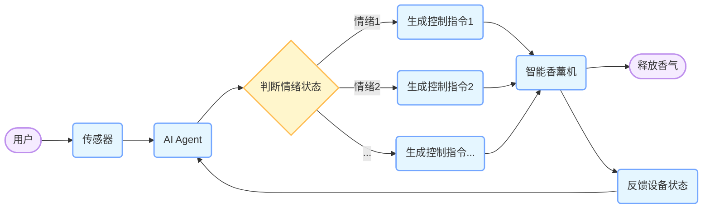

# AI Agent在智能香薰机中的情绪调节功能

> 关键词：AI Agent、智能香薰机、情绪调节、人工智能、传感器、机器学习

> 摘要：本文深入探讨了AI Agent在智能香薰机中实现情绪调节功能的相关技术。首先介绍了该研究的背景，包括目的、预期读者、文档结构等内容。接着阐述了AI Agent和智能香薰机的核心概念及其联系，详细讲解了实现情绪调节功能的核心算法原理与具体操作步骤，同时给出了相关的数学模型和公式。通过项目实战，展示了代码的实际案例并进行详细解释。分析了AI Agent在智能香薰机中情绪调节功能的实际应用场景，推荐了相关的工具和资源。最后总结了未来发展趋势与挑战，提供了常见问题解答及扩展阅读参考资料，旨在全面呈现AI Agent在智能香薰机情绪调节方面的技术原理、应用及发展前景。

## 1. 背景介绍 
### 1.1 目的和范围
随着人们对生活品质的追求不断提高，对能够改善情绪、提升身心健康的智能设备需求日益增长。智能香薰机作为一种结合了香薰疗法和智能技术的产品，逐渐受到消费者的关注。本研究的目的在于探索如何利用AI Agent增强智能香薰机的情绪调节功能，使其能够更精准地感知用户情绪状态，并根据不同情绪提供个性化的香薰方案。

本研究的范围涵盖了AI Agent的基本原理、智能香薰机的工作机制、情绪调节的相关理论，以及如何将AI Agent应用于智能香薰机中实现情绪调节功能的具体技术和方法。同时，还将探讨该技术在实际应用中的场景、面临的挑战以及未来的发展趋势。

### 1.2 预期读者
本文的预期读者包括对人工智能、智能家居、情绪调节技术等领域感兴趣的科研人员、工程师、产品开发者，以及关注生活品质、希望了解智能香薰机相关技术的普通消费者。对于科研人员和工程师，本文提供了深入的技术原理和算法实现细节，可作为进一步研究和开发的参考；对于产品开发者，本文介绍了实际应用场景和开发经验，有助于产品的设计和优化；对于普通消费者，本文以通俗易懂的语言解释了相关技术，帮助他们更好地理解智能香薰机的功能和优势。

### 1.3 文档结构概述
本文共分为十个部分。第一部分为背景介绍，阐述了研究的目的、预期读者和文档结构；第二部分介绍核心概念与联系，包括AI Agent和智能香薰机的原理、架构以及它们之间的关系；第三部分讲解核心算法原理和具体操作步骤，通过Python代码详细阐述实现情绪调节功能的算法；第四部分给出数学模型和公式，并进行详细讲解和举例说明；第五部分是项目实战，包括开发环境搭建、源代码详细实现和代码解读；第六部分分析实际应用场景；第七部分推荐相关的工具和资源，包括学习资源、开发工具框架和相关论文著作；第八部分总结未来发展趋势与挑战；第九部分为附录，提供常见问题与解答；第十部分给出扩展阅读和参考资料。

### 1.4 术语表
#### 1.4.1 核心术语定义
- **AI Agent（人工智能智能体）**：是一种能够感知环境、进行推理决策并执行相应动作的智能实体。在本研究中，AI Agent用于感知用户的情绪状态，分析数据并控制智能香薰机的工作模式。
- **智能香薰机**：一种具备智能控制功能的香薰设备，能够根据用户需求或预设程序释放不同种类和浓度的香气。
- **情绪调节**：指个体通过一定的方式和策略，对自己的情绪状态进行调整和管理，以达到更好的心理状态和生活质量。

#### 1.4.2 相关概念解释
- **香薰疗法**：利用天然植物精油的挥发性和药理特性，通过嗅觉和皮肤吸收等途径，调节人体的生理和心理功能，达到舒缓压力、改善情绪、促进健康等目的的一种自然疗法。
- **传感器技术**：用于检测和测量各种物理量、化学量和生物量的技术，在智能香薰机中，传感器可用于感知用户的生理指标（如心率、血压等）和环境参数（如温度、湿度等），为AI Agent提供数据支持。
- **机器学习**：是一门多领域交叉学科，涉及概率论、统计学、逼近论、凸分析、算法复杂度理论等多门学科。它专门研究计算机怎样模拟或实现人类的学习行为，以获取新的知识或技能，重新组织已有的知识结构使之不断改善自身的性能。在本研究中，机器学习算法可用于对用户情绪数据进行分析和分类，为智能香薰机的控制提供决策依据。

#### 1.4.3 缩略词列表
- **AI**：Artificial Intelligence（人工智能）
- **ML**：Machine Learning（机器学习）
- **IoT**：Internet of Things（物联网）

## 2. 核心概念与联系 

### 2.1 AI Agent原理
AI Agent是人工智能领域中的一个重要概念，它是一个自主的实体，能够感知环境中的信息，并根据这些信息做出决策和执行相应的动作。AI Agent通常由感知模块、决策模块和执行模块组成。

感知模块负责收集环境中的各种信息，例如用户的生理指标、环境参数等。这些信息可以通过各种传感器（如心率传感器、温度传感器等）获取。决策模块则对感知模块收集到的信息进行分析和处理，利用机器学习算法或其他决策模型，判断用户的情绪状态，并根据预设的规则或策略生成相应的控制指令。执行模块根据决策模块生成的控制指令，执行相应的动作，例如控制智能香薰机释放特定的香气。

### 2.2 智能香薰机工作机制
智能香薰机是一种结合了传统香薰技术和智能控制技术的设备。它通常由香薰液容器、雾化装置、控制电路和通信模块组成。香薰液容器用于存放不同种类的香薰液，雾化装置将香薰液雾化成微小的颗粒，使其能够在空气中扩散。控制电路负责控制雾化装置的工作状态，例如开启、关闭、调节雾化量等。通信模块则用于与外部设备（如手机、AI Agent等）进行通信，接收控制指令并反馈设备状态。

智能香薰机的工作模式可以根据用户的需求进行设置，例如定时模式、循环模式、智能模式等。在智能模式下，智能香薰机可以根据AI Agent发送的控制指令，自动调整香薰液的种类和雾化量，以实现情绪调节的功能。

### 2.3 AI Agent与智能香薰机的联系
AI Agent与智能香薰机之间通过通信接口进行连接，实现数据的传输和交互。AI Agent作为智能香薰机的智能控制中心，负责感知用户的情绪状态，并根据情绪状态生成相应的控制指令发送给智能香薰机。智能香薰机则根据接收到的控制指令，调整香薰液的种类和雾化量，释放不同的香气，从而达到调节用户情绪的目的。

AI Agent与智能香薰机的结合，使得智能香薰机能够更加智能化和个性化。通过对用户情绪的实时感知和分析，智能香薰机可以根据用户的不同情绪状态提供针对性的香薰方案，提高情绪调节的效果。

### 2.4 文本示意图
AI Agent与智能香薰机的架构关系可以用以下文本描述：

用户处于环境中，各种传感器（如心率传感器、温度传感器、湿度传感器等）感知用户的生理指标和环境参数，并将这些数据传输给AI Agent。AI Agent接收到数据后，利用机器学习算法对数据进行分析和处理，判断用户的情绪状态。根据情绪状态，AI Agent生成相应的控制指令，通过通信接口发送给智能香薰机。智能香薰机接收到控制指令后，调整香薰液的种类和雾化量，释放不同的香气，作用于用户，从而实现情绪调节的功能。同时，智能香薰机还可以将设备状态信息反馈给AI Agent，以便AI Agent进行实时监控和调整。

### 2.5 Mermaid流程图


## 3. 核心算法原理 & 具体操作步骤 

### 3.1 核心算法原理
实现AI Agent在智能香薰机中情绪调节功能的核心算法主要包括数据预处理、特征提取、情绪分类和控制指令生成四个部分。

#### 3.1.1 数据预处理
传感器采集到的原始数据可能存在噪声、缺失值等问题，需要进行预处理以提高数据的质量。常见的数据预处理方法包括数据清洗、数据归一化和数据平滑等。

数据清洗是指去除原始数据中的噪声和异常值，例如去除心率数据中的突然跳动值。数据归一化是将不同范围的数据映射到一个统一的范围内，例如将心率数据和温度数据都归一化到[0, 1]区间，以便于后续的特征提取和分类。数据平滑是对数据进行滤波处理，减少数据的波动，例如使用移动平均法对心率数据进行平滑处理。

#### 3.1.2 特征提取
特征提取是从预处理后的数据中提取能够反映用户情绪状态的特征。常见的特征包括统计特征（如均值、方差、标准差等）、时域特征（如峰值、谷值、上升沿、下降沿等）和频域特征（如功率谱密度、频率成分等）。

例如，心率数据的均值和方差可以反映用户的情绪紧张程度，温度数据的变化率可以反映用户的情绪波动情况。通过提取这些特征，可以将原始数据转换为更具代表性的特征向量，便于后续的情绪分类。

#### 3.1.3 情绪分类
情绪分类是根据提取的特征向量，将用户的情绪状态分为不同的类别，例如快乐、悲伤、愤怒、平静等。常见的情绪分类算法包括机器学习算法（如支持向量机、决策树、神经网络等）和深度学习算法（如卷积神经网络、循环神经网络等）。

在本研究中，我们选择使用支持向量机（SVM）作为情绪分类算法。SVM是一种二分类算法，通过寻找一个最优的超平面将不同类别的样本分开。对于多分类问题，可以使用一对一或一对多的方法将其转换为多个二分类问题。

#### 3.1.4 控制指令生成
根据情绪分类的结果，AI Agent生成相应的控制指令发送给智能香薰机。不同的情绪状态对应不同的香薰方案，例如快乐情绪可以对应柑橘类香气，悲伤情绪可以对应薰衣草类香气。控制指令包括香薰液的种类和雾化量等信息。

### 3.2 具体操作步骤
以下是实现AI Agent在智能香薰机中情绪调节功能的具体操作步骤：

#### 3.2.1 数据采集
使用各种传感器（如心率传感器、温度传感器、湿度传感器等）采集用户的生理指标和环境参数。将采集到的数据传输到AI Agent中进行处理。

#### 3.2.2 数据预处理
对采集到的原始数据进行预处理，包括数据清洗、数据归一化和数据平滑等操作。

#### 3.2.3 特征提取
从预处理后的数据中提取能够反映用户情绪状态的特征，生成特征向量。

#### 3.2.4 情绪分类
使用支持向量机（SVM）算法对特征向量进行分类，判断用户的情绪状态。

#### 3.2.5 控制指令生成
根据情绪分类的结果，生成相应的控制指令，包括香薰液的种类和雾化量等信息。

#### 3.2.6 指令发送
将生成的控制指令通过通信接口发送给智能香薰机。

#### 3.2.7 香薰调节
智能香薰机接收到控制指令后，调整香薰液的种类和雾化量，释放不同的香气，实现情绪调节的功能。

### 3.3 Python源代码实现
以下是一个使用Python实现AI Agent在智能香薰机中情绪调节功能的示例代码：

```python
import numpy as np
from sklearn.svm import SVC
from sklearn.preprocessing import StandardScaler

# 模拟传感器数据采集
def collect_sensor_data():
    # 这里简单模拟采集心率和温度数据
    heart_rate = np.random.randint(60, 120)
    temperature = np.random.uniform(20, 30)
    return np.array([heart_rate, temperature])

# 数据预处理
def preprocess_data(data):
    scaler = StandardScaler()
    data = scaler.fit_transform(data.reshape(1, -1))
    return data

# 特征提取
def extract_features(data):
    # 这里简单提取均值和方差作为特征
    mean = np.mean(data)
    variance = np.var(data)
    return np.array([mean, variance])

# 情绪分类
def classify_emotion(features):
    # 模拟训练好的SVM模型
    X_train = np.array([[70, 25], [90, 28], [110, 30]])
    y_train = np.array([0, 1, 2])  # 0: 平静, 1: 紧张, 2: 激动
    model = SVC()
    model.fit(X_train, y_train)
    emotion_label = model.predict(features.reshape(1, -1))
    return emotion_label

# 控制指令生成
def generate_control_command(emotion_label):
    if emotion_label == 0:
        # 平静情绪，使用薰衣草香薰，雾化量适中
        command = {'aroma_type': 'lavender', 'atomization_amount': 50}
    elif emotion_label == 1:
        # 紧张情绪，使用柑橘香薰，雾化量较大
        command = {'aroma_type': 'citrus', 'atomization_amount': 80}
    elif emotion_label == 2:
        # 激动情绪，使用檀香木香薰，雾化量较小
        command = {'aroma_type': 'sandalwood', 'atomization_amount': 30}
    return command

# 主函数
def main():
    # 数据采集
    sensor_data = collect_sensor_data()
    # 数据预处理
    preprocessed_data = preprocess_data(sensor_data)
    # 特征提取
    features = extract_features(preprocessed_data)
    # 情绪分类
    emotion_label = classify_emotion(features)
    # 控制指令生成
    control_command = generate_control_command(emotion_label)
    print("传感器数据:", sensor_data)
    print("预处理后数据:", preprocessed_data)
    print("提取的特征:", features)
    print("情绪标签:", emotion_label)
    print("控制指令:", control_command)

if __name__ == "__main__":
    main()
```

### 3.4 代码解释
- `collect_sensor_data` 函数：模拟传感器数据采集，返回心率和温度数据。
- `preprocess_data` 函数：对采集到的数据进行预处理，使用 `StandardScaler` 进行数据归一化。
- `extract_features` 函数：从预处理后的数据中提取均值和方差作为特征。
- `classify_emotion` 函数：使用支持向量机（SVM）算法对特征向量进行分类，判断用户的情绪状态。
- `generate_control_command` 函数：根据情绪分类的结果，生成相应的控制指令，包括香薰液的种类和雾化量等信息。
- `main` 函数：主函数，依次调用上述函数，完成数据采集、预处理、特征提取、情绪分类和控制指令生成的过程，并输出相关信息。

## 4. 数学模型和公式 & 详细讲解 & 举例说明 

### 4.1 数据预处理相关公式
#### 4.1.1 数据归一化
数据归一化是将数据映射到一个统一的范围内，常见的归一化方法是最小 - 最大归一化，其公式为：

$$x_{norm}=\frac{x - x_{min}}{x_{max}-x_{min}}$$

其中，$x$ 是原始数据，$x_{min}$ 是数据的最小值，$x_{max}$ 是数据的最大值，$x_{norm}$ 是归一化后的数据。

例如，假设有一组心率数据 $[60, 80, 100, 120]$，则 $x_{min}=60$，$x_{max}=120$。对于数据 $x = 80$，归一化后的数据为：

$$x_{norm}=\frac{80 - 60}{120 - 60}=\frac{20}{60}\approx0.33$$

#### 4.1.2 数据平滑（移动平均法）
移动平均法是一种常用的数据平滑方法，其公式为：

$$y_t=\frac{1}{n}\sum_{i = t - n + 1}^{t}x_i$$

其中，$x_i$ 是原始数据，$y_t$ 是平滑后的数据，$n$ 是移动平均的窗口大小。

例如，假设有一组心率数据 $[60, 62, 64, 66, 68]$，窗口大小 $n = 3$。对于 $t = 3$，平滑后的数据为：

$$y_3=\frac{60 + 62 + 64}{3}=\frac{186}{3}=62$$

### 4.2 特征提取相关公式
#### 4.2.1 均值
均值是一组数据的平均值，其公式为：

$$\bar{x}=\frac{1}{n}\sum_{i = 1}^{n}x_i$$

其中，$x_i$ 是数据的第 $i$ 个值，$n$ 是数据的个数，$\bar{x}$ 是均值。

例如，假设有一组心率数据 $[60, 62, 64, 66, 68]$，则均值为：

$$\bar{x}=\frac{60 + 62 + 64 + 66 + 68}{5}=\frac{320}{5}=64$$

#### 4.2.2 方差
方差是衡量一组数据离散程度的指标，其公式为：

$$s^2=\frac{1}{n - 1}\sum_{i = 1}^{n}(x_i-\bar{x})^2$$

其中，$x_i$ 是数据的第 $i$ 个值，$\bar{x}$ 是均值，$n$ 是数据的个数，$s^2$ 是方差。

例如，对于上述心率数据 $[60, 62, 64, 66, 68]$，均值 $\bar{x}=64$，则方差为：

$$s^2=\frac{(60 - 64)^2+(62 - 64)^2+(64 - 64)^2+(66 - 64)^2+(68 - 64)^2}{5 - 1}$$

$$=\frac{16 + 4 + 0 + 4 + 16}{4}=\frac{40}{4}=10$$

### 4.3 情绪分类相关公式（支持向量机）
支持向量机（SVM）的目标是寻找一个最优的超平面，将不同类别的样本分开。对于二分类问题，超平面的方程为：

$$w^T x + b = 0$$

其中，$w$ 是超平面的法向量，$x$ 是样本向量，$b$ 是偏置。

SVM的优化目标是最大化分类间隔，其优化问题可以表示为：

$$\min_{w,b}\frac{1}{2}\|w\|^2$$

$$s.t. \quad y_i(w^T x_i + b)\geq1, \quad i = 1,2,\cdots,n$$

其中，$y_i$ 是样本 $x_i$ 的类别标签（$y_i\in\{-1, 1\}$），$n$ 是样本的个数。

通过引入拉格朗日乘子 $\alpha_i$，可以将上述优化问题转换为对偶问题：

$$\max_{\alpha}\sum_{i = 1}^{n}\alpha_i-\frac{1}{2}\sum_{i = 1}^{n}\sum_{j = 1}^{n}\alpha_i\alpha_jy_iy_jx_i^T x_j$$

$$s.t. \quad \sum_{i = 1}^{n}\alpha_iy_i = 0, \quad \alpha_i\geq0, \quad i = 1,2,\cdots,n$$

求解对偶问题得到拉格朗日乘子 $\alpha_i$，然后可以计算出 $w$ 和 $b$ 的值，从而得到最优超平面。

对于新的样本 $x$，其分类结果可以通过以下公式判断：

$$\text{sign}(w^T x + b)$$

如果结果为正，则属于正类；如果结果为负，则属于负类。

### 4.4 举例说明
假设我们有一个二分类问题，样本数据如下：

| 样本编号 | 特征向量 $x$ | 类别标签 $y$ |
|---|---|---|
| 1 | $(1, 1)$ | 1 |
| 2 | $(2, 2)$ | 1 |
| 3 | $(-1, -1)$ | -1 |
| 4 | $(-2, -2)$ | -1 |

我们使用SVM算法进行分类。首先，将样本数据代入对偶问题的目标函数中，通过求解对偶问题得到拉格朗日乘子 $\alpha_i$。假设求解得到 $\alpha_1 = 0.5$，$\alpha_2 = 0.5$，$\alpha_3 = 0.5$，$\alpha_4 = 0.5$。

然后，计算 $w$ 的值：

$$w=\sum_{i = 1}^{4}\alpha_iy_ix_i$$

$$=0.5\times1\times(1, 1)+0.5\times1\times(2, 2)+0.5\times(-1)\times(-1, -1)+0.5\times(-1)\times(-2, -2)$$

$$=(0.5 + 1 + 0.5 + 1, 0.5 + 1 + 0.5 + 1)=(3, 3)$$

接着，选择一个支持向量（例如样本1），计算 $b$ 的值：

$$b = y_1 - w^T x_1=1-(3\times1 + 3\times1)=1 - 6=-5$$

得到最优超平面的方程为 $3x_1 + 3x_2 - 5 = 0$。

对于新的样本 $x=(0, 0)$，计算 $w^T x + b$ 的值：

$$w^T x + b=3\times0 + 3\times0 - 5=-5$$

由于结果为负，所以样本 $x=(0, 0)$ 属于负类。

## 5. 项目实战：代码实际案例和详细解释说明 

### 5.1  开发环境搭建
#### 5.1.1 硬件环境
- **传感器**：选择合适的传感器来采集用户的生理指标和环境参数，例如心率传感器（如MAX30102）、温度传感器（如DHT11）、湿度传感器（如DHT11）等。
- **开发板**：选择一款性能稳定、易于开发的开发板，例如Arduino、Raspberry Pi等。在本项目中，我们选择Raspberry Pi 4作为开发板。
- **智能香薰机**：选择一款支持通信接口（如串口、蓝牙、Wi-Fi等）的智能香薰机，以便与AI Agent进行通信。

#### 5.1.2 软件环境
- **操作系统**：在Raspberry Pi 4上安装Raspbian操作系统。
- **Python环境**：安装Python 3.x版本，并安装相关的Python库，如`numpy`、`scikit-learn`、`pyserial`等。可以使用以下命令进行安装：

```sh
pip install numpy scikit-learn pyserial
```

### 5.2  源代码详细实现和代码解读
以下是一个完整的项目实战代码示例，实现了AI Agent在智能香薰机中情绪调节功能：

```python
import numpy as np
from sklearn.svm import SVC
from sklearn.preprocessing import StandardScaler
import serial
import time

# 模拟传感器数据采集
def collect_sensor_data(ser):
    try:
        # 从串口读取传感器数据
        data = ser.readline().decode('utf-8').strip()
        heart_rate, temperature = map(float, data.split(','))
        return np.array([heart_rate, temperature])
    except Exception as e:
        print(f"数据采集错误: {e}")
        return np.array([0, 0])

# 数据预处理
def preprocess_data(data):
    scaler = StandardScaler()
    data = scaler.fit_transform(data.reshape(1, -1))
    return data

# 特征提取
def extract_features(data):
    # 这里简单提取均值和方差作为特征
    mean = np.mean(data)
    variance = np.var(data)
    return np.array([mean, variance])

# 情绪分类
def classify_emotion(features):
    # 模拟训练好的SVM模型
    X_train = np.array([[70, 25], [90, 28], [110, 30]])
    y_train = np.array([0, 1, 2])  # 0: 平静, 1: 紧张, 2: 激动
    model = SVC()
    model.fit(X_train, y_train)
    emotion_label = model.predict(features.reshape(1, -1))
    return emotion_label

# 控制指令生成
def generate_control_command(emotion_label):
    if emotion_label == 0:
        # 平静情绪，使用薰衣草香薰，雾化量适中
        command = {'aroma_type': 'lavender', 'atomization_amount': 50}
    elif emotion_label == 1:
        # 紧张情绪，使用柑橘香薰，雾化量较大
        command = {'aroma_type': 'citrus', 'atomization_amount': 80}
    elif emotion_label == 2:
        # 激动情绪，使用檀香木香薰，雾化量较小
        command = {'aroma_type': 'sandalwood', 'atomization_amount': 30}
    return command

# 发送控制指令到智能香薰机
def send_command_to_aromatherapy(ser, command):
    try:
        aroma_type = command['aroma_type']
        atomization_amount = command['atomization_amount']
        # 构造发送数据
        data = f"{aroma_type},{atomization_amount}\n"
        ser.write(data.encode('utf-8'))
        print(f"发送控制指令: {data.strip()}")
    except Exception as e:
        print(f"发送指令错误: {e}")

# 主函数
def main():
    # 打开串口
    ser = serial.Serial('/dev/ttyUSB0', 9600, timeout=1)
    time.sleep(2)  # 等待串口初始化

    while True:
        # 数据采集
        sensor_data = collect_sensor_data(ser)
        # 数据预处理
        preprocessed_data = preprocess_data(sensor_data)
        # 特征提取
        features = extract_features(preprocessed_data)
        # 情绪分类
        emotion_label = classify_emotion(features)
        # 控制指令生成
        control_command = generate_control_command(emotion_label)
        # 发送控制指令到智能香薰机
        send_command_to_aromatherapy(ser, control_command)

        time.sleep(5)  # 每隔5秒采集一次数据

if __name__ == "__main__":
    main()
```

### 5.3  代码解读与分析
- **数据采集**：`collect_sensor_data` 函数从串口读取传感器数据，将其解析为心率和温度数据，并返回一个包含这两个值的数组。
- **数据预处理**：`preprocess_data` 函数使用 `StandardScaler` 对采集到的数据进行归一化处理。
- **特征提取**：`extract_features` 函数从预处理后的数据中提取均值和方差作为特征。
- **情绪分类**：`classify_emotion` 函数使用支持向量机（SVM）算法对特征向量进行分类，判断用户的情绪状态。
- **控制指令生成**：`generate_control_command` 函数根据情绪分类的结果，生成相应的控制指令，包括香薰液的种类和雾化量等信息。
- **发送控制指令**：`send_command_to_aromatherapy` 函数将生成的控制指令发送到智能香薰机。
- **主函数**：`main` 函数打开串口，进入一个无限循环，每隔5秒采集一次数据，依次完成数据采集、预处理、特征提取、情绪分类、控制指令生成和发送的过程。

## 6. 实际应用场景 
### 6.1 家庭场景
在家庭环境中，智能香薰机可以作为一种智能家居设备，与AI Agent结合实现情绪调节功能。例如，当用户下班回家感到疲惫和压力时，智能香薰机可以根据AI Agent的判断，释放薰衣草等具有舒缓放松作用的香气，帮助用户缓解压力、放松身心。当用户在阅读、学习或工作时，智能香薰机可以释放薄荷、柠檬等具有提神醒脑作用的香气，提高用户的注意力和工作效率。

### 6.2 办公场景
在办公环境中，长时间的工作可能会导致员工感到疲劳、焦虑和压力。智能香薰机可以安装在办公室内，根据员工的情绪状态实时调节香气。例如，在上午工作高峰期，释放柑橘类香气，激发员工的活力和创造力；在下午工作疲劳期，释放薰衣草类香气，帮助员工缓解疲劳、放松心情。

### 6.3 医疗场景
在医疗环境中，智能香薰机可以作为一种辅助治疗手段，帮助患者调节情绪、缓解疼痛和焦虑。例如，在牙科诊所，患者在等待治疗时可能会感到紧张和恐惧，智能香薰机可以释放薰衣草、洋甘菊等具有舒缓放松作用的香气，减轻患者的紧张情绪。在康复中心，智能香薰机可以根据患者的康复情况和情绪状态，释放不同的香气，促进患者的身心健康。

### 6.4 酒店场景
在酒店环境中，智能香薰机可以提升客人的入住体验。例如，在酒店大堂，释放檀香木、玫瑰等具有优雅氛围的香气，给客人留下良好的第一印象。在客房内，根据客人的个性化需求和情绪状态，智能香薰机可以释放不同的香气，如薰衣草帮助客人入睡，柑橘类香气唤醒客人的活力。

## 7. 工具和资源推荐
### 7.1 学习资源推荐
#### 7.1.1 书籍推荐
- 《人工智能：一种现代的方法》：这本书是人工智能领域的经典教材，全面介绍了人工智能的基本概念、算法和应用。
- 《机器学习》：周志华著，是一本系统介绍机器学习理论和方法的教材，适合初学者和有一定基础的读者。
- 《Python机器学习实战》：这本书通过实际案例介绍了如何使用Python实现机器学习算法，对于想要快速上手的读者非常有帮助。

#### 7.1.2 在线课程
- Coursera上的“机器学习”课程：由斯坦福大学教授Andrew Ng主讲，是一门非常经典的机器学习在线课程。
- edX上的“人工智能基础”课程：该课程介绍了人工智能的基本概念、算法和应用，适合初学者。
- 中国大学MOOC上的“Python语言程序设计”课程：帮助读者快速掌握Python编程语言，为后续的机器学习和人工智能学习打下基础。

#### 7.1.3 技术博客和网站
- Medium：一个汇聚了众多技术专家和爱好者的博客平台，上面有很多关于人工智能、机器学习和智能家居的技术文章。
- 机器之心：专注于人工智能领域的资讯和技术分享平台，提供最新的行业动态和技术解读。
- 开源中国：国内知名的开源技术社区，有很多关于Python、机器学习和物联网的技术文章和项目分享。

### 7.2 开发工具框架推荐
#### 7.2.1 IDE和编辑器
- PyCharm：一款专门为Python开发设计的集成开发环境（IDE），功能强大，提供代码自动补全、调试、版本控制等功能。
- Visual Studio Code：一款轻量级的代码编辑器，支持多种编程语言，通过安装相关插件可以实现Python开发的各种功能。

#### 7.2.2 调试和性能分析工具
- pdb：Python自带的调试器，可以帮助开发者定位和解决代码中的问题。
- cProfile：Python的性能分析工具，可以分析代码的运行时间和函数调用情况，帮助开发者优化代码性能。

#### 7.2.3 相关框架和库
- scikit-learn：一个简单易用的机器学习库，提供了各种机器学习算法的实现，如分类、回归、聚类等。
- TensorFlow：一个开源的机器学习框架，由Google开发，广泛应用于深度学习领域。
- PySerial：一个Python库，用于串口通信，方便开发者与硬件设备进行数据交互。

### 7.3 相关论文著作推荐
#### 7.3.1 经典论文
- "Support-Vector Networks"：这篇论文首次提出了支持向量机（SVM）算法，是机器学习领域的经典之作。
- "Gradient-Based Learning Applied to Document Recognition"：这篇论文介绍了卷积神经网络（CNN）在文档识别中的应用，推动了深度学习的发展。

#### 7.3.2 最新研究成果
- 关注顶级学术会议（如NeurIPS、ICML、CVPR等）和期刊（如Journal of Artificial Intelligence Research、Artificial Intelligence等）上的最新研究成果，了解AI Agent和智能香薰机相关领域的前沿技术。

#### 7.3.3 应用案例分析
- 参考相关的行业报告和案例分析，了解AI Agent在智能香薰机中情绪调节功能的实际应用情况和效果，为自己的项目提供参考和借鉴。

## 8. 总结：未来发展趋势与挑战
### 8.1 未来发展趋势
#### 8.1.1 个性化定制
随着人工智能技术的不断发展，AI Agent将能够更准确地感知用户的情绪状态和个性化需求，为用户提供更加个性化的香薰方案。例如，根据用户的年龄、性别、生活习惯等因素，智能香薰机可以自动调整香薰液的种类和雾化量，实现真正的个性化情绪调节。

#### 8.1.2 多模态融合
未来的智能香薰机将不仅仅依赖于生理指标和环境参数来判断用户的情绪状态，还将融合更多的模态信息，如语音、图像、文本等。通过多模态融合，AI Agent可以更全面、准确地了解用户的情绪状态，提高情绪调节的效果。

#### 8.1.3 与其他智能家居设备的集成
智能香薰机将与其他智能家居设备（如智能灯光、智能音响、智能窗帘等）进行深度集成，实现更加智能化的家居环境。例如，当智能香薰机感知到用户情绪低落时，可以联动智能灯光调暗、智能音响播放舒缓的音乐，共同营造出舒适、放松的氛围。

#### 8.1.4 云服务支持
借助云服务的强大计算能力和存储能力，智能香薰机可以实现数据的实时分析和处理，以及用户数据的长期存储和管理。同时，云服务还可以实现多设备之间的互联互通和数据共享，为用户提供更加便捷、高效的服务。

### 8.2 挑战
#### 8.2.1 数据隐私和安全
AI Agent在智能香薰机中情绪调节功能的实现需要收集和处理用户的大量生理指标和个人信息，这涉及到用户的数据隐私和安全问题。如何确保用户数据的安全，防止数据泄露和滥用，是一个亟待解决的问题。

#### 8.2.2 情绪识别的准确性
目前，情绪识别技术还存在一定的局限性，准确率有待提高。不同的人在相同的情绪状态下可能表现出不同的生理指标和行为特征，而且情绪状态也会受到环境、文化等因素的影响。如何提高情绪识别的准确性，是实现有效情绪调节的关键。

#### 8.2.3 香薰效果的量化评估
香薰对情绪的调节效果是一个主观的感受，很难进行量化评估。不同的人对不同的香气有不同的喜好和反应，而且香薰的效果还会受到使用时间、浓度、环境等因素的影响。如何建立科学、客观的香薰效果评估体系，是一个需要深入研究的问题。

#### 8.2.4 硬件成本和性能
智能香薰机的硬件成本和性能是影响其市场推广和应用的重要因素。目前，一些高性能的传感器和智能控制模块价格较高，增加了智能香薰机的制造成本。如何在保证性能的前提下，降低硬件成本，提高产品的性价比，是一个需要解决的问题。

## 9. 附录：常见问题与解答
### 9.1 智能香薰机对人体有害吗？
一般来说，正规的智能香薰机使用的香薰液都是天然植物精油，对人体是安全无害的。但是，某些人可能对某些香气过敏，使用时需要注意。此外，如果香薰液的质量不好或使用不当，可能会对人体造成一定的危害。因此，在选择香薰液时，要选择质量可靠、信誉良好的产品，并按照说明书正确使用。

### 9.2 如何选择适合自己的香薰液？
选择适合自己的香薰液需要考虑个人的喜好、情绪状态和使用目的等因素。例如，如果你想要放松身心，可以选择薰衣草、洋甘菊等具有舒缓作用的香气；如果你想要提神醒脑，可以选择薄荷、柠檬等具有清新作用的香气。此外，还可以根据不同的季节和环境选择不同的香薰液，如夏季可以选择清爽的香气，冬季可以选择温暖的香气。

### 9.3 智能香薰机可以连续使用多长时间？
智能香薰机的连续使用时间不宜过长，一般建议每次使用时间不超过4小时。长时间连续使用可能会导致香薰液挥发过快，影响香薰效果，同时也可能会对机器造成一定的损害。此外，使用一段时间后，最好让机器休息一段时间，以保证其正常运行。

### 9.4 智能香薰机的清洁和维护方法有哪些？
智能香薰机的清洁和维护非常重要，可以保证其正常运行和香薰效果。一般来说，每隔一段时间需要对香薰机进行清洁，包括清洗香薰液容器、雾化装置等部件。清洗时，要使用温和的清洁剂，避免使用尖锐的工具刮擦机器表面。此外，还要定期检查机器的电路和通信模块，确保其正常工作。

## 10. 扩展阅读 & 参考资料
### 10.1 扩展阅读
- 《香薰疗法全书》：全面介绍了香薰疗法的历史、原理、应用和操作方法，对于想要深入了解香薰疗法的读者非常有帮助。
- 《情绪心理学》：系统介绍了情绪的产生、发展和调节机制，为理解AI Agent在智能香薰机中情绪调节功能提供了理论基础。

### 10.2 参考资料
- [1] Russell, J. A. (1980). A circumplex model of affect. Journal of personality and social psychology, 39(6), 1161.
- [2] Cortes, C., & Vapnik, V. (1995). Support-vector networks. Machine learning, 20(3), 273-297.
- [3] LeCun, Y., Bottou, L., Bengio, Y., & Haffner, P. (1998). Gradient-based learning applied to document recognition. Proceedings of the IEEE, 86(11), 2278-2324.