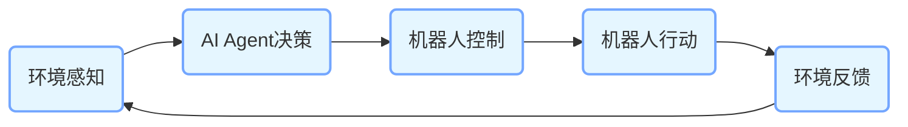

# AI Agent在机器人控制中的应用：自主导航与任务执行

> 关键词：AI Agent、机器人控制、自主导航、任务执行、人工智能

> 摘要：本文深入探讨了AI Agent在机器人控制中的应用，聚焦于自主导航与任务执行这两个关键方面。首先介绍了相关背景知识，包括目的、预期读者、文档结构和术语表。接着阐述了核心概念与联系，分析了核心算法原理并给出具体操作步骤，同时介绍了相关数学模型和公式。通过项目实战展示了代码实际案例及详细解释，探讨了实际应用场景。最后推荐了相关工具和资源，总结了未来发展趋势与挑战，并提供了常见问题解答和扩展阅读参考资料。旨在为读者全面呈现AI Agent在机器人控制领域的重要作用和应用前景。

## 1. 背景介绍 
### 1.1 目的和范围
本文章的主要目的是深入研究AI Agent在机器人控制中自主导航与任务执行方面的应用。随着人工智能技术的飞速发展，AI Agent在机器人领域的应用越来越广泛，其能够显著提升机器人的智能化水平和自主能力。通过本文，我们将详细探讨AI Agent如何实现机器人的自主导航以及高效完成各种任务，包括相关的技术原理、算法实现、实际应用案例等。范围涵盖了从基础概念到实际应用的各个方面，为读者提供一个全面而深入的了解。

### 1.2 预期读者
本文预期读者包括但不限于机器人技术开发者、人工智能研究人员、相关专业的学生以及对机器人和人工智能感兴趣的爱好者。对于开发者来说，文章可以提供技术实现的思路和方法；对于研究人员，有助于深入了解该领域的前沿技术和发展趋势；对于学生，可以作为学习资料，帮助他们掌握相关的理论知识和实践技能；对于爱好者，能够拓宽他们对机器人和人工智能的认知视野。

### 1.3 文档结构概述
本文将按照以下结构进行组织：首先介绍背景知识，包括目的、预期读者、文档结构和术语表；接着阐述核心概念与联系，包括AI Agent、机器人控制、自主导航和任务执行的原理和架构，并通过文本示意图和Mermaid流程图进行展示；然后详细讲解核心算法原理和具体操作步骤，使用Python源代码进行阐述；再介绍相关的数学模型和公式，并举例说明；通过项目实战展示代码实际案例和详细解释；探讨实际应用场景；推荐相关的工具和资源；总结未来发展趋势与挑战；提供常见问题解答和扩展阅读参考资料。

### 1.4 术语表
#### 1.4.1 核心术语定义
- **AI Agent**：人工智能代理，是一种能够感知环境、根据感知信息做出决策并采取行动以实现特定目标的软件或硬件实体。
- **机器人控制**：对机器人的运动、操作等行为进行管理和调节，使其能够按照预定的任务和要求进行工作。
- **自主导航**：机器人在没有人为干预的情况下，能够自动感知周围环境，规划路径并移动到目标位置的能力。
- **任务执行**：机器人根据给定的任务指令，利用自身的能力和资源，完成特定任务的过程。

#### 1.4.2 相关概念解释
- **环境感知**：机器人通过各种传感器（如激光雷达、摄像头、超声波传感器等）获取周围环境的信息，包括障碍物的位置、距离、形状等。
- **路径规划**：根据环境感知的结果和目标位置，机器人寻找一条安全、高效的路径，避免碰撞障碍物。
- **决策制定**：AI Agent根据环境感知和任务要求，分析各种可能的行动方案，并选择最优的行动方案。

#### 1.4.3 缩略词列表
- **SLAM**：Simultaneous Localization and Mapping，同时定位与地图构建。
- **ROS**：Robot Operating System，机器人操作系统。
- **Dijkstra**：一种经典的最短路径算法。
- **A***：一种启发式搜索算法，常用于路径规划。

## 2. 核心概念与联系 

### 核心概念原理
#### AI Agent
AI Agent是整个系统的核心，它负责感知环境、做出决策和执行行动。AI Agent可以基于不同的架构实现，如基于规则的架构、基于机器学习的架构等。在基于机器学习的架构中，AI Agent可以通过训练学习到如何根据环境状态选择最优的行动。

#### 机器人控制
机器人控制是将AI Agent的决策转化为机器人实际动作的过程。它涉及到机器人的运动学、动力学模型，以及各种控制算法，如PID控制、模糊控制等。通过合理的控制算法，可以使机器人准确地执行AI Agent的指令。

#### 自主导航
自主导航是机器人在未知环境中能够自主移动到目标位置的能力。它主要包括环境感知、地图构建、定位和路径规划四个关键步骤。环境感知是通过传感器获取环境信息，地图构建是根据感知信息创建环境地图，定位是确定机器人在地图中的位置，路径规划是根据地图和目标位置规划出一条可行的路径。

#### 任务执行
任务执行是机器人根据给定的任务指令，完成特定任务的过程。任务可以是简单的移动到某个位置，也可以是复杂的操作，如抓取物体、搬运物品等。在任务执行过程中，AI Agent需要不断地感知环境，根据环境变化调整行动方案，以确保任务的顺利完成。

### 架构的文本示意图
```plaintext
+-------------------+
|     AI Agent      |
|                   |
|  - 环境感知模块  |
|  - 决策制定模块  |
|  - 行动执行模块  |
+-------------------+
         |
         v
+-------------------+
|   机器人控制模块  |
|                   |
|  - 运动控制算法  |
|  - 动作执行机构  |
+-------------------+
         |
         v
+-------------------+
|     机器人本体    |
|                   |
|  - 传感器设备    |
|  - 执行器设备    |
+-------------------+
```

### Mermaid流程图


## 3. 核心算法原理 & 具体操作步骤 

### 环境感知算法 - 激光雷达数据处理
激光雷达是机器人常用的环境感知传感器，它可以测量机器人周围障碍物的距离和角度。下面是一个简单的Python代码示例，用于处理激光雷达数据并检测障碍物：

```python
import numpy as np

def lidar_data_processing(lidar_data, threshold):
    """
    处理激光雷达数据，检测障碍物
    :param lidar_data: 激光雷达测量的距离数据
    :param threshold: 障碍物检测阈值
    :return: 障碍物的位置信息
    """
    obstacle_positions = []
    for i, distance in enumerate(lidar_data):
        if distance < threshold:
            angle = i * (2 * np.pi / len(lidar_data))
            x = distance * np.cos(angle)
            y = distance * np.sin(angle)
            obstacle_positions.append((x, y))
    return obstacle_positions

# 示例激光雷达数据
lidar_data = np.random.rand(360) * 10  # 模拟360个角度的距离测量值
threshold = 2.0  # 障碍物检测阈值
obstacles = lidar_data_processing(lidar_data, threshold)
print("检测到的障碍物位置：", obstacles)
```

### 路径规划算法 - A*算法
A*算法是一种常用的路径规划算法，它结合了Dijkstra算法的最优性和贪心最佳优先搜索算法的高效性。下面是一个简单的A*算法实现：

```python
import heapq

class Node:
    def __init__(self, x, y, g=float('inf'), h=float('inf'), parent=None):
        self.x = x
        self.y = y
        self.g = g  # 从起点到当前节点的实际代价
        self.h = h  # 从当前节点到目标节点的估计代价
        self.f = g + h  # 总代价
        self.parent = parent

    def __lt__(self, other):
        return self.f < other.f

def heuristic(node, goal):
    """
    启发式函数，使用曼哈顿距离
    """
    return abs(node.x - goal.x) + abs(node.y - goal.y)

def a_star(grid, start, goal):
    """
    A*算法实现
    :param grid: 地图网格，0表示可通行，1表示障碍物
    :param start: 起点节点
    :param goal: 目标节点
    :return: 路径节点列表
    """
    rows, cols = len(grid), len(grid[0])
    open_list = []
    closed_set = set()

    start.g = 0
    start.h = heuristic(start, goal)
    start.f = start.g + start.h
    heapq.heappush(open_list, start)

    while open_list:
        current = heapq.heappop(open_list)
        if current.x == goal.x and current.y == goal.y:
            path = []
            while current:
                path.append((current.x, current.y))
                current = current.parent
            return path[::-1]

        closed_set.add((current.x, current.y))

        # 定义相邻节点的偏移量
        neighbors = [(0, 1), (0, -1), (1, 0), (-1, 0)]
        for dx, dy in neighbors:
            new_x, new_y = current.x + dx, current.y + dy
            if 0 <= new_x < rows and 0 <= new_y < cols and grid[new_x][new_y] == 0:
                if (new_x, new_y) in closed_set:
                    continue
                new_node = Node(new_x, new_y)
                tentative_g = current.g + 1
                if tentative_g < new_node.g:
                    new_node.parent = current
                    new_node.g = tentative_g
                    new_node.h = heuristic(new_node, goal)
                    new_node.f = new_node.g + new_node.h
                    heapq.heappush(open_list, new_node)

    return None

# 示例地图
grid = [
    [0, 0, 0, 0],
    [0, 1, 0, 0],
    [0, 0, 0, 0],
    [0, 0, 0, 0]
]
start = Node(0, 0)
goal = Node(3, 3)
path = a_star(grid, start, goal)
print("规划的路径：", path)
```

### 具体操作步骤
1. **环境感知**：机器人通过激光雷达等传感器获取周围环境的距离数据，使用上述的激光雷达数据处理算法检测障碍物的位置。
2. **地图构建**：根据环境感知的结果，构建机器人所在环境的地图。可以使用基于SLAM的方法，将检测到的障碍物信息整合到地图中。
3. **定位**：确定机器人在地图中的位置。可以使用里程计、GPS等定位设备，结合地图信息进行精确的定位。
4. **路径规划**：根据机器人的当前位置和目标位置，使用A*等路径规划算法规划出一条可行的路径。
5. **任务执行**：机器人按照规划好的路径进行移动，在移动过程中不断进行环境感知，根据环境变化调整行动方案，确保任务的顺利完成。

## 4. 数学模型和公式 & 详细讲解 & 举例说明 

### 激光雷达数据处理的数学模型
激光雷达测量的距离数据可以表示为一个向量 $\mathbf{d} = [d_1, d_2, \cdots, d_n]$，其中 $d_i$ 表示第 $i$ 个角度的测量距离。障碍物检测的阈值为 $T$，当 $d_i < T$ 时，认为该方向存在障碍物。

障碍物的位置可以通过极坐标转换为笛卡尔坐标。设第 $i$ 个角度为 $\theta_i = i \times \frac{2\pi}{n}$，则障碍物的笛卡尔坐标 $(x_i, y_i)$ 可以通过以下公式计算：
$$
x_i = d_i \cos(\theta_i) \\
y_i = d_i \sin(\theta_i)
$$

例如，假设激光雷达测量的距离数据为 $\mathbf{d} = [1.5, 2.5, 0.8, 3.0]$，阈值 $T = 1.0$，角度数量 $n = 4$。则 $\theta_1 = 0$，$\theta_2 = \frac{\pi}{2}$，$\theta_3 = \pi$，$\theta_4 = \frac{3\pi}{2}$。对于 $d_3 = 0.8 < T$，该方向存在障碍物，其笛卡尔坐标为：
$$
x_3 = 0.8 \cos(\pi) = -0.8 \\
y_3 = 0.8 \sin(\pi) = 0
$$

### A*算法的数学模型
A*算法通过评估每个节点的总代价 $f(n)$ 来选择最优的路径，总代价 $f(n)$ 由两部分组成：从起点到当前节点的实际代价 $g(n)$ 和从当前节点到目标节点的估计代价 $h(n)$，即：
$$
f(n) = g(n) + h(n)
$$

其中，$g(n)$ 可以通过累加从起点到当前节点的路径长度得到，$h(n)$ 是一个启发式函数，用于估计从当前节点到目标节点的代价。在A*算法中，常用的启发式函数有曼哈顿距离、欧几里得距离等。

曼哈顿距离的计算公式为：
$$
h(n) = |x_n - x_g| + |y_n - y_g|
$$
其中，$(x_n, y_n)$ 是当前节点的坐标，$(x_g, y_g)$ 是目标节点的坐标。

例如，假设当前节点的坐标为 $(1, 2)$，目标节点的坐标为 $(4, 5)$，则曼哈顿距离为：
$$
h(n) = |1 - 4| + |2 - 5| = 3 + 3 = 6
$$

## 5. 项目实战：代码实际案例和详细解释说明 

### 5.1  开发环境搭建
#### 安装ROS
ROS（Robot Operating System）是一个广泛使用的机器人开发平台，提供了丰富的工具和库。可以按照ROS官方文档的指引，在Ubuntu系统上安装ROS Kinetic或Melodic版本。

#### 安装Python库
需要安装一些Python库，如NumPy、Matplotlib等，可以使用pip进行安装：
```bash
pip install numpy matplotlib
```

#### 配置开发环境
创建一个ROS工作空间，并在工作空间中创建一个新的包：
```bash
mkdir -p catkin_ws/src
cd catkin_ws/src
catkin_create_pkg robot_navigation rospy sensor_msgs nav_msgs
cd ..
catkin_make
source devel/setup.bash
```

### 5.2  源代码详细实现和代码解读
#### 环境感知节点
```python
#!/usr/bin/env python
import rospy
from sensor_msgs.msg import LaserScan
import numpy as np

def lidar_callback(msg):
    lidar_data = np.array(msg.ranges)
    threshold = 2.0
    obstacle_positions = []
    for i, distance in enumerate(lidar_data):
        if distance < threshold:
            angle = msg.angle_min + i * msg.angle_increment
            x = distance * np.cos(angle)
            y = distance * np.sin(angle)
            obstacle_positions.append((x, y))
    rospy.loginfo("检测到的障碍物位置：%s", obstacle_positions)

def lidar_listener():
    rospy.init_node('lidar_listener', anonymous=True)
    rospy.Subscriber('/scan', LaserScan, lidar_callback)
    rospy.spin()

if __name__ == '__main__':
    lidar_listener()
```
代码解读：
- 该节点订阅了激光雷达的扫描数据 `/scan`，并在回调函数 `lidar_callback` 中处理这些数据。
- 对于每个测量距离，如果小于阈值，则计算障碍物的笛卡尔坐标，并将其存储在 `obstacle_positions` 列表中。
- 最后，使用 `rospy.loginfo` 输出检测到的障碍物位置。

#### 路径规划节点
```python
#!/usr/bin/env python
import rospy
from nav_msgs.msg import OccupancyGrid
from geometry_msgs.msg import PoseStamped
import heapq

class Node:
    def __init__(self, x, y, g=float('inf'), h=float('inf'), parent=None):
        self.x = x
        self.y = y
        self.g = g
        self.h = h
        self.f = g + h
        self.parent = parent

    def __lt__(self, other):
        return self.f < other.f

def heuristic(node, goal):
    return abs(node.x - goal.x) + abs(node.y - goal.y)

def a_star(grid, start, goal):
    rows, cols = len(grid), len(grid[0])
    open_list = []
    closed_set = set()

    start.g = 0
    start.h = heuristic(start, goal)
    start.f = start.g + start.h
    heapq.heappush(open_list, start)

    while open_list:
        current = heapq.heappop(open_list)
        if current.x == goal.x and current.y == goal.y:
            path = []
            while current:
                path.append((current.x, current.y))
                current = current.parent
            return path[::-1]

        closed_set.add((current.x, current.y))

        neighbors = [(0, 1), (0, -1), (1, 0), (-1, 0)]
        for dx, dy in neighbors:
            new_x, new_y = current.x + dx, current.y + dy
            if 0 <= new_x < rows and 0 <= new_y < cols and grid[new_x][new_y] == 0:
                if (new_x, new_y) in closed_set:
                    continue
                new_node = Node(new_x, new_y)
                tentative_g = current.g + 1
                if tentative_g < new_node.g:
                    new_node.parent = current
                    new_node.g = tentative_g
                    new_node.h = heuristic(new_node, goal)
                    new_node.f = new_node.g + new_node.h
                    heapq.heappush(open_list, new_node)

    return None

def map_callback(msg):
    grid = np.reshape(msg.data, (msg.info.height, msg.info.width))
    start = Node(0, 0)
    goal = Node(msg.info.width - 1, msg.info.height - 1)
    path = a_star(grid, start, goal)
    rospy.loginfo("规划的路径：%s", path)

def path_planner():
    rospy.init_node('path_planner', anonymous=True)
    rospy.Subscriber('/map', OccupancyGrid, map_callback)
    rospy.spin()

if __name__ == '__main__':
    path_planner()
```
代码解读：
- 该节点订阅了地图数据 `/map`，并在回调函数 `map_callback` 中进行路径规划。
- 将地图数据转换为二维网格，使用A*算法从起点到目标点规划路径。
- 最后，使用 `rospy.loginfo` 输出规划的路径。

### 5.3  代码解读与分析
#### 环境感知节点
- 该节点通过订阅激光雷达数据，实时检测障碍物的位置。使用阈值法判断障碍物，计算障碍物的笛卡尔坐标。
- 优点是实现简单，能够快速响应环境变化；缺点是对于复杂环境的障碍物检测可能不够准确，需要结合其他传感器进行融合。

#### 路径规划节点
- 该节点通过订阅地图数据，使用A*算法进行路径规划。A*算法结合了Dijkstra算法的最优性和贪心最佳优先搜索算法的高效性，能够找到一条从起点到目标点的最短路径。
- 优点是路径规划结果最优，能够处理复杂的地图环境；缺点是计算复杂度较高，对于大规模地图可能会导致规划时间过长。

## 6. 实际应用场景 
### 物流仓储
在物流仓储场景中，机器人可以使用AI Agent进行自主导航和任务执行。例如，自动导引车（AGV）可以根据仓库的地图和货物的位置，自主规划路径，将货物从一个地点搬运到另一个地点。AGV可以通过激光雷达等传感器感知周围环境，避开障碍物，确保货物的安全运输。同时，AI Agent可以根据任务的优先级和实时情况，动态调整AGV的任务分配，提高物流效率。

### 服务机器人
服务机器人在酒店、餐厅、商场等场所有着广泛的应用。机器人可以使用AI Agent实现自主导航，为顾客提供引导、送餐等服务。例如，餐厅服务机器人可以根据顾客的座位位置，规划最优的送餐路径，在送餐过程中避开其他顾客和障碍物。同时，机器人可以通过语音交互等方式与顾客进行沟通，提高服务质量。

### 智能巡检
在工业生产、电力巡检等领域，机器人可以使用AI Agent进行智能巡检。例如，巡检机器人可以沿着预设的路线自主导航，对设备进行巡检。机器人可以通过摄像头、传感器等设备获取设备的运行状态信息，如温度、压力、振动等，并将这些信息实时传输到监控中心。AI Agent可以对这些数据进行分析，及时发现设备的故障和隐患，提高生产安全性和可靠性。

### 军事侦察
在军事领域，机器人可以使用AI Agent进行侦察任务。例如，无人侦察车可以在战场上自主导航，避开敌方的防御工事和陷阱，收集敌方的情报信息。机器人可以通过各种传感器获取战场环境信息，如地形、敌方兵力部署等，并将这些信息实时传输到指挥中心。AI Agent可以根据这些信息制定侦察策略，提高侦察效率和准确性。

## 7. 工具和资源推荐
### 7.1 学习资源推荐
#### 7.1.1 书籍推荐
- 《机器人学导论》：全面介绍了机器人的运动学、动力学、控制等基础知识，是学习机器人技术的经典教材。
- 《人工智能：一种现代方法》：系统阐述了人工智能的基本概念、算法和应用，对于理解AI Agent的原理和实现有很大帮助。
- 《Python机器人编程实战》：通过实际案例介绍了如何使用Python进行机器人开发，包括机器人控制、传感器数据处理、路径规划等方面的内容。

#### 7.1.2 在线课程
- Coursera上的“机器人学基础”课程：由宾夕法尼亚大学的教授授课，介绍了机器人的基本概念、运动学、动力学和控制等方面的知识。
- edX上的“人工智能导论”课程：由麻省理工学院的教授授课，系统讲解了人工智能的基本原理和算法。
- Udemy上的“Python for Robotics”课程：通过实际项目介绍了如何使用Python进行机器人开发，适合初学者学习。

#### 7.1.3 技术博客和网站
- ROS官方文档：提供了ROS的详细文档和教程，是学习ROS的重要资源。
- GitHub：可以在GitHub上找到很多机器人开发的开源项目，学习他人的代码和经验。
- Medium：有很多关于机器人和人工智能的技术博客文章，涵盖了最新的研究成果和应用案例。

### 7.2 开发工具框架推荐
#### 7.2.1 IDE和编辑器
- PyCharm：一款专业的Python集成开发环境，提供了丰富的代码编辑、调试和版本控制等功能，适合Python开发。
- Visual Studio Code：一款轻量级的代码编辑器，支持多种编程语言，具有丰富的插件扩展功能，适合快速开发和调试。
- Eclipse：一款通用的集成开发环境，支持多种编程语言和开发框架，对于ROS开发也有很好的支持。

#### 7.2.2 调试和性能分析工具
- GDB：一款强大的调试工具，可以用于调试C、C++等编程语言的程序，在机器人开发中可以用于调试底层驱动程序。
- Valgrind：一款内存调试和性能分析工具，可以检测程序中的内存泄漏、越界访问等问题，提高程序的稳定性和性能。
- ROS的调试工具：ROS提供了一些调试工具，如rqt_graph、rqt_plot等，可以用于可视化节点之间的通信和数据变化。

#### 7.2.3 相关框架和库
- ROS：机器人操作系统，提供了丰富的工具和库，用于机器人的开发、调试和部署。
- OpenCV：计算机视觉库，提供了各种图像处理和计算机视觉算法，可用于机器人的视觉感知和识别。
- NumPy：Python的科学计算库，提供了高效的数组操作和数学函数，可用于机器人的数据处理和算法实现。

### 7.3 相关论文著作推荐
#### 7.3.1 经典论文
- “A Formal Basis for the Heuristic Determination of Minimum Cost Paths”：介绍了A*算法的基本原理和实现方法，是路径规划领域的经典论文。
- “Simultaneous Localization and Mapping (SLAM): Part I The Essential Algorithms”：系统阐述了SLAM算法的基本原理和分类，是SLAM领域的重要论文。
- “Probabilistic Robotics”：提出了概率机器人的概念，介绍了机器人在不确定环境下的定位、导航和决策方法。

#### 7.3.2 最新研究成果
- 每年的机器人和人工智能领域的顶级会议，如ICRA（International Conference on Robotics and Automation）、IROS（International Conference on Intelligent Robots and Systems）等，会发表很多最新的研究成果。
- 相关的学术期刊，如《Journal of Field Robotics》、《Artificial Intelligence》等，也会刊登一些高质量的研究论文。

#### 7.3.3 应用案例分析
- 一些实际应用案例的报告和论文，如物流仓储机器人、服务机器人、智能巡检机器人等的应用案例分析，可以帮助我们了解AI Agent在不同场景下的实际应用效果和挑战。

## 8. 总结：未来发展趋势与挑战
### 未来发展趋势
#### 多机器人协作
未来，机器人将不再是单个个体工作，而是多个机器人组成的团队进行协作。例如，在物流仓储场景中，多个AGV可以协同工作，共同完成货物的搬运任务。多机器人协作可以提高工作效率，降低成本，同时也可以应对更加复杂的任务需求。

#### 与人类的融合
机器人将越来越多地与人类进行融合，实现人机协作。例如，在工业生产中，机器人可以与工人共同完成一些任务，提高生产效率和质量。在服务领域，机器人可以与人类进行更加自然的交互，提供更加个性化的服务。

#### 智能化和自主化程度的提高
随着人工智能技术的不断发展，机器人的智能化和自主化程度将不断提高。机器人将能够更好地感知环境、理解任务需求、做出决策和执行行动，甚至可以在没有人类干预的情况下完成复杂的任务。

#### 应用领域的拓展
AI Agent在机器人控制中的应用将不断拓展到更多的领域，如医疗、教育、农业等。例如，在医疗领域，机器人可以用于手术辅助、康复治疗等；在教育领域，机器人可以作为教学工具，辅助教师进行教学。

### 挑战
#### 环境适应性
机器人在实际应用中面临着复杂多变的环境，如不同的地形、光照条件、障碍物等。如何提高机器人的环境适应性，使其能够在各种环境下稳定可靠地工作，是一个亟待解决的问题。

#### 安全可靠性
机器人在与人类和其他设备进行交互时，需要保证安全可靠。例如，在工业生产中，机器人的误操作可能会导致人员伤亡和设备损坏；在服务领域，机器人的故障可能会影响服务质量和用户体验。如何提高机器人的安全可靠性，是一个重要的挑战。

#### 算法复杂度和计算资源
随着机器人的智能化和自主化程度的提高，所使用的算法复杂度也会不断增加。例如，在路径规划和决策制定中，需要处理大量的数据和复杂的模型。如何在有限的计算资源下，实现高效的算法，是一个需要解决的问题。

#### 伦理和法律问题
随着机器人的广泛应用，伦理和法律问题也日益凸显。例如，当机器人造成损害时，责任如何划分；机器人的行为是否符合伦理道德等。如何制定相应的伦理和法律规范，是一个需要深入研究的问题。

## 9. 附录：常见问题与解答
### 问题1：AI Agent和传统的机器人控制方法有什么区别？
解答：传统的机器人控制方法通常基于预设的规则和程序，机器人只能按照固定的模式进行工作。而AI Agent具有感知环境、做出决策和执行行动的能力，能够根据环境的变化和任务的需求动态调整行动方案，具有更高的灵活性和适应性。

### 问题2：如何选择合适的路径规划算法？
解答：选择合适的路径规划算法需要考虑多个因素，如地图的复杂度、机器人的运动能力、实时性要求等。对于简单的地图和静态环境，可以使用Dijkstra算法或A*算法；对于动态环境和实时性要求较高的场景，可以使用RRT（Rapidly-exploring Random Trees）算法或D*算法。

### 问题3：机器人在自主导航过程中如何处理障碍物？
解答：机器人可以通过传感器（如激光雷达、摄像头等）感知障碍物的位置和距离，然后使用路径规划算法重新规划路径，避开障碍物。在某些情况下，机器人还可以通过碰撞检测和避障算法，实时调整自身的运动轨迹，避免与障碍物发生碰撞。

### 问题4：如何提高机器人的定位精度？
解答：可以采用多种方法提高机器人的定位精度，如使用高精度的定位设备（如GPS、IMU等），结合SLAM算法进行地图构建和定位，利用多传感器融合技术将不同传感器的数据进行融合等。

### 问题5：AI Agent在机器人控制中的应用有哪些局限性？
解答：AI Agent在机器人控制中的应用存在一些局限性，如对环境的感知能力有限，在复杂环境下可能无法准确感知障碍物和目标；算法的复杂度较高，需要大量的计算资源；对数据的依赖性较强，缺乏常识和推理能力等。

## 10. 扩展阅读 & 参考资料
### 扩展阅读
- 《机器人智能控制》：深入介绍了机器人的智能控制方法，包括模糊控制、神经网络控制、遗传算法等。
- 《机器人视觉》：详细讲解了机器人视觉的原理和应用，包括图像采集、处理、特征提取和目标识别等。
- 《智能机器人系统》：介绍了智能机器人系统的设计和实现方法，包括机器人的硬件设计、软件架构、算法实现等。

### 参考资料
- ROS官方文档：http://wiki.ros.org/
- OpenCV官方文档：https://docs.opencv.org/
- NumPy官方文档：https://numpy.org/doc/
- ICRA会议论文集：https://ieeexplore.ieee.org/xpl/conhome/1000434/all-proceedings
- IROS会议论文集：https://ieeexplore.ieee.org/xpl/conhome/1000435/all-proceedings